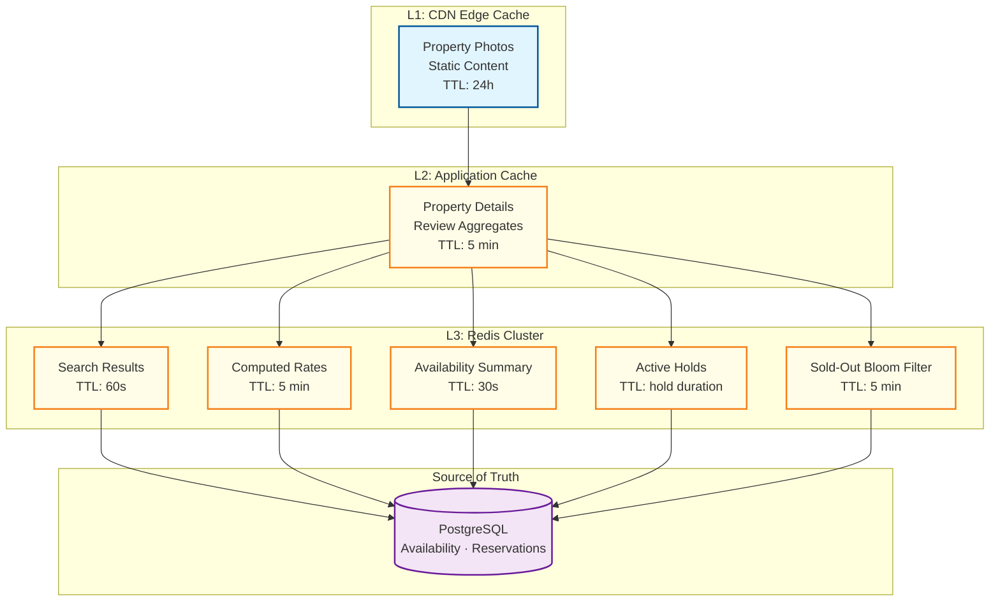

# Scalability & Reliability

## Horizontal Scaling Strategy

### Service-Level Scaling

| Service | Scaling Strategy | Scaling Trigger | Notes |
|---------|-----------------|-----------------|-------|
| **Search & Discovery** | Horizontal (stateless) | CPU > 70% or latency p99 > 2s | Add read replicas of search index |
| **Availability Service** | Sharded by property_id | Write contention or shard latency | Each shard handles a subset of properties |
| **Rate Management** | Horizontal (stateless) | Request rate | Compute-bound rate calculations |
| **Booking Orchestrator** | Horizontal (stateless) | Booking throughput | Saga state stored in DB, not in memory |
| **Payment Service** | Horizontal (stateless) | Transaction volume | Stateless with idempotency keys in DB |
| **Channel Manager** | Horizontal per channel | Channel sync backlog | Independent workers per channel to isolate failures |
| **Notification Service** | Horizontal (async workers) | Queue depth | Scale workers based on event bus lag |

### Availability Service Sharding

The availability service is the most write-intensive component. Sharding by property_id ensures that concurrent bookings for different properties never contend.

```
Sharding strategy:
  Shard key: property_id (hash-based)
  Number of shards: 32 (start), grow to 128

  Benefits:
    - Bookings for Hotel A and Hotel B go to different shards (no contention)
    - Each shard holds ~62,500 properties (2M active / 32)
    - Hot data per shard: ~2.8 GB (90 GB / 32) → fits in memory

  Shard assignment:
    shard_id = consistent_hash(property_id) % num_shards

  Rebalancing:
    - Consistent hashing minimizes data movement when adding shards
    - New shard: migrate properties gradually with dual-write during transition
```

### Search Index Scaling

```
Search index partitioning:
  Strategy: Geo-based partitioning (by region)
  Partitions: Europe, North America, Asia-Pacific, Middle East, etc.
  Each partition: 3-5 replicas for read throughput

  Read scaling: add replicas (each handles independent search queries)
  Write scaling: property updates route to correct partition by location
  Index refresh: near real-time (< 1s from property update to searchable)

  Query routing:
    - Single-region query (e.g., "Paris"): route to Europe partition
    - Multi-region query (e.g., "beach hotels"): fan out to all partitions
```

---

## Caching Strategy

### Cache Layers



### Cache Details

| Cache | Contents | TTL | Invalidation | Hit Rate Target |
|-------|----------|-----|-------------|-----------------|
| **Search results** | Paginated property lists for destination + dates | 60s | Time-based; short TTL because availability changes frequently | 60% |
| **Property details** | Static property info (name, description, photos, amenities) | 5 min | Event-based on property update | 95% |
| **Computed rates** | Rate calculations for property + room_type + dates | 5 min | Event-based on rate change | 70% |
| **Availability summary** | Rooms available per property/room_type for popular dates | 30s | Event-based on booking/cancellation | 50% |
| **Active holds** | Hold records with TTL for auto-expiry | Hold duration (10 min) | Auto-expire via Redis TTL | N/A |
| **Sold-out bloom filter** | Bloom filter of property_ids with zero availability for any date | 5 min | Rebuilt periodically | N/A |
| **Review aggregates** | Computed review scores per property | 1 hour | Event-based on new review | 95% |

### Cache Invalidation Strategy

```
Availability cache invalidation:
  Trigger: BookingConfirmed, BookingCancelled, HoldCreated, HoldExpired events
  Action: Delete cached availability for affected property + room_type + dates
  Scope: Only invalidate specific cache entries, not entire property

Rate cache invalidation:
  Trigger: RateChanged event (from property extranet)
  Action: Delete all cached rates for affected rate_plan + dates
  Cascade: Also invalidate search results containing this property

Property cache invalidation:
  Trigger: PropertyUpdated event
  Action: Delete cached property details
  Scope: CDN purge for photos, application cache purge for details
```

### Cache Stampede Prevention

```
Popular destinations (Paris, New York, London) during peak season
can generate thousands of concurrent cache misses.

Strategy: Lock-based refresh
  1. First request acquires refresh lock (Redis SETNX with 5s TTL)
  2. Lock holder: executes search query, populates cache, releases lock
  3. Other requests: wait 100ms, retry cache read
  4. If lock expires without refresh: next request becomes lock holder
  5. Stale-while-revalidate: serve previous cached result while refresh in progress

Additional measures:
  - Jittered TTLs: 60s ± 10s random to prevent synchronized expiry
  - Proactive warming: background job refreshes cache for top 1000 destinations
```

---

## Multi-Region Deployment

### Architecture

```
Region strategy:
  - Primary regions: US-East, EU-West, APAC-Southeast
  - Each region: full service deployment + regional database
  - Cross-region: asynchronous replication for property data and reviews

Data locality:
  - Properties assigned to nearest region based on physical location
  - European hotels → EU-West as primary; replicated to US-East and APAC
  - User requests routed to nearest region via DNS-based load balancing

Consistency model:
  - Availability/Reservations: single-region writes (property's assigned region)
    → Strong consistency within region
    → Cross-region reads served from replicas (eventual, < 1s lag)
  - Property data: multi-region read replicas (eventual consistency OK)
  - Reviews: multi-region read replicas (eventual consistency OK)
```

### Cross-Region Booking

```
Scenario: User in APAC books a hotel in EU

1. APAC API Gateway receives request
2. Route to EU-West (property's primary region) for booking path
3. EU-West processes booking (strong consistency)
4. Booking result replicated to APAC within 1s
5. Subsequent booking retrieval can be served from APAC replica

Latency impact:
  - Intra-region booking: p99 < 3s
  - Cross-region booking: p99 < 5s (additional ~100-200ms network latency)
  - Acceptable: booking is a one-time action, latency tolerance is higher
```

---

## Circuit Breakers

### Per-Channel Circuit Breakers

Each external channel (OTA) has an independent circuit breaker:

```
Circuit breaker configuration per channel:
  failure_threshold: 5 consecutive failures
  open_duration: 60 seconds
  half_open_requests: 3 (test requests when transitioning to half-open)
  timeout_per_request: 5 seconds
  monitored_errors: connection timeout, HTTP 5xx, rate limit (429)

States:
  CLOSED (normal): requests pass through
  OPEN (channel down): requests fail fast, queued for retry
  HALF_OPEN (testing): limited requests sent to test channel recovery

Impact of open circuit breaker:
  - Availability updates for that channel are queued (not lost)
  - When circuit closes: drain queue in order, applying only latest state per property
  - Inbound bookings from that channel: buffered at channel's end
```

### Payment Gateway Circuit Breaker

```
Payment is revenue-critical. Multi-gateway failover:

Primary gateway: Gateway A
Fallback gateway: Gateway B

Circuit breaker for Gateway A:
  failure_threshold: 3 (lower tolerance for payment)
  open_duration: 30 seconds (shorter recovery window)

On Gateway A circuit open:
  1. Route all payment requests to Gateway B
  2. Alert operations team
  3. Continue monitoring Gateway A health
  4. When Gateway A recovers: gradually shift traffic back (10%, 50%, 100%)
```

---

## Disaster Recovery

### Recovery Objectives

| System | RPO (Recovery Point Objective) | RTO (Recovery Time Objective) |
|--------|-------------------------------|-------------------------------|
| Reservations & Payments | 0 (no data loss) | < 5 minutes |
| Availability Matrix | < 1 second | < 2 minutes |
| Property Data | < 1 minute | < 10 minutes |
| Search Index | < 5 minutes | < 15 minutes (rebuild from DB) |
| Reviews | < 1 minute | < 10 minutes |

### Backup Strategy

```
Reservations database:
  - Synchronous replication to standby (RPO = 0)
  - Point-in-time recovery: continuous WAL archiving
  - Daily full backup to object storage (encrypted)
  - Weekly backup integrity verification (restore + checksum)

Availability database:
  - Synchronous replication to standby
  - Can be rebuilt from reservation records if needed
  - Recovery: replay all active reservations to reconstruct availability matrix

Search index:
  - Rebuild from property database (takes ~15 minutes for full reindex)
  - Incremental snapshots every hour
```

### Failover Procedures

```
Database failover (primary → standby):
  1. Health check detects primary failure (3 consecutive failed checks, 5s interval)
  2. Promote standby to primary (automatic, < 30s)
  3. Update connection endpoints
  4. Application reconnects (connection pool detects stale connections)
  5. Verify data consistency post-failover
  6. Alert operations team

Region failover (full region outage):
  1. DNS health check detects region failure
  2. Update DNS to redirect traffic to secondary region
  3. Secondary region promotes read replicas to primary
  4. Channel manager re-points to secondary region endpoints
  5. Verify all channels receiving updates
  6. Estimated total failover: 5-10 minutes
```

---

## Load Handling: Peak Season Strategy

### Traffic Patterns

```
Peak periods:
  - Summer holiday booking (March-April searches for June-August stays)
  - Year-end holiday (October-November searches for December stays)
  - Flash sales / promotional events

Traffic multiplier during peak: 3-5× normal
Booking volume during peak: 2-3× normal

Pre-peak preparation:
  1. Pre-scale all services to 2× normal capacity
  2. Warm caches for popular destinations and date ranges
  3. Pre-compute availability summaries for top 10,000 properties
  4. Load test at 5× expected peak
  5. Increase channel sync worker count
```

### Graceful Degradation

```
Under extreme load, degrade non-critical features:

Level 1 (load > 80% capacity):
  - Extend search cache TTL from 60s to 120s
  - Reduce search results from 25 to 15 per page
  - Disable review detail loading (show only aggregate score)

Level 2 (load > 90% capacity):
  - Serve cached search results even if slightly stale
  - Disable photo carousels (show only thumbnail)
  - Rate-limit property extranet (non-revenue-critical)

Level 3 (load > 95% capacity):
  - Queue non-urgent channel sync updates
  - Disable review submission
  - Limit search to top 1000 destinations only
  - Show "high demand" banner to set expectations

Never degrade:
  - Booking confirmation flow
  - Payment processing
  - Cancellation processing
  - Availability decrement accuracy
```

---

## Consistency Guarantees

| Data Type | Consistency Model | Justification |
|-----------|------------------|---------------|
| **Room availability (writes)** | Strong (SERIALIZABLE per-shard transactions) | Double-booking a physical room = real-world conflict requiring guest walk |
| **Room availability (search reads)** | Eventual (30-60s cache TTL) | Search results showing "1 room left" that's actually gone is acceptable UX friction, not a correctness failure |
| **Reservation records** | Strong (synchronous replication) | Lost reservation = lost revenue and broken guest trust |
| **Payment records** | Strong (synchronous replication + outbox) | Financial records must never be lost; outbox ensures at-least-once delivery |
| **Property details** | Eventual (< 5s propagation to search index) | Property updates (new photos, description change) can tolerate brief staleness |
| **Review scores** | Eventual (aggregated periodically) | New review changes aggregate score; propagation delay acceptable |
| **Channel sync** | Eventual (< 5s target) | Channels may briefly show stale availability; reconciliation job catches drift |
| **Rate changes** | Strong for booking path; eventual for search | Booking price must reflect current rate; search can show briefly stale cached rates |

---

## Auto-Scaling Policies

```
Search Service:
  Scale-out trigger:  CPU > 70% OR p99 latency > 2s for 3 minutes
  Scale-in trigger:   CPU < 30% AND p99 latency < 800ms for 15 minutes
  Min instances:      8 (handles baseline traffic)
  Max instances:      40 (handles 5× peak)
  Cool-down:          3 minutes (prevent oscillation)

Availability Service:
  Shards are NOT auto-scaled (stateful, sharded by property_id).
  Vertical scaling: upgrade shard instances when CPU > 80% sustained.
  Horizontal: add new shards via consistent hash rebalancing (manual, planned).
  Read replicas: auto-add replica when read latency p99 > 200ms.

Booking Orchestrator:
  Scale-out trigger:  Queue depth > 100 pending bookings for 2 minutes
  Scale-in trigger:   Queue depth < 10 for 10 minutes
  Min instances:      4
  Max instances:      20

Channel Manager Workers:
  Scale-out trigger:  Consumer lag > 5,000 messages per partition
  Scale-in trigger:   Consumer lag < 500 for 10 minutes
  Min instances:      4 (one per major channel)
  Max instances:      16

Rate Management:
  Scale-out trigger:  Request rate > 2,000/s OR CPU > 75%
  Scale-in trigger:   Request rate < 500/s AND CPU < 30%
  Min instances:      4
  Max instances:      16
```

---

## Capacity Planning

```
FUNCTION projectCapacity(current_metrics, growth_rate, planning_horizon_months):
    // Project forward from current metrics
    projected_searches = current_metrics.daily_searches × (1 + growth_rate) ^ planning_horizon_months
    projected_bookings = projected_searches / 50   // maintain 50:1 ratio

    // Compute requirements
    search_instances = CEIL(projected_searches / 86400 / 500)  // 500 QPS per instance
    availability_shards = CEIL(projected_bookings / 86400 / 50)  // 50 TPS per shard
    redis_memory_gb = projected_searches / 86400 × 0.001 × 60  // cache entry × TTL
    db_storage_tb = projected_bookings × 365 × 2 KB / 1e12     // annual reservation growth

    // Cost projection
    monthly_compute = (search_instances × 400 + availability_shards × 500 +
                       booking_instances × 400 + channel_workers × 300)
    monthly_storage = (db_storage_tb × 200 + redis_memory_gb × 10 +
                       photo_storage_tb × 20)

    RETURN {
        traffic: { searches: projected_searches, bookings: projected_bookings },
        infrastructure: { search_instances, availability_shards, redis_memory_gb, db_storage_tb },
        cost: { compute: monthly_compute, storage: monthly_storage }
    }
```

---

## Tiered Storage Architecture

```
Tier 1 — Hot (Redis + in-memory):
  Data: Active holds, 90-day availability matrix, search cache, rate cache
  Access: Sub-millisecond reads
  Cost: Highest ($10/GB/mo)
  Size: ~200 GB

Tier 2 — Warm (PostgreSQL primary + replicas):
  Data: Active reservations (< 90 days post-checkout), full availability calendar,
        guest records, property records, rate plans
  Access: Single-digit millisecond reads
  Cost: Medium ($0.20/GB/mo)
  Size: ~2 TB

Tier 3 — Cold (Archive database / object storage):
  Data: Completed reservations (90 days–7 years), historical availability,
        audit logs, payment records (compliance retention)
  Access: 100ms+ reads (acceptable for historical queries)
  Cost: Low ($0.02/GB/mo)
  Size: ~10 TB

Tier 4 — Glacier (long-term compliance):
  Data: Payment records beyond 3 years, anonymized analytics, backup archives
  Access: Minutes to hours (retrieval on demand)
  Cost: Lowest ($0.004/GB/mo)
  Size: ~5 TB
```

### Data Lifecycle Transitions

| Data Type | Hot → Warm | Warm → Cold | Cold → Glacier |
|-----------|-----------|-------------|----------------|
| **Reservations** | After checkout | 90 days post-checkout | 3 years (anonymized) |
| **Availability matrix** | Past dates expire from cache | Monthly archive of past dates | After 1 year |
| **Payment records** | After capture completes | 90 days | 3 years (retained 7 years total) |
| **Search history** | 24 hours | Never (deleted) | N/A |
| **Guest PII** | Active session | Account inactive 90 days | On deletion request |
| **Reviews** | Always (read-heavy) | Never | Never (permanent) |
| **Audit logs** | 7 days | 90 days | 1 year |

---

## Data Retention and Archival

```
Active data:
  - Reservations: active + 90 days post-checkout
  - Availability: current date to +365 days
  - Reviews: indefinite (always visible)
  - Property data: indefinite while active

Archive:
  - Completed reservations > 90 days: move to archive database
  - Archive is queryable but with higher latency (acceptable)
  - Past availability data: archived monthly for analytics
  - Payment records: retain 7 years (financial compliance)

Deletion:
  - Guest PII: delete on account closure (GDPR right to erasure)
  - Anonymize archived reservation data after PII deletion
  - Retain anonymized data for analytics indefinitely
```
