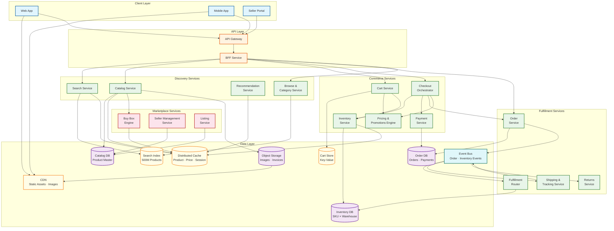
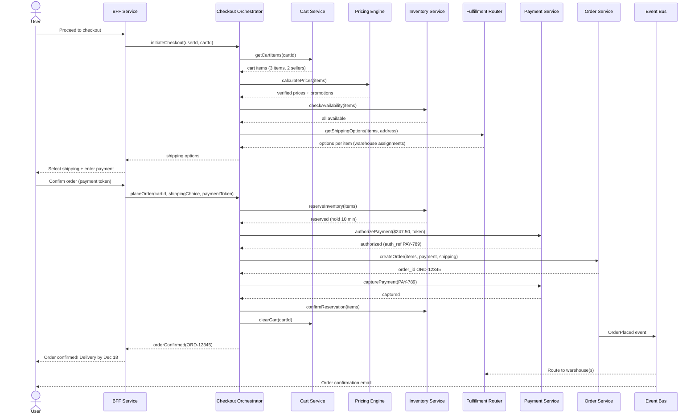
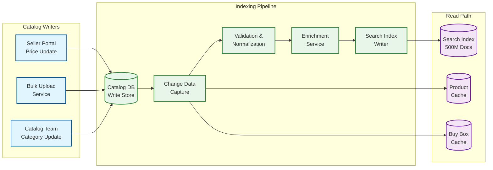
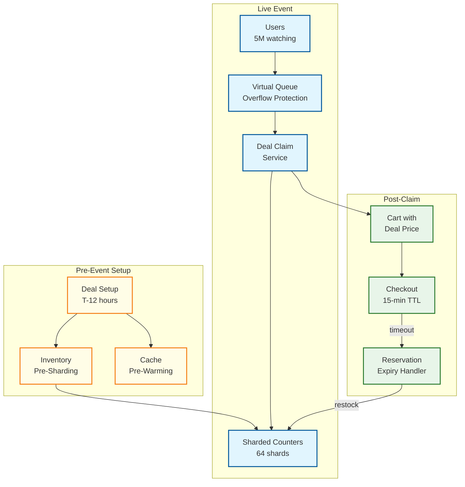
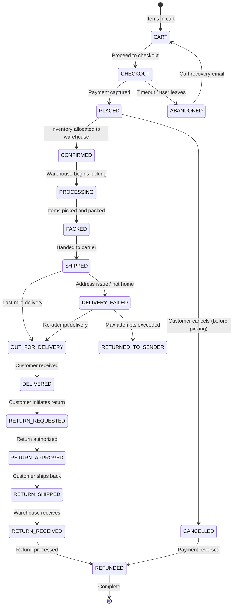

# High-Level Design

## Architecture Overview

The Amazon-scale e-commerce platform follows a **CQRS pattern** for the catalog (write-optimized catalog store + read-optimized search index), an **event-driven pattern** for order lifecycle, and a **cell-based deployment** model for blast-radius isolation. The architecture is shaped by three realities: (1) the catalog is massive (500M+ SKUs) and continuously updated by millions of sellers; (2) inventory is distributed across 200+ fulfillment centers; (3) traffic spikes 10-15× during flash sales.



---

## Service Responsibilities

| Service | Responsibility | Key Characteristics |
|---------|---------------|---------------------|
| **Search Service** | Full-text search, autocomplete, faceted filtering, ML ranking, sponsored results | Stateless; reads from search index; high QPS (58K peak) |
| **Catalog Service** | Product CRUD, variation management, attribute normalization, image pipeline | Write-optimized; publishes change events to index |
| **Recommendation Service** | Collaborative filtering, "frequently bought together," personalized suggestions | ML model serving; precomputed + real-time signals |
| **Browse & Category Service** | Category tree navigation, filtered browse pages, best-seller lists | Cached category hierarchy; pre-aggregated rankings |
| **Cart Service** | Add/remove/update cart items, persist across sessions, guest-to-auth merge | Key-value store; high write rate; session-aware |
| **Checkout Orchestrator** | Coordinate inventory reservation → pricing → payment → order creation | Saga coordinator; idempotent; compensating transactions |
| **Pricing & Promotions Engine** | Calculate final price (base + promotions + coupons + shipping), validate deals | Stateless rule engine; high call rate from cart and search |
| **Inventory Service** | Track stock per SKU per warehouse, soft/hard reservation, restock events | Strongly consistent for reservations; sharded by SKU |
| **Payment Service** | Tokenized card processing, wallet, gift cards, refunds | PCI-DSS scoped; idempotent charge operations |
| **Buy Box Engine** | Determine which seller offer wins the default purchase button | ML model: price, fulfillment speed, seller score, stock reliability |
| **Seller Management** | Seller onboarding, verification, performance tracking, account management | Moderate write rate; compliance workflows |
| **Listing Service** | Seller product listing, bulk upload, catalog matching, variation mapping | High write rate from sellers; feeds into Catalog Service |
| **Order Service** | Order creation, status tracking, modification, cancellation | Event sourced; publishes to fulfillment pipeline |
| **Fulfillment Router** | Select optimal warehouse(s) per order based on proximity, stock, cost | Optimization algorithm; may split orders across warehouses |
| **Shipping & Tracking** | Carrier selection, label generation, real-time tracking updates | Integrates with carrier APIs; event-driven status updates |
| **Returns Service** | Return authorization, refund calculation, restocking workflow | Reverse logistics; feeds back into inventory |

---

## Data Flow 1: Browse-to-Buy Journey

```
Customer searches: "wireless noise cancelling headphones"

1. API Gateway → BFF → Search Service
2. Search Service queries search index:
   - Full-text match: "wireless" AND "noise cancelling" AND "headphones"
   - Faceted filters: category=Electronics>Audio>Headphones
   - ML ranking: relevance × conversion probability × personalization
   - Sponsored results: inject 2-3 sponsored products at positions 1, 4, 8
   - Result: 50 products with buy box winner per product
3. BFF enriches: add pricing (from cache), delivery estimates, Prime badges
4. Return search results page to customer

--- Customer clicks product ---

5. BFF → Catalog Service: getProduct(productId)
6. Catalog Service:
   - Product data from cache (95% hit rate) or Catalog DB
   - Buy Box Engine: determine winning seller offer
   - Pricing Engine: calculate final price with active promotions
   - Inventory Service: check availability + delivery estimate
   - Reviews: aggregate rating + top 5 reviews
7. Return product detail page

--- Customer adds to cart ---

8. BFF → Cart Service: addItem(userId, productId, sellerId, quantity)
9. Cart Service:
   - Inventory Service: verify availability (soft check, not reservation)
   - Pricing Engine: get current price (cart always shows real-time prices)
   - Write to cart store (key-value)
   - Return updated cart with price totals

--- Customer proceeds to checkout ---

10. BFF → Checkout Orchestrator: initiateCheckout(userId, cartId)
11. Checkout Orchestrator (saga):
    Step 1: Validate cart items (re-check prices and availability)
    Step 2: Calculate shipping options per item (Fulfillment Router)
    Step 3: Customer selects shipping + enters payment
    Step 4: Hard inventory reservation (Inventory Service)
    Step 5: Payment authorization (Payment Service)
    Step 6: Create order (Order Service)
    Step 7: Publish OrderPlaced event to Event Bus
12. If Step 4 fails (out of stock): notify customer, suggest alternatives
13. If Step 5 fails (payment declined): release inventory reservation, notify
14. On success: return order confirmation with estimated delivery dates

--- Post-order ---

15. Event Bus → Fulfillment Router: select warehouse(s), create shipment(s)
16. Event Bus → Shipping Service: generate labels, schedule carrier pickup
17. Event Bus → Notification Service: send order confirmation email
18. Warehouse picks, packs, ships → tracking updates flow back through Event Bus
```

---

## Data Flow 2: Checkout Sequence Diagram



---

## Data Flow 3: Catalog Indexing Pipeline (CQRS Write → Read)



**Pipeline stages:**
1. **Change Data Capture (CDC)**: Streams row-level changes from Catalog DB in near-real-time (~100ms latency)
2. **Validation & Normalization**: Standardize attributes (e.g., "Blk" → "Black"), validate required fields, check for policy violations
3. **Enrichment**: Attach computed fields—category predictions, embedding vectors for semantic search, image quality scores
4. **Index Writer**: Atomic document updates to search index; handles partial updates (price-only change updates single field)

**Latency budget**: Seller updates price → visible in search within **< 5 minutes** (SLO). Typical: 30-90 seconds.

---

## Data Flow 4: Flash Sale Architecture



---

## Data Flow 5: Seller Listing Integration

```
Seller submits new product listing via Seller Portal:

1. Listing Service receives product data (title, description, images, price, UPC)
2. Catalog Matching Engine:
   a. UPC/EAN lookup → exact product match (99.9% confidence)
   b. Title + brand + attributes fuzzy match (85-95% confidence)
   c. Image perceptual hash comparison (additional signal)
   d. If high-confidence match → link offer to existing product
   e. If low-confidence → create new product (pending review)
3. Image Processing Pipeline:
   a. Upload to object storage
   b. Generate thumbnails (5 sizes for responsive display)
   c. Background removal + quality check
   d. CDN pre-warm for deal products
4. Pricing Validation:
   a. Check price is within reasonable range (not 90% below market)
   b. Validate currency and tax configuration
   c. Compute initial buy box score
5. Listing goes ACTIVE → triggers CDC → updates search index

Daily volume: ~5M new/updated listings from 2M sellers
```

---

## Order Lifecycle State Diagram



---

## Key Architectural Decisions

| Decision | Choice | Rationale |
|----------|--------|-----------|
| **Catalog architecture** | CQRS — write to Catalog DB, async index to Search Index | 500M products with continuous seller updates; search index is read-optimized, catalog DB is write-optimized |
| **Cart storage** | Distributed key-value store with replication | High write rate (580/sec), low latency (<50ms), must survive node failures; relational DB is overkill |
| **Checkout pattern** | Saga with compensating transactions | Inventory reservation + payment + order creation spans multiple services; any step can fail |
| **Inventory reservation** | Two-phase: soft check at cart, hard reserve at checkout | Soft check prevents bad UX (adding OOS item); hard reserve prevents overselling |
| **Search ranking** | Inverted index + ML reranking | Inverted index for fast retrieval; ML model for relevance × conversion × personalization |
| **Buy box** | ML model with price, fulfillment, seller score | Single algorithm drives 80% of sales; must be fair, transparent, and resistant to gaming |
| **Event streaming** | Event bus for order lifecycle | Decouples order placement from fulfillment, shipping, notifications; enables async processing |
| **Cell-based deployment** | Independent cells per region/shard | Blast-radius isolation: failure in one cell does not cascade to others; critical for Prime Day |
| **Image delivery** | Object storage + CDN | 2 PB of images; CDN serves 95%+ of image requests; origin bandwidth would be prohibitive |
| **Fulfillment routing** | Optimization algorithm per order | Multi-factor: proximity (speed), stock (availability), cost (shipping), load (warehouse capacity) |

---

## Technology Choices

| Component | Technology | Rationale |
|-----------|-----------|-----------|
| **Catalog DB** | Distributed document store | Flexible schema for 500M products with varying attributes per category |
| **Search Index** | Inverted index cluster | Full-text search + faceted filtering + real-time updates at 58K QPS |
| **Cart Store** | Distributed key-value store | Sub-ms reads/writes, high availability, auto-partitioning |
| **Order DB** | Relational DB (sharded) | ACID for orders and payments; strong consistency required |
| **Inventory DB** | Relational DB (sharded by SKU) | Strong consistency for reservation; optimistic locking for concurrent updates |
| **Event Bus** | Distributed log broker | Durable, ordered event streaming for order lifecycle; replay capability |
| **Cache** | Distributed in-memory cache | Product data, pricing, session data; sub-ms reads, 95%+ hit rate |
| **Object Storage** | Cloud object storage | Product images, invoices; 2 PB+, cost-effective |
| **CDN** | Global CDN | Static assets, product images; reduces origin load by 95% |
| **API Gateway** | Rate limiting, auth, routing | Protect backend from abuse; support 230K+ req/sec peak |

---

## AI/ML Integration Points

| Integration Point | Model Type | Latency Budget | Purpose |
|-------------------|-----------|----------------|---------|
| **Search Ranking** | Two-tower retrieval + cross-encoder reranker | 15ms (rerank top 200) | Maximize relevance × conversion probability |
| **Semantic Search** | Dense vector embeddings (product + query) | 10ms (ANN lookup) | Handle natural language queries ("something for a rainy day hike") |
| **Buy Box Scoring** | Gradient-boosted decision tree | 5ms per product | Select optimal seller offer |
| **Personalized Recommendations** | Collaborative filtering + session-based transformer | 20ms | "Frequently bought together," "inspired by your browsing" |
| **Dynamic Pricing** | Demand-forecasting regression model | Batch (hourly) | Suggest optimal price points to sellers |
| **Fraud Detection** | Ensemble (rules + gradient boosting + neural) | 50ms per transaction | Real-time fraud scoring at checkout |
| **Review Quality** | NLP classifier + generative AI detector | Async (on submission) | Detect fake, incentivized, or AI-generated reviews |
| **Delivery Estimation** | Historical delivery time regression | 10ms | Predict delivery date by zip code × carrier × warehouse |
| **Category Prediction** | Multi-label text classifier | 5ms | Auto-categorize seller listings |
| **Visual Search** | CNN-based image embedding + ANN retrieval | 50ms | "Search by photo" feature |

---

## Cross-Service Communication Patterns

| Pattern | Used Between | Protocol | Rationale |
|---------|-------------|----------|-----------|
| **Synchronous RPC** | BFF → Search, Cart, Checkout | gRPC with timeout + retry | User-facing latency-sensitive paths |
| **Async Events** | Order Service → Fulfillment, Shipping, Notifications | Event bus (pub/sub) | Decouple placement from fulfillment; replay on failure |
| **Request-Reply via Queue** | Checkout → Payment Gateway | Message queue with correlation ID | Payment calls are slow (800ms+); queue isolates latency |
| **Batch Processing** | Catalog → Search Index | CDC + stream processing | High-throughput catalog updates without impacting read path |
| **Cache-Aside** | All services → Distributed Cache | Cache lookup → DB fallback → cache write | 95% cache hit rate reduces DB load by 20× |
| **Outbox Pattern** | Checkout Orchestrator → Event Bus | Write to outbox table → poll and publish | Guarantees event publication even if event bus is temporarily down |

---

## Search Architecture Detail

```mermaid
flowchart LR
    subgraph Query["Query Path"]
        Q[User Query<br/>"wireless headphones"]
        QU[Query Understanding<br/>Spell · Synonyms · Intent]
        RET[Retrieval<br/>BM25 + Vector ANN]
        RANK[ML Reranker<br/>Top 200 → Final 48]
        BIZ[Business Rules<br/>Sponsored · Diversity]
    end

    subgraph Index["Index Infrastructure"]
        INV_IDX[(Inverted Index<br/>500M docs)]
        VEC_IDX[(Vector Index<br/>Dense Embeddings)]
        FACETS[(Facet Store<br/>Pre-Aggregated)]
    end

    Q --> QU --> RET
    RET --> INV_IDX
    RET --> VEC_IDX
    RET --> RANK --> BIZ
    BIZ --> FACETS

    classDef query fill:#e1f5fe,stroke:#01579b,stroke-width:2px
    classDef index fill:#f3e5f5,stroke:#6a1b9a,stroke-width:2px

    class Q,QU,RET,RANK,BIZ query
    class INV_IDX,VEC_IDX,FACETS index
```

**Search latency budget allocation:**

| Stage | Latency | Purpose |
|-------|---------|---------|
| Query understanding | 5ms | Spell correction, synonym expansion, intent classification |
| Retrieval (BM25 + ANN) | 20ms | Fetch ~50K candidates from inverted + vector index |
| Filtering | 10ms | Apply category, price, availability filters → ~6K candidates |
| ML scoring | 30ms | Score top 200 candidates with cross-encoder model |
| Business rules | 5ms | Inject sponsored results, apply diversity, boost Prime |
| Response assembly | 10ms | Fetch buy box, pricing, facets from cache |
| **Total p50** | **~80ms** | Well within 300ms SLO |
