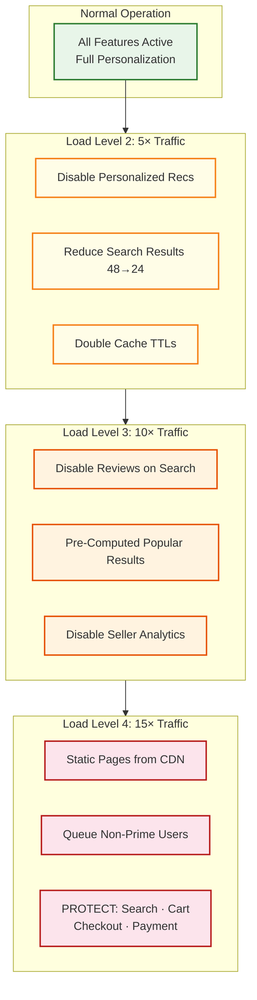
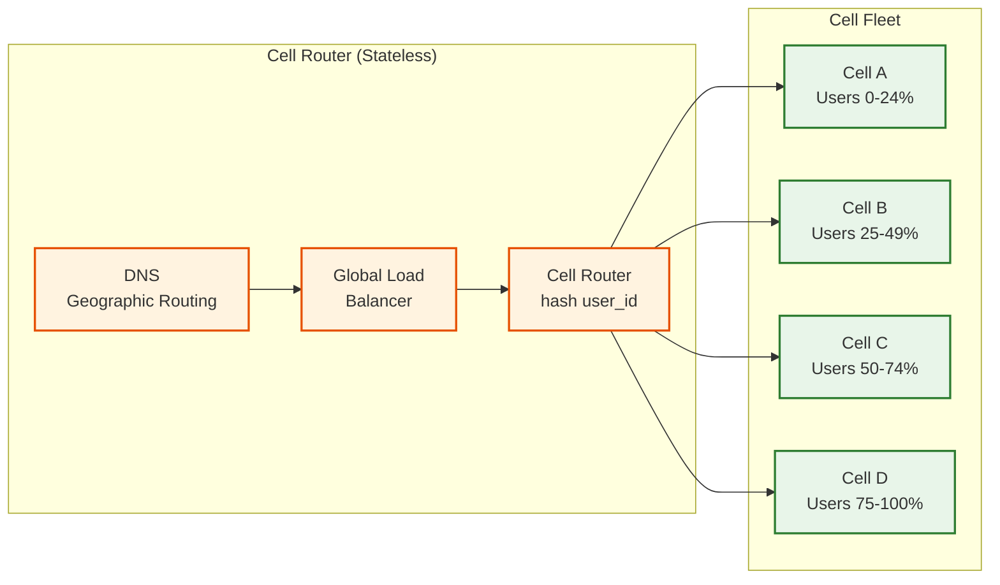

# Scalability & Reliability

## Cell-Based Architecture

### Why Cells?

At Amazon's scale, a single monolithic deployment region is a single point of failure. Cell-based architecture partitions the system into independent, self-contained units (cells), each serving a subset of customers.

```
Cell Architecture:

Cell A (US-East, customers A-M)       Cell B (US-East, customers N-Z)
┌─────────────────────────────┐       ┌─────────────────────────────┐
│  API Gateway                │       │  API Gateway                │
│  All Microservices          │       │  All Microservices          │
│  Databases (sharded)        │       │  Databases (sharded)        │
│  Cache Layer                │       │  Cache Layer                │
│  Event Bus                  │       │  Event Bus                  │
└─────────────────────────────┘       └─────────────────────────────┘

Cell C (US-West, customers A-M)       Cell D (EU-West, customers A-Z)
┌─────────────────────────────┐       ┌─────────────────────────────┐
│  API Gateway                │       │  API Gateway                │
│  All Microservices          │       │  All Microservices          │
│  Databases (sharded)        │       │  Databases (sharded)        │
│  Cache Layer                │       │  Cache Layer                │
│  Event Bus                  │       │  Event Bus                  │
└─────────────────────────────┘       └─────────────────────────────┘
```

### Cell Properties

| Property | Description |
|----------|-------------|
| **Independence** | Each cell has its own full stack; failure in Cell A does not affect Cell B |
| **Routing** | A cell router assigns customers to cells (hash of user_id or geographic routing) |
| **Blast radius** | A bad deployment or bug affects only one cell (e.g., 10% of customers), not the entire platform |
| **Scalability** | Add new cells to handle more customers; each cell has a fixed capacity ceiling |
| **Data locality** | Customer data (cart, orders) lives in the assigned cell; catalog and inventory are globally replicated |

### Global vs. Cell-Local Data

| Data | Scope | Rationale |
|------|-------|-----------|
| Product catalog | Global (replicated to all cells) | All customers see the same products |
| Search index | Global (replicated) | Search results must be consistent |
| Inventory | Global (sharded by SKU) | Inventory is cross-customer |
| Customer cart | Cell-local | Customer-specific, high write rate |
| Orders | Cell-local | Customer-specific, strong consistency needed |
| User accounts | Cell-local | Customer-specific |
| Sessions | Cell-local | Low-latency access required |

---

## Horizontal Scaling Strategy

### Service-Level Scaling

| Service | Scaling Dimension | Strategy |
|---------|------------------|----------|
| **Search** | Query throughput (58K QPS peak) | Shard search index by product_id range; add read replicas per shard; each shard handles a subset of the catalog |
| **Catalog** | Read throughput (230K page views/sec) | Cache-first with 95% hit rate; origin reads are 5% → ~11.5K/sec, easily served by a modest DB cluster |
| **Cart** | Write throughput (580 writes/sec avg) | Key-value store auto-partitions by cart_id; each partition handles ~100 writes/sec |
| **Inventory** | Update throughput (50K/sec) | Shard by product_id; hot SKUs isolated to dedicated shards |
| **Order** | Write throughput (115 orders/sec avg) | Shard by user_id; even distribution across shards |
| **Checkout** | Concurrent checkouts | Stateless orchestrator; scale horizontally; idempotency key prevents duplicates |
| **Payment** | Transaction throughput | Stateless; scale behind load balancer; payment gateway is the external Slowest part of the process |

### Database Sharding

```
Inventory DB: Shard by product_id (consistent hashing)
├── Shard 0:  products 0x0000... to 0x3FFF...
├── Shard 1:  products 0x4000... to 0x7FFF...
├── Shard 2:  products 0x8000... to 0xBFFF...
└── Shard 3:  products 0xC000... to 0xFFFF...

Order DB: Shard by user_id (consistent hashing)
├── Shard 0:  users 0x0000... to 0x3FFF...
├── Shard 1:  users 0x4000... to 0x7FFF...
├── ...
└── Each shard: ~1M users, ~100M orders

Cross-shard queries (e.g., "all orders for product X"):
→ Scatter-gather to all order shards (expensive, done async for analytics only)
→ Real-time queries always go through the correct shard via partition key
```

---

## Caching Strategy

### Multi-Layer Cache Architecture

```
Layer 1: CDN Edge Cache (images, static assets)
├── Hit rate: >95% for images, >80% for product pages
├── TTL: 24 hours for images, 5 minutes for product pages
└── Invalidation: purge on product update

Layer 2: Application-Level Distributed Cache
├── Product data cache:     TTL 5 min,  hit rate 95%
├── Search result cache:    TTL 3 min,  hit rate 70%
├── Pricing cache:          TTL 1 min,  hit rate 90%
├── Buy box cache:          TTL 15 min, hit rate 95%
├── Session/cart cache:     TTL 30 days, hit rate 99%
└── Review aggregate cache: TTL 1 hour, hit rate 98%

Layer 3: Database Query Cache
├── Prepared statement cache per DB connection
└── Buffer pool / page cache within DB engine
```

### Cache Invalidation Strategy

| Data Type | Invalidation Method | Rationale |
|-----------|-------------------|-----------|
| Product data | Event-driven: seller updates → invalidate cache key | Seller price changes must reflect quickly |
| Search index | Async rebuild: catalog change events → index updater | Full re-indexing is too slow; incremental updates |
| Inventory counts | Write-through: inventory update → update cache | Stale inventory = overselling |
| Buy box | Event-driven + periodic (15 min) | Price changes trigger immediate recalc; periodic catches edge cases |
| Reviews | Eventual: new review → async aggregate recalculation | Review aggregates don't need real-time updates |

### Cache Stampede Prevention

For popular products, cache expiration can trigger thousands of simultaneous DB queries:

```
Product "iPhone" cache expires at T=100
→ 5,000 concurrent requests all miss cache
→ 5,000 identical DB queries
→ DB overload

Solution: Lock-based refresh
→ First request acquires refresh lock
→ Other 4,999 requests wait (or serve stale data with stale-while-revalidate)
→ First request fetches from DB, updates cache, releases lock
→ Waiting requests get fresh cached data
```

---

## Prime Day Scaling Strategy

### Pre-Event Preparation (Weeks Before)

| Activity | Timeline | Purpose |
|----------|----------|---------|
| Capacity testing | T-6 weeks | Load test at 15× normal traffic; identify bottlenecks |
| Pre-provision infrastructure | T-2 weeks | Add compute capacity; expand database shards |
| Cache warming | T-24 hours | Pre-populate caches for deal products |
| Inventory pre-sharding | T-12 hours | Partition flash deal inventory into 64+ shards |
| Feature flag preparation | T-1 hour | Identify features to disable under extreme load |
| War room setup | T-0 | Real-time monitoring with instant rollback capability |

### Progressive Load Shedding

Under extreme load, the system sheds non-critical features to protect the core purchase path:

```
Load Level 1 (Normal: 1×):     All features active
Load Level 2 (High: 5×):       Disable personalized recommendations
                                Reduce search result count (48 → 24)
                                Increase cache TTLs by 2×
Load Level 3 (Critical: 10×):  Disable product reviews on search pages
                                Serve pre-computed "popular" search results
                                Disable seller analytics dashboard
Load Level 4 (Emergency: 15×): Disable all non-purchase features
                                Static product pages from CDN
                                Queue non-Prime customers
                                PROTECT: search, cart, checkout, payment at all costs
```

### Auto-Scaling Configuration

```
Search Service:
├── Normal:    100 instances
├── Prime Day: 800 instances (pre-provisioned)
├── Auto-scale trigger: CPU > 60% OR latency p99 > 200ms
├── Scale-up speed: 50 instances per minute
└── Cool-down: 5 minutes

Checkout Service:
├── Normal:    50 instances
├── Prime Day: 400 instances (pre-provisioned)
├── Auto-scale trigger: CPU > 50% OR latency p99 > 1s
├── Scale-up speed: 30 instances per minute
└── Cool-down: 3 minutes (more aggressive to protect revenue)
```

---

## Multi-Region Deployment

### Active-Active for Reads, Active-Passive for Writes

```
Region: US-East (Primary)
├── Read: serves US-East customers directly
├── Write: handles all order/payment writes for US customers
└── Replication: async to US-West (disaster recovery)

Region: US-West (Secondary)
├── Read: serves US-West customers (local cache + read replicas)
├── Write: forwarded to US-East primary (adds ~30ms latency)
└── Promotion: can become primary if US-East fails (RPO < 1 min)

Region: EU-West (Independent)
├── Read/Write: fully independent for EU customers (GDPR data residency)
├── Catalog: replicated from US (product data is global)
└── Orders: local (EU customer data stays in EU)
```

### Cross-Region Catalog Replication

Product catalog is replicated globally (all regions see the same products):

```
Catalog change in US-East:
1. Seller updates price → Catalog DB (US-East primary)
2. Change event published to cross-region replication stream
3. US-West receives event within 200ms → updates local catalog replica
4. EU-West receives event within 500ms → updates local catalog replica
5. Search index in each region updates independently (< 5 min total propagation)
```

---

## Reliability Patterns

### Circuit Breaker for External Dependencies

```
Payment Gateway Circuit Breaker:
├── CLOSED (normal):   all requests pass through
├── OPEN (tripped):    after 5 failures in 30s → reject immediately, return error
├── HALF-OPEN (test):  after 30s cooldown → allow 1 test request
│   ├── Success → CLOSED
│   └── Failure → OPEN (reset cooldown)
└── Fallback:          queue payment for async retry; hold order in PENDING_PAYMENT
```

### Saga Compensation for Checkout Failures

```
Checkout Saga (forward path):
1. Reserve inventory       ✓
2. Authorize payment       ✓
3. Create order            ✗ (Order DB timeout)

Compensation (reverse path):
3. (no order to undo)
2. Void payment authorization
1. Release inventory reservation

Result: Customer sees "Order could not be placed. Please try again."
        No charge, no inventory held.
```

### Dead Letter Queue for Failed Events

```
Order event processing:
1. OrderPlaced event → Fulfillment Router
2. Fulfillment Router fails (timeout to warehouse API)
3. Event goes to Dead Letter Queue (DLQ) after 3 retries
4. DLQ consumer alerts operations team
5. Manual investigation → fix and replay, or cancel order

DLQ monitoring:
├── Alert if DLQ depth > 100 messages
├── Alert if any message age > 15 minutes
└── Dashboard: DLQ depth, processing rate, error categories
```

### Graceful Degradation Matrix



| Component Failure | Impact | Degraded Behavior |
|-------------------|--------|-------------------|
| Search index down | Cannot search products | Serve cached search results (5 min stale); show category browse pages |
| Cart store down | Cannot modify cart | Serve last-known cart from backup; queue cart operations for replay |
| Inventory service down | Cannot verify stock | Show "availability may vary" warning; allow checkout (reconcile later) |
| Payment gateway down | Cannot process payment | Queue order as PENDING_PAYMENT; process when gateway recovers |
| Recommendation service down | No recommendations | Hide recommendation widgets; show "popular products" fallback |
| Review service down | No reviews on product page | Show cached aggregate rating; hide individual reviews |
| CDN failure | Images not loading | Serve compressed thumbnails from origin; lazy-load full images |

---

## Chaos Engineering and Resilience Testing

### Steady-State Hypothesis Testing

```
Chaos experiments run continuously in production (on a single cell):

Experiment 1: Cache Node Failure
├── Action: Kill 1 of 10 cache nodes in Cell A
├── Expected: Cache hit rate drops from 95% to ~85% temporarily;
│             DB handles increased load; p99 latency stays < 500ms
├── Blast radius: Cell A only (~10% of customers)
└── Auto-recovery: Replacement node joins cluster within 60s

Experiment 2: Inventory DB Shard Failure
├── Action: Block network to 1 of 4 inventory DB shards
├── Expected: Products on that shard show "check availability at checkout";
│             other shards unaffected; failover to read-replica within 30s
├── Blast radius: ~25% of product catalog for availability display
└── Auto-recovery: Failover to secondary; promote read-replica to primary

Experiment 3: Payment Gateway Timeout
├── Action: Inject 5s latency to payment gateway calls
├── Expected: Circuit breaker opens after 5 failures in 30s;
│             orders queue as PENDING_PAYMENT; no customer double-charges
├── Blast radius: New checkouts delayed; existing orders unaffected
└── Auto-recovery: Circuit breaker half-opens after 30s; tests with single request

Experiment 4: Event Bus Consumer Lag
├── Action: Pause fulfillment consumer for 5 minutes
├── Expected: DLQ depth grows; orders stay in PLACED status;
│             no data loss; consumer catches up on resume
├── Blast radius: Fulfillment processing delayed by 5 min
└── Auto-recovery: Consumer auto-resumes; processes backlog at 2× speed
```

### Game Days (Pre-Prime Day)

| Game Day Exercise | Frequency | Scope |
|------------------|-----------|-------|
| **Single-cell failure** | Monthly | Fail one cell; verify traffic routes to healthy cells |
| **Region failover** | Quarterly | Promote secondary region to primary; measure RPO/RTO |
| **Dependency failure cascade** | Monthly | Kill search + recommendations; verify checkout still works |
| **Load test at 15×** | T-6 weeks before Prime Day | Synthetic traffic at expected Prime Day peak |
| **Full Prime Day rehearsal** | T-2 weeks | Complete deal pipeline, inventory sharding, queue activation |

---

## Traffic Routing and Cell Assignment

### Cell Router Design



**Routing rules:**
- Authenticated users: `cell = hash(user_id) % cell_count` → deterministic assignment
- Guest users: assigned by session cookie → sticky to one cell for session duration
- Cell evacuation: if a cell is unhealthy, its users are redistributed to remaining cells via config change (< 30s propagation)

### Canary Cell Deployments

```
Deployment rollout using cells:
1. Deploy to canary cell (Cell A, ~10% of traffic)
2. Monitor for 30 minutes: latency, error rate, business metrics
3. Compare Cell A metrics against Cells B, C, D (baseline)
4. If metrics within tolerance → deploy to Cell B
5. Repeat for Cells C, D with 15-minute soak per cell
6. Total rollout time: ~2 hours for safe deployment to 100% of traffic
7. Rollback: revert single cell in < 2 minutes; other cells unaffected
```

---

## Data Backup and Recovery

| Data Store | Backup Strategy | RPO | RTO |
|------------|----------------|-----|-----|
| Order DB | Continuous replication + hourly snapshots | < 1 minute | < 15 minutes |
| Catalog DB | Continuous replication + daily snapshots | < 5 minutes | < 30 minutes |
| Inventory DB | Continuous replication + hourly snapshots | < 1 minute | < 10 minutes |
| Cart Store | Multi-replica (no separate backup needed) | 0 (replicated) | 0 (auto-failover) |
| Search Index | Rebuildable from Catalog DB | N/A | < 2 hours (full rebuild) |
| Event Bus | Multi-replica with 7-day retention | 0 (replicated) | 0 (auto-failover) |

---

## Hot Partition Detection and Mitigation

### Problem: Celebrity Product / Viral SKU

When a product goes viral (celebrity endorsement, trending social media), a single inventory shard receives disproportionate traffic:

```
Normal: SKU-12345 gets 10 reads/sec across all shards
Viral:  SKU-12345 gets 50,000 reads/sec → single shard overloaded

Detection:
├── Monitor per-shard request rates (1-min windows)
├── Alert if any shard exceeds 5× average load
└── Auto-detect "hot key" pattern: single key > 1% of shard traffic

Mitigation (automatic):
1. Replicate hot product data to a dedicated read cache (TTL 10s)
2. Route reads to cache; writes still go to primary shard
3. For inventory writes: if optimistic lock retry rate > 10%,
   dynamically split inventory across micro-shards (similar to flash sale)
4. When traffic subsides (< 2× average for 30 min), consolidate back
```

### Capacity Planning Formula

```
For each service, maintain headroom:
├── Normal capacity:  2× average traffic (handle daily peaks)
├── Event capacity:   15× average traffic (Prime Day)
├── Burst margin:     20% above event capacity (unexpected spikes)
│
├── Search cluster:
│   Average QPS: 5,790 → Normal: 11,580 → Event: 86,850 → With margin: 104,220
│   Nodes needed: 104,220 / 1,200 QPS per node = ~87 → round to 100 nodes
│
└── Inventory DB:
    Average writes/sec: 50,000 → Event: 250,000 → With margin: 300,000
    Shards needed: 300,000 / 20,000 writes per shard = 15 → round to 16 shards
```
