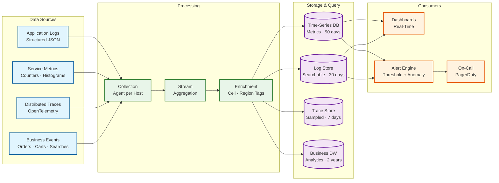

# Observability

## Key Metrics

### Business Metrics (North Star)

| Metric | Target | Alert Threshold | Impact |
|--------|--------|-----------------|--------|
| **Conversion rate** | 3-5% of sessions → order | < 2.5% for 15 min | Revenue loss |
| **Cart abandonment rate** | < 70% | > 80% for 30 min | Checkout friction |
| **Revenue per minute** | $X baseline | < 70% of baseline for 5 min | Critical revenue drop |
| **Orders per minute** | ~6,900 (10M/day) | < 50% of expected for 5 min | Order pipeline failure |
| **Search-to-click rate** | > 40% | < 25% for 15 min | Search quality degradation |
| **Buy box win rate distribution** | No single seller > 30% of wins | Concentration > 50% | Buy box algorithm issue |

### Service-Level Metrics

| Service | Metric | SLO | Alert |
|---------|--------|-----|-------|
| **Product Page** | Latency p99 | < 200ms | > 500ms for 5 min |
| **Product Page** | Error rate | < 0.1% | > 1% for 3 min |
| **Search** | Latency p99 | < 300ms | > 500ms for 5 min |
| **Search** | Zero-result rate | < 5% | > 10% for 15 min |
| **Add to Cart** | Latency p99 | < 150ms | > 300ms for 3 min |
| **Add to Cart** | Error rate | < 0.05% | > 0.5% for 3 min |
| **Checkout** | Latency p99 | < 2s | > 3s for 3 min |
| **Checkout** | Success rate | > 99.5% | < 98% for 5 min |
| **Payment** | Authorization success rate | > 97% | < 93% for 5 min |
| **Payment** | Latency p99 | < 1s | > 2s for 3 min |
| **Inventory** | Reservation success rate | > 99% | < 95% for 5 min |
| **Inventory** | Oversell count | 0 | Any oversell |

### Infrastructure Metrics

| Component | Metric | Alert |
|-----------|--------|-------|
| **Search Index** | Query latency p99 | > 100ms for 5 min |
| **Search Index** | Index lag (time since last update) | > 10 min |
| **Cart Store** | Read latency p99 | > 10ms for 3 min |
| **Cart Store** | Replication lag | > 5s for 3 min |
| **Order DB** | Connection pool utilization | > 80% for 5 min |
| **Order DB** | Replication lag | > 10s for 3 min |
| **Event Bus** | Consumer lag (messages behind) | > 10,000 messages for 5 min |
| **Event Bus** | Dead letter queue depth | > 100 messages |
| **Cache** | Hit rate | < 85% for 15 min |
| **Cache** | Memory utilization | > 85% |
| **CDN** | Cache hit rate | < 90% for 15 min |
| **CDN** | Origin bandwidth | > 5 GB/s (CDN failing to offload) |

---

## Conversion Funnel Monitoring

The most critical observability view is the end-to-end conversion funnel:

```
Funnel Stage          | Volume/min | Drop-off | Alert if drop-off exceeds
─────────────────────────────────────────────────────────────────────────
Homepage visits       | 1,600,000  | —        | —
Search queries        |   400,000  | 75%      | 80% (search broken?)
Product page views    |   200,000  | 50%      | 60% (search quality?)
Add to cart           |    35,000  | 82.5%    | 90% (product issues?)
Begin checkout        |    12,000  | 66%      | 75% (cart issues?)
Complete checkout     |     7,000  | 42%      | 55% (checkout broken?)
Order confirmed       |     6,900  | 1.4%     | 5% (payment issues?)

Monitoring approach:
- Compute funnel drop-offs in real-time (1-minute windows)
- Compare against same-hour-of-same-day-of-week baseline
- Alert when any stage deviation exceeds 2 standard deviations
- Dashboard shows real-time funnel alongside 7-day historical overlay
```

---

## Logging Strategy

### Structured Log Format

```
{
    "timestamp":    "2026-03-09T14:23:45.123Z",
    "service":      "checkout-orchestrator",
    "level":        "INFO",
    "trace_id":     "abc-123-def-456",
    "span_id":      "span-789",
    "user_id":      "usr-12345",
    "session_id":   "sess-67890",
    "action":       "PLACE_ORDER",
    "order_id":     "ORD-12345",
    "cart_items":   3,
    "total":        247.50,
    "payment_method": "CARD",
    "duration_ms":  1847,
    "status":       "SUCCESS",
    "cell_id":      "cell-us-east-a",
    "metadata": {
        "inventory_reservation_ms": 120,
        "payment_authorization_ms": 890,
        "order_creation_ms":        340,
        "idempotency_key":          "550e8400-e29b-41d4..."
    }
}
```

### Log Levels by Service

| Service | DEBUG | INFO | WARN | ERROR |
|---------|-------|------|------|-------|
| **Search** | Query parse details, scoring breakdown | Query terms, result count, latency | Slow query (>500ms), index lag | Index unavailable, query timeout |
| **Cart** | Item price lookup details | Add/remove item, merge events | Price change detected, OOS item in cart | Cart store write failure |
| **Checkout** | Step-by-step saga progress | Order placement, payment capture | Inventory retry, price change at checkout | Payment failure, reservation failure |
| **Inventory** | Lock acquisition, version conflicts | Reservation created/released, stock update | Low stock warning, shard imbalance | Oversell detected, reservation timeout |
| **Order** | State transition details | Order created, status change, shipment update | Fulfillment delay, carrier API timeout | Order creation failure, duplicate detection |

### Log Retention

| Log Category | Hot Storage | Warm Storage | Cold Archive |
|-------------|-------------|-------------|-------------|
| Application logs | 7 days (searchable) | 30 days (compressed) | 1 year |
| Access logs | 3 days | 14 days | 90 days |
| Payment audit logs | 30 days (searchable) | 1 year | 7 years (compliance) |
| Security event logs | 30 days (searchable) | 1 year | 7 years |
| Error logs | 14 days (searchable) | 90 days | 1 year |

---

## Distributed Tracing

### Trace Propagation

Every customer request generates a trace that follows the entire journey:

```
Trace: "Customer searches, views product, adds to cart, checks out"

[trace_id: abc-123]
├── [span: api-gateway]         12ms
│   └── [span: bff-service]     8ms
│       ├── [span: search-svc]  85ms
│       │   ├── [span: search-index-query]  22ms
│       │   ├── [span: ml-reranking]        15ms
│       │   └── [span: cache-lookup]        2ms
│       ├── [span: catalog-svc] 45ms
│       │   ├── [span: cache-hit]           1ms
│       │   └── [span: buy-box-lookup]      12ms
│       ├── [span: cart-svc]    23ms
│       │   ├── [span: cart-store-write]    5ms
│       │   └── [span: inventory-check]     15ms
│       └── [span: checkout]    1847ms
│           ├── [span: price-validation]     35ms
│           ├── [span: inventory-reserve]    120ms
│           │   ├── [span: db-update]        18ms
│           │   └── [span: retry-1]          95ms ⚠️ (optimistic lock conflict)
│           ├── [span: payment-auth]         890ms
│           │   └── [span: gateway-call]     850ms (external)
│           └── [span: order-create]         340ms
│               ├── [span: db-write]         35ms
│               └── [span: event-publish]    12ms
```

### Sampling Strategy

| Traffic Type | Sample Rate | Rationale |
|-------------|-------------|-----------|
| Normal traffic | 1% | Cost-effective for baseline monitoring |
| Error responses | 100% | Every error needs to be traceable |
| Slow requests (> 2× SLO) | 100% | Latency issues need investigation |
| Checkout flow | 10% | Revenue-critical path needs higher visibility |
| Prime Day traffic | 0.1% | Volume too high for 1%; increase for errors |
| Canary deployments | 100% | Full visibility during rollout |

---

## Alerting Strategy

### Alert Priority Levels

| Level | Response Time | Channel | Example |
|-------|-------------|---------|---------|
| **P0 — Critical** | < 5 min | Page on-call + war room | Checkout error rate > 5%, payment gateway down |
| **P1 — High** | < 15 min | Page on-call | Search latency p99 > 1s, inventory oversell detected |
| **P2 — Medium** | < 1 hour | Team channel notification | Cart store replication lag > 30s, cache hit rate < 80% |
| **P3 — Low** | Next business day | Dashboard + email | Review moderation queue > 10K, seller listing quality decline |

### Alert Anti-Patterns to Avoid

| Anti-Pattern | Problem | Better Approach |
|-------------|---------|-----------------|
| Alert on every error | Alert fatigue | Alert on error *rate* exceeding threshold |
| Static thresholds | False positives on weekends, holidays | Time-of-day baselines with standard deviation bands |
| Single-metric alerts | Missing context | Composite alerts: "checkout latency high AND error rate rising" |
| No deduplication | Repeated pages for same incident | Group related alerts; suppress duplicates for 15 min |

---

## Business Dashboards

### Real-Time Operations Dashboard

```
┌────────────────────────────────────────────────────────────────┐
│  E-Commerce Operations Dashboard                    Live 🟢    │
├──────────────┬──────────────┬──────────────┬──────────────────┤
│ Orders/min   │ Revenue/min  │ Cart Abandon │ Search QPS       │
│ 6,944 ▲ +2% │ $48,200 ▲    │ 68.2% ▼      │ 52,340 ▲         │
├──────────────┴──────────────┴──────────────┴──────────────────┤
│  Conversion Funnel (last 15 min)                               │
│  Search → Click: 42% ✓  │  Click → Cart: 17% ✓               │
│  Cart → Checkout: 34% ✓  │  Checkout → Order: 97.8% ✓        │
├────────────────────────────────────────────────────────────────┤
│  Service Health                                                │
│  Search:    p99=185ms ✅  │  Checkout: p99=1.2s ✅             │
│  Cart:      p99=45ms  ✅  │  Payment:  p99=780ms ✅            │
│  Inventory: p99=55ms  ✅  │  CDN:      hit=96.2% ✅            │
├────────────────────────────────────────────────────────────────┤
│  Active Incidents: 0                                           │
│  Deployments Today: 3 (all healthy)                            │
│  Flash Deals Active: 12 (2 > 80% claimed)                     │
└────────────────────────────────────────────────────────────────┘
```

### Seller Performance Dashboard

```
Key metrics tracked per seller:
├── Order Defect Rate (ODR): target < 1%
│   ├── Negative feedback rate
│   ├── A-to-Z guarantee claim rate
│   └── Chargeback rate
├── Late Shipment Rate: target < 4%
├── Pre-Fulfillment Cancel Rate: target < 2.5%
├── Buy Box Win Rate: tracked over time
├── Inventory Health: stock-out rate, excess inventory
└── Customer Response Time: target < 24 hours
```

### Prime Day War Room Dashboard

```
Additional metrics during Prime Day:
├── Deals active / deals sold out
├── Queue depth for deal claims
├── Per-deal claim rate and inventory burn-down
├── Cell-level traffic distribution
├── Auto-scaling events (scale-up, scale-down)
├── Feature flag status (which features are degraded)
├── CDN bandwidth and origin load
└── Payment gateway latency by provider
```

---

## Anomaly Detection

### Automated Anomaly Detection

```
For each key metric (orders/min, search latency, error rates):
1. Compute rolling baseline: same hour, same day-of-week, 4-week average
2. Compute standard deviation band (2σ)
3. If current value outside 2σ band for > 5 minutes → WARN
4. If current value outside 3σ band for > 3 minutes → ALERT
5. Special handling for known events (Prime Day, holidays):
   → Use prior year's event data as baseline
   → Widen bands by 50%
```

### Canary Deployment Monitoring

```
New deployment rolls out to 1% of traffic (canary):
1. Compare canary metrics vs. baseline (99% of traffic):
   - Error rate: canary < baseline + 0.5%
   - Latency p99: canary < baseline × 1.2
   - Success rate: canary > baseline - 1%
2. If canary passes for 15 minutes → promote to 10%
3. If canary fails → auto-rollback, page on-call
4. Progressive rollout: 1% → 10% → 50% → 100% over 2 hours
```

---

## Observability Pipeline Architecture



---

## SLI / SLO Tracking Dashboard

### Error Budget Tracking

```
SLO: Checkout availability ≥ 99.999% (5.26 minutes downtime/year)

Monthly error budget:
├── Total minutes in month: 43,200
├── Allowed downtime: 43,200 × 0.001% = 0.432 minutes (26 seconds)
├── Budget consumed this month: 12 seconds (46%)
├── Budget remaining: 14 seconds (54%)
│
├── Burn rate monitoring:
│   ├── 1-hour window burn rate: 2% → normal
│   ├── 6-hour window burn rate: 8% → normal
│   └── ALERT if 1-hour burn rate > 10% (on pace to exhaust budget in < 10 hours)
│
└── Actions when budget near exhaustion:
    ├── Freeze non-critical deployments
    ├── Increase checkout trace sampling to 100%
    └── Escalate to senior engineering leadership

SLO: Search latency p99 < 300ms

Monthly tracking:
├── Measured: 5-minute rolling p99 windows
├── Compliance: 99.2% of 5-minute windows met SLO
├── Target: 99% of windows → PASSING
├── Top violations: 3 windows during cache warming event
└── Action: pre-warm search cache after deployments
```

### Cost Observability

| Cost Driver | Metric | Optimization Lever |
|-------------|--------|-------------------|
| **CDN bandwidth** | $/GB transferred; peak vs. off-peak | Aggressive image compression; WebP/AVIF format adoption; cache TTL optimization |
| **Search cluster** | $/query; cluster utilization % | Shard rebalancing; query caching; off-peak index compaction |
| **Database IOPS** | $/1000 IOPS; read vs. write ratio | Connection pooling; read-replica offloading; query optimization |
| **Cache memory** | $/GB; hit rate efficiency | TTL tuning; eviction policy optimization; hot-key detection |
| **Compute** | $/request; CPU utilization per service | Right-sizing instances; spot instances for batch; auto-scale tuning |

---

## Inventory Observability

### Real-Time Inventory Health Dashboard

```
Inventory Health Metrics:
├── Oversell incidents (last 24h):     0    ✅
├── Reservation timeout rate:          0.3% ✅ (< 1%)
├── Optimistic lock retry rate:        2.1% ✅ (< 5%)
├── Hot SKU alerts (active):           3    ⚠️ (viral products)
├── Stock-out SKUs (total):            12,450 / 500M = 0.0025%
├── Reorder alerts triggered (24h):    8,200
├── Warehouse utilization (avg):       72%  ✅ (target 65-80%)
└── Cross-warehouse transfer rate:     1.2% of orders

Per-Warehouse Breakdown:
├── Warehouse DAL-01: utilization 78%, orders/hr 2,400, pick time avg 3.2 min
├── Warehouse SEA-03: utilization 65%, orders/hr 1,800, pick time avg 2.8 min
├── Warehouse CHI-02: utilization 82%, orders/hr 2,100, pick time avg 4.1 min ⚠️
└── Alert: CHI-02 pick time trending up → investigate staffing or layout issues
```

### Search Quality Monitoring

```
Search Quality Metrics (real-time):
├── Zero-result rate:           3.2%  ✅ (< 5%)
├── Click-through rate:         42.1% ✅ (> 40%)
├── Search-to-cart rate:        8.3%  ✅
├── Mean Reciprocal Rank (MRR): 0.72  ✅ (first relevant result avg at position 1.4)
├── Facet usage rate:           34%   (brand: 18%, price: 12%, rating: 4%)
├── Autocomplete acceptance:    45%   (user accepts suggestion vs. types full query)
└── Semantic query rate:        12%   (queries without brand/model keywords)
```
