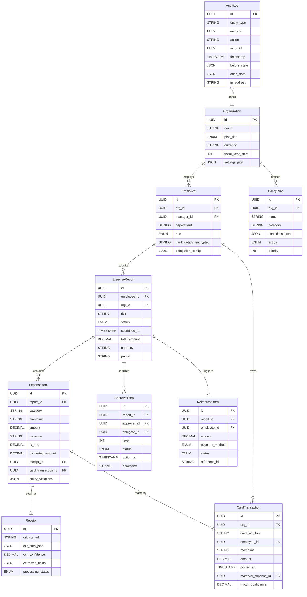
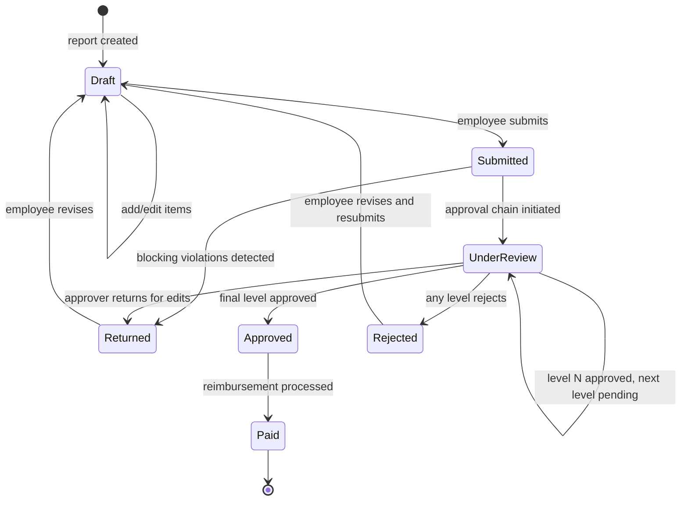

# Low-Level Design

## 1. Data Model



### Key Entity Details

```
Organization   { org_id UUID PK, name STRING, plan_tier ENUM(free|team|business|enterprise),
                 default_currency STRING, fiscal_year_start INT(1-12), settings_json JSON, status ENUM }
  INDEX: (status)

Employee       { employee_id UUID PK, org_id UUID FK, manager_id UUID FK (self-ref, nullable),
                 email STRING (encrypted), department STRING, cost_center STRING,
                 role ENUM(employee|manager|finance_admin|org_admin),
                 bank_details_enc STRING (encrypted), delegation_config JSON, daily_limit DECIMAL }
  INDEX: (org_id, department), (org_id, manager_id), (org_id, status)

ExpenseReport  { report_id UUID PK, employee_id UUID FK, org_id UUID FK, title STRING,
                 status ENUM(draft|submitted|under_review|approved|rejected|paid|returned),
                 submitted_at TIMESTAMP, approved_at TIMESTAMP, total_amount DECIMAL,
                 currency STRING, period_start DATE, period_end DATE, current_level INT }
  INDEX: (org_id, status, submitted_at), (employee_id, status)
  PARTITION: hash by org_id (64 partitions)

ExpenseItem    { item_id UUID PK, report_id UUID FK, category STRING, merchant STRING,
                 amount DECIMAL, currency STRING, fx_rate DECIMAL, converted_amount DECIMAL,
                 receipt_id UUID FK, card_transaction_id UUID FK, description STRING,
                 is_billable BOOLEAN, project_id STRING, policy_violations JSON, expense_date DATE }
  INDEX: (report_id, category), (card_transaction_id) UNIQUE WHERE NOT NULL

Receipt        { receipt_id UUID PK, org_id UUID FK, original_url STRING, thumbnail_url STRING,
                 ocr_data_json JSON, ocr_confidence DECIMAL(0-1), extracted_fields JSON,
                 processing_status ENUM(uploaded|processing|completed|failed), content_hash STRING }
  INDEX: (org_id, content_hash), (processing_status)

CardTransaction { transaction_id UUID PK, org_id UUID FK, card_last_four STRING,
                  employee_id UUID FK, merchant STRING, merchant_normalized STRING, mcc STRING,
                  amount DECIMAL, currency STRING, posted_at TIMESTAMP,
                  matched_expense_id UUID FK, match_confidence DECIMAL,
                  match_status ENUM(unmatched|auto_matched|manual_matched|excluded) }
  INDEX: (org_id, employee_id, match_status), (org_id, posted_at)

ApprovalStep   { step_id UUID PK, report_id UUID FK, approver_id UUID FK, delegate_id UUID FK,
                 level INT, status ENUM(pending|approved|rejected|skipped|escalated),
                 action_at TIMESTAMP, comments STRING }
  INDEX: (report_id, level), (approver_id, status)

PolicyRule     { rule_id UUID PK, org_id UUID FK, name STRING, category STRING,
                 conditions_json JSON, action ENUM(warn|block|require_extra_approval),
                 priority INT, message STRING, is_active BOOLEAN }
  INDEX: (org_id, is_active, category, priority)

Reimbursement  { reimbursement_id UUID PK, report_id UUID FK UNIQUE, employee_id UUID FK,
                 amount DECIMAL, currency STRING, payment_method ENUM(ach|wire|payroll|check),
                 status ENUM(pending|processing|completed|failed), batch_id STRING, reference_id STRING }
  INDEX: (employee_id, status), (batch_id), (status, created_at)

AuditLog       { log_id UUID PK, org_id UUID FK, entity_type STRING, entity_id UUID,
                 action STRING, actor_id UUID FK, timestamp TIMESTAMP,
                 before_state JSON, after_state JSON, ip_address STRING }
  INDEX: (org_id, entity_type, entity_id, timestamp)
  PARTITION: monthly range by timestamp (auto-drop after 7 years)
```

---

## 2. Indexing Strategy

| Table | Index | Rationale |
|-------|-------|-----------|
| ExpenseReport | `(org_id, status, submitted_at)` | Dashboard: "all pending reports for my org" |
| ExpenseReport | `(employee_id, status)` | Employee view: "my reports" |
| CardTransaction | `(org_id, employee_id, match_status)` | Unmatched card feed per employee |
| ApprovalStep | `(approver_id, status)` | Approver inbox query |
| AuditLog | `(org_id, entity_type, entity_id, timestamp)` | Compliance audit trail |
| Receipt | `(org_id, content_hash)` | Duplicate receipt detection |

**Partition strategy:** Transactional tables hash-partitioned by `org_id` for tenant isolation. AuditLog uses monthly range partitions for retention management.

---

## 3. API Design

```
POST /v1/expenses/reports
Body: { title, currency, period_start, period_end }
Response 201: { report_id, status: "draft" }

POST /v1/expenses/items
Body: { report_id, category, merchant, amount, currency, expense_date, description, is_billable, project_id }
Response 201: { item_id, policy_violations: [{ rule_id, severity, message }] }

POST /v1/expenses/items/{id}/receipt
Headers: Content-Type: multipart/form-data
Body: { file: <image_binary> }
Response 202: { receipt_id, processing_status: "processing" }

POST /v1/expenses/reports/{id}/submit
Response 200: { report_id, status: "submitted", approval_chain: [{ level, approver, status }] }
Response 422: { error: "submission_blocked", violations: [{ item_id, rule_id, message }] }

POST /v1/expenses/reports/{id}/approve
Body: { action: "approve"|"reject"|"return", comments }
Response 200: { report_id, status, next_approver }

GET /v1/expenses/reports?status={s}&period={p}&cursor={c}
Response 200: { reports: [{ report_id, title, employee, status, total_amount, item_count }], pagination }

GET /v1/expenses/card-transactions?unmatched=true&employee_id={id}
Response 200: { transactions: [{ transaction_id, merchant, amount, suggested_matches: [{ item_id, confidence }] }] }

POST /v1/expenses/card-transactions/{id}/match
Body: { expense_item_id }
Response 200: { transaction_id, matched_expense_id, match_status: "manual_matched" }

GET /v1/policies/evaluate?expense_item_id={id}
Response 200: { violations: [{ rule_id, action, message }], can_submit: BOOLEAN }
```

---

## 4. Core Algorithms

### Receipt OCR Extraction Pipeline

```
FUNCTION process_receipt(receipt_id, image_bytes):
    normalized = normalize_image(image_bytes)        -- deskew, crop, enhance contrast
    content_hash = SHA256(image_bytes)

    -- Duplicate detection
    existing = QUERY Receipt WHERE org_id = current_org AND content_hash = content_hash
    IF existing: RETURN { status: "duplicate", original_receipt_id: existing.receipt_id }

    -- OCR + field extraction
    ocr_raw = ocr_service.extract_text(normalized)
    extracted = {
        merchant:   extract_merchant(ocr_raw.text_blocks),
        amount:     extract_amount(ocr_raw.text_blocks),
        currency:   extract_currency(ocr_raw.text_blocks),
        date:       extract_date(ocr_raw.text_blocks),
        tax:        extract_tax(ocr_raw.text_blocks),
        line_items: extract_line_items(ocr_raw.text_blocks)
    }

    -- Per-field confidence scoring
    FOR EACH field IN extracted:
        field.confidence = compute_field_confidence(ocr_raw, field)

    UPDATE Receipt SET ocr_data_json = ocr_raw, ocr_confidence = ocr_raw.overall_confidence,
        extracted_fields = extracted, content_hash = content_hash, processing_status = "completed"
    RETURN { receipt_id, extracted, confidence: ocr_raw.overall_confidence }
```

### Policy Evaluation Engine

```
FUNCTION evaluate_policies(expense_item, org_id):
    rules = QUERY PolicyRule WHERE org_id = org_id AND is_active = true
        AND (category = expense_item.category OR category = "*") ORDER BY priority ASC

    violations = []
    has_blocker = false

    FOR EACH rule IN rules:
        conditions = PARSE(rule.conditions_json)
        matched = ALL(evaluate_condition(expense_item, c) FOR c IN conditions)

        IF matched:
            violations.APPEND({ rule_id: rule.rule_id, severity: rule.action, message: rule.message })
            IF rule.action == "block": has_blocker = true

    UPDATE ExpenseItem SET policy_violations = violations WHERE item_id = expense_item.item_id
    RETURN { violations, can_submit: NOT has_blocker }

FUNCTION evaluate_condition(item, condition):
    value = GET_FIELD(item, condition.field)
    SWITCH condition.operator:
        "gt": RETURN value > condition.value       "lt": RETURN value < condition.value
        "eq": RETURN value == condition.value       "in": RETURN value IN condition.value
        "missing": RETURN value IS NULL
```

### Card-Receipt Matching Algorithm

```
FUNCTION match_card_transactions(org_id, employee_id):
    unmatched_txns = QUERY CardTransaction WHERE org_id = org_id AND employee_id = employee_id
        AND match_status = "unmatched"
    unmatched_items = QUERY ExpenseItem ei JOIN ExpenseReport er ON ei.report_id = er.report_id
        WHERE er.org_id = org_id AND er.employee_id = employee_id AND ei.card_transaction_id IS NULL

    FOR EACH txn IN unmatched_txns:
        best_match, best_score = NULL, 0.0

        FOR EACH item IN unmatched_items:
            score = 0.0
            -- Amount (weight 0.40): exact=0.40, within 2%=0.35, within 10%=0.15
            amount_diff = ABS(txn.amount - item.converted_amount) / txn.amount
            score += (0.40 IF amount_diff == 0, 0.35 IF < 0.02, 0.15 IF < 0.10, ELSE 0)
            -- Merchant (weight 0.35): fuzzy string similarity
            score += 0.35 * fuzzy_match(txn.merchant_normalized, item.merchant)
            -- Date (weight 0.25): same day=0.25, +/-1d=0.20, +/-3d=0.10
            day_diff = ABS(DAYS_BETWEEN(txn.posted_at, item.expense_date))
            score += (0.25 IF day_diff == 0, 0.20 IF <= 1, 0.10 IF <= 3, ELSE 0)

            IF score > best_score: best_match, best_score = item, score

        IF best_score >= 0.85:  -- auto-match
            LINK(txn, best_match, "auto_matched", best_score)
            unmatched_items.REMOVE(best_match)
        ELSE IF best_score >= 0.60:  -- suggest for manual review
            SUGGEST(txn, best_match, best_score)
```

### Approval Routing Algorithm

```
FUNCTION route_for_approval(report):
    org = GET Organization(report.org_id)
    submitter = GET Employee(report.employee_id)
    chain = []
    level = 1

    -- Level 1: Direct manager (with delegation support)
    manager = GET Employee(submitter.manager_id)
    IF manager IS NOT NULL:
        approver = resolve_delegate(manager)
        chain.APPEND(ApprovalStep(report.report_id, approver.id, level, "pending"))
        level += 1

    -- Level 2: Finance (if amount > finance_threshold)
    IF report.total_amount > org.settings_json.finance_approval_threshold:
        finance = QUERY Employee WHERE org_id = org.org_id AND role = "finance_admin" LIMIT 1
        chain.APPEND(ApprovalStep(report.report_id, finance.id, level, "waiting"))
        level += 1

    -- Level 3: Executive (if amount > executive_threshold)
    IF report.total_amount > org.settings_json.executive_approval_threshold:
        exec = find_department_head(submitter.department, org.org_id)
        chain.APPEND(ApprovalStep(report.report_id, exec.id, level, "waiting"))

    BATCH INSERT chain
    UPDATE ExpenseReport SET status = "submitted", current_level = 1
    notify(chain[0].approver_id, "approval_requested", report)
    RETURN chain

FUNCTION resolve_delegate(employee):
    cfg = employee.delegation_config
    IF cfg AND cfg.delegate_to AND NOW() BETWEEN cfg.valid_from AND cfg.valid_until:
        RETURN GET Employee(cfg.delegate_to)
    RETURN employee
```

### FX Rate Conversion with Locking

```
FUNCTION convert_expense_currency(item, report_currency):
    IF item.currency == report_currency:
        item.fx_rate, item.converted_amount = 1.0, item.amount
        RETURN

    rate = fx_cache.GET(item.currency + "_" + report_currency)
    IF rate IS NULL OR rate.fetched_at < NOW() - 15_MINUTES:
        rate = fx_provider.get_rate(item.currency, report_currency)
        fx_cache.SET(item.currency + "_" + report_currency, rate, TTL=15_MINUTES)

    item.fx_rate = rate.mid_rate
    item.converted_amount = ROUND(item.amount * rate.mid_rate, 2)
    audit_log("fx_rate_locked", item.item_id, { rate: rate.mid_rate, pair: item.currency + "/" + report_currency })
```

---

## 5. State Diagram: Expense Report Lifecycle



**Escalation rules:** Reminder after 48h of inaction, escalate to approver's manager after 96h, fall back to `finance_admin` role if escalation target is unavailable.

---

## 6. Additional Data Entities

```
Budget         { budget_id UUID PK, org_id UUID FK, cost_center STRING, project_id STRING,
                 category STRING, period_start DATE, period_end DATE,
                 allocated_amount DECIMAL, reserved_amount DECIMAL, spent_amount DECIMAL,
                 currency STRING, last_updated TIMESTAMP }
  INDEX: (org_id, cost_center, period_start, period_end), (org_id, project_id)
  CONSTRAINT: spent_amount + reserved_amount <= allocated_amount (enforced at application layer)

DelegationRecord { delegation_id UUID PK, org_id UUID FK, delegator_id UUID FK, delegate_id UUID FK,
                   valid_from TIMESTAMP, valid_until TIMESTAMP, max_amount DECIMAL,
                   categories STRING[], departments STRING[], created_at TIMESTAMP }
  INDEX: (delegator_id, valid_from, valid_until), (delegate_id, valid_from)

FXRateHistory  { rate_id UUID PK, base_currency STRING, target_currency STRING,
                 rate DECIMAL(18,8), source ENUM(ecb|card_network|treasury|market),
                 effective_at TIMESTAMP, fetched_at TIMESTAMP }
  INDEX: (base_currency, target_currency, effective_at DESC)
  PARTITION: monthly range by effective_at (retain 2 years hot, archive beyond)

PerDiemRate    { rate_id UUID PK, country STRING, city STRING, category ENUM(lodging|meals|incidentals),
                 rate_amount DECIMAL, currency STRING, effective_from DATE, effective_until DATE,
                 source STRING, last_updated TIMESTAMP }
  INDEX: (country, city, category, effective_from DESC)

MerchantAlias  { alias_id UUID PK, card_network_name STRING, normalized_name STRING,
                 merchant_category STRING, confirmation_count INT, last_confirmed TIMESTAMP }
  INDEX: (card_network_name), (normalized_name)

NotificationLog { notification_id UUID PK, org_id UUID FK, recipient_id UUID FK,
                  type ENUM(approval_request|reminder|escalation|reimbursement|violation),
                  channel ENUM(email|push|sms|in_app), entity_type STRING, entity_id UUID,
                  sent_at TIMESTAMP, delivered_at TIMESTAMP, status ENUM(sent|delivered|failed) }
  INDEX: (recipient_id, type, sent_at DESC), (entity_id, type)
```

---

## 7. Additional API Endpoints

```
--- Delegation Management ---
POST /v1/delegations
Body: { delegate_id, valid_from, valid_until, max_amount, categories?, departments? }
Response 201: { delegation_id, delegator_id, delegate_id, valid_from, valid_until }

DELETE /v1/delegations/{id}
Response 204: (no content)

GET /v1/delegations?active=true
Response 200: { delegations: [{ delegation_id, delegate, valid_from, valid_until, max_amount }] }

--- Budget Management ---
GET /v1/budgets?cost_center={cc}&period={p}
Response 200: { budgets: [{ budget_id, allocated, reserved, spent, remaining, utilization_pct }] }

POST /v1/budgets
Body: { cost_center, project_id?, category?, period_start, period_end, allocated_amount, currency }
Response 201: { budget_id, allocated_amount, currency }

--- Reimbursement Operations ---
POST /v1/reimbursements/batch
Body: { report_ids: [UUID], payment_method: "ach"|"wire"|"payroll" }
Response 202: { batch_id, report_count, total_amount, estimated_processing_time }

GET /v1/reimbursements/{id}/status
Response 200: { reimbursement_id, status, payment_reference, processed_at, settlement_date }

--- Analytics & Reporting ---
GET /v1/analytics/spend?group_by={category|department|project}&period={p}
Response 200: { aggregations: [{ group, total_amount, transaction_count, avg_amount }] }

GET /v1/analytics/policy-violations?period={p}&severity={s}
Response 200: { violations: [{ rule_name, count, total_amount_impacted, top_categories }] }

GET /v1/reports/export?format=csv|pdf&report_ids={ids}
Response 202: { export_id, status: "generating", download_url_when_ready }

--- Audit Trail ---
GET /v1/audit/trail?entity_type={t}&entity_id={id}&from={ts}&to={ts}
Response 200: { events: [{ log_id, action, actor, timestamp, before_state, after_state }], pagination }

--- Per-Diem Rates ---
GET /v1/per-diem-rates?country={c}&city={ci}&date={d}
Response 200: { rates: { lodging: amount, meals: amount, incidentals: amount, currency } }
```

---

## 8. Additional Core Algorithms

### Reimbursement Batch Processing

```
FUNCTION process_reimbursement_batch():
    -- Gather all approved reports pending reimbursement
    pending = QUERY ExpenseReport
        WHERE status = "approved" AND reimbursement_status IS NULL
        ORDER BY approved_at ASC

    -- Group by payment method and currency for efficient batching
    batches = GROUP pending BY (payment_method, currency)

    FOR EACH (method, currency), reports IN batches:
        batch_id = GENERATE_UUID()
        total_amount = 0
        payment_instructions = []

        FOR EACH report IN reports:
            employee = GET Employee(report.employee_id)

            -- Validate bank details are still active
            IF NOT validate_bank_details(employee.bank_details_encrypted):
                MARK_FAILED(report, "invalid_bank_details")
                NOTIFY(employee, "bank_details_required")
                CONTINUE

            -- Calculate net reimbursable amount (after any policy adjustments)
            net_amount = calculate_net_reimbursement(report)

            -- Reserve budget
            budget_result = reserve_budget(report.org_id, report.cost_center, net_amount)
            IF NOT budget_result.success:
                MARK_FAILED(report, "budget_exhausted")
                NOTIFY_FINANCE(report.org_id, "budget_exhausted", report)
                CONTINUE

            payment_instructions.APPEND({
                idempotency_key: report.report_id + "_" + report.version,
                recipient: employee.bank_details_encrypted,
                amount: net_amount,
                currency: currency,
                reference: "REIMB-" + report.report_id[:8]
            })
            total_amount += net_amount

            -- Create reimbursement record
            INSERT Reimbursement(report_id=report.report_id, employee_id=report.employee_id,
                amount=net_amount, payment_method=method, status="processing",
                batch_id=batch_id)

        -- Submit batch to payment provider
        IF method == "ach":
            result = ach_provider.submit_batch(batch_id, payment_instructions)
        ELSE IF method == "wire":
            FOR EACH instruction IN payment_instructions:
                result = wire_provider.submit(instruction)
        ELSE IF method == "payroll":
            result = payroll_provider.add_to_next_run(payment_instructions)

        -- Log batch submission
        audit_log("reimbursement_batch_submitted", batch_id, {
            method: method, count: LEN(payment_instructions),
            total_amount: total_amount, currency: currency
        })

    RETURN { batches_created: LEN(batches), total_reports: LEN(pending) }

FUNCTION calculate_net_reimbursement(report):
    items = QUERY ExpenseItem WHERE report_id = report.report_id
    total = 0
    FOR EACH item IN items:
        -- Use converted amount (already FX-locked at approval time)
        IF item.converted_amount IS NOT NULL:
            total += item.converted_amount
        ELSE:
            total += item.amount
    -- Subtract any advances or pre-paid corporate card amounts
    advances = QUERY Advance WHERE report_id = report.report_id AND status = "active"
    total -= SUM(advances.amount)
    RETURN MAX(total, 0)  -- Never negative; overpayments handled separately
```

### Budget Tracking with Reservation Pattern

```
FUNCTION reserve_budget(org_id, cost_center, amount):
    -- Use SELECT FOR UPDATE to prevent race conditions on budget exhaustion
    budget = SELECT * FROM Budget
        WHERE org_id = org_id AND cost_center = cost_center
        AND period_start <= NOW() AND period_end >= NOW()
        FOR UPDATE

    IF budget IS NULL:
        RETURN { success: true, warning: "no_budget_configured" }

    available = budget.allocated_amount - budget.spent_amount - budget.reserved_amount
    IF amount > available:
        RETURN { success: false, available: available, requested: amount }

    UPDATE Budget SET reserved_amount = reserved_amount + amount,
        last_updated = NOW()
        WHERE budget_id = budget.budget_id

    RETURN { success: true, remaining: available - amount }

FUNCTION commit_budget(org_id, cost_center, amount):
    -- Called after successful reimbursement payment
    UPDATE Budget SET spent_amount = spent_amount + amount,
        reserved_amount = reserved_amount - amount,
        last_updated = NOW()
        WHERE org_id = org_id AND cost_center = cost_center
        AND period_start <= NOW() AND period_end >= NOW()

FUNCTION release_budget_reservation(org_id, cost_center, amount):
    -- Called when reimbursement fails or report is rejected after reservation
    UPDATE Budget SET reserved_amount = reserved_amount - amount,
        last_updated = NOW()
        WHERE org_id = org_id AND cost_center = cost_center
        AND period_start <= NOW() AND period_end >= NOW()
```

### Duplicate Receipt Detection (Perceptual Hashing)

```
FUNCTION detect_duplicate_receipt(receipt_image, org_id, employee_id):
    -- Step 1: Content hash (exact duplicate detection)
    content_hash = SHA256(receipt_image)
    exact_match = QUERY Receipt
        WHERE org_id = org_id AND content_hash = content_hash
        AND processing_status != "deleted"
    IF exact_match:
        RETURN { is_duplicate: true, type: "exact", original: exact_match.receipt_id,
                 confidence: 1.0 }

    -- Step 2: Perceptual hash (near-duplicate detection)
    phash = compute_perceptual_hash(receipt_image)  -- 64-bit hash of DCT coefficients
    -- Query similar hashes within Hamming distance threshold
    candidates = QUERY Receipt
        WHERE org_id = org_id
        AND hamming_distance(phash, stored_phash) <= 8  -- 8-bit tolerance
        AND created_at > NOW() - 180_DAYS  -- 6-month lookback window

    FOR EACH candidate IN candidates:
        -- Step 3: Structural similarity verification
        similarity = compute_ssim(receipt_image, load_image(candidate.original_url))
        IF similarity > 0.92:
            RETURN { is_duplicate: true, type: "perceptual",
                     original: candidate.receipt_id, confidence: similarity }

    -- Step 4: Cross-employee duplicate check (same receipt submitted by different employees)
    cross_employee = QUERY Receipt r JOIN ExpenseItem ei ON r.receipt_id = ei.receipt_id
        WHERE r.org_id = org_id AND r.content_hash = content_hash
        AND ei.report_id IN (SELECT report_id FROM ExpenseReport WHERE employee_id != employee_id)
    IF cross_employee:
        RETURN { is_duplicate: true, type: "cross_employee",
                 original: cross_employee.receipt_id, confidence: 1.0,
                 original_submitter: cross_employee.employee_id }

    RETURN { is_duplicate: false }
```

### Per-Diem Rate Lookup

```
FUNCTION get_per_diem_rates(country, city, date, org_id):
    -- Check org-specific override rates first
    org_rates = QUERY PerDiemRate
        WHERE org_id = org_id AND country = country
        AND (city = city OR city = "*")
        AND effective_from <= date AND (effective_until IS NULL OR effective_until >= date)
        ORDER BY city DESC, effective_from DESC  -- Prefer city-specific over country-level
        LIMIT 1

    IF org_rates:
        RETURN org_rates

    -- Fall back to government-published rates
    gov_rates = QUERY PerDiemRate
        WHERE org_id IS NULL AND country = country
        AND (city = city OR city = "*")
        AND effective_from <= date AND (effective_until IS NULL OR effective_until >= date)
        ORDER BY city DESC, effective_from DESC
        LIMIT 1

    IF gov_rates:
        RETURN gov_rates

    -- Final fallback: country-level default
    RETURN QUERY PerDiemRate
        WHERE org_id IS NULL AND country = country AND city = "*"
        ORDER BY effective_from DESC LIMIT 1

FUNCTION validate_per_diem(expense_item, employee):
    rates = get_per_diem_rates(expense_item.location.country,
                                expense_item.location.city,
                                expense_item.expense_date,
                                employee.org_id)
    IF rates IS NULL:
        RETURN { valid: true, warning: "no_per_diem_rate_found" }

    category_rate = rates[expense_item.category]  -- lodging, meals, or incidentals
    IF expense_item.amount > category_rate:
        RETURN { valid: false, limit: category_rate, excess: expense_item.amount - category_rate,
                 message: "Exceeds per diem rate of " + category_rate + " for " + rates.city }
    RETURN { valid: true }
```

### Escalation Timer Processing

```
FUNCTION process_escalation_timers():
    -- Run every 15 minutes via scheduled job
    stale_approvals = QUERY ApprovalStep
        WHERE status = "pending"
        AND created_at < NOW() - INTERVAL '48 hours'
        ORDER BY created_at ASC

    FOR EACH step IN stale_approvals:
        age_hours = HOURS_BETWEEN(step.created_at, NOW())
        report = GET ExpenseReport(step.report_id)

        IF age_hours >= 96:  -- 4 days: auto-escalate
            approver = GET Employee(step.approver_id)
            escalation_target = approver.manager_id

            IF escalation_target IS NULL:
                -- No manager: route to finance admin pool
                escalation_target = GET_FINANCE_ADMIN(report.org_id)

            UPDATE ApprovalStep SET status = "escalated" WHERE step_id = step.step_id
            INSERT ApprovalStep(report_id=step.report_id, approver_id=escalation_target,
                level=step.level, status="pending", comments="Auto-escalated from " + approver.name)

            NOTIFY(escalation_target, "escalation_approval_required", report)
            audit_log("approval_escalated", step.report_id, {
                original_approver: step.approver_id, escalated_to: escalation_target,
                reason: "sla_breach_96h"
            })

        ELSE IF age_hours >= 72:  -- 3 days: warning
            NOTIFY(step.approver_id, "approval_sla_warning", report)

        ELSE IF age_hours >= 48:  -- 2 days: reminder
            -- Check if reminder already sent
            existing = QUERY NotificationLog
                WHERE entity_id = step.step_id AND type = "reminder"
                AND sent_at > NOW() - INTERVAL '24 hours'
            IF NOT existing:
                NOTIFY(step.approver_id, "approval_reminder", report)
```

### Mileage Calculation

```
FUNCTION calculate_mileage_reimbursement(waypoints, vehicle_type, org_id, date):
    -- Calculate distance from GPS waypoints
    total_distance_miles = 0.0
    FOR i IN 1..LEN(waypoints)-1:
        segment = haversine_distance(waypoints[i-1], waypoints[i])
        total_distance_miles += segment

    -- Get applicable mileage rate
    rate = QUERY MileageRate
        WHERE org_id = org_id AND vehicle_type = vehicle_type
        AND effective_from <= date AND (effective_until IS NULL OR effective_until >= date)
    IF rate IS NULL:
        -- Fall back to IRS/HMRC standard rate
        rate = GET_GOVERNMENT_MILEAGE_RATE(vehicle_type, date)

    reimbursable_amount = ROUND(total_distance_miles * rate.per_mile_rate, 2)

    RETURN {
        distance_miles: total_distance_miles,
        rate_per_mile: rate.per_mile_rate,
        rate_source: rate.source,
        reimbursable_amount: reimbursable_amount,
        currency: rate.currency,
        waypoint_count: LEN(waypoints)
    }
```

### Expense Report Aggregation with Multi-Currency

```
FUNCTION aggregate_report_totals(report_id):
    items = QUERY ExpenseItem WHERE report_id = report_id
    report = GET ExpenseReport(report_id)
    report_currency = report.currency

    total_original = {}     -- Subtotals by original currency
    total_converted = 0.0   -- Grand total in report currency

    FOR EACH item IN items:
        -- Track original currency subtotals for transparency
        IF item.currency NOT IN total_original:
            total_original[item.currency] = 0.0
        total_original[item.currency] += item.amount

        -- Convert to report currency if needed
        IF item.currency != report_currency:
            IF item.converted_amount IS NOT NULL:
                total_converted += item.converted_amount
            ELSE:
                converted = convert_expense_currency(item, report_currency)
                total_converted += converted.converted_amount
        ELSE:
            total_converted += item.amount

    UPDATE ExpenseReport SET
        total_amount = ROUND(total_converted, 2),
        item_count = LEN(items),
        currency_breakdown = total_original
        WHERE report_id = report_id

    RETURN { total: total_converted, currency: report_currency,
             breakdown: total_original, item_count: LEN(items) }
```

### Audit Trail Entry with Hash Chaining

```
FUNCTION write_audit_entry(org_id, entity_type, entity_id, action, actor_id, before, after):
    -- Get the hash of the previous audit entry for this entity (hash chain)
    prev_entry = QUERY AuditLog
        WHERE org_id = org_id AND entity_type = entity_type AND entity_id = entity_id
        ORDER BY timestamp DESC LIMIT 1

    prev_hash = prev_entry.entry_hash IF prev_entry ELSE "GENESIS"

    entry = {
        log_id: GENERATE_UUID(),
        org_id: org_id,
        entity_type: entity_type,
        entity_id: entity_id,
        action: action,
        actor_id: actor_id,
        timestamp: NOW(),
        before_state: redact_pii(before),
        after_state: redact_pii(after),
        ip_address: REQUEST_CONTEXT.ip,
        prev_hash: prev_hash
    }

    -- Compute hash of this entry for chain integrity
    entry.entry_hash = SHA256(CONCAT(
        entry.log_id, entry.action, entry.actor_id,
        entry.timestamp, SERIALIZE(entry.after_state), prev_hash
    ))

    INSERT AuditLog VALUES entry

    -- Emit event for async consumers (analytics, compliance dashboards)
    EMIT EVENT("audit.entry_created", entry)

    RETURN entry.log_id

FUNCTION verify_audit_chain(org_id, entity_type, entity_id):
    entries = QUERY AuditLog
        WHERE org_id = org_id AND entity_type = entity_type AND entity_id = entity_id
        ORDER BY timestamp ASC

    prev_hash = "GENESIS"
    FOR EACH entry IN entries:
        expected_hash = SHA256(CONCAT(
            entry.log_id, entry.action, entry.actor_id,
            entry.timestamp, SERIALIZE(entry.after_state), prev_hash
        ))
        IF expected_hash != entry.entry_hash:
            RETURN { valid: false, broken_at: entry.log_id, index: entry.timestamp }
        prev_hash = entry.entry_hash

    RETURN { valid: true, chain_length: LEN(entries) }
```

---

## 9. Complexity Summary

| Algorithm | Time Complexity (Speed of the algorithm) | Space Complexity (Memory usage of the algorithm) | Critical Path? |
|-----------|----------------|-----------------|----------------|
| Receipt OCR extraction | O(p) per receipt, p = pixel count | O(m) model size ~2 GB GPU memory | Yes — async queue |
| Policy evaluation | O(r) applicable rules; O(R/c) with indexing | O(R) compiled rule set in memory | Yes — synchronous |
| Card-receipt matching | O(t × e) transactions × expenses | O(t + e) candidate sets | No — background |
| Approval routing | O(l × d) levels × delegation depth | O(l) approval chain | Yes — synchronous |
| Duplicate detection (pHash) | O(n) candidates within Hamming threshold | O(1) per hash comparison | Yes — on upload |
| Budget reservation | O(1) single row lock | O(1) | Yes — synchronous |
| FX rate conversion | O(1) cache lookup; O(log n) rate history | O(p) cached pairs | Yes — synchronous |
| Reimbursement batching | O(r) pending reports | O(r) payment instructions | No — scheduled |
| Audit chain verification | O(n) entries in chain | O(1) running hash | No — on-demand |
| Per-diem rate lookup | O(log n) indexed lookup | O(1) | Yes — policy evaluation |
| Mileage calculation | O(w) waypoints | O(w) | No — on submit |
| Escalation timer | O(s) stale approvals | O(s) | No — scheduled |
