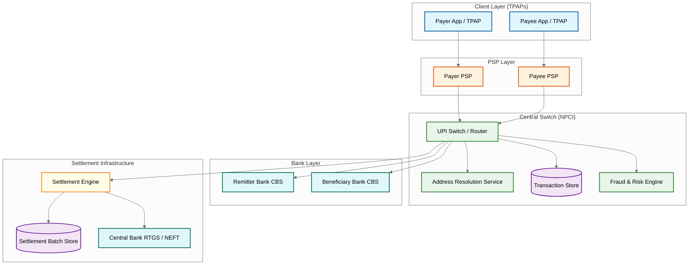
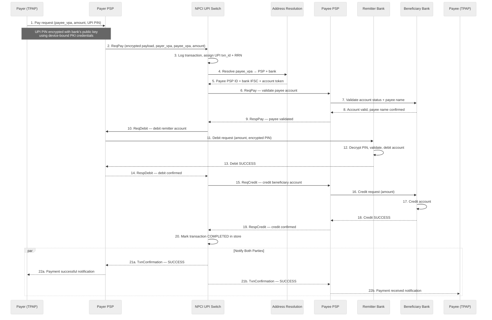
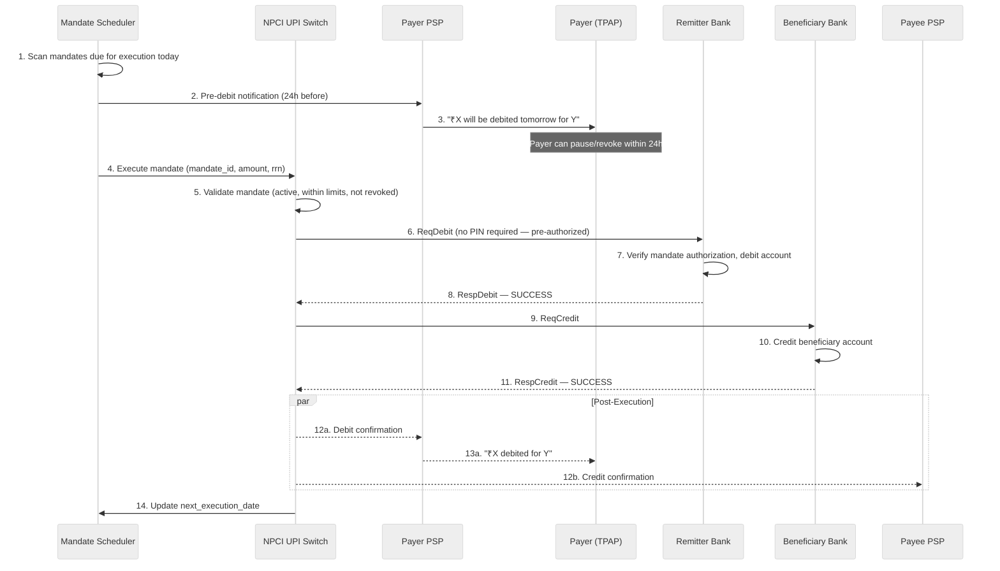
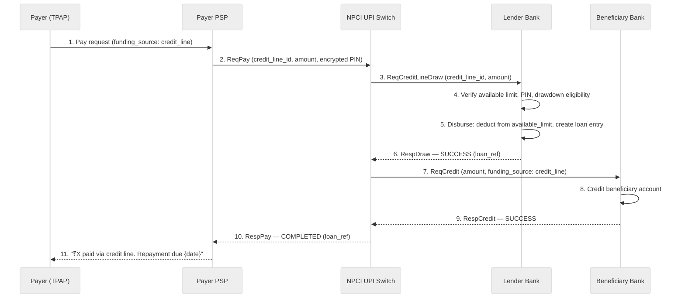
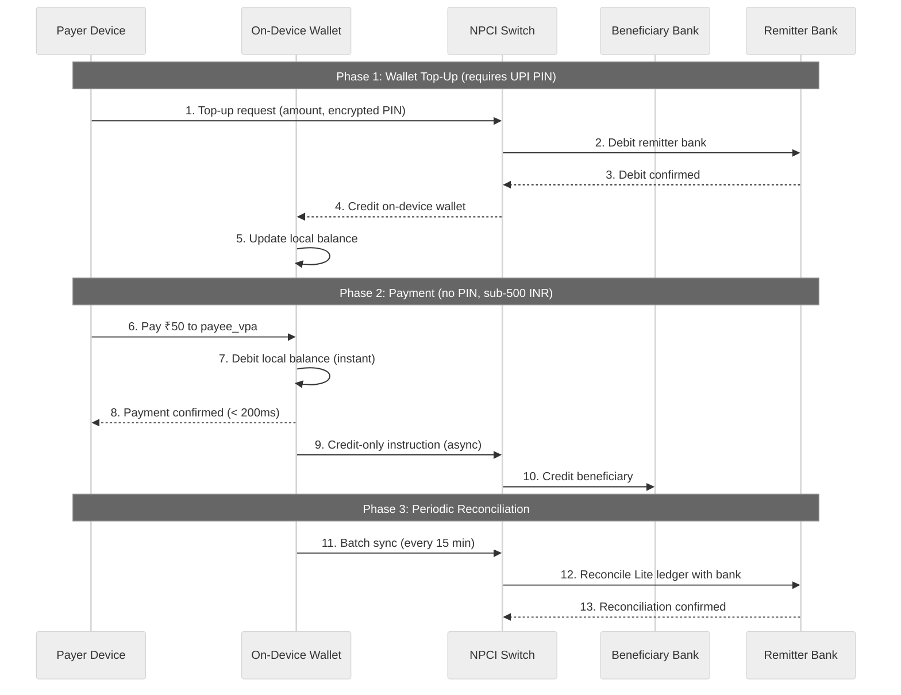
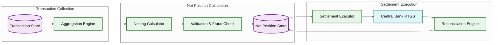

# High-Level Design

## Architecture Overview

The UPI Real-Time Payment System follows a **four-party hub-and-spoke model** with the central switch (NPCI UPI Switch) acting as the routing hub between Payer PSPs and Payee PSPs. The architecture is decomposed into five logical layers: **Client Layer** (Third-Party Application Providers — TPAPs — on both payer and payee side), **PSP Layer** (Payment Service Providers that onboard TPAPs and interface with the switch), **Central Switch** (NPCI UPI Switch responsible for VPA resolution, transaction routing, and settlement orchestration), **Bank Layer** (Remitter and Beneficiary banks running Core Banking Systems), and **Supporting Infrastructure** (Address Resolution Service, Transaction Store, Settlement Engine, Fraud & Risk Engine). Every transaction traverses the hub — no direct PSP-to-PSP or bank-to-bank messaging occurs — ensuring centralized auditability, compliance enforcement, and net settlement efficiency.

---

## System Architecture Diagram

---

## Data Flow — Pay Request (P2P / P2M)

The Pay Request is the most common UPI flow. The payer initiates a push payment — funds move from the payer's bank account to the payee's bank account in near real-time.

**Timeout Handling**: Each leg has a strict timeout — typically 30 seconds end-to-end. If the debit succeeds but the credit fails, the switch triggers an auto-reversal to the remitter bank. The transaction store maintains the state machine to ensure exactly-once processing.

---

## Data Flow — Mandate (AutoPay) Execution

Mandates enable recurring payments without requiring the payer to authenticate each time. The payer authorizes once (with UPI PIN), and subsequent executions are pre-authorized.

---

## Data Flow — Credit Line on UPI

Credit Line on UPI allows banks to disburse pre-approved credit via UPI, turning the payment rail into a lending channel. The payer selects a credit line instead of a bank account as the funding source.

---

## Data Flow — Collect Request

In a Collect Request the payee initiates the transaction — the flow is reversed:

1. **Payee** sends a collect request via their TPAP to the **Payee PSP**.
2. Payee PSP forwards `ReqCollect` to the **NPCI Switch**.
3. Switch resolves the **payer VPA** and routes the collect request to the **Payer PSP**.
4. Payer PSP delivers the collect notification to the **payer's TPAP**.
5. The payer reviews the request and **approves or declines**. If approved, the payer enters their UPI PIN.
6. From this point the debit-credit flow proceeds identically to steps 10-22 of the Pay Request.

Collect requests carry an **expiry window** (typically 30 minutes). If the payer does not respond, the request auto-expires and both parties are notified. Merchants frequently use collect requests for invoice-based payments and subscription renewals.

---

## Data Flow — UPI Lite (Small-Value Offline)

UPI Lite enables sub-500 INR payments without requiring a full debit leg to the remitter bank:

1. User pre-loads an on-device UPI Lite wallet (max balance 2,000 INR) from their bank account.
2. For small-value payments, the TPAP debits the local wallet and sends a single credit instruction to the switch.
3. The switch routes the credit to the beneficiary bank. No real-time debit to remitter bank occurs.
4. Wallet top-ups and reconciliation happen periodically with the remitter bank in batches.

This design reduces CBS load by 60-70% for high-frequency small transactions and enables near-offline payments.

---

## Key Architectural Decisions

### 1. Hub-and-Spoke vs. Peer-to-Peer

| Aspect | Hub-and-Spoke (Chosen) | Peer-to-Peer |
|--------|----------------------|--------------|
| Routing | Central switch routes all messages | PSPs connect directly |
| Compliance | Centralized audit trail and fraud detection | Each participant must implement |
| Settlement | Net settlement through single entity | Bilateral settlement per pair |
| Onboarding | New PSP connects once to hub | New PSP connects to every existing PSP |
| Single point of failure | Hub must be highly available | No single point of failure |

**Decision**: Hub-and-spoke chosen because centralized routing simplifies regulatory compliance (all transactions logged centrally), enables net settlement (reducing gross settlement volume by 85-90%), and allows new participants to onboard by connecting to a single entity.

### 2. Synchronous Transaction with Asynchronous Settlement

The transaction completes in real-time (account debited and credited within seconds), but actual inter-bank fund settlement happens in **net batches at T+0** (multiple settlement windows per day). This decouples user experience from inter-bank liquidity movement. Banks maintain a **settlement guarantee fund** to cover net obligations.

### 3. ISO 8583 / XML Messaging with PKI Encryption

All messages between participants use standardized financial message formats (ISO 8583 adapted into XML). Every message is digitally signed using the sender's private key and encrypted using the receiver's public key. The NPCI Certificate Authority manages the PKI infrastructure, issuing certificates to all participating entities.

### 4. VPA Abstraction Layer

The Virtual Payment Address (user@handle) decouples user identity from bank account details. A single VPA can be linked to multiple bank accounts, and users can change their underlying bank without changing their VPA. The Address Resolution Service maps VPA handles to PSP endpoints, and PSPs map VPAs to bank accounts.

### 5. Stateless Switch Processing

The NPCI switch processes each message statelessly — it does not maintain in-memory session state across message legs. All transaction state is persisted to the **Transaction Store** (a distributed, replicated database). This allows horizontal scaling of switch instances behind a load balancer. Any switch instance can process any leg of any transaction by reading state from the store.

---

## Architecture Pattern Checklist

| Pattern | Applied | Justification |
|---------|---------|---------------|
| Hub-and-Spoke | Yes | Central switch routes all inter-participant messages for compliance and settlement |
| Idempotent Operations | Yes | RRN (Retrieval Reference Number) ensures exactly-once processing across retries |
| Saga / Compensating Transactions | Yes | Auto-reversal triggered when debit succeeds but credit fails |
| Stateless Processing | Yes | Switch instances are stateless; state in Transaction Store for horizontal scaling |
| Event Sourcing | Yes | Every message leg is logged as an immutable event for audit and dispute resolution |
| PKI / Mutual TLS | Yes | All inter-participant communication encrypted and signed using certificate-based PKI |
| Circuit Breaker | Yes | Switch monitors bank CBS health; routes around degraded banks and triggers auto-reversal |
| Rate Limiting | Yes | Per-PSP and per-VPA rate limits to prevent abuse and protect bank CBS capacity |
| Bulkhead Isolation | Yes | Separate processing pools per bank/PSP to prevent one slow participant from blocking others |
| Time-Based Partitioning | Yes | Transaction store partitioned by date for efficient querying and regulatory retention |
| Asynchronous Settlement | Yes | Real-time transaction completion decoupled from net inter-bank settlement at T+0 windows |
| Health Monitoring | Yes | Continuous CBS health checks; dynamic routing around degraded participants |

---

## Capacity Estimates

| Metric | Value |
|--------|-------|
| Peak transactions per second (TPS) | ~30,000 TPS |
| Daily transaction volume | ~400 million |
| Average transaction latency (end-to-end) | < 2 seconds |
| P99 latency target | < 5 seconds |
| Transaction store write throughput | ~60,000 writes/sec (2 writes per txn) |
| VPA resolution lookups | ~30,000/sec |
| Settlement batches per day | 6-8 windows |
| Uptime SLA | 99.95% |

---

## Failure Modes and Recovery

| Failure | Detection | Recovery |
|---------|-----------|----------|
| Remitter bank CBS down | Health check timeout | Return FAILURE to payer; no debit attempted |
| Debit success, credit timeout | Credit leg timeout (10s) | Auto-reversal: reverse debit at remitter bank |
| Debit success, credit failure | Explicit NACK from beneficiary bank | Auto-reversal with reason code propagated |
| Switch instance crash | Load balancer health check | Another instance picks up; reads state from Transaction Store |
| Network partition between switch and PSP | TCP timeout + retry | Retry with same RRN; idempotency prevents duplicate processing |
| Settlement batch failure | Batch status monitoring | Re-run settlement batch; idempotent net calculation |
| Duplicate request from PSP | RRN lookup in Transaction Store | Return cached response; no duplicate processing |

---

## Settlement Architecture

Net settlement occurs at T+0 across multiple settlement windows per day. The Settlement Engine aggregates all completed transactions within a window and computes net positions for each participant.

**Settlement window process**:

1. **Cutoff**: At the scheduled window time, the Aggregation Engine snapshots all completed transactions since the previous window.
2. **Netting**: For each participant (bank/PSP), compute total debits, total credits, and net position. A bank that processed 10,000 debits totaling 50M INR and 8,000 credits totaling 45M INR has a net payable of 5M INR.
3. **Validation**: Cross-verify net positions (sum of all nets must be zero). Flag anomalies for manual review.
4. **Execution**: Submit net positions to central bank RTGS for actual fund transfer between participant settlement accounts.
5. **Reconciliation**: After RTGS confirmation, mark the batch as settled and update participant ledgers.

---

## Security Layers

| Layer | Mechanism | Purpose |
|-------|-----------|---------|
| Device Binding | Hardware-bound device fingerprint + SIM binding | Ensures requests originate from registered device |
| PIN Encryption | RSA + AES hybrid encryption with bank's public key | PIN never transmitted in plaintext; only issuer bank can decrypt |
| Message Signing | PKI digital signatures on all inter-participant messages | Non-repudiation and tamper detection |
| Transport | Mutual TLS between all participants | Encrypted channel with bidirectional authentication |
| Token Vault | Account numbers replaced with tokens in transit | Actual account details never leave the bank's boundary |
| Rate Limiting | Per-PSP, per-VPA, per-device throttling | Prevents brute-force and abuse |
| Fraud Detection | Real-time ML scoring on transaction patterns | Blocks suspicious transactions before debit |
| Geo-fencing | Device location vs. historical patterns | Flags transactions from unusual locations |

---

## Component Responsibility Matrix

| Component | Owns | Reads | Writes | SLA |
|-----------|------|-------|--------|-----|
| UPI Switch (Router) | Message routing, transaction orchestration | VPA cache, transaction state, health scores | Transaction state, audit log | p50 < 50ms per hop |
| Address Resolution Service | VPA-to-bank mapping | VPA registry, PSP handle registry | VPA cache entries | p99 < 100ms resolution |
| Transaction State Machine | Transaction lifecycle | Current state from store | State transitions (event-sourced) | Exactly-once state transitions |
| Fraud & Risk Engine | Risk scoring, velocity checks | Transaction history, device history | Risk scores, block decisions | p50 < 20ms scoring |
| Settlement Engine | Net position calculation | Completed transactions | Settlement files, net positions | Zero imbalance tolerance |
| Reconciliation Engine | T+0/T+1 reconciliation | Transaction store, bank responses | Reconciliation reports, reversal triggers | 100% coverage per cycle |
| Mandate Engine | Recurring payment scheduling | Mandate registry, execution history | Mandate state, pre-notifications | 24h pre-notification SLA |
| VPA Cache Cluster | Cached VPA resolutions | PSP change events | Cache entries with TTL | 95%+ cache hit rate |
| Deduplication Store | Idempotency enforcement | RRN + request ID index | Processing/completed status | p99 < 5ms lookup |
| Audit Log Store | Immutable transaction audit trail | — | Append-only log entries | 10-year retention |

---

## Technology Choice Rationale

| Layer | Choice | Rationale | Alternative Considered |
|-------|--------|-----------|----------------------|
| Message Format | ISO 8583 / XML | Industry standard for financial messaging; existing bank CBS integration | JSON/gRPC — faster but lacks financial message standardization |
| Transport Security | Mutual TLS + PKI signatures | Non-repudiation + encryption; regulatory requirement | OAuth2 + TLS — lacks non-repudiation for financial disputes |
| Transaction State Store | Distributed KV store with WAL | Low-latency reads, synchronous replication, horizontal partitioning | RDBMS — higher latency for simple key-value patterns at 30K+ TPS |
| VPA Cache | Distributed in-memory cache | Sub-5ms resolution for 95%+ of lookups | Embedded cache — insufficient for multi-DC consistency |
| Settlement File Format | Hash-chained signed files | Tamper detection + non-repudiation for regulatory submission | Plain CSV — no integrity verification |
| Deduplication Store | In-memory store with disk persistence | Sub-millisecond dedup checks critical for preventing double-debits | RDBMS — too slow at peak TPS for atomic check-and-insert |
| Message Queue | Distributed log-based broker | Ordered, durable event streaming for audit + settlement pipeline | Traditional message broker — lacks ordering guarantees per partition |
| Clock Synchronization | NTP with sub-1ms precision | Settlement window boundaries require consistent time across DCs | GPS-synced atomic clocks — cost-prohibitive for the accuracy needed |

---

## Cross-Border Architecture (Project Nexus)

Project Nexus extends UPI to cross-border payments by linking India's UPI switch with foreign fast payment systems (FPS). The architecture adds a cross-border gateway between the NPCI switch and foreign FPS switches, handling FX conversion, compliance screening, and bilateral settlement.

| Aspect | Domestic UPI | Cross-Border (Project Nexus) |
|--------|-------------|------------------------------|
| Settlement | T+0 multilateral net via central bank RTGS | T+0 to T+1 via bilateral nostro/vostro accounts |
| Currency | Single currency (INR) | Multi-currency with real-time FX at gateway |
| Compliance | Domestic AML/KYC | Additional FATF travel rule, sanctions screening |
| Latency | < 2s (p50) | < 30s (includes FX + compliance checks) |
| Message Format | ISO 8583/XML (domestic) | ISO 20022 at cross-border gateway (international standard) |
| VPA Resolution | Single VPA registry at NPCI | Federated resolution: domestic VPA → NPCI, foreign → partner FPS |
