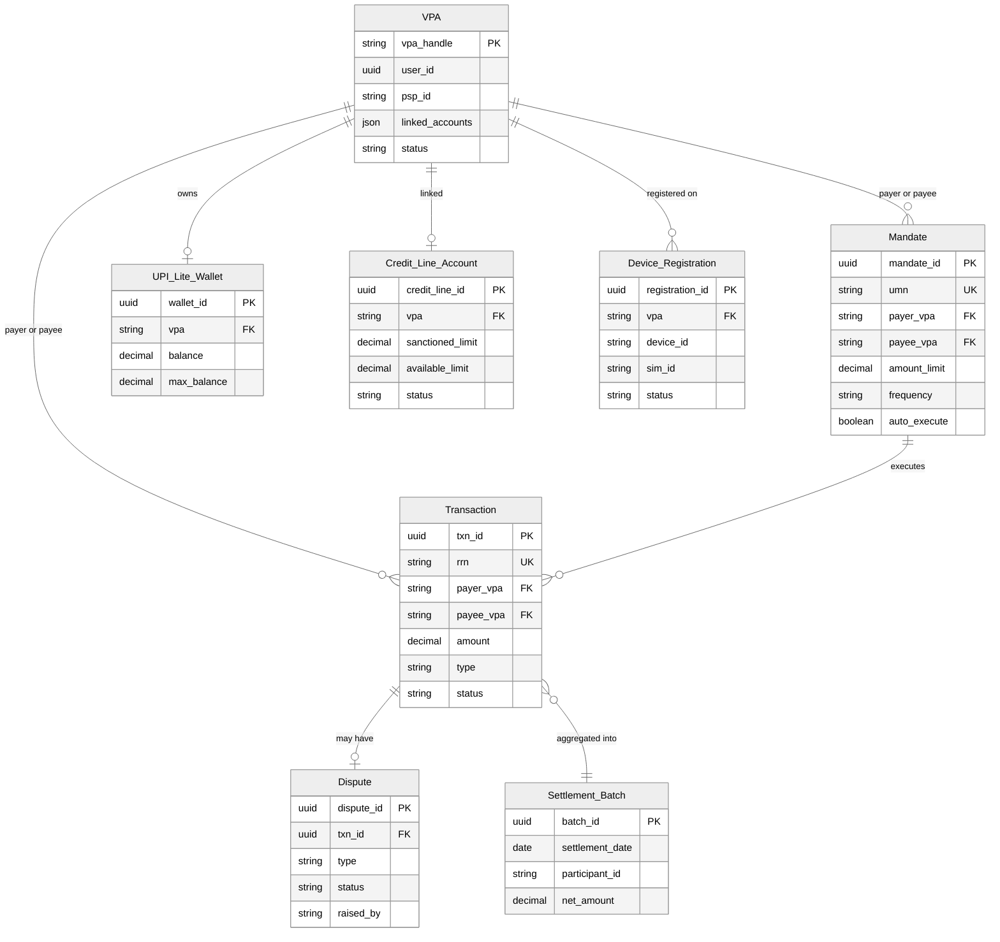
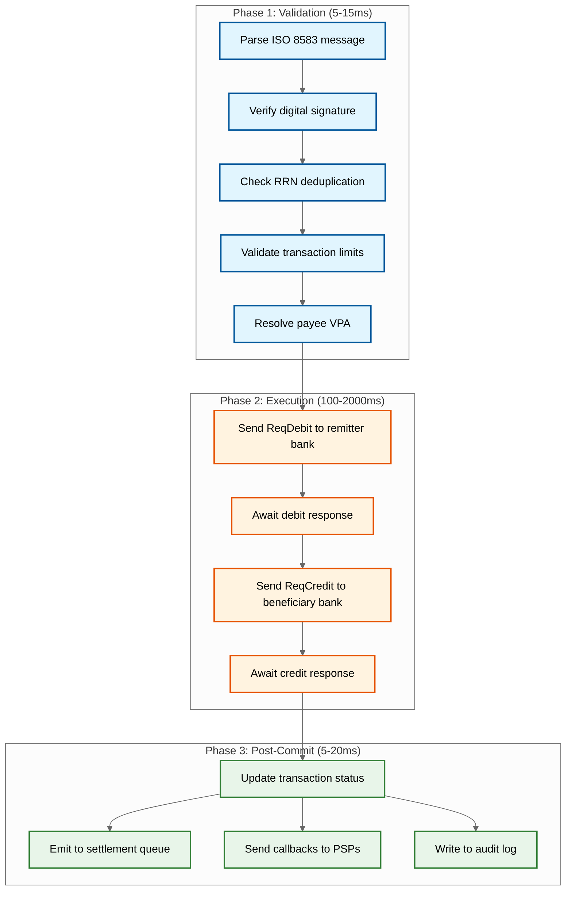
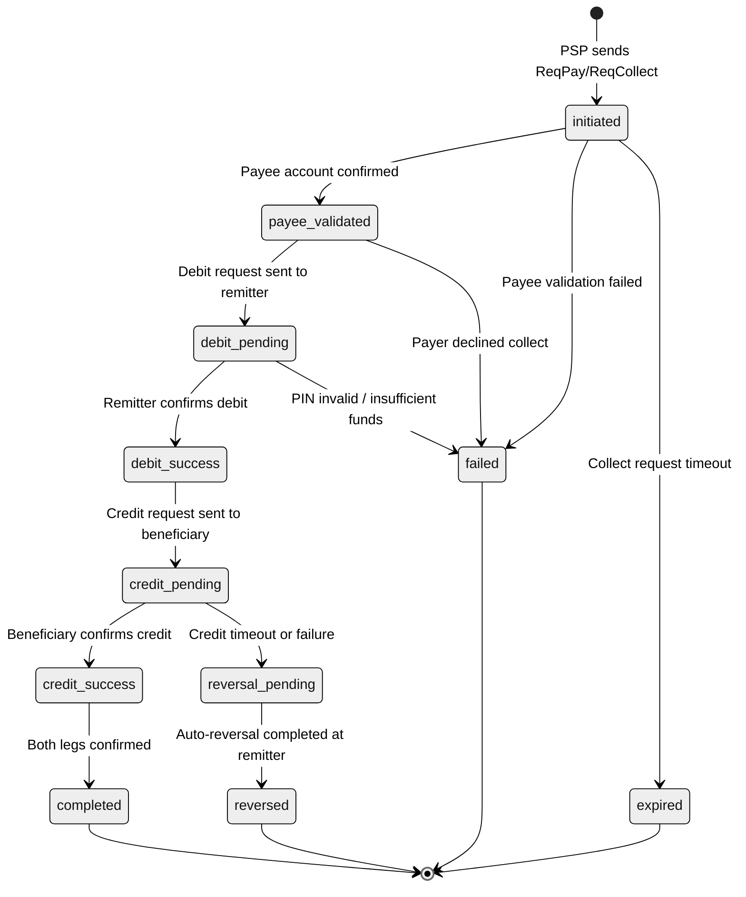
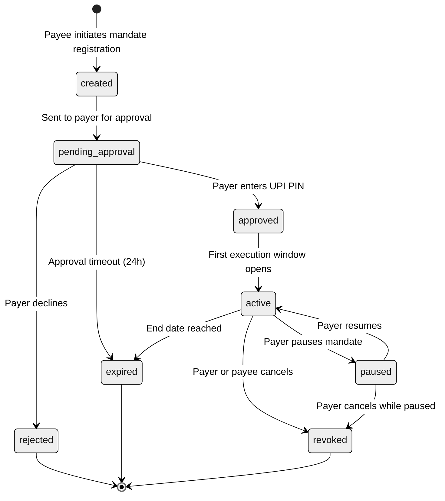

# Low-Level Design

## Data Models

### VPA (Virtual Payment Address)

```
VPA {
    vpa_handle          STRING      PRIMARY KEY  -- e.g., "user@bankpsp"
    user_id             UUID        NOT NULL
    psp_id              STRING      NOT NULL     -- PSP that owns the @handle
    linked_accounts     JSON[]      -- [{ifsc, account_token, is_primary, bank_name}]
    default_account_idx INT         DEFAULT 0
    status              ENUM        (active, inactive, blocked, deleted)
    device_fingerprint  STRING      -- bound device ID for security
    created_at          TIMESTAMP
    updated_at          TIMESTAMP
}
INDEX: (psp_id, status), (user_id)
```

### Transaction

```
Transaction {
    txn_id              UUID        PRIMARY KEY
    rrn                 STRING      UNIQUE       -- Retrieval Reference Number (idempotency key)
    upi_request_id      STRING      UNIQUE       -- originating request correlation ID
    payer_vpa           STRING      NOT NULL
    payee_vpa           STRING      NOT NULL
    amount              DECIMAL     NOT NULL
    currency            STRING      DEFAULT 'INR'
    type                ENUM        (pay, collect, mandate_execute, upi_lite, reversal)
    status              ENUM        (initiated, payee_validated, debit_pending,
                                     debit_success, credit_pending, credit_success,
                                     completed, failed, reversed, expired)
    failure_reason      STRING
    initiated_at        TIMESTAMP   NOT NULL
    completed_at        TIMESTAMP
    remitter_bank_ifsc  STRING      NOT NULL
    beneficiary_bank_ifsc STRING    NOT NULL
    payer_psp_id        STRING      NOT NULL
    payee_psp_id        STRING      NOT NULL
    mcc                 STRING      -- Merchant Category Code (P2M)
    remarks             STRING
    reversal_txn_id     UUID        -- FK → Transaction (if reversed)
}
INDEX: (payer_vpa, initiated_at DESC), (payee_vpa, initiated_at DESC)
INDEX: (rrn), (status, initiated_at)
PARTITION: RANGE on initiated_at (monthly) + HASH on payer_vpa (16 shards)
RETENTION: 10 years (RBI mandate)
```

### Mandate

```
Mandate {
    mandate_id          UUID        PRIMARY KEY
    umn                 STRING      UNIQUE       -- Unique Mandate Number
    payer_vpa           STRING      NOT NULL
    payee_vpa           STRING      NOT NULL
    amount_limit        DECIMAL     NOT NULL     -- max debit per execution
    frequency           ENUM        (one_time, daily, weekly, fortnightly, monthly,
                                     bimonthly, quarterly, half_yearly, yearly, as_presented)
    start_date          DATE        NOT NULL
    end_date            DATE        NOT NULL
    status              ENUM        (created, approved, active, paused, revoked, expired, rejected)
    auto_execute        BOOLEAN     DEFAULT false
    next_execution_date DATE
    execution_count     INT         DEFAULT 0
    created_at          TIMESTAMP
    approved_at         TIMESTAMP
}
INDEX: (payer_vpa, status), (payee_vpa, status)
INDEX: (next_execution_date, status, auto_execute)
```

### UPI Lite Wallet

```
UPI_Lite_Wallet {
    wallet_id           UUID        PRIMARY KEY
    vpa                 STRING      UNIQUE FK → VPA
    balance             DECIMAL     DEFAULT 0
    max_balance         DECIMAL     DEFAULT 2000  -- regulatory cap (INR)
    max_txn_amount      DECIMAL     DEFAULT 500
    linked_bank_ifsc    STRING      NOT NULL
    linked_account_token STRING     NOT NULL
    status              ENUM        (active, suspended, closed)
    last_sync_at        TIMESTAMP   -- last reconciliation with bank
    created_at          TIMESTAMP
}
INDEX: (vpa), (status, last_sync_at)
```

### Settlement Batch

```
Settlement_Batch {
    batch_id            UUID        PRIMARY KEY
    settlement_date     DATE        NOT NULL
    settlement_window   INT         NOT NULL     -- window number (1-8 per day)
    participant_id      STRING      NOT NULL     -- bank or PSP identifier
    participant_type    ENUM        (remitter_bank, beneficiary_bank, psp)
    gross_debit         DECIMAL     NOT NULL
    gross_credit        DECIMAL     NOT NULL
    net_amount          DECIMAL     NOT NULL     -- positive = receivable, negative = payable
    txn_count           INT         NOT NULL
    status              ENUM        (pending, calculated, submitted, settled, failed, reconciled)
    settled_at          TIMESTAMP
    created_at          TIMESTAMP
}
INDEX: (settlement_date, settlement_window, participant_id)
INDEX: (participant_id, settlement_date DESC), (status, settlement_date)
```

### Dispute

```
Dispute {
    dispute_id          UUID        PRIMARY KEY
    txn_id              UUID        FK → Transaction
    rrn                 STRING      NOT NULL
    type                ENUM        (transaction_not_found, amount_mismatch, duplicate_transaction,
                                     account_debited_not_credited, beneficiary_not_credited,
                                     fraud, unauthorized)
    status              ENUM        (raised, under_review, escalated, resolved_in_favour,
                                     resolved_against, auto_resolved, closed)
    raised_by           ENUM        (payer, payee)
    raised_by_vpa       STRING      NOT NULL
    resolution          STRING
    resolution_amount   DECIMAL
    raised_at           TIMESTAMP
    sla_deadline        TIMESTAMP   -- regulatory SLA (T+5 working days)
    resolved_at         TIMESTAMP
}
INDEX: (txn_id), (raised_by_vpa, raised_at DESC), (status, sla_deadline)
```

---

### Device Registration

```
Device_Registration {
    registration_id     UUID        PRIMARY KEY
    user_id             UUID        NOT NULL
    vpa                 STRING      FK → VPA
    device_id           STRING      NOT NULL     -- hardware-derived fingerprint
    sim_id              STRING      NOT NULL     -- IMSI hash (SIM binding)
    device_model        STRING
    os_version          STRING
    app_version         STRING
    public_key          BYTES       NOT NULL     -- device-bound asymmetric key
    key_algorithm       STRING      DEFAULT 'RSA-2048'
    attestation_token   STRING      -- hardware attestation (if supported)
    status              ENUM        (active, revoked, suspended, migrating)
    registered_at       TIMESTAMP
    last_used_at        TIMESTAMP
    revoked_at          TIMESTAMP
    revocation_reason   STRING
}
INDEX: (user_id, status), (device_id, status), (vpa)
```

### Credit Line Account

```
Credit_Line_Account {
    credit_line_id      UUID        PRIMARY KEY
    vpa                 STRING      FK → VPA
    lender_bank_ifsc    STRING      NOT NULL
    sanctioned_limit    DECIMAL     NOT NULL
    available_limit     DECIMAL     NOT NULL
    utilized_amount     DECIMAL     DEFAULT 0
    interest_rate_bps   INT         NOT NULL     -- basis points per annum
    validity_start      DATE        NOT NULL
    validity_end        DATE        NOT NULL
    status              ENUM        (active, frozen, expired, closed)
    last_drawdown_at    TIMESTAMP
    created_at          TIMESTAMP
}
INDEX: (vpa, status), (lender_bank_ifsc, status)
```

### Rate Limit Entry

```
Rate_Limit_Entry {
    key                 STRING      PRIMARY KEY  -- "psp:{id}" or "vpa:{handle}" or "device:{id}"
    window_type         ENUM        (second, minute, hour, day)
    window_start        TIMESTAMP   NOT NULL
    count               INT         DEFAULT 0
    amount_total        DECIMAL     DEFAULT 0    -- cumulative amount in window
    last_updated        TIMESTAMP
    ttl                 INT         -- auto-expire after window + grace period
}
INDEX: (key, window_type, window_start)
```

---

## Entity Relationship Diagram



---

## Indexing and Partitioning Strategy

| Table | Partitioning | Rationale |
|-------|-------------|-----------|
| Transaction | RANGE on `initiated_at` (monthly) + HASH on `payer_vpa` (16 shards) | Time-range queries for history + even write distribution |
| Settlement_Batch | RANGE on `settlement_date` (daily) | Each settlement window queries a single day |
| Dispute | RANGE on `raised_at` (monthly) | SLA monitoring queries recent disputes |
| VPA | HASH on `vpa_handle` | Uniform distribution for resolution lookups |
| Mandate | RANGE on `next_execution_date` | Scheduler scans upcoming mandates efficiently |

**Data Retention**: Financial transactions retained 10 years (RBI mandate). Data older than 2 years moved to cold storage with compressed columnar format. Active query layer covers the most recent 6 months in hot storage.

---

## API Design

All APIs use JSON payloads. Every mutating request requires an idempotency key (RRN) and PSP-level authentication via mutual TLS + digital signature.

### POST /v1/pay -- Initiate pay (push) transaction

```
Request:  { payer_vpa, payee_vpa, amount, currency, remarks, mcc, rrn, encrypted_credential, device_fingerprint }
Response: { txn_id, rrn, status: "initiated", payer_vpa, payee_vpa, amount }  -- 202 Accepted
```

### POST /v1/collect -- Send collect (pull) request

```
Request:  { payee_vpa, payer_vpa, amount, currency, remarks, ref_url, rrn, expiry_minutes }
Response: { txn_id, rrn, status: "collect_pending", expiry_at }  -- 202 Accepted
```

### POST /v1/mandate/create -- Create recurring mandate

```
Request:  { payer_vpa, payee_vpa, amount_limit, frequency, start_date, end_date, auto_execute, remarks, rrn }
Response: { mandate_id, umn, status: "created", awaiting: "payer_approval" }  -- 202 Accepted
```

### POST /v1/mandate/execute -- Execute mandate payment

```
Request:  { mandate_id, umn, amount, rrn, execution_date }
Response: { txn_id, mandate_id, status: "initiated" }  -- 202 Accepted
```

### GET /v1/txn/{txn_id} -- Get transaction status

```
Response: { txn_id, rrn, status, payer_vpa, payee_vpa, amount, type, initiated_at, completed_at }  -- 200 OK
```

### POST /v1/vpa/resolve -- Resolve VPA to bank details

```
Request:  { vpa }
Response: { vpa, psp_id, name: "Bob S****", is_verified, is_merchant }  -- 200 OK
```

### POST /v1/upi-lite/topup -- Top up UPI Lite wallet

```
Request:  { vpa, amount, encrypted_credential, rrn }
Response: { wallet_id, previous_balance, topup_amount, new_balance, max_balance }  -- 200 OK
```

### POST /v1/dispute/raise -- Raise dispute

```
Request:  { txn_id, rrn, type, raised_by, description }
Response: { dispute_id, txn_id, status: "raised", sla_deadline }  -- 201 Created
```

### POST /v1/credit-line/pay -- Pay using pre-approved credit line

```
Request:  { payer_vpa, payee_vpa, amount, credit_line_id, encrypted_credential, rrn }
Response: { txn_id, rrn, status: "initiated", funding_source: "credit_line", lender_bank }  -- 202 Accepted
```

### POST /v1/callback/txn-status -- Asynchronous transaction status callback (PSP → TPAP)

```
Callback: { txn_id, rrn, status, payer_vpa, payee_vpa, amount, completed_at, failure_reason }
Acknowledgment: 200 OK (TPAP must respond within 5 seconds)
```

### Rate Limiting

| Level | Limit | Window |
|-------|-------|--------|
| Per PSP | 10,000 TPS | Rolling 1 second |
| Per VPA (pay) | 20 transactions | Per hour |
| Per VPA (collect) | 10 requests | Per hour |
| Per device | 50 transactions | Per day |
| Per VPA (mandate execute) | 5 executions | Per day |
| Per credit line | 10 drawdowns | Per day |
| Global switch | 50,000 TPS | Rolling 1 second (hard ceiling) |

---

## Core Algorithms

### 1. VPA Resolution Algorithm

Maps a VPA (user@handle) to its owning PSP and underlying bank account.

```
FUNCTION resolve_vpa(vpa_handle):
    parts = SPLIT(vpa_handle, "@")
    IF LENGTH(parts) != 2:
        RETURN Error("Invalid VPA format")

    handle_suffix = parts[1]

    // Look up handle → PSP mapping (cached for 1 hour)
    psp_entry = CACHE_GET("handle:" + handle_suffix)
    IF psp_entry IS NULL:
        psp_entry = DB_QUERY(HandleRegistry, WHERE handle = handle_suffix)
        IF psp_entry IS NULL: RETURN Error("Unknown handle")
        CACHE_SET("handle:" + handle_suffix, psp_entry, TTL=3600)

    // Check VPA-level cache (short TTL since account links can change)
    cached = CACHE_GET("vpa:" + vpa_handle)
    IF cached IS NOT NULL: RETURN cached

    // Call owning PSP to validate VPA and retrieve account details
    psp_response = CALL_PSP(psp_entry.psp_id, "/internal/vpa/validate", {vpa: vpa_handle})
    IF psp_response.status != "active":
        RETURN Error("VPA inactive or not found")

    resolution = {
        vpa: vpa_handle,
        psp_id: psp_entry.psp_id,
        psp_endpoint: psp_entry.api_endpoint,
        bank_ifsc: psp_response.primary_account.ifsc,
        account_token: psp_response.primary_account.token,
        payee_name_masked: MASK_NAME(psp_response.account_holder_name),
        is_merchant: psp_response.is_merchant
    }
    CACHE_SET("vpa:" + vpa_handle, resolution, TTL=300)
    RETURN resolution
```

### 2. Transaction Routing Algorithm

Routes each transaction leg to the appropriate participant based on load, availability, and CBS health.

```
FUNCTION route_transaction(txn, target_type, target_id):
    // Check participant health
    health = HEALTH_REGISTRY.get(target_id)
    IF health.status == "down":
        IF target_type == "bank": RETURN Error("BANK_UNAVAILABLE")
        backup = HEALTH_REGISTRY.get_backup(target_id)
        IF backup IS NULL OR backup.status != "healthy":
            RETURN Error("PSP_UNAVAILABLE")

    // Check circuit breaker
    cb = CIRCUIT_BREAKER.get_state(target_id)
    IF cb == "open":
        IF cb.last_check + HALF_OPEN_INTERVAL < NOW(): cb = "half_open"
        ELSE: RETURN Error("CIRCUIT_OPEN")

    // Select endpoint via weighted round-robin penalizing high latency
    endpoints = ENDPOINT_REGISTRY.get_active(target_id)
    selected = NULL; max_score = -1
    FOR EACH ep IN endpoints:
        score = ep.weight * (1 - ep.current_load_pct)
        IF ep.avg_latency_ms > SLA_THRESHOLD_MS: score = score * 0.5
        IF score > max_score: max_score = score; selected = ep

    IF selected IS NULL: RETURN Error("No available endpoint")

    // Dispatch with timeout, sign request with NPCI private key
    start = NOW()
    response = HTTP_POST(selected.url, SERIALIZE(txn), timeout=PER_LEG_TIMEOUT_MS,
        headers={"X-Txn-Id": txn.txn_id, "X-RRN": txn.rrn,
                 "X-Signature": SIGN(txn, NPCI_PRIVATE_KEY)})
    latency = NOW() - start

    // Update circuit breaker metrics
    IF response.status == TIMEOUT OR response.status >= 500:
        CIRCUIT_BREAKER.record_failure(target_id)
        IF failure_count >= THRESHOLD: CIRCUIT_BREAKER.set_state(target_id, "open")
    ELSE:
        CIRCUIT_BREAKER.record_success(target_id)

    RETURN response
```

### 3. UPI PIN Encryption and Validation

UPI PIN never leaves the device in plaintext. Hybrid RSA+AES encryption ensures only the issuer bank can decrypt.

```
FUNCTION encrypt_upi_pin_on_device(pin, card_last6, expiry):
    // Get bank's RSA public key (cached on device during registration)
    bank_pubkey = DEVICE_KEYSTORE.get("bank_rsa_pubkey")
    IF bank_pubkey IS NULL OR bank_pubkey.is_expired():
        bank_pubkey = FETCH_FROM_PSP("/keys/bank-pubkey")
        DEVICE_KEYSTORE.store("bank_rsa_pubkey", bank_pubkey)

    // Build credential block: PIN + card details + expiry
    credential_block = CONCAT(pin, card_last6, expiry)

    // Encrypt with AES-256-GCM session key, wrap session key with RSA-OAEP
    session_key = GENERATE_RANDOM_AES_KEY(256)
    encrypted_data = AES_ENCRYPT(credential_block, session_key, MODE=GCM)
    encrypted_key = RSA_ENCRYPT(session_key, bank_pubkey, PADDING=OAEP)

    RETURN {
        encrypted_data: BASE64(encrypted_data),
        encrypted_key: BASE64(encrypted_key),
        key_index: bank_pubkey.key_id,
        hmac: HMAC_SHA256(encrypted_data, DEVICE_AUTH_KEY)
    }

FUNCTION validate_upi_pin_at_bank(payload, account_id):
    // Decrypt using HSM-stored private key
    private_key = HSM.get_key(payload.key_index)
    session_key = RSA_DECRYPT(BASE64_DECODE(payload.encrypted_key), private_key)
    credential = AES_DECRYPT(BASE64_DECODE(payload.encrypted_data), session_key)

    pin = credential[0:4]
    card_last6 = credential[4:10]
    expiry = credential[10:14]

    // Validate card details against account
    account = CBS.get_account(account_id)
    IF account.card_last6 != card_last6 OR account.expiry != expiry:
        RETURN Error("INVALID_CREDENTIALS")

    // Validate PIN hash in HSM
    stored_hash = HSM.get_pin_hash(account_id)
    computed_hash = HSM.compute_pin_hash(pin, account.salt)
    IF stored_hash != computed_hash:
        INCREMENT_FAILED_ATTEMPTS(account_id)
        IF failed_attempts >= MAX_PIN_ATTEMPTS:
            BLOCK_UPI_ACCESS(account_id)
            RETURN Error("ACCOUNT_BLOCKED")
        RETURN Error("INCORRECT_PIN")

    RESET_FAILED_ATTEMPTS(account_id)
    RETURN Success("PIN_VALIDATED")
```

### 4. Multilateral Net Settlement Calculator

Computes net positions for all bank pairs within a settlement window and generates a hash-chained settlement file.

```
FUNCTION compute_net_settlement(window_id, start_time, end_time):
    // Fetch all completed transactions in window
    transactions = QUERY(Transaction,
        WHERE status = 'completed'
        AND completed_at >= start_time AND completed_at < end_time)

    // Build bilateral net position matrix
    net_matrix = HashMap<(bank_a, bank_b), DECIMAL>()  // ordered pair → net amount

    FOR EACH txn IN transactions:
        pair = ORDERED_PAIR(txn.remitter_bank_ifsc, txn.beneficiary_bank_ifsc)
        IF txn.remitter_bank_ifsc < txn.beneficiary_bank_ifsc:
            net_matrix[pair] += txn.amount       // remitter owes beneficiary
        ELSE:
            net_matrix[pair] -= txn.amount       // reverse direction

    // Compute multilateral net per bank (single number per participant)
    bank_net = HashMap<bank_ifsc, DECIMAL>()
    FOR EACH (pair, amount) IN net_matrix:
        bank_net[pair.bank_a] -= amount          // bank_a pays if positive
        bank_net[pair.bank_b] += amount          // bank_b receives if positive

    // Validation: sum of all nets must be zero (conservation of money)
    total = SUM(bank_net.values())
    IF ABS(total) > 0.01:
        ALERT("Settlement imbalance detected", window_id, total)
        RETURN Error("SETTLEMENT_IMBALANCE")

    // Generate hash-chained settlement file
    settlement_file = NEW SettlementFile(window_id)
    previous_hash = GET_PREVIOUS_WINDOW_HASH(window_id - 1)

    FOR EACH (bank, net_amount) IN bank_net SORTED BY bank:
        entry = SettlementEntry(bank, net_amount, txn_count)
        entry_hash = SHA256(SERIALIZE(entry) + previous_hash)
        settlement_file.ADD(entry, entry_hash)
        previous_hash = entry_hash

    settlement_file.file_hash = previous_hash
    settlement_file.sign(NPCI_SIGNING_KEY)

    RETURN settlement_file
```

### 5. UPI Lite On-Device Transaction Processing

Processes sub-threshold payments entirely on-device without CBS interaction.

```
FUNCTION process_upi_lite_payment(wallet, payee_vpa, amount):
    // Pre-validation on device
    IF amount > wallet.max_txn_amount:
        RETURN Error("AMOUNT_EXCEEDS_LITE_LIMIT")
    IF wallet.balance < amount:
        RETURN Error("INSUFFICIENT_LITE_BALANCE")
    IF wallet.status != 'active':
        RETURN Error("WALLET_INACTIVE")

    // Debit on-device wallet (local atomic operation)
    txn_id = GENERATE_UUID()
    lite_txn = {
        txn_id: txn_id,
        type: "upi_lite",
        payee_vpa: payee_vpa,
        amount: amount,
        timestamp: NOW(),
        synced: false
    }

    BEGIN LOCAL_TRANSACTION:
        wallet.balance -= amount
        LOCAL_TXN_LOG.APPEND(lite_txn)
        PERSIST_TO_SECURE_STORAGE(wallet, lite_txn)
    COMMIT

    // Attempt server sync (non-blocking; queued if offline)
    IF NETWORK_AVAILABLE():
        ENQUEUE_SYNC(lite_txn)
    ELSE:
        MARK_FOR_DEFERRED_SYNC(lite_txn)

    RETURN Success(txn_id, wallet.balance)

FUNCTION sync_lite_transactions(wallet):
    // Called on reconnect or periodic interval (every 15 min)
    pending = LOCAL_TXN_LOG.GET_UNSYNCED()
    IF pending IS EMPTY: RETURN

    // Send batch to server
    response = SERVER.SUBMIT_LITE_BATCH(wallet.vpa, pending)

    FOR EACH result IN response.results:
        IF result.status == "accepted":
            LOCAL_TXN_LOG.MARK_SYNCED(result.txn_id)
        ELSE IF result.status == "rejected":
            // Server rejected (e.g., payee VPA invalid) — log for dispute
            LOCAL_TXN_LOG.MARK_DISPUTED(result.txn_id, result.reason)

    // Apply any server-side credits (top-ups while offline)
    IF response.pending_credits IS NOT EMPTY:
        FOR EACH credit IN response.pending_credits:
            wallet.balance += credit.amount
            LOCAL_TXN_LOG.APPEND(credit)
        PERSIST_TO_SECURE_STORAGE(wallet)
```

### 6. Mandate Execution Scheduler

Schedules and executes recurring auto-debit mandates with pre-notification.

```
FUNCTION run_mandate_scheduler():
    // Runs every hour; finds mandates due in the next 24-48 hours
    upcoming = QUERY(Mandate,
        WHERE status = 'active'
        AND auto_execute = true
        AND next_execution_date <= NOW() + 48_HOURS)

    FOR EACH mandate IN upcoming:
        time_until_exec = mandate.next_execution_date - NOW()

        IF time_until_exec <= 24_HOURS AND NOT NOTIFIED(mandate):
            // Send pre-debit notification (regulatory requirement)
            SEND_NOTIFICATION(mandate.payer_vpa,
                "Auto-debit of {amount} for {payee} on {date}. Tap to modify or cancel.")
            MARK_NOTIFIED(mandate.mandate_id)

        IF time_until_exec <= 0:
            // Execute mandate
            execute_mandate(mandate)

FUNCTION execute_mandate(mandate):
    // Check if payer has opted out since notification
    IF IS_PAUSED_OR_REVOKED(mandate.mandate_id):
        RETURN  // User cancelled

    // Validate amount against mandate limits
    IF mandate.amount_limit < mandate.next_amount:
        LOG_ERROR("Amount exceeds mandate limit", mandate.mandate_id)
        RETURN

    // Create transaction via standard UPI flow (without PIN — pre-authorized)
    txn = CREATE_TRANSACTION(
        payer_vpa: mandate.payer_vpa,
        payee_vpa: mandate.payee_vpa,
        amount: mandate.next_amount,
        type: 'mandate_execute',
        rrn: GENERATE_RRN(),
        mandate_id: mandate.mandate_id
    )

    result = SUBMIT_TO_SWITCH(txn)

    IF result.status == 'completed':
        mandate.execution_count += 1
        mandate.next_execution_date = COMPUTE_NEXT_DATE(mandate.frequency,
                                                         mandate.next_execution_date)
        UPDATE(mandate)
    ELSE:
        // Retry up to 3 times with exponential backoff
        ENQUEUE_RETRY(mandate.mandate_id, txn.txn_id, retry_count=0, max_retries=3)
```

---

## Transaction Write Path



---

## Latency Budget Breakdown

| Step | Operation | Budget | Notes |
|------|-----------|--------|-------|
| 1 | Message parsing + signature verification | 2-5ms | Pre-parsed connection pool |
| 2 | RRN deduplication check | 1-3ms | In-memory distributed store |
| 3 | Transaction limit validation | 1-2ms | Per-VPA counters in cache |
| 4 | VPA resolution (cache hit) | 2-5ms | 95%+ cache hit rate |
| 4a | VPA resolution (cache miss) | 20-50ms | Synchronous PSP lookup |
| 5 | Remitter bank debit (ReqDebit → RespDebit) | 50-500ms | Bank CBS dependent; p50 ~200ms |
| 6 | State store write (debit_success) | 2-5ms | Synchronous replicated write |
| 7 | Beneficiary bank credit (ReqCredit → RespCredit) | 50-500ms | Bank CBS dependent; p50 ~200ms |
| 8 | State store write (completed) | 2-5ms | Synchronous replicated write |
| 9 | Settlement queue emit | 1-2ms | Async append |
| 10 | PSP callback dispatch | 2-5ms | Async fire-and-forget |
| | **Total (happy path, p50)** | **~450ms** | **Within 2s target** |
| | **Total (worst case, p99)** | **~1.5s** | **Within 5s target** |
| | **Hard timeout** | **30s** | **Auto-reversal triggered** |

---

## Capacity Estimation

| Resource | Per Transaction | Daily (700M) | Peak Second (32K TPS) |
|----------|----------------|-------------|----------------------|
| Transaction store writes | 3 (initiate + debit + complete) | 2.1B writes | 96K writes/sec |
| VPA cache lookups | 1-2 | 700M-1.4B | 32K-64K/sec |
| Deduplication store ops | 2 (check + insert) | 1.4B | 64K ops/sec |
| Settlement queue entries | 1 | 700M | 32K entries/sec |
| Audit log entries | 1 | 700M | 32K entries/sec |
| Network messages (total hops) | 6-8 | 4.2B-5.6B | 192K-256K msgs/sec |
| PKI signature operations | 4-6 per txn | 2.8B-4.2B | 128K-192K ops/sec |

---

## Transaction State Machine



---

## Mandate Lifecycle State Machine


