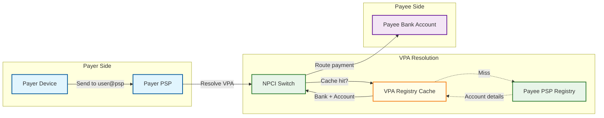
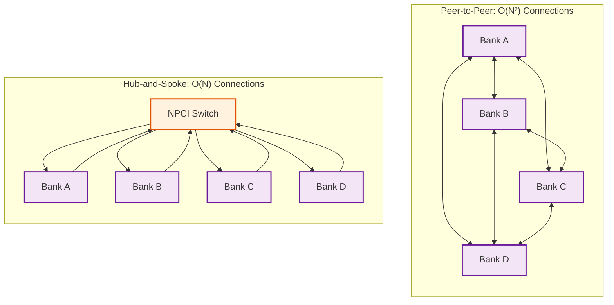
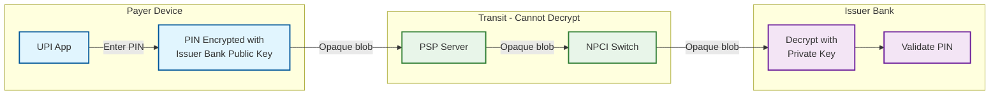
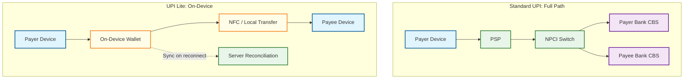
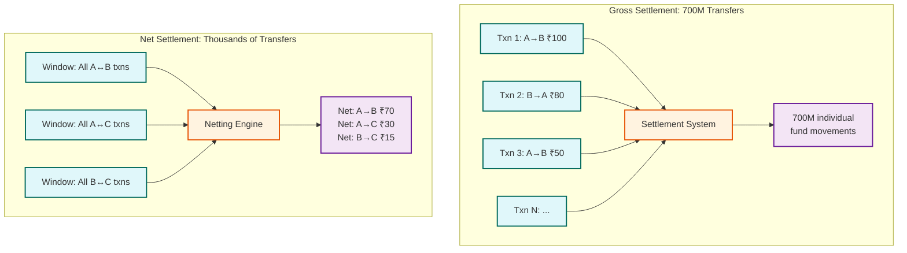

# Key Architectural Insights

## 1. The VPA Abstraction Layer as a Privacy and Portability Primitive

**Category:** System Modeling
**One-liner:** By mapping a human-readable address (user@handle) to bank account details through a PSP-managed indirection layer, UPI decouples payment identity from financial identity---enabling portability, privacy, and multi-bank linking without exposing account numbers.

**Why it matters:**
Most payment systems couple identity to a specific financial instrument---a card number, an IBAN, a bank account number. UPI's VPA abstraction creates a portable address that can be remapped to different bank accounts without changing the payment identifier visible to counterparties. This means a user can switch banks while keeping the same VPA, and the payer never learns the payee's account number---only the VPA is transmitted across the network. The architectural pattern---introducing a resolution layer between human-facing identifiers and system-internal addresses---appears in DNS (domain → IP), email routing (MX records), and service discovery (service name → endpoint), but UPI applies it to financial transactions with the added constraint of real-time resolution at 8,000+ QPS and strict consistency requirements (a stale VPA resolution could route money to the wrong account). The design insight is that indirection layers trade a small latency cost (one extra lookup) for massive gains in portability, privacy, and operational flexibility---and in UPI's case, the lookup is cached with a 15-minute TTL because VPA remapping is rare (~0.01% daily), making the amortized cost negligible.

**Transferable pattern**: Any system that needs to decouple human-facing identifiers from system-internal addresses benefits from this indirection layer---email, DNS, service meshes, and now financial payments all share the same architectural DNA.

---

## 2. Hub-and-Spoke Eliminates N² Integration at the Cost of a Centralized SPOF

**Category:** Scaling
**One-liner:** NPCI's central switch reduces 500+ bank integrations from O(N²) bilateral connections to O(N) hub connections, but creates a regulated single point of failure that must achieve 99.95%+ availability.

**Why it matters:**
Without a central hub, connecting 500 banks bilaterally requires 500 × 499 / 2 = 124,750 unique integration pairs, each needing its own message format negotiation, error handling protocol, and bilateral settlement agreement. NPCI's hub reduces this to 500 connections---one per bank. But the hub introduces a single point of failure: if NPCI goes down, the entire UPI ecosystem stops. This is mitigated operationally through active-active data centers with sub-second failover, geographic redundancy, and 99.95%+ uptime SLAs---but it cannot be eliminated architecturally. This is a deliberate regulatory design choice, identical to how payment card networks function as centralized switches for card transactions. The hub also enables capabilities that would be impossible in a peer-to-peer model: centralized fraud detection across the entire transaction graph, unified dispute resolution, multilateral net settlement (which reduces liquidity requirements by 60--70% compared to bilateral settlement), and standardized compliance enforcement. The trade-off is clear: O(N) integration complexity and centralized governance capabilities vs. a regulated SPOF that must be operationally bulletproof.

**Transferable pattern**: Hub-and-spoke vs. mesh is a universal topology decision. API gateways, message brokers, and service meshes all make the same trade-off: centralized routing reduces integration complexity at the cost of a critical dependency that must be highly available.

---

## 3. Stateless Switch with External State Store Enables Horizontal Scaling

**Category:** Scaling
**One-liner:** NPCI's switch processes messages statelessly---all transaction state lives in an external distributed store---allowing the switch to scale horizontally by simply adding more processing nodes without state migration.

**Why it matters:**
During normal operations, UPI processes ~8,000 TPS. During Diwali or New Year midnight, traffic surges to 32K+ TPS---a 4x spike that must be absorbed without degradation. If the switch maintained in-process transaction state, scaling would require state migration or sticky routing (sending all messages for a transaction to the same node), both of which add complexity and fragility. By externalizing all transaction state to a distributed key-value store (keyed by transaction ID), each switch node becomes interchangeable---any node can process any message for any transaction by reading the current state from the store, applying the transition, and writing the new state back. This is architecturally identical to how stateless HTTP servers scale behind a load balancer: the session state lives in an external store, and any server can handle any request. The critical requirement is that the external state store must support atomic compare-and-swap operations to prevent race conditions when two messages for the same transaction arrive at different switch nodes simultaneously. The operational benefit is profound: scaling for a festival surge is a capacity planning exercise (add nodes, add state store capacity), not an architectural change.

**Transferable pattern**: Stateless processing with externalized state is the foundation of horizontal scalability in any message-processing system---from HTTP servers to stream processors to payment switches.

---

## 4. End-to-End PIN Encryption Means the Router Never Sees the Secret

**Category:** Security
**One-liner:** UPI PIN is encrypted on the payer's device using the issuer bank's public key, ensuring that neither the PSP app nor NPCI (the central switch) can decrypt it---only the issuer bank that holds the private key.

**Why it matters:**
In card payment networks, the merchant (and sometimes the acquirer) sees the card number---a shared secret that can be stolen and reused. UPI's PIN handling is fundamentally different: the PIN is encrypted on the payer's device using asymmetric encryption with the issuer bank's public key. The encrypted blob passes through the PSP app and NPCI as an opaque payload---neither can decrypt it. Only the issuer bank, holding the corresponding private key, can decrypt and validate the PIN. This creates a trust model where the blast radius of a PSP compromise is limited: an attacker who fully compromises a PSP gains access to VPAs and transaction metadata, but never to PINs or bank credentials. The same attacker compromising NPCI gains access to transaction routing data but still cannot decrypt PINs. This is a zero-knowledge routing pattern: the intermediaries route the message without being able to read the sensitive payload. The architectural cost is key distribution---each device needs to obtain the issuer bank's public key, and key rotation requires a coordinated update across millions of devices. UPI handles this through the PSP app, which fetches the bank's public key during device registration and caches it locally.

**Transferable pattern**: Zero-knowledge routing---where intermediaries forward encrypted payloads without decryption capability---applies to end-to-end encrypted messaging, secure email relays, and any system where the transport layer should not have access to the payload.

---

## 5. Auto-Reversal Protocol Converts Ambiguous Failures into Guaranteed Outcomes

**Category:** Resilience
**One-liner:** When a debit succeeds but the credit leg fails or times out, NPCI's auto-reversal protocol guarantees that the payer's account is restored within 48 hours---converting every ambiguous intermediate state into a deterministic final state.

**Why it matters:**
In a 4-party transaction model, partial failures are not edge cases---they are routine. The payer's bank successfully debits the account, but the payee's bank is unreachable, or responds slowly, or credits the wrong account. Without a systematic resolution protocol, these partial failures create "money in limbo"---debited from the payer but not credited to the payee. UPI's auto-reversal protocol guarantees that every transaction reaches a deterministic final state: either fully completed (debit + credit) or fully reversed (debit reversed). The mechanism works in two stages. First, within the 30-second transaction timeout, if the credit leg fails, NPCI immediately sends a reversal request to the payer's bank, keyed by the transaction's unique RRN (Retrieval Reference Number). The RRN-based idempotency ensures that a reversal replayed due to network issues does not double-reverse. Second, a T+1 reconciliation batch job compares NPCI's transaction log against every bank's log. Any transaction where a debit exists without a matching credit triggers an automatic reversal within 48 hours. This two-stage approach (real-time reversal + batch reconciliation safety net) converts the distributed consistency problem from "impossible to guarantee" to "guaranteed within a bounded time window." The pattern is a distributed saga with regulatory enforcement: compensating transactions undo partial work, and a reconciliation layer catches anything the real-time saga missed.

**Transferable pattern**: Any distributed transaction spanning multiple independent systems benefits from this two-stage approach: real-time compensating actions for the common failure cases, plus a batch reconciliation safety net for edge cases that the real-time path misses.

---

## 6. UPI Lite Offloads Small-Value Transactions to On-Device Wallets

**Category:** Cost Optimization
**One-liner:** By processing transactions of ₹500 or less on a pre-funded on-device wallet without routing through the central switch or requiring a UPI PIN, UPI Lite reduces switch load by 10--15% while enabling offline NFC payments.

**Why it matters:**
The distribution of UPI transactions follows a power law: a large percentage of transactions are for small amounts (tea, auto-rickshaw, street vendor). Routing each of these through the full NPCI switch---VPA resolution, bank CBS debit, bank CBS credit, settlement---is architecturally wasteful. UPI Lite introduces a tiered processing strategy: transactions at or below ₹500 are processed entirely on-device from a pre-funded wallet (loaded via a standard UPI transaction up to ₹2,000 balance). No UPI PIN is required (reducing friction), no NPCI switch routing occurs (reducing infrastructure load), and with UPI Lite X, the transaction can happen offline via NFC (extending UPI to connectivity-poor areas). The architectural challenge is the sync-on-reconnect problem: when an offline device reconnects, it must reconcile its local wallet state with the server. Conflicts can arise if the wallet was loaded on the server side while the device was offline. The resolution is simple: the on-device wallet is authoritative for debits (the device spent the money), and the server is authoritative for credits (the server loaded the wallet). Upon reconnect, the device pushes its debit log, and the server pushes any pending credits. This tiered approach---different processing paths for different transaction values---is a form of workload partitioning that optimizes cost per transaction while maintaining the same user experience.

**Transferable pattern**: Tiered processing based on transaction value or risk---routing low-value/low-risk operations through a cheaper fast path while reserving the full infrastructure path for high-value operations---is applicable to any high-volume transaction system (CDN edge caching, database read replicas, tiered storage).

---

## 7. Multilateral Net Settlement Reduces Liquidity Requirements by 60--70%

**Category:** Cost Optimization
**One-liner:** Instead of settling each of the 700M daily transactions individually (RTGS-style), NPCI batches transactions into settlement windows and calculates net positions per bank pair---reducing the actual fund movement from 700M operations to a few thousand net transfers.

**Why it matters:**
If every UPI transaction required immediate gross settlement (real-time movement of funds between banks), the banking system would need to process 700M+ individual fund transfers per day. This is operationally impossible and would require banks to maintain enormous liquidity reserves to cover peak outflows. Multilateral net settlement transforms this: NPCI accumulates all transactions during a settlement window (typically 4--6 windows per day), then calculates the net position for each bank pair. If Bank A sent ₹500Cr to Bank B and Bank B sent ₹450Cr to Bank A during the window, only the net ₹50Cr moves from A to B. Across 500+ banks, this netting reduces the total fund movement by 60--70% compared to gross settlement. The trade-off is delayed finality: in gross settlement, each transaction is final immediately; in net settlement, finality is deferred until the settlement window closes. UPI accepts this trade-off because the transaction confirmation to the user is separate from inter-bank settlement---the user sees "payment successful" immediately (because the debit and credit are committed at the respective banks), but the actual inter-bank fund transfer happens in the next settlement window. The risk is settlement failure: if a bank cannot meet its net obligation at settlement time, all transactions involving that bank in the window are at risk. This is mitigated by pre-funded settlement accounts and central bank liquidity facilities.

**Transferable pattern**: Batch netting---accumulating bilateral obligations and settling only the net difference---applies to any system with high-frequency bilateral transfers: inter-company invoicing, ad exchange payments, marketplace seller payouts, and inter-datacenter data replication cost optimization.

---

---

## 8. Heterogeneous Bank CBS Latency Creates the True Scaling Boundary

**Category:** Scaling
**One-liner:** The UPI switch can scale horizontally, but the system's end-to-end latency is bounded by the slowest bank CBS in the critical path---a dependency that cannot be solved architecturally, only managed operationally.

**Why it matters:**
NPCI's switch is a stateless message router that can scale to 50K+ TPS by adding instances. But every transaction requires two synchronous calls to bank Core Banking Systems---one for the debit, one for the credit. These CBS systems are often legacy mainframes designed for batch processing, not real-time APIs. Large banks respond in 200-500ms; small banks may take 5-10 seconds. This heterogeneity means the system's latency profile is bimodal: transactions between two large banks complete in under 1 second, while transactions involving a small bank may take 10+ seconds. The architectural insight is that horizontal scaling of the routing layer doesn't help when the Slowest part of the process is a synchronous dependency on external systems with fixed capacity. NPCI's response is operational, not architectural: bank health scoring, circuit breakers, traffic-based quotas, and a regulatory scorecard that creates incentives for banks to improve CBS performance. The health score (recalculated every 30 seconds) dynamically reduces traffic to degraded banks, protecting the overall system SLO at the cost of availability for that specific bank's users. This is a fundamental lesson for any hub-and-spoke system: **the hub's performance is bounded by its slowest spoke, and the solution is adaptive traffic management, not faster routing.**

**Transferable pattern**: Any system that acts as a router between heterogeneous backends (API gateways, service meshes, CDN origin pull) faces the same constraint. Health-based traffic shaping is more effective than over-provisioning the router.

---

## 9. Credit Line on UPI Transforms Payment Rail into Lending Distribution Channel

**Category:** System Modeling
**One-liner:** By allowing banks to expose pre-approved credit lines as a UPI funding source, RBI turned the payment infrastructure into a lending channel---blurring the boundary between payment processing and credit disbursal in a single atomic flow.

**Why it matters:**
Traditionally, lending and payments are separate systems: a loan is disbursed to a bank account, and the borrower then uses UPI to spend from that account. Credit Line on UPI collapses this into a single transaction: when the payer selects a credit line as the funding source, the lender bank simultaneously creates a loan entry, deducts from the available credit limit, and credits the beneficiary---all within the standard UPI message flow. This is architecturally significant because it adds a new participant to the four-party model (the lender bank, which may be different from the remitter bank) and introduces credit risk assessment into the real-time transaction path. The lender bank must evaluate the drawdown (is the credit line active? does the amount exceed the available limit? is the borrower's risk profile still acceptable?) within the same latency budget as a regular debit. The design choice to embed lending into the existing payment protocol rather than creating a separate lending API is a form of protocol extension: the message format is enriched with credit-specific fields, but the routing, settlement, and reconciliation paths remain unchanged. This minimizes integration effort for PSPs and banks while creating an entirely new product category.

**Transferable pattern**: Protocol extension---enriching existing message formats to support new use cases without changing the routing infrastructure---is a powerful growth pattern for platform systems. GraphQL field additions, HTTP header extensions, and API versioning all follow this principle.

---

## 10. Device Binding Creates a Hardware Root of Trust for Software Transactions

**Category:** Security
**One-liner:** UPI binds each VPA to a specific physical device via hardware-derived fingerprints and SIM identity, creating a possession factor that turns the smartphone into a hardware security token---without requiring a dedicated security device.

**Why it matters:**
Card payment security relies on "something you have" (the card) and "something you know" (the PIN). UPI achieves the same two-factor model without a physical card by binding the VPA to a device via hardware fingerprinting (IMEI, secure element identity, hardware attestation tokens) and SIM binding (IMSI hash). The PSP app generates a device-bound cryptographic key pair during registration, stored in the device's hardware-backed keystore (TEE or secure enclave). This key signs every transaction request, creating a non-repudiable link between the transaction and the physical device. The security implication is profound: even if an attacker steals the UPI PIN, they cannot transact without the bound device. A SIM swap triggers a re-registration flow that requires full re-authentication. This creates a hardware root of trust for what is fundamentally a software transaction. The trade-off is device migration friction---when a user changes phones, they must re-register, which requires the old device to be deregistered (or a bank-verified identity flow). At 300M+ monthly active users, device migration is a high-volume operational event that must be both secure (prevent unauthorized device changes) and low-friction (not lose users to competitor apps).

**Transferable pattern**: Hardware root of trust for software systems---using device-bound keys, hardware attestation, and platform secure enclaves---applies to any system where possession-based authentication is needed without dedicated hardware tokens: banking apps, corporate VPN access, and IoT device identity.

---

## 11. Project Nexus Transforms Domestic Payment Rails into Cross-Border Infrastructure

**Category:** Scaling
**One-liner:** Rather than building a separate cross-border payment system, Project Nexus links existing domestic fast payment systems (UPI, PayNow, etc.) through a standardized gateway layer---reusing domestic infrastructure for international payments.

**Why it matters:**
Cross-border payments traditionally use SWIFT, which is slow (T+1 to T+5), expensive ($15-45 per transfer), and designed for institutional transfers. Project Nexus takes a fundamentally different approach: instead of a new global network, it creates a gateway layer that translates between domestic fast payment systems. A UPI user in India can pay a PayNow user in Singapore by sending a standard UPI transaction that the cross-border gateway intercepts, converts to the destination format, performs FX and compliance checks, and delivers to the foreign FPS. The architectural insight is that domestic payment rails already solve the hardest problems---identity resolution, real-time clearing, regulatory compliance, fraud detection. Cross-border is "just" a translation and settlement problem at the gateway. The gateway adds three concerns: (1) FX conversion at market rates with tight spread, (2) FATF travel rule compliance (sender and receiver identity must be transmitted), and (3) bilateral settlement between central banks via nostro/vostro accounts. By reusing UPI's existing VPA resolution, transaction state machine, and auto-reversal protocol domestically, and adding only a thin cross-border gateway, the architecture achieves cross-border payments at a fraction of SWIFT's cost and latency.

**Transferable pattern**: Protocol translation gateways that bridge incompatible systems by handling translation at the edge while preserving each system's internal architecture---this is the pattern behind API gateways, email relay servers, and cross-chain blockchain bridges.

---

## Cross-Cutting Themes

| Theme | Insights | Key Takeaway |
|-------|----------|-------------|
| **Indirection as an architectural superpower** | #1 (VPA abstraction), #4 (PIN encryption routing) | Adding a resolution or routing layer between human-facing interfaces and system internals enables privacy, portability, and security---at the cost of one extra hop that can be amortized through caching |
| **Centralization trade-offs in regulated systems** | #2 (hub-and-spoke), #5 (auto-reversal via NPCI) | Centralized coordination enables standardization, settlement netting, and dispute resolution, but creates SPOFs that must be mitigated operationally rather than architecturally---this is a deliberate design choice in regulated financial infrastructure |
| **Tiered processing for cost efficiency** | #6 (UPI Lite on-device), #7 (net vs gross settlement) | Not all transactions deserve the same processing path---routing low-value or high-frequency operations through cheaper paths (on-device wallets, batch netting) while reserving full infrastructure for high-value operations dramatically reduces system-wide cost |
| **Statelessness enables elastic scaling** | #3 (stateless switch), #5 (idempotent reversals via RRN) | Externalizing state from processing nodes and using idempotent operations (RRN-keyed) allows the system to scale horizontally for 4x traffic surges without state migration or sticky routing |
| **Protocol extension as a growth lever** | #9 (credit line on UPI), #11 (Project Nexus) | Extending existing message formats and routing paths to support new use cases (lending, cross-border) is more powerful than building separate systems---it leverages network effects and existing integrations |
| **Hardware trust in software systems** | #10 (device binding), #4 (E2E PIN encryption) | Combining device-bound keys with end-to-end encryption creates a security model where the routing infrastructure never sees sensitive data---minimizing the blast radius of any single compromise |

---

## How These Insights Connect

The eleven insights form a coherent architectural narrative for UPI:

1. **Identity layer** (#1 VPA): A portable, privacy-preserving addressing scheme decouples users from their bank accounts, enabling the entire multi-bank ecosystem.

2. **Topology layer** (#2 Hub-and-spoke): The central switch reduces integration complexity from quadratic to linear, making it feasible to connect 500+ banks through a single regulated entity.

3. **Processing layer** (#3 Stateless switch): By externalizing state, the switch scales elastically to absorb 4x traffic surges during festivals without architectural changes.

4. **Security layer** (#4 E2E PIN encryption, #10 Device binding): Zero-knowledge routing combined with hardware root of trust ensures that neither the intermediaries nor attackers who compromise them can access sensitive credentials.

5. **Reliability layer** (#5 Auto-reversal): The two-stage reliability model (real-time reversal + batch reconciliation) guarantees that every transaction reaches a deterministic final state, even when banks fail mid-transaction.

6. **Optimization layer** (#6 UPI Lite, #7 Net settlement): Tiered processing and batch netting reduce infrastructure costs and liquidity requirements by orders of magnitude, making the system economically viable at 700M+ daily transactions.

7. **Boundary management** (#8 Bank CBS latency): The system's true scaling boundary is not the switch but the heterogeneous bank CBS systems---requiring adaptive operational management rather than architectural solutions.

8. **Platform extension** (#9 Credit line, #11 Cross-border): By extending the existing payment protocol rather than building separate systems, UPI transforms from a domestic payment rail into a platform for lending and cross-border commerce.

Together, these layers demonstrate a recurring principle in large-scale financial infrastructure: **each layer of abstraction (addressing, routing, state management, security, reliability, optimization, boundary management, platform extension) solves a specific class of problems independently, and the composition of these layers creates a system that is greater than the sum of its parts.**

The UPI architecture is notable for how few of its innovations are novel in isolation---VPA is DNS, the switch is a message broker, auto-reversal is a saga, net settlement is batch netting, device binding is a hardware token. What makes UPI architecturally significant is the composition: these well-understood patterns are combined into a system that processes 700M+ daily transactions across 500+ banks with sub-second latency, zero-MDR economics, and multi-modal access (smartphone, feature phone, NFC, USSD)---a combination that no other payment system has achieved at comparable scale.
