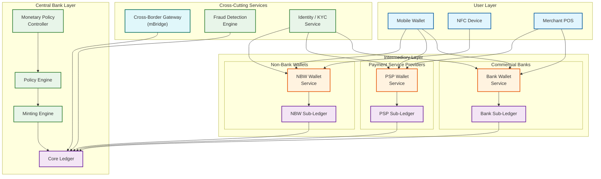
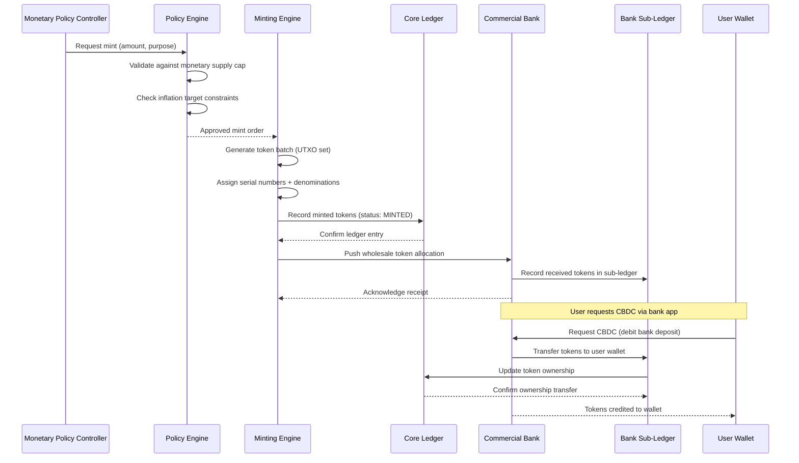
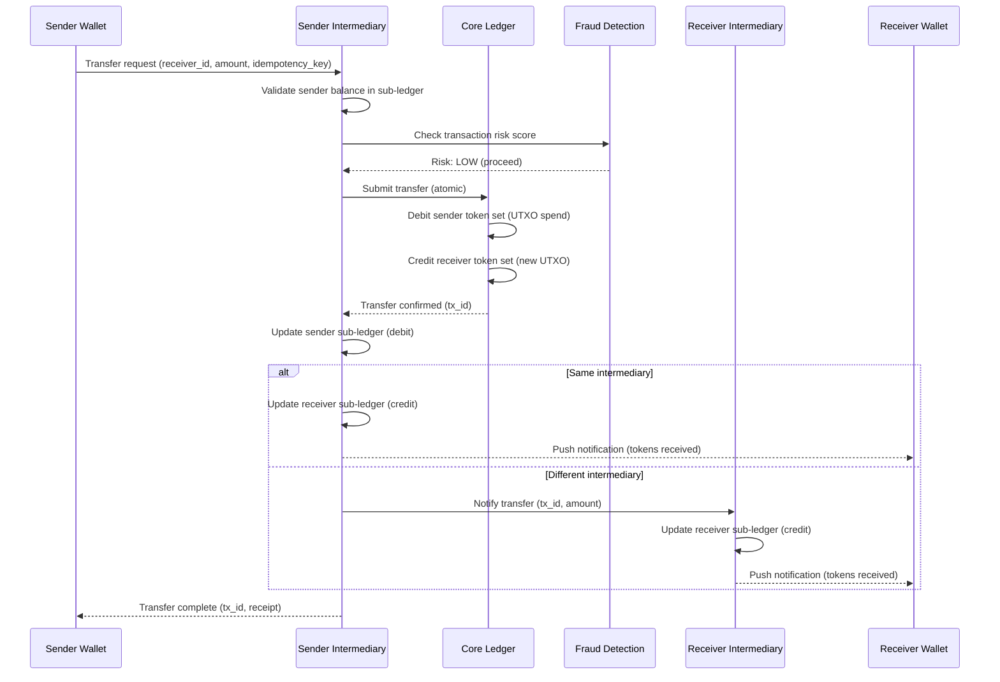
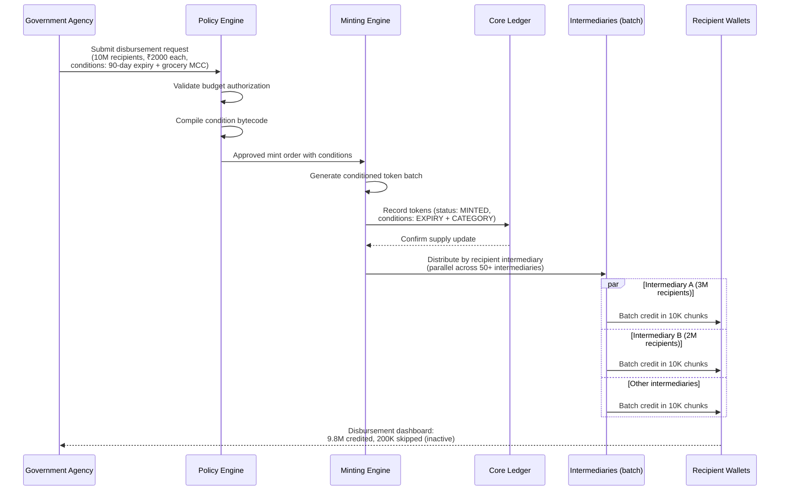
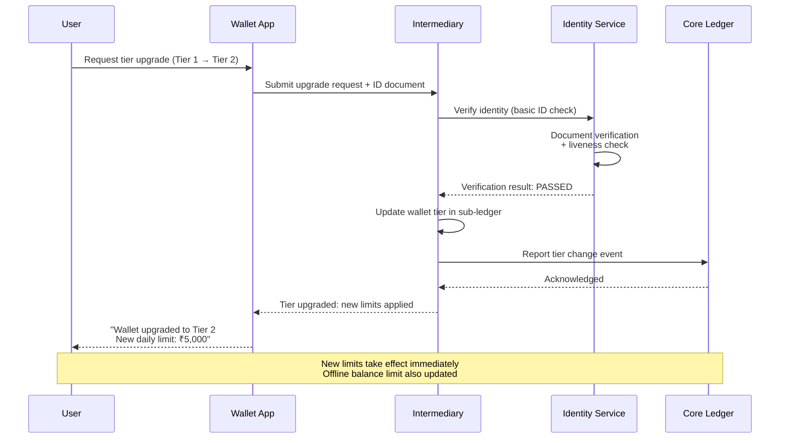
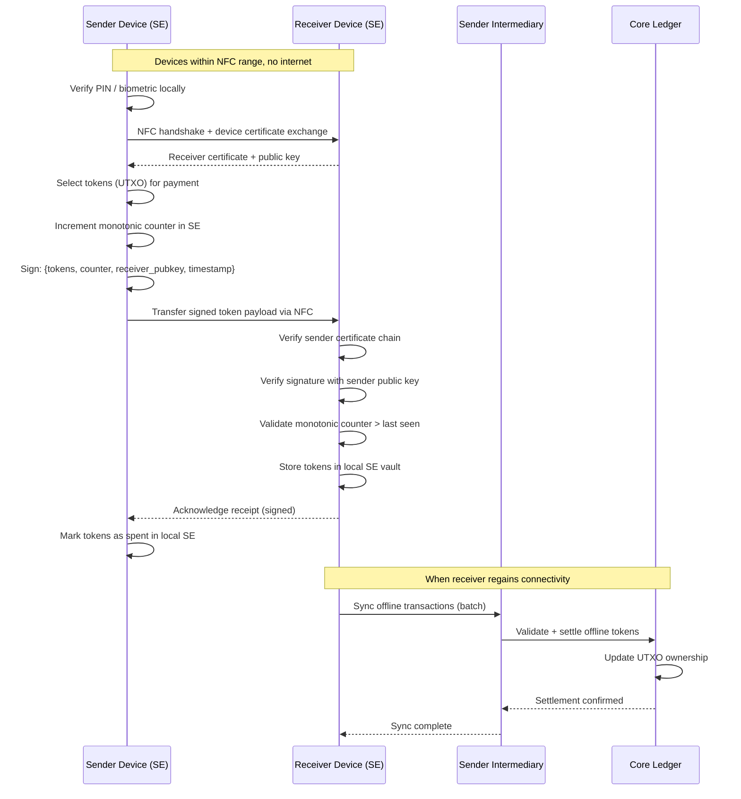
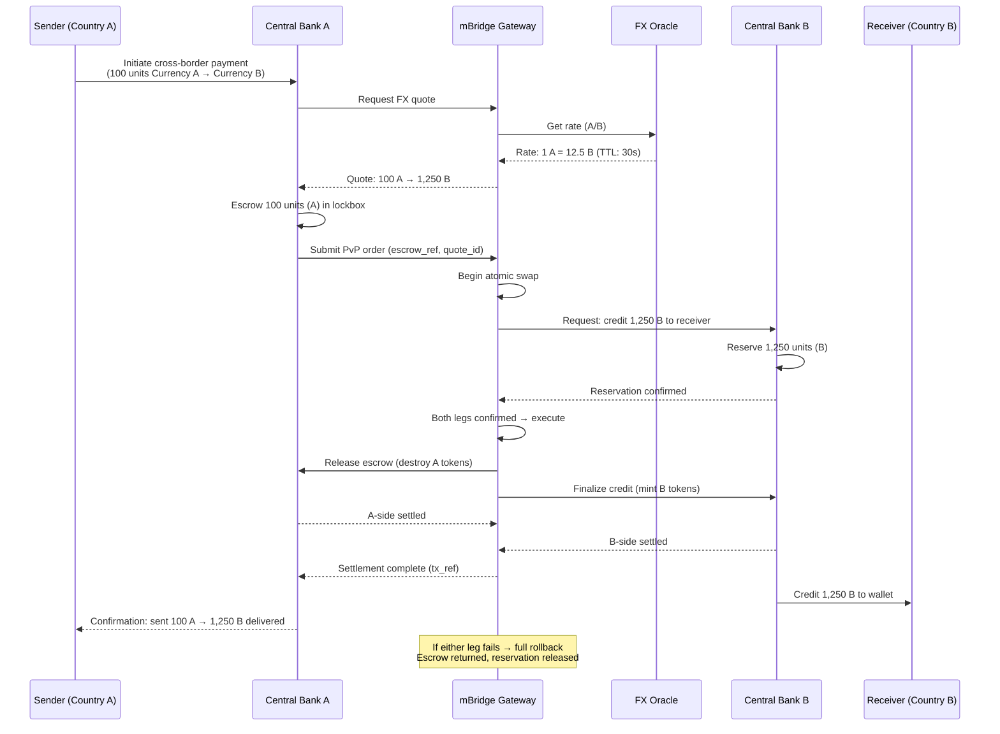
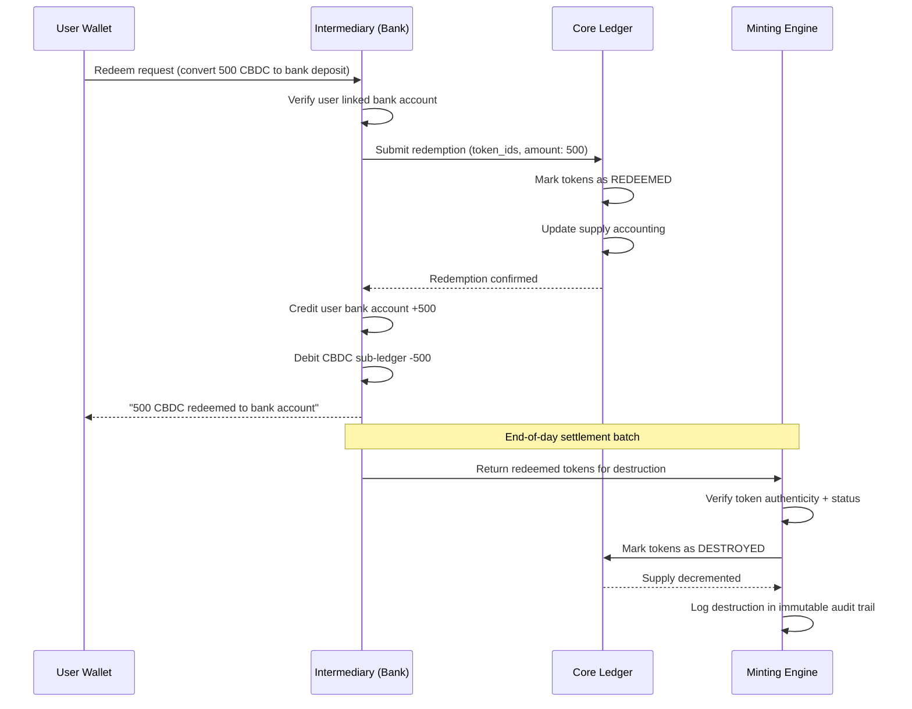

# High-Level Design

## Architecture Overview

A Central Bank Digital Currency (CBDC) platform operates as a **two-tier system**: the central bank issues and redeems the digital currency while commercial banks, payment service providers (PSPs), and non-bank wallets serve as intermediaries that distribute tokens to end users. This preserves the existing financial system hierarchy, prevents disintermediation of commercial banks, and allows the central bank to focus on monetary policy rather than retail operations. Cross-border interoperability is handled through a dedicated gateway that bridges multiple CBDC networks for real-time settlement.

---

## System Architecture Diagram

---

## Data Flows

### 1. Token Minting and Distribution Flow

The central bank mints new CBDC tokens in response to monetary policy decisions. Tokens flow downward through the two-tier hierarchy: central bank mints, intermediaries receive wholesale allocations, and end users receive retail tokens through their wallets.

### 2. Online Peer-to-Peer Transfer Flow

Real-time domestic transfers between wallets use synchronous processing through the intermediary layer. The intermediary validates balances, updates sub-ledgers, and propagates the ownership change to the core ledger.

### 3. Programmable Disbursement Flow

Government agencies issue targeted payments with programmable conditions. The flow demonstrates how conditions are attached at minting time and enforced throughout the token lifecycle.

### 4. Wallet Tier Upgrade Flow

Users can upgrade their wallet tier to increase transaction limits, requiring progressive KYC verification at each level.

### 5. Offline NFC Payment Flow

Offline payments use device-to-device communication via NFC with a secure element (SE) or trusted execution environment (TEE) to prevent double-spending. Transactions are stored locally and synchronized when connectivity is restored.

### 6. Cross-Border Atomic Settlement Flow

Multi-CBDC settlement uses atomic Payment-versus-Payment (PvP) to eliminate correspondent banking chains and settlement risk.

### 7. Redemption and Token Destruction Flow

Users convert CBDC back to commercial bank deposits. Tokens are returned through the two-tier hierarchy and ultimately destroyed by the central bank.

---

## Key Architectural Decisions

### 1. Two-Tier Model over Direct CBDC Model

| Aspect | Decision | Rationale |
|--------|----------|-----------|
| Distribution | Intermediaries distribute to end users, not the central bank directly | Preserves existing banking system; avoids central bank managing millions of retail accounts |
| Scalability | Intermediaries handle retail transaction throughput | Central bank processes only wholesale settlements; intermediary sub-ledgers absorb 99% of retail load |
| Competition | Multiple intermediary types (banks, PSPs, fintechs) | Promotes innovation and service quality through market competition |
| Risk | Central bank avoids credit risk with end users | Intermediaries bear KYC, AML, and customer service obligations |

### 2. Hybrid Token Model: UTXO for Offline, Account-Based for Online

| Aspect | Decision | Rationale |
|--------|----------|-----------|
| Offline payments | Token-based (UTXO) with cryptographic ownership | Tokens are self-contained; no ledger lookup needed for device-to-device transfer |
| Online payments | Account-based for high-throughput retail | Simpler balance management; efficient for frequent small transactions |
| Bridge | UTXO tokens are "wrapped" into account balances on sync | Seamless transition between offline and online modes |
| Privacy | UTXO provides transaction-level unlinkability | Harder to trace full payment graphs compared to account model |

### 3. Permissioned DLT for Intermediary Layer, Centralized DB for Central Bank Core

| Aspect | Decision | Rationale |
|--------|----------|-----------|
| Central bank | Centralized relational database (core ledger) | Maximum throughput, full control, no consensus overhead for the issuing authority |
| Intermediary layer | Permissioned distributed ledger | Provides auditability, prevents single intermediary from tampering records |
| Consensus | BFT-based consensus among intermediaries | Tolerates up to f < n/3 Byzantine intermediaries; finality in < 2 seconds |
| Transparency | Intermediaries see own sub-ledger; central bank sees all | Tiered visibility preserves commercial confidentiality while enabling oversight |

### 4. Async Event-Driven for Cross-Border, Sync for Domestic

| Aspect | Decision | Rationale |
|--------|----------|-----------|
| Domestic transfers | Synchronous request-reply via intermediary | Sub-second latency requirement; single jurisdiction, single ledger |
| Cross-border | Asynchronous event-driven via message queue | Multiple jurisdictions, FX conversion, compliance checks add latency; async decouples systems |
| Settlement | Atomic PvP (Payment vs Payment) for cross-border | Eliminates settlement risk; both legs execute or neither does |
| Retry | Saga pattern with compensating transactions | Cross-border failures trigger automatic rollback across both CBDC networks |

### 5. Secure Element (SE) / TEE for Offline Payment Security

| Aspect | Decision | Rationale |
|--------|----------|-----------|
| Storage | Tokens stored in hardware-backed secure element | Tamper-resistant; keys never leave the SE even if device OS is compromised |
| Counter | Monotonic counter in SE prevents replay/double-spend | Counter cannot be decremented; each offline spend increments counter atomically |
| Limit | Configurable offline balance and transaction limits | Caps exposure from unsynced offline double-spend attempts |
| Sync | Mandatory periodic sync with intermediary | Reconciles offline state; detects and flags anomalous counter gaps |

### 6. Push-Based Token Distribution, Pull-Based Settlement

| Aspect | Decision | Rationale |
|--------|----------|-----------|
| Minting | Central bank pushes wholesale allocations to intermediaries | Controlled supply management aligned with monetary policy decisions |
| User acquisition | Users pull (request) retail CBDC from their intermediary | On-demand conversion from bank deposits to CBDC; user-initiated |
| Settlement | Intermediaries pull settlement from core ledger on schedule | Batch settlement reduces core ledger load; configurable frequency (real-time to end-of-day) |
| Redemption | Users push CBDC back to intermediary for bank deposit conversion | Seamless off-ramp preserves fungibility with bank money |

---

## Architecture Pattern Checklist

| Pattern | Applied | Implementation |
|---------|---------|---------------|
| Layered architecture | Yes | Central bank, intermediary, and user layers with well-defined interfaces between each tier |
| Event sourcing | Yes | Core ledger records every token state transition as immutable events; full audit trail from mint to destruction |
| CQRS | Yes | Write path (transfers, minting) separated from read path (balance queries, analytics); read replicas at intermediary layer |
| Saga pattern | Yes | Cross-border transfers use choreography-based sagas with compensating transactions for rollback |
| Circuit breaker | Yes | Intermediary-to-core-ledger calls use circuit breakers; prevents cascade failure during core ledger maintenance |
| Idempotency | Yes | Every transfer API accepts an idempotency key; duplicate submissions return the original result without re-execution |
| Rate limiting | Yes | Per-intermediary and per-wallet rate limits; protects core ledger from traffic spikes during high-demand events |
| Bulkhead isolation | Yes | Each intermediary operates an isolated sub-ledger; failure in one intermediary does not affect others |
| Secure enclave | Yes | Offline wallet operations execute within SE/TEE; cryptographic operations never exposed to application layer |
| Zero-trust networking | Yes | All inter-layer communication uses mutual TLS; intermediary identity verified via PKI certificates issued by central bank |

---

## Data Flow Summary

| Flow | Path | Latency |
|------|------|---------|
| Token minting | Policy Engine --> Minting Engine --> Core Ledger | < 5s (batch) |
| Wholesale distribution | Minting Engine --> Intermediary Sub-Ledger | < 2s |
| Online P2P transfer (same intermediary) | Sender Wallet --> Intermediary Sub-Ledger --> Core Ledger | < 500ms |
| Online P2P transfer (cross-intermediary) | Sender Intermediary --> Core Ledger --> Receiver Intermediary | < 1s |
| Offline NFC payment | Sender SE --> NFC --> Receiver SE | < 2s (device-to-device) |
| Offline sync | Device --> Intermediary --> Core Ledger | < 3s (batch reconciliation) |
| Cross-border transfer | Source CBDC --> mBridge Gateway --> Target CBDC | 2-10s (PvP settlement) |
| KYC verification | Wallet App --> Intermediary --> Identity Service | 1-30s (tiered verification) |
| Balance query | Wallet --> Intermediary Sub-Ledger (read replica) | < 100ms |
| Bulk government disbursement | Policy Engine --> Minting Engine --> Intermediary --> Wallets | < 60s (millions of recipients) |
| Wallet tier upgrade | Wallet App --> Intermediary --> Identity Service --> Core Ledger | 1-30s |
| Token redemption | User Wallet --> Intermediary --> Core Ledger --> Minting Engine | < 5s |
| Interest application | Batch job --> All intermediary wallets above threshold | Daily, during low-traffic window |
| Expired token recovery | Hourly batch --> Conditioned tokens --> Issuer recovery wallet | < 60s per batch |

---

## Component Responsibility Matrix

| Component | Owns | Reads From | Writes To | SLA |
|-----------|------|-----------|-----------|-----|
| **Minting Engine** | Token creation/destruction | Policy Engine approvals | Core Ledger, Audit Log | 99.999% |
| **Core Ledger** | Authoritative token state | All write requests | Persistent storage, CDC stream | 99.999% |
| **Policy Engine** | Monetary policy rules | Minting requests, supply metrics | Minting Engine, rate configs | 99.99% |
| **Intermediary Sub-Ledger** | Retail wallet balances | Core Ledger settlement events | Local DB, reconciliation stream | 99.99% |
| **Wallet Service** | User wallet lifecycle | Sub-Ledger, KYC service | Sub-Ledger, Core Ledger | 99.99% |
| **Offline Module** | Secure element management | Device sync payloads | Sub-Ledger, reconciliation queue | Best-effort (device-dependent) |
| **Condition Evaluator** | Rule evaluation | Token conditions, wallet context | Transaction decision log | 99.99% |
| **Cross-Border Gateway** | Multi-CBDC settlement | FX oracle, compliance service | Core Ledger (both sides) | 99.9% |
| **Fraud Detection** | Risk scoring | Transaction stream, behavior models | Alert queue, block decisions | 99.99% |
| **Identity / KYC** | User verification | External ID services, biometrics | Wallet tier updates | 99.9% |
| **Reconciliation Service** | Supply integrity verification | All intermediary Merkle roots | Alert system, audit trail | 99.999% |

---

## Technology Choice Rationale

| Layer | Choice | Rationale | Alternative Considered |
|-------|--------|-----------|----------------------|
| Core Ledger DB | Sharded relational DB | Maximum TPS (100K+), mature tooling, ACID guarantees | Permissioned DLT (rejected for retail: consensus overhead) |
| Intermediary Ledger | Permissioned DLT (BFT) | Multi-party trust, tamper-evident, auditability | Centralized DB (less transparency between intermediaries) |
| Event Streaming | Append-only log (Kafka-like) | High throughput CDC, replay capability, durable | Direct DB replication (less flexible for analytics fanout) |
| HSM | FIPS 140-3 Level 3+ | Regulatory mandate for key management; tamper-resistant | Software key management (insufficient for sovereign money) |
| Secure Element | JavaCard on SIM / eSE | Proven in payment cards; 20-year supply chain; NFC native | TEE (less hardware isolation; OS-dependent) |
| Offline Protocol | NFC Type 4 Tag emulation | Sub-500ms tap; no pairing; broad device support | BLE (slower pairing; overkill for single-tap payments) |
| Analytics | Columnar OLAP store | Handles 10TB+ daily ingest; efficient for time-range queries | HTAP (adds complexity to transactional path) |
| Cross-Border | Shared permissioned ledger | Multi-sovereign trust; atomic PvP; neutral governance | Bilateral message queues (no atomicity guarantee) |
