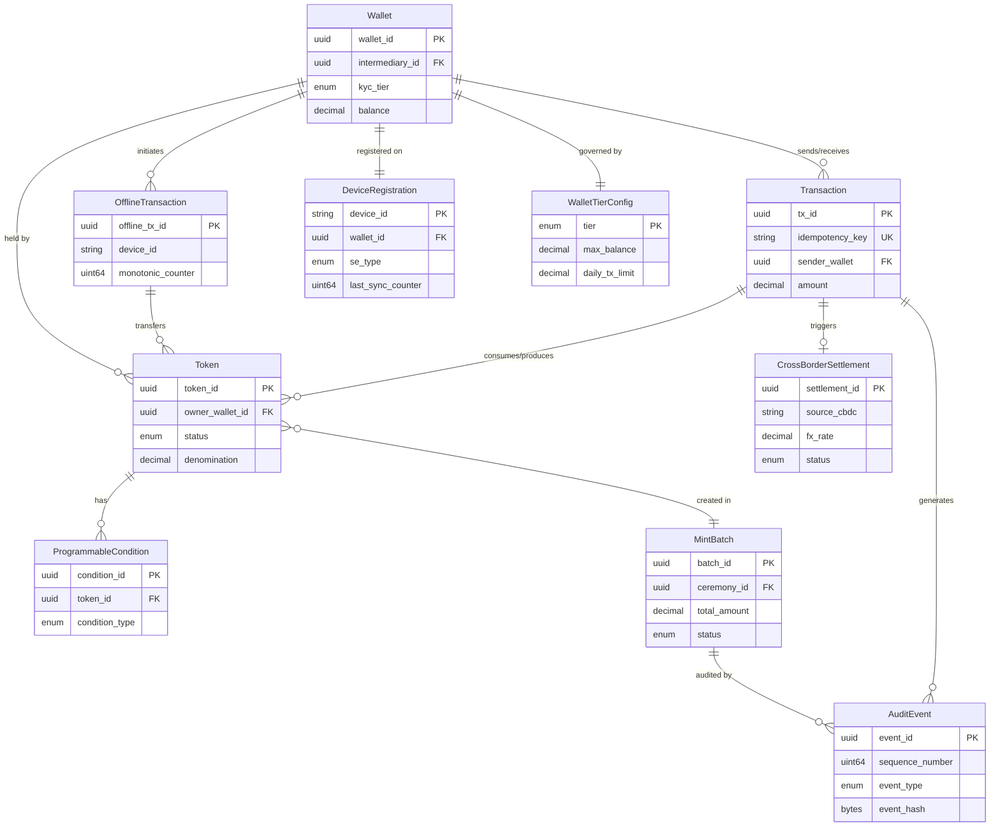
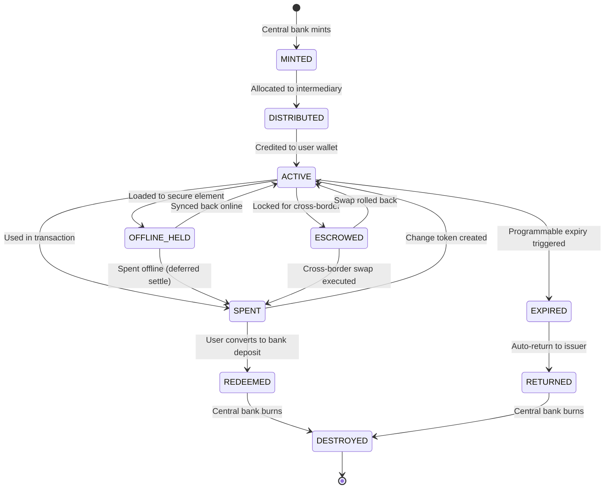
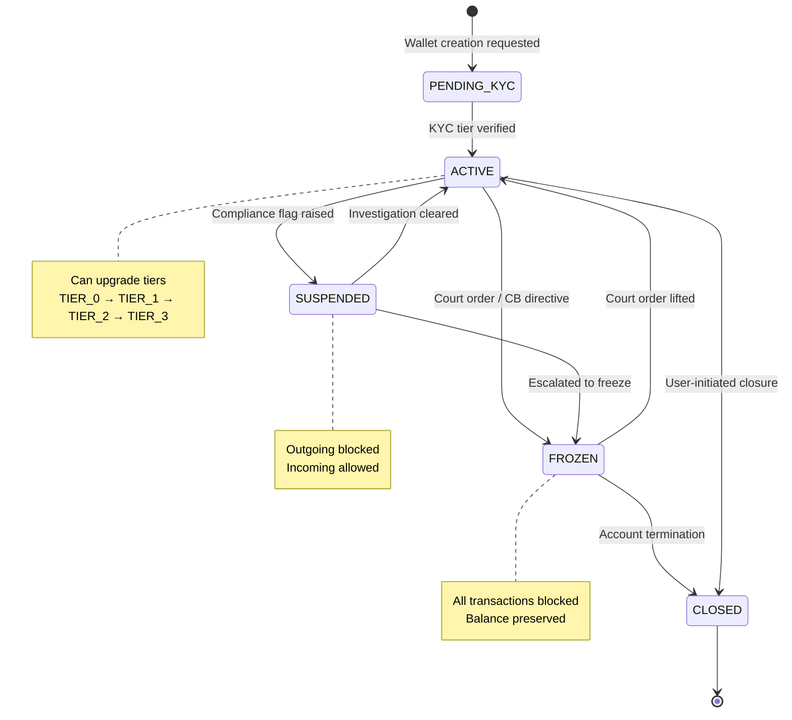
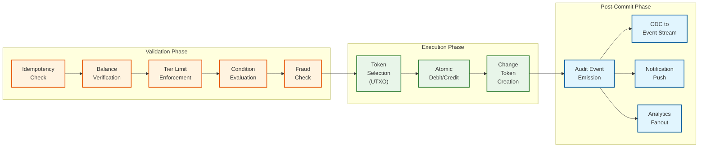

# Low-Level Design

## Data Models

```
Token:
  token_id:                uuid        // Globally unique identifier
  denomination:            decimal     // Face value (1.00, 5.00, 10.00, 50.00)
  serial_number:           string      // Audit trail (CB-prefix + sequence)
  issuer:                  string      // Central bank ID ("CB-IN", "CB-US")
  status:                  enum        // MINTED | DISTRIBUTED | ACTIVE | SPENT | REDEEMED | DESTROYED
  owner_wallet_id:         uuid        // Current holder
  programmable_conditions: []uuid      // References to ProgrammableCondition
  created_at:              timestamp
  destroyed_at:            timestamp   // Nullable
  batch_id:                uuid        // Mint batch reference
  version:                 uint64      // Optimistic concurrency

Wallet:
  wallet_id:             uuid
  owner_id:              string        // National ID / entity number
  kyc_tier:              enum          // TIER_0 (anonymous) | TIER_1 | TIER_2 | TIER_3 (institutional)
  balance:               decimal       // Online CBDC balance
  wallet_type:           enum          // INDIVIDUAL | MERCHANT | GOVERNMENT | INTERMEDIARY
  intermediary_id:       uuid          // Issuing bank/PSP
  offline_balance_limit: decimal
  offline_balance:       decimal
  status:                enum          // ACTIVE | SUSPENDED | FROZEN | CLOSED
  daily_tx_limit:        decimal
  monthly_tx_limit:      decimal

Transaction:
  tx_id:             uuid
  idempotency_key:   string            // Client-provided dedup key
  sender_wallet:     uuid
  receiver_wallet:   uuid
  amount:            decimal
  token_ids:         []uuid            // UTXO tokens consumed
  tx_type:           enum              // P2P | P2M | MINT | REDEEM | DISTRIBUTE | CROSS_BORDER | DISBURSEMENT
  status:            enum              // PENDING | COMPLETED | FAILED | REVERSED
  offline_flag:      bool
  timestamp:         timestamp
  intermediary_id:   uuid
  fx_rate:           decimal           // Nullable, for cross-border

ProgrammableCondition:
  condition_id:    uuid
  token_id:        uuid
  condition_type:  enum                // EXPIRY | GEO_FENCE | MERCHANT_CATEGORY | INCOME_TIER | PURPOSE_LOCK
  parameters:      json                // e.g. {"allowed_mcc":["5411"]}, {"expiry_date":"2027-03-31"}
  expiry:          timestamp           // Nullable
  is_active:       bool

OfflineTransaction:
  offline_tx_id:       uuid            // Generated on device
  device_id:           string          // Secure element ID
  counterparty_device: string
  amount:              decimal
  token_ids:           []uuid
  monotonic_counter:   uint64          // SE counter at time of spend
  signature:           bytes           // SE-signed payload
  local_timestamp:     timestamp
  synced_at:           timestamp       // Nullable
  sync_status:         enum            // PENDING_SYNC | SYNCED | CONFLICT | REJECTED

CrossBorderSettlement:
  settlement_id:    uuid
  source_cbdc:      string             // e.g. "eCNY", "eINR"
  target_cbdc:      string
  fx_rate:          decimal
  source_amount:    decimal
  target_amount:    decimal
  mbridge_tx_ref:   string
  status:           enum               // INITIATED | FX_LOCKED | EXECUTING | SETTLED | ROLLED_BACK
  initiator_wallet: uuid
  beneficiary_ref:  string
  ttl:              duration           // FX rate lock window
```

```
MintBatch:
  batch_id:              uuid
  requested_by:          string        // Operator ID (from M-of-N ceremony)
  ceremony_id:           uuid          // HSM key ceremony reference
  total_amount:          decimal
  denominations:         json          // {"1.00": 10000, "50.00": 1000}
  purpose:               enum          // MONETARY_OPS | STIMULUS | SUBSIDY | EMERGENCY
  programmable_conditions: []uuid
  status:                enum          // PENDING_APPROVAL | APPROVED | MINTING | COMPLETED | FAILED
  approved_by:           []string      // M-of-N key holders who signed
  created_at:            timestamp
  completed_at:          timestamp

AuditEvent:
  event_id:              uuid
  sequence_number:       uint64        // Monotonically increasing per intermediary
  event_type:            enum          // MINT | TRANSFER | REDEEM | DESTROY | CONDITION_EVAL | TIER_CHANGE | POLICY_CHANGE
  entity_type:           enum          // TOKEN | WALLET | SETTLEMENT | BATCH
  entity_id:             uuid
  actor:                 string        // Wallet ID, operator ID, or system
  metadata:              json          // Event-specific payload
  event_hash:            bytes         // SHA-256 of this event
  previous_hash:         bytes         // Hash chain linkage
  hsm_signature:         bytes         // HSM-signed chain hash
  timestamp:             timestamp

WalletTierConfig:
  tier:                  enum          // TIER_0 | TIER_1 | TIER_2 | TIER_3
  max_balance:           decimal
  daily_tx_limit:        decimal
  monthly_tx_limit:      decimal
  single_tx_max:         decimal
  offline_balance_limit: decimal
  offline_tx_limit:      int           // Max offline txns before forced resync
  offline_max_days:      int           // Max days offline before wallet freeze
  required_auth:         []enum        // PIN | BIOMETRIC | DEVICE_ATTESTATION
  kyc_requirements:      []string      // "phone" | "basic_id" | "full_kyc" | "enhanced_dd"

InterestPolicy:
  policy_id:             uuid
  effective_date:        timestamp
  tier:                  enum          // Applies to specific tier or ALL
  rate_bps:              int           // Basis points (-50 = -0.50%, 0 = no interest)
  threshold:             decimal       // Balance above which rate applies
  calculation_method:    enum          // DAILY_ACCRUAL | MONTHLY_COMPOUND
  status:                enum          // DRAFT | ACTIVE | SUPERSEDED

DeviceRegistration:
  device_id:             string        // Secure element hardware ID
  wallet_id:             uuid
  se_type:               enum          // SIM_SE | EMBEDDED_SE | EXTERNAL_SE | TEE
  certificate:           bytes         // Device certificate from SE manufacturer
  public_key:            bytes         // SE-generated key pair (public half)
  attestation_status:    enum          // VERIFIED | PENDING | REVOKED
  last_sync_counter:     uint64        // Last verified monotonic counter
  last_sync_timestamp:   timestamp
  offline_balance:       decimal       // Last known offline balance at sync
  firmware_version:      string
  registered_at:         timestamp
```

### Entity Relationship Diagram



### State Machine: Token Lifecycle



### State Machine: Wallet Lifecycle



---

## Indexing and Sharding Strategy

| Table | Index | Purpose |
|-------|-------|---------|
| Token | `(owner_wallet_id, status)` | Active tokens per wallet |
| Token | `(serial_number)` UNIQUE | Audit lookup |
| Transaction | `(sender_wallet, timestamp DESC)` | Sender history |
| Transaction | `(idempotency_key)` UNIQUE | Deduplication |
| OfflineTransaction | `(device_id, monotonic_counter)` UNIQUE | Double-spend detection |
| CrossBorderSettlement | `(status, initiated_at)` | Monitor in-flight settlements |

**Partitioning:** Hash-partition Transaction and Token by `intermediary_id`; time-range partition on `timestamp` (monthly, archived after 7 years).

**Sharding:** Core ledger shards by `wallet_id` hash (consistent hashing with virtual nodes) for transaction lookups. Analytics pipelines use range sharding by `timestamp` on read replicas.

---

## API Design

### Token Minting (Central Bank Only)

```
POST /api/v1/mint/tokens          [mTLS + central-bank-role]
Request:  { batch_id, total_amount, denominations: {"1.00": 10000, "50.00": 1000}, purpose, programmable_conditions[] }
Response: 201 { batch_id, tokens_created, total_value, status: "MINTED" }
```

### Wallet Management

```
POST /api/v1/wallets              [Bearer intermediary_token]
Request:  { owner_id, wallet_type, kyc_tier }
Response: 201 { wallet_id, kyc_tier, daily_tx_limit, offline_balance_limit }

PUT  /api/v1/wallets/{id}/kyc-upgrade   { target_tier, verification_ref }
GET  /api/v1/wallets/{id}/balance  -->  { online_balance, offline_balance, pending_sync }
```

### Transfer (P2P / P2M)

```
POST /api/v1/transfers            [Bearer user_token, Idempotency-Key header]
Request:  { sender_wallet, receiver_wallet, amount, tx_type, metadata }
Response: 201 { tx_id, status: "COMPLETED", timestamp, receipt_hash }
Errors:   409 (duplicate key) | 422 (insufficient balance / limit exceeded) | 403 (suspended / KYC)
```

### Offline Sync

```
POST /api/v1/offline/sync         [Bearer device_token]
Request:  { device_id, transactions[]: { offline_tx_id, counterparty_device, amount, token_ids, monotonic_counter, signature } }
Response: 200 { synced: int, rejected: int, results[]: { offline_tx_id, status, reason } }
```

### Programmable Token

```
POST /api/v1/tokens/conditions    [mTLS + policy-role]
Request:  { token_ids[], condition_type, parameters, expiry }
GET  /api/v1/tokens/{id}/eligibility?receiver_wallet={id}&merchant_mcc={mcc}
Response: { eligible: bool, blocking_conditions[] }
```

### Cross-Border

```
POST /api/v1/cross-border/quote   { source_cbdc, target_cbdc, amount, direction }
Response: { fx_rate, source_amount, target_amount, quote_ttl, quote_id }

POST /api/v1/cross-border/execute [Idempotency-Key]
Request:  { quote_id, sender_wallet, beneficiary_ref }
Response: 202 { settlement_id, status: "INITIATED", estimated_completion }
```

### Bulk Disbursement

```
POST /api/v1/disbursements        [mTLS + government-role]
Request:  { disbursement_id, purpose, recipients[]: {wallet_id, amount}, programmable_conditions[], total_amount }
Response: 202 { disbursement_id, status: "PROCESSING", recipient_count }
```

---

## Core Algorithms

### 1. Token Lifecycle (UTXO Model)

```
FUNCTION transferTokens(senderWallet, receiverWallet, amount, idempotencyKey):
    existing = lookupByIdempotencyKey(idempotencyKey)
    IF existing: RETURN existing.result

    tokens = getTokensByWallet(senderWallet, status=ACTIVE)
    SORT tokens BY denomination DESC
    selected = []; total = 0
    FOR token IN tokens:
        IF total >= amount: BREAK
        IF NOT evaluateConditions(token, receiverWallet): CONTINUE
        selected.append(token); total += token.denomination
    IF total < amount: FAIL "Insufficient eligible balance"

    changeAmount = total - amount
    BEGIN ATOMIC:
        FOR token IN selected: token.status = SPENT; updateToken(token)
        FOR rt IN splitIntoDenominations(amount): createToken(rt, owner=receiverWallet)
        IF changeAmount > 0:
            FOR ct IN splitIntoDenominations(changeAmount): createToken(ct, owner=senderWallet)
        tx = createTransaction(senderWallet, receiverWallet, amount, selected, idempotencyKey)
    COMMIT
    RETURN tx

FUNCTION splitIntoDenominations(amount):
    denoms = [50.00, 10.00, 5.00, 1.00, 0.50, 0.10, 0.01]
    result = []; remaining = amount
    FOR d IN denoms:
        WHILE remaining >= d: result.append(newToken(d)); remaining = ROUND(remaining - d, 2)
    RETURN result
```

**Complexity:** O(T) token selection + O(D) denomination split. Space: O(T + D).

### 2. Offline Double-Spend Prevention

```
FUNCTION offlineSpend(senderSE, receiverSE, amount):
    selected = selectTokensForAmount(senderSE.getAvailableTokens(), amount)
    IF selected is null: FAIL "Insufficient offline balance"
    counter = senderSE.incrementCounter()           // Hardware-enforced, irreversible
    payload = { tokens: selected, counter, sender: senderSE.deviceId,
                receiver: receiverSE.deviceId, amount, timestamp: senderSE.getSecureClock() }
    signature = senderSE.sign(payload)               // Key never leaves SE
    nfcTransfer(receiverSE, payload, signature)
    receiverSE.verifyCertificateChain(senderSE.certificate)
    receiverSE.verifySignature(payload, signature, senderSE.publicKey)
    receiverSE.storeReceivedTokens(selected, payload, signature)
    senderSE.markTokensSpent(selected)

FUNCTION syncOfflineTransactions(deviceId, transactions):
    device = getDeviceRecord(deviceId)
    lastCounter = device.last_synced_counter
    SORT transactions BY monotonic_counter ASC
    results = []
    FOR tx IN transactions:
        expected = lastCounter + 1
        IF tx.monotonic_counter < expected:
            results.append({tx.offline_tx_id, "REJECTED", "counter_replay"}); CONTINUE
        IF tx.monotonic_counter > expected:
            flagForInvestigation(deviceId, expected, tx.monotonic_counter)
            results.append({tx.offline_tx_id, "REJECTED", "counter_gap"}); CONTINUE
        IF NOT verifyDeviceSignature(tx):
            results.append({tx.offline_tx_id, "REJECTED", "invalid_signature"}); CONTINUE
        settleOnCoreLedger(tx)
        lastCounter = tx.monotonic_counter
        results.append({tx.offline_tx_id, "SYNCED"})
    device.last_synced_counter = lastCounter
    RETURN results
```

**Complexity:** O(N log N) sort + O(N) validation. Space: O(N).

### 3. Programmable Money Evaluation Engine

```
FUNCTION evaluateConditions(token, receiverWallet):
    conditions = getActiveConditions(token.token_id)
    FOR cond IN conditions:
        IF NOT cond.is_active: CONTINUE
        IF cond.expiry AND cond.expiry < NOW(): deactivateCondition(cond); CONTINUE
        SWITCH cond.condition_type:
            CASE EXPIRY:
                IF NOW() > cond.parameters.expiry_date: RETURN {eligible: false, reason: "Expired"}
            CASE GEO_FENCE:
                IF getWalletRegion(receiverWallet) NOT IN cond.parameters.allowed_regions:
                    RETURN {eligible: false, reason: "Outside allowed region"}
            CASE MERCHANT_CATEGORY:
                IF receiverWallet.wallet_type != MERCHANT: RETURN {eligible: false}
                IF getMerchantMCC(receiverWallet) NOT IN cond.parameters.allowed_mcc:
                    RETURN {eligible: false, reason: "Merchant category not permitted"}
            CASE PURPOSE_LOCK:
                IF NOT checkPurposeEligibility(receiverWallet, cond.parameters.purpose):
                    RETURN {eligible: false, reason: "Purpose mismatch"}
            CASE INCOME_TIER:
                IF getOwnerIncomeTier(token.owner_wallet_id) NOT IN cond.parameters.allowed_tiers:
                    RETURN {eligible: false, reason: "Income tier ineligible"}
    RETURN {eligible: true}
```

**Complexity:** O(C) per token where C = active conditions. Each check is O(1) via hash-map lookups.

### 4. Cross-Border FX Atomic Swap (PvP)

```
FUNCTION initiateCrossBorderTransfer(senderWallet, beneficiaryRef, quoteId):
    quote = getAndLockQuote(quoteId)
    IF quote.expired: FAIL "FX quote expired"
    settlement = createSettlement(source_cbdc=quote.source_cbdc, target_cbdc=quote.target_cbdc,
        fx_rate=quote.fx_rate, source_amount=quote.source_amount,
        target_amount=quote.target_amount, status=INITIATED, ttl=quote.quote_ttl)

    escrow = escrowTokens(senderWallet, quote.source_amount)  // Move to escrow wallet
    IF escrow.failed: settlement.status = FAILED; RETURN {error: "Insufficient balance"}
    settlement.status = FX_LOCKED
    publishToGateway("cross-border.swap.request", {settlement.id, escrow.ref, quote})
    RETURN settlement

FUNCTION handleSwapResponse(response):
    settlement = getSettlement(response.settlement_id)
    IF response.status == "TARGET_CREDITED":
        releaseEscrow(settlement, action=DESTROY)     // Remove from source circulation
        settlement.status = SETTLED
    ELSE IF response.status IN ["TARGET_FAILED", "TIMEOUT"]:
        releaseEscrow(settlement, action=RETURN_TO_SENDER)
        settlement.status = ROLLED_BACK
    updateSettlement(settlement)
    notifyWallet(settlement.initiator_wallet, settlement.status)

FUNCTION escrowTokens(walletId, amount):
    tokens = selectTokensForAmount(getTokensByWallet(walletId, ACTIVE), amount)
    IF tokens is null: RETURN {failed: true}
    escrowWallet = getEscrowWallet()
    BEGIN ATOMIC:
        FOR token IN tokens: token.owner_wallet_id = escrowWallet.wallet_id; updateToken(token)
        ref = createEscrowRecord(walletId, tokens, amount)
    COMMIT
    RETURN {failed: false, escrow_ref: ref}
```

**Complexity:** O(T) token selection, O(K) escrow/release where K = escrowed tokens. Gateway is async and latency-dominated.

### 5. Wallet Tier Enforcement and Upgrade

```
FUNCTION enforceWalletLimits(wallet, transaction):
    config = getWalletTierConfig(wallet.kyc_tier)

    // Balance limit check (holding cap to prevent digital bank runs)
    projected_balance = wallet.balance + transaction.amount
    IF transaction.direction == INCOMING AND projected_balance > config.max_balance:
        overflow = projected_balance - config.max_balance
        triggerWaterfallMechanism(wallet, overflow)
        // Credit up to cap to CBDC wallet, overflow to linked bank account

    // Daily transaction limit
    daily_spent = getDailySpent(wallet.wallet_id, TODAY())
    IF daily_spent + transaction.amount > config.daily_tx_limit:
        RETURN REJECT("Daily transaction limit exceeded",
                       remaining: config.daily_tx_limit - daily_spent)

    // Single transaction limit
    IF transaction.amount > config.single_tx_max:
        RETURN REJECT("Exceeds single transaction maximum for tier")

    // Step-up authentication for high-value
    IF transaction.amount > config.single_tx_max * 0.5:
        requireStepUpAuth(wallet, "biometric")

    RETURN ALLOW

FUNCTION upgradeWalletTier(wallet, targetTier, verificationRef):
    currentConfig = getWalletTierConfig(wallet.kyc_tier)
    targetConfig = getWalletTierConfig(targetTier)

    IF targetTier <= wallet.kyc_tier:
        RETURN ERROR("Cannot downgrade tier via this endpoint")

    // Verify all KYC requirements for target tier are met
    FOR req IN targetConfig.kyc_requirements:
        IF NOT isRequirementMet(wallet.owner_id, req, verificationRef):
            RETURN ERROR("Missing requirement: " + req)

    BEGIN ATOMIC:
        wallet.kyc_tier = targetTier
        wallet.daily_tx_limit = targetConfig.daily_tx_limit
        wallet.monthly_tx_limit = targetConfig.monthly_tx_limit
        wallet.offline_balance_limit = targetConfig.offline_balance_limit
        emitAuditEvent(TIER_CHANGE, wallet.wallet_id,
                       {from: currentConfig.tier, to: targetTier})
    COMMIT
    RETURN wallet
```

**Complexity:** O(R) where R = KYC requirements for target tier. Tier config cached in memory.

### 6. Bulk Government Disbursement Engine

```
FUNCTION executeDisbursement(disbursement):
    validateDisbursement(disbursement)
    totalRequired = SUM(disbursement.recipients[].amount)

    // Pre-mint tokens if supply insufficient
    IF getAvailableSupply(disbursement.intermediary_pool) < totalRequired:
        mintBatch = requestMint(totalRequired - getAvailableSupply())
        awaitMintCompletion(mintBatch)

    // Partition recipients by intermediary for parallel processing
    partitions = groupBy(disbursement.recipients, r => r.intermediary_id)
    results = []

    PARALLEL FOR partition IN partitions:
        intermediaryResults = []
        batches = chunkArray(partition.recipients, BATCH_SIZE=10000)

        FOR batch IN batches:
            BEGIN ATOMIC:
                FOR recipient IN batch:
                    wallet = getWallet(recipient.wallet_id)
                    IF wallet.status != ACTIVE:
                        intermediaryResults.append({recipient, "SKIPPED", "wallet_inactive"})
                        CONTINUE

                    tokens = allocateTokensWithConditions(
                        recipient.amount,
                        disbursement.programmable_conditions
                    )
                    creditWallet(wallet, tokens)
                    intermediaryResults.append({recipient, "CREDITED"})
            COMMIT

        results.append(intermediaryResults)

    emitAuditEvent(DISBURSEMENT_COMPLETE, disbursement.disbursement_id,
                   {total: totalRequired, credited: countCredited(results),
                    skipped: countSkipped(results)})
    RETURN aggregateResults(results)
```

**Complexity:** O(N) where N = recipients. Parallelized by intermediary partition. Each batch is atomic.

### 7. Interest Rate Application Engine

```
FUNCTION applyDailyInterest():
    activePolicy = getCurrentInterestPolicy()
    IF activePolicy.rate_bps == 0: RETURN  // No interest to apply

    // Process each intermediary's wallets in parallel
    PARALLEL FOR intermediary IN getActiveIntermediaries():
        eligibleWallets = getWalletsAboveThreshold(
            intermediary.id, activePolicy.threshold
        )

        FOR wallet IN eligibleWallets:
            excessBalance = wallet.balance - activePolicy.threshold
            IF excessBalance <= 0: CONTINUE

            dailyRate = activePolicy.rate_bps / 10000 / 365
            interestAmount = ROUND(excessBalance * dailyRate, 2)

            IF interestAmount == 0: CONTINUE

            IF activePolicy.rate_bps > 0:
                // Positive interest: mint new tokens to wallet
                creditInterest(wallet, interestAmount, activePolicy.policy_id)
            ELSE:
                // Negative interest (demurrage): debit from wallet
                debitDemurrage(wallet, ABS(interestAmount), activePolicy.policy_id)

            emitAuditEvent(INTEREST_APPLIED, wallet.wallet_id,
                           {rate_bps: activePolicy.rate_bps, amount: interestAmount})

FUNCTION creditInterest(wallet, amount, policyId):
    BEGIN ATOMIC:
        tokens = splitIntoDenominations(amount)
        FOR token IN tokens:
            token.status = ACTIVE
            token.owner_wallet_id = wallet.wallet_id
            token.batch_id = "INTEREST-" + policyId
            createToken(token)
        wallet.balance += amount
        updateWallet(wallet)
    COMMIT
```

**Complexity:** O(W) where W = wallets above threshold. Parallelized per intermediary. Runs as daily batch job during low-traffic hours.

### 8. Expired Token Recovery

```
FUNCTION processExpiredTokens():
    // Runs every hour to reclaim expired programmable tokens
    expired = queryTokensWithExpiredConditions(NOW())

    FOR token IN expired:
        BEGIN ATOMIC:
            originalIssuer = getConditionIssuer(token.programmable_conditions)
            issuerWallet = getIssuerRecoveryWallet(originalIssuer)

            // Transfer expired token value back to issuing authority
            token.status = EXPIRED
            updateToken(token)

            // Create recovery token for the issuer
            recoveryToken = createToken(
                denomination: token.denomination,
                owner: issuerWallet.wallet_id,
                status: ACTIVE,
                batch_id: "RECOVERY-" + token.token_id
            )

            // Debit holder, credit issuer
            holderWallet = getWallet(token.owner_wallet_id)
            holderWallet.balance -= token.denomination
            issuerWallet.balance += token.denomination
            updateWallet(holderWallet)
            updateWallet(issuerWallet)

            emitAuditEvent(TOKEN_EXPIRED, token.token_id,
                           {holder: holderWallet.wallet_id,
                            returned_to: issuerWallet.wallet_id,
                            amount: token.denomination})

            // Notify holder
            sendNotification(holderWallet, "EXPIRED_TOKEN",
                             {amount: token.denomination, reason: "Condition expired"})
        COMMIT
```

**Complexity:** O(E) where E = expired tokens in batch. Runs hourly.

---

## Transaction Write Path



**Latency budget breakdown:**

| Phase | Step | Target | Approach |
|-------|------|--------|----------|
| Validation | Idempotency check | < 2ms | In-memory hash map with TTL; overflow to DB |
| Validation | Balance verification | < 5ms | Shard-local read from primary |
| Validation | Tier limit enforcement | < 1ms | In-memory config lookup; daily counters in cache |
| Validation | Condition evaluation | < 5ms | Pre-compiled bytecode; cached condition sets |
| Validation | Fraud check | < 10ms | Rules engine with cached risk scores; async ML model |
| Execution | Token selection (UTXO) | < 5ms | Indexed by (wallet_id, status); sorted by denomination |
| Execution | Atomic debit/credit | < 15ms | Single-shard: 1 write; cross-shard: 2-phase commit |
| Execution | Change token creation | < 5ms | Denomination split algorithm |
| Post-commit | Audit event | < 2ms | Append-only log; async hash chain computation |
| Post-commit | CDC emission | < 5ms | Change data capture from write-ahead log |
| **Total** | | **< 55ms** | **Well within 200ms SLO** |

---

## Capacity Estimation

| Metric | Estimate | Basis |
|--------|----------|-------|
| Active wallets | 500M | ~50% adult population over 5 years |
| Daily transactions | 2B | ~4 per active wallet per day |
| Peak TPS | 50,000 | 20x average during salary/holiday |
| Active token count | 10B | ~20 tokens per wallet |
| Daily storage growth | ~1 TB | 2B txns x 500 bytes |
| Cross-border volume | 20M/day | ~1% of daily transactions |
| Offline transactions | 100M/day | ~5% of total, higher in rural areas |
| Programmable tokens | 500M active | ~5% of tokens carry conditions |
| Audit events/day | 5B | ~2.5 events per transaction |
| Merkle tree recompute | Every 15 min | Per intermediary; ~100 intermediaries |
