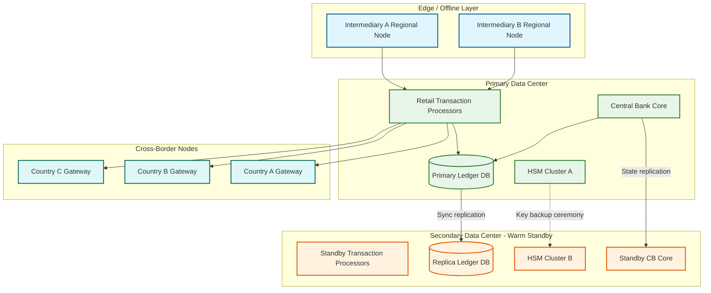

# Scalability & Reliability

## Scaling Strategy Overview

A CBDC platform serves an entire nation's population---potentially hundreds of millions of wallets---with transaction volumes rivaling or exceeding the busiest retail payment networks. The system has three distinct scaling profiles: the **retail transaction path** is throughput-bound (millions of TPS at peak), the **offline sync path** is burst-bound (sudden floods after connectivity restoration), and the **reconciliation path** is compute-bound (continuous cryptographic verification across massive datasets). Each demands a tailored scaling strategy.

---

## 1. Horizontal Scaling

### Ledger Sharding Strategy

The core ledger is sharded using a two-level partitioning scheme: first by **intermediary ID**, then by **wallet hash** within each intermediary's partition.

```
Shard Topology:
  Level 1: Intermediary partition
    - Each licensed intermediary's sub-ledger is an independent shard group
    - Intermediary A: shards A-01 through A-16
    - Intermediary B: shards B-01 through B-08
    - Shard count per intermediary scales with their user base

  Level 2: Wallet hash partition within intermediary
    - wallet_shard = hash(wallet_id) % intermediary_shard_count
    - Co-located data per shard: wallet balance, transaction history, offline sync queue
```

**Intra-intermediary transactions** (sender and receiver at the same intermediary) resolve within a single shard group---no cross-intermediary coordination required. This covers ~80% of retail transactions.

**Inter-intermediary transactions** require coordination between two shard groups. The sending intermediary debits its wallet shard and emits a settlement event. The receiving intermediary credits its wallet shard upon consuming the event. Net settlement between intermediaries occurs every 5 minutes at the central bank level.

### Independent Intermediary Scaling

Each intermediary's sub-ledger scales independently based on their user base and transaction volume:

```
SCALING_POLICY per intermediary:
    IF avg_tps > 0.7 * shard_capacity:
        add_shard(intermediary_id)
        rebalance_wallets(intermediary_id)

    IF wallet_count > shard_count * MAX_WALLETS_PER_SHARD:
        add_shard(intermediary_id)
        rebalance_wallets(intermediary_id)

    IF offline_sync_queue_depth > SYNC_THRESHOLD:
        scale_out_sync_workers(intermediary_id)
```

This isolation means a large commercial bank intermediary can scale to 64 shards while a small fintech intermediary operates on 4 shards, without either affecting the other's performance or cost.

---

## 2. Vertical Scaling

### Central Bank Core Infrastructure

The central bank's wholesale ledger and token minting authority run on hardened, vertically scaled infrastructure:

- **HSM-backed signing nodes**: Hardware Security Modules handle all token minting signatures and high-value transaction authorizations. HSMs scale vertically (higher-throughput HSM models) rather than horizontally, because key material must not be distributed beyond the HSM cluster boundary.
- **Wholesale ledger**: Handles aggregate inter-intermediary settlement (lower volume, higher value). Runs on high-memory, high-IOPS hardware optimized for write-heavy transactional workloads.
- **Reconciliation compute**: Merkle tree computation and verification is CPU-intensive. Dedicated compute nodes with high core counts process reconciliation in parallel across intermediary partitions.

---

## 3. Auto-Scaling Triggers

| Metric | Threshold | Action |
|--------|-----------|--------|
| Retail TPS per shard | > 70% capacity for 3 minutes | Add shard to intermediary partition; rebalance |
| Offline sync queue depth | > 100K pending per intermediary | Scale out sync workers 2x |
| Cross-border settlement backlog | > 5 minutes behind real-time | Add settlement workers; increase batch frequency |
| Condition evaluator latency | p99 > 5ms for 2 minutes | Scale out evaluator instances |
| Reconciliation lag | > 30 minutes behind | Increase reconciliation compute allocation |
| HSM queue depth | > 50 pending signing requests | Alert; cannot auto-scale (hardware-bound) |

**Pre-scaling events**: Government disbursement announcements trigger proactive 3x capacity scaling for receiving intermediaries. National holidays with high remittance activity trigger cross-border gateway scaling 24 hours in advance.

---

## 4. Database Scaling

### Write Path

Transaction writes are distributed across sharded write nodes. Each shard's write node handles inserts to the wallet balance table, transaction log, and offline sync acknowledgment table.

```
Write Distribution:
  - Wallet balance updates: sharded by wallet_id
  - Transaction log: append-only, sharded by sender_wallet_id
  - Offline sync records: sharded by device_id (mapped to wallet shard)
  - Token condition records: sharded with parent wallet
```

**Write amplification control**: Each retail transaction generates writes to sender shard, receiver shard (if different), and the event stream. The event stream write is asynchronous---the transaction commits after sender and receiver ledger updates, with the event emitted via change-data-capture from the transaction log.

### Read Path

Read replicas serve balance queries, transaction history, and analytics:

- **Balance queries**: Served from shard-local read replicas with < 50ms replication lag. Stale reads are acceptable for display purposes; actual spend authorization always reads from the primary.
- **Transaction history**: Served from read replicas. Historical data (> 90 days) is offloaded to a columnar analytical store for efficient range queries.
- **Analytical queries**: Routed to a separate OLAP cluster that ingests from the event stream. This cluster handles regulatory reporting, monetary policy analytics, and fraud pattern detection without impacting the transactional path.

---

## 5. Caching Strategy

### L1 Cache: Wallet Balance Cache

- **Scope**: Per-intermediary, in-memory cache of active wallet balances
- **TTL**: 100ms (extremely short for financial consistency)
- **Purpose**: Absorb read storms from balance check APIs (users refreshing wallet apps)
- **Invalidation**: Write-through on any balance-modifying transaction; TTL serves as safety net
- **Hit rate**: ~85% for balance display queries (users check balance far more often than transact)

### L2 Cache: Intermediary Aggregate Cache

- **Scope**: Central bank level cache of each intermediary's aggregate position
- **TTL**: 5 minutes (aligned with settlement cycle)
- **Purpose**: Serve reconciliation dashboard and regulatory reporting without querying every intermediary shard
- **Update**: Refreshed by settlement events; reconciliation job validates cache against computed values

### L3 Cache: Condition Evaluation Cache

- **Scope**: Per-intermediary, keyed by `condition_set_hash + merchant_mcc + wallet_region`
- **TTL**: 60 seconds
- **Purpose**: Avoid re-evaluating identical condition sets against the same merchant context
- **Hit rate**: ~70% (same merchant categories serve repeated condition types)
- **Invalidation**: On condition expiry or policy engine update broadcast

### L4 Cache: Cross-Border FX Rate Cache

- **Scope**: Global, shared across all cross-border gateway instances
- **TTL**: 5 seconds (FX rates are volatile)
- **Purpose**: Avoid per-transaction FX oracle calls; serve rate quotes from cache
- **Consistency**: Stale rate triggers re-quote; locked rate at settlement initiation is authoritative

**CDN**: Not applicable for financial data (confidential, per-user). Only wallet app static assets use standard CDN distribution.

---

## 6. Hot Spot Mitigation

### Government Disbursement Spike

**Problem**: When the government distributes stimulus payments, pension, or disaster relief, millions of wallets at specific intermediaries receive credits simultaneously. The receiving intermediary's shards experience 10-50x normal write volume.

**Mitigation**:

```
DISBURSEMENT_STRATEGY:
    1. Pre-warm caches for all recipient wallets (batch load 1 hour before)
    2. Stagger disbursement by region:
       - Region A: T+0
       - Region B: T+15min
       - Region C: T+30min
       - Region D: T+45min
    3. Use queued crediting:
       - Bulk credit records written to a staging table
       - Background workers apply credits to individual wallets
       - User sees "pending credit" immediately, balance updates within minutes
    4. Temporary read replica promotion:
       - Spin up additional read replicas before disbursement
       - Handle the surge of "check my balance" queries
```

### Merchant Payment Concentration

**Problem**: Large retailers (grocery chains, utility companies) receive thousands of payments per second, creating a write hot spot on their wallet's shard.

**Mitigation**: High-volume merchant wallets use a **striped balance** pattern. The merchant's balance is split across N sub-accounts (e.g., 16 stripes). Incoming payments are distributed round-robin across stripes. The merchant's visible balance is the sum of all stripes, computed on read (cached with 1-second TTL).

---

## 7. Reliability & Fault Tolerance

### Single Point of Failure Identification

| SPOF | Risk Level | Mitigation |
|------|-----------|------------|
| Central bank minting authority | Critical---only entity that can create new tokens | HSM cluster with N+2 redundancy; geographically separated HSM backup |
| DLT notary nodes (if applicable) | High---consensus required for finality | Raft consensus with 5-node quorum; tolerates 2 node failures |
| Intermediary gateway | Medium---affects one intermediary's users | Multi-path routing: each intermediary exposes 3+ gateway endpoints behind a load balancer |
| Reconciliation pipeline | Medium---delayed detection of discrepancies | Active-standby reconciliation workers with automatic failover |
| Cross-border settlement gateway | Medium---affects international transfers only | Bilateral redundancy: each country pair maintains 2 independent gateway connections |

### Redundancy Architecture

**Intermediary Services**: Active-active deployment across two availability zones. Both zones process transactions simultaneously. Session affinity by wallet hash ensures consistency without distributed locking for single-wallet operations.

**Central Bank Core**: Active-standby configuration. Monetary sovereignty requires a single authoritative source for token minting and wholesale settlement. The standby site receives synchronous replication of all state and can be promoted within the RTO window.

```
FUNCTION failover_central_bank_core():
    -- Triggered by: health check failure for 3 consecutive intervals (15s each)
    verify_standby_replication_lag()  -- must be 0 for promotion
    promote_standby_to_primary()
    update_dns_to_new_primary()
    notify_all_intermediaries("CB_FAILOVER", new_endpoint)
    -- Intermediaries automatically reconnect within 30s
```

### Failover Patterns

- **Intermediary failover**: If an intermediary's primary systems fail, user wallets automatically fall back to offline mode. The intermediary's backup payment service provider (PSP) can process transactions using a cached copy of the wallet state, with full reconciliation when the primary recovers.
- **Wallet fallback**: When a wallet cannot reach its intermediary, it seamlessly transitions to offline mode. The user experience shows a subtle indicator but does not interrupt payment capability (within offline limits).

### Circuit Breakers

```
CIRCUIT_BREAKER configurations:

  Intermediary → Central Bank:
    failure_threshold: 40% error rate over 60s
    open_action: Queue settlement events locally; continue retail processing
    half_open: Route 10% of settlement traffic; monitor for 2 minutes

  Domestic → Cross-Border Gateway:
    failure_threshold: 30% error rate over 30s
    open_action: Reject new cross-border transactions; queue pending settlements
    half_open: Route 5% of traffic; validate end-to-end settlement

  Condition Evaluator:
    failure_threshold: 50% timeout rate over 15s
    open_action: Allow general-purpose token transactions; queue conditioned tokens
    half_open: Route 20% of conditioned transactions; monitor latency
```

### Retry and Idempotency

- **Settlement retries**: Exponential backoff starting at 5 seconds, capped at 5 minutes. Each settlement instruction carries an idempotency key (`settlement_id + batch_sequence`). The receiving system deduplicates on this key.
- **Transaction processing**: Every transaction is idempotent by design. The combination of `sender_wallet_id + monotonic_counter` forms a natural idempotency key. Replayed transactions with a counter value already processed are silently acknowledged.

### Graceful Degradation Levels

```
DEGRADATION_LEVELS:

  Level 0 - NORMAL:
    All features operational

  Level 1 - CROSS_BORDER_DISABLED:
    Trigger: Cross-border gateway failure
    Impact: International transfers queued
    Retail domestic: Fully operational
    Programmable conditions: Fully operational

  Level 2 - CONDITIONS_BYPASSED:
    Trigger: Condition evaluator overload or failure
    Impact: Conditioned token transactions queued; general tokens flow freely
    Retail domestic: Operational for general-purpose tokens only
    User notification: "Some payment types temporarily limited"

  Level 3 - OFFLINE_ONLY:
    Trigger: Intermediary complete failure
    Impact: All online transactions suspended
    Offline NFC payments: Operational within device limits
    User notification: "Network payments temporarily unavailable. NFC payments continue to work."

  Level 4 - EMERGENCY_FREEZE:
    Trigger: Central bank directive or detected systemic compromise
    Impact: All transactions halted including offline
    Action: Devices receive signed freeze command on next connectivity
```

### Bulkhead Isolation

Capacity is divided into isolated pools to prevent one traffic type from starving another:

| Pool | Capacity Allocation | Justification |
|------|-------------------|---------------|
| Retail domestic | 60% | Highest volume, most latency-sensitive |
| Wholesale / inter-intermediary | 15% | Lower volume, higher value, must not be starved |
| Cross-border | 10% | Independent failure domain |
| Offline sync processing | 10% | Bursty, can tolerate queuing |
| Administrative / minting | 5% | Low volume but critical when needed |

---

## 8. Disaster Recovery

### Recovery Objectives

| Component | RPO | RTO | Strategy |
|-----------|-----|-----|----------|
| Intermediary retail ledger | 0 (synchronous replication) | < 1 hour | Zone failover + replica promotion |
| Central bank wholesale ledger | 0 | < 4 hours | Standby promotion with manual verification |
| Offline transaction backlog | Up to 7 days (device-held) | 0 (devices retain data) | Devices replay transactions on reconnection |
| HSM key material | 0 | < 4 hours | Geo-separated HSM backup with ceremony-based activation |
| Cross-border settlement state | < 1 minute | < 2 hours | Bilateral reconciliation from counterpart central bank |

### Backup Architecture

**Continuous Replication**: All intermediary ledger writes are synchronously replicated to a secondary availability zone. The central bank wholesale ledger replicates to a geographically separated standby site with synchronous commit (accepting higher write latency for zero data loss).

**Daily Snapshots**: At midnight UTC, each intermediary produces a full ledger snapshot with a Merkle root. The snapshot is encrypted and stored in geo-redundant object storage. The Merkle root is submitted to the central bank and recorded in the wholesale ledger as an immutable checkpoint.

**Merkle Root Chain**: The daily Merkle roots form an auditable chain. Any disaster recovery operation can verify that the restored state matches the last known-good checkpoint. If a snapshot is corrupted, the system rolls back to the previous day's snapshot and replays transactions from the event log.

### Multi-Region Architecture



**Primary data center**: Handles all active transaction processing, central bank operations, and cross-border routing. Located in the sovereign territory of the issuing nation.

**Secondary data center (warm standby)**: Receives continuous state replication. Transaction processors are deployed but idle, ready to accept traffic within RTO. HSM backup keys are stored in a separate HSM cluster, activatable via a multi-party key ceremony (requires 3 of 5 central bank officers).

**Cross-border nodes**: Each participating country hosts a gateway node that handles the local leg of cross-border transactions. These nodes operate semi-independently---a failure of one country's gateway affects only transactions involving that country.

**Intermediary regional nodes**: Large intermediaries deploy regional processing nodes closer to their user base. These nodes handle read-heavy operations (balance queries, transaction history) and queue writes to the central processing layer. During primary data center failure, regional nodes continue serving cached data and accepting offline transactions.

### Chaos Engineering for CBDC

Given the critical nature of CBDC infrastructure, regular fault injection validates resilience assumptions:

| Chaos Experiment | Target | Expected Behavior | Frequency |
|-----------------|--------|-------------------|-----------|
| Kill one intermediary gateway | Intermediary layer | Wallets fall back to backup gateway or offline mode within 5s | Monthly |
| Network partition between intermediary and CB | Settlement path | Intermediary queues settlements; retail continues; reconciliation delayed but not lost | Monthly |
| HSM signing delay injection | Minting path | Minting queues; existing tokens continue circulating; alert fires within 60s | Quarterly |
| Corrupt one Merkle tree branch | Reconciliation | Reconciliation detects mismatch; circuit breaker suspends intermediary; manual investigation triggers | Quarterly |
| Simulate mass offline sync storm | Sync endpoints | Staggered backoff activates; queue absorbs burst; no sync requests rejected | Semi-annually |
| Cross-border gateway outage | International path | Domestic unaffected; cross-border queued with user notification; auto-retry on recovery | Quarterly |

### Disaster Recovery Scenario: Primary Data Center Total Loss

Monitoring detects primary unreachable after 90 seconds (3 failed health checks). Incident commander manually activates DR procedure. Secondary promoted: replica DB (< 5 min), CB core (< 10 min), HSM ceremony with 3-of-5 officers (< 2 hours). DNS updated; intermediaries reconnect automatically. Total RTO: ~4 hours (dominated by HSM ceremony). During recovery, all wallets operate in offline mode.

### Disaster Recovery Scenario: Regional Network Outage

A major flood knocks out connectivity across an entire province. Millions of devices go offline simultaneously.

```
Timeline:
  T+0:       Network monitoring detects regional outage (>1M devices offline)
  T+5min:    Alert: affected intermediaries report connection drop from regional nodes
  T+0-7d:    Users continue with offline NFC payments (within device caps)
  T+recovery: Staggered sync begins with 0-30min random backoff per device
  T+recovery+2h: Sync storm peak; sync workers scaled 5x pre-emptively
  T+recovery+8h: 90% of offline transactions reconciled
  T+recovery+24h: Full reconciliation complete; double-spend scan finished
  T+recovery+48h: Anomaly report generated; losses tallied against insurance fund

Key design point: The offline capability means CBDC continues functioning
  during exactly the scenarios where other digital payment systems fail.
  This is the primary argument for CBDC over card networks or mobile money
  in disaster-prone regions.
```

---

## 9. Capacity Planning Summary

| Component | Current Capacity | Peak Demand | Headroom | Scale Trigger |
|-----------|-----------------|-------------|----------|---------------|
| Core ledger (total) | 1M TPS (64 shards) | 50K TPS | 20x | Shard TPS > 70% for 3 min |
| Per-intermediary sub-ledger | 64K TPS (16 shards) | 15K TPS | 4x | Wallet count > shard limit |
| Offline sync workers | 1K devices/sec | 350 devices/sec | 3x | Queue > 100K pending |
| Cross-border settlement | 625 settlements/sec | 116/sec | 5x | Backlog > 5 min |
| HSM cluster | 10K signs/sec | 3K signs/sec | 3x | Queue > 50 pending (hardware-bound) |
| Reconciliation compute | 100 intermediaries/cycle | 50 intermediaries | 2x | Lag > 30 min |
| Condition evaluator | 50K evals/sec | 5K evals/sec | 10x | p99 > 5ms |
| Analytics ingest | 500K events/sec | 100K events/sec | 5x | Ingest lag > 60s |
