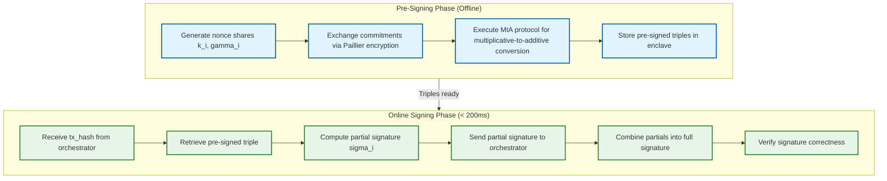
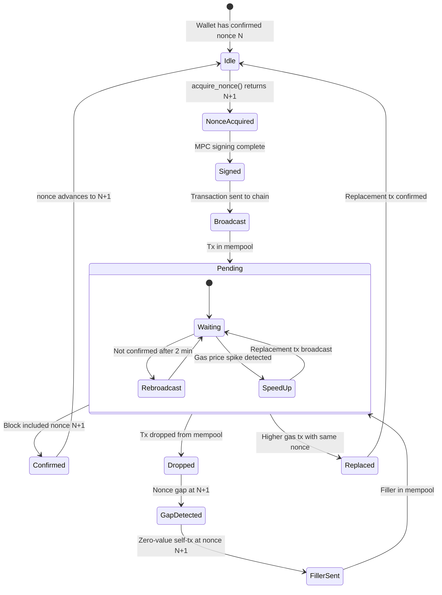
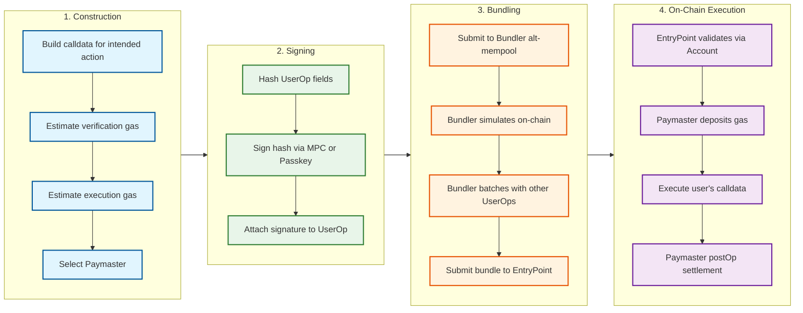
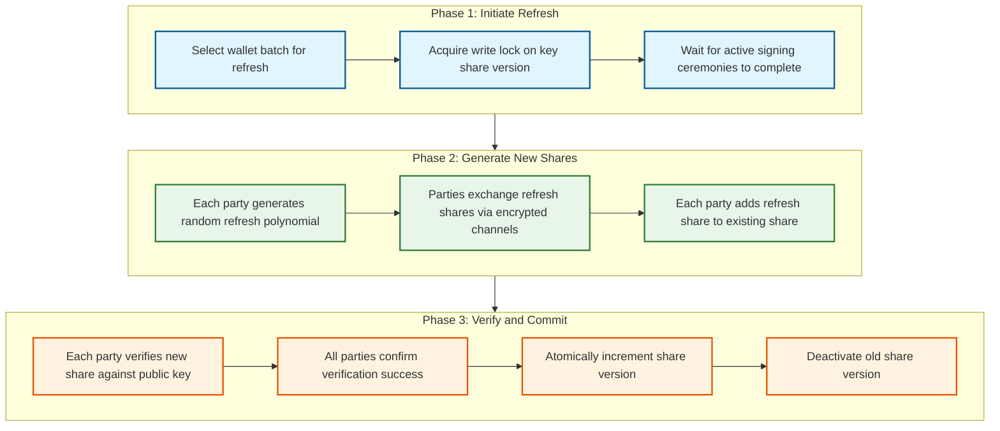

# Deep Dive & Bottlenecks

## Critical Component 1: MPC Signing Ceremony

### Why This Is Critical

The MPC signing ceremony is the most security-sensitive and latency-critical operation in the entire system. Every transaction that moves assets on-chain must pass through this ceremony. A bug in the MPC protocol means either (a) signatures can be forged (catastrophic security failure leading to asset theft) or (b) signing fails entirely (denial of service for all users). The ceremony involves real-time interactive communication between distributed signer nodes, each holding a key share in hardware-backed enclaves.

### How It Works Internally

The signing ceremony follows the MPC-CMP protocol in two phases:

**Pre-Signing Phase (Offline)**:
- Each signer node generates random nonce shares and auxiliary data
- Nodes exchange commitments and proofs (Paillier encryption, range proofs)
- Pre-signed "triples" are stored for later use
- This phase takes 1--3 seconds but can be done proactively in batches

**Online Signing Phase (Real-Time)**:
- Signing orchestrator distributes the transaction hash to threshold parties
- Each party combines their pre-signed triple with the message hash to produce a partial signature
- Partial signatures are sent to the orchestrator
- Orchestrator combines partial signatures into the final ECDSA/Schnorr signature
- Signature is verified against the known public key before returning



### Failure Modes

| Failure | Impact | Detection | Mitigation |
|---------|--------|-----------|------------|
| **Signer node crash during ceremony** | Signing session fails; must restart | Heartbeat timeout (500ms) | Threshold design (2-of-3): any 2 nodes can complete; retry with different quorum |
| **Network partition between signer nodes** | Ceremony cannot complete | Round-trip timeout | Geographic co-location of at least t+1 nodes in same region; cross-region backup |
| **Malicious partial signature** | Invalid combined signature | Signature verification before broadcast | Abort and identify malicious party via zero-knowledge proofs; quarantine node |
| **Pre-signed triple exhaustion** | Online signing degrades to full ceremony (slow) | Triple count monitoring | Background pre-signing replenishment; alert at 20% threshold |
| **HSM timeout** | Key share retrieval fails | HSM health check + timeout | HSM pool with failover; retry with backup HSM |
| **Replay of old signing session** | Potential double-signing | Session ID uniqueness + nonce tracking | Every session has unique ID; nonce consumed atomically |

### Performance Optimization

**Pre-signing pipeline**: The key insight is that pre-signing triples are message-independent. The system maintains a pool of 1,000+ pre-signed triples per wallet, generated during off-peak hours. Each signing operation consumes one triple, reducing online latency from 1--3 seconds to < 200ms.

**Batch pre-signing**: For high-volume wallets (exchanges, payment processors), the system pre-signs 10,000+ triples in a single batch ceremony, amortizing the setup cost across many future signatures.

---

## Critical Component 2: Nonce Management Across Chains

### Why This Is Critical

On account-based blockchains (Ethereum, Solana), every transaction must include a monotonically increasing nonce. A duplicate nonce causes transaction replacement (potentially losing the original transaction). A gap in nonces causes all subsequent transactions to be stuck until the gap is filled. For a wallet system processing millions of transactions daily across dozens of chains, nonce management is the most common source of stuck transactions and user-visible failures.

### How It Works Internally



**Nonce Acquisition Strategy:**

1. **Single-Writer Pattern**: Each (chain, address) pair has exactly one nonce manager instance. Achieved via consistent hashing of the composite key `chain_id:address` to a specific nonce manager partition.

2. **Optimistic Nonce Reservation**: Nonces are reserved (incremented) before signing completes. If signing fails, the reserved nonce is released after a TTL (5 minutes). If the TTL expires without resolution, a gap-filling transaction is automatically submitted.

3. **On-Chain Reconciliation**: Every 30 seconds, the nonce manager compares its local counter against the on-chain nonce. Divergence triggers reconciliation: identifying confirmed transactions, pending transactions in mempool, and gaps that need filling.

### Failure Modes

| Failure | Impact | Detection | Mitigation |
|---------|--------|-----------|------------|
| **Nonce gap** | All subsequent txns stuck | On-chain nonce < local nonce - pending count | Auto-fill with zero-value self-transfer |
| **Duplicate nonce** | Transaction replacement (unintended) | Nonce already in pending store | Single-writer pattern prevents this; if detected, abort second signing |
| **Nonce counter drift** | Gradual accumulation of stuck txns | Periodic on-chain reconciliation | Reconciliation resets counter to on-chain state + pending count |
| **Concurrent signing for same address** | Race condition on nonce | Lock contention alert | Single-writer guarantees serial nonce assignment; queue overflow alert |
| **Chain reorg** | Confirmed tx becomes unconfirmed | Block confirmation monitoring (12+ blocks for finality) | Track confirmation depth; re-broadcast if reorg detected |

### Chain-Specific Nonce Challenges

| Chain | Nonce Model | Challenge | Solution |
|-------|-------------|-----------|----------|
| **Ethereum/EVM** | Account nonce (sequential) | Gaps block all subsequent txns | Gap-filling auto-transactions |
| **Bitcoin** | UTXO-based (no nonce) | UTXO selection race conditions | UTXO locking per signing session; release on timeout |
| **Solana** | Recent blockhash (expires in ~60s) | Tx must use recent blockhash; stale = rejected | Fetch blockhash just before signing; retry with fresh blockhash |
| **Cosmos** | Sequence number (sequential) | Similar to EVM nonce issues | Same gap-filling strategy as EVM |

---

## Critical Component 3: Account Abstraction (ERC-4337) Pipeline

### Why This Is Critical

Account Abstraction fundamentally changes how users interact with wallets. Instead of EOA-based transactions requiring ETH for gas and single-key signing, ERC-4337 smart accounts enable passkey authentication, gas sponsorship, batched operations, and social recovery. The AA pipeline is the bridge between Web2-style UX and on-chain execution, and its reliability determines whether users experience seamless or frustrating interactions.

### How It Works Internally

**UserOperation Lifecycle:**



**Gas Estimation Challenge:**

ERC-4337 gas estimation is more complex than EOA transactions because it involves three gas components:
- **Verification gas**: Cost of `validateUserOp()` in the smart account (signature verification)
- **Execution gas**: Cost of the actual user operation (transfer, swap, etc.)
- **Pre-verification gas**: Overhead for the bundler's calldata and EntryPoint processing

The system must estimate all three, add a safety margin (10--20%), and ensure the Paymaster has sufficient deposit in the EntryPoint contract.

### Failure Modes

| Failure | Impact | Detection | Mitigation |
|---------|--------|-----------|------------|
| **Gas underestimation** | UserOp reverts on-chain; gas wasted | EntryPoint revert reason | Conservative estimation + 15% buffer; simulation before submission |
| **Paymaster out of funds** | UserOps rejected by bundler | Paymaster balance monitoring | Auto-replenishment at 20% threshold; fallback to secondary Paymaster |
| **Bundler offline** | UserOps queue up, not submitted | Health check + queue depth | Multiple bundler connections; self-hosted bundler as fallback |
| **Smart account not deployed** | First UserOp fails | Account deployment check | Lazy deployment: include initCode in first UserOp to deploy account |
| **Passkey signature rejected** | P256 verification fails on-chain | Simulation failure before submission | Pre-verify signature off-chain; check account's supported sig types |
| **Nonce collision in UserOp** | UserOp rejected by EntryPoint | EntryPoint nonce validation | Use 2D nonce (key + sequence) to allow parallel UserOps |

---

## Concurrency & Race Conditions

### Race Condition 1: Concurrent Signing for the Same Wallet

**Scenario:** Two API requests arrive simultaneously to sign transactions from the same wallet address on the same chain.

**Problem:** Both requests acquire the same nonce, both produce valid signatures, but only one transaction will be accepted on-chain (the other will be rejected as a duplicate nonce).

**Solution:** The single-writer nonce manager serializes nonce acquisition for each (chain, address) pair. The second request waits in a queue until the first nonce is assigned, then receives the next nonce. Queue depth is monitored; if > 50 pending requests, the system rejects new requests with a backpressure signal.

### Race Condition 2: Key Refresh During Active Signing

**Scenario:** A key refresh operation (proactive share rotation) begins while a signing ceremony is in progress using the current shares.

**Problem:** If the refresh completes and old shares are deactivated before the signing ceremony finishes, the ceremony will produce an invalid signature (shares from mixed versions).

**Solution:** Read-write lock on key share version. Signing ceremonies acquire a read lock (allowing concurrent signings). Key refresh acquires a write lock (blocking until all active signings complete). A maximum signing ceremony duration (30s) ensures the write lock is never starved.

### Race Condition 3: Policy Change During Signing

**Scenario:** An admin updates a policy to deny a specific destination address while a transaction to that address is in the signing pipeline (already past policy evaluation but not yet signed).

**Problem:** The signed transaction would violate the newly updated policy.

**Solution:** Two-phase policy check. First check happens when the request arrives (fail-fast). Second check happens immediately before the final signature is assembled (after MPC rounds complete, before combining partials). If the second check fails, the signing is aborted and partial signatures are discarded.

### Race Condition 4: UTXO Double-Spend on Bitcoin

**Scenario:** Two concurrent signing requests for the same Bitcoin wallet select the same UTXO (unspent transaction output) as input. Both produce valid signatures, but only the first transaction broadcast will be accepted; the second will be rejected as a double-spend attempt.

**Problem:** Unlike account-based chains where nonce serialization prevents conflicts, Bitcoin's UTXO model allows multiple valid transactions spending the same output until one is confirmed.

**Solution:** UTXO locking. Before signing, the UTXO selector acquires an exclusive lock on each selected UTXO. The lock has a TTL of 10 minutes (covering signing + broadcast + mempool acceptance). If signing fails, the lock is released immediately. If the transaction is broadcast but not confirmed, the lock extends until confirmation or mempool eviction. A periodic reconciliation job compares locked UTXOs against on-chain state to release stale locks.

### Race Condition 5: Concurrent EIP-7702 and ERC-4337 Transactions

**Scenario:** An EOA wallet receives two requests simultaneously: one via EIP-7702 (direct transaction with delegation) and one via ERC-4337 (UserOperation through bundler). Both consume nonces from the same address but through different transaction paths.

**Problem:** The EIP-7702 transaction uses the EOA nonce directly, while the ERC-4337 UserOperation has its own nonce space (2D nonce in EntryPoint). If the EIP-7702 transaction changes the EOA's on-chain state (e.g., deploys code), it may invalidate the concurrent UserOperation's assumptions.

**Solution:** Transaction path serialization per account type. Each wallet has a designated primary transaction path (either EIP-7702 or ERC-4337). Switching paths requires draining all pending transactions from the current path first. In the interim, the system queues requests for the inactive path until the switch is complete.

---

## Performance Profiling: Where Time Is Spent

### MPC Signing Hot Path Breakdown

| Phase | Time (Pre-Signed) | Time (Full Ceremony) | % of Total (Pre-Signed) | Optimization |
|-------|-------------------|---------------------|------------------------|-------------|
| Request parsing + auth | 2ms | 2ms | 2% | JWT cached validation |
| Policy evaluation | 8ms | 8ms | 7% | In-memory policy cache |
| Nonce acquisition | 5ms | 5ms | 4% | Redis atomic increment |
| Transaction construction | 15ms | 15ms | 13% | Chain adapter template |
| MPC online signing | 50ms | 1,500ms | 44% | Pre-signing triples |
| Signature verification | 2ms | 2ms | 2% | CPU-bound, fast |
| Transaction broadcast | 30ms | 30ms | 26% | Multi-node fastest-response |
| Audit logging (async) | 2ms | 2ms | 2% | Fire-and-forget to queue |
| **Total** | **~114ms** | **~1,564ms** | **100%** | |

**Key insight:** With pre-signing, MPC signing drops from 96% of total time (1,500ms / 1,564ms) to 44% (50ms / 114ms). Transaction broadcast becomes the new Slowest part of the process in the pre-signed path, addressable by multi-node racing (submit to 3 RPC nodes simultaneously, return first success).

### Memory Profile of Signer Nodes

| Memory Consumer | Per-Node Usage | Notes |
|----------------|---------------|-------|
| Key share cache (TEE enclave) | 500 MB | Active wallet shares decrypted in enclave; LRU eviction |
| Pre-signing triple pool | 2 GB | Triples for high-volume wallets; FIFO (First-In-First-Out, like a line at a store) consumption |
| MPC session state | 100 MB | Ephemeral state for active signing ceremonies |
| gRPC connection buffers | 200 MB | Persistent streaming connections to other signer nodes |
| Paillier encryption workspace | 300 MB | Large-number arithmetic for MtA protocol |
| **Total per signer node** | **~3.1 GB** | Fits in TEE enclave memory limit (8 GB typical) |

---

## Slowest part of the process Analysis

### Slowest part of the process 1: MPC Inter-Node Communication Latency

**Problem:** MPC signing requires multiple rounds of communication between signer nodes. If nodes are in different geographic regions (for security), round-trip latency dominates signing time. At 100ms RTT between regions, a 4-round protocol takes 400ms just for network travel.

**Severity:** High---directly impacts user-perceived signing latency.

**Mitigation:**
1. **Pre-signing** moves 3 of 4 rounds offline, reducing online signing to 1 round (~100ms)
2. **Co-located signing quorum**: Place t+1 signer nodes in the same region for low-latency signing; remaining nodes in other regions for backup
3. **Persistent connections**: gRPC streaming connections between signer nodes eliminate connection setup overhead

### Slowest part of the process 2: Blockchain Node RPC Throughput

**Problem:** Balance queries (500M/day) and nonce checks all require RPC calls to blockchain nodes. A single blockchain node handles ~500--1,000 RPC requests/second. Supporting 50+ chains with varying node performance is a scaling challenge.

**Severity:** Medium---affects balance freshness and transaction construction latency.

**Mitigation:**
1. **Aggressive caching**: Balance cache with 5--10s TTL serves 95%+ of requests
2. **Node pools per chain**: 5--20 nodes per high-volume chain with load balancing
3. **Indexer service**: Instead of querying individual nodes, use a chain indexer (similar to Etherscan's backend) for batch balance and history queries
4. **WebSocket subscriptions**: Subscribe to new block events rather than polling; push-invalidate balance cache on new blocks

### Slowest part of the process 3: ERC-4337 Bundler Congestion and Gas Estimation

**Problem:** During network congestion, bundlers become bottlenecks. UserOperations queue up, gas estimates become stale within seconds, and bundler submission fees spike. A single bundler handling 1,000+ UserOps during a gas spike can cause cascading failures: stale gas prices lead to reverted bundles, which waste gas from the Paymaster deposit.

**Severity:** Medium-High---directly impacts Account Abstraction UX; gas waste from reverted bundles can cost $10K+ per hour during congestion.

**Mitigation:**
1. **Multi-bundler architecture**: Maintain connections to 3+ independent bundlers; route UserOps based on current bundle inclusion rate and gas price accuracy
2. **Just-in-time gas estimation**: Re-estimate gas in the bundler's `handleOps()` simulation, not at UserOp construction time; reject UserOps whose gas estimate has drifted > 20%
3. **Priority fee escalation**: For time-sensitive UserOps, implement automatic priority fee bumping (10% every 15 seconds) until inclusion
4. **Self-hosted bundler**: Operate a private bundler as last-resort fallback; submit directly to block builders to bypass public mempool congestion

### Slowest part of the process 4: HSM Throughput for Key Operations

**Problem:** FIPS 140-2 Level 3 HSMs have limited throughput: ~1,000--5,000 signing operations per second per HSM module. For 10M daily signing operations (peak 500/s), a single HSM is insufficient, and HSMs cannot be horizontally scaled as easily as software services.

**Severity:** Medium-High---HSM unavailability blocks all signing operations.

**Mitigation:**
1. **HSM pool**: 5--10 HSM modules per region with load balancing
2. **TEE offloading**: Use TEE enclaves (faster, more scalable) for routine operations; reserve HSMs for key share encryption/decryption only
3. **Pre-signing in TEE**: MPC pre-signing rounds use TEE enclaves; only the final share decryption touches the HSM
4. **Key share caching in enclave**: Decrypt key share from HSM once per session; hold in TEE memory for the session duration (max 5 minutes)

---

## Critical Component 4: Key Refresh (Proactive Secret Sharing)

### Why This Is Critical

Key shares must be periodically rotated to limit the window of exposure from a slow or undetected compromise. An attacker who obtains one key share today gains nothing if the shares are refreshed before they obtain a second share. However, the refresh protocol itself is a high-risk operation: it must produce new shares that are compatible with the same public key, while atomically deactivating old shares. A failed refresh can leave a wallet in an inconsistent state where neither old nor new shares produce valid signatures.

### How It Works Internally



### Failure Modes

| Failure | Impact | Detection | Mitigation |
|---------|--------|-----------|------------|
| **Refresh fails mid-protocol** | Old shares still valid; new shares incomplete | Protocol timeout (30s) | Roll back: keep old shares; retry refresh in next window |
| **Version mismatch after refresh** | Some parties have new shares, others have old | Share version check before every signing | Forced re-sync: query all parties for current version; align to majority |
| **Refresh during signing** | Potential signature with mixed-version shares | Write lock prevents this | Read-write lock guarantees all active signings complete before refresh begins |
| **Network failure during share distribution** | Partial refresh across parties | Acknowledgment timeout from all parties | Two-phase commit: all parties must ACK new shares before any party deactivates old shares |

### Refresh Scheduling Strategy

| Trigger | Condition | Urgency |
|---------|-----------|---------|
| **Scheduled rotation** | Every 90 days per wallet | Low---batched during off-peak hours |
| **Security event** | Anomalous access to any signer node | High---immediate refresh for all affected wallets |
| **Node replacement** | Signer node decommissioned or replaced | Medium---refresh within 24 hours |
| **Threshold change** | Custody policy changes (e.g., 2-of-3 to 3-of-5) | Medium---requires full DKG, not just refresh |
| **Compliance requirement** | Regulatory mandate for key rotation | Per regulation---typically quarterly |

---

## Critical Component 5: EIP-7702 and the Evolving Account Model

### Why This Is Critical

EIP-7702 (activated in the Pectra upgrade, May 2025) allows Externally Owned Accounts (EOAs) to temporarily delegate to smart contract code within a single transaction. This blurs the line between EOAs and smart accounts, creating a new hybrid model where existing EOA wallets gain smart account capabilities (batching, sponsorship, custom validation) without deploying a persistent smart contract. Wallet systems must support both ERC-4337 smart accounts and EIP-7702 enhanced EOAs, adding complexity to the signing and transaction construction pipeline.

### How It Affects the Architecture

| Aspect | Before EIP-7702 | After EIP-7702 |
|--------|-----------------|----------------|
| **Account types** | EOA (simple key) or ERC-4337 smart account | EOA, ERC-4337, or EOA-with-delegation (hybrid) |
| **Signing flow** | EOA: direct ECDSA sign. Smart account: UserOp through bundler | EOA: direct sign with optional delegation code. Smart account: unchanged |
| **Gas sponsorship** | Only via ERC-4337 Paymaster | Also via EIP-7702 delegation to sponsorship contract |
| **Transaction batching** | Only smart accounts via UserOp.calldata | EOAs can batch via delegation to multicall contract |
| **Migration path** | EOA users must deploy smart account (new address) | EOA users keep same address, gain smart features per-transaction |

### Transaction Construction with EIP-7702

```
FUNCTION build_7702_transaction(eoa_address, delegation_target, calls):
    // EIP-7702 adds an authorization list to the transaction
    authorization = {
        chain_id: TARGET_CHAIN,
        address: delegation_target,    // Smart contract to delegate to
        nonce: CURRENT_EOA_NONCE,
        // Signed by the EOA's private key
    }

    // Sign the authorization with the EOA's key (via MPC)
    auth_signature = MPC_SIGN(authorization)

    // Build the transaction with authorization list
    transaction = {
        type: 0x04,                    // EIP-7702 transaction type
        to: eoa_address,               // Transaction to self
        data: ENCODE_MULTICALL(calls), // Batched calls
        authorization_list: [(authorization, auth_signature)],
        // Standard gas fields...
    }

    RETURN transaction
```
