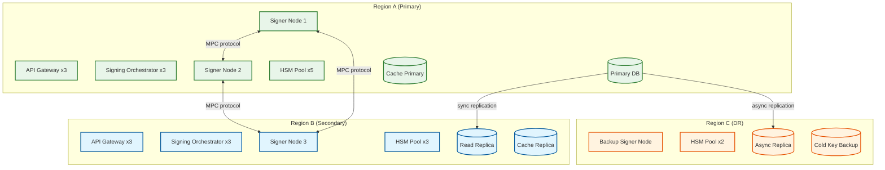
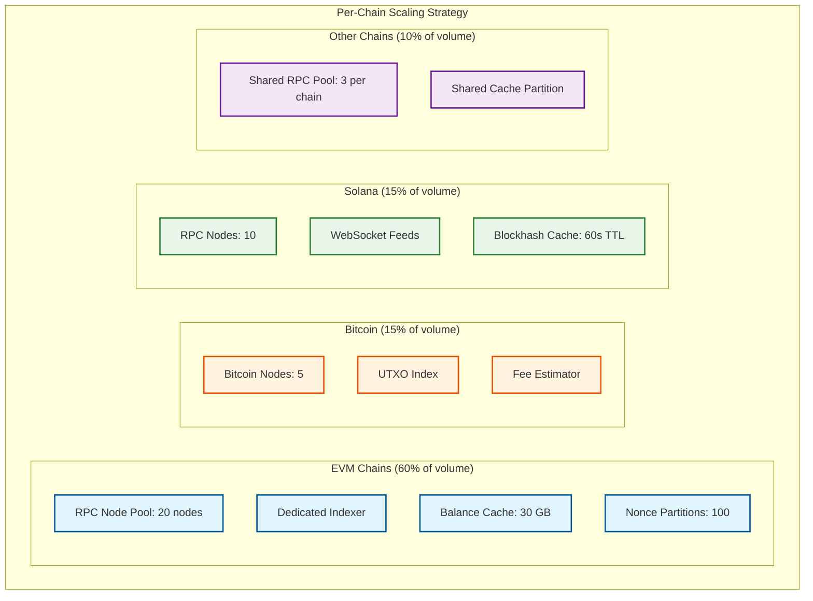
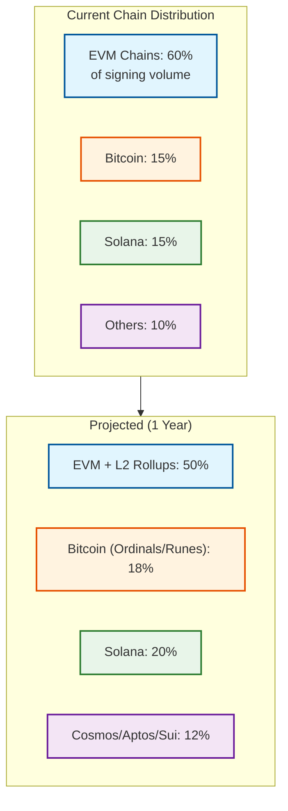
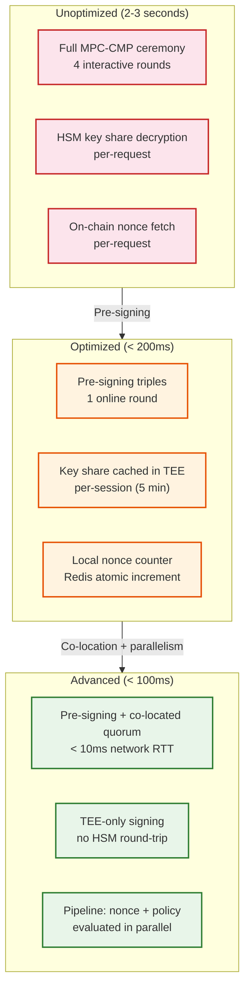

# Scalability & Reliability

## Scalability

### Horizontal vs. Vertical Scaling Decisions

| Component | Strategy | Justification |
|-----------|----------|---------------|
| API Gateway | Horizontal | Stateless; add instances behind load balancer |
| Wallet Service | Horizontal (shard by user_id) | No cross-user state; each request scoped to one user |
| Signing Orchestrator | Horizontal with session affinity | Stateless between requests; session state is ephemeral |
| Policy Engine | Horizontal + local cache | Stateless evaluation; policy rules cached in-memory per instance |
| MPC Signer Nodes | **Vertical + fixed topology** | Each node holds unique key shares; cannot arbitrarily add nodes. Scale vertically (faster CPU, more memory) within each node. Threshold increase (2-of-3 to 3-of-5) requires key refresh ceremony |
| Nonce Manager | Partitioned (one writer per chain:address) | Serialization requirement for nonce correctness; horizontal via partitioning |
| Balance Aggregator | Horizontal (shard by wallet_id) | Independent balance polling per wallet; no cross-wallet coordination |
| Chain Adapter | Horizontal per chain | Separate node pool per blockchain; scale independently per chain traffic |
| HSM | **Vertical + pool** | Hardware-constrained; scale by adding HSM modules to pool |

### Auto-Scaling Triggers

| Component | Metric | Scale-Up Threshold | Scale-Down Threshold |
|-----------|--------|-------------------|---------------------|
| API Gateway | Request rate | > 80% capacity | < 30% for 10 min |
| Signing Orchestrator | Queue depth | > 100 pending requests | < 10 for 15 min |
| Balance Aggregator | Cache miss rate | > 20% cache misses | < 5% for 20 min |
| Chain Adapter (per chain) | RPC error rate | > 5% errors | < 0.5% for 10 min |
| Policy Engine | p99 latency | > 40ms | < 15ms for 15 min |

### Database Scaling Strategy

**Wallet DB (PostgreSQL):**
- **Read replicas**: 3--5 per region for balance queries and transaction history
- **Sharding**: Hash partition by `user_id` once table exceeds 500M rows
- **Connection pooling**: PgBouncer with 500 connections per pool; transaction-level pooling
- **Partitioning**: `transaction` and `audit_entry` tables range-partitioned by month

**Key Share Store:**
- Not a traditional database; encrypted blob storage backed by HSM-managed encryption keys
- **Replication**: Synchronous replication across 3 regions (strong consistency for key material)
- **No sharding**: Key shares are small (< 1KB each); total volume manageable without sharding
- **Backup**: Daily encrypted snapshots to air-gapped cold storage

**Cache Cluster (Redis):**
- Cluster mode with 6+ nodes for balance cache, nonce cache, gas price cache
- **Eviction**: LRU for balance cache; no eviction for nonce cache (critical state)
- **Persistence**: AOF for nonce state recovery; RDB snapshots for balance cache warm-up

### Caching Layers

| Layer | What | TTL | Invalidation |
|-------|------|-----|-------------|
| **L1 - In-process** | Policy rules, gas price estimates | 30s | Event-driven: policy change event flushes L1 |
| **L2 - Redis** | Balance data, nonce counters, session state | 5--10s (balance), none (nonce) | New-block event triggers balance cache invalidation per chain |
| **L3 - CDN** | Static wallet metadata, chain configuration | 1 hour | Manual purge on configuration change |

### Hot Spot Mitigation

| Hot Spot | Cause | Mitigation |
|----------|-------|------------|
| **High-volume wallet** (exchange hot wallet) | Single address processes 10K+ txns/day | Dedicated nonce manager instance; larger pre-signing pool; priority queue |
| **Popular chain** (Ethereum mainnet) | 60%+ of all signing operations | Dedicated chain adapter fleet; multiple RPC endpoints; dedicated indexer |
| **Gas price spike** | All users rush to submit txns during fee spike | Gas price cache prevents thundering herd to RPC nodes; queue-based rate limiting for non-urgent txns |
| **Key refresh storm** | Scheduled key refresh for many wallets at same time | Stagger refresh across time windows; rate-limit DKG ceremonies |

---

## Reliability & Fault Tolerance

### Single Points of Failure (SPOF) Identification

| Component | SPOF Risk | Mitigation |
|-----------|-----------|------------|
| MPC Signer Node | Loss of one node in a 2-of-3 setup | Remaining 2 nodes can still sign; node recovery via encrypted backup share |
| HSM Module | Hardware failure | HSM pool with N+2 redundancy; automated failover |
| Nonce Manager partition | Lost nonce state | Redis persistence + PostgreSQL fallback; on-chain reconciliation |
| Blockchain RPC node | Single node failure | Pool of 5--20 nodes per chain; automatic failover on error |
| Bundler (ERC-4337) | Bundler unavailable | Multiple bundler connections; self-hosted bundler as last resort |

### Redundancy Strategy



**Key Redundancy Design:**
- **MPC signer nodes**: Distributed across 2+ regions. For 2-of-3 threshold, nodes 1 and 2 in Region A (low-latency signing), node 3 in Region B (geographic distribution). Backup node in Region C can replace any failed node after key share recovery.
- **HSM modules**: N+2 per region. HSMs are pooled; each signing operation uses any available HSM from the pool.
- **Database**: Synchronous replication A→B; asynchronous A→C. Failover to B is automatic; failover to C requires manual promotion (data loss window = async replication lag).

### Failover Mechanisms

| Scenario | Detection | Failover Action | RTO |
|----------|-----------|----------------|-----|
| Signer node failure | Heartbeat miss > 3s | Route to remaining quorum (2-of-3 becomes 2-of-2 from available nodes) | < 5s |
| HSM module failure | Health check failure | Remove from pool; route to healthy HSMs | < 1s |
| Primary DB failure | Replication lag + connection failure | Promote Region B replica to primary | < 30s |
| RPC node failure | Error rate > 10% for 30s | Remove from load balancer; route to healthy nodes | < 2s |
| Bundler failure | Submission timeout > 10s | Switch to alternative bundler endpoint | < 5s |
| Full Region A failure | All health checks fail | DNS failover to Region B; MPC signing via nodes 2+3 (if quorum allows) | < 2 min |

### Circuit Breaker Patterns

| Service | Failure Threshold | Open Duration | Half-Open Test |
|---------|-------------------|---------------|----------------|
| Blockchain RPC (per chain) | 5 failures in 10s | 30s | 1 request to healthiest node |
| HSM operations | 3 failures in 5s | 15s | 1 decrypt operation |
| Bundler submission | 3 failures in 30s | 60s | 1 UserOp simulation |
| Balance indexer | 10 failures in 30s | 60s | 1 balance query for known address |

### Retry Strategies

| Operation | Retry Strategy | Max Retries | Backoff |
|-----------|---------------|-------------|---------|
| MPC signing round | Immediate retry with same quorum | 2 | None (latency-critical) |
| Transaction broadcast | Retry with different RPC node | 3 | 1s, 2s, 5s |
| HSM key operation | Retry with different HSM from pool | 3 | 100ms, 200ms, 500ms |
| Bundler submission | Retry with gas bump (10%) | 3 | 5s, 15s, 30s |
| Nonce acquisition | Retry after brief wait | 5 | 50ms, 100ms, 200ms, 500ms, 1s |
| Balance query (uncached) | Retry with different node | 2 | 500ms, 1s |

### Graceful Degradation

| Scenario | Degraded Behavior | User Impact |
|----------|-------------------|-------------|
| Balance indexer down | Serve stale cached balances (flag as stale in UI) | Balances may be 30s--5min outdated |
| Gas oracle down | Use last known gas prices + 20% buffer | Transactions may overpay gas slightly |
| Policy engine overloaded | Fail-closed (deny signing) | Users cannot sign until policy engine recovers |
| One signer node down | Signing continues with remaining quorum | No user impact if threshold is met |
| All bundlers down | Fall back to direct EOA transaction if account allows | Lose gas sponsorship; user must hold ETH |

### Bulkhead Pattern

| Bulkhead | Resources Isolated | Justification |
|----------|--------------------|---------------|
| Per-chain RPC pools | Separate connection pools per blockchain | Ethereum node failure does not affect Solana operations |
| Institutional vs. retail signing | Separate signing orchestrator instances | Institutional high-volume traffic does not starve retail users |
| Pre-signing vs. online signing | Separate thread pools in signer nodes | Background pre-signing does not compete with real-time signing |
| Internal vs. external API | Separate gateway instances | Internal service calls not affected by external API traffic spikes |

### Multi-Chain Scaling Architecture

Each blockchain has fundamentally different throughput characteristics and scaling needs:



**Key scaling principle:** Chains are isolated blast domains. Scaling decisions (adding nodes, increasing cache, adding nonce partitions) are made per-chain based on traffic patterns. A spike on Ethereum must never degrade Solana performance.

### Load Shedding Strategy

When the system approaches capacity limits, load shedding priorities ensure critical operations are preserved:

| Priority | Operations | Shedding Behavior |
|----------|-----------|-------------------|
| **P0 (Never shed)** | Active MPC signing ceremonies, key refresh operations | Always complete; never interrupt |
| **P1 (Last resort)** | New signing requests from institutional clients | Queue with bounded wait; reject after 30s timeout |
| **P2 (Shed early)** | New signing requests from retail clients | Reject with retry-after header during overload |
| **P3 (Shed first)** | Balance queries, transaction history, DKG for new wallets | Return cached/stale data; queue DKG for later |

---

## Capacity Planning

### Growth Modeling

| Time Horizon | Wallets Managed | Daily Signing Ops | Peak Signing QPS | Infrastructure Response |
|-------------|----------------|-------------------|-----------------|------------------------|
| **Current** | 100M | 10M | 500 | Baseline: 3 signer nodes, 5 HSMs/region, 6 Redis nodes |
| **6 months** | 150M | 18M | 900 | Add 2 HSM modules/region; expand pre-signing pool 2x; add chain adapter capacity for new L2s |
| **1 year** | 250M | 35M | 1,700 | Shard nonce manager to 4 partitions; upgrade signer nodes to higher-core instances; add Region D for APAC |
| **3 years** | 500M | 80M | 4,000 | Move to 3-of-5 MPC threshold for institutional; dedicated signing clusters per custody tier; TEE fleet for MPC computation |

### Chain-Specific Scaling Projections



### Pre-Signing Pool Capacity Planning

| Wallet Tier | Daily Signing Volume | Triple Pool Size | Replenishment Interval | Storage per Wallet |
|------------|---------------------|-----------------|----------------------|-------------------|
| **Retail** (< 10 txns/day) | 1--10 | 50 triples | Every 24 hours | ~50 KB |
| **Active** (10--100 txns/day) | 10--100 | 500 triples | Every 6 hours | ~500 KB |
| **High-Volume** (100--1K txns/day) | 100--1,000 | 5,000 triples | Every 1 hour | ~5 MB |
| **Institutional** (1K+ txns/day) | 1,000--10,000 | 50,000 triples | Continuous generation | ~50 MB |

Adaptive tier assignment: wallets are automatically promoted/demoted based on 7-day rolling signing volume. Tier changes trigger immediate pool size adjustment. Over-provisioned wallets (inactive for 30 days) have their pool drained to 10 triples to reclaim storage.

### Resource Saturation Thresholds

| Resource | Yellow (Warning) | Red (Critical) | Action |
|----------|-----------------|----------------|--------|
| HSM operations/sec | > 70% capacity | > 90% capacity | Add HSM modules to pool; route overflow to TEE |
| Pre-signing triple inventory | < 30% target | < 10% target | Trigger batch pre-signing; alert if generation rate < consumption rate |
| Nonce manager queue depth | > 50 pending per partition | > 200 pending | Scale nonce manager partitions; investigate hot addresses |
| Blockchain RPC pool | > 80% connection utilization | > 95% | Add RPC nodes; enable request queuing with priority |
| Key share store IOPS | > 60% provisioned | > 85% | Increase provisioned IOPS; review access patterns for optimization |
| Cache memory utilization | > 75% | > 90% | Expand cache cluster; review TTL policies; consider L1 cache expansion |

---

## Disaster Recovery

### RTO / RPO Targets

| Scenario | RTO | RPO | Strategy |
|----------|-----|-----|----------|
| Single node failure | < 5s | 0 (no data loss) | Automatic failover within pool |
| Single region failure | < 2 min | 0 for signing; < 5s for balance data | DNS failover; sync-replicated key state |
| Multi-region failure | < 1 hour | 0 for key shares; < 1 min for txn data | Cold standby activation; air-gapped key backup restore |
| Key share corruption | < 4 hours | 0 (backup shares) | Restore from encrypted backup shares; re-run DKG if all shares corrupted |
| HSM fleet failure | < 30 min | 0 | Activate backup HSM modules; restore key encryption keys from cold backup |

### Backup Strategy

| Data | Backup Frequency | Retention | Storage |
|------|-----------------|-----------|---------|
| Key shares (encrypted) | Continuous replication + daily snapshot | Indefinite | 3 regions + air-gapped cold storage |
| Wallet DB | Continuous WAL shipping + hourly snapshots | 90 days | Cross-region object storage |
| Audit logs | Continuous replication | 7 years | Append-only store with cold archive after 1 year |
| Policy configuration | On every change + daily snapshot | 1 year | Cross-region object storage |
| Nonce state | Redis AOF (continuous) | 7 days | Local + cross-region |

### Multi-Region Architecture

- **Active-Passive for Signing**: Only one region serves signing requests at a time (prevents split-brain on nonce state). Passive region has warm standby with replicated key shares and nonce state.
- **Active-Active for Reads**: Balance queries and transaction history served from both regions simultaneously (eventual consistency acceptable for reads).
- **Key Share Distribution**: MPC signer nodes intentionally placed across regions for security. A 2-of-3 setup might have nodes in US-East, US-West, and EU-West---ensuring no single region compromise exposes a signing quorum.

### Key Recovery Procedures

```
PROCEDURE recover_from_lost_signer_node(lost_node_index):
    // 1. Verify remaining quorum can still sign
    active_nodes = GET_HEALTHY_SIGNER_NODES()
    IF active_nodes.count < threshold:
        ALERT("CRITICAL: Below signing threshold - initiate emergency recovery")

    // 2. Provision replacement node
    new_node = PROVISION_SIGNER_NODE(region=BACKUP_REGION)

    // 3. Key share recovery from encrypted backup
    encrypted_backup = RETRIEVE_BACKUP_SHARE(lost_node_index)
    decrypted_share = HSM_DECRYPT(encrypted_backup)
    LOAD_SHARE_INTO_ENCLAVE(new_node, decrypted_share)

    // 4. Proactive key refresh (rotate all shares to invalidate compromised share)
    INITIATE_KEY_REFRESH(all_wallets, new_node_set=active_nodes + new_node)

    // 5. Verify signing works with new quorum
    TEST_SIGN(test_message, quorum=[new_node, active_nodes[0]])
```

### Chaos Engineering for Wallet Systems

| Experiment | Method | Expected Outcome | Blast Radius |
|-----------|--------|-----------------|-------------|
| **Signer node crash** | Kill one signer node process | Signing continues with remaining quorum; auto-recovery within 5s | Single signing path; no user impact if threshold met |
| **HSM latency injection** | Add 500ms delay to HSM responses | Signing latency degrades but completes; TEE offloading activates | Signing latency increase; no data loss |
| **Nonce state corruption** | Inject incorrect nonce in cache | On-chain reconciliation detects divergence; auto-correct within 30s | Single address may have 1--2 stuck transactions |
| **Network partition between signer regions** | Block traffic between Region A and B | MPC ceremony fails for cross-region quorums; falls back to same-region quorum | Reduced signing availability if only cross-region quorum available |
| **Blockchain RPC node failure** | Return errors from 50% of RPC pool | Circuit breaker activates; routes to healthy nodes; degraded balance freshness | Balance staleness increases; signing unaffected |
| **Key refresh during peak signing** | Trigger key refresh for high-volume wallet | Read-write lock ensures active signings complete first; refresh queued | Brief signing delay for affected wallet only |

### Data Consistency During Failover

**Nonce State Consistency Protocol:**

When failing over from Region A to Region B, nonce state must be reconciled to prevent double-nonce or gap scenarios:

```
PROCEDURE failover_nonce_reconciliation(region_b):
    FOR each active_address in nonce_manager:
        // Step 1: Get on-chain confirmed nonce
        confirmed_nonce = CHAIN_ADAPTER.get_nonce(address)

        // Step 2: Query mempool for pending transactions
        pending_txns = CHAIN_ADAPTER.get_pending_txns(address)

        // Step 3: Reconcile local state
        expected_next = confirmed_nonce + pending_txns.count
        CACHE_SET("nonce_counter:" + address, expected_next)

        // Step 4: Verify no gaps
        FOR nonce in range(confirmed_nonce, expected_next):
            IF nonce NOT IN pending_txns:
                SUBMIT_FILLER_TX(address, nonce)

    LOG("Nonce reconciliation complete", region_b, addresses_reconciled)
```

**Key Share Consistency During Failover:**

Key shares use synchronous replication between Region A and B. During failover:
1. Verify all key share versions in Region B match last-known state from Region A
2. If any version mismatch detected: halt signing for affected wallets; escalate to security team
3. Resume signing only after version verification passes for all active wallets
4. Background audit: compare Region B shares against Region C (DR) backup to ensure no silent corruption

---

## Performance Engineering

### Signing Latency Optimization Hierarchy

The following optimization layers reduce signing latency from worst-case (full MPC ceremony) to best-case (pre-signed single-round):



### Hot Wallet Address Pool Strategy

For high-volume use cases (exchanges, payment processors), a single address becomes a nonce serialization Slowest part of the process. The system maintains a pool of pre-warmed addresses to distribute signing load:

| Strategy | Pool Size | Nonce Parallelism | Complexity | Best For |
|----------|----------|-------------------|-----------|---------|
| **Single address** | 1 | Sequential only | Low | Personal wallets (< 10 txns/day) |
| **Round-robin pool** | 10--50 | 10--50x parallel nonces | Medium | dApp hot wallets (100--1K txns/day) |
| **Weighted pool** | 50--200 | 50--200x parallel nonces | High | Exchange hot wallets (10K+ txns/day) |
| **Dynamic pool** | Auto-scaled | Adapts to traffic | Highest | Institutional custody with variable volume |

**Address selection algorithm:**
1. Hash the transaction intent (destination + amount + token) to select a candidate address
2. Check if candidate address has available nonce capacity (< 10 pending txns)
3. If congested, rotate to next available address in pool
4. If all addresses congested, queue the transaction with backpressure signal

### Database Query Optimization for Common Patterns

| Query Pattern | Frequency | Optimization |
|--------------|-----------|-------------|
| Get all wallets for user | 50K/min | Index on `(user_id, status)`; serve from cache for repeat views |
| Get balance for wallet (all chains) | 500K/min | Materialized view updated by balance aggregator; never fan-out to per-chain queries on read |
| Get transaction history | 100K/min | Partitioned by `signed_at` (monthly); index on `(address_id, signed_at DESC)`; pagination via keyset (not OFFSET) |
| Check pending transactions for address | 200K/min | Redis set per `chain:address`; O(1) membership check |
| Policy lookup for signing | 200K/min | L1 in-process cache (30s TTL); L2 Redis cache; event-driven invalidation |
| Audit log query (compliance) | 100/day | Time-partitioned; compliance queries always include time range; index on `(wallet_id, created_at)` |
