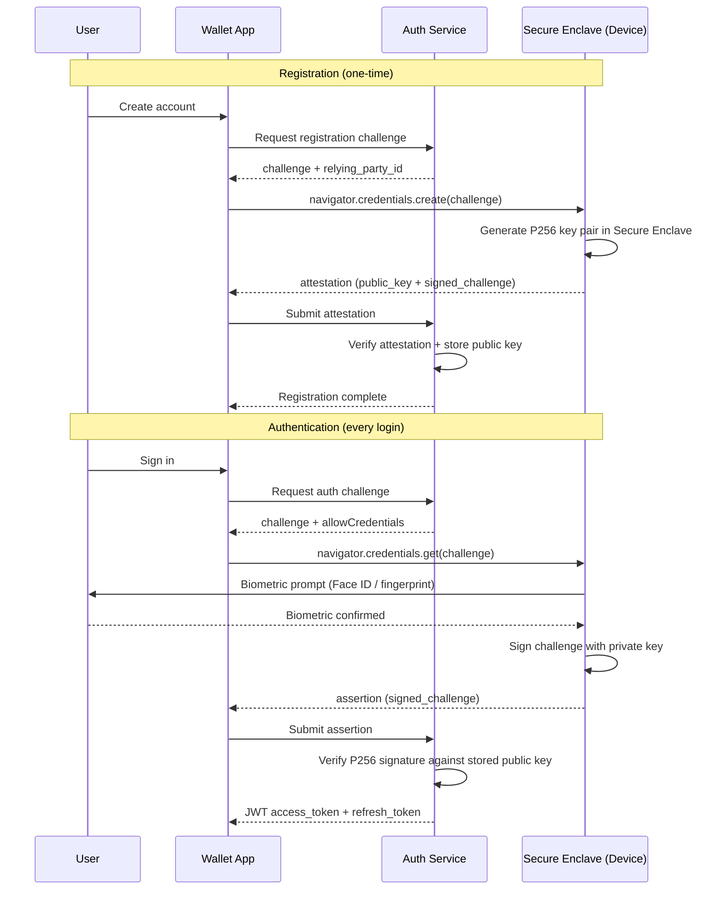
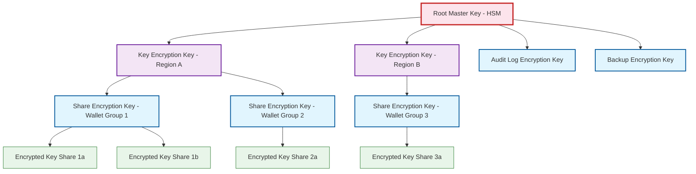
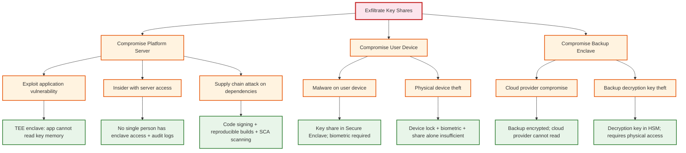
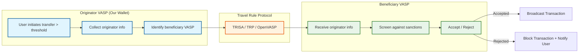
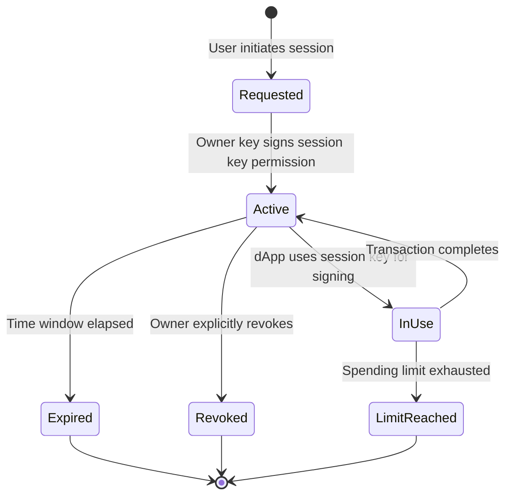

# Security & Compliance

## Authentication & Authorization

### Authentication Mechanisms

| Client Type | AuthN Method | Details |
|-------------|-------------|---------|
| **Web/Mobile App** | Passkey (WebAuthn/FIDO2) + JWT | Passkey creates P256 key pair on device; server verifies assertion; issues JWT for session |
| **SDK Integration** | API Key + HMAC signature | API key identifies the app; HMAC signs each request body with secret key |
| **Institutional API** | mTLS + API Key | Mutual TLS for transport; API key for identity; IP allowlisting |
| **Admin Console** | SSO (OIDC) + Hardware MFA | Federated login via enterprise IdP; FIDO2 hardware key required for admin actions |

### Passkey Authentication Flow (WebAuthn)



### Authorization Model

**Layered authorization with RBAC + ABAC:**

| Layer | Scope | Mechanism |
|-------|-------|-----------|
| **Organization** | Who can access the org's wallets | RBAC: Admin, Signer, Viewer, Auditor |
| **Wallet** | Who can sign from this wallet | Policy engine: multi-approval quorum, role requirements |
| **Transaction** | Can this specific transaction proceed | ABAC: amount, destination, chain, time, velocity |
| **Key Share** | Can this party participate in signing | MPC protocol: only key share holders can participate; no delegation |

**Role Definitions:**

| Role | Create Wallet | View Balance | Sign Txn | Manage Policy | Manage Users |
|------|:---:|:---:|:---:|:---:|:---:|
| **Admin** | Yes | Yes | No (unless also Signer) | Yes | Yes |
| **Signer** | No | Yes | Yes (subject to policy) | No | No |
| **Viewer** | No | Yes | No | No | No |
| **Auditor** | No | Yes (read-only) | No | View only | No |

### Token Management

| Token | Lifetime | Storage | Refresh |
|-------|----------|---------|---------|
| Access JWT | 15 min | Memory only (never disk) | Via refresh token |
| Refresh token | 7 days | Secure HTTP-only cookie / Keychain | Rotation on use (one-time use) |
| API Key | Until revoked | Server-side hashed (bcrypt) | Manual rotation; old key grace period = 24h |
| Session key (ERC-4337) | Configurable (1h--30d) | On-chain smart account | New session key signed by owner key |

---

## Data Security

### Encryption at Rest

| Data | Encryption | Key Management |
|------|-----------|----------------|
| Key shares | AES-256-GCM | Encryption key stored in HSM; key share encrypted before storage; double-encryption with backup key |
| Wallet DB | AES-256 (TDE) | Database-level transparent encryption; key in HSM |
| Audit logs | AES-256-GCM + hash chain | Each entry encrypted; hash chain provides tamper evidence |
| Backups | AES-256-GCM | Backup-specific key in HSM; different from primary encryption key |
| Cache (Redis) | AES-256 | In-transit encryption via TLS; at-rest encryption for persistence files |

### Encryption in Transit

| Path | Protocol | Details |
|------|----------|---------|
| Client → API Gateway | TLS 1.3 | Certificate pinning in mobile SDK; HSTS headers |
| Service → Service | mTLS | Service mesh-managed certificates; auto-rotation every 24h |
| Signer Node → Signer Node | TLS 1.3 + application-layer encryption | MPC protocol messages additionally encrypted with session keys |
| Service → HSM | HSM vendor protocol (PKCS#11 over TLS) | Hardware-attested connection |
| Service → Blockchain | TLS 1.3 (HTTPS RPC) | Certificate validation; no self-signed certs |

### Key Hierarchy



### PII Handling

| Data | Classification | Treatment |
|------|---------------|-----------|
| Email address | PII | Encrypted at rest; access-logged; GDPR right-to-erasure supported |
| Blockchain addresses | Pseudo-anonymous | Not PII per se, but linked to user records; treat as sensitive |
| IP addresses | PII (under GDPR) | Logged for security only; 90-day retention; anonymized in analytics |
| KYC documents | Sensitive PII | Encrypted; stored in isolated service; access requires MFA + audit log |
| Transaction data | Financial data | Encrypted; retention per regulatory requirement (5--7 years) |

---

## Threat Model

### Top Attack Vectors

| # | Attack Vector | Severity | Likelihood | Mitigation |
|---|--------------|----------|------------|------------|
| 1 | **Key share exfiltration** from compromised server | Critical | Medium | TEE/HSM enclave: key shares never in plaintext outside secure boundary; memory encryption |
| 2 | **Insider threat** (malicious employee) | Critical | Low-Medium | No single employee has access to threshold shares; MPC requires multiple parties; all access logged |
| 3 | **Supply chain attack** on MPC library | Critical | Low | Vendor security audit; reproducible builds; code signing; multiple independent MPC implementations |
| 4 | **Social engineering** for recovery | High | Medium | Time-delayed recovery (48--72h); notification to original owner; guardian threshold not publicized |
| 5 | **Transaction manipulation** (address replacement) | High | Medium | Address book with verified addresses; clipboard protection in SDK; EIP-712 typed signing for human-readable txns |
| 6 | **API key compromise** | High | Medium-High | IP allowlisting; rate limiting; transaction policies enforce limits regardless of API key |
| 7 | **Blockchain front-running / MEV** | Medium | High | Private mempool submission (Flashbots Protect); transaction simulation before signing |
| 8 | **DDoS on signing service** | Medium | Medium | Rate limiting; WAF; signing service behind private network; capacity-based auto-scaling |

### Attack Tree: Key Share Exfiltration



### Rate Limiting & DDoS Protection

| Layer | Protection | Configuration |
|-------|-----------|---------------|
| **Edge (CDN/WAF)** | IP-based rate limiting, geo-blocking | 1,000 req/min per IP; block known bot networks |
| **API Gateway** | Token-based rate limiting | Per-user limits based on tier (see API design) |
| **Signing Service** | Per-wallet signing rate | 100 signs/min per wallet; circuit breaker at service level |
| **Blockchain RPC** | Connection pooling + backpressure | Max concurrent RPC calls per chain; queue overflow rejection |

---

## Compliance

### Custody Regulations

| Jurisdiction | Regulation | Key Requirements | Architecture Impact |
|-------------|-----------|-----------------|---------------------|
| **EU** | MiCA (Markets in Crypto-Assets) | Custody licensing; segregation of client assets; capital requirements | Separate hot/cold wallet pools per client; real-time asset reconciliation |
| **US (NY)** | BitLicense | Cybersecurity program; capital reserve; AML/BSA compliance | SOC 2 Type II; independent penetration testing; quarterly AML reporting |
| **US (Federal)** | Travel Rule (FinCEN) | Originator/beneficiary info for transfers > $3,000 | TRISA/TRP protocol integration; counterparty identification service |
| **Dubai** | VARA (Virtual Assets Regulatory Authority) | Technology governance; custody segregation; client asset protection | Dubai-specific data residency; local compliance officer access |
| **Singapore** | MAS Payment Services Act | Major payment institution license for custody | Segregated custody; annual audit |

### Travel Rule Implementation



### AML/KYC Integration

| Check | Trigger | Data Required | Blocking? |
|-------|---------|---------------|-----------|
| Identity verification (KYC) | Wallet creation | Name, DOB, address, ID document | Yes---cannot create wallet until verified |
| Sanctions screening | Every outbound transfer | Destination address; counterparty identity (if known) | Yes---blocked if match found |
| Transaction monitoring | All transactions | Amount, frequency, counterparty patterns | No (async)---flagged for compliance review |
| Enhanced due diligence | High-value or high-risk patterns | Source of funds documentation | Wallet may be restricted until EDD complete |

### Audit Trail Requirements

| Event | Data Captured | Retention | Immutability |
|-------|--------------|-----------|-------------|
| Wallet creation | User ID, org ID, custody type, key version | 7 years | Hash-chained append-only log |
| Signing operation | Wallet ID, tx hash, policy decision, signer nodes, timestamp | 7 years | Hash-chained + HSM-signed |
| Policy change | Changed by, old rules, new rules, timestamp | 7 years | Hash-chained |
| Key refresh | Old version, new version, participating nodes | Indefinite | Hash-chained + HSM-signed |
| Recovery event | Recovery type, guardians involved, delay applied | Indefinite | Hash-chained + HSM-signed |
| Admin action | Admin ID, action type, target, MFA method used | 7 years | Hash-chained |

### SOC 2 Type II Controls

| Trust Service Criteria | Control | Evidence |
|----------------------|---------|----------|
| **Security** | MPC key management; HSM-backed encryption; TEE enclaves | Penetration test reports; HSM FIPS 140-2 certificates |
| **Availability** | 99.99% signing uptime; multi-region redundancy | Uptime monitoring dashboards; incident post-mortems |
| **Processing Integrity** | Signature verification before broadcast; policy enforcement | Audit log analysis; automated compliance tests |
| **Confidentiality** | Key share isolation; encrypted storage; access controls | Access review reports; encryption configuration audits |
| **Privacy** | GDPR compliance; data minimization; right to erasure | Privacy impact assessment; data retention policy enforcement |

---

## Advanced Threat Scenarios

### Supply Chain Attack on MPC Library

**Scenario:** A compromised dependency in the MPC signing library introduces a subtle bias in the random number generation during nonce creation. This could allow an attacker observing multiple signatures to derive the private key shares through lattice-based attacks.

**Defense Layers:**
1. **Deterministic builds**: MPC library built from pinned source with reproducible build process; hash verified against known-good build
2. **Multi-implementation verification**: Critical signing paths run through two independent MPC implementations; signatures must match
3. **Nonce verification**: After each signing ceremony, verify that the nonce used was properly random by checking its relationship to the pre-signed triple
4. **SCA (Software Composition Analysis)**: Automated dependency scanning on every build; block deployment if any dependency has known vulnerabilities
5. **Isolated build pipeline**: MPC library compiled in air-gapped build environment; artifacts signed with build-system-specific HSM key

### TEE Side-Channel Attacks

**Scenario:** Spectre/Meltdown-class attacks or newer side-channel vulnerabilities (e.g., SGX-Step, Plundervolt) could allow an attacker co-located on the same physical host to extract key material from the TEE enclave.

**Defense Layers:**
1. **Dedicated hosts**: TEE enclaves run on dedicated physical hosts (no multi-tenancy on enclave hosts)
2. **Memory encryption**: Use TEEs that provide full memory encryption (e.g., AMD SEV-SNP) rather than relying solely on enclave page isolation
3. **Attestation rotation**: Remote attestation of enclave integrity before every signing session; refuse to send key shares to unattested enclaves
4. **Key share time-bounding**: Key shares in TEE memory are zeroed after each signing session (max 5 minutes); re-decrypted from HSM for next session
5. **Post-SGX migration**: Plan migration from Intel SGX (deprecated) to ARM CCA (Confidential Compute Architecture) or AMD SEV-SNP for next-generation enclave isolation

### Social Engineering Attack on Recovery

**Scenario:** An attacker impersonates the wallet owner and convinces guardians to approve a fraudulent recovery request, gaining control of the wallet.

**Defense Layers:**
1. **Time-lock enforcement**: Minimum 48-hour delay between guardian approval and recovery execution; original owner receives immediate notification
2. **Guardian verification**: Guardians must authenticate via independent channel (not email alone); require cryptographic signature from guardian's own key
3. **Challenge-response**: Recovery request includes a challenge that only the legitimate owner would recognize (e.g., hash of first transaction ever sent from wallet)
4. **Rate limiting**: Maximum one recovery attempt per wallet per 30 days; failed attempts trigger security review
5. **Guardian anonymity**: Guardian identities are hashed on-chain; attackers cannot easily enumerate who to target

---

## Regulatory Landscape by Jurisdiction (2025--2026)

| Jurisdiction | Status | Key Requirements | Wallet Architecture Impact |
|-------------|--------|-----------------|---------------------------|
| **EU (MiCA)** | Fully enforced (June 2024) | CASP registration; asset segregation; capital reserves; Travel Rule | Separate custody pools per client; real-time reserve reporting; TRISA integration |
| **US (Federal)** | Evolving; stablecoin legislation pending | FinCEN Travel Rule ($3K threshold); state-by-state licensing | Multi-state compliance engine; Travel Rule for all transfers above threshold |
| **US (New York)** | BitLicense enforced | Cybersecurity program (NYDFS 500); capital reserves; quarterly reporting | SOC 2 Type II; independent pen testing; dedicated compliance infrastructure |
| **UAE (VARA)** | Enforced (Dubai) | Technology governance; client asset protection; local data residency | Dubai-region infrastructure; local compliance officer access; data residency controls |
| **Singapore (MAS)** | Payment Services Act enforced | Major payment institution license; technology risk management | Annual audit; segregated custody; incident reporting within 1 hour |
| **Hong Kong (SFC)** | Licensed regime (2024+) | Type 1 + Type 7 license for virtual asset trading; custody requirements | Insurance coverage; cold storage requirements; independent auditor |
| **Japan (JFSA)** | Registered regime | Cold wallet requirements (95%+ in cold storage); user asset segregation | Strict hot/cold wallet ratio enforcement; real-time cold storage monitoring |

### Travel Rule Protocol Comparison

| Protocol | Coverage | Integration Effort | Privacy Model |
|----------|---------|-------------------|---------------|
| **TRISA** | Global; used by Chainalysis, CipherTrace | SDK integration; node operation required | Encrypted peer-to-peer; VASP-to-VASP |
| **TRP (Travel Rule Protocol)** | Primarily US/EU | REST API integration | Hub-and-spoke via compliance providers |
| **OpenVASP** | EU-focused | IVMS101 message format | On-chain registry; off-chain messaging |
| **Sygna Bridge** | Asia-Pacific focus | REST API | Centralized bridge |

**Recommendation:** Support TRISA and TRP as primary protocols (broadest coverage); add OpenVASP for EU-specific compliance. Protocol selection based on counterparty VASP's supported protocol via registry lookup.

---

## Incident Response Plan for Key Compromise

### Severity Classification

| Severity | Definition | Example | Response Time |
|----------|-----------|---------|---------------|
| **SEV-0 (Critical)** | Key shares from threshold quorum potentially compromised | Two signer nodes breached simultaneously | Immediate: halt all signing, activate war room |
| **SEV-1 (High)** | Single key share potentially compromised | One signer node or one HSM breached | < 15 min: initiate emergency key refresh for affected wallets |
| **SEV-2 (Medium)** | Suspicious access to key infrastructure | Anomalous HSM access pattern; unauthorized enclave attestation | < 1 hour: investigate, potentially initiate precautionary refresh |
| **SEV-3 (Low)** | Non-key security event | API key compromise; DDoS attempt | < 4 hours: standard incident response |

### SEV-1 Response Procedure

```
PROCEDURE respond_to_single_share_compromise(compromised_node_index):
    // 1. IMMEDIATELY: isolate compromised node
    NETWORK_ISOLATE(signer_nodes[compromised_node_index])
    REVOKE_ALL_SESSIONS(compromised_node_index)

    // 2. Verify remaining quorum can still sign
    healthy_nodes = GET_HEALTHY_NODES() - {compromised_node_index}
    ASSERT healthy_nodes.count >= threshold

    // 3. Begin emergency key refresh (batch by priority)
    FOR each wallet_batch in PRIORITIZE_WALLETS(by="asset_value DESC"):
        INITIATE_KEY_REFRESH(wallet_batch, participants=healthy_nodes)
        // New shares invalidate compromised share without changing public key

    // 4. Forensic preservation
    SNAPSHOT_LOGS(compromised_node_index, last_72_hours)
    PRESERVE_MEMORY_DUMP(compromised_node_index)

    // 5. Provision replacement node
    new_node = PROVISION_SIGNER_NODE(fresh_attestation=true)
    DISTRIBUTE_NEW_SHARES(new_node, from_refresh_output)

    // 6. Post-incident
    GENERATE_INCIDENT_REPORT()
    NOTIFY_AFFECTED_CLIENTS(if_institutional=true)
    NOTIFY_REGULATORS(if_required_by_jurisdiction)
```

---

## Session Key Security Model

Session keys are temporary signing keys with scoped permissions, used in ERC-4337 smart accounts to enable seamless UX without requiring the owner key for every action.

### Permission Scoping

| Permission Dimension | Example Constraint | Enforcement |
|---------------------|-------------------|-------------|
| **Contract whitelist** | Only interact with `0xDEXRouter` and `0xTokenContract` | Smart account validates `to` address in calldata |
| **Function selector** | Only `swap()` and `approve()`, not `transfer()` | Smart account checks first 4 bytes of calldata |
| **Value limit** | Max 1 ETH per transaction; max 10 ETH per session | On-chain check in `validateUserOp()` |
| **Time window** | Valid from 2026-03-21 09:00 to 2026-03-21 17:00 | Block timestamp check in validation |
| **Gas limit** | Max 500,000 gas per UserOp | Bundler-level enforcement + on-chain check |
| **Chain restriction** | Only valid on Ethereum mainnet | Chain ID embedded in session key permission |

### Session Key Lifecycle



### Security Considerations for Session Keys

1. **Session key storage**: The session key's private key is held in browser localStorage or mobile secure storage. Compromise of the session key is limited by the permission scope---an attacker can only perform allowed actions within the spending limit
2. **Revocation latency**: Revocation requires an on-chain transaction to update the smart account's session key registry. During the revocation period (~12 seconds on Ethereum), the compromised session key can still sign
3. **Session key rotation**: For long-lived sessions (multi-day), the system auto-rotates session keys every 24 hours by having the owner key sign a new session permission in the background
