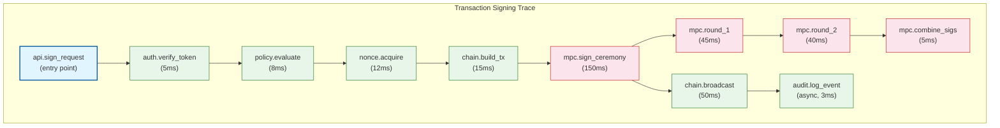
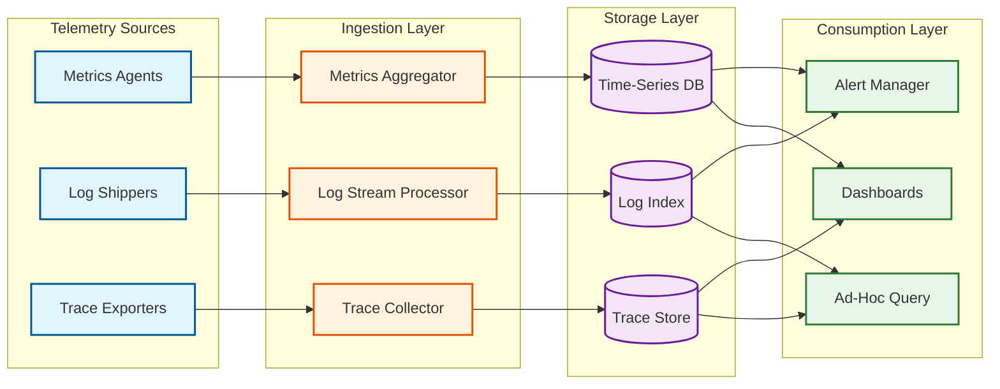

# Observability

## Metrics (USE/RED)

### Key Business Metrics

| Metric | Description | Alert Threshold |
|--------|-------------|----------------|
| `signing.success_rate` | Percentage of signing requests that complete successfully | < 99.9% |
| `signing.latency_p99` | 99th percentile signing latency (ms) | > 2000ms |
| `dkg.success_rate` | Percentage of DKG ceremonies completing without retry | < 99% |
| `policy.deny_rate` | Percentage of transactions denied by policy | Sudden spike > 2x baseline |
| `gas.sponsorship_daily_usd` | Total gas sponsored in USD | > $3M (budget overrun) |
| `balance.staleness_p99` | Maximum age of cached balance data (seconds) | > 30s |
| `nonce.gap_count` | Number of nonce gaps detected across all addresses | > 0 (any gap is actionable) |

### Infrastructure Metrics (USE Method)

| Resource | Utilization | Saturation | Errors |
|----------|------------|------------|--------|
| **MPC Signer CPU** | CPU % during signing ceremonies | Signing queue depth | Failed MPC rounds |
| **HSM Operations** | Operations/sec per HSM module | Pending HSM requests | HSM timeout/error count |
| **TEE Memory** | Enclave memory usage % | Enclave page swap rate | Attestation failures |
| **Redis Cache** | Memory usage %; hit rate | Eviction rate | Connection errors |
| **Database** | Connection pool usage %; query time | Query queue depth | Deadlock count; replication lag |
| **RPC Nodes** | Request rate per node | Queue depth at node | HTTP 429/500 error rate |

### Service Metrics (RED Method)

| Service | Rate | Errors | Duration |
|---------|------|--------|----------|
| **Signing Orchestrator** | Signing requests/sec | Failed signings/sec; policy denials/sec | p50/p95/p99 signing latency |
| **Policy Engine** | Evaluations/sec | Evaluation errors/sec | p50/p95/p99 evaluation time |
| **Nonce Manager** | Nonce acquisitions/sec | Gap detections/sec; lock timeouts/sec | p50/p95/p99 acquisition time |
| **Balance Aggregator** | Queries/sec; cache hit rate | Stale responses/sec; fetch failures/sec | p50/p95/p99 response time |
| **AA Service** | UserOps submitted/sec | Bundler rejections/sec; reverted UserOps/sec | p50/p95/p99 submission-to-inclusion time |
| **Chain Adapter** | RPC calls/sec per chain | RPC errors/sec per chain | p50/p95/p99 RPC latency per chain |

### Dashboard Design

**Executive Dashboard:**
- Total assets under management (updated hourly)
- Daily signing volume (trend chart, 30-day)
- Signing success rate (real-time, last 24h)
- Gas sponsorship spend vs. budget
- Active wallets (DAU/MAU trend)

**Operations Dashboard:**
- Signing latency heatmap (by chain, by custody type)
- MPC signer node health (per-node CPU, memory, active sessions)
- HSM pool utilization and queue depth
- Nonce gap tracker (real-time, by chain)
- Pre-signing triple inventory (per wallet tier)

**Chain-Specific Dashboard (per blockchain):**
- RPC node health and latency
- Gas price trend and estimation accuracy
- Transaction confirmation times (mempool → confirmed)
- Pending transaction queue depth
- Block reorg detection events

**Security Dashboard:**
- Policy evaluation outcomes (allow/deny/pending breakdown)
- Key refresh operations (scheduled vs. emergency)
- Failed authentication attempts (by method)
- Anomalous signing patterns (unusual volume, unusual destinations)
- Travel Rule compliance rate

---

## Logging

### What to Log

| Event Category | Log Level | Fields | Example |
|---------------|-----------|--------|---------|
| **Signing request received** | INFO | request_id, wallet_id, chain, tx_type, source_ip | `Signing request received wallet=wlt_123 chain=ethereum` |
| **Policy evaluation result** | INFO | request_id, wallet_id, policy_id, result, rules_evaluated | `Policy evaluation result=approved rules=3 latency=8ms` |
| **MPC ceremony started** | INFO | session_id, wallet_id, quorum_nodes, protocol | `MPC ceremony started session=mpc_456 nodes=[1,2]` |
| **MPC round completed** | DEBUG | session_id, round_number, duration_ms | `MPC round 1 completed session=mpc_456 duration=45ms` |
| **Signing completed** | INFO | request_id, wallet_id, tx_hash, total_latency_ms | `Signing completed tx_hash=0xabc latency=180ms` |
| **Signing failed** | ERROR | request_id, wallet_id, error_code, error_message, retry_count | `Signing failed error=HSM_TIMEOUT retry=1` |
| **Nonce gap detected** | WARN | chain_id, address, expected_nonce, actual_nonce | `Nonce gap detected chain=ethereum expected=43 actual=45` |
| **Key refresh initiated** | INFO | wallet_id, old_version, new_version, reason | `Key refresh wallet=wlt_123 v1->v2 reason=scheduled` |
| **Policy change** | WARN | org_id, policy_id, changed_by, change_type | `Policy updated org=org_789 by=admin_001` |
| **Recovery initiated** | WARN | wallet_id, recovery_type, guardian_count | `Recovery initiated wallet=wlt_123 type=social guardians=3` |
| **Suspicious activity** | ALERT | wallet_id, reason, details | `Suspicious: 50 txns in 1min from wallet=wlt_123` |

### Log Levels Strategy

| Level | Use Case | Volume Expectation |
|-------|---------|-------------------|
| **DEBUG** | MPC round details, cache operations, RPC call details | High (10M+/day); sampled at 1% in production |
| **INFO** | Signing lifecycle events, policy results, balance updates | Medium (5M+/day); full retention |
| **WARN** | Nonce gaps, policy changes, degraded service, recovery events | Low (10K+/day); full retention + alerting |
| **ERROR** | Signing failures, HSM errors, MPC protocol errors | Low (< 1K/day target); full retention + immediate alerting |
| **ALERT** | Security events, key compromise indicators, compliance violations | Very Low; full retention + PagerDuty + compliance team notification |

### Structured Logging Format

```
{
  "timestamp": "2026-03-09T14:30:00.123Z",
  "level": "INFO",
  "service": "signing-orchestrator",
  "instance_id": "sign-3a",
  "trace_id": "abc123def456",
  "span_id": "789ghi",
  "event": "signing.completed",
  "wallet_id": "wlt_xyz789",
  "chain": "ethereum",
  "tx_hash": "0xdef456...",
  "latency_ms": 180,
  "mpc_session_id": "mpc_456",
  "quorum": [1, 2],
  "policy_decision": "approved",
  "nonce": 42,
  "gas_sponsored": true
}
```

**Sensitive Data Handling in Logs:**
- NEVER log key shares, encrypted share content, or HSM key references
- NEVER log full transaction payloads (log only tx_hash and calldata function selector)
- Mask user email to `n***@example.com`
- Blockchain addresses are logged in full (public data, needed for debugging)

---

## Distributed Tracing

### Trace Propagation Strategy

All services propagate W3C Trace Context headers (`traceparent`, `tracestate`). MPC ceremony rounds use a dedicated `mpc-session-id` header that correlates all inter-node communication within a single signing session.

### Key Spans to Instrument



### Cross-Service Trace Correlation

| Trace Boundary | Propagation Method |
|---------------|-------------------|
| Client → API Gateway | `X-Request-Id` header (client-generated) |
| API Gateway → Services | W3C `traceparent` header |
| Signing Orchestrator → Signer Nodes | `traceparent` + `mpc-session-id` |
| Service → Blockchain RPC | `traceparent` (for internal tracking; not sent to external nodes) |
| Service → Event Queue | Trace context embedded in message metadata |

---

## Alerting

### Critical Alerts (Page-Worthy)

| Alert | Condition | Escalation |
|-------|-----------|------------|
| **Signing failure rate > 1%** | error_rate(signing) > 0.01 for 2 min | Page on-call SRE immediately |
| **MPC signer node down** | Node heartbeat missing > 10s | Page on-call SRE + security team |
| **HSM unreachable** | All HSM health checks fail for 30s | Page on-call SRE + HSM vendor |
| **Nonce gap detected** | Any nonce gap on any address | Page on-call + auto-remediation attempt |
| **Key share access anomaly** | Unusual key share access pattern | Page security team immediately |
| **Signing below quorum** | Healthy signer nodes < threshold | Page CTO + SRE + security |
| **Paymaster balance critical** | Paymaster ETH balance < 24h of gas budget | Page on-call + finance team |

### Warning Alerts

| Alert | Condition | Action |
|-------|-----------|--------|
| **Signing latency degradation** | p99 > 1.5s for 5 min | Investigate MPC node performance; check HSM queue |
| **Pre-signing triple pool low** | Triples < 20% of target per wallet tier | Trigger batch pre-signing job |
| **RPC node degradation** | Error rate > 5% for specific chain | Failover to backup nodes; investigate |
| **Balance cache hit rate drop** | Hit rate < 80% for 10 min | Check cache eviction; investigate traffic pattern |
| **Gas price spike** | Gas price > 5x 1-hour average | Notify users; queue non-urgent transactions |
| **Policy evaluation latency spike** | p99 > 40ms for 5 min | Check policy cache; investigate complex policies |

### Runbook References

| Alert | Runbook |
|-------|---------|
| Signing failure rate spike | Check MPC node health → verify HSM connectivity → check nonce state → review recent deployments |
| Signer node down | Verify node status → check enclave health → activate backup node → initiate key refresh if compromise suspected |
| Nonce gap | Identify missing nonce → submit filler transaction → verify gap resolved → investigate root cause |
| Paymaster low balance | Check current balance → calculate runway → initiate replenishment → alert finance if > $100K needed |
| Key refresh failure | Verify all participating nodes healthy → check network connectivity between nodes → retry with extended timeout → escalate if 3rd retry fails |

---

## Security-Specific Observability

### Key Share Access Monitoring

| Event | Normal Pattern | Anomalous Pattern | Alert Level |
|-------|---------------|-------------------|-------------|
| **Share decryption** | 1--5 per wallet per day during signing | > 20 decryptions in 1 hour for a single wallet | WARN → page security if sustained |
| **DKG ceremony** | Correlates with wallet creation API calls | DKG without corresponding API request | CRITICAL → immediate investigation |
| **Key refresh** | Scheduled (within maintenance window) | Unscheduled refresh or refresh outside window | WARN → verify triggering event |
| **Cross-region share access** | Backup region access during failover | Backup region access during normal operation | CRITICAL → potential exfiltration attempt |
| **HSM key enumeration** | Never in normal operation | Any enumeration request | CRITICAL → possible insider threat |

### On-Chain Transaction Monitoring

| Metric | Description | Alert Condition |
|--------|-------------|----------------|
| `tx.confirmation_time_p99` | Time from broadcast to first block confirmation | > 5 minutes (Ethereum); > 30s (Solana) |
| `tx.revert_rate` | Percentage of broadcast transactions that revert on-chain | > 1% for any chain |
| `tx.gas_overestimation_ratio` | Actual gas used / estimated gas | < 0.5 (over-estimating by 2x+) or > 0.95 (dangerously tight) |
| `tx.mempool_eviction_rate` | Transactions dropped from mempool before inclusion | > 0.5% |
| `tx.reorg_affected_count` | Transactions affected by chain reorganizations | > 0 (any reorg is investigation-worthy) |
| `paymaster.daily_spend_usd` | Cumulative gas sponsorship cost in USD | > 80% of daily budget |
| `paymaster.per_user_spend_p99` | Highest per-user daily sponsorship | > $100 (potential abuse) |

### Compliance Audit Observability

| Audit Query | Data Source | Frequency | Purpose |
|------------|------------|-----------|---------|
| Travel Rule compliance rate | Audit log + Travel Rule service | Daily automated report | Percentage of qualifying transfers with completed Travel Rule exchange |
| Policy evaluation overrides | Audit log | Weekly | Any manual policy bypasses or emergency overrides |
| Key access frequency per employee | HSM access log + admin action log | Monthly | Insider threat detection; access pattern review |
| Wallet creation vs. KYC completion | Wallet DB + KYC service | Daily | Identify wallets created before KYC completed (compliance gap) |
| Cross-border transaction volume | Transaction log + geo-IP | Weekly | Regulatory reporting for jurisdictions with cross-border thresholds |

---

## SLI/SLO Tracking

### Service Level Indicators

| SLI | Measurement | Good Threshold | SLO Target |
|-----|-------------|---------------|------------|
| **Signing availability** | `successful_signings / total_signing_requests` (excluding policy denials) | > 99.99% | 99.99% per month |
| **Signing latency** | p99 of time from API request to signed transaction output | < 2,000ms | 99% of 28-day windows |
| **Balance freshness** | p99 of `NOW() - balance.updated_at` for cached balances | < 10s | 95% of measurements |
| **Policy evaluation correctness** | `correct_decisions / total_decisions` (verified by audit) | 100% | 100% (zero tolerance) |
| **Audit completeness** | `signing_events_with_audit_entry / total_signing_events` | 100% | 100% (regulatory requirement) |
| **Key share durability** | `accessible_shares / total_shares` across all regions | 100% | 99.999999999% annualized |

### Error Budget Tracking

| Service | Monthly SLO | Error Budget (min) | Current Burn Rate | Projected Exhaustion |
|---------|------------|-------------------|-------------------|---------------------|
| Signing service | 99.99% | 4.32 min | 0.3 min/week | Never (well within budget) |
| Policy engine | 99.99% | 4.32 min | 0.5 min/week | Never |
| Balance API | 99.9% | 43.2 min | 5 min/week | Never |
| DKG service | 99.9% | 43.2 min | 2 min/week | Never |

**Error budget policy:** When > 50% of monthly error budget is consumed, freeze non-critical deployments. When > 80% consumed, activate incident response and dedicate engineering to reliability improvements.

---

## Observability Infrastructure

### Data Pipeline Architecture



### Telemetry Data Retention

| Data Type | Hot Storage | Warm Storage | Cold Archive | Total Retention |
|-----------|------------|-------------|-------------|----------------|
| Metrics (15s resolution) | 7 days | 90 days (1-min rollup) | 2 years (5-min rollup) | 2 years |
| Logs (full detail) | 14 days | 90 days (indexed) | 7 years (compressed) | 7 years (compliance) |
| Traces (full spans) | 3 days | 30 days (sampled 10%) | Not retained | 30 days |
| Audit events | 30 days | 1 year | 7 years | 7 years (regulatory) |
| Security alerts | 90 days | 2 years | 7 years | 7 years |

### Anomaly Detection Models

| Detection Type | Input Signals | Model | Alert Threshold |
|---------------|--------------|-------|----------------|
| **Unusual signing volume** | Per-wallet signing rate (5-min window) | Z-score against 7-day rolling baseline | Z > 3.0 |
| **Suspicious destination** | Transaction destination address | Bloom filter of known-malicious addresses + Chainalysis API lookup | Any match |
| **Gas sponsorship abuse** | Per-user sponsored gas cost (daily) | Percentile ranking against cohort | > 99th percentile |
| **Key access pattern** | HSM/TEE access frequency per wallet | Deviation from expected (signing volume × 1) | > 2x expected access count |
| **After-hours activity** | Signing requests during non-business hours (institutional wallets) | Time-of-day policy | Any signing outside configured hours |
| **Velocity anomaly** | Transaction count per address per hour | Exponential moving average with adaptive threshold | > 5x EMA |

### MPC Ceremony Observability

MPC signing ceremonies are the most complex distributed operation in the system. Observability must capture ceremony-level context that spans multiple signer nodes:

| Metric | Description | Granularity | Alert Condition |
|--------|-------------|------------|----------------|
| `mpc.ceremony_duration_ms` | Total time from ceremony initiation to signature output | Per-ceremony | p99 > 2,000ms |
| `mpc.round_duration_ms` | Time for each MPC protocol round | Per-round, per-node | Any round > 500ms |
| `mpc.pre_signing_pool_size` | Available pre-signing triples per wallet tier | Per-wallet-tier | < 20% of target for any tier |
| `mpc.triple_generation_rate` | Triples generated per minute (background) | Per-signer-cluster | Generation rate < consumption rate for 10 min |
| `mpc.quorum_availability` | Number of healthy signer nodes available | Per-region | < threshold (e.g., < 2 for 2-of-3) |
| `mpc.inter_node_latency_ms` | Network RTT between signer node pairs | Per-node-pair | > 100ms between co-located nodes |
| `mpc.verification_failures` | Signatures that fail post-ceremony verification | Per-ceremony | > 0 (any verification failure is critical) |

**Ceremony correlation ID:** Every MPC ceremony generates a unique `ceremony_id` that is attached to all logs, traces, and metrics from all participating signer nodes. This enables cross-node correlation for diagnosing ceremony failures.

### Key Lifecycle Observability Dashboard

```
┌─────────────────────────────────────────────────┐
│           KEY LIFECYCLE DASHBOARD                │
├──────────────┬──────────────┬───────────────────┤
│ Active Keys  │ Key Version  │ Refresh Status    │
│   105M       │ Avg: v3.2    │ 170K/day         │
│   ↑2.3%/week │              │ 99.8% success    │
├──────────────┴──────────────┴───────────────────┤
│ REFRESH OPERATIONS (Last 24h)                   │
│ ██████████████████████████░░░ 4,200 / 5,000     │
│                                                  │
│ By Trigger:                                      │
│   Scheduled:    3,800 (90%)                     │
│   Node Replace:   300 (7%)                      │
│   Emergency:      100 (3%)                      │
├──────────────────────────────────────────────────┤
│ KEY SHARE HEALTH                                │
│   Region A: ✅ All shares accessible            │
│   Region B: ✅ All shares accessible            │
│   Region C: ✅ DR backup verified               │
│   Last backup verification: 4h ago              │
├──────────────────────────────────────────────────┤
│ ANOMALIES                                       │
│   ⚠️  12 wallets with share version mismatch    │
│   ⚠️  3 wallets pending emergency refresh       │
│   ❌ 0 wallets below signing threshold          │
└──────────────────────────────────────────────────┘
```
