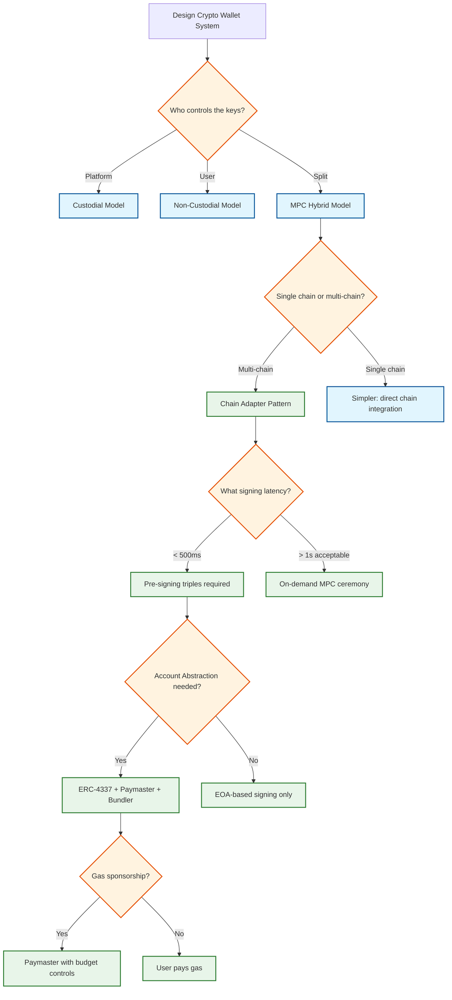

# Interview Guide

## Interview Pacing (45-Minute Format)

| Time | Phase | Focus | Key Points |
|------|-------|-------|------------|
| 0--5 min | **Clarify** | Scope the problem | Custodial vs. non-custodial? Retail vs. institutional? Which chains? What scale? |
| 5--15 min | **High-Level** | Core architecture | MPC key management, signing flow, multi-chain adapter pattern, policy engine |
| 15--30 min | **Deep Dive** | 1--2 critical components | MPC signing ceremony OR Account Abstraction pipeline OR nonce management |
| 30--40 min | **Scale & Trade-offs** | Bottlenecks, failure scenarios | HSM throughput, pre-signing optimization, key recovery, multi-region signing |
| 40--45 min | **Wrap Up** | Security, compliance, summary | Travel Rule, custody licensing, audit trail, key lifecycle |

---

## Meta-Commentary

### How to Approach This Problem

1. **Start with trust model, not architecture**: The first decision is who controls the keys. This single choice (custodial vs. non-custodial vs. MPC hybrid) determines the entire security architecture, recovery model, and regulatory posture. Make this explicit.

2. **Distinguish wallet from account**: A wallet manages keys; an account is an address on a blockchain. One wallet can derive many accounts across many chains. Do not conflate key management with balance tracking.

3. **MPC is the core novelty**: If the interviewer asks about a crypto wallet, they likely want to hear about MPC/TSS, not just "store private key in HSM." Show understanding of threshold cryptography, DKG, and why key shares never reconstruct.

4. **Account Abstraction is the modern layer**: Show awareness of ERC-4337 (smart contract wallets, Paymasters, Bundlers) as the UX evolution beyond EOA-based wallets. This demonstrates current knowledge.

5. **Multi-chain is not optional**: A wallet that only supports Ethereum is a toy. Address the challenge of heterogeneous signing algorithms, different nonce models, and chain-specific fee estimation.

### What Makes This System Unique/Challenging

- **Key material is the product**: Unlike most systems where data can be re-generated or restored from backups, losing a private key means permanent, irrecoverable loss of assets. The durability requirement for key material is higher than any other system.
- **Cryptographic protocol correctness**: A bug in MPC implementation is not just a software bug---it is a potential theft vector. The signing protocol must be formally verified or at minimum extensively audited.
- **Heterogeneous blockchain support**: Each chain has different transaction models (account vs. UTXO), signing algorithms, fee mechanisms, and finality guarantees. The system must abstract these differences while preserving chain-specific optimizations.
- **Regulatory asymmetry**: The same wallet system may be custodial (regulated as a financial institution) in one jurisdiction and non-custodial (unregulated) in another. Architecture must support both modes simultaneously.

### Where to Spend Most Time

| If Interviewer Focuses On... | Deep Dive Into... |
|------------------------------|-------------------|
| Security | MPC protocol, key share isolation, TEE/HSM, attack trees |
| Scalability | Pre-signing optimization, HSM throughput, nonce management, multi-chain scaling |
| UX/Product | Account Abstraction, gas sponsorship, passkey auth, social recovery |
| Distributed Systems | MPC ceremony coordination, nonce consensus, key refresh protocol |
| Compliance | Travel Rule, custody licensing, audit trail, KYC/AML integration |

---

## Trade-offs Discussion

### Trade-off 1: MPC vs. Multi-Signature

| Factor | MPC-TSS | On-Chain Multi-Sig |
|--------|---------|-------------------|
| **Pros** | Single on-chain address (privacy); no multi-sig contract deployment cost; works on any chain (protocol-level, not smart-contract-level); threshold change doesn't require on-chain tx | Simpler cryptography; on-chain transparency; battle-tested (Safe has $100B+ secured) |
| **Cons** | Complex cryptography; interactive protocol (latency); pre-signing overhead; harder to audit | Requires smart contract per chain; gas cost for multi-party approval; on-chain visibility of signers |
| **Recommendation** | Use MPC-TSS for multi-chain key management (works universally); use on-chain multi-sig as an additional policy layer for high-value operations on smart contract chains |

### Trade-off 2: TEE vs. HSM for Key Operations

| Factor | TEE (SGX/TrustZone) | HSM (FIPS 140-2 L3) |
|--------|---------------------|---------------------|
| **Pros** | Software-scalable; lower cost; faster operations (10K+ ops/sec); programmable enclave logic | Hardware tamper-proof; FIPS certified; regulatory acceptance; physically isolated |
| **Cons** | Side-channel attacks (Spectre, Foreshadow); attestation complexity; Intel SGX deprecation concerns | Expensive ($50K+/module); limited throughput (1--5K ops/sec); vendor lock-in; cannot run arbitrary code |
| **Recommendation** | Hybrid: TEE for MPC computation and transient key share operations; HSM for root key storage and key share encryption/decryption. HSM provides the compliance stamp; TEE provides the performance |

### Trade-off 3: Custodial vs. Non-Custodial vs. Hybrid

| Factor | Custodial | Non-Custodial | Hybrid MPC |
|--------|-----------|---------------|-----------|
| **Pros** | Simplest UX; institutional compliance; account recovery by support team | Maximum security (user controls keys); no platform risk; censorship-resistant | Best of both: no single point of compromise OR loss; recovery possible; institutional-grade |
| **Cons** | Single point of failure (platform breach = all funds); regulatory burden; user trust required | Seed phrase management; no recovery if lost; poor UX for mainstream users | MPC complexity; latency overhead; protocol-level bugs are critical |
| **Recommendation** | Hybrid MPC as default for retail and institutional; custodial as a specific product for exchange-like use cases; non-custodial for hardware wallet integration |

### Trade-off 4: Pre-Signing vs. On-Demand Signing

| Factor | Pre-Signing (Offline Triples) | On-Demand (Full Ceremony) |
|--------|-------------------------------|--------------------------|
| **Pros** | < 200ms online signing; latency-predictable; better UX | Simpler architecture; no triple management; no stale-triple risk |
| **Cons** | Storage for triples; background pre-signing jobs; triple exhaustion risk; wasted triples for inactive wallets | 1--3s signing latency; interactive multi-round protocol on critical path |
| **Recommendation** | Pre-signing for high-volume wallets (exchanges, payment processors); on-demand for low-volume wallets (personal wallets with < 10 txns/day). Adaptive: auto-switch based on observed usage pattern |

### Trade-off 5: Single-Chain Nonce Manager vs. Global Nonce Service

| Factor | Per-Chain Nonce Manager | Global Nonce Service |
|--------|------------------------|---------------------|
| **Pros** | Simple; chain-specific logic isolated; failure blast radius limited to one chain | Unified nonce tracking; simpler operational model; single monitoring point |
| **Cons** | Multiple services to operate; inconsistent behavior across chains | Cross-chain coupling; single point of failure; harder to optimize per chain |
| **Recommendation** | Per-chain nonce management: Bitcoin UTXO selection is fundamentally different from EVM nonce increment and Solana blockhash. Forcing them into one service creates artificial coupling |

---

## Trap Questions & How to Handle

| Trap Question | What Interviewer Wants | Best Answer |
|---------------|------------------------|-------------|
| "Why not just store the private key encrypted in a database?" | Understand MPC value proposition | "That creates a single point of compromise. If the DB encryption key is leaked, all keys are exposed simultaneously. MPC distributes trust: even a complete server breach yields only one key share, which is useless alone." |
| "Can you just use a multi-sig smart contract instead of MPC?" | Understand MPC vs. multi-sig trade-offs | "Multi-sig works for smart-contract chains but not for Bitcoin or other non-smart-contract chains. MPC operates at the cryptographic protocol level, producing a standard single-sig transaction on any chain. Also, multi-sig reveals the governance structure on-chain." |
| "What happens if one MPC signer node is compromised?" | Test security depth | "With 2-of-3 threshold, one compromised node cannot sign alone. We immediately detect anomalous access, initiate key refresh to rotate all shares (invalidating the compromised share), and the new share distribution excludes the compromised node until it's re-provisioned." |
| "How do you handle a user who loses their device?" | Test recovery understanding | "In MPC 2-of-3: the platform server share + backup enclave share can initiate key refresh, generating a new user share on the user's new device. For AA wallets: social recovery via guardians can rotate the owner key on-chain. Neither path requires the original device." |
| "Why not use blockchain for everything—balances, history, etc.?" | Understand off-chain vs. on-chain trade-offs | "Blockchain is the source of truth, but querying it directly for every balance check is too slow (100--500ms per RPC call). We index chain data into an off-chain store with 5--10s TTL caching, serving 95%+ of reads from cache. The chain is the authoritative source, not the serving layer." |
| "How would you handle 100x the current signing volume?" | Forward thinking about scaling | "Three levers: (1) pre-signing triples eliminate interactive rounds, so online signing is mostly CPU-bound combination, (2) HSM pool expansion with TEE offloading for computation, and (3) parallel signing across wallet partitions since there's no cross-wallet coordination." |

---

## Common Mistakes to Avoid

1. **Treating crypto wallets like traditional wallets**: A crypto wallet holds keys, not money. The "money" is always on the blockchain. This distinction matters for architecture: the wallet system needs zero custody of funds in the non-custodial model.

2. **Ignoring the MPC ceremony latency budget**: Interactive MPC protocols require multiple network round-trips between signer nodes. Placing nodes in different continents adds 200--400ms per round. Pre-signing is not optional for production latency targets.

3. **Conflating nonce management across chains**: Ethereum's sequential account nonce, Bitcoin's UTXO model, and Solana's blockhash-based freshness are fundamentally different. A single "nonce service" that treats them identically will fail.

4. **Underestimating key lifecycle complexity**: Key creation is the easy part. Key refresh (rotating shares without changing the public key), key recovery (guardian-based social recovery), and key migration (moving between custody models) are where the real complexity lives.

5. **Forgetting that transactions are irreversible**: Unlike traditional payment systems with chargeback mechanisms, blockchain transactions cannot be reversed. Every safety check (policy evaluation, address verification, simulation) must happen BEFORE signing, not after.

6. **Over-engineering multi-chain from day one**: Support 3--5 high-value chains well before attempting 50+. Each new chain adds a unique adapter, node infrastructure, fee model, and finality guarantee. Chain count scales linearly but operational complexity scales super-linearly.

7. **Ignoring gas economics**: Gas sponsorship via Paymasters is not free. A poorly designed sponsorship policy can drain the Paymaster contract in hours. Budget controls, per-user limits, and fraud detection on sponsored gas are essential.

---

## Questions to Ask Interviewer

| Question | Why It Matters |
|----------|---------------|
| "Is this for retail users or institutional custody?" | Determines whether MPC complexity is justified; institutional needs policy engines and multi-approval |
| "Which blockchains must be supported?" | Determines signing algorithm diversity and nonce management complexity |
| "What's the expected signing volume?" | Determines whether pre-signing optimization is necessary |
| "Is gas sponsorship required?" | If yes, must design Paymaster infrastructure and budget controls |
| "What custody regulations apply?" | Determines Travel Rule integration, SOC 2 requirements, segregation needs |
| "Should the wallet support account abstraction (ERC-4337)?" | Determines whether smart account infrastructure is in scope |
| "Is hardware wallet (Ledger/Trezor) integration required?" | Adds WalletConnect integration and device-specific signing flows |
| "What's the recovery model?" | Social recovery, backup shares, or support-assisted recovery change the architecture significantly |

---

## Advanced Discussion Topics

### Topic 1: Chain Abstraction and Universal Accounts

**Context:** As the number of supported chains grows beyond 50, managing separate addresses, balances, and nonces per chain becomes a UX nightmare. Chain abstraction aims to present a single "universal account" that operates seamlessly across all chains.

**Key Concepts to Discuss:**
- **Unified address derivation**: Single master key derives chain-specific addresses via HD paths (BIP-44), but the user sees one "identity" across all chains
- **Intent-based transactions**: User expresses "swap token X on chain A for token Y on chain B" without specifying bridge routes, gas tokens, or intermediate steps
- **Solver network**: Decentralized network of solvers that compete to fulfill cross-chain intents at the best price; wallet submits intent, solver executes
- **Cross-chain gas abstraction**: Pay gas on any chain using any token; a settlement layer reconciles gas debts across chains

**Architecture Impact:** The wallet system needs an intent parser, a solver routing layer, and a cross-chain settlement service---adding three new components to the existing architecture.

### Topic 2: Modular Smart Accounts (ERC-7579)

**Context:** ERC-7579 standardizes how smart accounts install and manage modules---pluggable extensions that add capabilities (session keys, spending limits, recovery, 2FA). This transforms the wallet from a monolithic smart contract into a modular platform.

**Key Concepts to Discuss:**
- **Module types**: Validators (custom auth logic), Executors (automated actions), Hooks (pre/post-transaction checks), Fallbacks (default handlers)
- **Composability**: A single smart account can stack multiple modules---e.g., passkey validator + spending limit hook + guardian recovery module
- **Security model**: Each module is audited independently; the account's `installModule()` function enforces access control on who can add/remove modules
- **Cross-chain module portability**: Same module deployed on multiple EVM chains; wallet tracks module state per chain

### Topic 3: MEV Protection for Wallet Users

**Context:** Maximal Extractable Value (MEV) attacks---sandwich attacks, front-running, back-running---can cost wallet users significant value on every DeFi transaction.

**Key Concepts to Discuss:**
- **Private mempool submission**: Submit transactions via MEV protection services (private relays) that hide transactions from public mempool searchers
- **Simulation before signing**: Simulate transaction outcome off-chain; show user expected results; reject if simulation shows unexpected value extraction
- **Slippage guards**: Enforce maximum slippage tolerance in the transaction itself (not just in the UI); revert if execution price deviates
- **Batch auctions**: Aggregate multiple user transactions into a batch that executes atomically, preventing inter-transaction MEV extraction

### Topic 4: Wallet-as-Infrastructure (WaaS) Platform Design

**Context:** Many wallet providers operate as Wallet-as-a-Service platforms, where dApps embed wallet functionality via SDK rather than users downloading a standalone wallet app.

**Key Concepts to Discuss:**
- **Embedded wallet SDK**: dApp integrates wallet creation, signing, and key management via JavaScript SDK; user never leaves the dApp
- **Delegated signing with session keys**: After initial authentication, the dApp receives a scoped session key that can sign transactions within predefined limits (amount, contract, duration) without requiring the user's biometric for each action
- **White-label custody**: The wallet provider manages key shares and MPC infrastructure; the dApp's brand is the user-facing identity
- **Multi-tenant isolation**: A single wallet platform serves thousands of dApps; each dApp has isolated key spaces, policies, and billing

---

## Case Studies

### Case Study 1: Institutional Custody Migration

**Scenario:** A $5B asset management firm migrating from hardware wallet-based custody (Ledger Vault) to MPC-based custody for 200 institutional wallets controlling assets across 8 chains.

**Challenges:**
- Address continuity: cannot change on-chain addresses (would require moving all assets)
- Zero signing downtime during migration
- Regulatory audit trail must be continuous across custody models
- Staff training on new approval workflows

**Solution Architecture:**
1. Deploy MPC infrastructure in parallel with existing HSM custody
2. For each wallet: generate MPC key shares from the existing private key (key import ceremony under dual control in air-gapped room)
3. Verify MPC-signed test transactions match original key's address
4. Cut over signing to MPC path; decommission HSM keys after 30-day parallel operation
5. Maintain complete audit trail linking old custody events to new MPC events

**Key Lesson:** Migration is the hardest operation in custody. The 30-day parallel operation period is essential for building confidence before decommissioning the legacy system.

### Case Study 2: Gas Sponsorship Budget Drain Attack

**Scenario:** A wallet platform offering gas sponsorship was exploited by a bot network that created 50,000 wallets and submitted sponsored transactions to drain the Paymaster deposit ($200K lost in 4 hours).

**Root Cause:** Per-user gas limits were enforced on the API layer but not in the Paymaster contract itself. The attacker bypassed the API and submitted UserOperations directly to the bundler's public mempool.

**Mitigation Applied:**
1. **On-chain budget enforcement**: Paymaster contract enforces per-user daily limits (not just API-layer limits)
2. **Allowlisted entry points**: Paymaster only accepts UserOps from authorized bundlers, not public mempool
3. **Progressive sponsorship**: New accounts receive minimal sponsorship ($1/day); increases based on account age and activity
4. **Anomaly detection**: ML model flags accounts with sponsorship patterns diverging from legitimate users (e.g., repeated low-value transfers to self)

### Case Study 3: Multi-Chain Nonce Incident

**Scenario:** During a period of Ethereum network congestion, a wallet platform's nonce manager accumulated 500+ stuck transactions across 50 hot wallet addresses because gap-filling transactions were also stuck due to low gas prices.

**Root Cause:** The gap-filling mechanism used the same gas price as the original transaction. During congestion, neither the original nor the filler transactions were included in blocks, creating a cascading backlog.

**Resolution:**
1. Implemented aggressive gas price escalation for filler transactions (start at 2x current base fee)
2. Added a "nonce reset" emergency procedure: cancel all pending transactions for an address by submitting a zero-value self-transfer at the earliest gap nonce with 10x gas price
3. Partitioned hot wallet addresses into priority tiers: high-priority addresses get aggressive gas pricing; low-priority addresses queue during congestion

---

## Scoring Rubric (What Interviewers Look For)

| Dimension | Junior (Misses) | Senior (Covers) | Staff+ (Excels) |
|-----------|-----------------|-----------------|------------------|
| **Key Management** | "Store encrypted private key in database" | Describes MPC-TSS, explains threshold signing | Discusses DKG protocol, pre-signing optimization, key refresh lifecycle |
| **Security Model** | Single key in HSM | MPC share distribution across trust domains | TEE + HSM layering, attack tree analysis, insider threat mitigation |
| **Multi-Chain** | Assumes all chains are EVM | Mentions Bitcoin UTXO vs. EVM account model | Designs chain adapter pattern; discusses signing algorithm differences (ECDSA vs. EdDSA vs. BLS) |
| **Account Abstraction** | Not mentioned | Describes ERC-4337 basics (UserOp, Bundler, Paymaster) | Designs gas sponsorship budget system; discusses passkey integration for P256 signatures |
| **Failure Handling** | "Retry on failure" | Describes nonce gap handling, MPC node failure recovery | Designs key recovery procedures, discusses chain reorg impact, policy-during-signing race condition |
| **Scale** | "Add more servers" | Discusses pre-signing, HSM pools, caching layers | Designs partitioned nonce manager, adaptive pre-signing pools, per-chain scaling strategy |
| **Modern Features** | Not mentioned or "use MetaMask" | Describes EIP-7702, passkeys, chain abstraction | Designs dual-authorization for 7702, modular smart accounts (ERC-7579), cross-chain intent system |

---

## Estimation Practice

### Quick Math: How Many HSMs Do We Need?

**Given:**
- 10M daily signing operations
- Peak: 500 signing operations/second
- Each signing operation needs 1 HSM call (key share decryption)
- HSM throughput: 2,000 operations/second per module

**Calculation:**
- Minimum HSMs for peak load: 500 / 2,000 = 0.25 → 1 HSM
- But TEE handles MPC computation; HSM only decrypts shares
- Factor in HSM failure (N+2 redundancy): 1 + 2 = 3 HSMs minimum per region
- Factor in pre-signing triple generation (background load adds 30%): ceil(500 * 1.3 / 2,000) + 2 = 3 HSMs
- Two regions: 3 + 3 = **6 HSM modules total**
- At $50K per module: **$300K HSM infrastructure cost**

### Quick Math: Pre-Signing Storage Requirements

**Given:**
- 100M wallets, tiered by activity:
  - 80% inactive (0 triples): 80M wallets × 0 = 0
  - 15% retail (50 triples × 1 KB): 15M × 50 KB = 750 GB
  - 4% active (500 triples × 1 KB): 4M × 500 KB = 2 TB
  - 1% high-volume (5,000 triples × 1 KB): 1M × 5 MB = 5 TB

**Total pre-signing storage: ~7.75 TB** (encrypted, in TEE-accessible storage)
- Replenishment rate: ~100M triples/day consumed → 100M triples/day generated in background

### Quick Math: Gas Sponsorship Budget

**Given:**
- Target: 5M sponsored UserOps per day
- Average gas per UserOp: 200,000 gas units
- Average gas price: 20 gwei (0.00000002 ETH)
- ETH price: $4,000

**Calculation:**
- Gas per UserOp in ETH: 200,000 × 0.00000002 = 0.004 ETH
- Gas per UserOp in USD: 0.004 × $4,000 = $16
- Daily budget: 5M × $16 = **$80M per day** (too expensive to sponsor everything)
- Realistic: Sponsor verification gas only (~30,000 units): $2.40/UserOp → $12M/day
- Further: Sponsor only for first 5 txns/user/day on L2 (10x cheaper gas): ~**$1.2M/day**

---

## Architecture Decision Flowchart

