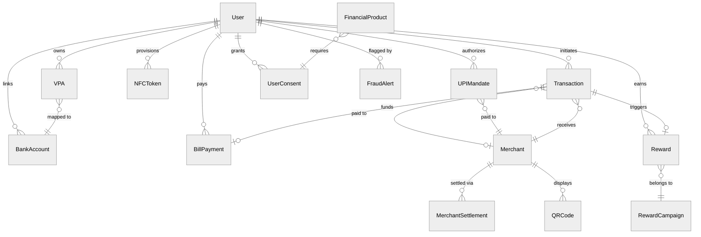
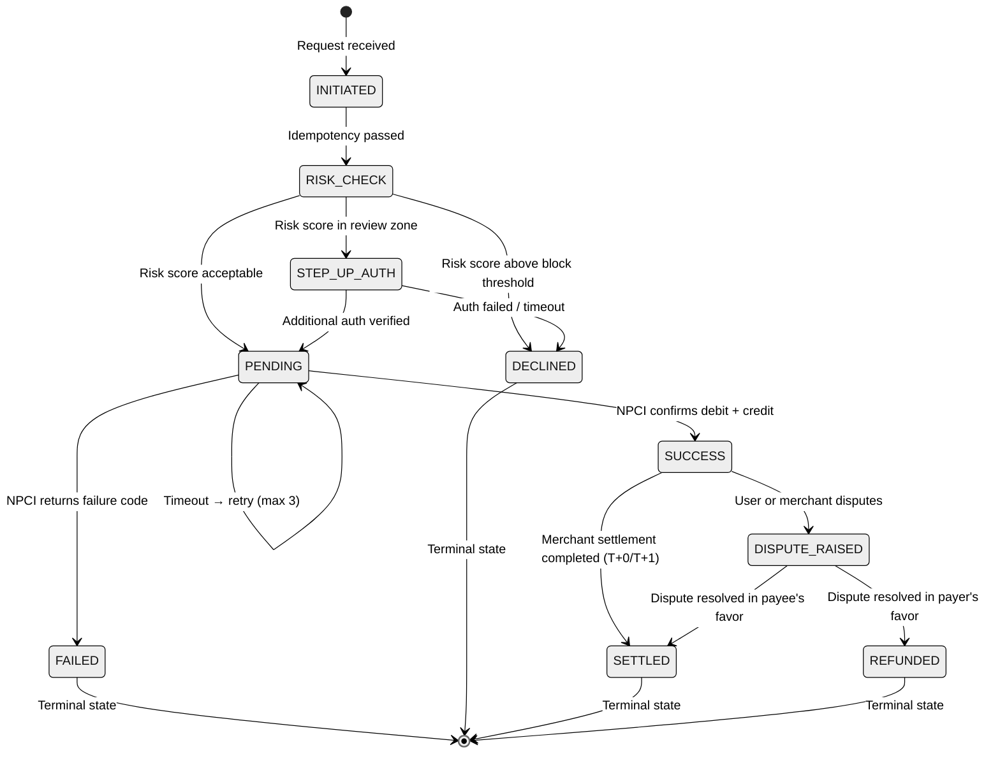

# Low-Level Design

## Data Models

```
User {
    user_id             UUID        PRIMARY KEY
    phone               STRING      UNIQUE, encrypted
    name                STRING      encrypted
    kyc_level           ENUM        (min_kyc, full_kyc, enhanced_kyc)
    device_fingerprint  STRING
    pin_hash            STRING      -- UPI PIN hash (never plaintext)
    status              ENUM        (active, suspended, blocked, closed)
    created_at          TIMESTAMP
}

VPA {
    vpa_id              UUID        PRIMARY KEY
    handle              STRING      UNIQUE   -- e.g., user@superapp
    user_id             UUID        FK -> User
    bank_account_id     UUID        FK -> BankAccount
    is_primary          BOOLEAN     DEFAULT false
    status              ENUM        (active, inactive, deregistered)
}

BankAccount {
    account_id          UUID        PRIMARY KEY
    user_id             UUID        FK -> User
    ifsc                STRING
    account_number_enc  STRING      -- AES-256 encrypted
    bank_name           STRING
    is_verified         BOOLEAN     DEFAULT false
    status              ENUM        (active, unlinked, frozen)
}

Transaction {
    txn_id              UUID        PRIMARY KEY
    upi_txn_id          STRING      UNIQUE        -- NPCI reference number
    payer_vpa           STRING
    payee_vpa           STRING
    amount              DECIMAL(12,2)
    currency            STRING      DEFAULT 'INR'
    type                ENUM        (P2P, P2M, BILL, NFC, MANDATE)
    status              ENUM        (initiated, pending, success, failed, refunded)
    risk_score          DECIMAL(4,3)
    merchant_id         UUID        FK -> Merchant (nullable)
    device_context      JSON        -- device_id, ip, geolocation, app_version
    initiated_at        TIMESTAMP
    completed_at        TIMESTAMP
    idempotency_key     STRING      UNIQUE
}

Merchant {
    merchant_id         UUID        PRIMARY KEY
    name                STRING
    category_code       STRING      -- MCC (Merchant Category Code)
    vpa                 STRING      UNIQUE
    settlement_account  JSON        encrypted
    qr_code_id          STRING      UNIQUE
    tier                ENUM        (micro, small, medium, large, enterprise)
    settlement_cycle    ENUM        (t0, t1, t2)
    status              ENUM        (onboarding, active, suspended, terminated)
}

BillPayment {
    bill_id             UUID        PRIMARY KEY
    user_id             UUID        FK -> User
    biller_id           STRING
    biller_category     ENUM        (electricity, water, gas, telecom, broadband, insurance)
    bill_amount         DECIMAL(12,2)
    bbps_txn_id         STRING      UNIQUE
    txn_id              UUID        FK -> Transaction
    status              ENUM        (bill_fetched, payment_initiated, payment_success, settled)
    due_date            DATE
    is_recurring        BOOLEAN     DEFAULT false
}

Reward {
    reward_id           UUID        PRIMARY KEY
    user_id             UUID        FK -> User
    txn_id              UUID        FK -> Transaction
    type                ENUM        (cashback, scratch_card, referral, merchant_offer)
    amount              DECIMAL(10,2)
    status              ENUM        (pending, credited, expired, reversed)
    campaign_id         UUID        FK -> RewardCampaign
    expires_at          TIMESTAMP
}

RewardCampaign {
    campaign_id         UUID        PRIMARY KEY
    name                STRING
    rules_json          JSON        -- min_amount, merchant_category, txn_type, frequency
    cashback_type       ENUM        (fixed, percentage, tiered)
    max_cashback        DECIMAL
    per_user_daily_limit DECIMAL
    budget_total        DECIMAL
    budget_consumed     DECIMAL     DEFAULT 0
    start_date          TIMESTAMP
    end_date            TIMESTAMP
    status              ENUM        (draft, active, paused, exhausted, expired)
}

MiniApp {
    app_id              UUID        PRIMARY KEY
    developer_id        UUID
    name                STRING
    category            ENUM        (finance, shopping, travel, food, utilities)
    sandbox_permissions JSON        -- [payments, user_profile, location]
    version             STRING
    status              ENUM        (review, approved, published, suspended, deprecated)
}

NFCToken {
    token_id            UUID        PRIMARY KEY
    user_id             UUID        FK -> User
    card_ref            STRING      -- tokenized card reference
    token_value_enc     STRING      -- encrypted, stored in secure element
    network             ENUM        (visa, mastercard, rupay)
    expiry              DATE
    device_id           STRING      -- bound to specific device
    max_offline_amount  DECIMAL
    status              ENUM        (provisioned, active, suspended, deleted)
}

UPIMandate {
    mandate_id          UUID        PRIMARY KEY
    user_id             UUID        FK -> User
    merchant_id         UUID        FK -> Merchant
    payer_vpa           STRING
    payee_vpa           STRING
    amount              DECIMAL(12,2)
    frequency           ENUM        (one_time, daily, weekly, monthly, quarterly, yearly)
    start_date          DATE
    end_date            DATE
    auto_execute        BOOLEAN     DEFAULT false   -- true = auto-debit on schedule
    max_amount          DECIMAL(12,2)               -- ceiling per execution
    revocation_allowed  BOOLEAN     DEFAULT true
    npci_mandate_ref    STRING      UNIQUE          -- NPCI mandate URN
    last_executed_at    TIMESTAMP
    next_execution_at   TIMESTAMP
    status              ENUM        (created, approved, active, paused, revoked, expired)
}

MerchantSettlement {
    settlement_id       UUID        PRIMARY KEY
    merchant_id         UUID        FK -> Merchant
    settlement_date     DATE
    gross_amount        DECIMAL(14,2)
    platform_fee        DECIMAL(12,2)
    gst_on_fee          DECIMAL(12,2)
    net_amount          DECIMAL(14,2)
    txn_count           INTEGER
    dispute_hold        DECIMAL(12,2)  -- withheld pending dispute resolution
    settlement_mode     ENUM        (neft, imps, rtgs)
    bank_ref            STRING         -- bank UTR for the settlement transfer
    status              ENUM        (pending, processing, settled, failed, partially_settled)
    settled_at          TIMESTAMP
}

FraudAlert {
    alert_id            UUID        PRIMARY KEY
    entity_type         ENUM        (user, merchant, device, vpa)
    entity_id           STRING
    alert_type          ENUM        (velocity_breach, geo_anomaly, device_clone, ring_detected,
                                     amount_anomaly, behavioral_shift, account_takeover)
    risk_score          DECIMAL(4,3)
    evidence_json       JSON        -- feature values that triggered the alert
    txn_ids             ARRAY<UUID> -- related transactions
    action_taken        ENUM        (none, flagged, blocked, escalated, resolved)
    resolved_by         STRING      -- analyst ID or "auto"
    created_at          TIMESTAMP
    resolved_at         TIMESTAMP
}

UserConsent {
    consent_id          UUID        PRIMARY KEY
    user_id             UUID        FK -> User
    consent_type        ENUM        (account_aggregator, data_sharing, marketing, mini_app)
    fip_id              STRING      -- Financial Information Provider (bank)
    fiu_id              STRING      -- Financial Information User (lender/insurer)
    data_categories     ARRAY<STRING> -- [deposit, credit_card, insurance, mutual_fund]
    purpose             STRING
    consent_start       TIMESTAMP
    consent_expiry      TIMESTAMP
    frequency           ENUM        (one_time, monthly, on_demand)
    fi_data_range       JSON        -- {from: "2024-01-01", to: "2026-03-01"}
    consent_handle      STRING      UNIQUE  -- AA ecosystem reference
    status              ENUM        (requested, approved, active, paused, revoked, expired)
}

FinancialProduct {
    product_id          UUID        PRIMARY KEY
    partner_id          UUID        -- lending/insurance/MF partner
    product_type        ENUM        (personal_loan, credit_line, insurance, mutual_fund, fixed_deposit)
    name                STRING
    description         TEXT
    eligibility_rules   JSON        -- min_age, min_income, credit_score_range
    interest_rate       DECIMAL(5,3)  -- nullable for non-loan products
    tenure_months       INTEGER
    max_amount          DECIMAL(14,2)
    commission_pct      DECIMAL(5,3)  -- platform commission
    status              ENUM        (draft, active, paused, discontinued)
}

QRCode {
    qr_id               UUID        PRIMARY KEY
    merchant_id          UUID        FK -> Merchant
    qr_type              ENUM        (static, dynamic)
    vpa                  STRING      -- embedded payee VPA
    amount               DECIMAL(12,2)  -- NULL for static QR
    description          STRING
    signature            STRING      -- digital signature for tamper detection
    deep_link            STRING      -- UPI deep link URI
    created_at           TIMESTAMP
    expires_at           TIMESTAMP   -- NULL for static QR
    scan_count           INTEGER     DEFAULT 0
}
```

---

## Entity-Relationship Diagram



---

## Indexing Strategy

| Entity | Index | Purpose |
|--------|-------|---------|
| Transaction | `(payer_vpa, created_at DESC)` | User passbook / transaction history |
| Transaction | `(upi_txn_id)` UNIQUE | NPCI dedup and reconciliation |
| Transaction | `(merchant_id, created_at DESC)` | Merchant reports and analytics |
| Transaction | `(idempotency_key)` UNIQUE | Prevent duplicate processing |
| VPA | `(handle)` UNIQUE | VPA resolution (most frequent lookup) |
| VPA | `(user_id)` | Multi-VPA management per user |
| BillPayment | `(user_id, biller_category)` | User bills grouped by type |
| BillPayment | `(bbps_txn_id)` UNIQUE | BBPS reconciliation |
| Reward | `(user_id, status)` | Active rewards balance query |
| Reward | `(campaign_id, status)` | Budget tracking per campaign |
| NFCToken | `(device_id, status)` | Token lookup during NFC tap |
| UPIMandate | `(user_id, status)` | Active mandates per user |
| UPIMandate | `(npci_mandate_ref)` UNIQUE | NPCI reconciliation |
| UPIMandate | `(merchant_id, next_execution_at)` | Scheduled execution lookup |
| MerchantSettlement | `(merchant_id, settlement_date DESC)` | Merchant settlement history |
| MerchantSettlement | `(status, settlement_date)` | Failed settlement retry |
| FraudAlert | `(entity_type, entity_id, created_at DESC)` | Alert lookup per entity |
| FraudAlert | `(action_taken, created_at DESC)` | Pending review queue |
| UserConsent | `(user_id, consent_type, status)` | Active consents per user |
| UserConsent | `(consent_handle)` UNIQUE | AA ecosystem correlation |
| QRCode | `(merchant_id, qr_type)` | Merchant QR management |

## Partitioning Strategy

| Entity | Strategy | Rationale |
|--------|----------|-----------|
| Transaction | Range by month + hash by user_id within month | Reconciliation is monthly; user-level hash distributes shard load evenly |
| User | Hash by user_id | Uniform distribution; co-locates VPA and BankAccount lookups |
| Merchant | Hash by merchant_id | Point lookups by ID or VPA; even distribution |
| Reward | Range by created_at (monthly) | Expired rewards archived; budget queries scoped to active window |
| BillPayment | Range by paid_at (monthly) | Settlement reconciliation is date-scoped |
| UPIMandate | Hash by user_id | Co-located with user's transactions for mandate execution |
| MerchantSettlement | Range by settlement_date (daily) | Settlement jobs process by date; natural partition |
| FraudAlert | Range by created_at (weekly) | Investigation queries are time-bounded; old alerts archived |
| UserConsent | Hash by user_id | Co-located with user profile for consent checks |
| QRCode | Hash by merchant_id | Co-located with merchant data for QR operations |

---

## API Design

### 1. POST /api/v1/upi/pay -- Initiate UPI Payment

```
Headers: Authorization: Bearer <token>, X-Idempotency-Key
Rate Limit: 10 txns/min per user

Request: { payer_vpa, payee_vpa, amount, currency, remarks, txn_type, device_context }
Response: { txn_id, upi_ref, status, amount, timestamp, reward_hint }
Failure:  { txn_id, status: "failed", failure_code, failure_reason }

Idempotency: X-Idempotency-Key as dedup key; repeats within 24h return cached response.
```

### 2. POST /api/v1/bills/fetch -- Fetch Bill Details

```
Request: { biller_id, customer_identifier, biller_category }
Response: { bill_amount, due_date, bill_number, biller_name, partial_pay_allowed }
```

### 3. POST /api/v1/nfc/tap -- Process NFC Tap Payment

```
Headers: Authorization: Bearer <device_token>, X-Terminal-ID
Latency SLO: < 500ms

Request: { token_id, terminal_id, amount, merchant_id, cryptogram }
Response: { txn_id, auth_code, status, network, timestamp }
```

### 4. POST /api/v1/mandate/create -- Create UPI Mandate

```
Headers: Authorization: Bearer <token>, X-Idempotency-Key
Rate Limit: 5 mandates/day per user

Request: {
    payer_vpa, payee_vpa, amount, max_amount, frequency,
    start_date, end_date, auto_execute, description
}
Response: {
    mandate_id, npci_mandate_ref, status: "created",
    approval_deeplink   -- user must approve via bank app
}

Flow: Creates mandate record → submits to NPCI → returns approval deep link.
User must authenticate with bank to activate. Mandate becomes ACTIVE only after bank confirmation callback.
```

### 5. POST /api/v1/mandate/revoke -- Revoke Active Mandate

```
Request: { mandate_id }
Response: { mandate_id, status: "revoked", revoked_at }

Preconditions: Mandate status must be ACTIVE or PAUSED.
Side effects: Cancels all scheduled future executions; notifies merchant via webhook.
```

### 6. POST /api/v1/settlement/trigger -- Trigger Merchant Settlement

```
Headers: Authorization: Bearer <service_token> (internal only)

Request: {
    settlement_date, merchant_ids (optional -- null means all eligible),
    settlement_mode (neft/imps/rtgs)
}
Response: {
    batch_id, merchant_count, total_gross, total_net,
    estimated_completion_time
}

Note: Typically invoked by the settlement scheduler at daily cutoff.
Can be triggered manually for re-processing failed batches.
```

### 7. POST /api/v1/consent/create -- Initiate Account Aggregator Consent

```
Request: {
    fip_id, data_categories, purpose,
    consent_duration_months, fi_data_range, frequency
}
Response: {
    consent_id, consent_handle, redirect_url,
    status: "requested"
}

Flow: Creates consent artifact → submits to AA ecosystem → returns redirect URL.
User authenticates with FIP (bank) to approve consent.
AA callback updates consent status to ACTIVE.
```

### 8. Additional Endpoints

| Endpoint | Method | Key Fields |
|----------|--------|------------|
| `/api/v1/rewards/balance` | GET | Response: total_earned, available, pending, scratch_cards, expiring_soon |
| `/api/v1/merchant/qr/generate` | POST | Request: merchant_id, qr_type, amount. Response: qr_id, qr_data (UPI deep link), signature |
| `/api/v1/merchant/qr/verify` | POST | Request: qr_data, signature. Response: verified, merchant_name, amount, vpa |
| `/api/v1/transactions/history` | GET | Cursor-based pagination, reads from CQRS view. Filters: type, date range |
| `/api/v1/miniapp/launch` | POST | Request: app_id. Response: session_id, bundle_url, sandbox_config |
| `/api/v1/mandate/list` | GET | Request: user_id, status filter. Response: paginated mandate list |
| `/api/v1/mandate/execute` | POST | Internal: scheduled execution of auto-debit mandates |
| `/api/v1/settlement/status` | GET | Request: batch_id or merchant_id + date. Response: settlement details |
| `/api/v1/consent/status` | GET | Request: consent_id. Response: consent details, data fetch history |
| `/api/v1/consent/revoke` | POST | Request: consent_id. Response: revoked status, downstream notification sent |
| `/api/v1/financial/products` | GET | Request: user_id, product_type. Response: eligible products based on consent data |
| `/api/v1/fraud/alert/review` | POST | Internal: analyst reviews alert, takes action (block/clear/escalate) |

---

## Core Algorithms

### 1. UPI Transaction Routing

```
FUNCTION routeUPITransaction(txnRequest):
    -- Step 1: Idempotency check
    existing = lookupByIdempotencyKey(txnRequest.idempotencyKey)
    IF existing: RETURN existing.response

    -- Step 2: Resolve VPA to bank account
    payerBank = resolveVPA(txnRequest.payerVPA)
    payeeBank = resolveVPA(txnRequest.payeeVPA)
    IF NOT payerBank OR NOT payeeBank:
        RETURN {status: "FAILED", reason: "vpa_resolution_failed"}

    -- Step 3: Parallel risk assessment
    riskScore = PARALLEL:
        deviceRisk   = checkDeviceFingerprint(txnRequest.deviceContext)
        behaviorRisk = checkBehavioralPattern(txnRequest.payerVPA, txnRequest.amount)
        velocityRisk = checkVelocityLimits(txnRequest.payerVPA)
        geoRisk      = checkGeoAnomaly(txnRequest.deviceContext.geo)
        RETURN weightedScore(device=0.3, behavior=0.3, velocity=0.25, geo=0.15)

    IF riskScore > THRESHOLD_BLOCK:
        RETURN {status: "DECLINED", reason: "risk_check_failed"}
    IF riskScore > THRESHOLD_STEP_UP:
        requireAdditionalAuth(txnRequest)

    -- Step 4: Route through NPCI
    npciRequest = buildCollectRequest(payerBank, payeeBank, txnRequest)
    response = npciSwitch.send(npciRequest, timeout=1500ms)
    persistTransaction(txnRequest, response, riskScore)

    -- Step 5: Async post-processing
    ASYNC:
        evaluateRewards(txnRequest, response)
        sendNotifications(txnRequest.payerVPA, txnRequest.payeeVPA, response)
        publishToEventStore(txnRequest, response, riskScore)

    RETURN response
```

### 2. Cashback Budget Enforcement

```
FUNCTION evaluateCashback(txn, userId):
    activeCampaigns = cache.getOrLoad("active_campaigns", TTL=60s,
        loader = db.query("SELECT * FROM RewardCampaign WHERE status='active' AND NOW() BETWEEN start_date AND end_date"))

    FOR campaign IN activeCampaigns:
        IF NOT matchesRules(txn, campaign.rules_json): CONTINUE

        cashbackAmount = MIN(computeCashback(txn.amount, campaign), campaign.max_cashback)

        -- Atomic budget decrement (distributed counter)
        remaining = atomicDecrement(campaign.budgetKey, cashbackAmount)
        IF remaining < 0:
            atomicIncrement(campaign.budgetKey, cashbackAmount)
            CONTINUE

        -- Per-user limit checks
        userDaily = getCounter(userId + ":" + campaign.id + ":daily")
        IF userDaily + cashbackAmount > campaign.per_user_daily_limit:
            atomicIncrement(campaign.budgetKey, cashbackAmount)
            CONTINUE

        -- Credit reward
        reward = createReward(userId, txn.txn_id, cashbackAmount, campaign.id)
        incrementCounter(userId + ":" + campaign.id + ":daily", cashbackAmount, TTL=endOfDay())
        RETURN {eligible: true, amount: cashbackAmount, reward_id: reward.id}

    RETURN {eligible: false, reason: "no_matching_campaign"}
```

### 3. VPA Resolution with Multi-Level Cache

```
FUNCTION resolveVPA(vpaHandle):
    -- L1: Local in-process cache (10s TTL)
    cached = localCache.get(vpaHandle)
    IF cached: RETURN cached

    -- L2: Distributed cache (5min TTL)
    cached = distributedCache.get("vpa:" + vpaHandle)
    IF cached:
        localCache.set(vpaHandle, cached, TTL=10s)
        RETURN cached

    -- L3: Own database
    account = db.query("SELECT bank_account_id, ifsc FROM vpa_mapping WHERE handle = ? AND status = 'active'", vpaHandle)
    IF account:
        distributedCache.set("vpa:" + vpaHandle, account, TTL=300s)
        localCache.set(vpaHandle, account, TTL=10s)
        RETURN account

    -- L4: NPCI lookup (cross-app VPA)
    account = npciSwitch.resolveVPA(vpaHandle, timeout=500ms)
    IF account:
        distributedCache.set("vpa:" + vpaHandle, account, TTL=60s)  -- shorter for external
        localCache.set(vpaHandle, account, TTL=10s)
    RETURN account

FUNCTION invalidateVPA(vpaHandle):
    localCache.delete(vpaHandle)
    distributedCache.delete("vpa:" + vpaHandle)
    publishEvent("vpa_invalidated", vpaHandle)  -- peer instances clear L1
```

### 4. NFC Token Provisioning and Lifecycle

```
FUNCTION provisionNFCToken(userId, cardRef, network):
    -- Step 1: Validate device capability
    device = getDeviceContext(userId)
    IF NOT device.hasSecureElement AND NOT device.hasTEE:
        RETURN {status: "UNSUPPORTED", reason: "device_lacks_secure_storage"}

    -- Step 2: Request token from card network
    tokenRequest = {
        card_ref: cardRef,
        device_id: device.id,
        device_attestation: device.attestationToken,
        network: network
    }
    tokenResponse = cardNetworkAPI.requestToken(tokenRequest, timeout=5000ms)
    IF tokenResponse.status != "PROVISIONED":
        RETURN {status: "FAILED", reason: tokenResponse.error}

    -- Step 3: Store token securely on device
    nfcToken = NFCToken{
        token_id: generateUUID(),
        user_id: userId,
        card_ref: cardRef,
        token_value_enc: encrypt(tokenResponse.token, device.publicKey),
        network: network,
        expiry: tokenResponse.expiry,
        device_id: device.id,
        max_offline_amount: determineOfflineLimit(network, device.trustScore),
        status: "active"
    }
    db.insert(nfcToken)
    pushTokenToDevice(device.id, nfcToken)

    -- Step 4: Pre-compute initial batch of offline cryptograms
    cryptograms = preComputeCryptograms(nfcToken, count=10)
    pushCryptogramsToDevice(device.id, cryptograms)

    RETURN {status: "SUCCESS", token_id: nfcToken.token_id}

FUNCTION refreshNFCToken(tokenId):
    token = db.get(tokenId)
    IF token.expiry < NOW() + 7_DAYS:
        newToken = cardNetworkAPI.renewToken(token.card_ref, token.device_id)
        token.token_value_enc = encrypt(newToken.token, getDevicePublicKey(token.device_id))
        token.expiry = newToken.expiry
        db.update(token)
        pushTokenToDevice(token.device_id, token)
    -- Always refresh cryptograms
    remaining = countRemainingCryptograms(token.device_id, tokenId)
    IF remaining < 3:
        newCryptograms = preComputeCryptograms(token, count=10)
        pushCryptogramsToDevice(token.device_id, newCryptograms)
```

### 5. Merchant Settlement Batch Processing

```
FUNCTION processSettlementBatch(settlementDate, merchantIds):
    -- Step 1: Snapshot transactions at cutoff
    cutoffTimestamp = settlementDate + "T23:59:59.999Z"
    IF merchantIds IS NULL:
        merchantIds = db.query("SELECT DISTINCT merchant_id FROM Transaction
                                WHERE status = 'SUCCESS' AND settled = false
                                AND completed_at <= ?", cutoffTimestamp)

    batchResults = []

    FOR merchantId IN merchantIds:
        -- Step 2: Aggregate transactions
        txns = db.query("SELECT * FROM Transaction
                         WHERE merchant_id = ? AND status = 'SUCCESS'
                         AND settled = false AND completed_at <= ?",
                         merchantId, cutoffTimestamp)

        grossAmount = SUM(txn.amount FOR txn IN txns)
        disputeHold = computeDisputeHold(merchantId, grossAmount)
        platformFee = computePlatformFee(merchantId, grossAmount, txns.length)
        gst = platformFee * 0.18
        netAmount = grossAmount - platformFee - gst - disputeHold

        -- Step 3: Create settlement record
        settlement = MerchantSettlement{
            settlement_id: generateUUID(),
            merchant_id: merchantId,
            settlement_date: settlementDate,
            gross_amount: grossAmount,
            platform_fee: platformFee,
            gst_on_fee: gst,
            net_amount: netAmount,
            txn_count: txns.length,
            dispute_hold: disputeHold,
            settlement_mode: determineSettlementMode(netAmount),
            status: "pending"
        }
        db.insert(settlement)

        -- Step 4: Initiate bank transfer
        transferResult = bankAPI.transfer({
            beneficiary: getMerchantBankDetails(merchantId),
            amount: netAmount,
            reference: settlement.settlement_id,
            mode: settlement.settlement_mode
        })

        IF transferResult.status == "SUCCESS":
            settlement.status = "settled"
            settlement.bank_ref = transferResult.utr
            settlement.settled_at = NOW()
            markTransactionsSettled(txns)
        ELSE:
            settlement.status = "failed"
            enqueueRetry(settlement, delay=30_MINUTES)

        db.update(settlement)
        batchResults.append(settlement)

    RETURN {batch_size: batchResults.length, settled: countByStatus(batchResults, "settled"),
            failed: countByStatus(batchResults, "failed")}

FUNCTION computeDisputeHold(merchantId, grossAmount):
    -- New merchants or high-dispute merchants have higher hold percentage
    merchant = db.get(merchantId)
    disputeRate = getDisputeRate(merchantId, windowDays=90)
    IF merchant.status == "onboarding" OR disputeRate > 0.02:
        RETURN grossAmount * 0.10   -- 10% hold
    ELSE IF disputeRate > 0.005:
        RETURN grossAmount * 0.05   -- 5% hold
    ELSE:
        RETURN 0                     -- no hold for trusted merchants
```

### 6. UPI Mandate Scheduled Execution

```
FUNCTION executeMandateBatch():
    -- Runs every hour to process due mandates
    dueMandates = db.query("SELECT * FROM UPIMandate
                            WHERE status = 'active' AND auto_execute = true
                            AND next_execution_at <= NOW()")

    FOR mandate IN dueMandates:
        -- Step 1: Validate mandate is still valid
        IF mandate.end_date < TODAY():
            mandate.status = "expired"
            db.update(mandate)
            notifyUser(mandate.user_id, "mandate_expired", mandate)
            CONTINUE

        -- Step 2: Check amount against max ceiling
        executionAmount = mandate.amount
        IF executionAmount > mandate.max_amount:
            executionAmount = mandate.max_amount

        -- Step 3: Submit UPI debit via NPCI mandate execution
        txnRequest = {
            payer_vpa: mandate.payer_vpa,
            payee_vpa: mandate.payee_vpa,
            amount: executionAmount,
            txn_type: "MANDATE",
            mandate_ref: mandate.npci_mandate_ref,
            idempotency_key: mandate.mandate_id + ":" + TODAY()
        }
        result = routeUPITransaction(txnRequest)

        -- Step 4: Update mandate execution state
        IF result.status == "SUCCESS":
            mandate.last_executed_at = NOW()
            mandate.next_execution_at = computeNextExecution(mandate.frequency)
            notifyUser(mandate.user_id, "mandate_executed", mandate, result)
        ELSE:
            -- Retry once after 4 hours; if still fails, notify user
            IF NOT isRetry(mandate):
                enqueueRetry(mandate, delay=4_HOURS)
            ELSE:
                mandate.status = "paused"
                notifyUser(mandate.user_id, "mandate_execution_failed", mandate, result)

        db.update(mandate)
```

### 7. Fraud Ring Detection

```
FUNCTION detectFraudRings(timeWindowHours=24):
    -- Step 1: Build transaction graph for recent window
    recentTxns = db.query("SELECT payer_vpa, payee_vpa, amount, COUNT(*) as freq
                           FROM Transaction WHERE completed_at > NOW() - ? hours
                           AND status = 'SUCCESS'
                           GROUP BY payer_vpa, payee_vpa", timeWindowHours)

    graph = buildDirectedGraph(recentTxns)  -- nodes=VPAs, edges=payment flows

    -- Step 2: Detect cycles (circular payment patterns)
    cycles = findCycles(graph, maxLength=5)

    FOR cycle IN cycles:
        -- Step 3: Score the cycle
        totalVolume = sumEdgeWeights(cycle)
        avgFrequency = avgEdgeFrequency(cycle)
        participants = uniqueNodes(cycle)

        riskScore = computeRingRiskScore(
            cycle_length = participants.length,
            total_volume = totalVolume,
            avg_frequency = avgFrequency,
            participant_age = avgAccountAge(participants),
            device_overlap = countSharedDevices(participants)
        )

        IF riskScore > RING_THRESHOLD:
            -- Step 4: Create fraud alert and take action
            alert = FraudAlert{
                alert_type: "ring_detected",
                risk_score: riskScore,
                evidence_json: {cycle: cycle, volume: totalVolume, frequency: avgFrequency},
                txn_ids: getTransactionIds(cycle, timeWindowHours)
            }
            FOR participant IN participants:
                createAlert(alert, entity_type="vpa", entity_id=participant)

            -- Auto-block if score is extreme; otherwise flag for review
            IF riskScore > RING_AUTO_BLOCK_THRESHOLD:
                FOR participant IN participants:
                    blockVPA(participant, reason="fraud_ring_detected")
            ELSE:
                enqueueForManualReview(alert)
```

### 8. QR Code Generation and Verification

```
FUNCTION generateQRCode(merchantId, qrType, amount, description):
    merchant = db.get(merchantId)
    IF merchant.status != "active":
        RETURN {status: "FAILED", reason: "merchant_not_active"}

    -- Build UPI deep link URI
    upiURI = "upi://pay?pa=" + merchant.vpa +
             "&pn=" + urlEncode(merchant.name) +
             "&mc=" + merchant.category_code +
             "&tid=" + generateShortUUID() +
             "&tr=" + generateTransactionRef()

    IF qrType == "dynamic" AND amount IS NOT NULL:
        upiURI += "&am=" + formatAmount(amount) + "&tn=" + urlEncode(description)

    -- Digital signature for tamper detection
    signature = HMAC_SHA256(platformSigningKey, upiURI)

    qr = QRCode{
        qr_id: generateUUID(),
        merchant_id: merchantId,
        qr_type: qrType,
        vpa: merchant.vpa,
        amount: amount,
        description: description,
        signature: signature,
        deep_link: upiURI,
        expires_at: IF qrType == "dynamic" THEN NOW() + 15_MINUTES ELSE NULL
    }
    db.insert(qr)

    RETURN {qr_id: qr.qr_id, qr_data: upiURI, signature: signature,
            qr_image_url: renderQRImage(upiURI)}

FUNCTION verifyQRCode(qrData, signature):
    expectedSignature = HMAC_SHA256(platformSigningKey, qrData)
    IF signature != expectedSignature:
        RETURN {verified: false, reason: "signature_mismatch_possible_tamper"}

    parsedUPI = parseUPIURI(qrData)
    merchant = lookupMerchantByVPA(parsedUPI.pa)
    IF merchant IS NULL OR merchant.status != "active":
        RETURN {verified: false, reason: "merchant_not_found_or_inactive"}

    RETURN {verified: true, merchant_name: merchant.name,
            amount: parsedUPI.am, vpa: parsedUPI.pa}
```

---

## Transaction Lifecycle State Machine



**States**:

| State | Description | Triggers |
|-------|-------------|----------|
| INITIATED | Request received, idempotency key stored | API call from client |
| RISK_CHECK | Fraud detection evaluating transaction | Auto-transition from INITIATED |
| STEP_UP_AUTH | Additional authentication required (OTP/biometric) | Risk score in review zone |
| PENDING | Submitted to NPCI switch, awaiting bank response | Risk check passed |
| SUCCESS | Both debit and credit confirmed by banks | NPCI callback with success |
| FAILED | Transaction failed with NPCI reason code | NPCI callback with failure, or 3 retries exhausted |
| DECLINED | Blocked by risk engine or authentication failure | Risk score above threshold, or step-up auth failed |
| DISPUTE_RAISED | User or merchant disputes the transaction | Support ticket or auto-detected mismatch |
| REFUNDED | Full or partial reversal completed | Dispute resolution or auto-refund (48-hour rule) |
| SETTLED | Funds settled to merchant account | Settlement batch processing |

**Transition Invariants**:
- Every state transition is persisted before the next action is triggered (crash-safe)
- State transitions are validated: only allowed transitions are accepted (e.g., cannot go from FAILED to SUCCESS)
- Each transition emits a domain event to the event store for audit and downstream processing
- Idempotency key ensures retries never create duplicate state transitions
