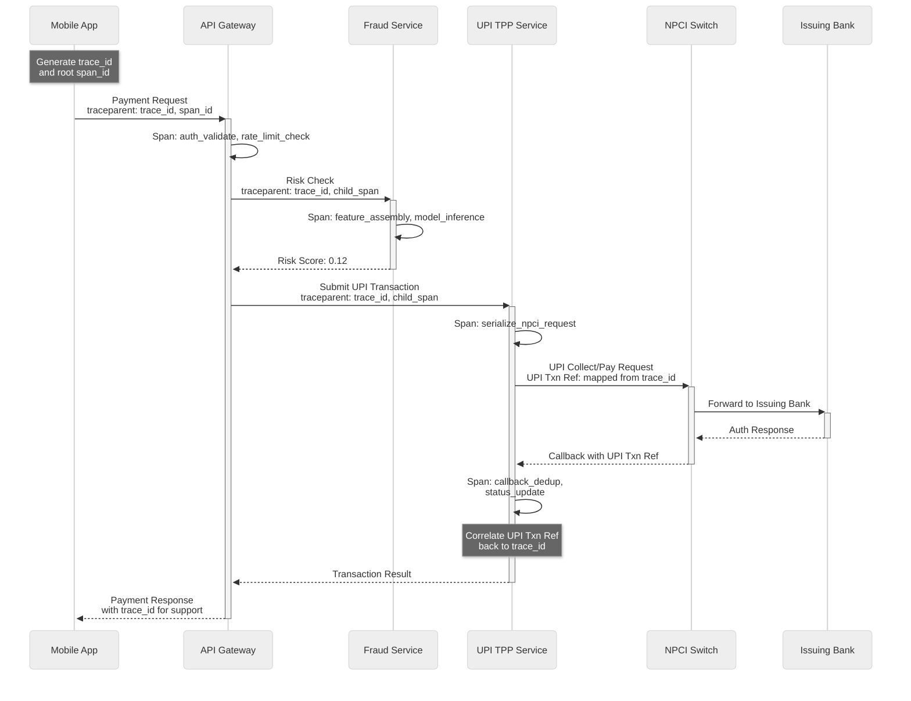

# Super App Payment Platform: Observability

## 1. Metrics

### Infrastructure Metrics (USE Method)

The USE method (Utilization, Saturation, Errors) surfaces resource-level bottlenecks before they cascade into user-facing failures.

| Resource | Utilization | Saturation | Errors |
|----------|-------------|------------|--------|
| **API Gateway** | Request rate per pod, CPU/memory per instance | Queue depth, backpressure events per second | 5xx rate, auth failure rate, timeout rate |
| **Transaction DB** | Query rate, connection pool usage (active/max), disk I/O | Replication lag (seconds), lock wait time | Deadlocks/min, query errors, failed writes |
| **Cache Cluster** | Hit rate, memory usage per shard | Eviction rate, fragmentation ratio | Connection failures, serialization errors |
| **Message Queue** | Consumer throughput, partition lag | Queue depth per topic, oldest unprocessed message age | Dead letter queue size, consumer group rebalances |
| **NPCI Connection Pool** | Active connections / max connections | Pending request queue depth, connection wait time | Timeout rate, rejection rate, malformed response rate |

### Business Metrics (RED Method)

The RED method (Rate, Errors, Duration) captures the user-facing health of each payment vertical.

| Service | Rate (Target) | Errors (Threshold) | Duration (SLO) |
|---------|---------------|---------------------|-----------------|
| **UPI Payments** | 8K TPS avg, 50K TPS peak | Decline rate < 3%, timeout rate < 0.5% | p50: 800ms, p99: 2,000ms |
| **Bill Payments** | 500 payments/min avg | Fetch failure < 2%, payment failure < 1% | p50: 1.5s, p99: 3s |
| **NFC Tap-to-Pay** | 200 taps/min avg | Auth failure rate < 0.1% | p50: 200ms, p99: 500ms |
| **Rewards Engine** | 10K evaluations/sec | Budget exhaustion events < 1/hour | p50: 50ms, p99: 200ms |
| **Fraud Detection** | 15K scores/sec | Model timeout rate < 0.1% | p50: 30ms, p99: 100ms |

### Key Business Dashboards

1. **Transaction Success Rate Dashboard**: Real-time success/failure/pending breakdown sliced by bank, transaction type (P2P, P2M, bill pay, NFC), and geography. Includes a 7-day rolling trend and comparison against the same hour last week.

2. **Bank Health Dashboard**: Per-bank success rate, latency percentiles, and timeout rate. Critical for identifying bank-side outages before they trigger support volume spikes. Color-coded health indicators with automatic degradation detection.

3. **Reward Campaign Dashboard**: Budget utilization (spent vs. allocated), redemption rate, cost per acquisition, and ROI per campaign. Alerts when a campaign approaches budget exhaustion or when redemption patterns suggest abuse.

4. **Merchant Settlement Dashboard**: Settlement accuracy (expected vs. actual), dispute rate per merchant category, onboarding funnel conversion, and pending settlement queue depth.

5. **Fraud Dashboard**: Block rate, false positive rate, risk score distribution histogram, and model drift indicators. Includes a manual review queue depth and average resolution time.

---

## 2. Logging

### Structured Log Format

All services emit structured JSON logs with a consistent schema. PII is masked at the emission point, not post-hoc.

```
{
  "timestamp": "2026-03-09T14:23:07.123Z",
  "service": "upi-tpp",
  "trace_id": "a1b2c3d4-e5f6-7890-abcd-ef1234567890",
  "span_id": "f0e1d2c3-b4a5-6789-0fed-cba987654321",
  "level": "INFO",
  "event": "txn_initiated",
  "user_id_hash": "sha256_8a3f2b",
  "txn_id": "TXN-20260309-00042317",
  "amount_bucket": "100-500",
  "bank_code": "SBIN",
  "latency_ms": 450,
  "risk_score": 0.12,
  "error_code": null,
  "metadata": {
    "txn_type": "P2M",
    "merchant_category": "grocery",
    "device_trust_score": 0.95
  }
}
```

### Log Levels Strategy

| Level | Usage | Destination | Retention |
|-------|-------|-------------|-----------|
| **ERROR** | Transaction failures, data inconsistencies, security events (unauthorized access, signature mismatch) | Immediate alert via pager; indexed for search | 1 year |
| **WARN** | High latency (p99 breach), circuit breaker state changes, approaching rate limits, KYC verification retries | Dashboard metric; aggregated alert if sustained | 6 months |
| **INFO** | Transaction lifecycle events (initiated, submitted, completed), API calls, cache hits/misses, settlement batch progress | Searchable log store | 90 days |
| **DEBUG** | Request/response payloads (PII-masked), ML feature vectors, routing decisions, config evaluation | Development and staging only; never in production | 7 days |

### PII Masking Rules

| Data Element | In General Logs | In Transaction Audit Logs | Masking Method |
|-------------|-----------------|---------------------------|----------------|
| Phone Number | `****1234` (last 4 only) | `****1234` | Truncation |
| VPA Handle | SHA-256 hash prefix | Full hash (searchable) | Hashing |
| Transaction Amount | Bucketed ranges (0-100, 100-500, 500-2000, 2000+) | Exact amount (encrypted field) | Bucketing / Encryption |
| Bank Account Number | Never logged | Internal `account_id` reference only | Omission |
| Device IMEI | Never logged | Hash stored in device registry | Omission / Hashing |
| Merchant Name | Logged as-is (public info) | Logged as-is | No masking |

---

## 3. Distributed Tracing

### Trace Propagation

Traces originate at the mobile client and flow through every service boundary, including the NPCI switch where the platform's trace context maps to UPI reference numbers.



**Correlation Strategy**:
- Trace starts at the mobile app with a client-generated `trace_id` embedded in the `traceparent` header.
- Every service creates child spans and propagates the trace context via HTTP headers.
- At the NPCI boundary, the internal `trace_id` is mapped to the NPCI UPI reference number and stored in a correlation table.
- When the bank callback arrives (potentially minutes later for collect requests), the UPI transaction reference is used to look up and reattach to the original trace.

### Key Spans to Instrument

| Span Name | Service | What It Captures |
|-----------|---------|------------------|
| `api_gateway.route` | API Gateway | Auth validation duration, rate limit check, routing decision, request size |
| `upi.risk_check` | Fraud Service | Feature assembly time, model inference latency, risk decision (allow/block/review) |
| `upi.npci_submit` | UPI TPP | NPCI request serialization, network round-trip time, response deserialization |
| `upi.bank_callback` | UPI TPP | Callback arrival latency, deserialization, deduplication check, status update write |
| `reward.evaluate` | Rewards Engine | Campaign matching logic, budget check, credit/debit decision, cache hit/miss |
| `bill.fetch` | Bill Payment Service | BBPS request formation, biller response time, response parsing and validation |
| `nfc.cryptogram` | NFC Service | On-device cryptogram generation verification, token validation against card network |
| `settlement.batch` | Settlement Service | Batch size, reconciliation duration, mismatch count, retry count |
| `kyc.verify` | KYC Service | Document validation, e-KYC API latency, verification outcome |

### Trace-Based Debugging Workflows

**Debugging a Failed UPI Transaction**:
1. Customer reports failed payment via support ticket, providing the `txn_id` shown in the app.
2. Support agent searches by `txn_id` to retrieve the `trace_id`.
3. Trace view reveals the full span tree: API gateway received the request (200ms), fraud check passed (35ms), NPCI submission succeeded (400ms), but the bank callback returned a decline code `Z9` (insufficient funds) after 1,200ms.
4. The root cause is immediately clear without escalation to engineering.

**Debugging Intermittent Latency**:
1. Alert fires for p99 latency exceeding 3 seconds.
2. Filter traces where total duration > 3s in the past 15 minutes.
3. Aggregate by span: identify that 80% of slow traces have the `upi.npci_submit` span exceeding 2.5s.
4. Drill into NPCI spans by bank code: discover that a single bank (e.g., `HDFC`) is responding slowly.
5. Cross-reference with the Bank Health Dashboard to confirm bank-side degradation.

---

## 4. Alerting

### Critical Alerts (Page-Worthy)

These alerts trigger immediate pager notification to the on-call engineer and auto-create an incident.

| Alert Name | Condition | Automated Action | Human Action |
|------------|-----------|------------------|--------------|
| **UPI Success Rate Drop** | Overall success rate < 95% sustained for 5 minutes | Create P1 incident; post to war-room channel | Check NPCI status page; isolate failing bank(s); consider circuit-breaking degraded banks |
| **Transaction Latency Spike** | p99 latency > 3 seconds for 3 consecutive minutes | Capture heap dump; increase thread pool | Check DB connection pool, cache health, NPCI response times; scale horizontally if resource-bound |
| **Fraud Model Down** | ML inference timeout rate > 5% sustained for 2 minutes | Activate rules-based fallback automatically | Page ML on-call; validate fallback rule accuracy; monitor false positive rate under fallback |
| **Settlement Mismatch** | Reconciliation diff exceeds 10,000 INR in a single batch | Halt settlement batch; snapshot current state | Page finance ops; investigate mismatched transactions; manual reconciliation if needed |
| **Unusual Login Pattern** | > 1,000 failed logins/min from same IP range | Auto-block offending IP range; enable CAPTCHA globally | Page security team; analyze attack pattern; coordinate with CDN provider if volumetric |

### Warning Alerts (Dashboard + Notification)

These alerts post to monitoring channels and appear on dashboards but do not page unless they escalate.

| Alert Name | Condition | Response |
|------------|-----------|----------|
| **Bank Latency Degradation** | Specific bank p99 > 1.5 seconds for 10 minutes | Flag on Bank Health Dashboard; monitor trend; prepare circuit breaker if worsening |
| **Cache Hit Rate Drop** | Overall hit rate < 90% for 15 minutes | Check eviction rate and memory pressure; warm cache if cold-start scenario; verify no key pattern change |
| **Reward Budget Exhaustion** | Campaign budget utilization > 90% | Notify marketing team; prepare budget extension or campaign pause |
| **Queue Consumer Lag** | Consumer lag > 10,000 messages sustained for 5 minutes | Scale consumer instances; check for stuck/poison messages; verify no upstream burst anomaly |
| **DB Replication Lag** | Replication lag > 5 seconds | Monitor closely; if exceeds 30 seconds, trigger read-replica failover; investigate write throughput spike |

### Escalation Matrix

| Time Since Alert | Level | Notified |
|-----------------|-------|----------|
| 0 minutes | L1 | On-call engineer (pager + channel post) |
| 15 minutes (unacknowledged) | L2 | Engineering lead + on-call backup |
| 30 minutes (unresolved) | L3 | VP Engineering + Head of Payments |
| 60 minutes (P1 unresolved) | Executive | CTO + regulatory compliance lead |

---

## 5. Runbooks

Each critical alert links to a detailed runbook. Runbooks follow a standard format: Symptoms, Impact Assessment, Diagnostic Steps, Remediation, Post-Incident.

| Runbook | Scenario | Key Decision Points |
|---------|----------|---------------------|
| `runbook/npci-timeout` | NPCI switch unresponsive or degraded | Is it total outage or partial? Circuit-break all UPI or only affected banks? When to activate queued-retry mode? |
| `runbook/bank-outage` | Specific bank API returning errors or timing out | Isolate to single bank or multi-bank? Enable bank-specific circuit breaker? Customer communication template? |
| `runbook/settlement-recon` | Settlement reconciliation mismatch detected | Halt or continue settlement? How to identify affected transactions? Manual vs. automated correction? |
| `runbook/fraud-model-fallback` | ML model degradation or unavailability | Validate rules-based fallback coverage; monitor false-positive rate; rollback model version if drift detected |
| `runbook/diwali-scaling` | Festival traffic scaling playbook | Pre-scale timeline (T-72h, T-24h, T-1h); capacity targets per service; rollback plan if scaling fails |
| `runbook/mandate-failure` | Mandate execution batch failure or elevated failure rate | Check bank-side issues; pause affected mandates; notify users; retry strategy |
| `runbook/celebrity-vpa` | Viral VPA causing hot partition | Detect via TPS spike; auto-migrate to dedicated shard; rate-limit senders; batch NPCI submissions |
| `runbook/cache-warmup` | Cold start after cache cluster restart or expansion | Pre-load top 10K merchant VPAs; warm campaign rules; progressive traffic routing to new shards |

### Runbook Template Structure

Each runbook follows a standardized format to minimize cognitive load during incidents:

```
1. SYMPTOMS
   - What alerts fired? What metrics are abnormal?
   - What is the user-facing impact?

2. IMPACT ASSESSMENT
   - Which payment types are affected?
   - How many users are impacted (current and projected)?
   - Is there financial risk (stuck funds, duplicate charges)?

3. DIAGNOSTIC STEPS (ordered by likelihood)
   - Step 1: Check [specific dashboard/metric] for [expected pattern]
   - Step 2: If Step 1 confirms, check [next level detail]
   - Step 3: If inconclusive, check [alternative hypothesis]

4. REMEDIATION OPTIONS (ranked by reversibility)
   - Option A: [Least disruptive] — [when to use]
   - Option B: [Moderate impact] — [when to use]
   - Option C: [Nuclear option] — [only if A and B fail]

5. POST-INCIDENT
   - Verify recovery metrics are within SLO for 15 minutes
   - Capture timeline and root cause
   - Schedule post-mortem within 48 hours
```

---

## 6. Observability Architecture

### Data Pipeline

```
Mobile App (client telemetry)
    |
    v
API Gateway (access logs, latency metrics)
    |
    +---> Metrics Collector ---> Time-Series DB ---> Dashboards
    |
    +---> Log Shipper ---> Log Aggregation Store ---> Search/Analysis
    |
    +---> Trace Collector ---> Trace Store ---> Trace Visualization
    |
    +---> Business Events ---> Stream Processor ---> Real-Time Dashboards
```

### Sampling Strategy

| Data Type | Sampling Rate | Rationale |
|-----------|--------------|-----------|
| Metrics | 100% (all transactions) | Metrics are low-cardinality; full coverage needed for accurate alerting |
| Traces (success) | 10% for amounts < 500; 100% for amounts > 500 | Low-value success paths are high-volume and homogeneous |
| Traces (error/slow) | 100% | Every failure and latency outlier must be debuggable |
| Traces (mandate execution) | 100% | All mandate executions are traceable for dispute resolution |
| Logs (INFO) | 100% for transaction events; sampled for non-critical paths | Transaction audit trail requires completeness |
| Logs (DEBUG) | 0% in production; 100% in staging | Debug logs contain verbose payloads; production cost is prohibitive |
| Settlement reconciliation | 100% | Every reconciliation result must be auditable for regulatory compliance |

### Cost Management

- **Log Volume**: At 50K TPS peak, structured logs generate approximately 15 TB/day. Hot storage (searchable) retains 7 days; warm storage retains 90 days; cold archive retains 1 year.
- **Metric Cardinality**: Limit label combinations to prevent cardinality explosion. Bank code (50 values) x transaction type (5) x status (4) = 1,000 series per metric. Acceptable. Adding user_id as a label would create 300M+ series and must be avoided.
- **Trace Storage**: At 10% sampling for success paths, trace storage runs approximately 2 TB/day. Full retention for 30 days in hot storage.
- **Reconciliation Data**: Settlement reconciliation results are retained for 10 years per regulatory requirement. Daily reconciliation reports are compressed and archived after 90 days of hot retention.

### Observability for External Dependencies

External dependencies (NPCI, banks, BBPS, card networks) require special observability treatment because the platform has no visibility into their internals:

| Dependency | Health Signal | Anomaly Detection | Dashboard |
|------------|--------------|-------------------|-----------|
| NPCI Switch | Success rate per 1-minute window; callback latency distribution | Baseline comparison against same hour previous week; auto-flag >2x deviation | NPCI Health Dashboard with per-bank breakdown |
| Individual Banks | Per-bank success rate, p99 latency, timeout rate | Bank-specific baselines; some banks are inherently slower | Bank Health Matrix (heatmap by bank x metric) |
| BBPS | Bill fetch success rate, payment confirmation latency | Biller-specific baselines (some billers are slower) | Biller Health Dashboard |
| Card Networks | Token provisioning success rate, authorization latency | Network-specific baselines | NFC Health Dashboard |
| Account Aggregator | Consent creation success rate, data fetch latency per FIP | FIP-specific baselines (bank response times vary 10x) | AA Health Dashboard |

### SLO Definitions

| SLI | SLO Target | Error Budget (30 days) | Measurement |
|-----|-----------|----------------------|-------------|
| UPI Transaction Success Rate | 99.5% | 0.5% (~2.16M failures at 50K peak) | Successful completions / total attempts |
| End-to-End Latency (UPI) | p99 < 2s | Measured over rolling 5-min windows | Time from API receipt to user notification |
| Bill Fetch Availability | 99.0% | 1.0% | Successful bill fetches / total fetch attempts |
| NFC Authorization Latency | p99 < 500ms | Measured over rolling 1-min windows | Cryptogram validation to auth response |
| Platform Availability | 99.95% | 21.6 min/month downtime allowed | Health check success rate across all endpoints |

When the error budget for a given SLI is consumed beyond 50%, feature releases are frozen for that service until the budget recovers. At 80% consumption, an engineering-wide incident review is triggered.

### Error Budget Burn Rate Alerts

| Burn Rate | Window | Meaning | Action |
|-----------|--------|---------|--------|
| 14.4x | 1 hour | Budget will exhaust in 2 days at this rate | Page on-call; investigate immediately |
| 6x | 6 hours | Budget will exhaust in 5 days | Create P2 incident; investigate within shift |
| 3x | 1 day | Budget will exhaust in 10 days | Create ticket; investigate within 48 hours |
| 1x | 3 days | On-track to exhaust budget exactly at end of window | Monitor; prepare mitigation plan |

---

## 7. Financial Reconciliation Monitoring

Financial reconciliation is the most critical observability concern for a payment platform --- any discrepancy means money is either lost or duplicated.

### Reconciliation Metrics

| Metric | Source | Target | Alert Threshold |
|--------|--------|--------|-----------------|
| Platform-to-NPCI transaction count match | Compare platform SUCCESS count with NPCI settlement file | 100% match | Any mismatch triggers P1 |
| Platform-to-bank settlement amount match | Compare net settlement amount with bank UTR confirmation | 100% match (to paisa) | Any mismatch triggers P1 |
| Pending transactions beyond SLA | Transactions in PENDING state for >30 minutes | < 0.01% of daily volume | >100 pending beyond SLA triggers P2 |
| Auto-refund compliance | Failed transactions with auto-refund initiated within 48 hours | 100% | Any missed auto-refund triggers P1 (regulatory) |
| Reward budget actual vs. tracked | Sum of all credited rewards vs. budget counter value | Variance < 2% | Variance > 5% triggers P2 |
| Merchant settlement accuracy | Expected settlement (sum of transactions - fees) vs. actual bank transfer | 100% match | Any mismatch halts next settlement batch |

### Reconciliation Dashboard

```
Daily Reconciliation Summary (T+1)
┌─────────────────────────────────────────────────────────────────────┐
│  Platform Transactions: 86.4M     NPCI Settlement: 86.4M   ✓ Match│
│  Gross Amount: ₹12,480 Cr        Bank Settlement: ₹12,480 Cr  ✓   │
│  Pending (>30min): 47             Auto-Refunds Due: 1,230   ✓ 100%│
│  Reward Budget Tracked: ₹4.2 Cr  Actual Credits: ₹4.18 Cr ✓ 0.5% │
│  Disputes Raised: 340             Disputes Resolved: 312    ✓ 92% │
│  Settlement Mismatches: 0         Failed Settlements: 3     ⚠ Retry│
└─────────────────────────────────────────────────────────────────────┘
```

---

## 8. Interview Discussion Points

**Q: How do you handle observability across the NPCI boundary where you lose trace context?**

The NPCI switch does not propagate OpenTelemetry trace headers. We solve this by maintaining a correlation table that maps our internal `trace_id` to the NPCI `UPI transaction reference number`. When we submit a transaction to NPCI, we record this mapping. When the bank callback arrives (which may be asynchronous, sometimes minutes later for collect requests), we look up the UPI reference in the correlation table and reattach the callback span to the original trace. This gives us end-to-end visibility even across a boundary we do not control.

**Q: How do you alert without creating noise during known bank maintenance windows?**

We maintain a bank maintenance calendar (both scheduled and ad-hoc). During a registered maintenance window, the bank-specific alerts are suppressed while aggregate alerts remain active. If a bank reports a 30-minute maintenance window but is still down after 45 minutes, the suppression lifts and alerts fire. This prevents on-call fatigue from predictable bank downtimes (which happen nightly for several banks) while catching genuine extended outages.

**Q: What is your approach to fraud model observability when the model operates at 30ms p50?**

We instrument at three levels. First, model-level metrics: inference latency, feature availability (percentage of features successfully fetched vs. defaulted), and prediction distribution (what percentage of transactions score above each risk threshold). Second, decision-level metrics: block rate, allow rate, manual-review rate, and false positive rate (computed retroactively when disputes resolve). Third, drift detection: compare the feature value distributions and prediction distributions against a 7-day baseline. If KL divergence exceeds a threshold, alert the ML team for model retraining consideration.

**Q: How do you monitor the financial reconciliation process?**

Daily reconciliation runs at T+1 and generates a structured report comparing platform transaction records against NPCI settlement files and bank UTR confirmations. We track six key metrics: transaction count match (platform vs. NPCI), settlement amount match (to the paisa), pending transactions beyond SLA (>30 minutes), auto-refund compliance (must be 100%), reward budget variance (tracked vs. actual), and merchant settlement accuracy. Any mismatch in the first two metrics triggers an immediate P1 alert. The reconciliation dashboard shows a daily summary with drill-down capability to individual mismatched transactions for investigation.

**Q: How do you handle observability for mandate execution that runs on a schedule?**

The mandate execution engine runs hourly and reports: number of mandates due, number executed successfully, number failed (with failure reason distribution), number paused, and number expired. Each execution generates a trace that links to the underlying UPI transaction trace. We alert if the success rate drops below 95% (indicating bank-side issues) or if the execution lag exceeds 30 minutes (indicating scheduler issues). Pre-debit notifications are tracked separately with delivery confirmation rates and user opt-out rates.
