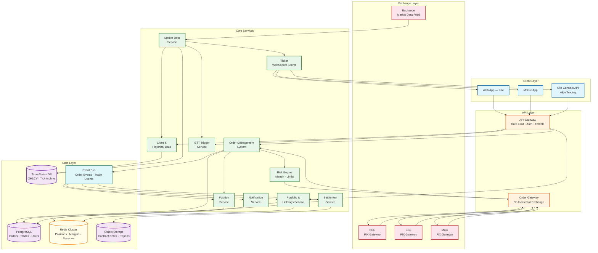
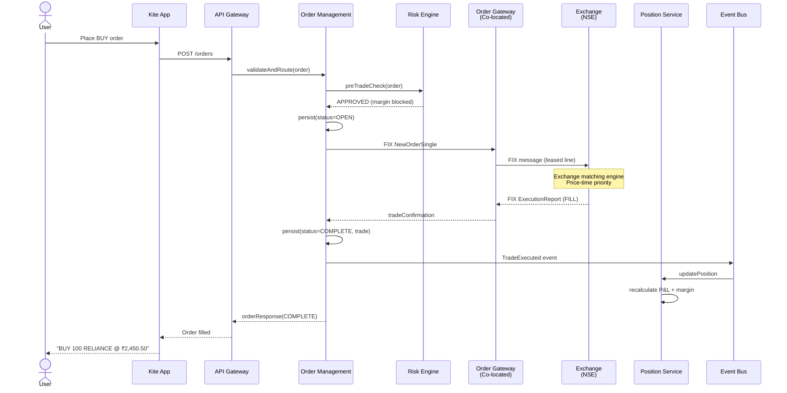
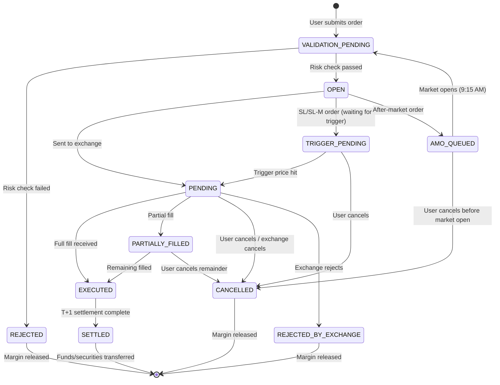
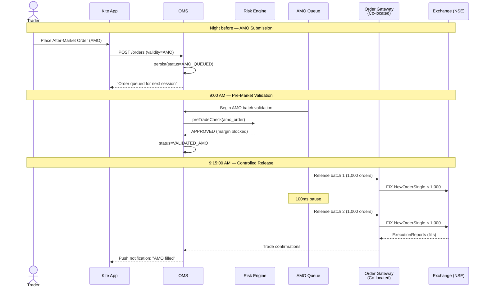
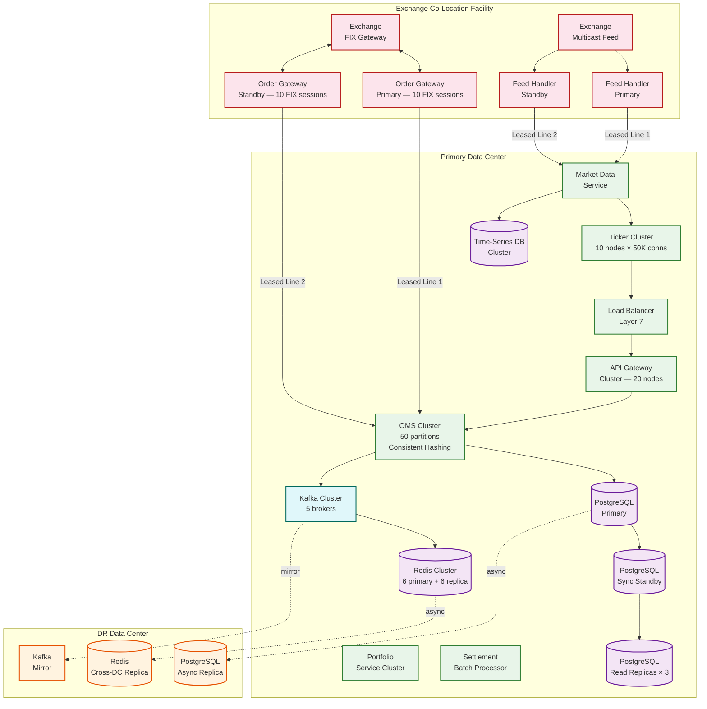
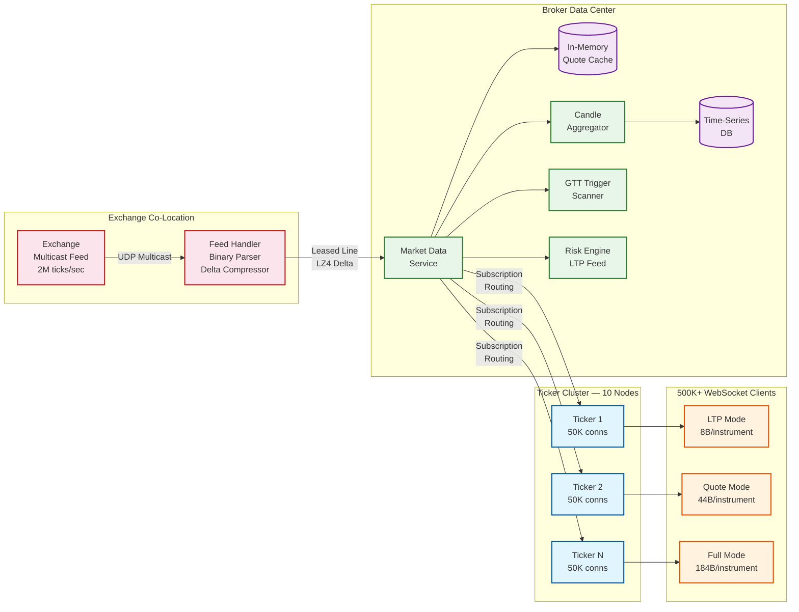

# High-Level Design

## Architecture Overview

The stock trading platform follows an **event-driven order pipeline** pattern for order flow and a **binary multicast fan-out** pattern for market data distribution. The architecture is shaped by three realities: (1) the exchange is the external matching authority—the broker routes, not matches; (2) market open creates a predictable but extreme 15× traffic spike; (3) every order must pass pre-trade risk checks in microseconds.



---

## Service Responsibilities

| Service | Responsibility | Key Characteristics |
|---------|---------------|---------------------|
| **Order Management System (OMS)** | Accept, validate, route, and track orders through their lifecycle | Stateful per order; idempotent order IDs; saga coordinator |
| **Risk Engine** | Pre-trade validation: margin sufficiency, position limits, circuit breaker checks, order value limits | In-process memory; sub-100μs latency; no network calls on hot path |
| **Order Gateway (Co-located)** | FIX protocol connectivity to exchange; serialize/deserialize FIX messages; handle exchange responses | Deployed in exchange colo; dedicated leased line; binary protocol |
| **Position Service** | Track real-time intraday positions, calculate unrealized P&L, manage margin utilization | In-memory state (Redis); updated on every fill; strongly consistent |
| **Portfolio & Holdings Service** | Display holdings (delivery), historical trades, dividend history, corporate actions | PostgreSQL-backed; eventual consistency acceptable |
| **Market Data Service** | Consume exchange multicast feed, normalize, aggregate into OHLCV candles | Co-located feed handler; binary protocol parsing |
| **Ticker (WebSocket Server)** | Stream real-time market data to connected clients via WebSocket | Hundreds of thousands of concurrent connections; binary frames; Go-based |
| **Chart & Historical Data** | Serve OHLCV candles, compute technical indicators, provide historical data API | Time-series DB; pre-computed indicators; CDN-cacheable |
| **GTT Trigger Service** | Monitor market prices against user-defined trigger conditions; place orders when triggered | Background workers polling market data; at-least-once trigger guarantee |
| **Settlement Service** | Reconcile trades with clearing corporation, generate contract notes, process fund settlements | Batch processing; T+1 cycle; reconciliation with NSCCL/ICCL |
| **Notification Service** | Order execution alerts, margin calls, corporate action notices | Event-driven; push/SMS/email; async from critical path |

---

## Data Flow 1: Order Placement (Market Order)

```
User places: BUY 100 shares of RELIANCE at Market Price

1. Mobile App → API Gateway: POST /orders (instrument, qty, type=MARKET, side=BUY)
2. API Gateway → OMS: validate request schema, authenticate, rate-limit
3. OMS generates order_id (UUID), persists to PostgreSQL with status=VALIDATION_PENDING
4. OMS → Risk Engine (in-process call):
   a. Check available margin: user.available_margin >= estimated_order_value
   b. Check position limits: user.net_position + 100 <= max_position_limit
   c. Check instrument circuit breaker: RELIANCE not in circuit-breaker-halt
   d. Check order value: order_value <= max_single_order_value
   → All checks pass (< 100μs)
5. OMS → Risk Engine: block margin (deduct from available, add to blocked)
6. OMS updates order status = OPEN, publishes OrderAccepted to event bus
7. OMS → Order Gateway (co-located): send FIX NewOrderSingle message
   - FIX fields: ClOrdID, Symbol, Side=BUY, OrdType=MARKET, OrderQty=100
   - Transmitted via dedicated leased line to exchange colo
8. Order Gateway → NSE FIX Gateway: FIX message over persistent TCP session
9. NSE matching engine: matches against best ask in order book
   - Fill: 100 shares @ ₹2,450.50
10. NSE → Order Gateway: FIX ExecutionReport (ExecType=FILL, LastPx=2450.50, LastQty=100)
11. Order Gateway → OMS: trade confirmation
12. OMS updates order status = COMPLETE, creates Trade record
13. OMS → Event Bus: publishes TradeExecuted event
14. Position Service (async): updates position (RELIANCE: +100 @ ₹2,450.50)
15. Position Service: recalculates unrealized P&L, updates available margin
16. Notification Service (async): push notification "RELIANCE BUY 100 @ ₹2,450.50"
17. Portfolio Service (async): updates holdings if delivery trade
```

---

## Data Flow 2: Market Data Streaming

```
User subscribes to RELIANCE, INFY, TCS on Kite watchlist

1. Exchange market data feed (binary multicast) → Co-located Feed Handler
   - Feed handler sits in exchange colo, receives tick-by-tick data
   - Binary protocol: instrument_token(4B) + LTP(4B) + volume(4B) + ...
2. Feed Handler: parse binary frames, normalize across NSE/BSE/MCX
3. Feed Handler → Broker Data Center: compressed stream via leased line
   - Compression: delta encoding + LZ4 (reduces 200 MB/s → ~40 MB/s)
4. Market Data Service: receives normalized ticks
   a. Updates in-memory latest quote cache (per instrument)
   b. Aggregates ticks into 1-min OHLCV candles
   c. Persists candles to time-series DB
5. Ticker (WebSocket Server): subscribes to instruments users are watching
   a. User's WebSocket connection has subscription list: [RELIANCE, INFY, TCS]
   b. Ticker batches updates in 100ms windows
   c. Serializes as binary WebSocket frames (not JSON—saves 60% bandwidth)
   d. Sends batched update to user's connection
6. Client app: deserializes binary frame, updates UI
   - Total latency: exchange tick → user's screen ≈ 2-5ms
```

---

## Data Flow 3: Order Lifecycle Sequence



---

## Order Lifecycle State Diagram



---

## Key Architectural Decisions

| Decision | Choice | Rationale |
|----------|--------|-----------|
| **Matching engine ownership** | Exchange-operated (NSE/BSE) | Broker is a routing intermediary, not a matching engine; regulatory requirement |
| **Exchange connectivity** | FIX protocol over co-located dedicated leased lines | Industry standard; sub-millisecond latency; persistent TCP sessions |
| **Market data transport** | Binary WebSocket frames (not JSON) | 60% bandwidth savings over JSON; critical at 500K concurrent connections |
| **Risk engine placement** | In-process with OMS (same process memory) | Pre-trade checks must complete in < 100μs; network hop would add 500μs+ |
| **Position tracking** | Redis (in-memory) + PostgreSQL (persistence) | Positions must update in real-time on every fill; Redis for speed, PostgreSQL for durability |
| **Order persistence** | Write-ahead to PostgreSQL before exchange submission | No order can be lost; crash recovery requires durable order log |
| **Market data aggregation** | Time-series DB for OHLCV candles | Efficient range queries for charts; columnar storage for analytics |
| **Event streaming** | Event bus for post-trade processing | Decouples position updates, notifications, settlement from order critical path |
| **Market open spike** | Pre-provisioned capacity + order queue with backpressure | 15× spike is predictable; auto-scaling is too slow; pre-provision + graceful degradation |
| **WebSocket server** | Go-based ticker (single binary, lightweight goroutines) | Go's goroutine model handles 500K+ concurrent connections with minimal memory overhead |

---

## Technology Choices

| Component | Technology | Rationale |
|-----------|-----------|-----------|
| **Order Database** | PostgreSQL | ACID for orders, trades, settlements; multi-TB proven (Zerodha runs hundreds of billions of rows) |
| **Position Cache** | Redis Cluster | Sub-ms reads/writes for real-time position and margin state |
| **Time-Series Data** | ClickHouse / TimescaleDB | Columnar storage for OHLCV candles, tick archives; efficient time-range queries |
| **Event Streaming** | Kafka | Durable event log for order/trade events; replay capability for reconciliation |
| **Object Storage** | Cloud object storage | Contract notes (PDF), regulatory reports, bulk data exports |
| **WebSocket Server** | Go (custom ticker) | Goroutines for concurrent connections; binary frame serialization; minimal GC pressure |
| **Order Gateway** | Go / C++ | FIX protocol engine; co-located; latency-critical; deterministic performance |
| **Risk Engine** | Go (in-process) | Shared memory with OMS; no serialization overhead; lock-free data structures |
| **API Gateway** | Reverse proxy with rate limiting | Authentication, throttling, DDoS protection; separate from order path |
| **Client Apps** | Flutter (mobile), Web (SPA) | Cross-platform mobile; responsive web trading interface |

---

## Data Flow 4: Market Open AMO Release



---

## Data Flow 5: Smart Order Routing

```
User places: BUY 100 shares of RELIANCE (listed on both NSE and BSE)

1. OMS receives validated order (risk checks passed)
2. Smart Order Router evaluates both exchanges:
   a. NSE: best ask = ₹2,452.05, ask_qty = 8,300, latency = 0.3ms
   b. BSE: best ask = ₹2,451.95, ask_qty = 2,100, latency = 0.5ms
3. Routing decision factors:
   - Price: BSE is ₹0.10 cheaper (0.004% savings)
   - Liquidity: NSE has 4× more depth at best ask
   - Latency: NSE is 0.2ms faster
   - Fill probability: NSE higher (more liquidity)
4. Decision: Route to BSE (better price, sufficient liquidity for 100 shares)
   - If order were 5,000 shares → route to NSE (BSE depth insufficient)
5. Router sends FIX NewOrderSingle to BSE Order Gateway
6. If partial fill on BSE: route remainder to NSE (spillover routing)

Routing Algorithm:
   score(exchange) = w_price × price_score
                   + w_liquidity × liquidity_score
                   + w_latency × latency_score
                   + w_fill_prob × fill_probability

   Route to: argmax(score)
   Weights tuned based on order size, urgency, and instrument type
```

---

## Deployment Architecture



---

## Additional Architectural Decisions

| Decision | Choice | Rationale |
|----------|--------|-----------|
| **Smart order routing** | Score-based multi-exchange routing | SEBI best execution obligation; evaluate price, liquidity, latency per-exchange |
| **AMO release strategy** | Staged batch release (1K orders/100ms) | Exchange per-broker rate limits; uncontrolled flood would cause rejections |
| **Margin state durability** | Event-sourced from Kafka + periodic Redis snapshot | Crash recovery replays events from last snapshot; no separate margin DB needed |
| **Instrument master refresh** | Daily download + intra-day delta via exchange broadcast | Full instrument list changes daily (new F&O contracts); deltas for circuit limit updates |
| **Contract note generation** | Batch job at 5:30 PM; async PDF generation + email | Not latency-critical; batch processing reduces peak DB load |
| **Cross-DC replication** | Async to DR site; manual failover | Synchronous cross-DC adds 10–20ms latency—unacceptable for order path |

---

## Component Interaction Matrix

| → Producer ↓ Consumer | OMS | Risk | Position | Portfolio | Ticker | Settlement | GTT |
|----------------------|-----|------|----------|-----------|--------|-----------|-----|
| **OMS** | — | sync call | via event bus | via event bus | — | via event bus | — |
| **Risk Engine** | sync response | — | reads Redis | — | — | — | — |
| **Position Service** | — | — | — | publishes event | — | — | — |
| **Market Data** | — | LTP updates | LTP for P&L | — | publishes ticks | — | price feed |
| **Event Bus** | publishes orders | — | consumes fills | consumes fills | — | consumes trades | — |
| **Exchange (FIX)** | execution reports | — | — | — | market data | trade file | — |

---

## Market Data Pipeline Architecture



---

## Architecture Pattern Checklist

| Pattern | Applied? | How |
|---------|----------|-----|
| Event Sourcing | Yes | Order/trade events derive position state; replay for crash recovery |
| CQRS | Yes | Write path (order placement) separated from read path (portfolio views, charts) |
| Saga | Partial | Order lifecycle is a long-running saga (place → route → fill → settle) |
| Circuit Breaker | Yes | FIX session health checks; exchange circuit breaker awareness |
| Bulkhead | Yes | OMS partitioned by user_id; ticker servers isolated; FIX sessions per exchange |
| Backpressure | Yes | Order queue with bounded depth at market open; WebSocket connection rate limiting |
| Sidecar | No | Latency constraints prohibit sidecar proxies on the order path |
| Edge Computing | Yes | Co-located gateways and feed handlers at exchange facility |
