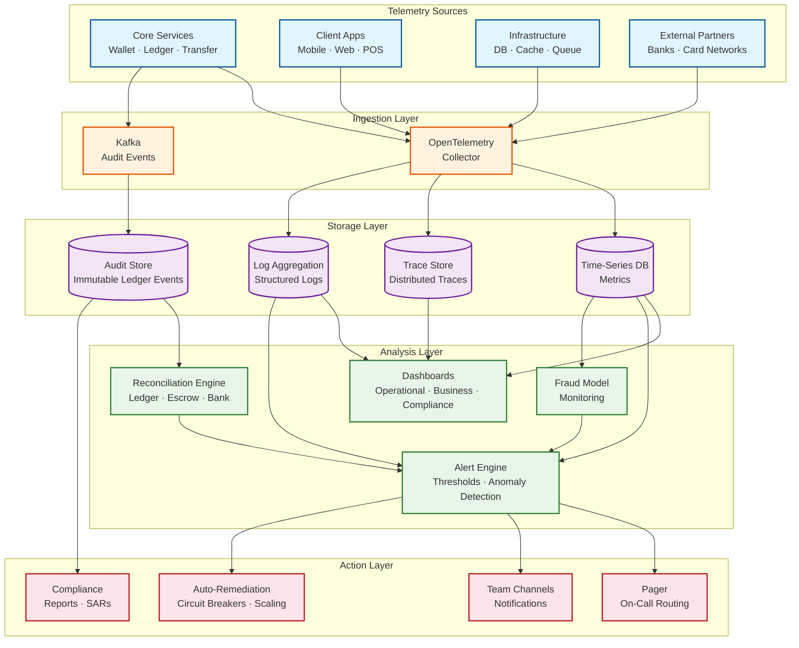

# Observability

## Key Metrics Dashboard

### Transaction Metrics

```
┌─────────────────────────────────────────────────────────────────┐
│ TRANSACTION HEALTH                                              │
├─────────────────────────────┬───────────────────────────────────┤
│ Transaction Success Rate    │ Target: > 99.9%                  │
│ Current: 99.94%             │ ████████████████████░ 99.94%     │
├─────────────────────────────┼───────────────────────────────────┤
│ P2P Transfer Latency (p50)  │ Target: < 500ms                  │
│ Current: 320ms              │ ████████████░░░░░░░░ 320ms       │
├─────────────────────────────┼───────────────────────────────────┤
│ P2P Transfer Latency (p99)  │ Target: < 2,000ms                │
│ Current: 1,450ms            │ ████████████████░░░░ 1,450ms     │
├─────────────────────────────┼───────────────────────────────────┤
│ Merchant Payment Latency    │ Target: < 1,000ms                │
│ (p99) Current: 780ms        │ ███████████████░░░░░ 780ms       │
├─────────────────────────────┼───────────────────────────────────┤
│ Transactions Per Second     │ Peak: 23,150 TPS                 │
│ Current: 4,230 TPS          │ ████░░░░░░░░░░░░░░░░ 18.3%      │
├─────────────────────────────┼───────────────────────────────────┤
│ Cross-Shard Transfer Rate   │ Informational                    │
│ Current: 38% of P2P         │ ████████░░░░░░░░░░░░ 38%        │
└─────────────────────────────┴───────────────────────────────────┘
```

### Ledger Health Metrics

```
┌─────────────────────────────────────────────────────────────────┐
│ LEDGER INTEGRITY                                                │
├─────────────────────────────┬───────────────────────────────────┤
│ Global Balance Check        │ Target: ZERO imbalance           │
│ Status: BALANCED ✓          │ Debits = Credits (last check: 2m)│
├─────────────────────────────┼───────────────────────────────────┤
│ Unbalanced Journals (24h)   │ Target: 0                        │
│ Count: 0                    │ ✓ All journals balanced          │
├─────────────────────────────┼───────────────────────────────────┤
│ Balance Drift Detected      │ Target: 0 wallets                │
│ Count: 0                    │ ✓ Materialized = Computed        │
├─────────────────────────────┼───────────────────────────────────┤
│ Escrow Reconciliation       │ Target: < $100 variance          │
│ Variance: $12.50            │ ✓ Within tolerance               │
├─────────────────────────────┼───────────────────────────────────┤
│ Ledger Write Rate           │ Capacity: ~60K writes/sec        │
│ Current: 12,340 writes/sec  │ █████░░░░░░░░░░░░░░░ 20.6%      │
├─────────────────────────────┼───────────────────────────────────┤
│ Reconciliation Last Run     │ Frequency: every 1 hour          │
│ Completed: 12 min ago       │ Duration: 45 seconds             │
└─────────────────────────────┴───────────────────────────────────┘
```

### Fraud Detection Metrics

```
┌─────────────────────────────────────────────────────────────────┐
│ FRAUD DETECTION                                                 │
├─────────────────────────────┬───────────────────────────────────┤
│ Fraud Scoring Latency (p99) │ Target: < 100ms                  │
│ Current: 72ms               │ ██████████████░░░░░░ 72ms        │
├─────────────────────────────┼───────────────────────────────────┤
│ Transactions Declined (24h) │ Informational                    │
│ Count: 14,320 (0.072%)      │ Auto-declined by fraud rules     │
├─────────────────────────────┼───────────────────────────────────┤
│ Transactions Held (24h)     │ Informational                    │
│ Count: 2,150 (0.011%)       │ Flagged for manual review        │
├─────────────────────────────┼───────────────────────────────────┤
│ False Positive Rate         │ Target: < 5%                     │
│ Current: 3.2%               │ Of declined txns later confirmed │
│                             │ legitimate by user dispute       │
├─────────────────────────────┼───────────────────────────────────┤
│ Fraud Loss Rate             │ Target: < 0.01% of volume        │
│ Current: 0.006%             │ Actual fraud / total volume      │
├─────────────────────────────┼───────────────────────────────────┤
│ Model Drift Score           │ Target: < 0.15 (PSI)             │
│ Current: 0.08               │ Population stability index       │
└─────────────────────────────┴───────────────────────────────────┘
```

---

## Alerting Rules

### Critical Alerts (Page On-Call Immediately)

| Alert | Condition | Severity | Action |
|-------|-----------|----------|--------|
| **Ledger Imbalance** | SUM(debits) ≠ SUM(credits) for any journal | P0 | Halt new transactions on affected shard; investigate immediately |
| **Balance Drift** | Materialized balance ≠ computed balance for any wallet | P0 | Freeze affected wallet; reconcile manually |
| **Double-Spend Detected** | Wallet balance goes negative | P0 | Freeze wallet; reverse latest transaction; investigate |
| **Transaction Success Rate** | < 99% for 5 minutes | P1 | Investigate error pattern; check DB health, external services |
| **Escrow Mismatch** | User balances vs bank escrow differ by > $10,000 | P1 | Halt withdrawals; investigate discrepancy |
| **DB Replication Lag** | Sync replica lag > 5 seconds | P1 | Failover risk; investigate replication |
| **All Fraud Scoring Down** | No fraud scores returned for 2 minutes | P1 | Fallback to rule-based scoring; investigate ML service |

### Warning Alerts (Notify Team)

| Alert | Condition | Severity | Action |
|-------|-----------|----------|--------|
| **P2P Latency Spike** | p99 > 3s for 10 minutes | P2 | Check DB lock contention, cross-shard ratio |
| **Fraud Decline Spike** | Decline rate > 1% for 15 minutes | P2 | Check for false positives; possible model drift |
| **Hot Wallet Detected** | Single wallet > 1,000 TPS for 5 minutes | P2 | Auto-split into sub-wallets if merchant |
| **External Service Degraded** | Bank/UPI circuit breaker open | P2 | Monitor; inform users of degradation |
| **KYC Queue Backlog** | > 10,000 pending KYC applications | P3 | Scale review team; check auto-approval pipeline |
| **Kafka Consumer Lag** | > 100,000 unconsumed events | P2 | Scale consumers; check for stuck processing |
| **Cache Hit Rate Drop** | Balance cache hit rate < 90% | P3 | Check Redis cluster health, memory |

---

## Distributed Tracing

### Trace Structure for P2P Transfer

```
Trace: P2P Transfer (TXN-abc123)
├── Span: API Gateway (2ms)
│   ├── Auth: JWT validation
│   └── Rate limit check
├── Span: Idempotency Service (1ms)
│   └── Redis lookup: idem key not found
├── Span: Transfer Service (450ms total)
│   ├── Span: Wallet Service - resolve receiver (5ms)
│   │   └── DB query: user by phone
│   ├── Span: Fraud Detection (72ms)
│   │   ├── Feature extraction (25ms)
│   │   │   ├── Redis: velocity features (3ms)
│   │   │   ├── TSDB: behavioral features (15ms)
│   │   │   └── Redis: device features (2ms)
│   │   └── ML inference (47ms)
│   ├── Span: Ledger Service - execute transfer (180ms)
│   │   ├── DB: SELECT FOR UPDATE sender (8ms)
│   │   ├── DB: SELECT FOR UPDATE receiver (5ms)
│   │   ├── DB: INSERT ledger entries × 2 (12ms)
│   │   ├── DB: UPDATE wallets × 2 (10ms)
│   │   ├── DB: INSERT transaction (5ms)
│   │   └── DB: COMMIT (140ms) ← includes sync replication
│   ├── Span: Redis - update balance cache × 2 (3ms)
│   └── Span: Kafka - publish event (5ms)
└── Span: Notification Service (async, not in critical path)
    ├── Push to sender (200ms)
    └── Push to receiver (180ms)

Total critical path: ~460ms
Slowest part of the process: DB COMMIT with synchronous replication (140ms)
```

### Key Trace Tags

```
Standard tags on every span:
  - wallet_id: sender and receiver wallet IDs
  - transaction_type: P2P_TRANSFER, MERCHANT_PAYMENT, etc.
  - shard_id: which database shard handled the request
  - cross_shard: true/false
  - fraud_score: risk score assigned
  - kyc_tier: sender's KYC tier
  - idempotent_replay: true/false
  - amount_bucket: MICRO(<$1), SMALL($1-50), MEDIUM($50-500), LARGE(>$500)
```

---

## Logging Strategy

### Structured Log Format

```
{
  "timestamp": "2025-03-09T10:30:00.123Z",
  "level": "INFO",
  "service": "transfer-service",
  "instance": "xfer-pod-3a",
  "trace_id": "abc-123-def-456",
  "span_id": "span-789",
  "event": "TRANSFER_COMPLETED",
  "wallet_id_sender": "WAL-001",      // NOT PII
  "wallet_id_receiver": "WAL-002",    // NOT PII
  "amount_bucket": "SMALL",            // NOT exact amount in logs
  "transaction_id": "TXN-abc123",
  "shard_id": "shard-07",
  "cross_shard": false,
  "fraud_score": 12,
  "latency_ms": 460,
  "db_commit_ms": 140
}

NEVER log:
  - Wallet balances (exact amounts)
  - Phone numbers
  - Transaction PINs
  - Card tokens
  - IP addresses (hash instead)
  - KYC document contents
```

### Log Retention

```
Hot logs (7 days): Full structured logs in log aggregation platform
  - Full-text search, filtering, dashboards
  - All services, all log levels

Warm logs (90 days): INFO and above
  - Compressed, queryable via log analytics
  - Transaction lifecycle events only

Cold logs (7 years): WARN and above + all transaction events
  - Compressed in object storage
  - Queryable via batch processing for audits
  - Required for regulatory compliance
```

---

## Reconciliation Monitoring

### Reconciliation Types and Schedules

```
┌────────────────────────┬──────────┬──────────────────────────────────┐
│ Reconciliation Type    │ Schedule │ What It Checks                   │
├────────────────────────┼──────────┼──────────────────────────────────┤
│ Journal Balance Check  │ Inline   │ Every journal entry's debits =  │
│                        │ (real-   │ credits (enforced at write time) │
│                        │  time)   │                                  │
├────────────────────────┼──────────┼──────────────────────────────────┤
│ Global Ledger Balance  │ Hourly   │ SUM(all debits) = SUM(all       │
│                        │          │ credits) across entire ledger    │
├────────────────────────┼──────────┼──────────────────────────────────┤
│ Wallet Balance Drift   │ Hourly   │ Materialized balance matches    │
│                        │          │ SUM(credits) - SUM(debits)      │
├────────────────────────┼──────────┼──────────────────────────────────┤
│ Escrow Reconciliation  │ Daily    │ SUM(user + merchant balances) ≈ │
│                        │          │ partner bank escrow balance      │
├────────────────────────┼──────────┼──────────────────────────────────┤
│ External Bank Recon    │ Daily    │ Our top-up/withdrawal records   │
│                        │ (T+1)    │ match bank statement entries     │
├────────────────────────┼──────────┼──────────────────────────────────┤
│ Revenue Reconciliation │ Daily    │ Fee accounts match expected fee │
│                        │          │ calculations from transactions   │
├────────────────────────┼──────────┼──────────────────────────────────┤
│ Saga Completion Audit  │ Every    │ All sagas in STARTED state for  │
│                        │ 5 min    │ > 30 seconds are investigated    │
└────────────────────────┴──────────┴──────────────────────────────────┘
```

### Reconciliation Dashboard Metrics

```
Metrics tracked per reconciliation run:
  - Duration: how long the reconciliation took
  - Items checked: number of journals/wallets/transactions verified
  - Discrepancies found: count and total value
  - Auto-resolved: discrepancies fixed by automated correction
  - Pending investigation: discrepancies requiring manual review
  - Time since last successful run

SLO: All reconciliation runs complete within 10 minutes
SLO: Zero unresolved discrepancies older than 24 hours
```

---

## Observability Architecture



---

## Financial Health SLIs

| SLI | Definition | Target | Alert Threshold |
|-----|-----------|--------|-----------------|
| **Ledger Integrity** | Percentage of reconciliation runs with zero imbalance | 100% | Any imbalance → P0 |
| **Transaction Completion Rate** | Successful transactions / total initiated (excl. insufficient balance) | > 99.9% | < 99.5% for 5 min → P1 |
| **Cross-Shard Saga Completion** | Sagas that complete without compensation / total cross-shard sagas | > 99.95% | < 99.5% for 10 min → P2 |
| **Escrow Variance** | |SUM(user balances) - bank escrow| as % of total | < 0.001% | > 0.01% → P1 |
| **Fraud Model Precision** | True positives / (true positives + false positives) on declined transactions | > 95% | < 90% (rolling 7d) → P2 |
| **Balance Freshness** | % of balance cache entries updated within last transaction | > 99% | < 95% → P3 |
| **Idempotency Hit Rate** | Duplicate requests correctly returned from cache / total duplicates | 100% | Any miss → P1 |
| **Settlement Timeliness** | % of merchant settlements completed within SLA (T+1) | > 99.9% | < 99% → P2 |

---

## Business Intelligence Metrics

```
Operational KPIs (real-time dashboard):
  - Active wallets (DAU/MAU ratio)
  - Transaction volume by type (P2P, merchant, top-up, bill, withdrawal)
  - Average transaction value by type
  - New wallet registrations per day
  - KYC conversion rate (Tier 0 → Tier 1 → Tier 2 → Tier 3)
  - Top-up to withdrawal ratio (healthy > 3:1)
  - Merchant adoption rate (new merchants per week)
  - Revenue from fees (daily, weekly, monthly)
  - Average wallet balance (overall and by KYC tier)
  - P2P social graph density (avg connections per user)

Growth signals:
  - Viral coefficient: avg invites per new user
  - Time-to-first-transaction: median time from signup to first payment
  - Reactivation rate: dormant users returning
  - Merchant payment frequency: avg merchant payments per user per month
```

---

## Compliance and Audit Observability

```
Compliance dashboards (access-controlled, compliance team only):

KYC Pipeline Metrics:
  - KYC submissions per day (by tier)
  - Auto-approval rate vs manual review rate
  - Average time-to-verification (per tier)
  - Rejection rate and top rejection reasons
  - KYC document expiry: wallets with expiring verification (30/60/90 day)

AML Monitoring Metrics:
  - Suspicious Activity Reports (SARs) filed per month
  - Flagged transactions pending review (queue depth)
  - Average time from flag to resolution
  - Structuring detection hits (multiple sub-threshold transactions)
  - Cross-border transaction volume and geographic distribution

Regulatory Reporting:
  - Monthly transaction volume reports (by type, currency, jurisdiction)
  - Capital adequacy ratio (user funds vs escrow balance)
  - Complaint resolution SLA compliance (% resolved within 30 days)
  - Data access audit trail (who accessed what user data, when)

Audit Trail Integrity:
  - Hash chain verification (no gaps in audit event sequence)
  - Audit log write latency (must be < 100ms to not delay transactions)
  - Audit storage growth rate and retention compliance
  - Cross-reference: every transaction has corresponding audit events
```
