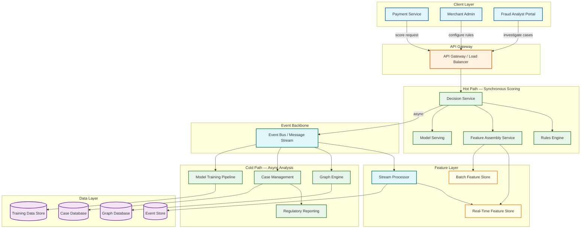
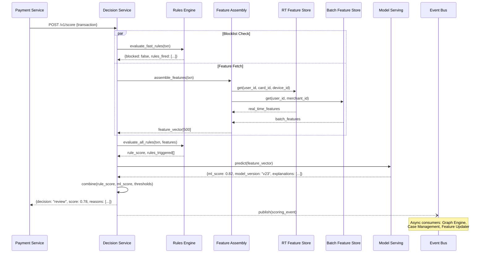
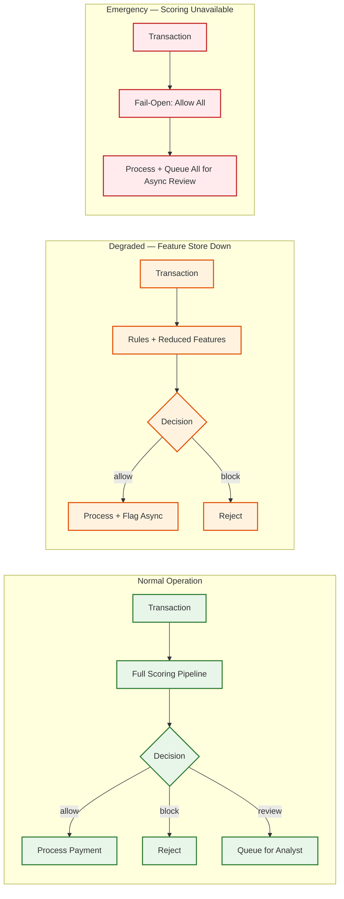
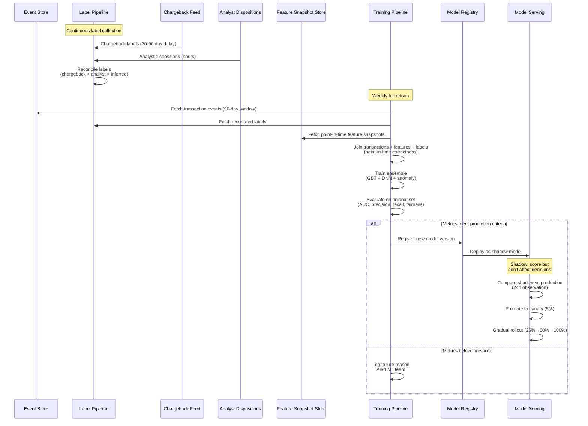
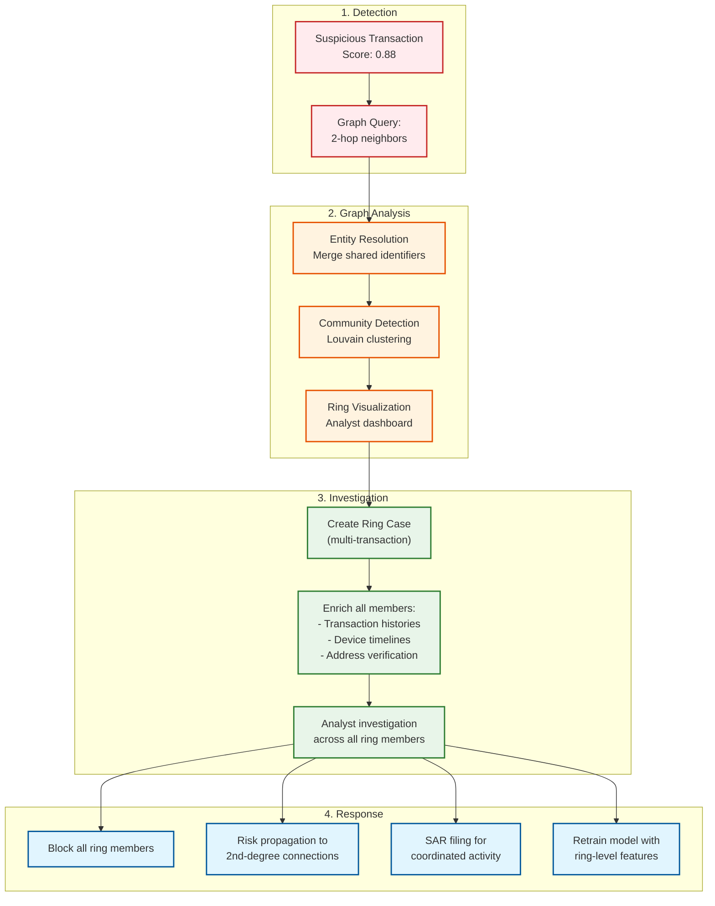

# High-Level Design

## Architecture Overview

The fraud detection system uses a **dual-path architecture**: a synchronous **hot path** that scores transactions in real time (< 100ms), and an asynchronous **cold path** that performs deep analysis, graph traversal, model retraining, and case management. The hot path is optimized for latency; the cold path is optimized for thoroughness.



---

## Core Components

### 1. Decision Service (Orchestrator)

The Decision Service is the entry point for scoring requests. It orchestrates the scoring pipeline:

1. Receives transaction payload from the payment service
2. Calls the Rules Engine (fast-path rules: blocklists, sanctions)
3. If not immediately blocked, triggers Feature Assembly in parallel with remaining rule evaluation
4. Passes assembled feature vector to Model Serving
5. Combines rule outcomes + model score into a final decision (allow / block / review)
6. Returns decision with latency budget tracking
7. Publishes transaction event to the event bus (async)

**Key Design Decision**: The Decision Service implements a **circuit breaker** on each downstream dependency. If the feature store or model serving is unhealthy, it falls back to rules-only scoring rather than blocking all transactions.

### 2. Rules Engine

Evaluates deterministic, human-authored rules before and alongside ML scoring:

| Rule Category | Examples | Evaluation Time |
|---------------|----------|-----------------|
| **Blocklists** | Known fraudulent card BINs, device IDs, IP addresses | < 2ms (hash lookup) |
| **Velocity Checks** | > 5 transactions in 1 minute from same card | < 5ms (counter lookup) |
| **Geo-fencing** | Transaction country differs from card-issuing country | < 3ms |
| **Amount Thresholds** | Single transaction > $10,000 | < 1ms |
| **Time-based Rules** | Transaction at 3 AM in cardholder's timezone | < 2ms |
| **Device Rules** | New device + new IP + high amount | < 3ms |
| **Merchant Rules** | High-risk merchant category code (MCC) | < 1ms |

Rules are versioned and hot-reloaded without service restart. Rule execution produces an **audit trail** documenting which rules fired and their outcomes.

### 3. Feature Assembly Service

Assembles the feature vector for ML scoring by querying two stores:

- **Real-Time Feature Store**: Backed by an in-memory data grid, stores features updated with every transaction (velocity counters, session state, recent device fingerprints). Features are computed by the Stream Processor and written with < 1 second latency.
- **Batch Feature Store**: Backed by a key-value store, stores features computed by periodic batch jobs (30-day spending profile, merchant risk score, account tenure signals). Updated hourly or daily.

The assembly step fetches features by entity keys (user_id, card_id, device_id, merchant_id, ip_address), merges them into a single vector, applies default values for missing features, and returns a typed feature vector within the latency budget.

### 4. Model Serving

Serves an ensemble of ML models optimized for inference speed:

| Model Type | Role | Latency | Format |
|------------|------|---------|--------|
| Gradient Boosted Trees (GBT) | Primary scorer; handles tabular features | < 10ms | Compiled decision trees |
| Neural Network (DNN) | Captures non-linear interaction patterns | < 15ms | Optimized inference runtime |
| Anomaly Detection | Flags transactions far from learned normal behavior | < 5ms | Isolation forest / autoencoder |
| Ensemble Aggregator | Weighted combination of model scores | < 2ms | Configurable weights |

Models are served using a **canary deployment** strategy: new model versions receive 5% traffic initially, ramping to 100% over 24 hours if metrics remain healthy. Shadow mode allows new models to score without affecting decisions.

### 5. Stream Processor

Consumes transaction events from the event bus and computes real-time features:

- **Velocity Features**: Sliding window counts (transactions per minute/hour/day per entity)
- **Device Fingerprint Matching**: Similarity score between current and historical device signatures
- **Behavioral Biometrics**: Typing speed, navigation patterns, session duration anomalies
- **Cross-Entity Features**: Number of distinct cards used from same device in last hour

Uses **tumbling and sliding windows** with watermark-based event-time processing to handle late-arriving events.

### 6. Graph Engine

Performs asynchronous graph analysis on the entity relationship graph:

- **Entity Resolution**: Links accounts sharing devices, addresses, phone numbers, or payment instruments
- **Community Detection**: Identifies clusters of tightly connected entities (potential fraud rings)
- **Risk Propagation**: Propagates fraud labels through the graph---if one node is confirmed fraud, connected nodes receive elevated risk
- **Pattern Matching**: Detects known fraud graph motifs (money mule chains, bust-out patterns)

Graph queries run asynchronously and update entity risk scores in the Batch Feature Store.

### 7. Case Management

Manages the analyst investigation workflow:

- Receives flagged transactions from the Decision Service
- Enriches cases with graph context, transaction history, device intelligence, and external data
- Assigns cases to analyst queues based on priority, expertise, and workload
- Captures analyst dispositions (confirmed fraud, false positive, escalation)
- Publishes disposition events for model retraining feedback

### 8. Regulatory Reporting

Automates compliance filing:

- Monitors confirmed fraud patterns against SAR/STR filing thresholds
- Auto-generates SAR narrative drafts from case data and graph context
- Tracks filing deadlines and escalates approaching due dates
- Maintains audit trail of all filing decisions and submissions

---

## Data Flow: Transaction Scoring



---

## Key Design Decisions

### 1. Synchronous Inline Scoring vs. Asynchronous Post-Authorization

**Decision**: Synchronous inline scoring on the payment critical path.

| Option | Pros | Cons |
|--------|------|------|
| **Inline (chosen)** | Blocks fraud before money moves; no chargeback cost | Adds latency to payment; availability risk |
| **Post-authorization** | No payment latency impact; can do deeper analysis | Fraud executes; must claw back funds; higher loss |

**Rationale**: The cost of a completed fraudulent transaction (fraud amount + chargeback fees + reputation) far exceeds the cost of 50-100ms added latency. Fail-open circuit breaker mitigates availability risk.

### 2. Rules Engine + ML Hybrid vs. ML-Only

**Decision**: Hybrid architecture with rules executing first.

**Rationale**: Rules provide immediate defense against known attack vectors (blocklists catch 30-40% of fraud with zero ML latency), explainability for compliance, and a safety net when ML models are being retrained. ML catches novel patterns rules cannot anticipate. The layers are complementary, not redundant.

### 3. Feature Store: Pre-Computed vs. On-Demand Computation

**Decision**: Pre-computed features with event-driven updates.

**Rationale**: Computing 200-500 features on-demand during scoring would blow the 100ms latency budget. Pre-computing via stream processing and storing in a low-latency feature store amortizes computation cost across time. The trade-off is eventual consistency---a feature might be 0-1 seconds stale. For fraud detection, sub-second staleness is acceptable.

### 4. Single Model vs. Model Ensemble

**Decision**: Ensemble of specialized models.

**Rationale**: Different model architectures excel at different fraud patterns. GBT excels on tabular features with clear splitting points. Neural networks capture complex interaction patterns. Anomaly detection catches zero-day attack vectors with no training labels. A weighted ensemble outperforms any single model by 5-15% AUC-ROC improvement.

### 5. Graph Analysis: Inline vs. Asynchronous

**Decision**: Asynchronous graph analysis with pre-computed risk scores.

**Rationale**: Full graph traversal (2-3 hop neighbor queries, community detection) takes 200-2000ms---incompatible with 100ms scoring budget. Instead, graph-derived risk scores are pre-computed and stored as batch features. Real-time graph queries are reserved for high-value/high-risk transactions in the cold path.

---

## Fail-Open Architecture



The system must **never** become a single point of failure for the payment platform. Degradation modes are carefully designed:

1. **Feature store partial failure**: Score with available features + elevated rule sensitivity
2. **Model serving failure**: Fall back to rules-only scoring with conservative thresholds
3. **Complete scoring failure**: Allow all transactions, queue for async review, alert operations

---

## Component Interaction Summary

| Component | Depends On | Depended By | Failure Mode |
|-----------|-----------|-------------|--------------|
| Decision Service | Rules Engine, Feature Assembly, Model Serving | Payment Service | Fail-open; allow + async review |
| Rules Engine | Rule config store | Decision Service | Allow without rules; use cached rules |
| Feature Assembly | RT Feature Store, Batch Feature Store | Decision Service | Score with partial features |
| Model Serving | Model artifact store | Decision Service | Fall back to rules-only |
| Stream Processor | Event Bus | RT Feature Store | Features go stale; scoring continues |
| Graph Engine | Graph DB, Event Bus | Batch Feature Store | Graph risk scores go stale |
| Case Management | Case DB, Event Bus | Analysts, Regulatory Reporting | Cases queue up; no data loss |

---

## Data Flow: Model Retraining Pipeline



---

## Data Flow: Step-Up Authentication Decision

```
Step-up authentication adds a challenge layer between "review" and "block":

Transaction arrives → Scoring pipeline → Score = 0.72

Decision logic with step-up:
  IF score >= 0.90: BLOCK (high confidence fraud)
  IF score >= 0.75: REVIEW (queue for analyst)
  IF score >= 0.55: STEP-UP (challenge the user)
  IF score < 0.55: ALLOW

Step-up challenge selection:
┌─────────────────────────────────────────────────────────┐
│              Step-Up Challenge Matrix                     │
├──────────────┬─────────────┬──────────────┬─────────────┤
│ Risk Signal  │ Mobile App  │ Web Browser  │ API/Token   │
├──────────────┼─────────────┼──────────────┼─────────────┤
│ New device   │ Biometric   │ 3D Secure    │ SMS OTP     │
│ Geo anomaly  │ Push notif  │ 3D Secure    │ SMS OTP     │
│ High amount  │ PIN + Bio   │ 3D Secure    │ Phone call  │
│ Velocity     │ Push notif  │ Email OTP    │ SMS OTP     │
│ Account age  │ Full KYC    │ Full KYC     │ Full KYC    │
│ < 30 days    │             │              │             │
└──────────────┴─────────────┴──────────────┴─────────────┘

Challenge success rates (legitimate users):
  Biometric (fingerprint/face): 98% pass rate
  Push notification: 95% pass rate
  3D Secure: 85% pass rate
  SMS OTP: 90% pass rate
  Email OTP: 80% pass rate
  Full KYC: 70% completion rate

Impact: Step-up converts 60-70% of "review zone" transactions
into confirmed legitimate, reducing analyst queue by ~3,000 cases/day
```

---

## Data Flow: Fraud Ring Investigation Workflow



---

## Cross-Merchant Intelligence Architecture

```
Problem: Fraud on Merchant A's device should elevate risk for the same device
on Merchant B. Individual merchants see only their own transactions.

Cross-Merchant Intelligence Network:

┌──────────────────────────────────────────────────────────────────┐
│                     Fraud Intelligence Hub                        │
│                                                                    │
│  Aggregated Signals (privacy-preserving):                         │
│  ├── Device reputation (hash → fraud count across all merchants)  │
│  ├── IP reputation (subnet → fraud density)                       │
│  ├── Card BIN risk (BIN → fraud rate network-wide)                │
│  ├── Email domain risk (domain → abuse rate)                      │
│  └── Velocity across merchants (entity → cross-merchant speed)    │
│                                                                    │
│  Privacy model:                                                   │
│  ├── No raw PII shared between merchants                         │
│  ├── Signals are aggregated and anonymized                       │
│  ├── Each merchant contributes and consumes signals               │
│  └── Differential privacy ensures no individual leakage           │
└──────────────────────────────────────────────────────────────────┘
         ▲               ▲               ▲               ▲
         │               │               │               │
    ┌────┴───┐     ┌────┴───┐     ┌────┴───┐     ┌────┴───┐
    │Merchant│     │Merchant│     │Merchant│     │Merchant│
    │   A    │     │   B    │     │   C    │     │   N    │
    └────────┘     └────────┘     └────────┘     └────────┘

Network effect: Each additional merchant improves detection for ALL merchants.
At 1,000 merchants: fraud patterns detected 3x faster than single-merchant.
```
