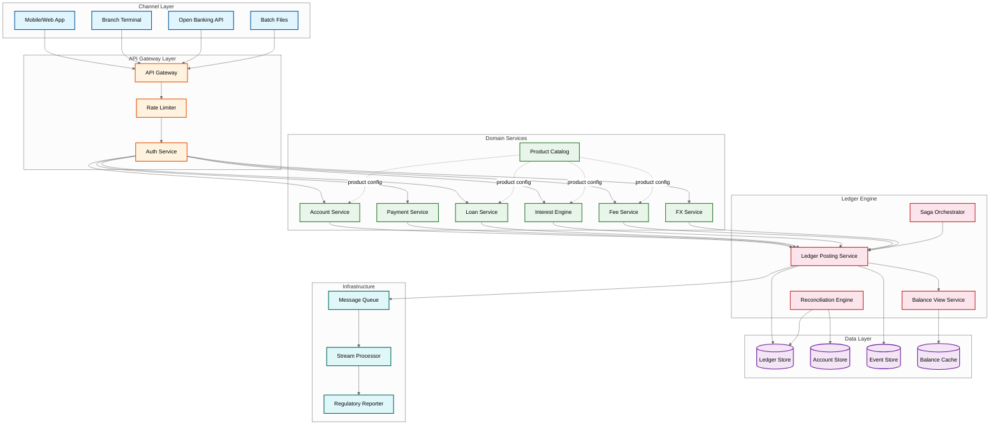
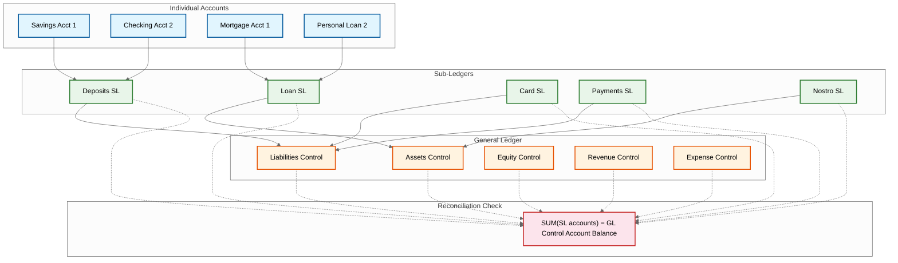
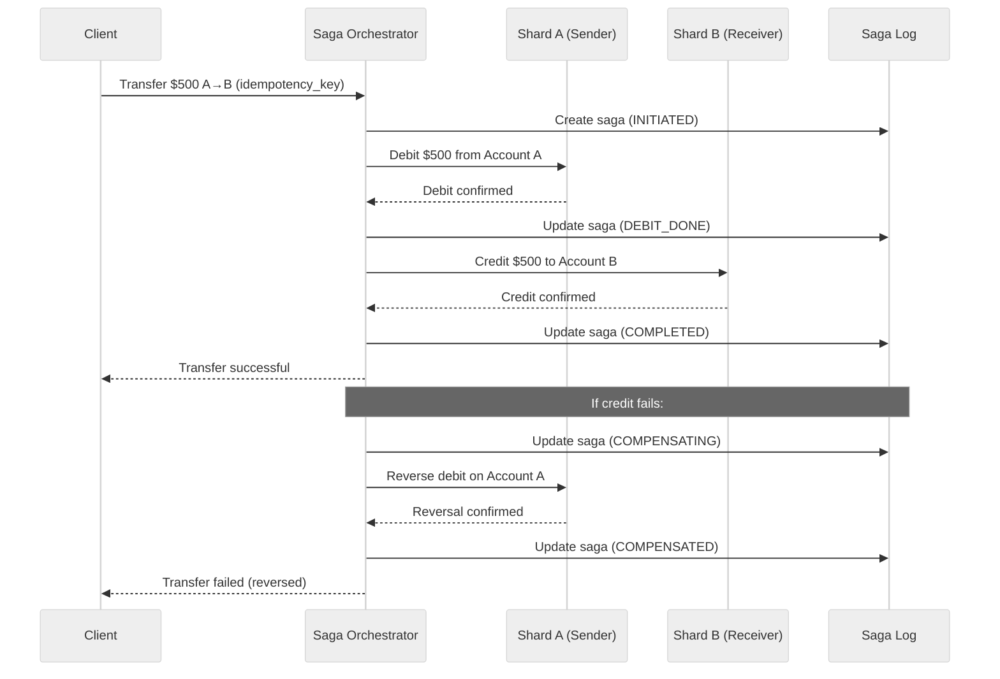
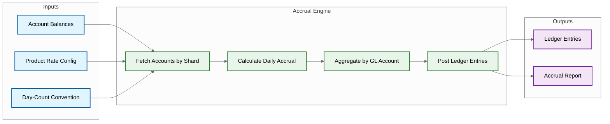
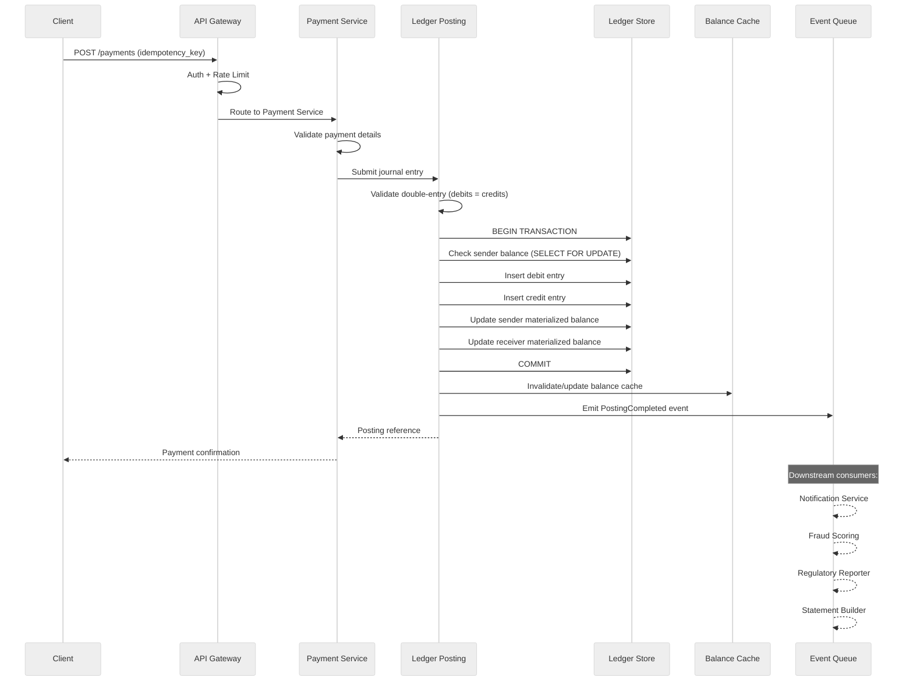
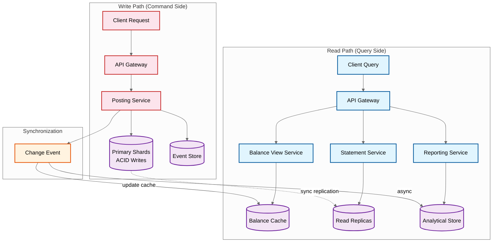
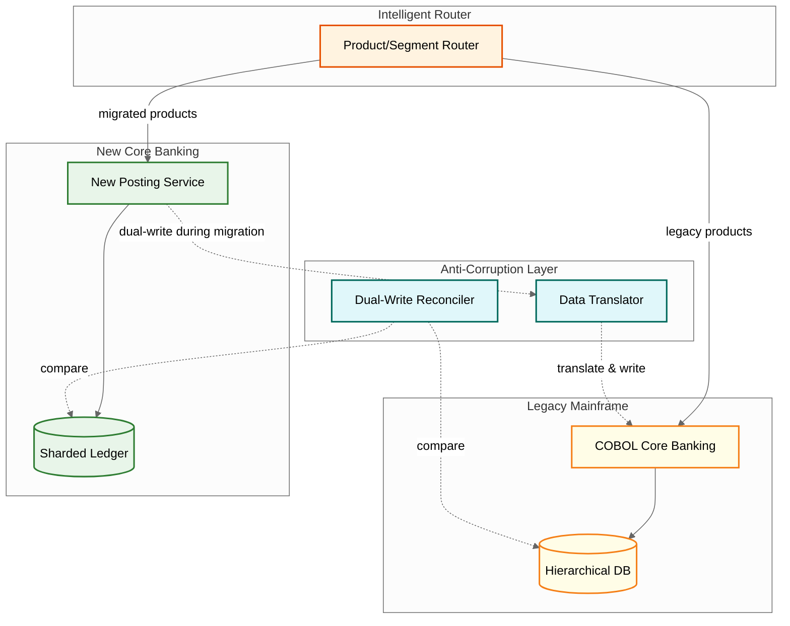
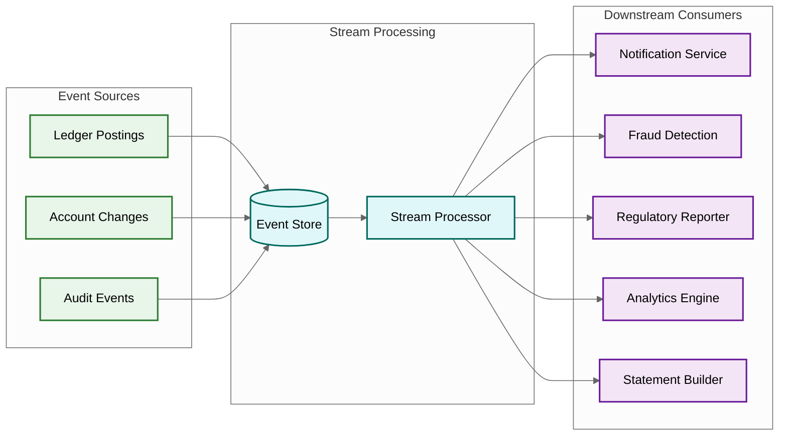

# High-Level Design

## Architecture Overview

The core banking system follows a **layered architecture** with clear separation between the API gateway layer, the domain services layer (organized by banking domain), the ledger engine (the single source of truth), and the data layer. The design uses **CQRS** (Command Query Responsibility Segregation) to separate the write-heavy posting path from the read-heavy query path, and **event sourcing** to maintain an immutable, append-only ledger that doubles as an audit trail.



---

## Core Components

### 1. Ledger Posting Service

The central component---every financial operation ultimately produces a call to the Ledger Posting Service. It:

- Accepts a **journal entry** (a set of debit/credit entry pairs that must balance to zero)
- Validates the double-entry Rule that never changes (sum of debits = sum of credits within the journal)
- Performs business rule validation (sufficient balance, account status, product limits)
- Writes entries atomically to the ledger store
- Updates materialized balances in the same transaction
- Emits a ledger event to the event store and message queue
- Returns a posting reference (idempotent---same idempotency key returns same result)

### 2. General Ledger / Sub-Ledger Architecture



**Chart of Accounts (CoA)**: A hierarchical numbering system that classifies every GL account:
- **1xxx**: Assets (loans receivable, nostro balances, fixed assets)
- **2xxx**: Liabilities (customer deposits, accrued interest payable, interbank borrowings)
- **3xxx**: Equity (retained earnings, capital reserves)
- **4xxx**: Revenue (interest income, fee income, FX gains)
- **5xxx**: Expenses (interest expense, operational costs, provisions)

### 3. Saga Orchestrator (Cross-Shard Transactions)

When a transaction involves accounts on different database shards, the saga orchestrator coordinates:



### 4. Interest Calculation Engine

Processes interest accrual as a batch operation:



### 5. Balance View Service (CQRS Read Side)

Maintains materialized balances to avoid summing ledger entries:

- **Ledger Balance**: Sum of all posted entries (authoritative, derived from ledger)
- **Available Balance**: Ledger balance minus holds, plus credit limits
- **Projected Balance**: Available balance including pending/scheduled transactions
- Updated atomically with each ledger posting via the same database transaction
- Cached in a distributed cache for sub-50ms read latency

### 6. Product Catalog

Declarative product definitions that drive account behavior:

- Interest rate schedules (fixed, variable, tiered by balance band)
- Fee structures (monthly, event-driven, volume-based)
- Limit configurations (daily transaction limits, minimum balance)
- Lifecycle events (dormancy rules, maturity actions, rollover)
- Accrual parameters (day-count convention, compounding frequency)

---

## Data Flow: End-to-End Payment Posting



---

## Key Design Decisions

| Decision | Choice | Rationale |
|----------|--------|-----------|
| **Ledger model** | Immutable append-only entries | Financial records must never be modified; corrections via reversing entries; enables audit trail and event replay |
| **Consistency model** | Strong consistency for posting; eventual for reporting | The double-entry Rule that never changes cannot tolerate eventual consistency; reporting views lag by seconds |
| **Cross-shard coordination** | Saga pattern with compensating transactions | 2PC is too fragile for high-throughput financial workloads; sagas provide recovery without distributed locks |
| **Balance computation** | Materialized balance updated in posting transaction | Summing ledger entries per query is O(n) and infeasible at scale; materialized balance is O(1) read |
| **Interest accrual** | Batch processing with parallel shard-level workers | Real-time per-transaction accrual creates excessive ledger entries; daily batch is industry standard |
| **Product configuration** | Declarative catalog (data-driven, not code-driven) | Enables product changes without code deployment; new products launch via configuration |
| **Multi-tenant isolation** | Shared infrastructure, separate schemas / encryption keys | Cost-efficient while maintaining regulatory data segregation requirements |
| **Event sourcing** | All postings emit events to an append-only event store | Enables audit trail, downstream processing, and full ledger reconstruction from events |
| **FX handling** | Rate locked at transaction time, stored with entry | Prevents post-hoc rate disputes; enables P&L attribution |
| **Idempotency** | Client-generated idempotency key, server-side dedup | Network retries must never create duplicate ledger entries |

---

## Technology Considerations

| Component | Approach | Notes |
|-----------|----------|-------|
| Ledger Store | Sharded relational database | ACID guarantees required; shard by account_id hash |
| Event Store | Append-only log (distributed log broker) | High throughput, ordered, durable |
| Balance Cache | Distributed in-memory cache | Sub-50ms reads; invalidated on posting |
| Saga Coordinator | Stateful workflow engine or dedicated saga service | Durable state for in-flight sagas |
| Batch Processing | Parallel worker pool per shard | Interest accrual, fee posting, statement generation |
| Message Queue | Durable message broker | At-least-once delivery for downstream events |
| API Gateway | Standard API gateway with mTLS | Rate limiting, authentication, request routing |
| Regulatory Reports | Columnar analytical store | Optimized for aggregate queries over ledger data |

---

## CQRS Architecture Deep Dive

The write path (posting) and read path (balance queries, statements, reporting) operate through fundamentally different infrastructure:



### Consistency Boundaries

| Operation | Consistency | Mechanism | Latency |
|-----------|------------|-----------|---------|
| **Ledger posting** | Strong (serializable) | Row-level lock within ACID transaction | < 500ms |
| **Balance (payment auth)** | Strong | Read from primary with SELECT FOR UPDATE | < 100ms |
| **Balance (informational)** | Eventual (~100ms stale) | Read from balance cache | < 5ms |
| **Statement** | Eventual (~1s stale) | Read from async replica | < 50ms |
| **GL reconciliation** | Point-in-time snapshot | Snapshot isolation on replicas | Batch |
| **Regulatory reports** | Eventual (~5s stale) | Read from analytical store | Batch |
| **Audit trail** | Strong (append-only) | Synchronous write to audit store | < 100ms |

---

## Legacy Modernization Architecture

Most core banking deployments are migrations from legacy mainframes, not greenfield builds. The **strangler fig pattern** enables incremental migration:



### Migration Phases

| Phase | Scope | Duration | Risk Level |
|-------|-------|----------|-----------|
| **Phase 0: Shadow mode** | New system receives copies of all transactions; no customer impact | 3-6 months | Low |
| **Phase 1: New products only** | New savings products on new core; legacy products stay on mainframe | 6-12 months | Medium |
| **Phase 2: Segment migration** | Migrate retail deposit customers by segment (new customers first, then cohorts) | 12-18 months | High |
| **Phase 3: Full migration** | All products and customers on new core; legacy decommissioned | 6-12 months | Very High |
| **Phase 4: Decommission** | Legacy system retired; anti-corruption layer removed | 3-6 months | Low |

### Dual-Write Reconciliation

During migration, both systems process the same transactions. Reconciliation catches divergence:

```
FUNCTION reconcile_dual_write(entity_id, business_date):
    // Compare account balances between legacy and new systems
    legacy_balances = query_legacy_system(entity_id, business_date)
    new_balances = query_new_system(entity_id, business_date)

    FOR EACH account IN migrated_accounts:
        legacy_bal = legacy_balances[account]
        new_bal = new_balances[account]

        IF ABS(legacy_bal - new_bal) > 0.01:
            LOG_BREAK(account, legacy_bal, new_bal)
            IF ABS(legacy_bal - new_bal) > 100.00:
                CRITICAL_ALERT("Material dual-write divergence")
                PAUSE_MIGRATION(account)

    RETURN reconciliation_report
```

---

## Data Pipeline Architecture



### Event Schema

```
PostingCompleted Event:
{
    "event_id": "evt-uuid",
    "event_type": "POSTING_COMPLETED",
    "timestamp": "2026-03-09T14:30:00Z",
    "journal_id": "jrn-uuid",
    "entity_id": "ent-uuid",
    "entries": [
        {
            "account_id": "acc-uuid",
            "entry_type": "DEBIT",
            "amount": 5000.00,
            "currency": "USD",
            "balance_after": 45000.00,
            "gl_account_code": "2100"
        },
        {
            "account_id": "acc-uuid-2",
            "entry_type": "CREDIT",
            "amount": 5000.00,
            "currency": "USD",
            "balance_after": 12500.00,
            "gl_account_code": "2100"
        }
    ],
    "metadata": {
        "transaction_type": "PAYMENT",
        "channel": "MOBILE",
        "originating_ip": "masked"
    }
}
```

### Consumer Group Isolation

| Consumer Group | Partition Strategy | Processing Guarantee | Max Lag |
|---------------|-------------------|---------------------|---------|
| **Fraud detection** | account_id (co-located with posting) | At-least-once | < 1s |
| **Notifications** | account_id | At-least-once | < 3s |
| **Regulatory reporting** | entity_id | Exactly-once | < 60s |
| **Analytics** | entity_id | At-least-once | < 5 min |
| **Statement builder** | account_id | Exactly-once | < 1 hour |
| **Audit archival** | time-based | Exactly-once | < 10 min |

---

## Technology Comparison: Core Banking Platforms

| Aspect | Traditional Mainframe | Thought Machine Vault | Temenos Transact | Modern Custom Build |
|--------|----------------------|----------------------|------------------|-------------------|
| **Architecture** | Monolithic, batch-oriented | Cloud-native, microservices | Hybrid (monolith + APIs) | Event-sourced, CQRS |
| **Ledger model** | Sequential file updates | Smart contract-based posting | Relational tables | Immutable append-only |
| **Product config** | Code changes (COBOL) | Smart contracts (declarative) | T24 configuration | Product catalog DSL |
| **Scaling** | Vertical (bigger mainframe) | Horizontal (container orchestration) | Vertical + limited horizontal | Horizontal (sharded) |
| **Interest engine** | Batch (overnight) | Real-time + batch | Batch (overnight) | Batch with streaming updates |
| **Multi-tenancy** | Separate instances | Native multi-tenant | Per-instance | Schema-level isolation |
| **Deployment** | Quarterly releases | Continuous deployment | Monthly releases | Continuous deployment |
| **Cost model** | Mainframe MIPS-based | Per-account per-month | License + hosting | Infrastructure-based |
