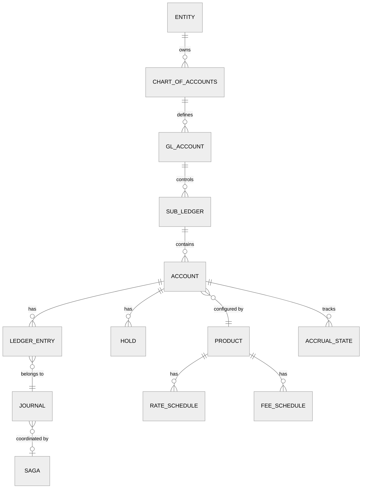

# Low-Level Design

## Data Models

### Core Entity Relationship



### Account Table

```
Table: accounts
├── account_id          UUID PRIMARY KEY
├── entity_id           UUID NOT NULL          -- banking entity / tenant
├── sub_ledger_id       UUID NOT NULL          -- FK to sub_ledger
├── product_id          UUID NOT NULL          -- FK to product catalog
├── account_number      VARCHAR(34) UNIQUE     -- IBAN or internal number
├── account_type        ENUM('DEPOSIT','LOAN','CREDIT_LINE','INTERNAL','NOSTRO','VOSTRO')
├── currency            CHAR(3) NOT NULL       -- ISO 4217 (USD, EUR, GBP)
├── status              ENUM('ACTIVE','DORMANT','FROZEN','CLOSED','PENDING')
├── opened_at           TIMESTAMP NOT NULL
├── closed_at           TIMESTAMP NULL
├── customer_id         UUID NULL              -- NULL for internal GL accounts
│
├── -- Materialized Balances (updated atomically with ledger postings)
├── ledger_balance      DECIMAL(18,4) NOT NULL DEFAULT 0  -- sum of all posted entries
├── available_balance   DECIMAL(18,4) NOT NULL DEFAULT 0  -- ledger - holds + credit_limit
├── hold_balance        DECIMAL(18,4) NOT NULL DEFAULT 0  -- sum of active holds
├── credit_limit        DECIMAL(18,4) NOT NULL DEFAULT 0  -- for credit accounts
├── balance_version     BIGINT NOT NULL DEFAULT 0         -- optimistic concurrency
│
├── -- Metadata
├── created_at          TIMESTAMP NOT NULL
├── updated_at          TIMESTAMP NOT NULL
└── INDEX idx_entity_customer (entity_id, customer_id)
    INDEX idx_sub_ledger (sub_ledger_id)
    INDEX idx_product (product_id)
    INDEX idx_status (status)

Shard key: account_id (hash-based sharding)
```

### Ledger Entry Table (Immutable, Append-Only)

```
Table: ledger_entries
├── entry_id            UUID PRIMARY KEY
├── journal_id          UUID NOT NULL          -- groups entries into a balanced journal
├── account_id          UUID NOT NULL          -- FK to accounts
├── entity_id           UUID NOT NULL          -- for tenant isolation
├── entry_type          ENUM('DEBIT','CREDIT')
├── amount              DECIMAL(18,4) NOT NULL -- always positive
├── currency            CHAR(3) NOT NULL
├── balance_after       DECIMAL(18,4) NOT NULL -- account balance after this entry
│
├── -- Temporal
├── posting_date        DATE NOT NULL          -- when posted to ledger
├── value_date          DATE NOT NULL          -- when value is effective (for interest)
├── created_at          TIMESTAMP NOT NULL
│
├── -- Classification
├── transaction_type    VARCHAR(50) NOT NULL   -- PAYMENT, INTEREST, FEE, TRANSFER, etc.
├── gl_account_code     VARCHAR(20) NOT NULL   -- Chart of Accounts code
├── description         VARCHAR(255)
├── reference_id        VARCHAR(100)           -- external reference
│
├── -- Immutability enforcement
├── is_reversal         BOOLEAN DEFAULT FALSE
├── reversed_entry_id   UUID NULL              -- points to entry being reversed
│
└── INDEX idx_account_date (account_id, posting_date DESC)
    INDEX idx_journal (journal_id)
    INDEX idx_gl_code_date (gl_account_code, posting_date)
    INDEX idx_value_date (account_id, value_date)

Shard key: account_id (co-located with accounts table)
Partition key: posting_date (monthly partitions for archival)

CONSTRAINT: No UPDATE or DELETE allowed (enforced at DB and application level)
```

### Journal Table

```
Table: journals
├── journal_id          UUID PRIMARY KEY
├── entity_id           UUID NOT NULL
├── idempotency_key     VARCHAR(128) UNIQUE    -- client-generated dedup key
├── journal_type        VARCHAR(50) NOT NULL   -- PAYMENT, ACCRUAL, FEE, SETTLEMENT
├── status              ENUM('POSTED','REVERSED')
├── total_amount        DECIMAL(18,4) NOT NULL -- sum of debit amounts (= sum of credits)
├── currency            CHAR(3) NOT NULL
├── posting_date        DATE NOT NULL
├── value_date          DATE NOT NULL
├── description         VARCHAR(255)
├── created_by          VARCHAR(100) NOT NULL  -- actor / service name
├── created_at          TIMESTAMP NOT NULL
├── saga_id             UUID NULL              -- FK to saga (if cross-shard)
│
└── INDEX idx_idempotency (idempotency_key)
    INDEX idx_posting_date (entity_id, posting_date)
```

### Saga Table (Cross-Shard Coordination)

```
Table: sagas
├── saga_id             UUID PRIMARY KEY
├── saga_type           VARCHAR(50) NOT NULL   -- TRANSFER, SETTLEMENT, FX_CONVERSION
├── status              ENUM('INITIATED','DEBIT_DONE','CREDIT_DONE','COMPLETED',
│                            'COMPENSATING','COMPENSATED','FAILED')
├── idempotency_key     VARCHAR(128) UNIQUE
├── source_account_id   UUID NOT NULL
├── target_account_id   UUID NOT NULL
├── amount              DECIMAL(18,4) NOT NULL
├── currency            CHAR(3) NOT NULL
│
├── -- Step tracking
├── debit_journal_id    UUID NULL
├── credit_journal_id   UUID NULL
├── compensation_journal_id UUID NULL
│
├── -- Retry / timeout
├── retry_count         INT DEFAULT 0
├── max_retries         INT DEFAULT 3
├── timeout_at          TIMESTAMP NOT NULL
│
├── created_at          TIMESTAMP NOT NULL
├── updated_at          TIMESTAMP NOT NULL
└── INDEX idx_status (status) WHERE status NOT IN ('COMPLETED','COMPENSATED','FAILED')
```

### Product Catalog

```
Table: products
├── product_id          UUID PRIMARY KEY
├── entity_id           UUID NOT NULL
├── product_code        VARCHAR(50) UNIQUE
├── product_name        VARCHAR(100) NOT NULL
├── product_type        ENUM('SAVINGS','CHECKING','TERM_DEPOSIT','PERSONAL_LOAN',
│                            'MORTGAGE','CREDIT_LINE','NOSTRO')
├── currency            CHAR(3) NOT NULL
├── status              ENUM('ACTIVE','DISCONTINUED','DRAFT')
│
├── -- Interest Configuration
├── interest_enabled    BOOLEAN DEFAULT FALSE
├── rate_type           ENUM('FIXED','VARIABLE','TIERED') NULL
├── day_count_convention ENUM('ACT_365','ACT_360','ACT_ACT','30_360') NULL
├── compounding_freq    ENUM('DAILY','MONTHLY','QUARTERLY','ANNUALLY','NONE') NULL
├── accrual_frequency   ENUM('DAILY','MONTHLY') DEFAULT 'DAILY'
│
├── -- Limits
├── min_balance         DECIMAL(18,4) DEFAULT 0
├── max_balance         DECIMAL(18,4) NULL
├── daily_txn_limit     DECIMAL(18,4) NULL
│
├── -- Fees (references fee_schedules table)
├── -- Lifecycle
├── dormancy_days       INT NULL               -- days of inactivity before dormant
├── maturity_months     INT NULL               -- for term deposits
│
├── effective_from      DATE NOT NULL
├── effective_to        DATE NULL
├── created_at          TIMESTAMP NOT NULL
└── INDEX idx_entity_type (entity_id, product_type)
```

### Interest Accrual State

```
Table: accrual_state
├── account_id          UUID PRIMARY KEY       -- FK to accounts
├── last_accrual_date   DATE NOT NULL
├── accrued_amount      DECIMAL(18,6) NOT NULL DEFAULT 0  -- unpaid accrued interest
├── principal_balance   DECIMAL(18,4) NOT NULL -- balance used for accrual calc
├── applicable_rate     DECIMAL(8,6) NOT NULL  -- annual rate as decimal
├── rate_tier           VARCHAR(50) NULL       -- which rate tier applies
├── next_capitalization DATE NULL              -- when accrued interest compounds
├── updated_at          TIMESTAMP NOT NULL
└── INDEX idx_accrual_date (last_accrual_date)
```

### GL Account & Chart of Accounts

```
Table: chart_of_accounts
├── coa_id              UUID PRIMARY KEY
├── entity_id           UUID NOT NULL
├── account_code        VARCHAR(20) UNIQUE     -- e.g., "2100" for Customer Deposits
├── account_name        VARCHAR(100) NOT NULL
├── account_category    ENUM('ASSET','LIABILITY','EQUITY','REVENUE','EXPENSE')
├── parent_code         VARCHAR(20) NULL       -- for hierarchical CoA
├── is_control_account  BOOLEAN DEFAULT FALSE  -- TRUE = has sub-ledger
├── sub_ledger_type     VARCHAR(50) NULL       -- DEPOSITS, LOANS, etc.
├── normal_balance      ENUM('DEBIT','CREDIT') NOT NULL
├── status              ENUM('ACTIVE','INACTIVE')
├── created_at          TIMESTAMP NOT NULL
└── INDEX idx_entity_category (entity_id, account_category)
```

---

## API Design

### Ledger Posting API

```
POST /v1/journals
Headers:
  Idempotency-Key: {client-generated UUID}
  X-Entity-Id: {banking entity ID}
  Authorization: Bearer {token}

Request:
{
  "journal_type": "PAYMENT",
  "posting_date": "2026-03-09",
  "value_date": "2026-03-09",
  "description": "Salary payment to employee",
  "entries": [
    {
      "account_id": "acc-sender-uuid",
      "entry_type": "DEBIT",
      "amount": 5000.00,
      "gl_account_code": "2100",
      "description": "Salary disbursement"
    },
    {
      "account_id": "acc-receiver-uuid",
      "entry_type": "CREDIT",
      "amount": 5000.00,
      "gl_account_code": "2100",
      "description": "Salary received"
    }
  ]
}

Response (201 Created):
{
  "journal_id": "jrn-uuid",
  "status": "POSTED",
  "posting_reference": "POST-20260309-ABC123",
  "entries": [
    { "entry_id": "ent-1-uuid", "balance_after": 45000.00 },
    { "entry_id": "ent-2-uuid", "balance_after": 12500.00 }
  ],
  "created_at": "2026-03-09T14:30:00Z"
}

Errors:
  400: Entries do not balance (sum debits ≠ sum credits)
  402: Insufficient balance on debit account
  409: Duplicate idempotency key (returns original response)
  423: Account frozen or closed
```

### Balance Inquiry API

```
GET /v1/accounts/{account_id}/balance
Headers:
  X-Entity-Id: {banking entity ID}

Response (200 OK):
{
  "account_id": "acc-uuid",
  "currency": "USD",
  "ledger_balance": 50000.00,
  "available_balance": 47500.00,
  "hold_balance": 2500.00,
  "credit_limit": 0.00,
  "as_of": "2026-03-09T14:30:00Z",
  "balance_version": 4521
}
```

### Account Statement API

```
GET /v1/accounts/{account_id}/statements?from=2026-02-01&to=2026-02-28&page=1&size=50

Response (200 OK):
{
  "account_id": "acc-uuid",
  "period": { "from": "2026-02-01", "to": "2026-02-28" },
  "opening_balance": 42000.00,
  "closing_balance": 50000.00,
  "total_debits": 15000.00,
  "total_credits": 23000.00,
  "entries": [
    {
      "entry_id": "ent-uuid",
      "posting_date": "2026-02-03",
      "value_date": "2026-02-03",
      "entry_type": "CREDIT",
      "amount": 5000.00,
      "balance_after": 47000.00,
      "description": "Salary received",
      "reference_id": "PAY-20260203-XYZ"
    }
  ],
  "pagination": { "page": 1, "size": 50, "total_entries": 127 }
}
```

### Cross-Shard Transfer API (Internal)

```
POST /v1/transfers
Headers:
  Idempotency-Key: {UUID}

Request:
{
  "source_account_id": "acc-sender-uuid",
  "target_account_id": "acc-receiver-uuid",
  "amount": 1000.00,
  "currency": "USD",
  "description": "Internal fund transfer"
}

Response (202 Accepted):   -- async for cross-shard
{
  "saga_id": "saga-uuid",
  "status": "INITIATED",
  "estimated_completion": "2026-03-09T14:30:02Z"
}
```

### GL Reconciliation API

```
GET /v1/reconciliation/gl-summary?entity_id={uuid}&date=2026-03-09

Response (200 OK):
{
  "entity_id": "ent-uuid",
  "date": "2026-03-09",
  "status": "BALANCED",
  "summary": [
    {
      "gl_code": "2100",
      "gl_name": "Customer Deposits",
      "gl_balance": 8500000000.00,
      "sl_total": 8500000000.00,
      "difference": 0.00,
      "status": "RECONCILED"
    }
  ],
  "total_assets": 15200000000.00,
  "total_liabilities": 12800000000.00,
  "total_equity": 2400000000.00,
  "balance_check": "ASSETS = LIABILITIES + EQUITY: PASSED"
}
```

---

## Core Algorithms

### Algorithm 1: Atomic Ledger Posting with Balance Update

```
FUNCTION post_journal(journal_request):
    // Step 1: Validate double-entry Rule that never changes
    total_debits = SUM(entry.amount FOR entry IN journal_request.entries
                       WHERE entry.type = DEBIT)
    total_credits = SUM(entry.amount FOR entry IN journal_request.entries
                        WHERE entry.type = CREDIT)
    IF total_debits ≠ total_credits:
        RAISE BalanceError("Journal does not balance")

    // Step 2: Check idempotency
    existing = LOOKUP idempotency_cache[journal_request.idempotency_key]
    IF existing IS NOT NULL:
        RETURN existing.response

    // Step 3: Determine if cross-shard
    shards = UNIQUE(GET_SHARD(entry.account_id) FOR entry IN entries)
    IF LENGTH(shards) > 1:
        RETURN initiate_saga(journal_request)

    // Step 4: Single-shard atomic posting
    BEGIN TRANSACTION (SERIALIZABLE on affected accounts)

    FOR EACH entry IN journal_request.entries:
        // Lock account row
        account = SELECT * FROM accounts
                  WHERE account_id = entry.account_id
                  FOR UPDATE

        // Validate account status
        IF account.status NOT IN ('ACTIVE'):
            ROLLBACK
            RAISE AccountError("Account not active")

        // For debit entries: check sufficient balance
        IF entry.type = DEBIT:
            IF account.available_balance < entry.amount:
                ROLLBACK
                RAISE InsufficientFundsError()

        // Calculate new balance
        IF entry.type = DEBIT:
            new_ledger = account.ledger_balance - entry.amount
            new_available = account.available_balance - entry.amount
        ELSE:
            new_ledger = account.ledger_balance + entry.amount
            new_available = account.available_balance + entry.amount

        // Insert immutable ledger entry
        INSERT INTO ledger_entries (
            entry_id, journal_id, account_id, entry_type,
            amount, balance_after, posting_date, value_date,
            gl_account_code, ...
        ) VALUES (NEW_UUID(), journal_id, entry.account_id,
                  entry.type, entry.amount, new_ledger, ...)

        // Update materialized balance atomically
        UPDATE accounts SET
            ledger_balance = new_ledger,
            available_balance = new_available,
            balance_version = balance_version + 1,
            updated_at = NOW()
        WHERE account_id = entry.account_id

    // Insert journal record
    INSERT INTO journals (journal_id, idempotency_key, status, ...)
    VALUES (journal_id, request.idempotency_key, 'POSTED', ...)

    COMMIT TRANSACTION

    // Step 5: Post-commit
    CACHE idempotency_key → response (TTL: 24h)
    INVALIDATE balance_cache[affected_account_ids]
    EMIT event PostingCompleted(journal_id, entries)

    RETURN posting_response
```

### Algorithm 2: Daily Interest Accrual

```
FUNCTION run_daily_accrual(accrual_date):
    // Process each shard in parallel
    FOR EACH shard IN account_shards PARALLEL:

        // Fetch accounts needing accrual on this shard
        accounts = SELECT a.account_id, a.ledger_balance, a.currency,
                          s.accrued_amount, s.applicable_rate,
                          s.last_accrual_date, s.next_capitalization,
                          p.day_count_convention, p.compounding_freq
                   FROM accounts a
                   JOIN accrual_state s ON a.account_id = s.account_id
                   JOIN products p ON a.product_id = p.product_id
                   WHERE p.interest_enabled = TRUE
                     AND a.status = 'ACTIVE'
                     AND s.last_accrual_date < accrual_date
                   ORDER BY a.account_id

        // Batch process accounts
        FOR EACH batch OF 1000 accounts:
            journal_entries = []

            FOR EACH account IN batch:
                // Calculate day fraction based on convention
                days = accrual_date - account.last_accrual_date
                day_fraction = calculate_day_fraction(
                    days, account.day_count_convention, accrual_date)

                // Calculate daily interest
                // For tiered rates: calculate interest per tier bracket
                daily_interest = account.ledger_balance
                                 × account.applicable_rate
                                 × day_fraction

                // Round per regulatory standard
                daily_interest = ROUND(daily_interest, 4)  // 4 decimal precision

                // Check for capitalization (compounding)
                IF accrual_date >= account.next_capitalization:
                    // Compound: post accrued interest to principal
                    compound_amount = account.accrued_amount + daily_interest
                    ADD journal_entry: DEBIT interest_expense, compound_amount
                    ADD journal_entry: CREDIT account, compound_amount
                    UPDATE accrual_state SET accrued_amount = 0,
                        next_capitalization = NEXT_PERIOD(compounding_freq)
                ELSE:
                    // Accrue only (memo posting)
                    UPDATE accrual_state SET
                        accrued_amount = accrued_amount + daily_interest,
                        last_accrual_date = accrual_date

            // Post batch journal entries atomically
            post_journal(journal_entries)

    RETURN accrual_summary

FUNCTION calculate_day_fraction(days, convention, date):
    SWITCH convention:
        CASE ACT_365:  RETURN days / 365
        CASE ACT_360:  RETURN days / 360
        CASE ACT_ACT:  RETURN days / days_in_year(date)
        CASE 30_360:   RETURN adjusted_30_360_days(days) / 360
```

### Algorithm 3: GL Reconciliation

```
FUNCTION reconcile_gl(entity_id, reconciliation_date):
    breaks = []

    // Step 1: For each control account in CoA
    control_accounts = SELECT * FROM chart_of_accounts
                       WHERE entity_id = entity_id
                         AND is_control_account = TRUE

    FOR EACH control IN control_accounts:
        // Get GL control account balance
        gl_balance = SELECT SUM(
                        CASE WHEN entry_type = 'DEBIT' THEN amount
                             ELSE -amount END
                     ) FROM ledger_entries
                     WHERE gl_account_code = control.account_code
                       AND posting_date <= reconciliation_date

        // Get sum of all sub-ledger accounts
        sl_total = SELECT SUM(ledger_balance) FROM accounts
                   WHERE sub_ledger_id IN (
                       SELECT sub_ledger_id FROM sub_ledgers
                       WHERE gl_control_code = control.account_code
                   )

        // Compare
        difference = ABS(gl_balance - sl_total)
        IF difference > 0.01:  // tolerance for rounding
            breaks.ADD({
                gl_code: control.account_code,
                gl_balance: gl_balance,
                sl_total: sl_total,
                difference: difference
            })
            ALERT("GL Reconciliation break", control.account_code, difference)

    // Step 2: Verify accounting equation
    total_assets = SUM(gl_balance WHERE category = 'ASSET')
    total_liabilities = SUM(gl_balance WHERE category = 'LIABILITY')
    total_equity = SUM(gl_balance WHERE category = 'EQUITY')

    IF ABS(total_assets - total_liabilities - total_equity) > 0.01:
        CRITICAL_ALERT("Accounting equation violation!")

    // Step 3: Generate reconciliation report
    STORE reconciliation_report(entity_id, date, breaks, status)
    RETURN breaks
```

---

## Idempotency Strategy

| Layer | Mechanism | TTL | Purpose |
|-------|-----------|-----|---------|
| **Fast path** | Distributed cache lookup on idempotency_key | 24 hours | Instant dedup for retries |
| **Safety net** | UNIQUE constraint on journals.idempotency_key | Permanent | Prevents duplicates even if cache misses |
| **Cross-shard** | UNIQUE constraint on sagas.idempotency_key | Permanent | Dedup for saga-coordinated transfers |
| **Batch operations** | Composite key: (batch_run_id + account_id) | Per batch | Prevents double-accrual if batch restarts |

---

## Additional Data Models

### Rate Schedule Table

```
Table: rate_schedules
├── rate_schedule_id   UUID PRIMARY KEY
├── product_id         UUID NOT NULL          -- FK to products
├── rate_type          ENUM('FIXED','VARIABLE','TIERED','PROMOTIONAL')
├── effective_from     DATE NOT NULL
├── effective_to       DATE NULL              -- NULL = currently active
│
├── -- For fixed/variable rates
├── base_rate          DECIMAL(8,6) NULL      -- annual rate as decimal (e.g., 0.0450 = 4.50%)
├── spread             DECIMAL(8,6) NULL      -- added to reference rate for variable
├── reference_rate     VARCHAR(50) NULL       -- e.g., 'SOFR', 'EURIBOR', 'PRIME'
│
├── -- For promotional rates
├── promo_duration_days INT NULL
├── post_promo_schedule_id UUID NULL          -- schedule that applies after promo ends
│
├── created_at         TIMESTAMP NOT NULL
└── INDEX idx_product_effective (product_id, effective_from DESC)
```

### Rate Tier Table (For Tiered Rates)

```
Table: rate_tiers
├── tier_id            UUID PRIMARY KEY
├── rate_schedule_id   UUID NOT NULL          -- FK to rate_schedules
├── tier_order         INT NOT NULL           -- 1, 2, 3...
├── from_amount        DECIMAL(18,4) NOT NULL -- lower bound (inclusive)
├── to_amount          DECIMAL(18,4) NULL     -- upper bound (NULL = unlimited)
├── rate               DECIMAL(8,6) NOT NULL  -- annual rate for this tier
│
└── UNIQUE (rate_schedule_id, tier_order)
    INDEX idx_schedule_tiers (rate_schedule_id, tier_order)

Example for tiered savings:
  Tier 1: $0 - $10,000       → 2.00%
  Tier 2: $10,000 - $50,000  → 3.00%
  Tier 3: $50,000+           → 4.00%
```

### Fee Schedule Table

```
Table: fee_schedules
├── fee_schedule_id    UUID PRIMARY KEY
├── product_id         UUID NOT NULL
├── fee_name           VARCHAR(100) NOT NULL
├── fee_type           ENUM('RECURRING','EVENT_DRIVEN','VOLUME_BASED','PENALTY')
│
├── -- Recurring fees
├── frequency          ENUM('MONTHLY','QUARTERLY','ANNUALLY') NULL
├── amount             DECIMAL(18,4) NULL     -- flat fee amount
│
├── -- Event-driven fees
├── trigger_event      VARCHAR(50) NULL       -- e.g., 'WIRE_TRANSFER', 'OVERDRAFT', 'ATM_FOREIGN'
├── per_event_amount   DECIMAL(18,4) NULL
│
├── -- Volume-based fees
├── threshold_count    INT NULL               -- free transactions before fee applies
├── per_transaction    DECIMAL(18,4) NULL     -- fee per transaction above threshold
│
├── -- Waiver conditions
├── waiver_min_balance DECIMAL(18,4) NULL     -- waive fee if balance above threshold
├── waiver_min_txn_count INT NULL             -- waive if monthly txn count exceeds
│
├── effective_from     DATE NOT NULL
├── effective_to       DATE NULL
├── gl_account_code    VARCHAR(20) NOT NULL   -- revenue GL code for fee posting
├── created_at         TIMESTAMP NOT NULL
└── INDEX idx_product_fee (product_id, fee_type)
```

### Hold Table

```
Table: holds
├── hold_id            UUID PRIMARY KEY
├── account_id         UUID NOT NULL          -- FK to accounts
├── hold_type          ENUM('PAYMENT_PENDING','REGULATORY_FREEZE','COLLATERAL',
│                           'DISPUTE','AUTHORIZATION','CHECK_HOLD')
├── amount             DECIMAL(18,4) NOT NULL
├── currency           CHAR(3) NOT NULL
├── status             ENUM('ACTIVE','RELEASED','EXPIRED','CAPTURED')
│
├── -- Temporal
├── created_at         TIMESTAMP NOT NULL
├── expires_at         TIMESTAMP NULL         -- auto-release after expiry
├── released_at        TIMESTAMP NULL
│
├── -- Reference
├── reference_type     VARCHAR(50) NULL       -- 'PAYMENT', 'CARD_AUTH', 'REGULATORY'
├── reference_id       VARCHAR(100) NULL      -- external reference (e.g., auth code)
├── created_by         VARCHAR(100) NOT NULL  -- actor / service
├── release_reason     VARCHAR(255) NULL
│
└── INDEX idx_account_active (account_id, status) WHERE status = 'ACTIVE'
    INDEX idx_expiry (expires_at) WHERE status = 'ACTIVE'
```

### Sub-Account Table (For Hot Account Sharding)

```
Table: sub_accounts
├── sub_account_id     UUID PRIMARY KEY
├── parent_account_id  UUID NOT NULL          -- FK to accounts (the hot account)
├── sub_index          INT NOT NULL           -- 0 to N-1
├── ledger_balance     DECIMAL(18,4) NOT NULL DEFAULT 0
├── available_balance  DECIMAL(18,4) NOT NULL DEFAULT 0
├── balance_version    BIGINT NOT NULL DEFAULT 0
├── status             ENUM('ACTIVE','DRAINING','INACTIVE')
├── created_at         TIMESTAMP NOT NULL
├── updated_at         TIMESTAMP NOT NULL
│
└── UNIQUE (parent_account_id, sub_index)
    INDEX idx_parent (parent_account_id)

Note: Normal accounts have 0 sub-accounts (single-row in accounts table).
      Hot accounts have N sub-accounts (N=16, 64, or 256 depending on throughput).
```

---

## Additional API Endpoints

### Hold Management API

```
POST /v1/accounts/{account_id}/holds
Headers:
  Idempotency-Key: {UUID}

Request:
{
  "hold_type": "PAYMENT_PENDING",
  "amount": 2500.00,
  "currency": "USD",
  "expires_in_seconds": 300,
  "reference_type": "PAYMENT",
  "reference_id": "pay-ext-uuid"
}

Response (201 Created):
{
  "hold_id": "hold-uuid",
  "account_id": "acc-uuid",
  "status": "ACTIVE",
  "amount": 2500.00,
  "available_balance_after": 45000.00,
  "expires_at": "2026-03-09T14:35:00Z"
}

Errors:
  402: Insufficient available balance for hold
  423: Account frozen or closed
  409: Duplicate idempotency key
```

### Release Hold API

```
POST /v1/holds/{hold_id}/release

Request:
{
  "release_reason": "Payment completed",
  "capture_amount": 2500.00     // optional: capture (convert hold to debit)
}

Response (200 OK):
{
  "hold_id": "hold-uuid",
  "status": "CAPTURED",           // or "RELEASED" if no capture
  "journal_id": "jrn-uuid",      // only if captured
  "available_balance_after": 45000.00
}
```

### Account Lifecycle API

```
POST /v1/accounts
Headers:
  X-Entity-Id: {banking entity ID}

Request:
{
  "product_id": "prod-savings-uuid",
  "customer_id": "cust-uuid",
  "currency": "USD",
  "initial_deposit": 1000.00,
  "opening_channel": "MOBILE"
}

Response (201 Created):
{
  "account_id": "acc-uuid",
  "account_number": "US12345678901234",
  "product": "Premium Savings",
  "currency": "USD",
  "status": "ACTIVE",
  "ledger_balance": 1000.00,
  "available_balance": 1000.00,
  "opened_at": "2026-03-09T14:30:00Z"
}
```

---

## Algorithm 4: Sub-Account Debit with Fallback

```
FUNCTION debit_hot_account(parent_account_id, amount, idempotency_key):
    // Step 1: Check idempotency
    existing = LOOKUP idempotency_cache[idempotency_key]
    IF existing IS NOT NULL:
        RETURN existing.response

    // Step 2: Get sub-account count
    sub_accounts = SELECT * FROM sub_accounts
                   WHERE parent_account_id = parent_account_id
                     AND status = 'ACTIVE'
                   ORDER BY sub_index

    IF LENGTH(sub_accounts) = 0:
        // Normal account, use standard posting path
        RETURN post_journal(standard_debit(parent_account_id, amount))

    // Step 3: Try primary sub-account (hash-based)
    primary_idx = HASH(idempotency_key) MOD LENGTH(sub_accounts)
    primary_sub = sub_accounts[primary_idx]

    BEGIN TRANSACTION
    locked = SELECT * FROM sub_accounts
             WHERE sub_account_id = primary_sub.sub_account_id
             FOR UPDATE NOWAIT

    IF locked.available_balance >= amount:
        // Fast path: primary sub-account has sufficient balance
        UPDATE sub_accounts SET
            ledger_balance = ledger_balance - amount,
            available_balance = available_balance - amount,
            balance_version = balance_version + 1
        WHERE sub_account_id = primary_sub.sub_account_id
        INSERT INTO ledger_entries (...) VALUES (...)
        COMMIT
        RETURN success

    ROLLBACK

    // Step 4: Slow path - scan other sub-accounts
    FOR EACH sub IN sub_accounts WHERE sub.sub_index ≠ primary_idx:
        BEGIN TRANSACTION
        locked = SELECT * FROM sub_accounts
                 WHERE sub_account_id = sub.sub_account_id
                 FOR UPDATE NOWAIT

        IF locked.available_balance >= amount:
            UPDATE sub_accounts SET ...  // same as fast path
            INSERT INTO ledger_entries (...)
            COMMIT
            RETURN success
        ROLLBACK

    // Step 5: Check if total across all sub-accounts is sufficient
    total = SUM(available_balance) FROM sub_accounts
            WHERE parent_account_id = parent_account_id
    IF total >= amount:
        // Consolidate needed: trigger background rebalance
        QUEUE rebalance_job(parent_account_id)
        RETURN retry_after(500ms, "Sub-account rebalance in progress")

    RETURN insufficient_funds_error
```

---

## Algorithm 5: Hold Expiry Reaper

```
FUNCTION reap_expired_holds():
    // Runs every 30 seconds
    expired = SELECT * FROM holds
              WHERE status = 'ACTIVE'
                AND expires_at < NOW()
              LIMIT 1000
              FOR UPDATE SKIP LOCKED   // non-blocking

    FOR EACH hold IN expired:
        BEGIN TRANSACTION

        // Release the hold
        UPDATE holds SET
            status = 'EXPIRED',
            released_at = NOW(),
            release_reason = 'Auto-expired'
        WHERE hold_id = hold.hold_id

        // Restore available balance
        UPDATE accounts SET
            available_balance = available_balance + hold.amount,
            hold_balance = hold_balance - hold.amount,
            balance_version = balance_version + 1
        WHERE account_id = hold.account_id

        COMMIT

        EMIT event HoldExpired(hold_id, account_id, amount)

    RETURN LENGTH(expired)
```
