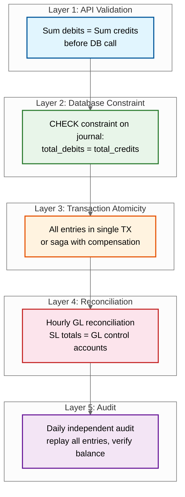
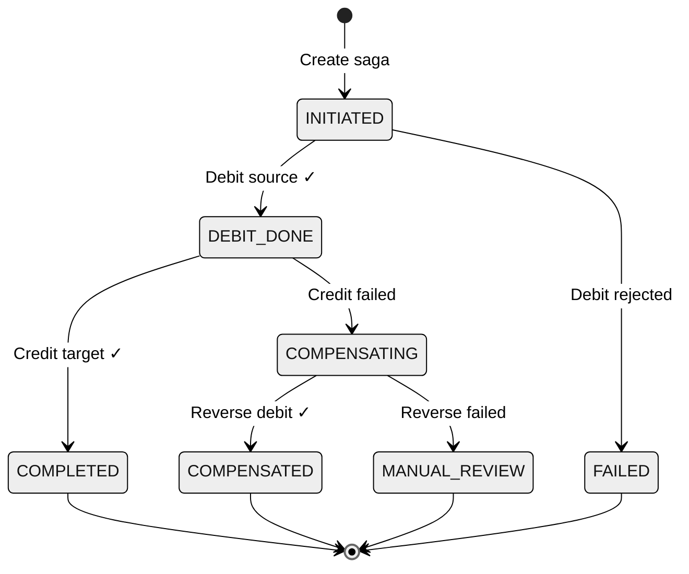
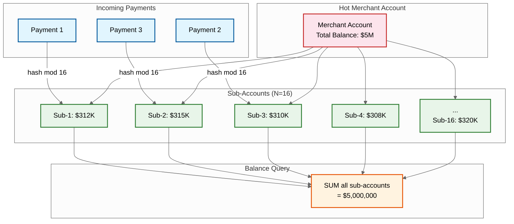
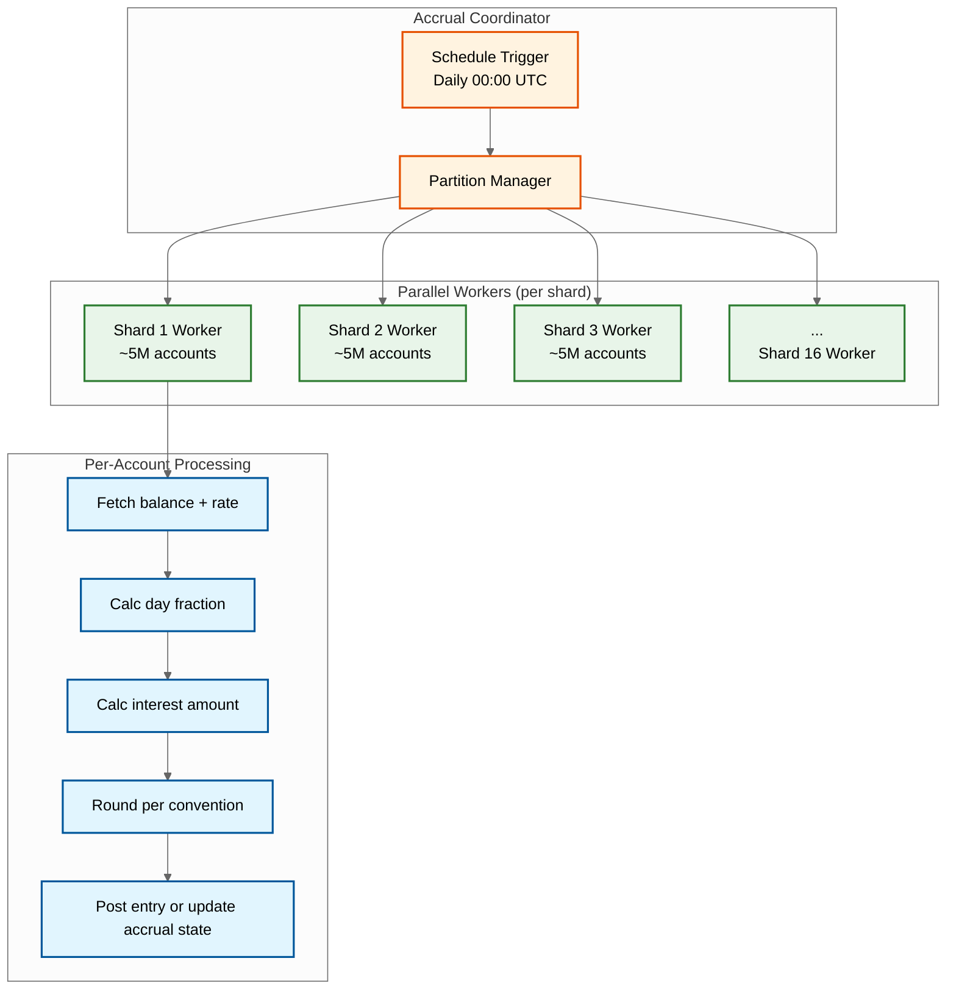
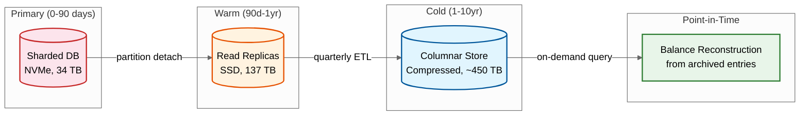

# Deep Dive & Bottlenecks

## 1. Double-Entry Rule that never changes Enforcement

### The Problem

The foundational rule of accounting---every journal entry's debits must equal its credits---must be enforced at every layer. A single violation means money has been created or destroyed within the system. This Rule that never changes must hold even under concurrent writes, network partitions, partial failures, and batch processing.

### Enforcement Layers



### Race Condition: Concurrent Balance Reads

**Scenario**: Account A has $1,000. Two payment requests arrive simultaneously, each for $800.

```
Thread 1: READ balance = $1,000 ✓     Thread 2: READ balance = $1,000 ✓
Thread 1: $1,000 >= $800? YES          Thread 2: $1,000 >= $800? YES
Thread 1: DEBIT $800 → balance $200    Thread 2: DEBIT $800 → balance -$600 ✗
```

**Solution**: `SELECT ... FOR UPDATE` acquires an exclusive row-level lock on the account, serializing concurrent operations:

```
Thread 1: SELECT FOR UPDATE → locks row, reads $1,000
Thread 1: DEBIT $800 → $200, COMMIT, releases lock
Thread 2: SELECT FOR UPDATE → acquires lock, reads $200
Thread 2: $200 < $800 → REJECT (insufficient funds)
```

**Trade-off**: Row-level locking serializes all operations on the same account. For typical retail accounts (< 10 TPS per account), this is acceptable. For hot accounts (merchants receiving thousands of payments/sec), it creates a Slowest part of the process---see Hot Account section below.

---

## 2. Cross-Shard Transaction Consistency

### The Problem

With accounts sharded across database instances, a transfer from Account A (Shard 1) to Account B (Shard 2) cannot use a single ACID transaction. Two-Phase Commit (2PC) is technically possible but creates dangerous failure modes:

- If the coordinator crashes after sending `PREPARE` but before `COMMIT`, participants hold locks indefinitely
- Lock contention during the prepare phase reduces throughput
- A single slow participant blocks all others

### Saga Pattern Deep Dive



**Critical design decisions:**

1. **Debit-first ordering**: Always debit the source account first. If the credit fails, compensate by re-crediting the source. Never credit first---that creates money temporarily.

2. **Saga log durability**: The saga state machine is written to a durable store (not just memory). After a crash, a recovery process scans for incomplete sagas and resumes them.

3. **Timeout handling**: If a saga step doesn't complete within the timeout, the orchestrator initiates compensation. Timeout values must account for downstream latency (typically 30s for the credit step).

4. **Idempotent steps**: Each saga step must be idempotent. If the credit step is retried (e.g., after a timeout where the credit actually succeeded), the idempotency key prevents double-posting.

### Slowest part of the process: Saga Throughput

At 30% cross-shard transaction rate and 46,300 peak TPS, the saga orchestrator processes ~14,000 sagas/sec. Each saga involves:
- 1 saga log write (INITIATED)
- 1 debit posting (on source shard)
- 1 saga log update (DEBIT_DONE)
- 1 credit posting (on target shard)
- 1 saga log update (COMPLETED)

**Total: 5 database operations per saga, or ~70,000 ops/sec on the saga store alone.**

**Mitigation**: Partition the saga log by saga_id hash across multiple saga coordinator instances. Each coordinator handles a subset of sagas independently.

---

## 3. Hot Account Problem

### The Problem

Certain accounts receive a disproportionate volume of transactions:
- Government salary disbursement accounts (millions of credits on salary day)
- Large merchant settlement accounts (thousands of payments per minute)
- Central bank reserve accounts (all interbank settlements flow through)
- Nostro accounts (all FX settlements for a currency pair)

A single account locked via `SELECT FOR UPDATE` serializes all operations, creating a queue that grows faster than it drains during peak.

### Solution: Sub-Account Sharding



**Design details:**

- **Credit operations**: Hash the transaction ID to select a sub-account. Lock only that sub-account. Contention reduced by N-fold.
- **Debit operations**: More complex. Must find a sub-account with sufficient balance. Strategy: try random sub-account first; if insufficient, try others; if all insufficient individually but total is sufficient, consolidate (move balances between sub-accounts during low-traffic windows).
- **Balance queries**: Read all N sub-accounts without locking (snapshot isolation). Sum for total. Cache the aggregate with short TTL.
- **Rebalancing**: Background job periodically redistributes balances across sub-accounts to prevent skew.
- **Sub-account count (N)**: Configured per account based on expected throughput. Start with N=1 (normal account), auto-scale to N=16 or N=64 when sustained TPS exceeds threshold.

---

## 4. Interest Accrual at Scale

### The Problem

Computing daily interest for 80M+ accounts within a 6-hour overnight window requires:
- 80M accounts / 6 hours = ~3,700 accounts/sec sustained
- Each account needs: balance lookup, rate determination (potentially tiered), day-count calculation, rounding, and ledger entry creation
- Backdated transactions that change historical balances may require retroactive interest recalculation

### Batch Architecture



### Slowest part of the process: Backdated Transactions

When a transaction is posted with a value date in the past (e.g., a check deposited today but value-dated 3 days ago), all interest calculations since that date are potentially incorrect. The system must:

1. Identify the affected accrual period
2. Reverse the previously posted accrual entries for affected days
3. Recalculate interest with the corrected balance for each affected day
4. Post correcting entries

**Mitigation**: Limit backdating to a configurable window (e.g., 5 business days). Beyond that window, manual approval and special correction journal entries are required. Track `last_value_date_cutoff` per account to avoid scanning the entire ledger.

---

## 5. Multi-Currency and FX Complexity

### The Problem

Multi-currency operations introduce several complexities:
- **Rate timing**: Which FX rate applies---at transaction initiation, authorization, or settlement?
- **Rounding**: Converting between currencies with different decimal precisions (JPY has 0 decimals, USD has 2, BHD has 3)
- **Position management**: The bank's aggregate exposure in each currency must be tracked and limited
- **Nostro reconciliation**: The bank's account at a foreign correspondent bank must reconcile with internal records

### FX Transaction Flow

```
FUNCTION process_fx_transaction(source_acct, target_acct, source_amount, source_ccy, target_ccy):
    // Lock FX rate at transaction time
    rate = fx_rate_service.get_rate(source_ccy, target_ccy)
    target_amount = source_amount × rate.mid_rate
    spread = source_amount × rate.spread

    // Round per target currency precision
    target_amount = ROUND(target_amount, currency_precision[target_ccy])

    // Create multi-leg journal entry
    journal_entries = [
        DEBIT  source_acct         source_amount  (source_ccy)   // customer pays
        CREDIT nostro_acct[source_ccy] source_amount (source_ccy) // bank receives source ccy
        DEBIT  nostro_acct[target_ccy] target_amount (target_ccy) // bank pays target ccy
        CREDIT target_acct         target_amount  (target_ccy)   // customer receives
        CREDIT fx_revenue_acct     spread         (base_ccy)     // bank earns spread
    ]

    // Validate position limits
    IF nostro_balance[target_ccy] - target_amount < position_limit:
        REJECT("Currency position limit exceeded")

    post_journal(journal_entries)
    update_currency_position(source_ccy, target_ccy, amounts)
```

### Rounding Discrepancies

Currency conversion rounding can create small imbalances. Example: Converting $100.00 to JPY at rate 149.5023 gives ¥14,950.23, but JPY has no decimals, so it rounds to ¥14,950. The $0.0015 difference must be posted to a rounding suspense account to keep the ledger balanced.

---

## 6. End-of-Day (EOD) Processing Pipeline

### The Problem

The EOD batch window is a fixed period (typically midnight to 6 AM) during which the system must complete:
1. Interest accrual for all accounts
2. Fee posting (monthly, dormancy)
3. Statement generation
4. GL reconciliation
5. Regulatory report generation
6. Archival of aged data

All while the system continues processing real-time payments.

### Pipeline Orchestration

```mermaid
%%{init: {'theme': 'neutral'}}%%
flowchart LR
    subgraph Phase1["Phase 1: Cutoff"]
        CO[Set business date<br/>Snapshot balances]
    end

    subgraph Phase2["Phase 2: Accrual (parallel)"]
        IA[Interest Accrual]
        FP[Fee Posting]
    end

    subgraph Phase3["Phase 3: Reconciliation"]
        GR[GL Reconciliation]
        NR[Nostro Reconciliation]
    end

    subgraph Phase4["Phase 4: Reporting (parallel)"]
        SG[Statement Generation]
        RR[Regulatory Reports]
        DA[Data Archival]
    end

    Phase1 --> Phase2 --> Phase3 --> Phase4

    classDef p1 fill:#e1f5fe,stroke:#01579b,stroke-width:2px
    classDef p2 fill:#e8f5e9,stroke:#2e7d32,stroke-width:2px
    classDef p3 fill:#fce4ec,stroke:#c62828,stroke-width:2px
    classDef p4 fill:#f3e5f5,stroke:#6a1b9a,stroke-width:2px

    class CO p1
    class IA,FP p2
    class GR,NR p3
    class SG,RR,DA p4
```



**Critical constraint**: Interest accrual must complete before GL reconciliation, because accrual postings change GL balances. Statement generation can run in parallel with regulatory reporting since both are read-only against the now-stable ledger.

---

## Slowest part of the process Summary

| Slowest part of the process | Impact | Root Cause | Mitigation |
|------------|--------|------------|------------|
| **Ledger write throughput** | Posting latency increases under load | Single-writer per account (row lock) | Shard by account_id; append-only entries; async indexing |
| **Hot accounts** | Queue builds on popular accounts | Row-level lock serialization | Sub-account sharding (N sub-accounts per hot account) |
| **Cross-shard transfers** | Higher latency, compensation complexity | Accounts on different shards | Saga pattern; co-locate frequently interacting accounts |
| **Interest accrual batch** | EOD window exceeded | 80M accounts × complex calculation | Parallel per-shard workers; incremental accrual state |
| **GL reconciliation** | Delayed break detection | Scanning entire ledger for GL totals | Maintain running GL totals updated on each posting |
| **Backdated transactions** | Interest recalculation cascade | Value date ≠ posting date | Limit backdate window; batch correction entries |
| **FX rounding** | Ledger imbalance from rounding | Currency decimal precision differences | Rounding suspense account; reconcile daily |
| **EOD pipeline ordering** | Delayed batch completion | Sequential phase dependencies | Maximize parallelism within phases; overlap phases where safe |
| **Audit trail volume** | 1 TB/day storage growth | Every operation logged | Tiered storage; compress after 24h; columnar format |
| **Saga store throughput** | 70K ops/sec on saga log | 5 DB ops per cross-shard transfer | Partition saga log; co-locate with coordinator |

---

## 7. Ledger Archival and Point-in-Time Reconstruction

### The Problem

With 375 GB/day of ledger growth, the primary database cannot hold 10 years of data. Yet regulators and auditors may request any historical balance or transaction record. The system must archive data while preserving query capability.

### Archival Architecture



### Point-in-Time Balance Reconstruction

When a regulator requests "What was Account X's balance on March 15, 2024?", the system must reconstruct it:

```
FUNCTION reconstruct_balance(account_id, target_date):
    // Step 1: Find the closest snapshot before target_date
    snapshot = SELECT * FROM balance_snapshots
               WHERE account_id = account_id
                 AND snapshot_date <= target_date
               ORDER BY snapshot_date DESC
               LIMIT 1

    // Step 2: Replay ledger entries from snapshot to target_date
    entries = SELECT * FROM ledger_entries_archive
              WHERE account_id = account_id
                AND posting_date > snapshot.snapshot_date
                AND posting_date <= target_date
              ORDER BY posting_date, entry_id

    balance = snapshot.ledger_balance
    FOR EACH entry IN entries:
        IF entry.entry_type = 'DEBIT':
            balance = balance - entry.amount
        ELSE:
            balance = balance + entry.amount

    RETURN {
        account_id: account_id,
        balance_as_of: target_date,
        reconstructed_from: snapshot.snapshot_date,
        entries_replayed: LENGTH(entries),
        balance: balance
    }
```

**Optimization**: Store monthly balance snapshots for every account. This limits the replay window to at most 31 days of entries, making reconstruction feasible even for accounts with high transaction volume.

---

## 8. Multi-Entity Isolation Challenges

### The Problem

A single core banking deployment serving multiple banking entities (subsidiaries, white-label partners) must ensure complete data isolation while sharing infrastructure. A bug or misconfiguration that leaks data between entities is a regulatory violation.

### Isolation Layers

| Layer | Isolation Mechanism | Verification |
|-------|-------------------|-------------|
| **API Gateway** | Entity ID extracted from auth token; injected into all downstream calls | Cannot be overridden by client |
| **Service layer** | Entity ID mandatory parameter on all queries; enforced by middleware | Unit tests verify entity-scoped queries |
| **Database** | Row-level security policies; entity_id in every table's WHERE clause | Periodic cross-entity query audit |
| **Encryption** | Per-entity encryption keys managed in separate HSM partitions | Key access logged and audited |
| **Event store** | Entity ID in partition key; consumer groups scoped to entity | Cross-entity message delivery = critical alert |
| **Backups** | Per-entity backup encryption keys; entity-specific restore tested | Annual restore drill per entity |

### Cross-Entity Transfer Handling

```
FUNCTION cross_entity_transfer(source_entity, source_account,
                                target_entity, target_account, amount):
    // Step 1: Validate both entities are authorized for cross-entity transfers
    IF NOT cross_entity_agreement_exists(source_entity, target_entity):
        REJECT("No cross-entity transfer agreement")

    // Step 2: AML screening (cross-entity transfers carry higher risk)
    aml_result = screen_cross_entity(source_account, target_account, amount)
    IF aml_result.flagged:
        HOLD_FOR_REVIEW(saga_id)
        RETURN pending_review

    // Step 3: Execute via nostro/vostro accounts
    // Each entity maintains a "due-to" / "due-from" account with the other
    saga = CREATE_SAGA(
        step_1: DEBIT source_account ON source_entity
        step_2: CREDIT due_to_target ON source_entity     // inter-entity payable
        step_3: DEBIT due_from_source ON target_entity     // inter-entity receivable
        step_4: CREDIT target_account ON target_entity
    )

    EXECUTE saga
    // GL reconciliation verifies: due-to (entity A) = due-from (entity B)
```
