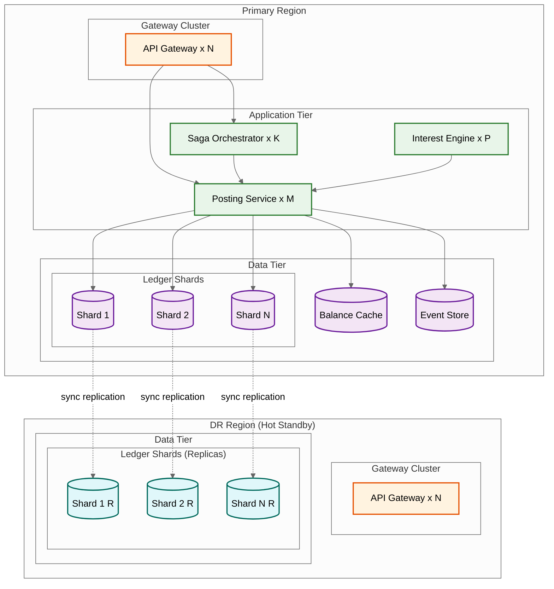
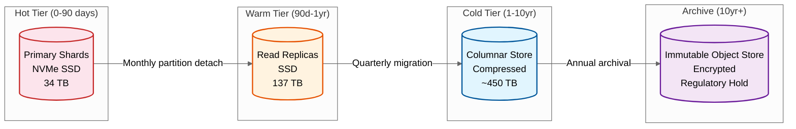

# Scalability & Reliability

## Scaling Architecture Overview



---

## Horizontal Scaling Strategy

### 1. Ledger Database Sharding

**Shard key**: `account_id` (hash-based)

**Why account_id**: All ledger entries for an account co-locate on the same shard, enabling single-shard ACID transactions for most operations (single-account debits, credits, balance queries). Only cross-account transfers may span shards.

**Shard sizing**: Target < 20,000 write TPS per shard to maintain sub-100ms posting latency. With 139,000 peak writes/sec total, minimum 7 shards---practically 16 shards for growth headroom and operational flexibility.

| Shard Count | Writes/Shard (Peak) | Accounts/Shard | Ledger Size/Shard (1yr) |
|-------------|---------------------|----------------|------------------------|
| 8 | ~17,400 | ~12.5M | ~17 TB |
| 16 | ~8,700 | ~6.25M | ~8.5 TB |
| 32 | ~4,350 | ~3.1M | ~4.3 TB |

**Shard splitting**: When a shard approaches capacity, split it by re-hashing accounts to two new shards. Use consistent hashing to minimize data movement. During split, route writes to both old and new shards (dual-write) until migration completes.

### 2. Application Tier Scaling

| Component | Scaling Model | Instances (Peak) | Notes |
|-----------|--------------|-------------------|-------|
| API Gateway | Horizontal, stateless | 20-40 | Auto-scale on request rate |
| Posting Service | Horizontal, stateless | 30-60 | Each instance handles any shard |
| Saga Orchestrator | Partitioned by saga_id | 8-16 | Each owns a partition of sagas |
| Interest Engine | Partitioned by shard | 16 | One worker per shard during batch |
| Balance View Service | Horizontal, stateless | 10-20 | Read-heavy, cache-backed |
| Reconciliation Engine | Single per entity | 1-5 | Sequential by entity, runs post-EOD |

### 3. Read Scaling with CQRS

The read path (balance queries, statement views, reporting) is separated from the write path (posting):

```
Write Path:                          Read Path:
Client → Posting Service → DB       Client → Balance Service → Cache → DB Replica
          (primary shard)                     (any replica, no locks)
```

- **Balance Cache**: Materialized balances cached in distributed cache. Updated synchronously on posting (write-through). Read latency: < 5ms (cache hit), < 50ms (cache miss → DB replica).
- **Reporting Replica**: Dedicated read replicas for statement generation, regulatory reporting, and analytics. Async replication lag: < 1s.
- **Statement Store**: Pre-generated statements stored in object storage. Statement generation runs as batch, results served directly.

### 4. Event Store Scaling

The event store receives every posting event and must handle 139,000+ events/sec at peak:

- Partition by account_id for ordered per-account event streams
- Retention: hot tier (7 days, fast access), warm tier (90 days), cold tier (10 years, compressed)
- Consumer groups for different downstream processors (notifications, fraud, reporting) read independently

---

## Multi-Region Architecture

### Active-Passive with Synchronous Replication

For a core banking system, **zero data loss** (RPO = 0) is non-negotiable. This requires synchronous replication to the DR region:

```
Primary Region          DR Region
┌─────────────┐        ┌─────────────┐
│ Shard 1 (RW)│──sync──│ Shard 1 (RO)│
│ Shard 2 (RW)│──sync──│ Shard 2 (RO)│
│ ...         │──sync──│ ...         │
│ Shard N (RW)│──sync──│ Shard N (RO)│
└─────────────┘        └─────────────┘
     ↑                       ↑
  All writes              Reads only
  go here                (reporting,
                          DR standby)
```

**Synchronous replication cost**: Each write waits for DR acknowledgment, adding 2-10ms latency (within-region sync) or 20-50ms (cross-region). For financial systems, this latency is acceptable given the RPO=0 requirement.

**Failover**: On primary region failure:
1. DR region detects failure (heartbeat timeout: 10s)
2. DR shards promoted to read-write (automated, < 30s)
3. DNS/routing updated to point to DR region (< 60s)
4. Total RTO: < 2 minutes for automated failover

### Multi-Region for Global Banks

For global banks operating across time zones, a **follow-the-sun** model:

| Region | Business Hours | Role | Accounts |
|--------|---------------|------|----------|
| Americas | 08:00-20:00 ET | Primary for USD, CAD, BRL accounts | 40M |
| EMEA | 08:00-20:00 CET | Primary for EUR, GBP, CHF accounts | 35M |
| APAC | 08:00-20:00 SGT | Primary for SGD, HKD, JPY accounts | 25M |

Cross-region transfers (e.g., USD account in Americas to EUR account in EMEA) use the saga pattern with inter-region messaging. Latency: 100-500ms including cross-region hop.

---

## Fault Tolerance

### Failure Mode Analysis

| Failure | Impact | Detection | Recovery |
|---------|--------|-----------|----------|
| **Single shard failure** | Accounts on that shard unavailable | Heartbeat, query timeout | Promote shard replica (< 30s) |
| **Posting service crash** | In-flight postings lost | Health check failure | Stateless: other instances take over; idempotency prevents duplicates on retry |
| **Saga orchestrator crash** | In-flight sagas paused | Heartbeat | Recovery process scans saga log, resumes incomplete sagas |
| **Cache failure** | Balance reads go to DB | Cache miss rate spike | Graceful degradation: read from DB replica (higher latency) |
| **Event store lag** | Downstream consumers delayed | Consumer lag metric | Consumers catch up; no data loss (events durable) |
| **Network partition (intra-region)** | Shard unreachable from app tier | Connection timeout | Route to DR region or queue requests; no split-brain (sync replication) |
| **Full region failure** | All services in region down | External health probe | Automated DR failover (< 2 min) |
| **Batch processing failure** | EOD accrual incomplete | Batch monitoring, heartbeat | Restart from last checkpoint; idempotent batch design |

### Circuit Breakers

```
Posting Service → Shard DB:
  - Open circuit after 5 consecutive failures or > 50% error rate in 10s window
  - Half-open: try 1 request every 5s
  - Close: 3 consecutive successes
  - When open: return 503 (Service Unavailable); client retries with backoff

Saga Orchestrator → Remote Shard:
  - Open circuit after 3 failures
  - When open: pause saga step, mark PENDING_RETRY
  - Background retry with exponential backoff (1s, 2s, 4s, 8s, max 60s)
```

### Idempotency as Reliability Infrastructure

Every operation in the system is designed to be safely retried:

| Operation | Idempotency Key | Dedup Mechanism |
|-----------|----------------|-----------------|
| Ledger posting | Client-generated UUID | Cache + DB unique constraint |
| Saga step | saga_id + step_name | Saga log state check |
| Interest accrual | batch_run_id + account_id | Accrual state date check |
| Fee posting | fee_schedule_id + account_id + period | Journal idempotency key |
| Statement generation | account_id + period | Statement existence check |

---

## Disaster Recovery

### RPO/RTO Targets

| Tier | Systems | RPO | RTO | Strategy |
|------|---------|-----|-----|----------|
| **Tier 1** | Ledger posting, balance queries | 0 | < 2 min | Sync replication + automated failover |
| **Tier 2** | Payment processing, transfers | 0 | < 5 min | Sync replication + semi-automated failover |
| **Tier 3** | Interest accrual, statements | < 1 hour | < 1 hour | Async replication + manual failover |
| **Tier 4** | Regulatory reporting, analytics | < 4 hours | < 4 hours | Backup restore from object storage |

### DR Testing

- **Monthly**: Automated failover drill for Tier 1 systems (verify < 2 min recovery)
- **Quarterly**: Full region failover simulation (all tiers)
- **Annually**: Chaos engineering exercises (random failure injection during business hours)

---

## Capacity Planning

### Growth Projections

| Metric | Current | +1 Year | +3 Years |
|--------|---------|---------|----------|
| Total accounts | 100M | 130M | 200M |
| Daily transactions | 500M | 700M | 1.2B |
| Peak TPS | 46K | 65K | 110K |
| Ledger entries/day | 1.5B | 2.1B | 3.6B |
| Hot storage (90d) | 34 TB | 48 TB | 82 TB |
| Shard count | 16 | 16-24 | 32-48 |

### Scaling Triggers

| Metric | Threshold | Action |
|--------|-----------|--------|
| Shard write latency p99 | > 200ms sustained | Add shards (split busiest) |
| Shard disk usage | > 70% | Archive older partitions or split |
| Cache hit rate | < 95% | Scale cache cluster |
| Saga queue depth | > 10,000 pending | Scale saga orchestrator instances |
| EOD batch duration | > 5 hours | Add batch worker parallelism |
| Balance query latency p99 | > 100ms | Scale read replicas + cache |

---

## Connection Pooling and Query Optimization

### Connection Pool Architecture

With 16+ shards and 30-60 posting service instances, naive connection management creates O(services × shards) connections:

```
Without pooling:    60 services × 16 shards × 5 connections = 4,800 connections
With shard-aware pooling: 60 services × shard_affinity(3) × 5 = 900 connections
```

| Configuration | Value | Rationale |
|--------------|-------|-----------|
| **Pool size per shard** | 20-40 | Matches shard write capacity (~10K TPS per pool) |
| **Connection timeout** | 5 seconds | Fail fast; avoid cascading timeouts |
| **Idle timeout** | 300 seconds | Reclaim unused connections during off-peak |
| **Max lifetime** | 1800 seconds | Prevent stale connections; force credential rotation |
| **Validation query** | `SELECT 1` | Lightweight health check before checkout |
| **Leak detection** | 30 seconds | Flag connections held longer than expected |

### Query Optimization for Ledger Tables

The append-only ledger creates specific optimization opportunities:

| Pattern | Optimization | Benefit |
|---------|-------------|---------|
| **Balance lookup** | Materialized balance in accounts table (not SUM of entries) | O(1) vs O(n) where n = all entries for account |
| **Statement query** | Composite index on (account_id, posting_date DESC) | Eliminates full table scan; partition Cutting off unnecessary steps by date |
| **GL reconciliation** | Running GL totals table updated per posting | Avoids scanning entire ledger_entries table |
| **Accrual batch** | Cursor-based pagination with account_id ordering | Memory-efficient; resumable from checkpoint |
| **Audit queries** | Covering index on (entity_id, timestamp, actor) | Supports compliance queries without heap access |
| **Archival scan** | Partition-level operations on posting_date partitions | Drop entire monthly partitions to cold storage |

### Prepared Statement Strategy

```
Hot path statements (pre-compiled, cached per connection):
├── post_debit_entry      -- 139K/sec peak; parameterized INSERT
├── post_credit_entry     -- 139K/sec peak; parameterized INSERT
├── update_balance        -- 46K/sec peak; parameterized UPDATE with version check
├── check_balance         -- 100K/sec peak; parameterized SELECT on primary key
├── lookup_idempotency    -- 46K/sec peak; cache check then DB lookup
└── insert_journal        -- 46K/sec peak; parameterized INSERT

Cold path statements (prepared on demand):
├── statement_query       -- Infrequent; date-range scan
├── reconciliation_sum    -- Hourly; aggregate query
└── accrual_batch_fetch   -- Nightly; cursor-based scan
```

---

## Ledger Data Lifecycle and Archival

### Tiered Storage Strategy



### Partition Management

```
FUNCTION manage_ledger_partitions(current_date):
    // Monthly partition rotation
    old_partition = partition_for(current_date - 90 days)

    // Step 1: Verify partition is fully reconciled
    IF NOT is_reconciled(old_partition):
        ALERT("Cannot archive unreconciled partition")
        RETURN

    // Step 2: Create compressed copy in warm storage
    COPY old_partition TO warm_storage WITH compression = 'zstd'

    // Step 3: Verify warm copy matches source (checksum)
    IF checksum(old_partition) ≠ checksum(warm_copy):
        ALERT("Checksum mismatch during archival")
        RETURN

    // Step 4: Detach partition from primary table
    ALTER TABLE ledger_entries DETACH PARTITION old_partition

    // Step 5: Update query routing metadata
    UPDATE partition_routing SET
        location = 'warm',
        access_latency_ms = 200
    WHERE partition_name = old_partition
```

### Cross-Tier Query Routing

When a balance inquiry or statement request requires historical data beyond the hot tier:

| Query Type | Routing Strategy | Latency |
|-----------|-----------------|---------|
| **Current balance** | Hot tier only (materialized) | < 5ms |
| **Statement (last 90d)** | Hot tier | < 50ms |
| **Statement (90d-1yr)** | Warm tier read replicas | < 200ms |
| **Statement (1yr+)** | Cold tier (async response) | < 5s |
| **Audit investigation** | Cold tier with pre-warming | < 30s |
| **Regulatory request** | Archive tier (retrieval job) | Minutes-hours |

---

## Batch Processing Optimization

### Interest Accrual Performance Tuning

The 80M account nightly accrual is the most resource-intensive batch operation:

| Optimization | Technique | Impact |
|-------------|-----------|--------|
| **Shard-level parallelism** | 16 independent workers, one per shard | 16× throughput |
| **Batch journaling** | Group 1,000 accounts into single journal | Reduce transaction overhead 1000× |
| **Cursor-based processing** | Fetch accounts in order, track checkpoint | Enables resume after failure |
| **Rate caching** | Cache product rate schedules in memory | Avoid repeated DB lookups |
| **Skip unchanged** | Skip accounts with zero balance and no rate | Reduce processing by ~15% |
| **Incremental state** | `accrual_state` table tracks last processed date | Idempotent restart |

### Batch Window Budget

```
Total overnight window:     6 hours (00:00 - 06:00 UTC)

Phase 1 - Cutoff (00:00-00:15):               15 min
  Snapshot business date, freeze reporting balances

Phase 2 - Interest Accrual (00:15-03:15):      3 hours
  80M accounts / 16 shards = 5M accounts/shard
  5M accounts / 3 hours = 463 accounts/sec/shard
  Batch size 1000 → 1 batch every 2.2 sec/shard

Phase 3 - Fee Posting (00:15-01:15):           1 hour (parallel with accrual)
  30M fee postings / 16 shards = 1.875M/shard
  Completes well within accrual window

Phase 4 - GL Reconciliation (03:15-04:15):     1 hour
  Full SL-to-GL verification across all control accounts
  Accounting equation check: A = L + E

Phase 5 - Reporting (04:15-06:00):             1.75 hours (parallel)
  Statement generation: 60M active accounts
  Regulatory reports: Basel III, LCR, NSFR
  Data archival: partition management

Buffer:                                         0 min (tight)
```

### Batch Failure Recovery

```
Recovery strategy for each batch phase:

Interest Accrual:
  ├── Checkpoint: accrual_state.last_accrual_date per account
  ├── On failure: Restart from last checkpoint
  ├── Idempotency: (batch_run_id + account_id) composite key
  └── Timeout: If not complete by 03:30, alert + extend window

Fee Posting:
  ├── Checkpoint: fee_posting_state per account per period
  ├── On failure: Skip failed accounts, retry in next cycle
  └── Alert: If > 1% accounts fail, escalate to operations

GL Reconciliation:
  ├── On break: Freeze affected GL account
  ├── Alert: P1 immediate (any non-zero difference)
  └── Recovery: Trace journal entries to identify cause

Statement Generation:
  ├── On failure: Retry individual account statements
  ├── Deadline: Must complete before business hours (08:00)
  └── Fallback: Serve "statement pending" for affected accounts
```

---

## Read Replica Management

### Replica Topology

```
Primary Shard (RW)
├── Sync Replica (DR) ────────── Zero data loss (RPO=0)
├── Async Replica 1 (Reporting) ─ < 1s lag; regulatory queries
├── Async Replica 2 (Analytics) ── < 5s lag; BI and dashboards
└── Async Replica 3 (Statement) ── < 1s lag; customer-facing reads
```

### Replica Lag Monitoring

| Replica Purpose | Max Acceptable Lag | Action on Breach |
|----------------|-------------------|------------------|
| **DR (sync)** | 0 (synchronous) | If sync breaks, halt writes until restored |
| **Balance read** | < 100ms | Route to primary if lag exceeds threshold |
| **Reporting** | < 1 second | Acceptable for near-real-time dashboards |
| **Statement** | < 1 second | Stale statement data is misleading |
| **Analytics** | < 5 seconds | Tolerable for BI workloads |

### Read Routing Strategy

```
FUNCTION route_read_query(query_type, consistency_requirement):
    IF query_type = 'BALANCE' AND consistency_requirement = 'STRONG':
        RETURN primary_shard(account_id)    // Only for payment authorization

    IF query_type = 'BALANCE' AND consistency_requirement = 'EVENTUAL':
        RETURN balance_cache                // Sub-5ms; refreshed on posting

    IF query_type = 'STATEMENT':
        replica = statement_replica(shard_for(account_id))
        IF replica.lag > 1 second:
            RETURN primary_shard(account_id) // Fallback for stale replicas
        RETURN replica

    IF query_type = 'REPORTING':
        RETURN reporting_replica(shard_for(account_id))

    IF query_type = 'ANALYTICS':
        RETURN analytics_replica(shard_for(account_id))
```

---

## Chaos Engineering and Resilience Testing

### Failure Injection Scenarios

| Scenario | Injection Method | Expected Behavior | Verification |
|----------|-----------------|-------------------|-------------|
| **Single shard failure** | Kill primary DB process | Replica promotes within 30s; in-flight transactions retry | Zero data loss; posting resumes < 30s |
| **Network partition** | Block traffic between app tier and one shard | Circuit breaker opens; affected accounts return 503 | Other shards unaffected; no split-brain |
| **Saga coordinator crash** | Kill orchestrator process mid-saga | New coordinator scans saga log; resumes incomplete sagas | All sagas eventually complete or compensate |
| **Cache cluster failure** | Evict all balance cache entries | Balance reads fall back to DB replicas | Latency degrades to < 50ms (from < 5ms); no errors |
| **Event store lag** | Throttle consumer throughput | Downstream consumers fall behind | Core posting unaffected; consumers catch up |
| **DR region failure** | Isolate DR region network | Primary continues; RPO changes from 0 to "last sync" | Alert fires; operations decide whether to halt writes |
| **Batch worker crash** | Kill accrual worker mid-batch | Worker restarts from checkpoint | No double-accrual; batch completes within window |
| **Clock skew** | Drift system clock by 60s | Business date logic must handle skew | Interest accrual uses logical business date, not system clock |

### Resilience Testing Schedule

| Frequency | Scope | Automation |
|-----------|-------|------------|
| **Weekly** | Single-service failure injection (staging) | Fully automated |
| **Monthly** | Single-shard failover (production, off-peak) | Semi-automated with operator approval |
| **Quarterly** | Full region failover simulation | Operator-led with automated verification |
| **Semi-annually** | Multi-failure cascading scenario | War game with full incident response |
| **Annually** | Complete DR activation with 4-hour operational window | Regulatory requirement; documented results |
