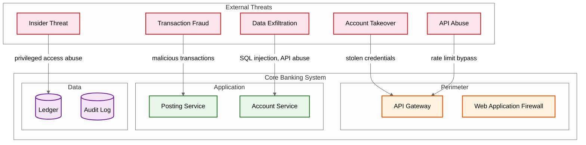

# Security & Compliance

## Threat Model

### Attack Surface



### Key Threats & Mitigations

| Threat | Risk Level | Attack Vector | Mitigation |
|--------|-----------|---------------|------------|
| **Unauthorized ledger modification** | Critical | Insider access, SQL injection | Immutable append-only ledger; no UPDATE/DELETE permissions; all changes via application layer with audit |
| **Account takeover** | Critical | Credential stuffing, phishing, SIM swap | MFA, adaptive authentication, device binding, session fingerprinting |
| **Transaction fraud** | High | Stolen credentials, social engineering | Real-time transaction scoring, velocity checks, step-up authentication for unusual patterns |
| **Data exfiltration** | High | API abuse, insider threat | Field-level encryption, data masking, DLP monitoring, access logging |
| **Privilege escalation** | High | Role misconfiguration, token theft | Principle of least privilege, role-based access, temporary elevated access with approval |
| **API abuse** | Medium | Enumeration, Brute Force (Checking every single possibility), DoS | Rate limiting, request signing, IP reputation, WAF rules |
| **Audit trail tampering** | Critical | Insider with DB access | Append-only audit store, cryptographic chaining (hash chain), separate audit infrastructure |
| **Inter-service impersonation** | High | Compromised service identity | Mutual TLS (mTLS), service mesh, short-lived certificates |

---

## Authentication & Authorization

### Authentication Layers

| Layer | Mechanism | Details |
|-------|-----------|---------|
| **Customer-facing** | OAuth 2.0 + OpenID Connect | MFA required; biometric + PIN for high-value transactions |
| **Branch/Teller** | Smart card + PIN + biometric | Dual-factor at device + user level |
| **Service-to-service** | Mutual TLS (mTLS) | Certificate-based identity; short-lived certs (24h) |
| **Admin/Operations** | SSO + hardware token + approval | Privileged Access Management (PAM); just-in-time elevation |
| **Open Banking (PSD2)** | OAuth 2.0 with PKCE + SCA | Strong Customer Authentication for third-party access |

### Authorization Model

**Role-Based Access Control (RBAC) with Attribute Constraints:**

```
Role: Teller
├── Permissions:
│   ├── accounts:read (own branch only)
│   ├── accounts:create (deposit accounts only)
│   ├── transactions:create (amount ≤ $10,000)
│   └── holds:create (amount ≤ $5,000)
├── Constraints:
│   ├── branch_id = user.assigned_branch
│   ├── entity_id = user.entity
│   └── time_window = branch_hours
└── Elevation:
    └── transactions:create (amount > $10,000) → requires manager approval

Role: Operations
├── Permissions:
│   ├── reconciliation:read
│   ├── reconciliation:execute
│   ├── batch_jobs:monitor
│   └── batch_jobs:restart
├── Constraints:
│   └── entity_id = user.entity
└── Cannot:
    └── ledger_entries:create (must go through posting service)
```

**Dual Authorization (Maker-Checker):**

Sensitive operations require two authorized individuals:

| Operation | Maker | Checker | Threshold |
|-----------|-------|---------|-----------|
| Manual journal entry | Operations | Finance Manager | All amounts |
| Account freeze/unfreeze | Compliance | Compliance Manager | All |
| Product rate change | Product Manager | Treasury Head | All |
| Large value transfer | Relationship Manager | Operations Manager | > $1M |
| Backdated posting | Operations | Finance + Compliance | All |
| User permission change | IT Admin | Security Officer | All |

---

## Data Protection

### Encryption

| Data State | Mechanism | Key Management |
|------------|-----------|----------------|
| **At rest** | Transparent data encryption (TDE) per shard | Per-tenant encryption keys; HSM-backed key storage |
| **In transit** | TLS 1.3 (external), mTLS (internal) | Certificate rotation every 24h; automated via PKI |
| **Field-level** | Application-layer encryption for PII | Separate key per data classification; envelope encryption |
| **Backup** | Encrypted backups with separate key | Backup keys stored in different HSM than primary |
| **Audit logs** | Append-only with cryptographic hash chain | Tamper-evident; hash chain verified on read |

### Data Classification & Handling

| Classification | Examples | Encryption | Access | Retention |
|---------------|----------|------------|--------|-----------|
| **Restricted** | Account balances, transaction amounts, PII | Field-level + TDE | Named individuals only; logged | Per regulation |
| **Confidential** | Product configs, rate schedules, internal reports | TDE | Role-based; logged | 5 years |
| **Internal** | System metrics, non-sensitive logs | TDE | Team-based | 1 year |
| **Public** | Published rates, product brochures | None required | Open | N/A |

### PII Handling

```
Customer Data Masking Rules:
├── Account number: Show last 4 digits only (*****6789)
├── Balance: Visible only to account holder + authorized staff
├── Transaction details: Full visibility for 90 days; summary after
├── Government ID: Never stored in plaintext; tokenized reference only
├── Phone/Email: Masked in logs and non-essential displays
└── Address: Visible only in KYC context with explicit access grant
```

---

## Regulatory Compliance

### Basel III Capital Requirements

The core banking system must calculate and report:

| Requirement | Description | System Impact |
|-------------|-------------|---------------|
| **Common Equity Tier 1 (CET1)** | Minimum 4.5% of risk-weighted assets | Real-time RWA calculation from loan portfolio |
| **Tier 1 Capital** | Minimum 6% of RWA | Capital instrument classification in CoA |
| **Total Capital** | Minimum 8% of RWA | Subordinated debt tracking |
| **Capital Conservation Buffer** | Additional 2.5% CET1 | Automated buffer monitoring |
| **Liquidity Coverage Ratio (LCR)** | ≥ 100% | High-quality liquid asset tracking vs. 30-day outflows |
| **Net Stable Funding Ratio (NSFR)** | ≥ 100% | Available stable funding vs. required stable funding |
| **Leverage Ratio** | ≥ 3% | Tier 1 capital / total exposure |

**System design implication**: The ledger must classify every account and entry by risk category. Loan accounts carry risk weights based on borrower type, collateral, and rating. The RWA calculation runs daily, consuming ledger data and producing regulatory reports.

### SOX Audit Trail Requirements

| Requirement | Implementation |
|-------------|---------------|
| **Complete audit trail** | Every ledger entry, balance change, and configuration change logged with actor, timestamp, before/after state |
| **Immutability** | Append-only audit store; no UPDATE/DELETE; cryptographic hash chain |
| **Segregation of duties** | Maker-checker for sensitive operations; role separation enforced |
| **Access controls** | RBAC with regular access reviews (quarterly); automatic deprovisioning |
| **Change management** | All system changes through formal change control; audit trail of deployments |
| **Data integrity** | GL reconciliation reports with sign-off; discrepancy investigation SLA |
| **Retention** | 7-year minimum retention for all financial records and audit logs |

### PSD2 / Open Banking

| Requirement | Implementation |
|-------------|---------------|
| **Account Information Service (AIS)** | Read-only API for authorized third parties to view account data |
| **Payment Initiation Service (PIS)** | API for third parties to initiate payments on behalf of customers |
| **Strong Customer Authentication (SCA)** | Two-factor authentication for electronic payments; exemptions for low-value |
| **Consent management** | Granular consent per third party: scope, duration, revocation |
| **API standards** | OpenAPI-compliant; standardized error codes; sandbox environment |
| **Fallback mechanism** | If API unavailable, provide alternative access (screen scraping allowed) |

### AML / KYC

```
Transaction Monitoring Pipeline:
├── Rule-based screening (real-time):
│   ├── Amount threshold: > $10,000 (CTR filing)
│   ├── Structuring detection: Multiple sub-threshold transactions
│   ├── Sanctions list screening: OFAC, EU, UN lists
│   └── PEP (Politically Exposed Person) flagging
├── Pattern-based detection (near real-time):
│   ├── Unusual transaction velocity
│   ├── Geographic risk (high-risk jurisdictions)
│   ├── Counterparty network analysis
│   └── Dormant account activation with large transactions
└── Reporting:
    ├── Currency Transaction Report (CTR): auto-filed > $10K
    ├── Suspicious Activity Report (SAR): manual review + filing
    └── Regulatory data retention: 5+ years
```

---

## Cryptographic Controls

### Hash Chain for Ledger Integrity

Each ledger entry includes a hash of the previous entry, creating a tamper-evident chain:

```
entry_hash = HASH(
    entry_id ||
    journal_id ||
    account_id ||
    amount ||
    entry_type ||
    posting_date ||
    previous_entry_hash     ← chain link
)
```

**Verification**: A background process periodically replays the hash chain to verify no entries have been modified. Any break in the chain triggers a critical alert and forensic investigation.

### Digital Signatures for High-Value Transactions

Transactions above a configurable threshold require digital signatures:

```
Signature Flow:
1. Client submits transaction with signing certificate
2. Server validates certificate against trusted CA
3. Transaction payload + signature stored in ledger entry
4. Non-repudiation: signer cannot deny having authorized the transaction
```

---

## Network Security

| Layer | Control | Details |
|-------|---------|---------|
| **Perimeter** | WAF + DDoS protection | Layer 7 filtering; geo-blocking; bot detection |
| **API Gateway** | Rate limiting + request validation | Per-client quotas; schema validation; payload size limits |
| **Service mesh** | mTLS + network policies | Service-to-service encryption; allow-list communication |
| **Database** | Network isolation + IAM | No direct internet access; application-only access; credential rotation |
| **Admin access** | VPN + bastion host + PAM | Just-in-time access; session recording; time-bounded |

---

## Compliance Calendar

| Frequency | Activity | Owner |
|-----------|----------|-------|
| **Daily** | Transaction monitoring (AML) | Compliance |
| **Daily** | GL reconciliation verification | Finance |
| **Weekly** | Access review for privileged accounts | Security |
| **Monthly** | Capital adequacy ratio calculation | Risk |
| **Quarterly** | Full access review + recertification | Security + Audit |
| **Quarterly** | Penetration testing | Security |
| **Annually** | SOX audit | External Auditor |
| **Annually** | Basel III full reporting | Risk + Regulatory |
| **Annually** | Business continuity / DR drill | Operations |
| **On demand** | Regulatory examination response | Compliance |

---

## Data Residency and Cross-Border Compliance

### Jurisdictional Requirements

| Jurisdiction | Requirement | System Impact |
|-------------|-------------|---------------|
| **EU (GDPR)** | Personal data must stay in EU; right to erasure; consent for processing | EU accounts on EU-region shards; erasure via crypto-shredding (delete encryption key) |
| **India (PDPA)** | Financial data mirror copy must be in India | India shard with local replication; cross-border transfers require consent |
| **Switzerland** | Banking secrecy laws; data cannot leave Switzerland | Dedicated Swiss shard with no cross-border replication |
| **Singapore (PDPA)** | Data protection with cross-border transfer restrictions | APAC regional deployment with data classification |
| **US (CCPA / GLBA)** | Consumer financial data protection; breach notification within 72h | US-region shards; incident response automation |

### Crypto-Shredding for Right to Erasure

Traditional deletion is impossible in an immutable ledger. Instead:

```
FUNCTION handle_erasure_request(customer_id):
    // Step 1: Verify the request is legitimate and regulatory-approved
    IF NOT compliance_approved(customer_id):
        RETURN denied("Regulatory hold prevents erasure")

    // Step 2: Identify the customer's encryption key
    customer_key = hsm.get_key(customer_id)

    // Step 3: Verify all accounts are closed and settled
    open_accounts = SELECT COUNT(*) FROM accounts
                    WHERE customer_id = customer_id AND status != 'CLOSED'
    IF open_accounts > 0:
        RETURN denied("Open accounts must be closed first")

    // Step 4: Destroy the encryption key
    hsm.destroy_key(customer_key)
    // PII fields encrypted with this key become unreadable
    // Ledger entries remain for accounting integrity
    // but personal data (name, address) is cryptographically erased

    // Step 5: Log the erasure event (without PII)
    audit_log.write("ERASURE_COMPLETED", customer_id_hash, timestamp)
```

---

## Key Rotation and Certificate Management

### Rotation Schedule

| Key Type | Rotation Frequency | Method | Downtime |
|----------|-------------------|--------|----------|
| **TDE (data at rest)** | Annually | Re-encrypt with new key; old key kept for cold storage | Zero (online rotation) |
| **Field-level encryption** | Quarterly | Envelope encryption; rotate DEK via KEK update | Zero (transparent) |
| **mTLS certificates** | 24 hours | Auto-issued via internal PKI; rolling deployment | Zero (dual-cert window) |
| **API client secrets** | 90 days | Client regenerates; old secret valid for 48h grace period | Zero (overlap period) |
| **HSM master key** | Every 2 years | Ceremony with dual custody; requires 3-of-5 key holders | Planned maintenance window |
| **Backup encryption keys** | Annually | New key for new backups; old keys retained for existing backups | None (forward only) |

---

## Incident Response for Financial Systems

### Severity Classification

| Severity | Definition | Response Time | Example |
|----------|-----------|---------------|---------|
| **P0: Critical** | Active data breach or ledger integrity violation | < 15 minutes | GL reconciliation break > $1M; unauthorized ledger access detected |
| **P1: High** | Service outage affecting posting or potential fraud | < 30 minutes | Posting service down; spike in failed transaction patterns |
| **P2: Medium** | Degraded performance or non-critical breach | < 2 hours | Batch processing delayed; single account anomaly |
| **P3: Low** | Minor issue with no customer impact | < 8 hours | Non-critical replica lag; audit log delay |

### Response Playbook for Ledger Integrity Breach

```
Ledger Integrity Incident Response:

1. DETECT (automated):
   ├── GL reconciliation break detected
   ├── Hash chain verification failure
   └── Audit trail anomaly alert

2. CONTAIN (< 15 minutes):
   ├── Freeze affected GL control account
   ├── Pause posting to affected shard (if isolated)
   ├── Activate incident bridge
   └── Preserve all logs and snapshots

3. INVESTIGATE (15 min - 2 hours):
   ├── Trace journal entries around the break timestamp
   ├── Compare hash chain for tamper evidence
   ├── Check for unauthorized access in audit logs
   └── Identify root cause (bug, race condition, or attack)

4. REMEDIATE:
   ├── Post correcting journal entries (dual-authorized)
   ├── Re-verify GL reconciliation
   ├── Verify accounting equation (A = L + E)
   └── Restore hash chain integrity

5. REPORT:
   ├── Internal incident report within 24h
   ├── Regulatory notification if customer data affected (72h)
   └── Board notification if material (per SOX requirements)
```

---

## Secure Development Lifecycle

| Phase | Security Activity | Tooling |
|-------|------------------|---------|
| **Design** | Threat modeling per STRIDE; review for OWASP Top 10 | Threat modeling workshops |
| **Development** | Secure coding guidelines; no raw SQL; parameterized queries | Static analysis in CI |
| **Code Review** | Security-focused review for all posting service changes | Mandatory dual review |
| **Testing** | Penetration testing (quarterly); fuzz testing on APIs | DAST scanners; API fuzzers |
| **Deployment** | Signed artifacts; immutable deployment images; rollback plan | Container image signing |
| **Runtime** | WAF rules; anomaly detection; real-time alerting | SIEM integration |
| **Post-incident** | Blameless post-mortem; root cause to backlog item | Incident database |
