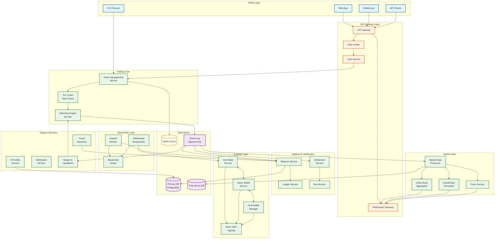
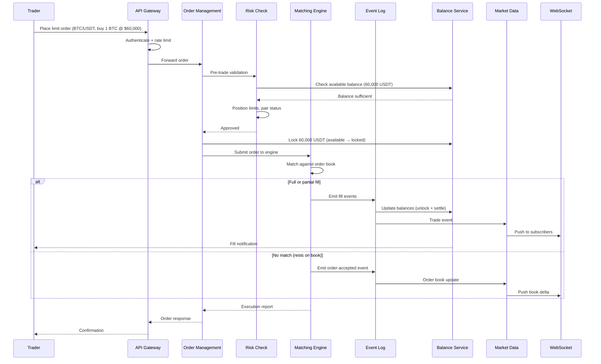
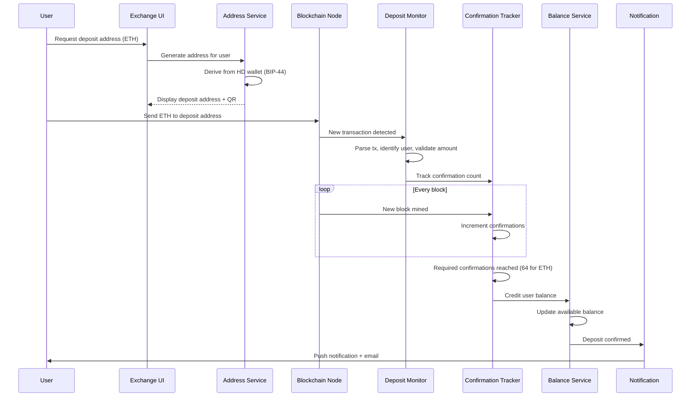
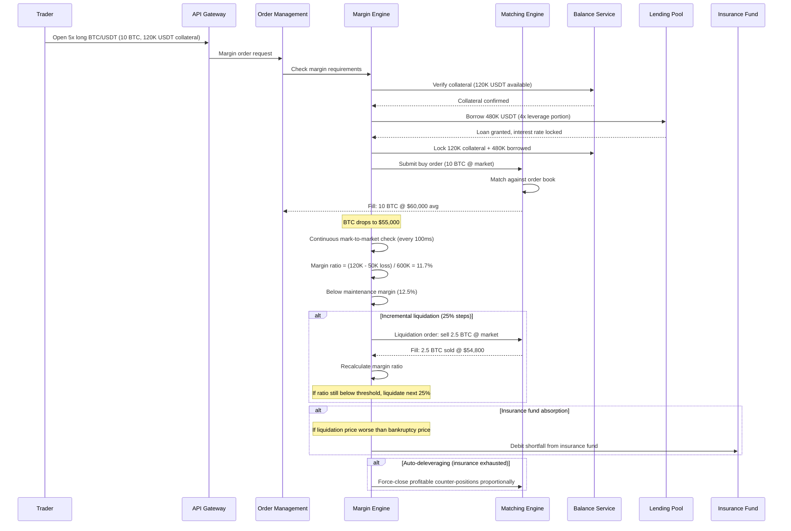
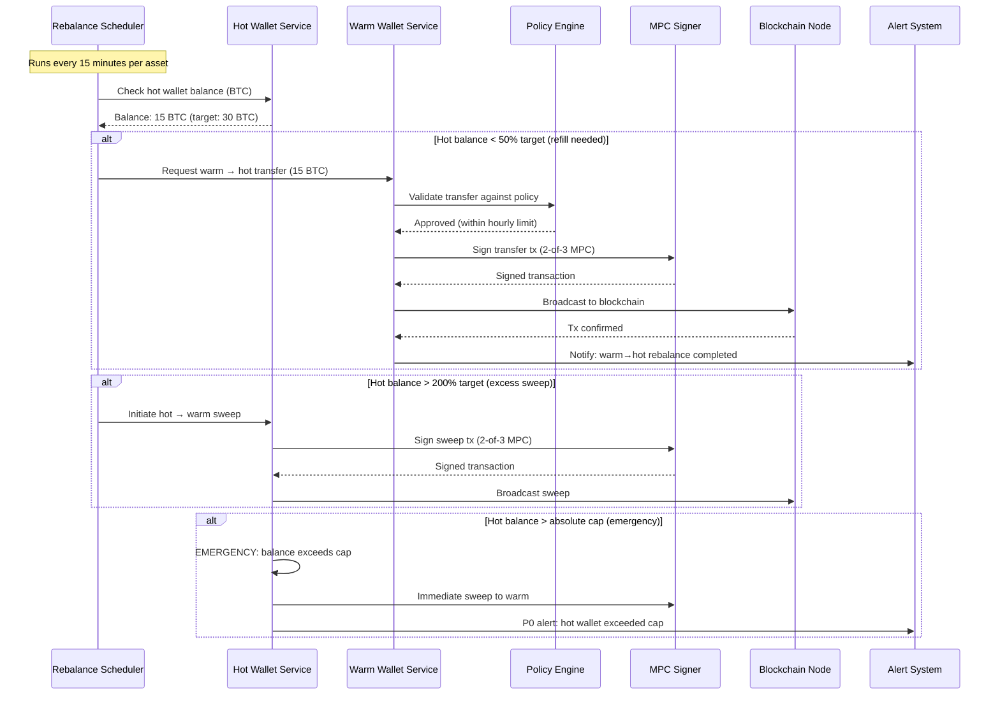

# High-Level Design

## Architecture Overview

The cryptocurrency exchange follows a **CQRS + event-sourcing** architecture. The matching engine is the single source of truth---a deterministic state machine that processes orders and emits events. All downstream systems (balance service, market data, risk engine, settlement) consume these events independently. The custody layer (hot/warm/cold wallets) operates as a separate security domain with its own authorization boundaries.



---

## Key Design Decisions

| Decision | Choice | Rationale |
|----------|--------|-----------|
| **Matching engine model** | Single-threaded per pair, event-sourced | Determinism eliminates race conditions; replay enables audit and recovery |
| **State management** | CQRS (command/query separation) | Write path (matching) optimized for throughput; read path (market data) optimized for fan-out |
| **Custody architecture** | Hot/warm/cold with MPC signing | Defense-in-depth; hot wallet exposure minimized; MPC eliminates single private key risk |
| **Order book data structure** | Red-black tree per side (bid/ask) | O(log n) insert/delete/match; maintains sorted order for price-time priority |
| **Market data distribution** | Publish-subscribe via message broker | Decouples matching engine from millions of consumers; enables independent scaling |
| **Balance updates** | Event-driven from matching engine | Single source of truth; no dual-write; balances always consistent with trade events |
| **Blockchain integration** | One microservice per chain family | UTXO chains (Bitcoin) and account chains (Ethereum) have fundamentally different deposit/withdrawal logic |
| **Database strategy** | Relational for balances/orders; time-series for market data | ACID for financial correctness; columnar time-series for efficient candlestick queries |

---

## Data Flow: Order Lifecycle



---

## Data Flow: Deposit Pipeline



---

## Data Flow: Withdrawal Pipeline

```mermaid
sequenceDiagram
    participant USER as User
    participant GW as API Gateway
    participant WITH as Withdrawal Service
    participant FRAUD as Fraud Check
    participant BAL as Balance Service
    participant APPROVE as Approval Engine
    participant SIGN as MPC Signer
    participant HW as Hot Wallet
    participant NODE as Blockchain Node

    USER->>GW: Request withdrawal (2 BTC to address)
    GW->>WITH: Process withdrawal
    WITH->>BAL: Check available balance
    BAL-->>WITH: Balance sufficient
    WITH->>BAL: Lock withdrawal amount + fee
    WITH->>FRAUD: Risk assessment
    FRAUD->>FRAUD: Check address reputation, velocity, amount
    alt Low risk (automated)
        FRAUD-->>WITH: Auto-approved
        WITH->>SIGN: Request transaction signing
        SIGN->>SIGN: MPC threshold signing (3-of-5)
        SIGN-->>WITH: Signed transaction
        WITH->>HW: Broadcast via hot wallet
        HW->>NODE: Submit to blockchain
        NODE-->>WITH: Transaction hash
        WITH->>BAL: Debit balance (locked → withdrawn)
        WITH->>USER: Tx hash + confirmation
    else High risk (manual review)
        FRAUD-->>WITH: Requires manual approval
        WITH->>APPROVE: Queue for compliance review
        APPROVE->>APPROVE: Human reviewer checks
        APPROVE-->>WITH: Approved / Rejected
    end
```



---

## Component Responsibilities

### Trading Core

| Component | Responsibility |
|-----------|---------------|
| **Order Management Service** | Order validation, lifecycle tracking, cancel/amend handling, idempotency |
| **Matching Engine** | Price-time priority matching, order book maintenance, fill generation, deterministic execution |
| **Pre-Trade Risk Check** | Balance verification, position limits, pair trading status, self-trade prevention |

### Balance and Settlement

| Component | Responsibility |
|-----------|---------------|
| **Balance Service** | Available/locked/frozen balance management, atomic transitions, double-spend prevention |
| **Settlement Service** | Post-trade settlement, balance transfers between buyer and seller |
| **Ledger Service** | Immutable double-entry ledger of all balance changes, reconciliation source of truth |
| **Fee Service** | Maker/taker fee calculation, VIP tier lookup, fee discounts, fee collection to platform account |

### Custody

| Component | Responsibility |
|-----------|---------------|
| **Hot Wallet Service** | Automated withdrawals, balance monitoring, rebalance triggers |
| **Warm Wallet Service** | Buffer between hot and cold, multi-sig transfers, scheduled sweeps |
| **Cold Wallet Manager** | Air-gapped storage, manual multi-party ceremony for withdrawals |
| **HSM/MPC Signing** | Threshold signature generation, key share management, ceremony orchestration |

### Market Data

| Component | Responsibility |
|-----------|---------------|
| **Market Data Processor** | Consume matching engine events, normalize trade/book data |
| **Order Book Aggregator** | Maintain L2 (price-level) and L3 (order-level) book snapshots |
| **Candlestick Generator** | Aggregate trades into OHLCV candles at multiple intervals |
| **Ticker Service** | Compute 24h rolling statistics (price, volume, change) per pair |

---

## Cross-Cutting Concerns

### Idempotency

Every order submission carries a client-generated `client_order_id`. The Order Management Service deduplicates using a Redis-backed idempotency cache (30s TTL) with a database unique constraint as safety net. Duplicate submissions return the original response without re-processing.

### Event Sourcing and Replay

The matching engine writes every input and output to an append-only event log. On recovery, the engine replays the log from the last snapshot to reconstruct state. This guarantees:
- Zero order loss after acknowledgment
- Deterministic audit trail for regulatory review
- Ability to replay any point in time for debugging

### Rate Limiting

Three tiers of rate limiting:
1. **IP-level**: 1,200 requests/min (anti-DDoS)
2. **Account-level**: Varies by VIP tier (120-6,000 orders/min)
3. **Pair-level**: Prevents single user from overwhelming one market

### Circuit Breaking

If the matching engine falls behind (input queue depth > threshold), the gateway rejects new orders with a "system busy" response rather than queuing unboundedly. This prevents cascading latency during flash crashes.

---

## Data Flow: Margin Trading and Liquidation



---

## Data Flow: Hot Wallet Rebalancing



---

## AI/ML Integration Points

| Integration | Model Type | Input | Output | Latency Budget |
|-------------|-----------|-------|--------|----------------|
| **Withdrawal fraud detection** | Gradient-boosted ensemble | User behavior, tx amount, address reputation, velocity | Risk score (0-100) | < 200ms |
| **Market manipulation detection** | Sequence model (transformer) | Order flow patterns, cancel rates, cross-account correlation | Spoofing/layering probability | < 1s |
| **KYC document verification** | Vision model + OCR | ID document images, selfie, liveness video | Verification result + confidence | < 30s |
| **Hot wallet demand prediction** | Time-series forecasting | Historical withdrawals, market conditions, news sentiment | Predicted withdrawal volume (4h window) | < 10s (batch) |
| **Wash trading detection** | Graph neural network | Trade graph between accounts, price patterns | Wash trading probability per account pair | Batch (hourly) |
| **Address clustering** | Graph analysis + heuristics | On-chain transaction graph | Entity identification, cluster membership | Batch (daily) |
| **Anomalous login detection** | Behavioral biometrics model | Typing patterns, mouse movement, device fingerprint | Anomaly score | < 500ms |
| **Dynamic fee optimization** | Reinforcement learning | Market conditions, competitor fees, user elasticity | Optimal maker/taker spread per pair | Batch (daily) |
| **Liquidation price impact prediction** | Market microstructure model | Order book depth, pending liquidations, mark price trajectory | Estimated slippage for liquidation order size | < 50ms |
| **Chain analysis for AML** | GNN on blockchain graph | Multi-hop fund flows, mixer detection, darknet patterns | Risk classification per address | < 5s |

---

## Cross-Service Communication Patterns

| Communication | Pattern | Protocol | Why |
|--------------|---------|----------|-----|
| Client → API Gateway | Request-response | HTTPS REST, WebSocket | Standard client communication; WebSocket for streaming |
| Client → FIX Gateway | Persistent session | FIX 4.4/5.0 | Institutional standard; pre-established low-latency sessions |
| OMS → Matching Engine | Async queue | Lock-free ring buffer (shared memory) | Sub-microsecond latency; no serialization overhead |
| Matching Engine → Event Log | Sync write | Direct NVMe append | Every event persisted before ACK; durability guarantee |
| Event Log → Consumers | Pub-sub | Durable message broker | Decoupled consumption; independent consumer groups |
| Balance Service → DB | Request-response | Database protocol with connection pool | ACID transactions for financial correctness |
| Market Data → WebSocket | Pub-sub fan-out | Internal binary protocol → WebSocket JSON/binary | Pre-serialization; one encode, many sends |
| Withdrawal → MPC Signer | Request-response | mTLS gRPC | Authenticated, encrypted; audit trail on every call |
| Deposit Monitor → Blockchain | Polling + subscription | Chain-specific RPC (JSON-RPC, WebSocket) | Redundant detection; polling as fallback for missed events |
| Internal services | Request-response + events | gRPC (sync) + message broker (async) | gRPC for queries; events for state changes |

---

## FIX Protocol Gateway

Institutional clients (hedge funds, market makers, algorithmic trading firms) connect via the FIX (Financial Information eXchange) protocol---the same protocol used in traditional stock exchanges:

```
FIX SESSION LIFECYCLE:

1. LOGON (35=A)
   - Client sends logon with credentials
   - Server validates and establishes session
   - Heartbeat interval negotiated (typically 30s)

2. ORDER FLOW (steady state)
   - New Order Single (35=D) → maps to POST /orders internally
   - Execution Report (35=8) ← fill/cancel/reject notifications
   - Order Cancel Request (35=F) → maps to DELETE /orders/{id}
   - Market Data Request (35=V) → subscribe to order book/trades
   - Market Data Snapshot (35=W) ← order book snapshots

3. SEQUENCE MANAGEMENT
   - Both sides maintain message sequence numbers
   - Gap detection → Resend Request (35=2)
   - Sequence reset on session start each day

4. ADVANTAGES FOR INSTITUTIONAL:
   - Sub-millisecond message parsing (binary-like efficiency)
   - Persistent sessions (no connection overhead per order)
   - Industry-standard risk controls built into protocol
   - Existing trading infrastructure compatibility
```

---

## Architecture Decision Records

| Decision | Date | Context | Choice | Consequences |
|----------|------|---------|--------|--------------|
| **ADR-001: Single-threaded matching** | Day 0 | Need auditability, replay, regulatory compliance | Single-threaded per pair, deterministic | Limits per-pair throughput to ~500K ops/sec; horizontal scale by pair count |
| **ADR-002: MPC over multi-sig** | Day 0 | Must support 50+ chains; multi-sig not available on all chains | MPC threshold signatures for all tiers | Chain-agnostic; higher implementation complexity; vendor dependency for MPC library |
| **ADR-003: Event sourcing for matching** | Day 0 | Need zero-loss guarantee; auditors require full replay | Append-only event log as source of truth | Growing storage cost; all consumers must be idempotent; snapshot strategy needed |
| **ADR-004: Batch net settlement** | Month 3 | 100K trades/sec causing DB contention on balance updates | 100ms batching with net aggregation per user | Reduced DB writes by 50-100x; users see slight delay (100ms) in balance updates |
| **ADR-005: Dynamic confirmation thresholds** | Month 6 | Large deposits warrant more caution; small deposits frustrate users | Confirmation threshold scales with deposit size | Better UX for small deposits; more security for large ones; requires per-chain configuration |
| **ADR-006: Incremental liquidation** | Month 8 | Full position liquidation caused cascading market crashes | 25% steps with 5-second cooldown between rounds | Reduced market impact by ~60%; slower to fully liquidate; some positions may recover |
