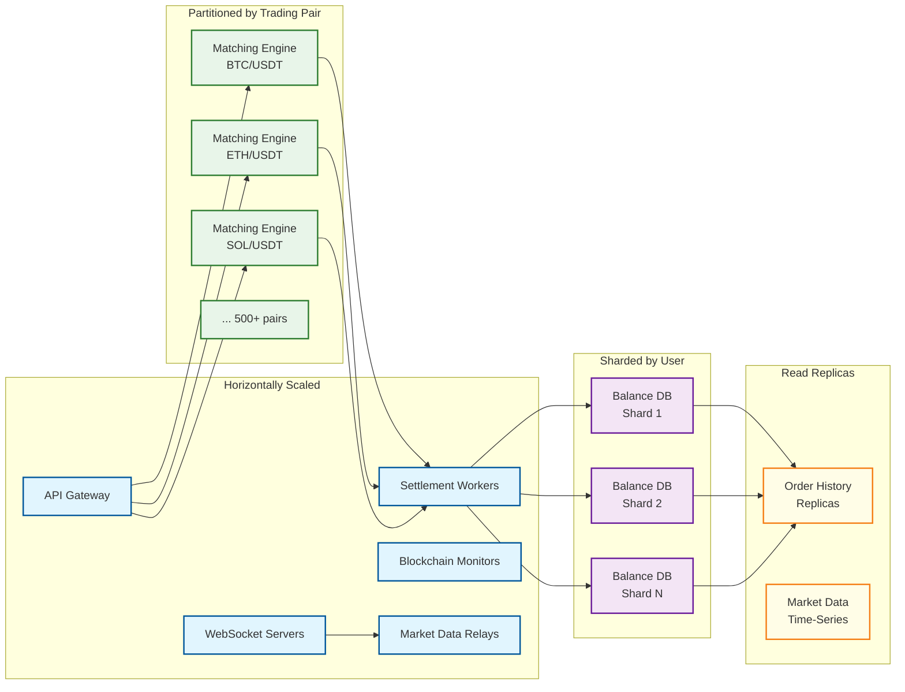
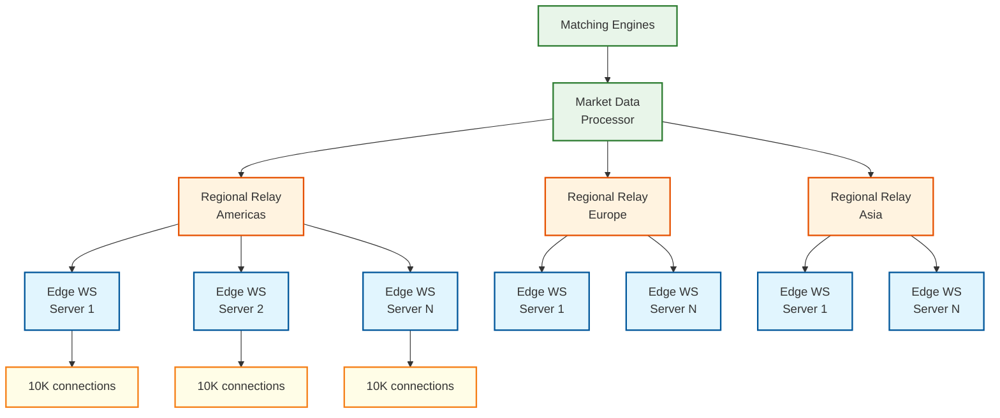
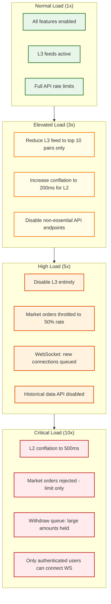

# Scalability and Reliability

## Scaling Strategy Overview



---

## Matching Engine Scaling

### One Engine Per Pair (Horizontal Partitioning)

Each trading pair runs its own matching engine instance. This is the fundamental scaling unit:

| Pair Category | Count | Engine Sizing |
|---------------|-------|---------------|
| Top-tier (BTC/USDT, ETH/USDT) | 5-10 | Dedicated bare-metal, 500K orders/sec |
| Mid-tier (popular alts) | 50-100 | Shared high-performance VMs, 100K orders/sec |
| Long-tail (low volume) | 400+ | Multiplexed on shared instances, 10K orders/sec |

### Failover Architecture

Each matching engine has a **hot standby** replica that consumes the same input event stream:

```
PRIMARY ENGINE:
    input_queue → [Match] → output_queue → event_log
                                              │
                                    (replicated)
                                              │
STANDBY ENGINE:                               ▼
    input_queue → [Match] → output_queue (discarded)
                     │
              Verifies output matches
              primary's event log
```

**Failover process**:
1. Health monitor detects primary failure (missed heartbeat for 500ms)
2. Standby is already caught up (processing same input stream)
3. Standby promoted to primary (< 1 second)
4. Input queue drains to new primary
5. Zero order loss because the input queue is durable (message broker)

**Key Rule that never changes**: The standby must produce identical output for the same input sequence. If outputs diverge, it indicates a non-determinism bug and triggers an alert (do NOT failover to a divergent standby).

---

## Balance Database Scaling

### Sharding Strategy

Balances are sharded by `user_id` (consistent hashing). This ensures:
- All balances for a single user are on the same shard (single-shard transactions for internal transfers)
- Trade settlement between users on different shards uses optimistic batching

```
SHARD ASSIGNMENT:
    shard_id = consistent_hash(user_id) % NUM_SHARDS

    Shard 1: users A-F  (balance reads/writes for these users)
    Shard 2: users G-L
    ...
    Shard N: users U-Z

TRADE SETTLEMENT (cross-shard):
    // Buyer on Shard 1, Seller on Shard 3
    // Option A: Two-phase with timeout (simple, rare conflicts)
    // Option B: Batch net settlement (preferred at scale)

BATCH NET SETTLEMENT:
    // Every 100ms, aggregate fills per user per asset
    net_changes = {}
    FOR EACH trade IN batch:
        net_changes[buyer][base_asset] += quantity
        net_changes[buyer][quote_asset] -= cost + fee
        net_changes[seller][base_asset] -= quantity
        net_changes[seller][quote_asset] += cost - fee

    // Apply net changes per shard in parallel
    FOR EACH shard IN affected_shards:
        users_on_shard = filter(net_changes, shard)
        APPLY batch_update(users_on_shard)  // single transaction per shard
```

### Read Scaling

- **Balance reads**: Served from primary (strong consistency required for available balance)
- **Order history**: Served from read replicas (1-2 second lag acceptable)
- **Trade history**: Served from time-series database (optimized for range queries)

---

## Market Data Scaling

### Hierarchical Fan-Out



**Scaling math**:
- 2M concurrent WebSocket connections
- Each edge server handles ~10K connections (kernel-level epoll/kqueue)
- 200 edge servers required
- Each regional relay fans out to ~70 edge servers
- Market data processor is a single pipeline (per pair) that formats engine events

### Conflation for Bandwidth Control

```
CONFLATION STRATEGY:

High-frequency traders (L3 feed):
    - No conflation, every individual event
    - Rate: ~10K msg/sec/pair
    - Requires co-location or fast connection

Standard traders (L2 feed):
    - 100ms conflation: batch all changes in 100ms window into single update
    - Rate: ~10 msg/sec/pair
    - Includes aggregated depth snapshot

Casual users (L1 feed):
    - 1 second conflation: best bid/ask + last price
    - Rate: ~1 msg/sec/pair
```

---

## Blockchain Layer Scaling

### Multi-Chain Architecture

```
FOR EACH blockchain_family:
    ┌────────────────────────────────────┐
    │      Blockchain Gateway Service     │
    │  (normalizes chain-specific logic)  │
    ├────────────────────────────────────┤
    │  Deposit Monitor (3+ instances)    │
    │  Withdrawal Broadcaster            │
    │  Address Generator                  │
    │  Confirmation Tracker              │
    ├────────────────────────────────────┤
    │  Node Pool (3+ nodes per chain)    │
    │  - Self-hosted full nodes          │
    │  - Commercial RPC (backup)         │
    │  - Archive node (historical)       │
    └────────────────────────────────────┘
```

**Chain families and their quirks**:

| Chain Family | Examples | Model | Deposit Detection | Confirmation Time |
|-------------|----------|-------|-------------------|-------------------|
| EVM | Ethereum, Polygon, BSC | Account-based | Event log scanning | 12s - 5min |
| UTXO | Bitcoin, Litecoin | UTXO | UTXO monitoring | 10-60 min |
| Solana | Solana, SPL tokens | Account + slots | Transaction parsing | ~0.4s |
| Cosmos | ATOM, OSMO | Account + IBC | Event subscription | ~6s |
| Move-based | Aptos, Sui | Object-based | Event subscription | ~1s |

---

## Reliability and Fault Tolerance

### Failure Modes and Recovery

| Failure | Impact | Detection | Recovery | RTO |
|---------|--------|-----------|----------|-----|
| Matching engine crash | Trading halted for affected pair | Heartbeat miss (500ms) | Hot standby promotion | < 1s |
| Balance DB shard failure | Users on that shard cannot trade | Replication lag monitor | Promote replica to primary | < 30s |
| WebSocket server crash | Connected users lose real-time feed | Connection drop | Client auto-reconnect to another server; re-sync snapshot | < 5s |
| Blockchain node failure | Deposits/withdrawals delayed for that chain | Block height stall | Failover to backup node | < 1 min |
| Hot wallet compromise | Potential asset theft (2-5% exposure) | Anomaly detection on withdrawal patterns | Freeze hot wallet; rotate keys; switch to warm wallet | < 5 min |
| Event log corruption | Cannot replay matching engine state | Checksum validation | Restore from snapshot + replay from backup log | < 10 min |
| Full data center outage | All services in that region down | Multi-region health check | DNS failover to standby region | < 5 min |

### Data Durability

```
DURABILITY LAYERS:

1. Matching Engine Event Log
   - Synchronously written to local NVMe + replicated to remote storage
   - WAL (write-ahead log) ensures no event loss
   - Snapshots every 60 seconds for fast replay

2. Balance Database
   - Synchronous replication (primary → standby)
   - Asynchronous replication to read replicas
   - Point-in-time recovery capability (WAL archival)
   - Daily full backup to object storage

3. Blockchain Transaction Records
   - Stored in primary DB + replicated to analytics DB
   - Blockchain itself is the ultimate source of truth for on-chain data
   - Cross-reference with blockchain during reconciliation

4. Trade and Order History
   - Written to primary DB and streaming to time-series store
   - Immutable (append-only, no updates or deletes)
   - Retained indefinitely (regulatory requirement)
```

---

## Disaster Recovery

### Multi-Region Architecture

```
ACTIVE-PASSIVE with Hot Standby:

PRIMARY REGION (Active):
    - All matching engines (primary)
    - Balance DB primaries
    - Hot/warm wallets (signing authority)
    - API gateway (serves traffic)

STANDBY REGION (Hot Standby):
    - Matching engine standbys (consuming event stream)
    - Balance DB replicas (async replication, < 1s lag)
    - Read-only API (serves market data, account queries)
    - No signing authority (prevents split-brain withdrawals)

FAILOVER DECISION:
    - Automated for stateless services (API, WebSocket, market data)
    - MANUAL for matching engine (prevents split-brain trading)
    - MANUAL for custody (prevents double-spend across regions)

WHY NOT ACTIVE-ACTIVE:
    - Matching engine must be single-threaded per pair → cannot run in two regions
    - Balance updates require strong consistency → async replication lag breaks invariants
    - Custody signing must have single authority → split-brain = potential double-withdrawal
```

### RPO and RTO Targets

| Component | RPO (data loss) | RTO (recovery time) | Strategy |
|-----------|----------------|---------------------|----------|
| Matching engine | 0 (zero loss) | < 1s | Hot standby with event replay |
| Balance DB | 0 (zero loss) | < 30s | Synchronous replication |
| Market data | < 1s | < 5s | Rebuilt from event log |
| Trade history | 0 | < 1 min | Replicated to multiple stores |
| Blockchain state | N/A (blockchain is external) | < 5 min | Node failover |

---

## Capacity Planning

### Growth Triggers

| Metric | Current | Threshold | Scaling Action |
|--------|---------|-----------|----------------|
| Orders/sec per pair | 200K | > 80% engine capacity | Optimize engine; consider pair split |
| WebSocket connections | 2M | > 70% edge capacity | Add edge servers |
| Balance DB shard load | 10K TPS | > 70% shard capacity | Add shard (re-hash) |
| Hot wallet utilization | 60% of target | > 90% of target sustained 1h | Increase warm → hot sweep frequency |
| Settlement lag | 50ms | > 500ms | Add settlement workers |
| Blockchain node sync lag | < 2 blocks | > 10 blocks | Add nodes; investigate provider issues |

### Load Testing Strategy

- **Synthetic order generation**: Replay anonymized production order flow at 2x-5x volume
- **Flash crash simulation**: Generate 10x normal order rate for 60 seconds with extreme price moves
- **Withdrawal storm**: Simulate bank-run scenario with 10x normal withdrawal requests
- **Blockchain fork simulation**: Inject synthetic reorg events to test deposit reversal logic
- **Chaos engineering**: Random failure injection (kill matching engine, corrupt event log, network partition)

---

## Chaos Engineering

### Failure Injection Experiments

| Experiment | Target | Method | Expected Behavior | Blast Radius |
|-----------|--------|--------|-------------------|--------------|
| **Kill matching engine** | Primary engine for mid-tier pair | Process kill (SIGKILL) | Standby promotes in < 1s; zero order loss; trading resumes | Single pair affected |
| **Balance DB shard failure** | One of N shards | Kill primary DB instance | Replica promotes in < 30s; affected users see brief read-only state | Users on that shard |
| **Event log partition** | Network between engine and event log | iptables drop | Engine detects write failure; pauses accepting orders; resumes on recovery | Single pair |
| **Hot wallet signing failure** | MPC signer node | Kill one of three MPC share holders | Remaining 2-of-3 continues signing; no withdrawal delay | None (graceful degradation) |
| **Blockchain node desync** | Ethereum full node | Corrupt state DB | Deposit monitor fails over to backup node; deposits delayed < 1 min | Single chain, deposits only |
| **WebSocket server crash** | Edge WS server (10K connections) | Process kill | Clients auto-reconnect to different edge; re-sync via snapshot | 10K users experience brief disconnect |
| **Regional relay failure** | Americas relay | Network partition | Edge servers in region failover to backup relay; latency increase ~20ms | Regional latency degradation |

### Game Day Scenarios

| Scenario | Duration | Participants | Objective |
|----------|----------|-------------|-----------|
| **Flash crash simulation** | 2 hours | Trading ops + SRE + security | Validate circuit breakers, liquidation dampening, hot wallet stability under 10× withdrawal demand |
| **Cold wallet ceremony drill** | 4 hours | Key custodians + security | Full cold-to-warm transfer ceremony; verify all 5 custodians can participate; test emergency subset (3-of-5) |
| **Multi-chain halt** | 1 hour | Blockchain team + support | Simulate Solana-style chain halt; verify deposits/withdrawals pause cleanly; trading continues on exchange |
| **Full region failover** | 6 hours | All engineering + trading ops | DNS failover to standby region; matching engine promotion; verify zero data loss; measure RTO |

---

## Capacity Planning Formula

```
MATCHING ENGINE CAPACITY:
    Required engines = SUM(peak_orders_per_pair / engine_capacity_per_pair)
    Buffer = 2× (for standby) + 20% headroom
    Example: 10 top pairs × 200K ops/sec = 10 engines
             100 mid-tier × 50K = multiplexed onto 20 engines
             400 long-tail × 5K = multiplexed onto 10 engines
             Total: 40 engines × 2 (standby) = 80 engine instances

WEBSOCKET CAPACITY:
    Edge servers = peak_connections / connections_per_server
    Example: 2M connections / 10K per server = 200 edge servers
    Regional relays = 3 regions × 2 (redundancy) = 6 relay servers

BALANCE DB CAPACITY:
    Shards = peak_settlement_tps / tps_per_shard
    Example: 100K trades/sec × ~2 balance ops per trade = 200K ops/sec
             Batch settlement (100ms) reduces to ~2K batch ops/sec
             At 500 TPS per shard = 4 shards minimum
             With 3× headroom = 12 shards
             Each shard: primary + 1 sync replica + 1 async replica = 36 DB instances

BLOCKCHAIN NODE CAPACITY:
    Nodes per chain = 3 (minimum: 2 full + 1 archive)
    Total: 50 chains × 3 = 150 nodes
    High-volume chains (ETH, BTC, SOL): 5 nodes each
    Total adjusted: ~180 nodes
```

---

## Graceful Degradation Matrix



---

## Hot Partition Detection and Mitigation

### Identifying Hot Pairs

The matching engine fleet has naturally uneven load distribution: BTC/USDT may handle 200K orders/sec while a long-tail pair handles 50. Detecting and reacting to hot partitions prevents engine stalls:

```
HOT PARTITION DETECTION:

METRICS (per engine instance):
    - CPU utilization > 85% sustained for 60s
    - Input queue depth growing (positive derivative for 30s)
    - p99 latency exceeding 2× baseline

RESPONSE LADDER:
    1. ALERT on-call (informational)
    2. If CPU > 90% for 5 min: Enable aggressive rate limiting for that pair
    3. If queue depth > 5000: Reject market orders (limit-only mode)
    4. If engine is at risk of falling behind:
       Split order flow into "fast lane" (marketable orders)
       and "slow lane" (deep book limit orders far from mid-price)
       Process fast lane with priority
```

### Cross-Pair Dependency During Settlement

Although matching engines are independent per pair, settlement creates cross-pair dependencies through shared balance rows:

```
CROSS-PAIR SETTLEMENT CONFLICT:

User buys BTC on BTC/USDT → needs USDT balance update
User buys ETH on ETH/USDT → also needs USDT balance update (same row)

Without batching: two settlement workers contend on the same balance row
With batch net settlement: both trades' USDT changes are netted in the
    same 100ms window and applied as a single atomic update

This is why batch net settlement is not just a performance optimization—
it is a correctness requirement for avoiding settlement deadlocks when
a user trades across multiple pairs simultaneously.
```
