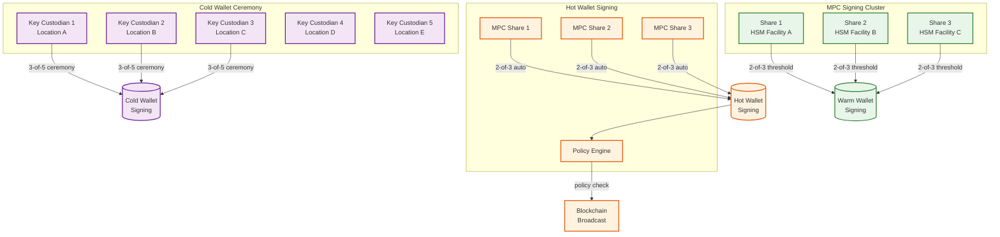

# Security and Compliance

## Threat Model

### Asset Categories and Risk

| Asset | Value at Risk | Primary Threat | Impact of Breach |
|-------|--------------|----------------|------------------|
| Private keys (cold) | Billions ($) | Physical theft, insider attack | Total loss of cold wallet reserves |
| Private keys (hot) | Millions ($) | Remote exploit, key extraction | Loss of hot wallet balance |
| User credentials | Account takeover → fund theft | Credential stuffing, phishing | Individual user losses |
| Matching engine | Market integrity | Code injection, logic manipulation | Phantom fills, unfair execution |
| Order book data | Trading advantage | Unauthorized access, front-running | Unfair market, regulatory violation |
| User PII | Regulatory penalty, reputation | Data breach, SQL injection | KYC data exposure, GDPR fines |

### Threat Actors

| Actor | Motivation | Capability | Primary Targets |
|-------|-----------|------------|-----------------|
| **Nation-state APT** | Theft (Lazarus Group precedent) | Advanced persistent access, zero-days | Cold wallet infrastructure, HSM firmware |
| **Organized crime** | Financial gain | Phishing campaigns, social engineering | Employee credentials, hot wallet keys |
| **Insider threat** | Financial gain, disgruntlement | Direct access to systems, keys | Key management ceremonies, withdrawal approval |
| **Market manipulator** | Trading profit | API abuse, wash trading | Matching engine, order book, market data |
| **Script kiddie / DDoS** | Disruption, ransom | Botnet, amplification attacks | API gateway, WebSocket infrastructure |

---

## Custody Security

### Key Management Architecture



### Cold Wallet Security Controls

| Control | Implementation |
|---------|---------------|
| **Air-gap enforcement** | Cold wallet signing machines never connect to any network; transactions moved via QR code or secure USB |
| **Geographic distribution** | 5 key custodians in 5 different cities/countries; no single jurisdiction can compel all keys |
| **Ceremony protocol** | Minimum 3-of-5 custodians must be physically present; video-recorded; dual witness required |
| **HSM storage** | Each key share stored in FIPS 140-3 Level 3 certified HSM; tamper-evident seals |
| **Time delay** | Cold wallet transactions require 48-hour intent declaration before ceremony |
| **Background checks** | Key custodians undergo enhanced background screening; rotated annually |

### Hot Wallet Policy Engine

Every hot wallet transaction passes through a policy engine before signing:

```
POLICY ENGINE RULES:

1. Amount limits:
   - Per transaction: max $100K equivalent
   - Per hour: max $2M equivalent per asset
   - Per day: max $10M equivalent per asset

2. Address screening:
   - Check destination against sanctions lists (OFAC SDN, EU sanctions)
   - Check against known theft/hack addresses
   - Check against mixer/tumbler addresses
   - BLOCK if address is flagged; route to manual review

3. Velocity checks:
   - Max 500 withdrawals per hour (across all users)
   - Max 50 withdrawals to the same address per day
   - Sudden spike in withdrawal volume → throttle + alert

4. Anomaly detection:
   - Withdrawal to never-before-seen address + above threshold → hold
   - Multiple withdrawals in rapid succession from same user → hold
   - Withdrawal during unusual hours for user's timezone → step-up auth

5. Emergency stop:
   - Any policy violation → block transaction
   - >= 3 policy violations in 5 minutes → FREEZE hot wallet
   - Manual re-enable required by security team (2-of-3 approvals)
```

---

## Authentication and Authorization

### User Authentication

| Layer | Mechanism | Purpose |
|-------|-----------|---------|
| **Primary auth** | Email/password with argon2id hashing | Account login |
| **2FA (mandatory for trading)** | TOTP (authenticator app) or hardware key (FIDO2/WebAuthn) | Prevents credential-stuffing account takeover |
| **Withdrawal auth** | Separate withdrawal password + 2FA + email confirmation | Defense-in-depth for fund movement |
| **API auth** | HMAC-SHA256 signed requests (API key + secret) | Machine-to-machine authentication |
| **Session management** | Short-lived JWT (15 min) + secure refresh token (7 days) | Minimize exposure of long-lived credentials |
| **Device binding** | Device fingerprint; new device requires email verification | Prevents stolen session abuse |

### API Request Signing

```
API AUTHENTICATION PROTOCOL:

1. Client constructs canonical request string:
   canonical = timestamp + method + path + query_string + body_hash

2. Client signs with secret key:
   signature = HMAC_SHA256(secret_key, canonical)

3. Client sends request with headers:
   X-API-Key: {public_key}
   X-API-Timestamp: {unix_ms}
   X-API-Signature: {signature}

4. Server validates:
   - Timestamp within 5-second window (prevents replay)
   - API key exists and is active
   - IP is in whitelist (if configured)
   - Recompute signature and compare
   - Check rate limit for this API key
```

---

## KYC/AML Compliance

### Tiered Verification

| Tier | Requirements | Limits | Timeline |
|------|-------------|--------|----------|
| **Tier 0 (Email only)** | Email verification | View-only; no trading or deposits | Instant |
| **Tier 1 (Basic)** | Full name + date of birth + country | Deposit: $10K/day; Withdrawal: $5K/day | Instant (automated) |
| **Tier 2 (Intermediate)** | Government ID (passport/DL) + selfie + liveness check | Deposit: $100K/day; Withdrawal: $50K/day | < 5 min (AI-assisted) |
| **Tier 3 (Advanced)** | Proof of address + source of funds declaration | Deposit: $1M/day; Withdrawal: $500K/day | < 24h (manual review) |
| **Tier 4 (Institutional)** | Corporate documents + beneficial ownership + AML program | Custom limits | 1-5 business days |

### Transaction Monitoring

```
AML MONITORING PIPELINE:

FOR EACH transaction (deposit, withdrawal, trade):
    1. RULE-BASED screening (real-time):
       - Structuring detection: multiple transactions just below reporting threshold
       - Rapid movement: deposit → trade → withdraw within short window
       - Round-trip: funds deposited and withdrawn without significant trading
       - Sanctions match: counterparty address on sanctions list

    2. BEHAVIORAL analysis (near real-time):
       - Unusual trading patterns for user profile
       - Sudden increase in transaction volume/value
       - Transactions with high-risk jurisdictions
       - Darknet/mixer address interaction

    3. NETWORK analysis (batch):
       - Cluster analysis of related addresses
       - Fund flow tracing across multiple hops
       - Identification of shell account networks

    4. ACTIONS:
       - Score < 30: Auto-clear
       - Score 30-70: Queue for compliance review (24h SLA)
       - Score > 70: Freeze account + escalate to compliance officer
       - Score > 90: File Suspicious Activity Report (SAR) with regulator
```

### FATF Travel Rule Implementation

For virtual asset transfers above the threshold ($1,000 in most jurisdictions):

```
TRAVEL RULE FLOW:

OUTBOUND (withdrawal to another VASP):
    1. Collect originator info: name, account, address
    2. Collect beneficiary info: name, VASP identifier, account
    3. Transmit to beneficiary VASP via travel rule protocol
    4. Wait for beneficiary VASP confirmation
    5. Execute withdrawal

INBOUND (deposit from another VASP):
    1. Receive originator/beneficiary info from sending VASP
    2. Screen both parties against sanctions lists
    3. Verify beneficiary matches registered user
    4. If checks pass → credit deposit
    5. If checks fail → hold funds + request more info

PROTOCOL OPTIONS:
    - TRISA (Travel Rule Information Sharing Alliance)
    - OpenVASP (open-source messaging protocol)
    - Proprietary VASP-to-VASP integrations
```

---

## Proof of Reserves

### Merkle Tree Approach

```
PROOF OF RESERVES CONSTRUCTION:

1. SNAPSHOT all user balances at block height H for each chain
   user_balances = [
       {user_hash: hash(user_id + salt), btc: 1.5, eth: 10.0, usdt: 50000},
       ...
   ]

2. BUILD Merkle tree:
   - Leaf = hash(user_hash || btc_balance || eth_balance || ...)
   - Internal nodes = hash(left_child || right_child)
   - Root = top of tree (published publicly)

3. PROVE on-chain reserves:
   - For each asset, publish signed message from cold/warm/hot wallet addresses
   - Verifiers check: wallet_balance >= sum(all_user_balances)

4. USER VERIFICATION:
   - User requests their Merkle proof (path from leaf to root)
   - User verifies: their balance is included in the tree
   - User verifies: root hash matches published root
   - User verifies: on-chain balances >= total in tree

PROPERTIES:
   - Users can verify inclusion without seeing other users' balances
   - Any tampering changes the root hash
   - Published monthly (or on-demand after market events)
```

---

## Application Security

### Input Validation and Injection Prevention

| Attack Vector | Protection |
|---------------|------------|
| **SQL injection** | Parameterized queries exclusively; no string concatenation for SQL |
| **XSS** | Content Security Policy headers; output encoding; no inline scripts |
| **CSRF** | SameSite cookies; anti-CSRF tokens for state-changing operations |
| **API abuse** | Rate limiting per IP, per account, per API key; CAPTCHA for suspicious patterns |
| **WebSocket injection** | Schema validation on all inbound messages; message size limits |
| **Integer overflow** | Decimal types for all financial amounts (DECIMAL(36,18)); range validation |
| **Replay attack** | Timestamp validation (5s window); nonce tracking for critical operations |

### Infrastructure Security

| Layer | Controls |
|-------|----------|
| **Network** | Private VPCs; no public internet access for matching engine or databases; bastion hosts for admin access |
| **Secrets** | All keys/credentials in secrets management service; rotated quarterly; no secrets in code or environment variables |
| **Encryption** | TLS 1.3 for all external traffic; mTLS between internal services; AES-256 encryption at rest for databases |
| **Access control** | RBAC for all internal systems; principle of least privilege; MFA required for all employee access |
| **Audit logging** | Immutable audit log for all admin actions, key access, and configuration changes |
| **Penetration testing** | Quarterly external penetration test; continuous bug bounty program |

---

## Regulatory Compliance Matrix

| Regulation | Jurisdiction | Key Requirements | Implementation |
|------------|-------------|-----------------|----------------|
| **MiCA** | EU | VASP licensing, proof of reserves, market abuse prevention | Full compliance framework; quarterly PoR publication |
| **BSA/FinCEN** | USA | MSB registration, SAR filing, CTR reporting | Automated SAR generation; transaction monitoring |
| **FATF Travel Rule** | Global (99+ countries) | Originator/beneficiary info for transfers > $1K | TRISA integration; info collection at withdrawal |
| **GDPR** | EU | Data minimization, right to erasure, breach notification | Pseudonymized storage; 72h breach notification process |
| **PCI-DSS** | Global (fiat payments) | Secure card data handling | Tokenization; no raw card data stored |
| **SOC 2 Type II** | Global (trust) | Security, availability, processing integrity controls | Annual audit; continuous monitoring |

---

## Incident Response

| Incident Type | Detection | Immediate Action | Communication | Recovery |
|--------------|-----------|-----------------|---------------|----------|
| **Hot wallet compromise** | Anomalous outflow pattern; policy engine alerts | Freeze hot wallet; rotate all MPC key shares; switch to warm wallet | Private notification to affected users; public statement within 4h | Insurance fund coverage; rebuild hot wallet with new keys |
| **Customer data breach** | IDS/IPS alert; abnormal data egress; external notification | Isolate affected systems; engage forensics team; preserve evidence | GDPR 72h notification; affected user notification; regulatory filing | Patch vulnerability; rotate credentials; enhance monitoring |
| **Matching engine manipulation** | Phantom fills detected; order book inconsistency | Halt affected pair; freeze suspicious accounts; preserve event log | Trading halt announcement; estimated restoration time | Replay event log to verify correct state; reverse phantom trades |
| **Blockchain 51% attack** | Reorg deeper than threshold; deposit reversal alerts | Pause deposits/withdrawals for affected chain; increase confirmation requirements | Status page update; chain-specific advisory | Assess losses; claim from insurance fund; resume with enhanced confirmations |
| **DDoS on API/WebSocket** | Traffic spike detection; latency degradation | Activate DDoS mitigation (scrubbing center); enable geo-blocking for attack sources | Status page update; priority for authenticated users | Post-attack analysis; IP reputation list update; capacity increase |

---

## Bug Bounty Program

| Severity | Scope | Reward Range | Response SLA |
|----------|-------|-------------|-------------|
| **Critical** | Remote code execution, key extraction, balance manipulation, matching engine bypass | $50K - $500K | Acknowledge: 1h, Triage: 4h |
| **High** | Authentication bypass, privilege escalation, significant data exposure | $10K - $50K | Acknowledge: 4h, Triage: 24h |
| **Medium** | Stored XSS, CSRF on sensitive actions, rate limit bypass, information disclosure | $2K - $10K | Acknowledge: 24h, Triage: 72h |
| **Low** | Self-XSS, missing headers, minor information leaks | $500 - $2K | Acknowledge: 48h, Triage: 1 week |

**Scope includes**: Web app, mobile apps, REST API, WebSocket API, blockchain integrations
**Out of scope**: Social engineering, physical attacks, third-party services, known issues

---

## Data Classification and Handling

| Classification | Examples | Storage | Access | Retention |
|---------------|----------|---------|--------|-----------|
| **Critical** | Private keys, MPC shares, HSM PINs | HSM hardware; never in software; never logged | Named key custodians only (3-of-5 ceremony) | Until key rotation |
| **Restricted** | User PII (name, ID, address), KYC documents | Encrypted at rest (AES-256); field-level encryption for PII | Compliance team + automated KYC pipeline | 7 years post-account closure |
| **Confidential** | Balances, order history, API keys, internal architecture docs | Encrypted at rest; database-level access controls | Authenticated service accounts; role-based for employees | Account lifetime + regulatory retention |
| **Internal** | Market data (pre-publication), matching engine metrics, system logs | Standard encryption at rest | Engineering team; service accounts | 90 days (logs), indefinite (metrics) |
| **Public** | Published order book, trade stream, ticker data, proof of reserves | CDN-served; no encryption needed | Anyone | Indefinite |

---

## Supply Chain Security

### Third-Party Risk Management

| Risk Area | Control | Verification |
|-----------|---------|-------------|
| **MPC library vendor** | Audit source code; maintain fork; reproducible builds | Annual third-party security audit of MPC implementation |
| **Blockchain node software** | Pin versions; verify checksums; test in staging before production | Hash verification of all node binaries against official releases |
| **KYC/AML SaaS provider** | Data processing agreement; encryption in transit and at rest; API key rotation | SOC 2 Type II compliance verification; annual vendor review |
| **Cloud infrastructure** | Private VPCs; no shared tenancy for matching engine; HSMs in dedicated hardware | Quarterly penetration test; infrastructure-as-code audit |
| **Open-source dependencies** | Automated vulnerability scanning; dependency pinning; SBOM generation | CVE monitoring with 24h patch SLA for critical vulnerabilities |

### Deployment Security

```
MATCHING ENGINE DEPLOYMENT PROTOCOL:

1. Code review: 2 independent reviewers required (one must be matching engine team)
2. Determinism test: replay 24h of production events; verify identical output
3. Canary deployment: deploy to standby engine for 1 hour; compare output
4. Promotion: if canary matches primary output perfectly, swap primary
5. Rollback: previous version hot-standby remains active for 24h

NEVER:
    - Deploy matching engine changes during high-volatility periods
    - Skip the determinism replay test
    - Deploy to all engines simultaneously
    - Deploy without a tested rollback path
```

---

## Zero-Knowledge Proof of Reserves (2025-2026)

Traditional Merkle tree PoR reveals total liabilities and individual user balance hashes. ZK-PoR improves privacy:

```
ZK-PROOF OF RESERVES:

PROVER (Exchange):
    1. Commit to all user balances in a cryptographic commitment scheme
    2. Generate ZK proof that:
       a. Each user balance ≥ 0 (no negative balances)
       b. Sum of all committed balances = published total_liabilities
       c. On-chain reserves ≥ total_liabilities
    3. Publish: proof, total_liabilities, on-chain attestation

VERIFIER (User or Auditor):
    1. Verify ZK proof is valid (without seeing individual balances)
    2. Verify on-chain reserves match attestation
    3. Each user separately verifies their individual commitment

ADVANTAGES OVER MERKLE TREE:
    - Does not reveal total number of users
    - Does not reveal distribution of balances
    - Proof size is constant (not proportional to user count)
    - Stronger privacy guarantees (no inference from tree structure)

LIMITATIONS:
    - Computationally expensive to generate (hours for large user sets)
    - Still a point-in-time snapshot (not continuous)
    - ZK circuit complexity requires specialized expertise
```
