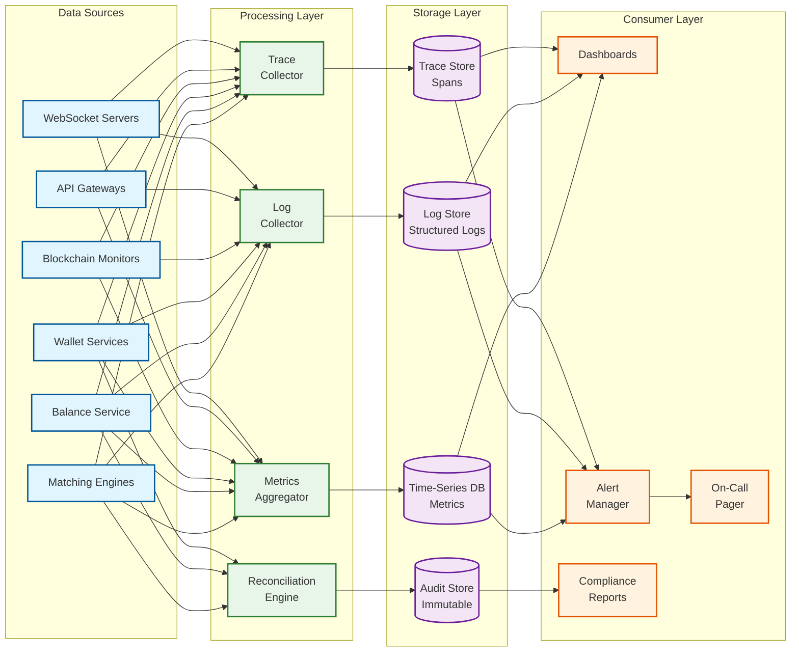

# Observability

## Observability Strategy

A cryptocurrency exchange operates 24/7 with real money at stake. Observability must detect issues **before** they become incidents---a 1-second matching engine stall during a flash crash can cost millions in slippage, and a missed deposit can erode user trust irreversibly. The observability system is organized around four pillars: metrics, logging, tracing, and alerting, with domain-specific dashboards for each critical subsystem.

---

## Key Metrics

### Matching Engine Metrics

| Metric | Type | Description | Alert Threshold |
|--------|------|-------------|-----------------|
| `matching.latency.p50` | Histogram | Order-to-fill latency (50th percentile) | > 1ms |
| `matching.latency.p99` | Histogram | Order-to-fill latency (99th percentile) | > 5ms |
| `matching.latency.p999` | Histogram | Tail latency (99.9th percentile) | > 20ms |
| `matching.orders_per_sec` | Counter | Orders processed per second per pair | < 100 (pair should be active) |
| `matching.fills_per_sec` | Counter | Trade fills generated per second | Monitor for sudden drops |
| `matching.queue_depth` | Gauge | Input queue depth (pending orders) | > 1000 (engine falling behind) |
| `matching.book_depth.bids` | Gauge | Number of bid price levels | < 10 (thin book, illiquid) |
| `matching.book_depth.asks` | Gauge | Number of ask price levels | < 10 |
| `matching.spread_bps` | Gauge | Bid-ask spread in basis points | > 50 bps (unusual for top pairs) |
| `matching.snapshot_age_sec` | Gauge | Time since last engine snapshot | > 120s |
| `matching.standby_lag` | Gauge | Sequence gap between primary and standby | > 100 events |

### Balance and Settlement Metrics

| Metric | Type | Description | Alert Threshold |
|--------|------|-------------|-----------------|
| `balance.update_latency.p99` | Histogram | Time to apply balance change | > 50ms |
| `settlement.lag_ms` | Gauge | Time between fill event and balance update | > 500ms |
| `settlement.batch_size` | Histogram | Number of fills per settlement batch | Monitor for extremes |
| `settlement.errors` | Counter | Failed settlement operations | > 0 (any failure is critical) |
| `ledger.entries_per_sec` | Counter | Ledger writes per second | Monitor capacity |
| `balance.reconciliation.drift` | Gauge | Difference between materialized and computed balance | > 0 (any drift = P0) |
| `balance.negative_count` | Gauge | Users with negative balance (should always be 0) | > 0 |

### Custody and Wallet Metrics

| Metric | Type | Description | Alert Threshold |
|--------|------|-------------|-----------------|
| `wallet.hot.balance` | Gauge | Hot wallet balance per asset | < 20% of target (low) or > 200% (excess exposure) |
| `wallet.hot.utilization` | Gauge | Hot balance / target balance | < 0.3 or > 2.0 |
| `wallet.warm.balance` | Gauge | Warm wallet balance per asset | Below minimum threshold |
| `wallet.withdrawal.queue_depth` | Gauge | Pending withdrawals waiting for processing | > 1000 |
| `wallet.withdrawal.processing_time.p99` | Histogram | Time from request to blockchain broadcast | > 30 min |
| `wallet.signing.latency.p99` | Histogram | MPC signing ceremony duration | > 5s (hot), > 60s (warm) |
| `wallet.rebalance.frequency` | Counter | Hot wallet rebalance operations per hour | > 10 (unusual demand) |
| `wallet.reserves.ratio` | Gauge | On-chain reserves / total user balances | < 1.0 (critical: under-reserved) |

### Blockchain Monitoring Metrics

| Metric | Type | Description | Alert Threshold |
|--------|------|-------------|-----------------|
| `blockchain.node.block_height` | Gauge | Current block height per chain | Stale for > 3× block time |
| `blockchain.node.sync_lag` | Gauge | Blocks behind tip | > 10 blocks |
| `blockchain.deposit.detected` | Counter | Deposits detected per chain | Sudden drop to 0 |
| `blockchain.deposit.credited` | Counter | Deposits credited after confirmation | Growing gap with detected |
| `blockchain.deposit.confirmation_time.p99` | Histogram | Time from detection to credit | > 2× expected for chain |
| `blockchain.reorg.detected` | Counter | Blockchain reorganizations observed | > 0 (investigate immediately) |
| `blockchain.withdrawal.broadcast_success` | Counter | Successful withdrawal broadcasts | Monitor failure rate |
| `blockchain.withdrawal.stuck` | Gauge | Withdrawals broadcast but unconfirmed > 1h | > 0 |
| `blockchain.gas_price` | Gauge | Current gas price per EVM chain | > 3× 7-day average |

### Market Data and WebSocket Metrics

| Metric | Type | Description | Alert Threshold |
|--------|------|-------------|-----------------|
| `marketdata.propagation_latency.p99` | Histogram | Engine event to WebSocket delivery | > 10ms |
| `websocket.connections.active` | Gauge | Current WebSocket connections | > 80% capacity |
| `websocket.messages_out_per_sec` | Counter | Outbound messages per second | Monitor for spikes |
| `websocket.subscription_count` | Gauge | Active channel subscriptions | Track per pair |
| `websocket.errors.send_failure` | Counter | Failed message deliveries | > 0.1% of total |
| `marketdata.sequence_gap` | Counter | Out-of-sequence updates detected by clients | > 0 (consistency issue) |

---

## Logging Strategy

### Log Levels and Categories

| Category | Level | Content | Retention |
|----------|-------|---------|-----------|
| **Matching engine** | INFO | Order accepted/filled/cancelled with sequence numbers | 90 days (hot), 7 years (cold) |
| **Matching engine** | WARN | Queue depth approaching threshold; standby lag | 90 days |
| **Balance operations** | INFO | Every balance change with before/after values | 7 years (regulatory) |
| **Deposits** | INFO | Detection, confirmation progress, credit events | 7 years |
| **Withdrawals** | INFO | Request, risk check result, signing, broadcast, confirmation | 7 years |
| **KYC/AML** | INFO | Verification attempts, results, risk scores | 7 years |
| **API access** | INFO | Request/response (sanitized), latency, status code | 90 days |
| **Security events** | WARN/ERROR | Failed auth, IP blocks, anomaly triggers | 7 years |
| **Custody operations** | INFO | Rebalance events, signing ceremonies, policy decisions | 7 years |

### Structured Log Format

```
{
    "timestamp": "2026-03-09T10:30:00.123456Z",
    "service": "matching-engine",
    "pair": "BTC_USDT",
    "event": "order_filled",
    "sequence": 1234567890,
    "order_id": "uuid-...",
    "user_id_hash": "sha256...",   // never log raw user IDs in market-facing logs
    "side": "BUY",
    "fill_price": "60000.00",
    "fill_quantity": "0.5",
    "maker_order_id": "uuid-...",
    "latency_us": 342,
    "trace_id": "abc-123-def"
}
```

### Audit Log (Immutable)

All administrative actions and custody operations write to an append-only audit log:

```
AUDIT LOG ENTRIES:
- Employee login to admin panel (who, when, from where)
- Configuration changes (what changed, old value → new value)
- KYC approval/rejection (reviewer, decision, reason)
- Withdrawal manual approval (approver, amount, destination)
- Key ceremony initiation and completion
- Hot wallet policy changes
- Rate limit overrides
- Account freeze/unfreeze actions
```

---

## Distributed Tracing

### Trace Propagation

```
ORDER LIFECYCLE TRACE:

[API Gateway] ──→ [Order Management] ──→ [Risk Check] ──→ [Balance Lock]
    │                    │                    │                  │
    span: gateway        span: oms            span: risk        span: balance
    3ms                  1ms                  2ms               5ms
                                                                │
──→ [Matching Engine] ──→ [Event Log] ──→ [Settlement] ──→ [Market Data]
        │                     │               │                │
        span: matching        span: log       span: settle     span: mktdata
        0.3ms                 0.5ms           8ms              2ms

Total trace duration: ~22ms (order placed → balance settled + market data published)
```

### Critical Trace Points

| Trace | Spans | Key Measurement |
|-------|-------|-----------------|
| Order-to-fill | Gateway → OMS → Risk → Engine → Settlement | End-to-end trading latency |
| Deposit pipeline | Node detection → Confirmation → Credit | Per-chain deposit latency |
| Withdrawal pipeline | Request → Risk → Signing → Broadcast | Withdrawal processing time |
| Market data | Engine event → Processor → Relay → WebSocket | Data propagation latency |
| KYC verification | Submission → AI check → Manual review → Approval | Verification turnaround |

---

## Alerting Framework

### Severity Levels

| Severity | Response Time | Examples | Notification |
|----------|--------------|---------|--------------|
| **P0 - Critical** | < 5 min | Matching engine down; balance discrepancy; hot wallet anomaly; reserves < liabilities | Page on-call + call security team + exec notification |
| **P1 - High** | < 15 min | Settlement lag > 5s; blockchain node down; withdrawal queue > 2h backlog | Page on-call engineer |
| **P2 - Medium** | < 1 hour | API error rate > 1%; WebSocket disconnection spike; high gas prices blocking withdrawals | Slack alert to team channel |
| **P3 - Low** | Next business day | KYC queue growing; disk usage > 70%; non-critical service degradation | Ticket creation |

### Critical Alert Definitions

```
ALERT: matching_engine_down
    CONDITION: No heartbeat from matching engine for > 500ms
    SEVERITY: P0
    ACTION: Page on-call; verify standby status; prepare failover
    RUNBOOK: /runbooks/matching-engine-failover

ALERT: balance_reconciliation_drift
    CONDITION: Any user's materialized balance != computed balance from ledger
    SEVERITY: P0
    ACTION: Halt new transactions on affected shard; investigate immediately
    RUNBOOK: /runbooks/balance-drift-investigation

ALERT: hot_wallet_anomaly
    CONDITION: Hot wallet outflow exceeds 2× historical hourly average
    SEVERITY: P0
    ACTION: Freeze hot wallet; security team investigation
    RUNBOOK: /runbooks/hot-wallet-freeze

ALERT: reserves_below_liabilities
    CONDITION: On-chain reserves < sum(user balances) for any asset
    SEVERITY: P0
    ACTION: Immediate investigation; prepare public communication
    RUNBOOK: /runbooks/proof-of-reserves-discrepancy

ALERT: blockchain_reorg_detected
    CONDITION: Block hash mismatch for previously confirmed block
    SEVERITY: P1
    ACTION: Check for affected deposits; reverse credits if needed
    RUNBOOK: /runbooks/reorg-handling

ALERT: settlement_lag_high
    CONDITION: settlement.lag_ms p99 > 2000ms for > 5 minutes
    SEVERITY: P1
    ACTION: Check settlement worker health; check DB shard load
    RUNBOOK: /runbooks/settlement-lag
```

---

## SLI/SLO Dashboards

### Dashboard 1: Trading Health

```
┌─────────────────────────────────────────────────────┐
│  TRADING HEALTH DASHBOARD                           │
├──────────────┬──────────────┬───────────────────────┤
│ Matching     │ Orders/sec   │ [time-series graph]   │
│ Engine       │ p99 Latency  │ [time-series graph]   │
│              │ Queue Depth  │ [gauge: 0-10K]        │
│              │ Fill Rate    │ [percentage]           │
├──────────────┼──────────────┼───────────────────────┤
│ Order Book   │ Spread (bps) │ [per-pair heatmap]    │
│              │ Depth ($)    │ [per-pair bar chart]  │
│              │ Imbalance    │ [bid/ask ratio]       │
├──────────────┼──────────────┼───────────────────────┤
│ Settlement   │ Lag (ms)     │ [time-series graph]   │
│              │ Error Rate   │ [counter, should = 0] │
│              │ Batch Size   │ [histogram]           │
├──────────────┼──────────────┼───────────────────────┤
│ Balance      │ Recon Status │ [green/red per shard] │
│              │ Negative Bal │ [counter, should = 0] │
└──────────────┴──────────────┴───────────────────────┘
```

### Dashboard 2: Custody Health

```
┌─────────────────────────────────────────────────────┐
│  CUSTODY HEALTH DASHBOARD                           │
├──────────────┬──────────────┬───────────────────────┤
│ Hot Wallet   │ Balance      │ [per-asset gauges]    │
│              │ Utilization  │ [% of target]         │
│              │ Outflow/hour │ [time-series]         │
├──────────────┼──────────────┼───────────────────────┤
│ Reserves     │ Reserve Ratio│ [must be >= 1.0]      │
│              │ Last Audit   │ [timestamp]           │
│              │ Merkle Root  │ [hash display]        │
├──────────────┼──────────────┼───────────────────────┤
│ Withdrawals  │ Queue Depth  │ [gauge]               │
│              │ Avg Wait     │ [time-series]         │
│              │ Stuck Count  │ [counter]             │
├──────────────┼──────────────┼───────────────────────┤
│ Blockchain   │ Node Health  │ [per-chain status]    │
│              │ Sync Lag     │ [per-chain bars]      │
│              │ Reorgs       │ [counter]             │
└──────────────┴──────────────┴───────────────────────┘
```

### Dashboard 3: Compliance and Security

```
┌─────────────────────────────────────────────────────┐
│  COMPLIANCE & SECURITY DASHBOARD                    │
├──────────────┬──────────────┬───────────────────────┤
│ KYC          │ Pending      │ [queue depth]         │
│              │ Approval Rate│ [percentage]          │
│              │ Avg Time     │ [by tier]             │
├──────────────┼──────────────┼───────────────────────┤
│ AML          │ Alerts Today │ [by severity]         │
│              │ SARs Filed   │ [monthly count]       │
│              │ Frozen Accts │ [active count]        │
├──────────────┼──────────────┼───────────────────────┤
│ Security     │ Failed Auth  │ [time-series]         │
│              │ API Abuse    │ [blocked IPs]         │
│              │ Anomalies    │ [detection events]    │
└──────────────┴──────────────┴───────────────────────┘
```

---

## Reconciliation Jobs

| Job | Frequency | Purpose | Alert On Failure |
|-----|-----------|---------|------------------|
| **Balance reconciliation** | Every 15 min | Verify materialized balance = SUM(ledger entries) | P0 |
| **Proof of reserves** | Daily | Verify on-chain balances ≥ user balance totals | P0 |
| **Trade-settlement match** | Every 5 min | Verify every fill event has a corresponding settlement | P1 |
| **Deposit-blockchain cross-check** | Hourly | Verify all on-chain deposits to our addresses are detected | P1 |
| **Withdrawal-blockchain cross-check** | Hourly | Verify all broadcast withdrawals confirmed on-chain | P1 |
| **Fee collection audit** | Daily | Verify collected fees match expected fees from trades | P2 |
| **Hot wallet balance vs. target** | Every 15 min | Verify hot wallet within acceptable range | P2 |

---

## Observability Pipeline Architecture



---

## SLI/SLO Error Budget Tracking

| SLO | Budget (30-day) | Current Burn | Status | Burn Rate Alert |
|-----|-----------------|-------------|--------|-----------------|
| 99.999% matching engine uptime | 26 sec downtime | 3 sec used (engine restart, day 14) | Healthy (88% remaining) | Alert if >50% consumed in first 15 days |
| 99.99% API availability | 4.3 min downtime | 1.2 min used (gateway deploy, day 7) | Healthy (72% remaining) | Alert if >60% consumed in first 20 days |
| < 5ms matching p99 | 0.01% above 5ms | 0.003% above threshold | Healthy | Alert if daily rate exceeds 0.005% |
| 100% balance accuracy | Zero tolerance | 0 discrepancies | Perfect | Any discrepancy = P0 |
| < 30s deposit credit | 99% within 30s post-confirmation | 99.7% within target | Healthy | Alert if drops below 98% |
| < 5 min automated withdrawal | 95% within 5 min | 97% within target | Healthy | Alert if drops below 90% |

---

## Cost Observability

| Cost Driver | Metric | Optimization Lever | Target |
|------------|--------|-------------------|--------|
| **Blockchain node infrastructure** | Node count × instance cost per chain | Prune low-volume chains to shared nodes; archive selectively | < $200K/month |
| **WebSocket bandwidth** | Outbound GB/s × bandwidth cost | Conflation reduces bandwidth 10× for standard users; binary protocol for HFT | < $100K/month |
| **Database IOPS** | Balance DB write IOPS per shard | Batch settlement reduces IOPS 50-100×; read replica offloading | < $150K/month |
| **HSM/MPC licensing** | Per-signing-operation cost | Batch small withdrawals; optimize rebalancing frequency | < $50K/month |
| **Compliance SaaS** | Per-verification (KYC) + per-transaction (chain analysis) | Cache address risk scores; batch chain analysis queries | < $500K/month |

---

## On-Call Runbook Index

| Runbook | Trigger Alert | Key Steps | Escalation |
|---------|--------------|-----------|------------|
| `/runbooks/matching-engine-failover` | `matching_engine_down` | 1. Verify standby is caught up 2. Promote standby 3. Verify output consistency 4. Redirect traffic | If standby diverges → replay from event log → page matching engine team lead |
| `/runbooks/balance-drift-investigation` | `balance_reconciliation_drift` | 1. Identify affected user+asset 2. Halt transactions on shard 3. Compare materialized vs computed 4. Trace ledger entries | Any drift → P0 incident → finance team + CTO |
| `/runbooks/hot-wallet-freeze` | `hot_wallet_anomaly` | 1. Freeze signing 2. Audit recent withdrawals 3. Verify MPC share integrity 4. Rotate keys if compromised | Freeze → security team → CEO notification within 30 min |
| `/runbooks/reorg-handling` | `blockchain_reorg_detected` | 1. Identify affected deposits 2. Check if credited 3. Reverse if funds available 4. Insurance fund if spent | Reorg > 6 blocks → security team (possible 51% attack) |
| `/runbooks/settlement-lag` | `settlement_lag_high` | 1. Check settlement worker health 2. Check DB shard CPU/IOPS 3. Increase worker count 4. Check for lock contention | Lag > 30s sustained → halt new order acceptance on affected pairs |

---

## Business Health Observability

Beyond system metrics, the exchange must track business-level health indicators that signal problems before they become P0 incidents:

| Indicator | Metric | Healthy Range | Warning Signal |
|-----------|--------|-------------|----------------|
| **Net deposit/withdrawal ratio** | (deposits - withdrawals) / deposits per hour | 0.3 - 0.8 | < 0.1 (net outflow = potential bank run) |
| **Trading volume decay** | 24h volume vs. 7-day moving average | 0.5× - 2.0× | < 0.3× (users leaving) or > 5× (unusual activity) |
| **Maker/taker ratio** | Maker volume / total volume per pair | 0.4 - 0.6 | < 0.2 (insufficient liquidity provision) |
| **Average spread** | Weighted average spread across top 20 pairs | 1 - 10 bps | > 25 bps (market maker withdrawal or engine issues) |
| **New user registration rate** | Registrations per hour | Varies by market conditions | Sudden drop to 0 (onboarding broken) |
| **KYC completion rate** | Completed KYC / started KYC | > 70% | < 40% (friction or vendor outage) |
| **Support ticket volume** | Tickets per hour by category | Category-specific baseline | 3× baseline in "missing deposit" category |
| **Insurance fund depletion rate** | Fund balance change over 24h | Stable or growing | Decreasing > 5% in 24h (liquidation losses mounting) |

### Leading Indicators Dashboard

```
┌─────────────────────────────────────────────────────┐
│  LEADING INDICATORS (predict problems before P0)    │
├──────────────┬──────────────┬───────────────────────┤
│ Withdrawal   │ Net Flow     │ [deposits - withdrawals│
│ Pressure     │              │  time-series; alert    │
│              │              │  on sustained outflow] │
├──────────────┼──────────────┼───────────────────────┤
│ Liquidity    │ Top-of-Book  │ [aggregated bid/ask    │
│ Health       │ Depth ($)    │  depth across top      │
│              │              │  pairs; alert on thin] │
├──────────────┼──────────────┼───────────────────────┤
│ Insurance    │ Fund Balance │ [absolute + 7d trend;  │
│ Fund         │              │  alert on downtrend]   │
├──────────────┼──────────────┼───────────────────────┤
│ User         │ Login/Trade  │ [ratio of logins to    │
│ Engagement   │ Ratio        │  trades; high ratio =  │
│              │              │  users checking but    │
│              │              │  not trading (anxiety)] │
└──────────────┴──────────────┴───────────────────────┘
```
