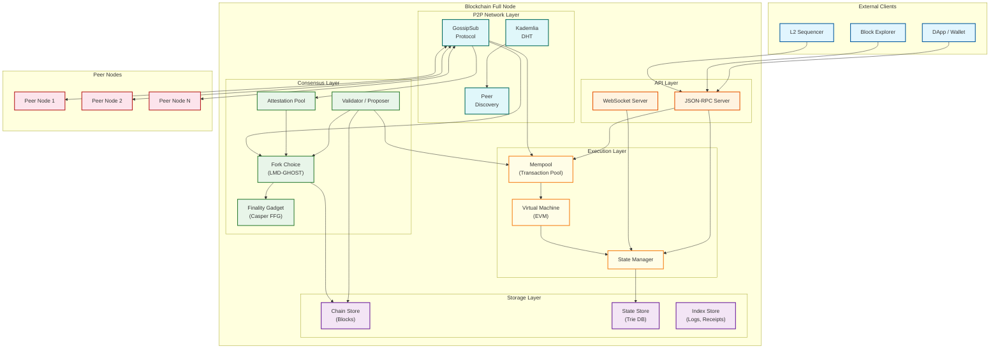
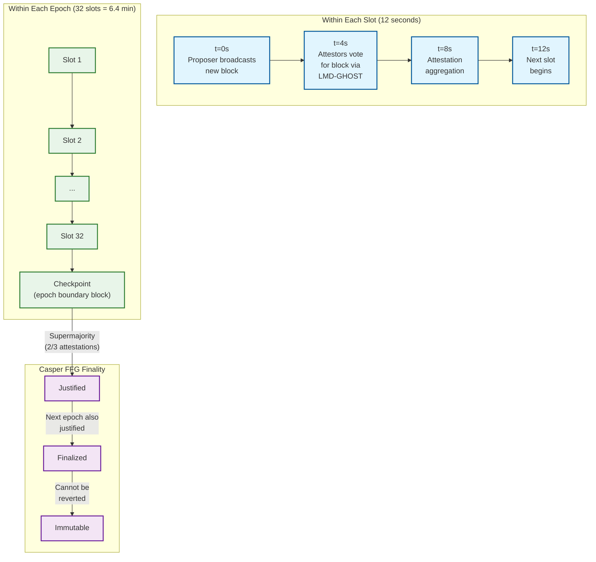
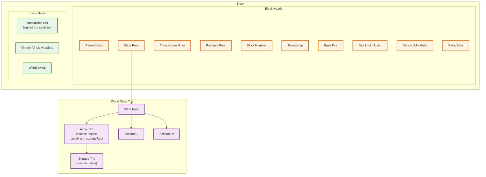
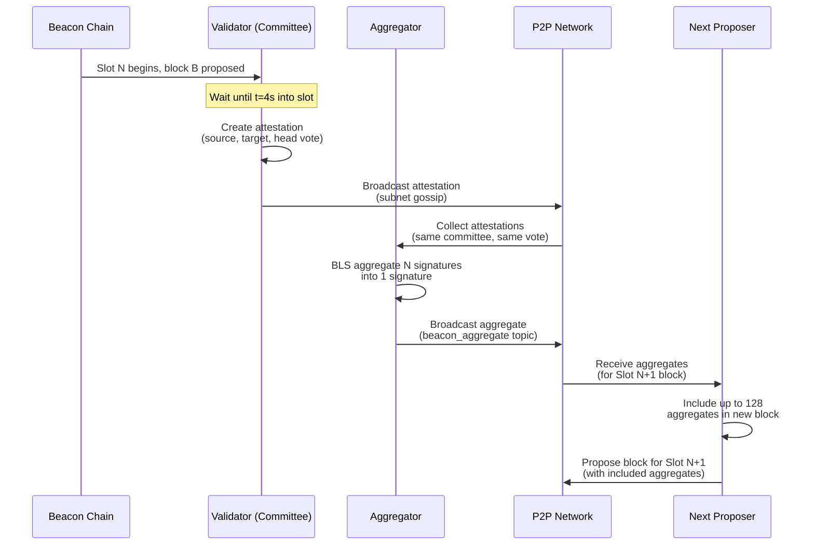
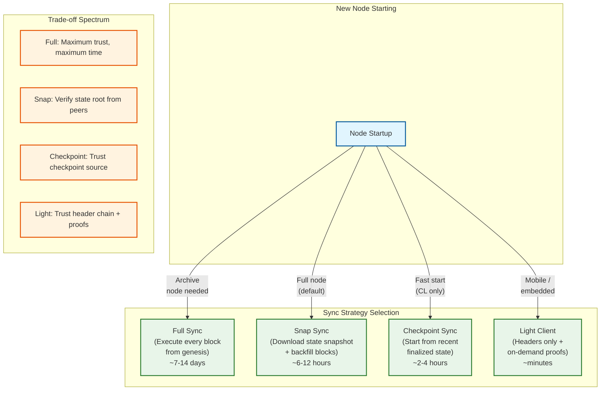

# High-Level Design

## Architecture Overview

A blockchain node is a layered system: a **networking layer** discovers peers and propagates messages, a **consensus layer** agrees on block ordering and finality, an **execution layer** processes transactions and updates state, and a **storage layer** persists blocks, state, and indices. These layers communicate through well-defined internal APIs, and the system exposes a JSON-RPC interface for external clients.

---

## System Architecture Diagram



---

## Transaction Lifecycle

```mermaid
flowchart LR
    subgraph Creation["1. Creation"]
        U["User"] --> |"Sign with\nprivate key"| TX["Raw Transaction"]
    end

    subgraph Propagation["2. Propagation"]
        TX --> |"JSON-RPC\neth_sendRawTransaction"| N1["Entry Node"]
        N1 --> |"GossipSub"| NET["P2P Network"]
    end

    subgraph Admission["3. Mempool"]
        NET --> |"Validate:\nnonce, balance,\nsignature, gas"| MEM["Mempool"]
        MEM --> |"Priority queue\nby effective\ngas price"| SORT["Sorted Pool"]
    end

    subgraph Inclusion["4. Block Building"]
        SORT --> |"Proposer selects\nhigh-fee txns"| BLK["New Block"]
    end

    subgraph Execution["5. Execution"]
        BLK --> |"EVM executes\neach transaction"| STATE["State Update"]
        STATE --> |"Emit receipts\nand logs"| RCPT["Receipts"]
    end

    subgraph Finality["6. Confirmation"]
        RCPT --> |"Block attested\nby validators"| ATT["Attestations"]
        ATT --> |"2 epochs\n(~13 min)"| FIN["Finalized"]
    end

    classDef phase1 fill:#e1f5fe,stroke:#01579b,stroke-width:2px
    classDef phase2 fill:#e0f7fa,stroke:#00695c,stroke-width:2px
    classDef phase3 fill:#fffde7,stroke:#f57f17,stroke-width:2px
    classDef phase4 fill:#e8f5e9,stroke:#2e7d32,stroke-width:2px
    classDef phase5 fill:#fff3e0,stroke:#e65100,stroke-width:2px
    classDef phase6 fill:#f3e5f5,stroke:#6a1b9a,stroke-width:2px

    class U,TX phase1
    class N1,NET phase2
    class MEM,SORT phase3
    class BLK phase4
    class STATE,RCPT phase5
    class ATT,FIN phase6
```



---

## Consensus Flow (Gasper: LMD-GHOST + Casper FFG)



---

## Block Structure



---

## Key Design Decisions

### 1. Separation of Consensus and Execution

| Aspect | Decision | Rationale |
|--------|----------|-----------|
| Architecture | Two-layer design: Consensus Layer (CL) + Execution Layer (EL) | Allows independent upgrades; consensus protocol can evolve without changing execution semantics |
| Communication | Engine API between CL and EL | Clean interface: CL sends `newPayload` to EL, EL validates and returns state root |
| Client diversity | Multiple independent CL and EL implementations | Prevents correlated bugs from halting the network |

### 2. Proof-of-Stake over Proof-of-Work

| Aspect | Decision | Rationale |
|--------|----------|-----------|
| Consensus | Gasper (Casper FFG + LMD-GHOST) | Deterministic finality via Casper FFG; fast fork choice via LMD-GHOST |
| Security | Stake-based with slashing | Economic penalties make attacks financially devastating; 1/3 stake needed to prevent finality |
| Energy | ~99.95% less energy than PoW | Environmental sustainability; removes hardware arms race |
| Participation | 32 ETH minimum stake | Low enough for broad participation; high enough to prevent spam validators |

### 3. EIP-1559 Fee Market

| Aspect | Decision | Rationale |
|--------|----------|-----------|
| Pricing | Algorithmic base fee + user tip | Predictable fees; base fee adjusts +/-12.5% per block toward 50% gas utilization |
| Fee burn | Base fee is burned (destroyed) | Prevents proposer manipulation of base fee; creates deflationary pressure |
| Block elasticity | Target 15M gas, max 30M gas | Absorbs short bursts without permanently increasing load |

### 4. Gossip-Based P2P Networking

| Aspect | Decision | Rationale |
|--------|----------|-----------|
| Protocol | GossipSub (libp2p) | Mesh-based gossip with scoring; resists spam and eclipse attacks |
| Discovery | Kademlia DHT (discv5) | O(log n) peer lookups; 256-bit XOR distance metric for routing |
| Topology | Unstructured mesh with 25-50 peers | Redundant paths for partition resistance; bounded resource usage |

### 5. Merkle Patricia Trie for State

| Aspect | Decision | Rationale |
|--------|----------|-----------|
| Data structure | Modified Merkle Patricia Trie | Combines Merkle tree (integrity proofs) with Patricia trie (efficient key lookup) |
| State root | 32-byte Keccak-256 hash in block header | Enables stateless verification of any state query |
| Future | Verkle trees (2025-2026) | Reduces proof size from ~3 KB to ~200 bytes; enables practical stateless clients |

### 6. Rollup-Centric Scaling

| Aspect | Decision | Rationale |
|--------|----------|-----------|
| Strategy | Scale execution off-chain via rollups; L1 provides data availability | Preserves decentralization of base layer; rollups inherit L1 security |
| Data | EIP-4844 blob transactions | Cheap temporary data storage for rollup proofs; 128 KB blobs pruned after ~18 days |
| Verification | Fraud proofs (optimistic) or validity proofs (ZK) | Optimistic: cheaper but 7-day withdrawal delay; ZK: instant finality but compute-intensive |

---

## Data Flow Summary

| Flow | Path | Latency |
|------|------|---------|
| Transaction submission | User → JSON-RPC → Mempool → Gossip → Network | < 3s to 95% of peers |
| Block proposal | Proposer selects txns → builds block → gossip to network | < 4s to reach attestors |
| Attestation | Validator votes on block → aggregation → gossip | Within 4-8s of slot start |
| Finality | Two consecutive justified checkpoints → finalized | ~13 minutes (2 epochs) |
| State query | Client → JSON-RPC → State Trie lookup → Merkle proof | < 200ms |
| Chain sync (full) | New node → request blocks → verify + execute → catch up | 4-24 hours |
| Chain sync (snap) | New node → download state snapshot → verify → backfill | 2-8 hours |
| L2 data posting | Rollup sequencer → blob transaction → L1 inclusion | 1-3 blocks (~12-36s) |

---

## Data Flow: Validator Attestation and Aggregation



---

## Data Flow: Layer 2 Rollup Interaction

```
L2 Rollup posts transaction batch to L1:

1. Users submit transactions to L2 Sequencer:
   - L2 processes txns locally (fast confirmation, ~2 seconds)
   - Sequencer orders and executes transactions
   - State root updated after each L2 block

2. Sequencer batches transactions:
   - Compress 1,000-10,000 L2 transactions
   - Optimistic: full transaction data (~100 bytes/tx compressed)
   - ZK: state diffs only (~50 bytes/tx) + validity proof

3. Submit to L1 as blob transaction (EIP-4844):
   - Create blob-carrying transaction
   - Blob data: compressed L2 transaction batch
   - Calldata: batch metadata + proof (if ZK)
   - Pay blob fee (separate from execution gas)

4. L1 inclusion:
   - L1 proposer includes blob transaction in block
   - Blob data stored in separate fee market
   - KZG commitment verifies blob integrity
   - Blob pruned after ~18 days (not permanent)

5. Verification:
   - Optimistic: 7-day challenge window; any node can submit fraud proof
   - ZK: L1 contract verifies validity proof (~400K gas per batch)
   - On successful verification: L2 state root committed to L1

6. L1 finality:
   - Once L1 block is finalized (~13 min), L2 state is finalized
   - Cross-chain bridges can safely release funds
```

---

## Account Abstraction Architecture (ERC-4337)

```
Traditional account model:
  EOA → signs tx with private key → directly executes on chain

Account Abstraction model:
  Smart Account → UserOperation → Bundler → EntryPoint contract → execution

┌──────────────────────────────────────────────────────────────────────┐
│                    Account Abstraction Flow                          │
│                                                                      │
│  ┌──────────┐  ┌──────────┐  ┌──────────┐  ┌──────────┐           │
│  │  User     │→ │ Bundler  │→ │EntryPoint│→ │  Smart   │           │
│  │ Wallet   │  │(collects │  │ Contract │  │ Account  │           │
│  │(creates  │  │ UserOps, │  │(validates│  │(custom   │           │
│  │ UserOp)  │  │ submits  │  │ + calls) │  │ verify + │           │
│  │          │  │ as batch) │  │          │  │ execute) │           │
│  └──────────┘  └──────────┘  └──────────┘  └──────────┘           │
│                                                                      │
│  Enables:                                                           │
│  ├── Social recovery (guardians can reset signing key)              │
│  ├── Gas sponsorship (paymaster pays gas for user)                 │
│  ├── Batched transactions (multiple operations in one tx)          │
│  ├── Session keys (temporary permissions for DApps)                │
│  └── Non-ECDSA signing (passkeys, multisig, MPC)                 │
└──────────────────────────────────────────────────────────────────────┘
```

---

## MEV Supply Chain Architecture

```
Maximal Extractable Value (MEV) supply chain:

┌──────────┐   ┌──────────┐   ┌──────────┐   ┌──────────┐
│ Searchers │ → │ Builders  │ → │  Relays   │ → │Proposers │
│           │   │           │   │           │   │(Validatrs)│
│ Find MEV  │   │ Construct │   │ Validate  │   │ Select   │
│ opportunty│   │ optimal   │   │ + auction │   │ highest  │
│ + submit  │   │ block     │   │ blocks    │   │ bid block│
│ bundles   │   │           │   │           │   │          │
└──────────┘   └──────────┘   └──────────┘   └──────────┘

Flow:
1. Searchers monitor mempool for MEV opportunities
   (arbitrage, liquidations, sandwich attacks)
2. Searchers submit "bundles" (ordered tx sets) to builders
3. Builders combine bundles + user txns into optimal blocks
4. Builders bid for block inclusion (pay proposer for slot)
5. Relay validates block + hides contents from proposer
   (prevents proposer from stealing MEV)
6. Proposer signs block header, committing to builder's block
7. Relay reveals full block to network

Why PBS matters:
├── Without PBS: validators who extract MEV have advantage → centralization
├── With PBS: all validators earn MEV revenue via bids → decentralization preserved
├── Concern: builder and relay centralization (few entities dominate)
└── Solution: enshrined PBS (protocol-level), encrypted mempools
```

---

## Data Flow: EIP-1559 Fee Market Dynamics

```
Fee market feedback loop (per-block adjustment):

1. Block N produced:
   gas_used = 28,500,000    (95% of 30M limit)
   gas_target = 15,000,000  (50% of 30M limit)

2. Compute next base fee:
   excess = gas_used - gas_target = 13,500,000
   adjustment = base_fee × excess / gas_target / 8
             = 25 gwei × 13,500,000 / 15,000,000 / 8
             = 2.81 gwei increase
   new_base_fee = 25 + 2.81 = 27.81 gwei

3. User submits transaction for Block N+1:
   max_fee_per_gas = 40 gwei       (willing to pay up to this)
   max_priority_fee = 2 gwei       (tip to proposer)
   effective_gas_price = min(max_fee, base_fee + priority_fee)
                       = min(40, 27.81 + 2) = 29.81 gwei

4. Fee distribution:
   base_fee portion: 27.81 gwei × gas_used → BURNED (destroyed)
   priority portion: 2.00 gwei × gas_used  → proposer revenue

5. Self-correction:
   If blocks consistently full → base fee rises → demand drops
   If blocks consistently empty → base fee falls → demand recovers
   Equilibrium: 50% gas utilization at market-clearing price

Fee behavior during surge:
  Block 1: base=25, usage=95%  → base rises to 27.8
  Block 2: base=27.8, usage=90% → base rises to 30.1
  Block 3: base=30.1, usage=70% → base rises to 31.6
  Block 4: base=31.6, usage=45% → base FALLS to 31.0
  ... converges to equilibrium within ~10 blocks
```

---

## Data Flow: Chain Synchronization Strategies


