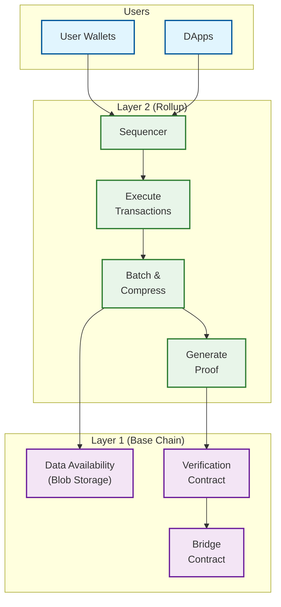
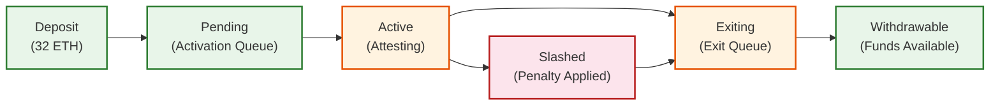

# Scalability & Reliability

## Layer 2 Rollup Scaling

### Architecture: Execution Off-Chain, Data On-Chain

The fundamental scaling strategy separates **execution** (processing transactions) from **data availability** (ensuring transaction data is accessible for verification). The base layer (L1) provides data availability and final settlement; rollups provide high-throughput execution.



### Optimistic Rollups vs. ZK Rollups

| Aspect | Optimistic Rollup | ZK Rollup |
|--------|-------------------|-----------|
| **Proof mechanism** | Fraud proof (challenge invalid state transitions) | Validity proof (cryptographic proof of correct execution) |
| **Withdrawal delay** | 7 days (challenge window) | Hours (proof generation + L1 verification) |
| **Throughput** | 2,000-4,000 TPS | 2,000-15,000 TPS |
| **Cost per transaction** | $0.01-0.10 | $0.05-0.20 (decreasing rapidly) |
| **EVM compatibility** | High (90-100%) | Moderate-High (70-95%, improving) |
| **Proof computation** | Minimal (only on dispute) | Heavy (must generate ZK proof for every batch) |
| **Data requirement** | Full transaction data on L1 | State diffs sufficient (smaller footprint) |
| **Security model** | At least one honest verifier can challenge | Cryptographic guarantee; no honest assumptions |
| **Maturity** | Production (since 2021) | Production (since 2022-2023) |

### Data Availability with EIP-4844 (Blob Transactions)

```
Problem: Rollups posting data as calldata is expensive (~16 gas/byte).

Solution: EIP-4844 introduces "blob-carrying transactions":
  - Blobs are ~128 KB data chunks attached to transactions
  - Stored in a separate fee market (blob base fee)
  - Pruned after ~18 days (not permanently stored)
  - Priced ~10-100x cheaper than calldata

Blob mechanics:
  - Max 6 blobs per block (target: 3)
  - Each blob: 4096 field elements × 32 bytes = ~128 KB
  - Verified via KZG polynomial commitments
  - Blob fee adjusts independently from execution gas fee

Future: Full Danksharding will increase to 64+ blobs per block,
        providing ~16 MB/block of data availability.
```

---

## State Management Scaling

### State Cutting off unnecessary steps Architecture

```
FUNCTION pruneState(currentBlock, retentionDepth):
    // Keep state trie nodes reachable from recent blocks only
    cutoffBlock = currentBlock - retentionDepth

    // Mark phase: walk trie from each retained block's state root
    reachableNodes = Set()
    FOR block IN range(cutoffBlock, currentBlock):
        walkTrie(block.stateRoot, reachableNodes)

    // Sweep phase: delete unreachable nodes from trie database
    FOR node IN trieDatabase.allNodes():
        IF node NOT IN reachableNodes:
            trieDatabase.delete(node)

    // Result: ~200 GB pruned vs ~15 TB archive

Trade-offs:
  - Cannot answer historical state queries (need archive node)
  - Cutting off unnecessary steps is I/O intensive; run during low-activity periods
  - Must retain at least finalized state for safety
```

### Snap Sync Protocol

```
Fast chain synchronization for new nodes:

Phase 1 - State Download:
  1. Request state trie leaf nodes in account hash order
  2. Download in parallel from multiple peers (divide address space)
  3. Verify each chunk against known state root
  4. ~2-4 hours for full state (~200 GB)

Phase 2 - Block Backfill:
  1. Download block headers and bodies from genesis
  2. Verify header chain (parent hashes, PoS signatures)
  3. Do NOT re-execute transactions (trust the state root)
  4. ~4-8 hours for full chain history

Phase 3 - Healing:
  1. State may have changed during download (new blocks produced)
  2. Request updated trie nodes for modified accounts
  3. Converge to latest state root
  4. ~30 minutes for healing

Total: ~6-12 hours vs weeks for full sync (execute every block from genesis)
```

### Verkle Tree Transition (2025-2026)

```
Current: Merkle Patricia Trie
  - Proof size: ~3 KB per account access
  - Block witness (6000 accesses): ~18 MB (too large for gossip)
  - Prevents practical stateless clients

Future: Verkle Trees
  - Proof size: ~200 bytes per account access
  - Block witness (6000 accesses): ~1.2 MB (feasible for gossip)
  - Enables stateless validation

Transition plan:
  1. Overlay approach: new state writes go to Verkle tree
  2. Old state remains in Merkle trie, migrated lazily
  3. Block witnesses include proofs from both structures
  4. Eventually all state migrates to Verkle tree
```

---

## Validator Set Scaling

### Managing 1M+ Validators

```
Challenge: Every validator must attest every epoch.
  1M validators × 1 attestation/epoch = 1M attestations per 6.4 min

Solution: Committee-based attestation
  - Divide validators into 32 committees per epoch (one per slot)
  - Each committee has ~31,250 validators
  - Divide each slot committee into ~64 subnets
  - Each subnet has ~488 validators
  - Aggregate attestations within subnets before gossip

Aggregation:
  - BLS signatures support aggregation: N signatures → 1 signature
  - Subnet aggregators combine all agreeing attestations
  - Final block includes ~128 aggregate attestations (not 1M individual ones)
  - Verification: 1 pairing check per aggregate (~5ms each)
```

### Validator Lifecycle State Machine



```
Activation queue:
  - Max 8 validators activated per epoch (to prevent sudden stake changes)
  - Current wait: hours to days depending on queue depth

Exit queue:
  - Max 8 validators exit per epoch (same rate limiting)
  - Prevents mass exit that could compromise security

Inactivity leak:
  - If finality stalls for > 4 epochs, inactive validators
    lose stake at an accelerating rate
  - Forces participation or exit
  - Ensures chain eventually recovers finality
```

---

## Network Reliability

### Gossip Protocol Resilience (GossipSub)

```
GossipSub maintains a mesh topology with scoring:

Mesh parameters:
  - D (mesh degree): 8 peers per topic
  - D_low: 6 (minimum before requesting more)
  - D_high: 12 (maximum before Cutting off unnecessary steps)
  - D_lazy: 6 (peers for metadata-only gossip)

Peer scoring dimensions:
  1. Topic score: Quality of messages delivered in each topic
  2. IP colocation: Penalty for many peers from same IP
  3. Behavior: Penalty for invalid messages, spam, or protocol violations

Score-based actions:
  - Score < 0: Remove from mesh
  - Score < graylist threshold: Reject all messages
  - Score < blacklist threshold: Disconnect entirely

This prevents:
  - Sybil attacks (colocation penalty)
  - Spam flooding (behavior penalty)
  - Eclipse attacks (diverse mesh membership)
```

### Fault Tolerance Guarantees

| Failure Mode | Threshold | Behavior |
|-------------|-----------|----------|
| Node crashes (< 1/3 stake) | Normal | Chain continues; crashed node catches up via sync |
| Network partition (< 1/3 offline) | Normal | Finality continues; offline validators leak stake |
| Network partition (1/3 - 2/3 offline) | Degraded | Chain produces blocks but finality stalls; inactivity leak activates |
| Network partition (> 2/3 offline) | Critical | Chain halts block production; requires manual intervention |
| Byzantine validators (< 1/3 stake) | Tolerated | Slashing detects and penalizes; finality unaffected |
| Byzantine validators (>= 1/3 stake) | Finality failure | Cannot finalize new blocks; requires social consensus to resolve |

### Disaster Recovery

```
Scenario 1: Consensus failure (no finality for > 4 epochs)
  Response:
    1. Inactivity leak automatically activates
    2. Non-participating validators lose stake
    3. Eventually, participating validators reach 2/3 supermajority
    4. Finality resumes automatically
    5. No human intervention needed (self-healing)

Scenario 2: Critical client bug (invalid state transition)
  Response:
    1. Affected client produces blocks that other clients reject
    2. Network splits along client implementation lines
    3. Client diversity ensures majority chain continues correctly
    4. Buggy client releases hotfix
    5. Affected validators may face slashing if they attested to invalid chain
    Why client diversity matters: If >66% run the same client and it has
    a bug, the majority chain is the wrong chain.

Scenario 3: Deep chain reorganization (>32 blocks)
  Response:
    1. Should never happen if finality is working (finalized blocks are irreversible)
    2. If pre-finality reorg occurs: LMD-GHOST resolves automatically
    3. Exchanges and bridges should wait for finalization before crediting deposits
```

---

## Horizontal Scaling Strategies

### Sharding (Future Roadmap)

```
Concept: Divide the network into parallel shard chains,
each processing transactions independently.

Current status: Ethereum pivoted from execution sharding
to "rollup-centric" scaling. Sharding is now focused on
data availability (Danksharding) rather than execution.

Danksharding:
  - Extend blob capacity from 6 to 64+ blobs per block
  - Provide ~16 MB of data availability per block
  - Use Data Availability Sampling (DAS): nodes verify
    random samples instead of downloading full blobs
  - Enables rollups to post more data, increasing L2 throughput

DAS mechanism:
  1. Block builder creates blobs and extends them with
     erasure coding (2x redundancy)
  2. Validators randomly sample cells from the extended data
  3. If all sampled cells are available, conclude full data is available
  4. Requires only O(sqrt(n)) downloads for O(n) data verification
```

### Multi-Chain Architecture

```
Cross-chain communication patterns:

1. Bridge contracts:
   - Lock assets on source chain, mint on destination chain
   - Relies on bridge validators or light client verification
   - Risk: Bridge exploits are the largest source of losses ($2B+ in 2022)

2. Relay chains (hub-and-spoke):
   - Central relay validates state of connected chains
   - Provides shared security and cross-chain message passing
   - Example: Inter-Blockchain Communication (IBC) protocol

3. Shared sequencers:
   - Multiple rollups share a single sequencer
   - Enables atomic cross-rollup transactions
   - Reduces fragmentation of liquidity

4. Light client bridges:
   - On-chain light client verifies source chain's consensus
   - Most trust-minimized approach
   - High gas cost for on-chain verification
```

---

## Scaling Roadmap Summary

| Phase | Strategy | Throughput Impact | Timeline |
|-------|----------|-------------------|----------|
| Current | L2 rollups (optimistic + ZK) | L1: ~100 TPS, L2: ~15K TPS each | Live |
| Current | EIP-4844 blobs | 10x cheaper L2 data costs | Live |
| Near-term | Verkle trees + statelessness | Lower node requirements, more validators | 2025-2026 |
| Near-term | Single-slot finality | Finality: 13min → 12s | Research |
| Medium-term | Full Danksharding + DAS | 64+ blobs/block, ~16 MB DA | 2026-2027 |
| Long-term | ZK-EVM proving in-protocol | Trustless L2 verification | 2027+ |

---

## Cross-Rollup Communication

### Shared Sequencing Architecture

```
Problem: Multiple rollups create liquidity fragmentation.
Users on Rollup A cannot atomically interact with contracts on Rollup B.

Shared Sequencer model:
┌─────────────────────────────────────────────────────────┐
│                  Shared Sequencer                        │
│  Receives transactions for ALL participating rollups    │
│  Orders transactions with cross-rollup awareness        │
│  Enables atomic bundles spanning multiple rollups       │
└───────────┬──────────────────┬──────────────────┬───────┘
            │                  │                  │
    ┌───────▼──────┐  ┌───────▼──────┐  ┌───────▼──────┐
    │  Rollup A    │  │  Rollup B    │  │  Rollup C    │
    │  (executes   │  │  (executes   │  │  (executes   │
    │   its own    │  │   its own    │  │   its own    │
    │   state)     │  │   state)     │  │   state)     │
    └──────────────┘  └──────────────┘  └──────────────┘

Benefits:
├── Atomic cross-rollup transactions (swap token A↔B atomically)
├── Reduced MEV extraction (searchers compete across rollups)
├── Shared liquidity pool for bridges
└── Unified user experience

Risks:
├── Sequencer centralization (single entity orders for all rollups)
├── Liveness dependency (sequencer failure affects all rollups)
├── Complexity of cross-rollup state proofs
└── Governance: who controls the shared sequencer?
```

---

## Single-Slot Finality (Research)

```
Current finality: ~13 minutes (2 full epochs of 32 slots each)
Target: 12 seconds (finalize within the slot the block is proposed)

Why it matters:
├── Bridges can release funds after 12s instead of 13 min
├── L2 rollups get faster settlement guarantees
├── User experience dramatically improves (1 confirmation = final)
└── Reduces MEV extraction window

Challenge: 1M+ validators must all attest within 12 seconds
Current approach requires only ~31,250 attestations per slot (committee)
SSF requires ALL validators to participate every slot

Proposed solutions:

1. Two-round BFT (Tendermint-style):
   Slot timeline (12 seconds):
     t=0s:   Proposer broadcasts block
     t=4s:   All validators send "prepare" vote
     t=8s:   All validators send "commit" vote
     t=12s:  Block is finalized if 2/3 commit

   Problem: 1M validators × O(n²) messages = infeasible

2. Committee-based SSF:
   - Randomly select ~128K validators per slot (subset of total)
   - Committee validates and finalizes within 12s
   - Remaining validators verify committee's work asynchronously
   - Trade-off: weaker security per slot (fewer validators)

3. Orbit SSF (current research):
   - Validators grouped into rotating committees
   - Each committee responsible for subset of slots
   - BLS aggregation compresses 128K signatures → 1
   - Net: finality in 1 slot with acceptable security

Impact on architecture:
├── Fork choice simplifies (no multi-epoch speculation)
├── Inactivity leak mechanism needs redesign
├── Validator client must have lower latency attestation
└── Significantly more aggregation computation per slot
```

---

## Stateless Validation (Future)

```
Current model: Every validator stores the full state (~200 GB)
Future model: Validators verify blocks using only block data + witnesses

Verkle-based stateless validation:

1. Block proposer executes transactions against full state
2. Proposer generates witness:
   - All state values accessed during execution
   - Verkle proofs for each access (~200 bytes each)
   - Total witness: ~1-2 MB per block

3. Stateless validator receives block + witness:
   - Verify witness proofs against state root (fast, no disk)
   - Execute transactions using witnessed state
   - Compute new state root
   - Compare with proposer's claimed state root
   - No local state storage needed!

Impact:
├── Validator hardware requirements drop dramatically
│   (no SSD needed; can run on mobile/embedded devices)
├── More validators → more decentralization
├── Faster sync (no state download needed)
├── State growth becomes block proposer's problem, not everyone's
└── Trade-off: block size increases by ~1-2 MB (witness data)
```
