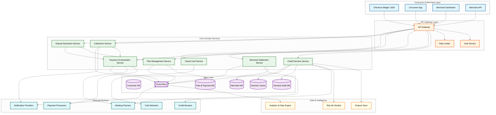
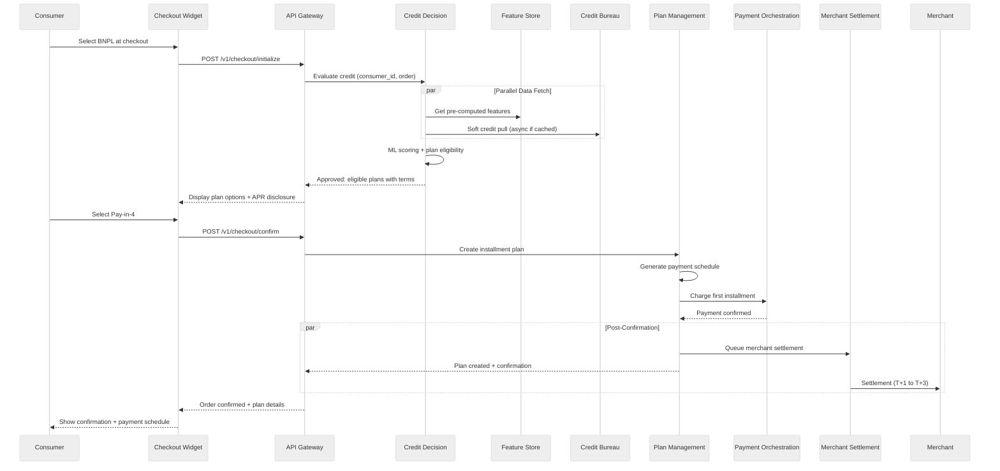
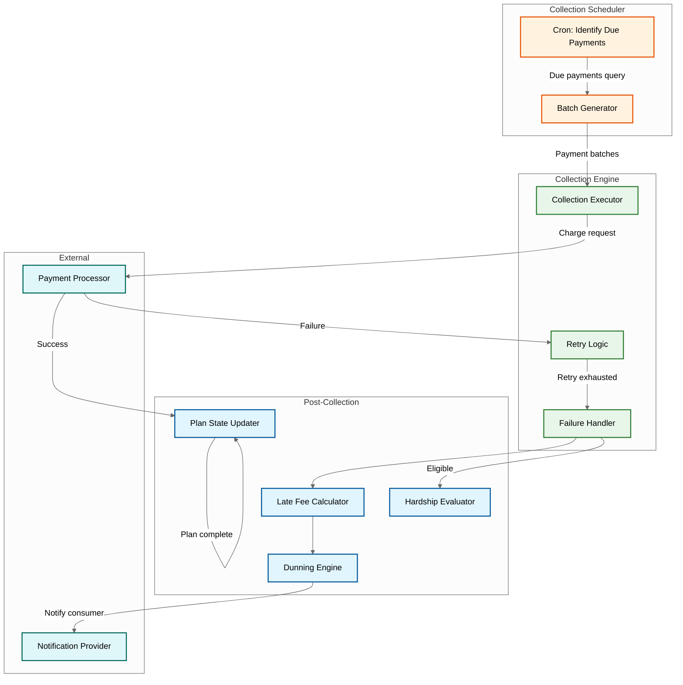
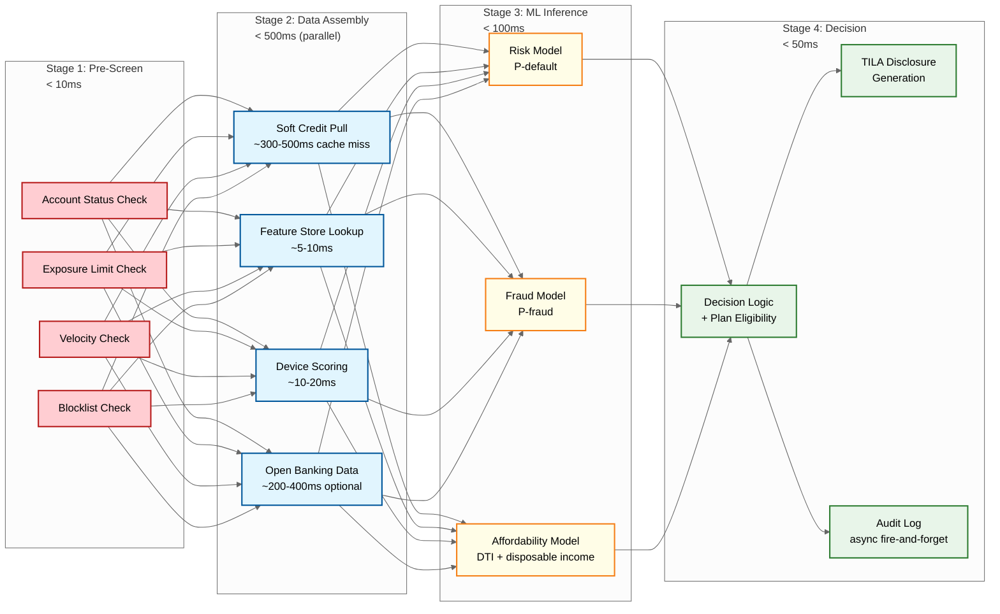
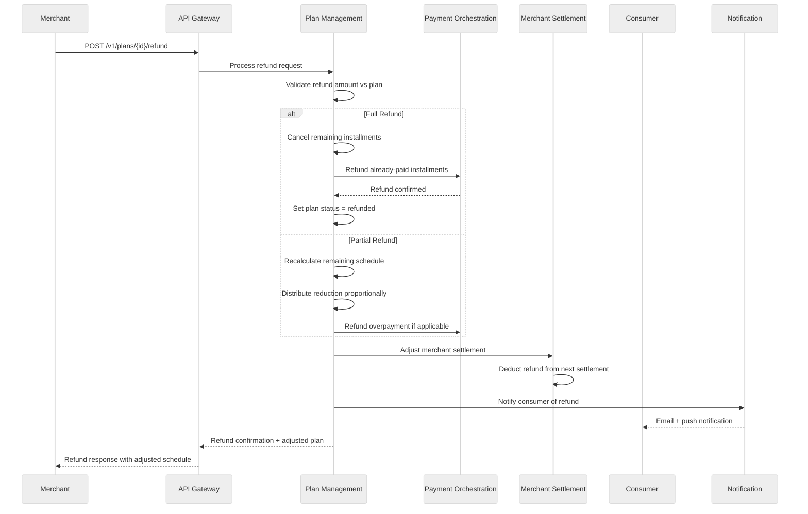
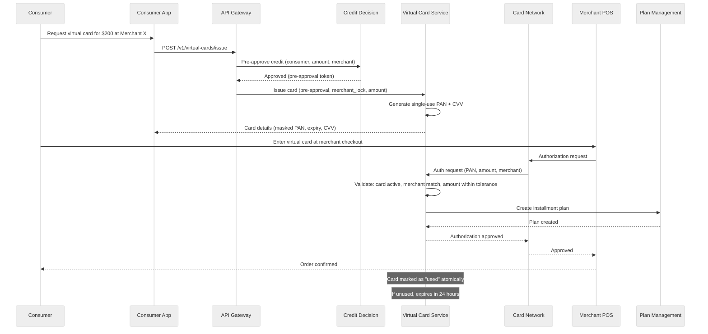
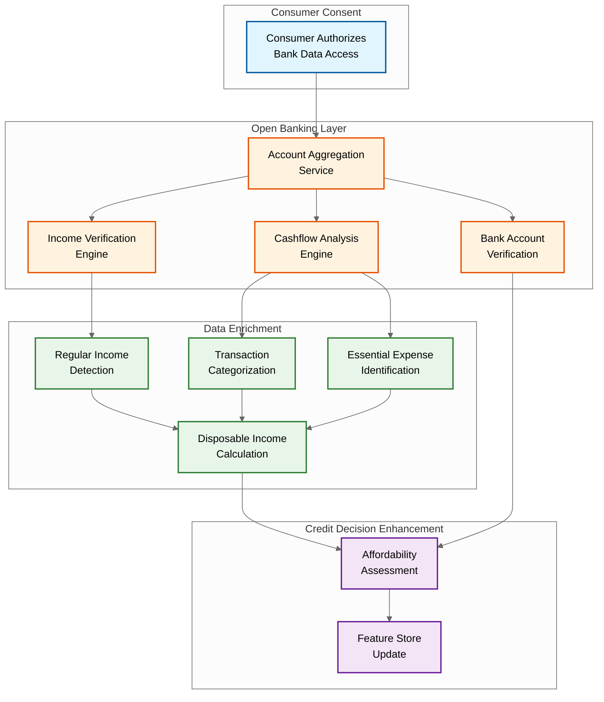
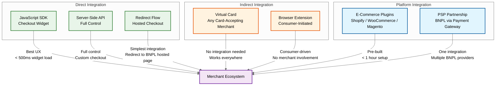

# High-Level Design

## Architecture Overview

The BNPL platform is decomposed into five logical layers: **Consumer & Merchant Interface** (checkout widgets, dashboards, mobile apps), **API Gateway & Orchestration** (authentication, rate limiting, request routing), **Core Domain Services** (credit decisioning, plan management, payment orchestration, merchant settlement, collections), **Data & Intelligence** (ML feature store, risk models, analytics), and **External Integrations** (credit bureaus, payment processors, card networks, banking partners). The architecture is event-driven: every state transition in the plan lifecycle emits an event consumed by downstream services (notifications, analytics, compliance audit).

---

## System Architecture Diagram

---

## Checkout Flow (Happy Path)

---

## Payment Collection Flow

---

## Key Design Decisions

### 1. Synchronous Credit Decision vs. Asynchronous Pre-Approval

| Option | Pros | Cons |
|--------|------|------|
| **Synchronous at checkout** (chosen) | Fresh data, accurate risk assessment, regulatory compliance (point-of-sale disclosure) | Adds latency to checkout; requires low-latency ML pipeline |
| Asynchronous pre-approval | Zero checkout latency; pre-computed limits | Stale risk data; consumer circumstances change; regulatory concerns about pre-approved credit |

**Decision**: Synchronous credit decision at checkout with a pre-computed feature store to minimize latency. Pre-qualification is offered as a separate, non-binding flow.

### 2. Plan Storage: Relational vs. Document Store

| Option | Pros | Cons |
|--------|------|------|
| **Relational DB** (chosen) | ACID transactions for plan state changes; complex queries for collections; referential integrity | Schema rigidity; migration cost for new plan types |
| Document store | Flexible schema for varied plan types | Weaker consistency guarantees; complex aggregation queries |

**Decision**: Relational database for plans and payments. The installment lifecycle requires strong consistency (a payment must be atomically marked as collected and the plan balance updated). Plan type variations are handled via a discriminator column and type-specific JSON metadata.

### 3. Merchant Settlement: Real-Time vs. Batch

| Option | Pros | Cons |
|--------|------|------|
| Real-time settlement | Merchants receive funds immediately | Higher operational risk; harder to reconcile; expensive bank transfer fees |
| **Batch settlement (T+1 to T+3)** (chosen) | Lower transfer costs; reconciliation window; net settlement reduces transfers | Merchants wait 1--3 days for funds |

**Decision**: Batch settlement with configurable cadence (T+1 for premium merchants, T+3 for standard). Net settlement aggregates all transactions and refunds per merchant per settlement window, reducing the number of bank transfers.

### 4. Virtual Card Strategy: Pre-Generated Pool vs. On-Demand

| Option | Pros | Cons |
|--------|------|------|
| Pre-generated pool | Instant issuance; no latency at checkout | Unused cards waste number space; management overhead |
| **On-demand generation** (chosen) | No waste; card created only when needed | Adds ~500ms to checkout for virtual card path |

**Decision**: On-demand virtual card generation with a small warm pool for latency-sensitive flows. Cards are single-use, locked to the merchant and amount, and expire within 24 hours if unused.

### 5. Collections Architecture: Centralized vs. Per-Plan State Machine

| Option | Pros | Cons |
|--------|------|------|
| Centralized collections engine | Single orchestrator; easier to audit | Single point of failure; complex state management at scale |
| **Per-plan state machine** (chosen) | Each plan independently tracks its collection state; resilient to partial failures | State explosion across 50M plans; requires efficient state queries |

**Decision**: Each installment plan has an embedded state machine tracking its lifecycle (active → payment_due → collecting → paid / overdue → delinquent → hardship / charge_off → completed). A batch scheduler identifies plans needing action, but each plan's state transitions are self-contained and idempotent.

---

## Data Flow Summary

| Flow | Source | Destination | Pattern | Volume |
|------|--------|-------------|---------|--------|
| Credit decision | Checkout widget | Credit Decision Service → Feature Store → Credit Bureau | Sync request-response | 525 peak TPS |
| Plan creation | Credit Decision Service | Plan Management Service → Plan DB | Sync (within checkout) | ~23 TPS avg |
| First installment | Plan Management Service | Payment Orchestration → Payment Processor | Sync (blocks checkout) | ~23 TPS avg |
| Scheduled collection | Collection Scheduler | Payment Orchestration → Payment Processor | Batch (3 windows/day) | 2M per window |
| Merchant settlement | Settlement Scheduler | Merchant Settlement Service → Banking Partner | Batch (daily) | 500K merchants/day |
| Dunning notification | Collections Service | Notification Provider | Async event-driven | ~400K/day |
| Virtual card auth | Card Network | Virtual Card Service → Plan Management | Sync callback | ~200K/day |
| Dispute | Consumer / Merchant | Dispute Resolution Service | Async workflow | ~15K/day |
| Feature refresh | Analytics Engine | Feature Store | Batch (hourly/daily) | 50M consumer vectors |

---

## Credit Decision Pipeline Architecture

---

## Refund and Returns Flow

---

## Virtual Card Issuance and Authorization Flow

---

## Open Banking Integration Architecture

Modern BNPL platforms increasingly leverage open banking APIs to enhance credit decisions with real-time financial data, reducing reliance on credit bureau scores alone.

**Open banking benefits for BNPL:**

| Capability | Traditional Approach | Open Banking Enhancement |
|-----------|---------------------|-------------------------|
| Income verification | Self-reported; credit bureau data | Real-time bank statement analysis; direct salary deposit detection |
| Affordability check | Debt-to-income from credit report | Actual cashflow analysis: income minus essential expenses |
| Account verification | Micro-deposit verification (2--3 days) | Instant bank account ownership confirmation |
| Fraud detection | Device fingerprint + identity checks | Account age, transaction patterns, salary consistency |
| Ongoing monitoring | Periodic credit bureau refresh | Continuous consent-based financial health monitoring |

---

## Key Design Decisions

### 1. Synchronous Credit Decision vs. Asynchronous Pre-Approval

| Option | Pros | Cons |
|--------|------|------|
| **Synchronous at checkout** (chosen) | Fresh data, accurate risk assessment, regulatory compliance (point-of-sale disclosure) | Adds latency to checkout; requires low-latency ML pipeline |
| Asynchronous pre-approval | Zero checkout latency; pre-computed limits | Stale risk data; consumer circumstances change; regulatory concerns about pre-approved credit |

**Decision**: Synchronous credit decision at checkout with a pre-computed feature store to minimize latency. Pre-qualification is offered as a separate, non-binding flow.

### 2. Plan Storage: Relational vs. Document Store

| Option | Pros | Cons |
|--------|------|------|
| **Relational DB** (chosen) | ACID transactions for plan state changes; complex queries for collections; referential integrity | Schema rigidity; migration cost for new plan types |
| Document store | Flexible schema for varied plan types | Weaker consistency guarantees; complex aggregation queries |

**Decision**: Relational database for plans and payments. The installment lifecycle requires strong consistency (a payment must be atomically marked as collected and the plan balance updated). Plan type variations are handled via a discriminator column and type-specific JSON metadata.

### 3. Merchant Settlement: Real-Time vs. Batch

| Option | Pros | Cons |
|--------|------|------|
| Real-time settlement | Merchants receive funds immediately | Higher operational risk; harder to reconcile; expensive bank transfer fees |
| **Batch settlement (T+1 to T+3)** (chosen) | Lower transfer costs; reconciliation window; net settlement reduces transfers | Merchants wait 1--3 days for funds |

**Decision**: Batch settlement with configurable cadence (T+1 for premium merchants, T+3 for standard). Net settlement aggregates all transactions and refunds per merchant per settlement window, reducing the number of bank transfers.

### 4. Virtual Card Strategy: Pre-Generated Pool vs. On-Demand

| Option | Pros | Cons |
|--------|------|------|
| Pre-generated pool | Instant issuance; no latency at checkout | Unused cards waste number space; management overhead |
| **On-demand generation** (chosen) | No waste; card created only when needed | Adds ~500ms to checkout for virtual card path |

**Decision**: On-demand virtual card generation with a small warm pool for latency-sensitive flows. Cards are single-use, locked to the merchant and amount, and expire within 24 hours if unused.

### 5. Collections Architecture: Centralized vs. Per-Plan State Machine

| Option | Pros | Cons |
|--------|------|------|
| Centralized collections engine | Single orchestrator; easier to audit | Single point of failure; complex state management at scale |
| **Per-plan state machine** (chosen) | Each plan independently tracks its collection state; resilient to partial failures | State explosion across 50M plans; requires efficient state queries |

**Decision**: Each installment plan has an embedded state machine tracking its lifecycle (active → payment_due → collecting → paid / overdue → delinquent → hardship / charge_off → completed). A batch scheduler identifies plans needing action, but each plan's state transitions are self-contained and idempotent.

### 6. Pay-by-Bank vs. Card-Based Collection

| Option | Pros | Cons |
|--------|------|------|
| Card-based (debit/credit) | Familiar UX; instant verification; wide adoption | 1--3% processor fees; card expiry churn; interchange costs reduce margin |
| **Pay-by-bank (A2A)** (chosen for primary) | Lower cost (~0.5% vs 2.5%); no card expiry; direct bank debit | Slower verification (micro-deposits or open banking); consumer unfamiliarity; variable recurring payment support varies |
| Hybrid (chosen) | Supports both; default to bank for repeat users, card for new users | Integration complexity; dual processor management |

**Decision**: Hybrid approach with bank-direct (ACH/SEPA/A2A) as the preferred collection method for recurring installments (lower cost), and card-based for first installment at checkout (instant confirmation). Open banking enables instant bank verification, eliminating the micro-deposit delay for account-to-account setup.

### 7. Event Bus: At-Least-Once vs. Exactly-Once Delivery

| Option | Pros | Cons |
|--------|------|------|
| **At-least-once with idempotent consumers** (chosen) | Simple, reliable; no coordinator overhead | Consumers must be idempotent; possible duplicate processing |
| Exactly-once (transactional outbox) | No duplicate handling needed | Higher complexity; coordinator dependency; lower throughput |

**Decision**: At-least-once delivery with idempotent event consumers. Every service that processes events uses the event ID as a deduplication key. This approach is simpler, more resilient to failures, and aligns with the financial system's requirement for idempotent operations (every payment, plan update, and settlement already requires idempotency keys).

---

## Merchant Integration Patterns

| Integration Type | Merchant Effort | Consumer UX | Data Richness | Settlement |
|-----------------|----------------|-------------|---------------|------------|
| **JS SDK Widget** | Medium (embed widget) | Best (in-line checkout) | Full order context | Direct T+1 |
| **Server-Side API** | High (custom UI + backend) | Customizable | Full order context | Direct T+1 |
| **Redirect Flow** | Low (redirect URL) | Good (hosted page) | Basic order info | Direct T+1 |
| **Virtual Card** | None | Acceptable (enter card details) | Merchant name + amount only | Via card network T+2 |
| **Browser Extension** | None | Variable (consumer-initiated) | Limited | Via card network T+3 |
| **E-Commerce Plugin** | Very Low (install plugin) | Good (pre-built widget) | Full order context | Direct T+1 |
| **PSP Partnership** | None (PSP provides) | Good (via PSP checkout) | Via PSP passthrough | Via PSP T+2 |

---

## Data Flow Summary

| Flow | Source | Destination | Pattern | Volume |
|------|--------|-------------|---------|--------|
| Credit decision | Checkout widget | Credit Decision Service → Feature Store → Credit Bureau | Sync request-response | 525 peak TPS |
| Plan creation | Credit Decision Service | Plan Management Service → Plan DB | Sync (within checkout) | ~23 TPS avg |
| First installment | Plan Management Service | Payment Orchestration → Payment Processor | Sync (blocks checkout) | ~23 TPS avg |
| Scheduled collection | Collection Scheduler | Payment Orchestration → Payment Processor | Batch (3 windows/day) | 2M per window |
| Merchant settlement | Settlement Scheduler | Merchant Settlement Service → Banking Partner | Batch (daily) | 500K merchants/day |
| Dunning notification | Collections Service | Notification Provider | Async event-driven | ~400K/day |
| Virtual card auth | Card Network | Virtual Card Service → Plan Management | Sync callback | ~200K/day |
| Dispute | Consumer / Merchant | Dispute Resolution Service | Async workflow | ~15K/day |
| Feature refresh | Analytics Engine | Feature Store | Batch (hourly/daily) | 50M consumer vectors |
| Open banking sync | Consumer bank | Account Aggregation → Feature Store | Event-driven (consent-based) | ~2M/day |
| Refund processing | Merchant / Consumer | Plan Management → Payment Orchestration | Sync request-response | ~50K/day |
| Compliance audit | All services | Audit Event Bus → Immutable Log | Async append-only | ~15M events/day |

---

## Component Responsibilities

| Component | Responsibilities | Key Dependencies |
|-----------|-----------------|------------------|
| **Credit Decision Service** | Evaluate creditworthiness, determine plan eligibility, generate TILA disclosures, log decisions for audit | Feature Store, Risk ML Models, Credit Bureaus |
| **Plan Management Service** | Create plans, manage lifecycle states, calculate payment schedules, handle refund adjustments | Plan DB, Payment Orchestration |
| **Payment Orchestration Service** | Execute payment collection, manage retries, handle partial payments, route to payment processors | Payment Processors, Banking Partners |
| **Merchant Settlement Service** | Calculate net settlements, generate settlement files, execute bank transfers, reconcile | Merchant DB, Banking Partners |
| **Collections Service** | Manage delinquent plans, execute dunning sequences, assess late fees, offer hardship programs | Plan Management, Payment Orchestration, Notification Providers |
| **Virtual Card Service** | Issue single-use virtual cards, handle card network authorization callbacks, manage card lifecycle | Card Networks, Plan Management |
| **Dispute Resolution Service** | Intake disputes, manage evidence collection, adjudicate outcomes, execute refunds | Plan Management, Payment Orchestration |
| **Feature Store** | Pre-compute and serve consumer risk features for ML scoring; refresh on schedule | Analytics Engine, Consumer DB, Credit Bureau data |
| **Risk ML Models** | Score consumers for default probability; serve predictions at checkout latency | Feature Store, Model Registry |
| **Open Banking Service** | Aggregate bank account data, verify income, compute cashflow-based affordability scores | Account Aggregation APIs, Feature Store |
| **Rewards & Loyalty Service** | Track on-time payment rewards, merchant-funded promotions, cashback calculations | Plan Management, Merchant DB |
| **Compliance Engine** | Jurisdiction-aware rules enforcement, disclosure generation, regulatory reporting | All domain services, Audit Log |
