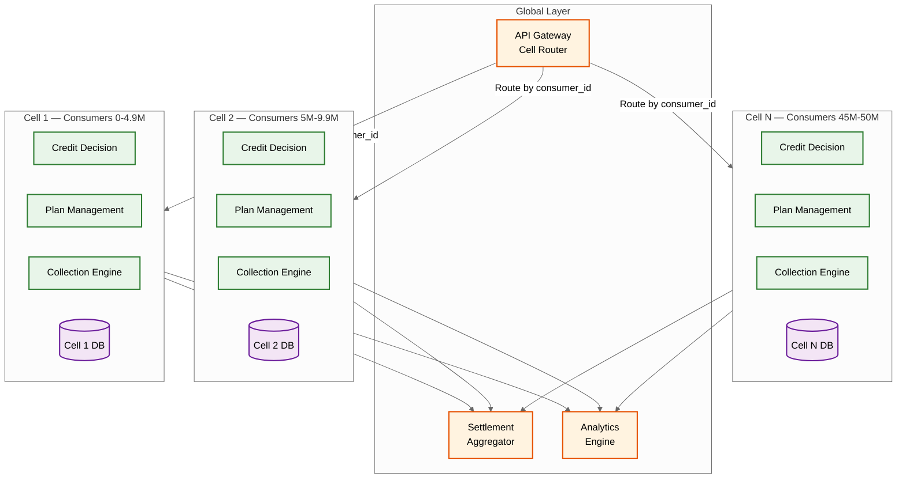

# Scalability & Reliability

## Scaling Strategy Overview

The BNPL platform has distinct scaling profiles across its components: the credit decision path is latency-bound (low throughput, tight SLA), the payment collection path is batch-throughput-bound (high volume, time-windowed), and the plan management path is storage-bound (50M+ active plans with complex state). Each requires a different scaling approach.

---

## 1. Credit Decision Service Scaling

### Challenge
525 peak TPS with a 2-second latency budget. The Slowest part of the process is not raw throughput but the serial dependency on external services (credit bureau, ML inference) within each request.

### Strategy: Horizontal Scaling with Caching

```
Credit Decision Service
├── Stateless decision workers (N instances, auto-scaled)
├── Bureau cache (distributed cache, 24h TTL per consumer)
├── Feature store (in-memory, replicated across zones)
├── ML model service (GPU-backed, pre-warmed)
└── Decision audit queue (async persistence)
```

**Horizontal scaling**: Decision workers are stateless---each request is self-contained. Auto-scale based on request queue depth and p99 latency. Target: 2x headroom over peak (1,050 TPS capacity).

**Bureau cache**: 70% cache hit rate means only 30% of decisions require a live bureau call. Cache is partitioned by consumer_id hash. Cache invalidation: TTL-based (24h) plus event-driven (when consumer's financial profile changes materially).

**Feature store replication**: Feature vectors are replicated across all availability zones. Updates are applied via eventual consistency (hourly batch refresh). Each zone serves reads locally (5ms latency).

**ML model pre-warming**: New model versions are deployed to shadow instances that receive production traffic (predictions are discarded). Once warm, traffic is shifted via weighted routing.

### Auto-Scaling Policy

```
Scale-out trigger:
  - p99 latency > 1.5s for 2 consecutive minutes
  - Request queue depth > 100 for 1 minute
  - CPU utilization > 70% for 3 minutes

Scale-in trigger:
  - p99 latency < 500ms for 15 minutes
  - CPU utilization < 30% for 15 minutes

Pre-scaling:
  - Calendar-based: 3x capacity from Black Friday through Cyber Monday
  - Merchant promotion alerts: 2x capacity when large merchant runs flash sale
```

---

## 2. Plan & Payment Database Scaling

### Challenge
50M active plans with 345M scheduled payments. Write patterns: 2M new plans/day, 5M payment status updates/day. Read patterns: consumer dashboard queries, collection scheduler scans, merchant analytics.

### Strategy: Sharded Relational Database

**Shard key**: `consumer_id` for InstallmentPlan and ScheduledPayment tables. This co-locates a consumer's plans and payments on the same shard, enabling efficient dashboard queries without cross-shard joins.

**Shard count**: 64 shards initially, expandable to 256. Each shard holds ~780K active plans and ~5.4M scheduled payments.

```
Shard allocation:
  consumer_id_hash = hash(consumer_id) % 64
  route to shard[consumer_id_hash]

Co-located tables per shard:
  - Consumer (partition of)
  - InstallmentPlan
  - ScheduledPayment
  - PaymentMethod
```

**Collection scheduler optimization**: The collection scheduler needs to query payments by `due_date` and `status` across all shards. Instead of scatter-gather queries across 64 shards:
1. A materialized "collection queue" table (single database) is populated nightly from all shards
2. The scheduler reads from this centralized queue
3. Collection results are written back to the appropriate shard

**Read replicas**: Each shard has 2 read replicas for dashboard queries and analytics. Write-to-read replication lag target: < 100ms.

### Merchant Data Partitioning

Merchant queries (settlement reports, transaction lists) span many consumers. A separate merchant-optimized read store is maintained:
- Event stream captures plan creation, payment, and refund events
- Merchant analytics service aggregates events by merchant_id into a denormalized store
- Settlement service queries the merchant store, not the consumer-sharded database

---

## 3. Payment Collection Scaling

### Challenge
2M payments per collection window (3 windows/day), each requiring an external payment processor call. Processor rate limits and latency variability create throughput constraints.

### Strategy: Partitioned Batch Processing

```
Collection Pipeline:
  Scheduler → Batch Generator → Partition Router → Processor Workers → Result Reconciler

Partitioning:
  - By payment processor (each processor has its own worker pool)
  - By payment method type (debit cards vs bank accounts have different APIs)
  - By priority (overdue payments first, then current due)
```

**Worker pool sizing**: Sized per processor based on negotiated rate limits.
- Processor A: 500 TPS → 500 workers with connection pooling
- Processor B: 200 TPS → 200 workers
- Bank direct debit: 100 TPS → 100 workers

**Backpressure**: If a processor returns rate-limit errors, the worker pool dynamically reduces concurrency and increases inter-request delay. Payments are re-queued for the next batch window rather than dropped.

**Exactly-once guarantee**: Each payment attempt carries an idempotency key (`payment_id_attempt_N`). The reconciler checks that every submitted payment has a terminal result (success or permanent failure) before the batch is marked complete.

---

## 4. Feature Store Scaling

### Challenge
50M consumer feature vectors (500 bytes each = 25GB total) served at < 10ms latency. Updated hourly (batch) and event-driven (material changes).

### Strategy: In-Memory Distributed Cache

```
Feature Store Architecture:
  ┌──────────────────┐
  │ Batch Compute    │──hourly──►┌──────────────────┐
  │ (analytics job)  │           │ Feature Cache     │
  └──────────────────┘           │ (distributed,     │
  ┌──────────────────┐           │  partitioned by   │
  │ Event Processor  │──realtime─►│  consumer_id)    │
  │ (missed payment, │           │                  │
  │  new plan, etc.) │           │ 25GB across nodes │
  └──────────────────┘           └──────────────────┘
                                         │
                              Serves credit decision
                              service at < 10ms
```

**Partitioning**: Feature vectors are partitioned across cache nodes by `consumer_id` hash. Each node holds ~3--4GB of features.

**Update strategy**:
- **Hourly batch**: Analytics job recomputes all features from source data; bulk-loads into cache
- **Real-time events**: Material events (missed payment, new plan created, credit bureau update) trigger targeted feature recalculation for the affected consumer

**Freshness guarantee**: Feature vectors include a `computed_at` timestamp. The credit decision service rejects features older than 24 hours and forces a synchronous recomputation (adding ~200ms to the decision).

---

## 5. Reliability Patterns

### Multi-Region Deployment

```
Region A (Primary)                 Region B (Standby)
┌─────────────────────┐            ┌─────────────────────┐
│ Credit Decision     │            │ Credit Decision     │
│ Plan Management     │            │ Plan Management     │
│ Payment Collection  │            │ Payment Collection  │
│ Settlement          │            │ Settlement          │
│                     │            │                     │
│ DB Primary (write)  │──sync──►   │ DB Replica (read)   │
│ Feature Store       │──async──►  │ Feature Store       │
│ Event Bus           │──replicate─►│ Event Bus          │
└─────────────────────┘            └─────────────────────┘
```

**Active-passive**: Region A handles all writes. Region B serves read-only traffic (consumer dashboards, merchant reports). Failover to Region B promotes replicas to primary (RTO: < 5 minutes, RPO: < 1 second with synchronous replication for financial data).

**Why not active-active**: Credit decisions and payment collections require strong consistency. Active-active with conflict resolution adds complexity and risk of double-charging consumers. The latency benefit of multi-region writes does not justify the consistency risks for a financial system.

### Circuit Breakers

```
External Dependency Circuit Breakers:
  Credit Bureau:
    - Failure threshold: 50% error rate over 30s window
    - Open state: fall back to bureau-less scoring
    - Half-open: route 10% of traffic to bureau, monitor

  Payment Processor:
    - Failure threshold: 30% error rate over 60s window
    - Open state: queue payments for retry; use alternate processor if available
    - Half-open: route 5% of traffic, monitor

  Card Network:
    - Failure threshold: 20% timeout rate over 30s
    - Open state: virtual card authorizations fail-open with lower limit
    - Half-open: route 10%, monitor
```

### Idempotency Enforcement

Every financial operation has a two-layer idempotency guarantee:

1. **Fast path**: Distributed cache lookup by idempotency key. If found, return cached response immediately.
2. **Slow path**: Database unique constraint on idempotency key column. If cache misses but database has the key, return persisted response.

```
FUNCTION idempotent_execute(idempotency_key, operation):
    -- Layer 1: Cache check
    cached = cache.get("idempotency:" + key)
    IF cached:
        RETURN cached.response

    -- Layer 2: Database check
    existing = db.query("SELECT response FROM idempotency_log WHERE key = ?", key)
    IF existing:
        cache.set("idempotency:" + key, existing.response, ttl=24h)
        RETURN existing.response

    -- Execute operation
    result = operation.execute()

    -- Persist idempotency record (atomic with operation)
    db.insert("INSERT INTO idempotency_log (key, response, created_at) VALUES (?, ?, NOW())", key, result)
    cache.set("idempotency:" + key, result, ttl=24h)

    RETURN result
```

---

## 6. Disaster Recovery

### Recovery Objectives

| Component | RPO | RTO | Strategy |
|-----------|-----|-----|----------|
| Plan & Payment DB | 0 (synchronous replication) | < 5 min | Replica promotion |
| Credit Decision Audit | < 1 min | < 15 min | Async replication + WAL replay |
| Feature Store | < 1 hour | < 10 min | Rebuild from source; serve stale during rebuild |
| Event Bus | 0 | < 2 min | Multi-zone replication within region |
| Merchant Settlement | < 1 min | < 30 min | Replay from transaction log |

### Scenario: Primary Database Failure

```
1. Health check detects primary DB unreachable (5s timeout × 3 retries = 15s)
2. Automated failover promotes synchronous replica to primary (30s)
3. Connection pool refreshes to new primary (10s)
4. All in-flight transactions that did not complete are rolled back by the DB
5. Clients retry failed operations using idempotency keys (no duplicates)
6. Collection scheduler re-scans for payments that were "processing" but not completed
7. Total service disruption: ~60 seconds
```

### Scenario: Payment Processor Outage (Extended)

```
1. Circuit breaker opens after 30% error rate sustained for 60s
2. All pending payments are queued in a durable "deferred collection" queue
3. Consumer-facing: "Your payment is being processed" (no error shown)
4. If alternate processor is available, route eligible payments there
5. When processor recovers, drain the deferred queue with rate limiting
6. Extend grace periods automatically for payments delayed by outage
7. No late fees assessed for outage-delayed payments (regulatory requirement)
```

---

## 7. Capacity Planning

### Growth Model

```
Year 1 → Year 3 growth projections:

Consumers:          50M → 120M  (2.4x)
Active plans:       50M → 130M  (2.6x)
Daily decisions:    3M → 8M     (2.7x)
Daily collections:  5M → 14M    (2.8x)
Merchants:          500K → 1.5M (3x)
Annual GMV:         $100B → $300B

Infrastructure scaling:
  DB shards:        64 → 128 (double at 75% capacity)
  Decision workers: 50 → 120
  Collection workers: 800 → 2,000
  Feature store:    25GB → 60GB (still fits in-memory)
  Storage growth:   ~8TB/year → ~22TB/year
```

### Cost Optimization

| Strategy | Savings | Trade-off |
|----------|---------|-----------|
| Tiered storage for credit decisions | 60% storage cost reduction | Older decisions take longer to retrieve (acceptable for audits) |
| Spot instances for batch collection | 40% compute cost for collection workers | Must handle interruptions (idempotent retries cover this) |
| Reserved capacity for decision service | 30% cost vs. on-demand | Requires accurate forecasting of peak load |
| Data compression for historical plans | 70% storage reduction for completed plans | Decompression latency for historical queries |
| Pay-by-bank for recurring collections | 60% reduction in per-transaction fees vs. card | Consumer education required; bank API reliability varies |
| Edge caching for checkout widget | 80% reduction in origin requests | Cache invalidation for config changes requires TTL tuning |

---

## 8. Chaos Engineering Scenarios

### Scenario Matrix

| Scenario | Injection Method | Expected Behavior | Blast Radius Control |
|----------|-----------------|-------------------|---------------------|
| Bureau API returns 500 for all requests | Fault injection proxy | Circuit breaker opens; bureau-less model activates; approval rate drops ~10%, latency improves | Shadow traffic only; never inject during peak checkout hours |
| Payment processor latency increases to 10s | Network delay injection | Collection batch timeout triggers backpressure; payments re-queued; grace period auto-extended | Single processor; alternate processors unaffected |
| Feature store returns stale data (48h old) | Timestamp manipulation | Decision service rejects stale features; forces synchronous recomputation; p99 latency increases 200ms | Canary consumer cohort (< 1%) |
| Database primary becomes read-only | Storage layer fault | Write operations fail; automated replica promotion within 60s; in-flight transactions retry via idempotency keys | Single shard; other shards unaffected |
| Event bus partition lost | Kill broker node | Events queue at producers; consumer services see delayed events; settlement delayed but not lost | Single partition; replicated partitions continue |
| Settlement bank API rejects all transfers | API error injection | Settlements queued; merchants notified of delay; no financial inconsistency | Verification in staging environment first |

### Steady-State Hypothesis

```
For each chaos experiment, define measurable steady-state:

Credit Decision:
  - Hypothesis: "Even with bureau unavailable, checkout conversion remains > 65%"
  - Measurement: approval_rate gauge over 15-minute window
  - Abort condition: approval_rate < 50% or error_rate > 5%

Payment Collection:
  - Hypothesis: "During processor degradation, no payments are lost or double-charged"
  - Measurement: reconciliation check passes (processor confirmations == plan updates)
  - Abort condition: any reconciliation discrepancy

Settlement:
  - Hypothesis: "Bank unavailability delays but never corrupts settlements"
  - Measurement: pending_settlement_queue grows; no settlement amount discrepancy
  - Abort condition: any settlement marked 'completed' without bank confirmation
```

---

## 9. Cell-Based Architecture for Financial Isolation

For a BNPL platform managing billions in receivables, a cell-based architecture limits the blast radius of failures to a bounded set of consumers and merchants.

```
Cell Architecture:
  Cell = { consumer_cohort, plan_data, payment_data, feature_cache, decision_workers }

  Cell Assignment:
    - Consumers assigned to cells by consumer_id hash at registration
    - Each cell holds ~5M consumers (10 cells for 50M consumers)
    - Merchant data is replicated across all cells (merchants serve all consumers)

  Cell Isolation:
    - Each cell has its own database shard group (2-3 shards per cell)
    - Each cell has its own decision worker pool
    - Each cell has its own collection scheduler instance
    - Event bus: per-cell topics for plan events; shared topic for settlement

  Cell Failure Impact:
    - Single cell failure affects ~10% of consumers
    - Other cells continue processing normally
    - Failed cell's payments are deferred (grace period extended)
    - Settlement continues from unaffected cells

  Cross-Cell Operations:
    - Consumer-to-consumer transfers: not applicable (no P2P in BNPL)
    - Merchant settlement: aggregation layer collects from all cells
    - Analytics: reads from all cell replicas
    - Compliance audit: centralized audit log ingests from all cells
```



---

## 10. Seasonal Scaling Strategy

BNPL traffic is highly seasonal, with predictable spikes during retail events and unpredictable spikes during flash sales.

### Calendar-Based Pre-Scaling

```
Scaling Calendar:
  Jan 1-5:        1.5x (post-holiday returns + New Year sales)
  Feb 14:         1.3x (Valentine's Day)
  Mar-Apr:        1.0x (baseline)
  May (Memorial): 1.2x (US sales weekend)
  Jun-Jul:        1.1x (summer sales)
  Aug (back-to-school): 1.3x
  Sep-Oct:        1.0x (baseline)
  Nov 11:         2.0x (Singles' Day / 11.11)
  Nov 25-Dec 2:   5.0x (Black Friday → Cyber Monday)
  Dec 1-24:       3.0x (holiday shopping)
  Dec 26-31:      2.0x (post-holiday sales + returns)

Pre-scaling lead time: 4 hours (warm instance pools)
Merchant promotion alerts: 2x when large merchant announces flash sale
```

### Warm Pool Management

```
FUNCTION manage_warm_pool(service, target_capacity):
    current = get_running_instances(service)
    warm = get_warm_instances(service)  -- ready but not receiving traffic

    IF target_capacity > current + warm:
        -- Need more instances; launch and warm up
        deficit = target_capacity - current - warm
        launch_instances(service, deficit)
        FOR each new_instance:
            load_ml_models(new_instance)         -- 30s for risk model
            warm_feature_cache(new_instance)      -- 15s for local cache
            run_health_check(new_instance)        -- 5s
            add_to_warm_pool(new_instance)

    IF target_capacity <= current:
        -- Scale down warm pool (never scale down active)
        excess_warm = warm - (target_capacity × 0.2)  -- keep 20% warm buffer
        IF excess_warm > 0:
            drain_warm_instances(service, excess_warm)
```
