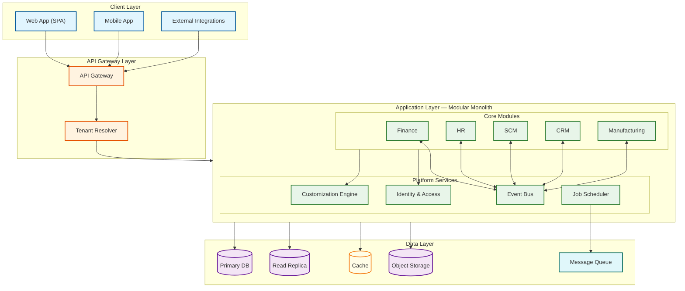
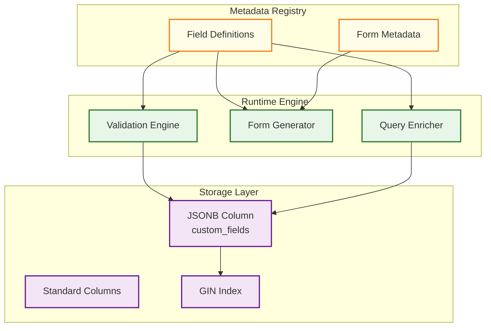
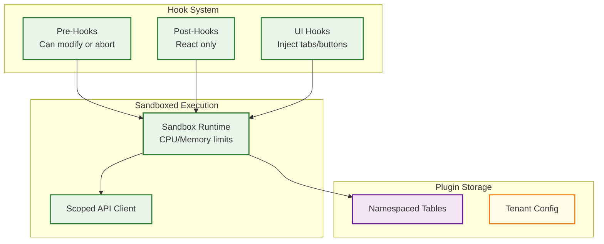
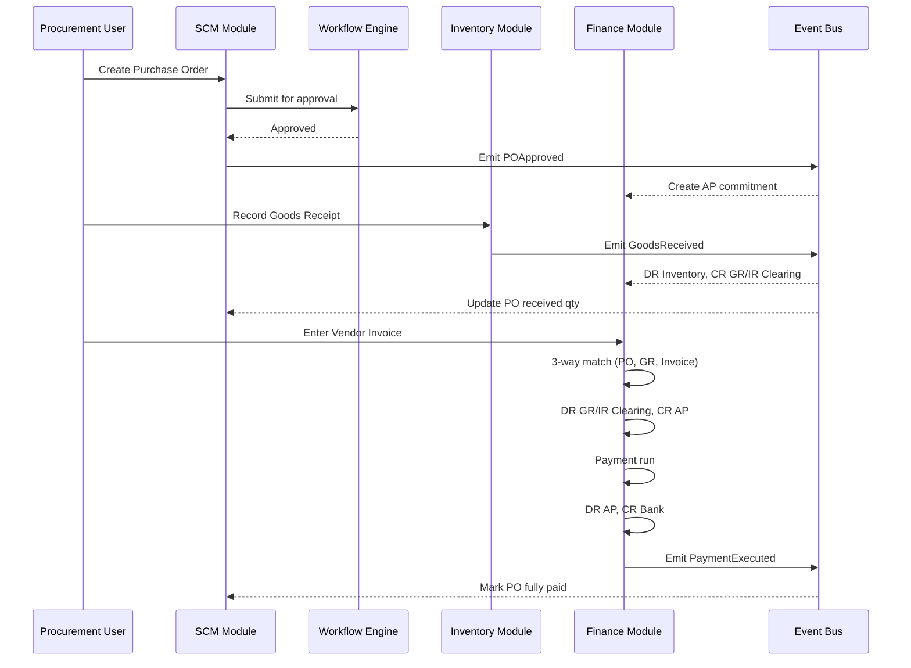
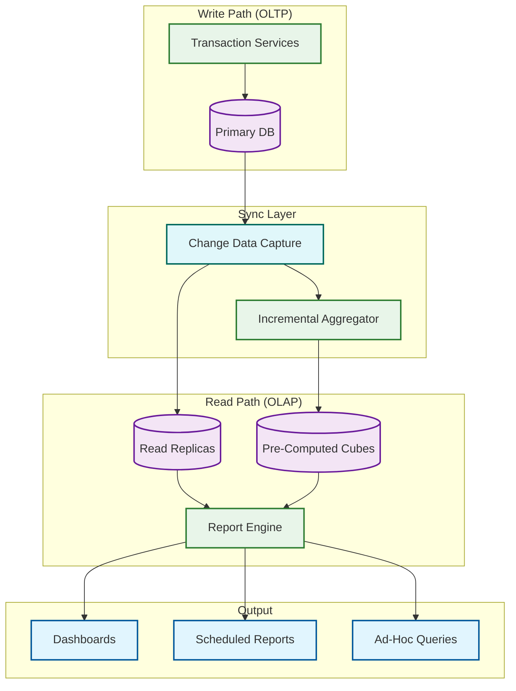

# High-Level Design

## Overall Architecture

An ERP system integrates finance, HR, supply chain, manufacturing, CRM, and project management into a unified platform. The architecture must balance tight data integration (a defining ERP trait) with modularity for independent evolution.

### Modular Monolith vs Microservices

Most production ERPs use a **modular monolith** rather than pure microservices:

| Factor | Modular Monolith | Microservices |
|--------|-------------------|---------------|
| Cross-module transactions | Native ACID within a single DB | Saga/2PC overhead |
| Data consistency | Strong consistency by default | Eventual consistency |
| Deployment complexity | Single deployable unit | Dozens of services |
| Customization surface | One extension framework | Hooks in every service |

The recommended approach: **modular monolith with clear bounded contexts**, where each module exposes an internal API contract and communicates through an in-process event bus.



### Module Decomposition as Bounded Contexts

| Module | Key Aggregates | Publishes Events |
|--------|----------------|-------------------|
| Finance | JournalEntry, Invoice, Payment | `InvoicePosted`, `PaymentApplied` |
| HR | Employee, PayrollRun, LeaveRequest | `EmployeeOnboarded`, `PayrollProcessed` |
| SCM | PurchaseOrder, InventoryItem, GoodsReceipt | `POApproved`, `GoodsReceived` |
| CRM | Lead, Opportunity, Contact | `OpportunityWon`, `LeadConverted` |
| Manufacturing | BillOfMaterials, WorkOrder | `WorkOrderCompleted`, `MaterialConsumed` |
| Projects | Project, Task, Timesheet | `MilestoneReached`, `TimesheetApproved` |

---

## Multi-Tenancy Architecture

ERP platforms serve organizations ranging from 5-person startups to 100,000-employee enterprises. Three isolation patterns exist, and a hybrid approach is recommended.

**Pattern 1 — Shared Database, Shared Schema:** All tenants share the same tables with a `tenant_id` discriminator. Cheapest but risk of data leakage if query filters are missed.

**Pattern 2 — Shared Database, Separate Schema:** Each tenant gets a database schema (namespace). Stronger isolation via database-level access controls. Upper limit ~5,000 schemas per instance.

**Pattern 3 — Database-per-Tenant:** Dedicated database per tenant. Maximum isolation and custom SLAs but highest cost.

### Hybrid Strategy (Production Recommendation)

```Step-by-step plan in plain English
FUNCTION resolve_tenant_database(tenant):
    tier = tenant.subscription_tier
    IF tier == "enterprise":
        RETURN dedicated_connection_pool(tenant.dedicated_db_host)
    ELSE IF tier == "professional":
        pool = shared_regional_pool(tenant.region)
        pool.set_schema(tenant.schema_name)
        RETURN pool
    ELSE:
        pool = shared_pool(tenant.region)
        pool.set_tenant_context(tenant.id)
        RETURN pool
```

### Tenant Resolution Flow

```Step-by-step plan in plain English
FUNCTION resolve_tenant(request):
    // Priority: subdomain > header > JWT claim
    tenant_key = extract_subdomain(request.hostname)
        OR request.headers["X-Tenant-ID"]
        OR request.auth_token.claims["tenant_id"]

    IF tenant_key IS NULL:
        RAISE TenantResolutionError("No tenant identifier found")

    tenant = cache.get("tenant:" + tenant_key)
    IF tenant IS NULL:
        tenant = db.query("SELECT * FROM tenants WHERE slug = ?", tenant_key)
        IF tenant IS NULL OR tenant.status != "active":
            RAISE TenantNotFoundError(tenant_key)
        cache.set("tenant:" + tenant_key, tenant, ttl=300)

    RequestContext.set_tenant(tenant)
    RETURN tenant
```

---

## Customization Engine Architecture

### Metadata-Driven Custom Fields

Rather than executing DDL for each tenant's custom fields, the system stores field definitions as metadata:

| Strategy | Flexibility | Query Performance | Recommendation |
|----------|------------|-------------------|----------------|
| EAV (Entity-Attribute-Value) | Excellent | Poor (pivoting/joins) | Only for indexed fields |
| JSON/JSONB Columns | Good | Good with GIN indexes | Primary approach |
| Virtual Columns (wide table) | Limited | Excellent | Avoid — too rigid |



### Custom Workflow Engine

ERP workflows are modeled as configurable state machines:

```Step-by-step plan in plain English
STRUCTURE WorkflowDefinition:
    entity_type: STRING          // "purchase_order", "leave_request"
    states: LIST[StateNode]      // each with on_enter/on_exit actions
    transitions: LIST[Transition]  // from_state, to_state, trigger, guards, actions

FUNCTION execute_transition(entity, trigger, user):
    workflow = load_workflow(entity.type, entity.tenant_id)
    transition = workflow.find_transition(entity.workflow_state, trigger)
    IF transition IS NULL:
        RAISE InvalidTransitionError(entity.workflow_state, trigger)

    context = build_expression_context(entity, user)
    FOR EACH condition IN transition.guard_conditions:
        IF NOT evaluate_expression(condition, context):
            RAISE GuardConditionFailed(condition)

    execute_actions(workflow.get_state(entity.workflow_state).on_exit_actions)
    execute_actions(transition.actions)
    entity.workflow_state = transition.to_state
    execute_actions(workflow.get_state(transition.to_state).on_enter_actions)
    persist(entity)
    emit_event("WorkflowTransitioned", entity, transition)
```

### Dynamic Form Rendering

Forms are rendered from metadata, not hardcoded:

```Step-by-step plan in plain English
FUNCTION generate_form_schema(entity_type, tenant_id, user_role):
    standard_fields = schema_registry.get_fields(entity_type)
    custom_fields = field_definitions.query(tenant_id, entity_type, status="active")
    layout = form_layouts.get(tenant_id, entity_type) OR form_layouts.get_default(entity_type)

    ui_schema = { sections: [], validation_rules: [] }
    FOR EACH section IN layout.sections:
        section_schema = { title: section.title, fields: [] }
        FOR EACH field_ref IN section.field_refs:
            field = standard_fields.get(field_ref) OR custom_fields.get(field_ref)
            IF field IS NULL OR NOT field.visible_to_roles.includes(user_role):
                CONTINUE
            section_schema.fields.append(build_field_schema(field))
        ui_schema.sections.append(section_schema)
    RETURN ui_schema
```

---

## Extension Framework

### Plugin Architecture with Sandboxed Execution



```Step-by-step plan in plain English
FUNCTION execute_plugin_hook(plugin, hook_name, payload):
    IF hook_name NOT IN plugin.manifest.declared_hooks:
        RAISE PermissionDenied(plugin.id, hook_name)

    sandbox = create_sandbox(cpu_limit_ms=500, memory_limit_mb=64, timeout_ms=2000)
    sandbox.inject("platform", create_scoped_api_client(
        tenant_id=RequestContext.tenant_id, scopes=plugin.manifest.api_scopes))

    TRY:
        RETURN sandbox.execute(plugin.entry_point, hook_name, payload)
    CATCH TimeoutError:
        IF hook_name.starts_with("pre_"):
            RAISE PluginTimeoutError("Pre-hook timed out")
    CATCH SandboxViolation AS e:
        disable_plugin(plugin.id, reason=e.message)
```

---

## Data Flow: Procure-to-Pay



### Cross-Module Event Bus

```Step-by-step plan in plain English
STRUCTURE DomainEvent:
    event_id: UUID
    event_type: STRING
    source_module: STRING
    tenant_id: UUID
    payload: MAP
    correlation_id: UUID    // traces the business process

FUNCTION publish_event(event):
    outbox.insert(event)    // same transaction as business data
    // Outbox processor delivers asynchronously to subscribers

FUNCTION handle_event(event):
    FOR EACH handler IN event_registry.get_handlers(event.event_type):
        TRY:
            handler.process(event)
        CATCH error:
            IF retry_count < MAX_RETRIES:
                schedule_retry(event, handler, exponential_backoff)
            ELSE:
                move_to_dead_letter(event, handler, error)
```

---

## Key Architectural Decisions

| Decision | Options | Choice | Rationale |
|----------|---------|--------|-----------|
| Architecture style | Microservices, Modular monolith | Modular monolith | Cross-module ACID transactions; extract later if needed |
| Multi-tenancy | Shared-all, Schema, DB-per-tenant | Hybrid (tier-based) | Cost balance with enterprise isolation |
| Custom field storage | EAV, JSONB, DDL per tenant | JSONB + selective EAV | JSONB for most fields; EAV for indexed fields |
| Workflow engine | BPMN, Custom DSL | Custom DSL state machine | BPMN too complex; DSL enables tenant self-service |
| Event delivery | Sync calls, In-process bus, Broker | In-process + transactional outbox | Latency + reliability |
| Extension runtime | Shared process, Container, Sandbox | Scripting sandbox | Isolation without container overhead |
| API style | REST, GraphQL, gRPC | REST + optional GraphQL | REST for caching; GraphQL for complex UI needs |
| Tenant resolution | Subdomain, Header, JWT, Path | Subdomain + JWT | Subdomain for web; JWT for API |

---

## Reporting and Analytics Architecture

Financial reporting is a first-class architectural concern, not an afterthought. The CQRS split separates transactional processing from reporting workloads.



| Report Category | Source | Freshness | Routing |
|----------------|--------|-----------|---------|
| Operational (invoice list, PO status) | Read replica | < 5 seconds | Direct replica query |
| Financial (trial balance, P&L) | Pre-computed cubes | < 15 minutes | Cube lookup + delta query |
| Analytical (trend, forecasting) | OLAP store | < 1 hour | Dedicated analytical engine |
| Compliance (audit, SoD) | Audit log store | Real-time | Dedicated audit replica |

---

## Integration Hub Architecture

Enterprise ERPs must integrate with dozens of external systems per tenant — banks, tax authorities, shipping carriers, HR benefits providers, and EDI trading partners.

```Step-by-step plan in plain English
STRUCTURE IntegrationChannel:
    channel_id: UUID
    tenant_id: UUID
    channel_type: ENUM  // "rest_api", "edi_x12", "edi_edifact", "sftp", "webhook"
    direction: ENUM     // "inbound", "outbound", "bidirectional"
    config: MAP         // endpoint, credentials_ref, mappings, retry_policy
    status: ENUM        // "active", "paused", "error"

FUNCTION process_outbound_integration(event, channel):
    // Transform ERP domain event to external format
    payload = apply_transformation(event, channel.config.mapping)

    SWITCH channel.channel_type:
        CASE "rest_api":
            response = http_post(channel.config.endpoint, payload,
                                  headers=channel.config.auth_headers)
        CASE "edi_x12":
            edi_doc = transform_to_x12(payload, channel.config.transaction_set)
            response = sftp_upload(channel.config.sftp_host, edi_doc)
        CASE "webhook":
            signature = hmac_sha256(channel.config.secret, payload)
            response = http_post(channel.config.url, payload,
                                  headers={"X-Signature": signature})

    log_integration_event(channel, event, response)
    IF response.is_error:
        schedule_retry(channel, event, backoff=exponential)
```

### Integration Patterns by External System

| External System | Protocol | Direction | Frequency | Error Handling |
|----------------|----------|-----------|-----------|---------------|
| Banking (payments) | BAI2/MT940/ISO 20022 | Bidirectional | Daily batch | Reconciliation queue |
| Tax authority | REST API | Outbound | Per-transaction or batch | Retry + manual queue |
| EDI trading partners | X12/EDIFACT via AS2/SFTP | Bidirectional | Hourly/daily | Acknowledgment tracking |
| Shipping carriers | REST API | Outbound | Per-shipment | Fallback to manual booking |
| HR benefits providers | SFTP/REST | Outbound | Monthly/event-driven | Delta file reconciliation |
| iPaaS connectors | REST/GraphQL | Bidirectional | Real-time | Circuit breaker + DLQ |

---

## Master Data Management Architecture

Master data (chart of accounts, organizational hierarchy, business partners, products) is shared across modules. The MDM service acts as the single source of truth, publishing change events to dependent modules.

```Step-by-step plan in plain English
FUNCTION update_master_data(entity_type, entity_id, changes, user):
    // Validate against master data rules
    rules = load_validation_rules(entity_type, RequestContext.tenant_id)
    FOR EACH rule IN rules:
        IF NOT evaluate_rule(rule, changes):
            RAISE ValidationError(rule.message)

    // Apply change with optimistic locking
    entity = load_with_version(entity_type, entity_id)
    apply_changes(entity, changes)
    persist_with_version_check(entity)

    // Publish change event for cross-module propagation
    publish_event("MasterDataChanged", {
        entity_type: entity_type,
        entity_id: entity_id,
        changed_fields: changes.keys(),
        tenant_id: RequestContext.tenant_id
    })

    // Invalidate caches across all layers
    invalidate_master_data_cache(entity_type, entity_id, RequestContext.tenant_id)

    RETURN entity
```

| Master Data Type | Consumers | Change Propagation | Cache Strategy |
|-----------------|-----------|-------------------|---------------|
| Chart of Accounts | Finance, Reporting, Budgeting | Sync within Finance, async to reporting | L1 (60s) + L2 (30 min) |
| Org Hierarchy | All modules (access control) | Async event, cache invalidation | L2 (5 min), event-driven bust |
| Business Partners | AP, AR, CRM, Procurement | Event-driven, async | L2 (10 min), update on access |
| Product Catalog | Inventory, Manufacturing, Sales | Sync to Inventory, async to others | L2 (15 min) |
| Exchange Rates | Finance, Procurement, Reporting | Broadcast invalidation | L1 (60s), daily reload |
| Tax Tables | Finance, Payroll, Sales | Version-controlled, manual publish | L2 (24h), reload on version bump |
