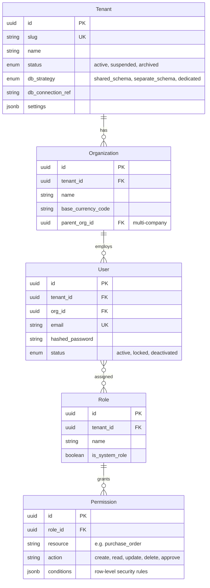
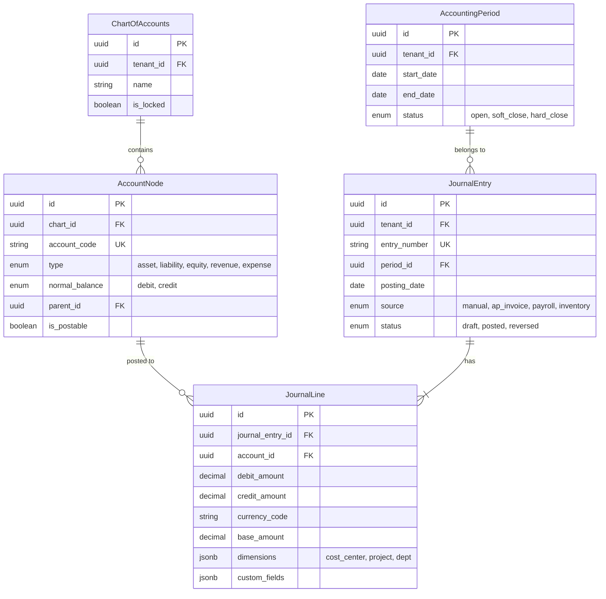
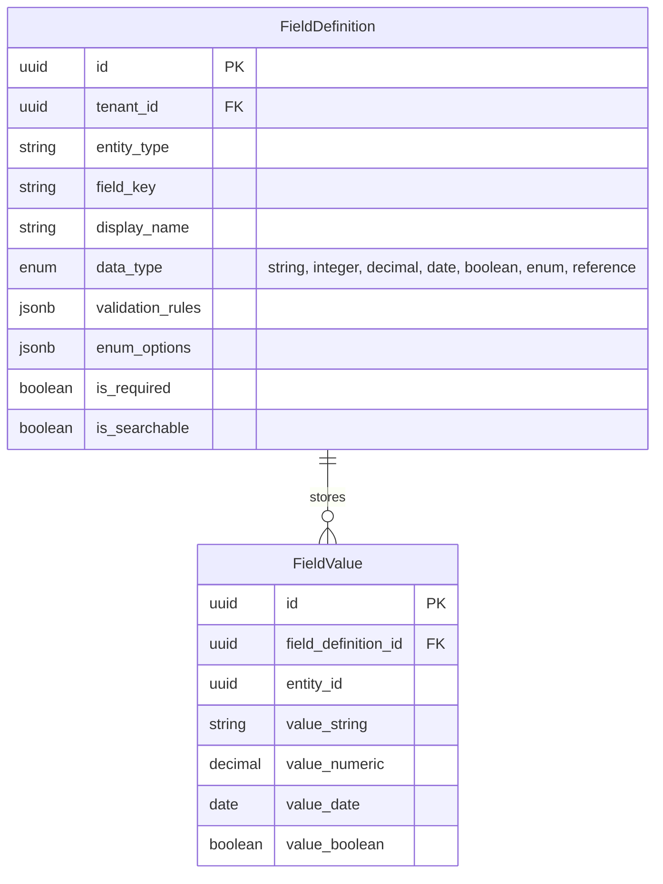
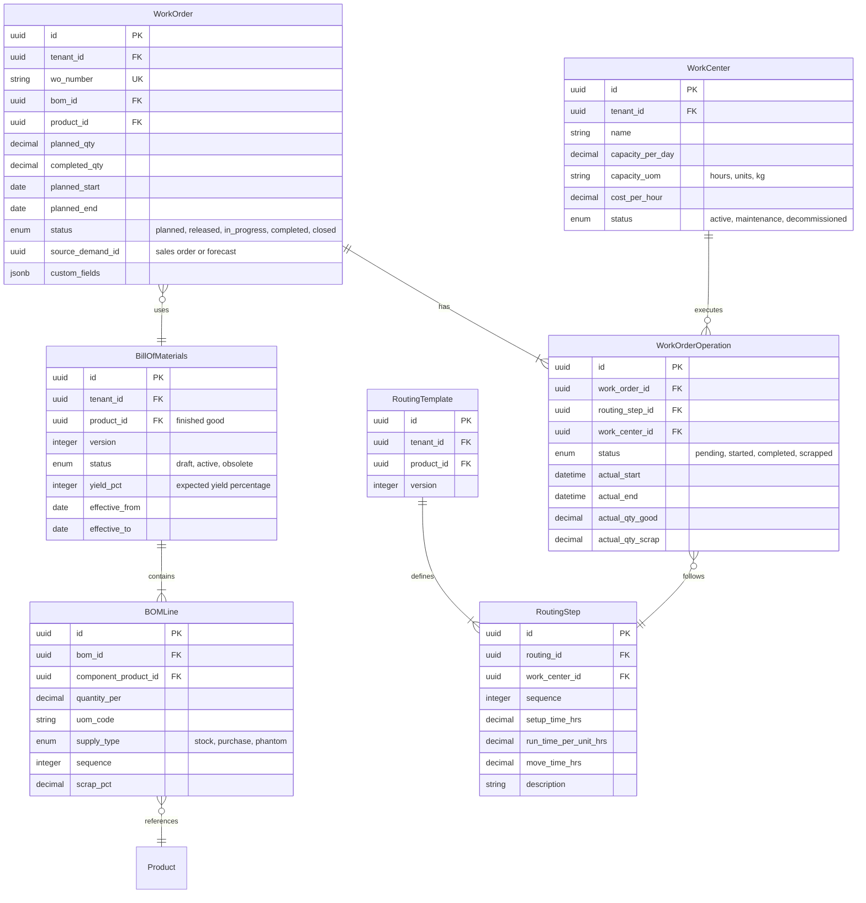
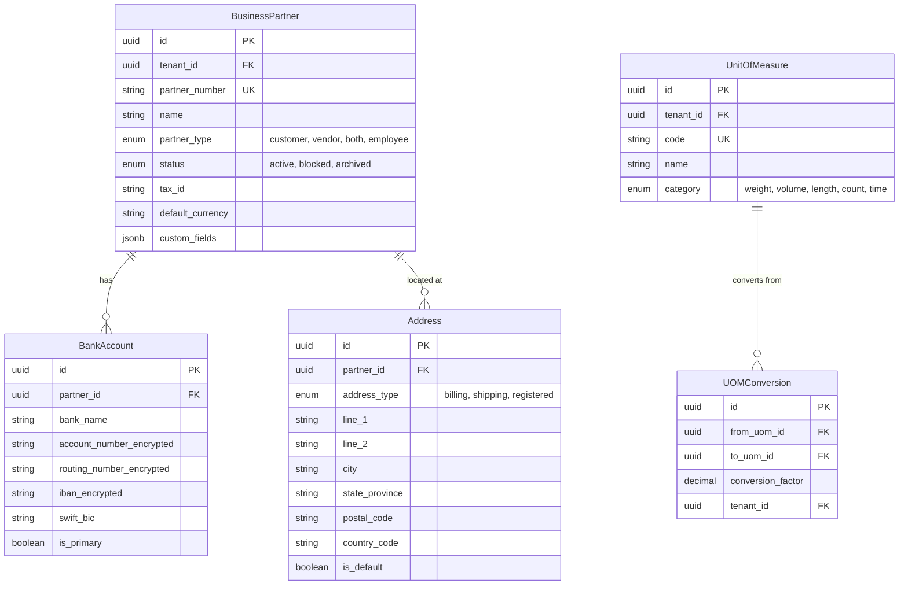

# Low-Level Design

## Data Models

### Core Platform Entities



### Finance Module



### HR, SCM, CRM Modules (Key Entities)

| Module | Entity | Key Fields | Notes |
|--------|--------|-----------|-------|
| HR | Employee | employee_number, hire_date, department_id, manager_id, employment_type, custom_fields | Self-referencing hierarchy |
| HR | PayrollRun | period_start, period_end, status, total_gross, total_net, posted_journal_entry_id | Links to Finance |
| HR | LeaveBalance | employee_id, leave_type_id, year, accrued, used, closing_balance | Entitlement tracking |
| SCM | Product | sku, uom, product_type, reorder_point, reorder_qty, custom_fields | Inventory-managed |
| SCM | PurchaseOrder | po_number, vendor_id, workflow_state, total_amount, currency_code | Workflow-driven |
| SCM | InventoryTransaction | product_id, warehouse_id, type (receipt/issue/transfer), quantity, unit_cost | Immutable log |
| CRM | Lead | source, status (new/qualified/disqualified), assigned_to, score | Pre-qualification |
| CRM | Opportunity | lead_id, stage, probability_pct, expected_amount, expected_close_date | Pipeline tracking |

### Custom Field Metadata (EAV)



---

## API Design

### Tenant-Scoped RESTful Endpoints

All paths are implicitly scoped to the authenticated tenant (resolved from subdomain or JWT — no `tenant_id` in URL).

```Step-by-step plan in plain English
ENDPOINT GET /api/v1/finance/journal-entries
    Params: period_id, status, date_from, date_to, page, page_size
    Response: { data: [JournalEntry], pagination: { page, total, has_next } }

ENDPOINT POST /api/v1/finance/journal-entries
    Body: { posting_date, description, lines: [{ account_id, debit, credit, dimensions }] }
    Validation: debits == credits, accounts in tenant's chart, period is open
    Response: { data: JournalEntry, status: 201 }

ENDPOINT POST /api/v1/scm/purchase-orders/{id}/transitions
    Body: { action: "submit_for_approval", comment: "Urgent" }
    Triggers workflow engine; returns updated entity with new workflow_state
```

### Bulk Operations API

```Step-by-step plan in plain English
FUNCTION process_bulk_operations(operations, options):
    results = []
    IF options.atomic: BEGIN_TRANSACTION

    FOR EACH op, index IN operations:
        TRY:
            IF options.validate_only:
                validate(op)
                results.append({ index, status: "valid" })
            ELSE:
                result = execute_operation(op)
                results.append({ index, status: "created", id: result.id })
        CATCH ValidationError AS e:
            results.append({ index, status: "error", error: e.message })
            IF options.atomic:
                ROLLBACK_TRANSACTION
                RETURN { status: "rolled_back", results }

    IF options.atomic: COMMIT_TRANSACTION
    RETURN { status: "completed", results }
```

---

## Customization Engine Internals

### Field Validation

```Step-by-step plan in plain English
FUNCTION validate_custom_field(field_def, value):
    IF value IS NULL:
        IF field_def.is_required: RAISE ValidationError("Field is required")
        RETURN

    typed_value = coerce_type(value, field_def.data_type)
    IF typed_value IS COERCION_ERROR:
        RAISE ValidationError("Expected " + field_def.data_type)

    FOR EACH rule IN field_def.validation_rules:
        SWITCH rule.rule_type:
            CASE "min_length":
                IF length(typed_value) < rule.params["min"]: RAISE ValidationError(rule.message)
            CASE "max_value":
                IF typed_value > rule.params["max"]: RAISE ValidationError(rule.message)
            CASE "regex":
                IF NOT regex_match(rule.params["pattern"], typed_value): RAISE ValidationError(rule.message)
            CASE "in_list":
                IF typed_value NOT IN rule.params["values"]: RAISE ValidationError(rule.message)
            CASE "unique":
                IF exists_in_db(field_def, typed_value): RAISE ValidationError("Must be unique")
    RETURN typed_value
```

### Expression Evaluator for Computed Fields

Computed fields use a safe expression DSL (not arbitrary code). The evaluator parses expressions into an AST and recursively evaluates literal, field_ref, binary_op, and function_call nodes. Only whitelisted functions (`CONCAT`, `ROUND`, `ABS`, `MAX`, `MIN`, `COALESCE`, `TODAY`, `DATE_DIFF`, `IF`, `CASE`) are permitted — unknown functions raise `ExpressionError`. Examples: `quantity * unit_price * (1 - discount_pct / 100)`, `due_date < TODAY() AND status != 'paid'`.

---

## Multi-Tenancy Query Layer

### Tenant Context Injection

```Step-by-step plan in plain English
FUNCTION tenant_aware_query_middleware(query, params):
    tenant = RequestContext.get_tenant()
    SWITCH tenant.db_strategy:
        CASE "shared_schema":
            query = rewrite_query_add_tenant_filter(query, tenant.id)
            connection = shared_pool.acquire()
        CASE "separate_schema":
            connection = shared_pool.acquire()
            connection.execute("SET search_path TO " + tenant.schema_name)
        CASE "dedicated":
            connection = dedicated_pools[tenant.id].acquire()
    TRY:
        RETURN connection.execute(query, params)
    FINALLY:
        connection.release()

FUNCTION rewrite_query_add_tenant_filter(query, tenant_id):
    ast = parse_sql(query)
    FOR EACH table_ref IN ast.referenced_tables:
        IF table_ref.table IN tenant_scoped_tables:
            ast.add_where_condition(table_ref.alias + ".tenant_id = " + tenant_id)
    IF NOT ast.has_tenant_filter:
        RAISE SecurityError("Missing tenant filter — aborting")
    RETURN ast.to_sql()
```

---

## Batch Processing Framework

Jobs are triggered by cron schedules, domain events, or manual user action. They enter a priority queue, are picked up by a worker pool, and tracked through states (queued, running, completed, failed, retry_scheduled).

### Month-End Close Pipeline

```Step-by-step plan in plain English
FUNCTION execute_month_end_close(tenant_id, org_id, period_id):
    period = load_period(period_id)
    close_run = create_close_run(tenant_id, org_id, period_id)

    steps = [
        "validate_open_transactions",
        "run_accruals",
        "run_depreciation",
        "revalue_foreign_currency",
        "generate_intercompany_eliminations",
        "compute_trial_balance",
        "assert_debits_equal_credits",
        "close_subledgers",
        "close_period"
    ]

    FOR EACH step IN steps:
        close_run.update_step(step, status="running")
        TRY:
            execute_step(step, tenant_id, org_id, period)
            close_run.update_step(step, status="completed")
        CATCH error:
            close_run.update_step(step, status="failed", error=error)
            notify_finance_team(tenant_id, "Close failed at: " + step)
            RETURN close_run

    close_run.set_status("completed")
    emit_event("PeriodClosed", { tenant_id, org_id, period_id })
    RETURN close_run

FUNCTION calculate_depreciation(asset, period):
    SWITCH asset.depreciation_method:
        CASE "straight_line":
            RETURN (asset.cost - asset.salvage_value) / asset.useful_life_months
        CASE "declining_balance":
            remaining = asset.cost - asset.accumulated_depreciation
            RETURN remaining * (2.0 / (asset.useful_life_months / 12)) / 12
        CASE "units_of_production":
            rate = (asset.cost - asset.salvage_value) / asset.total_estimated_units
            RETURN rate * asset.units_this_period
```

### Payroll Calculation Engine

```Step-by-step plan in plain English
FUNCTION calculate_payroll(tenant_id, org_id, payroll_run_id):
    run = load_payroll_run(payroll_run_id)
    employees = get_active_employees(tenant_id, org_id, run.period_end)
    tax_tables = load_tax_tables(tenant_id, run.period_end.year)

    FOR EACH emp IN employees:
        structure = load_salary_structure(emp.salary_structure_id)
        gross = 0
        deductions = 0

        // Earnings: fixed, percentage-of-basic, hourly, expression-based
        FOR EACH component IN structure.earning_components:
            amount = calculate_component(component, emp, run)
            gross += amount

        // Statutory deductions
        income_tax = calculate_income_tax(gross * 12, tax_tables) / 12
        social_security = ROUND(gross * tax_tables.social_security_rate, 2)
        deductions = income_tax + social_security

        // Voluntary deductions (insurance, retirement contributions)
        FOR EACH vol IN emp.voluntary_deductions:
            deductions += calculate_voluntary_deduction(vol, gross)

        net_pay = gross - deductions
        run.add_line(emp.id, gross, deductions, net_pay, emp.cost_center)

    run.status = "calculated"
    persist(run)
    RETURN run
```

### Inventory Valuation Algorithms

```Step-by-step plan in plain English
FUNCTION calculate_fifo_cost(product_id, warehouse_id, issue_qty):
    // FIFO (First-In-First-Out, like a line at a store): consume oldest cost layers first
    layers = query_cost_layers(product_id, warehouse_id, order="received_date ASC")
    total_cost = 0
    remaining = issue_qty

    FOR EACH layer IN layers:
        IF remaining <= 0: BREAK
        consume = MIN(layer.remaining_qty, remaining)
        total_cost += consume * layer.unit_cost
        remaining -= consume
        layer.remaining_qty -= consume
        persist(layer)

    IF remaining > 0: RAISE InsufficientStockError(product_id)
    RETURN { total_cost, unit_cost: total_cost / issue_qty }

FUNCTION calculate_weighted_average_cost(product_id, warehouse_id, receipt_qty, receipt_cost):
    // Recompute average on each receipt
    current = get_inventory_balance(product_id, warehouse_id)
    new_qty = current.total_qty + receipt_qty
    new_value = current.total_value + (receipt_qty * receipt_cost)
    avg_cost = IF new_qty > 0 THEN new_value / new_qty ELSE 0
    update_inventory_balance(product_id, warehouse_id, new_qty, new_value, avg_cost)
    RETURN { avg_unit_cost: avg_cost }

// LIFO (Last-In-First-Out, like a stack of plates): identical to FIFO (First-In-First-Out, like a line at a store) but layers ordered by received_date DESC
// Note: LIFO (Last-In-First-Out, like a stack of plates) prohibited under IFRS, allowed under US GAAP
```

### Job Orchestration

Each job definition carries a `concurrency_key` to prevent duplicate parallel runs. On failure, jobs retry with exponential backoff up to `max_retries`, then move to a dead-letter queue. The worker sets tenant context before execution and clears it in a finally block, ensuring tenant isolation even in background processing.

---

## Manufacturing Module Data Model



---

## Master Data Entities



---

## Extended API Design

### HR Module Endpoints

```Step-by-step plan in plain English
ENDPOINT GET /api/v1/hr/employees
    Params: department_id, status, hire_date_from, hire_date_to, page, page_size
    Response: { data: [Employee], pagination }
    Security: Row-level filtered by caller's org hierarchy scope

ENDPOINT POST /api/v1/hr/payroll-runs
    Body: { org_id, period_start, period_end, payroll_type: "regular|supplemental" }
    Validation: Period not already processed, all employees have active salary structures
    Response: { data: PayrollRun, status: 201 }
    Note: Async — returns immediately with run_id; poll or subscribe for completion

ENDPOINT POST /api/v1/hr/leave-requests
    Body: { employee_id, leave_type_id, start_date, end_date, reason }
    Validation: Sufficient balance, no overlap with existing approved leaves
    Triggers: Workflow engine for manager approval
    Response: { data: LeaveRequest, workflow_state: "pending_approval" }

ENDPOINT GET /api/v1/hr/employees/{id}/leave-balances
    Params: year, leave_type_id
    Response: { data: [LeaveBalance] }
```

### CRM Module Endpoints

```Step-by-step plan in plain English
ENDPOINT POST /api/v1/crm/leads
    Body: { source, company_name, contact_name, email, phone, custom_fields }
    Validation: Duplicate check against existing leads and contacts
    Response: { data: Lead, duplicate_candidates: [PartialMatch] }

ENDPOINT POST /api/v1/crm/opportunities/{id}/transitions
    Body: { action: "advance_stage", target_stage: "proposal", metadata: {} }
    Triggers: Workflow engine; may require approval for large deal sizes
    Response: { data: Opportunity }

ENDPOINT GET /api/v1/crm/pipeline
    Params: owner_id, stage, probability_min, expected_close_from, expected_close_to
    Response: { data: [Opportunity], summary: { total_value, weighted_value, count_by_stage } }
```

### Manufacturing Module Endpoints

```Step-by-step plan in plain English
ENDPOINT POST /api/v1/manufacturing/mrp/run
    Body: { org_id, planning_horizon_days, demand_source: "sales_orders|forecast|both" }
    Response: { data: MRPRun, status: 202 }
    Note: Async batch operation; generates planned purchase orders and work orders

ENDPOINT POST /api/v1/manufacturing/work-orders/{id}/report-production
    Body: { operation_id, qty_good, qty_scrap, labor_hours, notes }
    Validation: Operation belongs to work order, qty does not exceed planned
    Side Effects: Inventory receipt for finished goods, material consumption, cost posting
    Response: { data: WorkOrderOperation }
```

### Report Generation API

```Step-by-step plan in plain English
ENDPOINT POST /api/v1/reports/execute
    Body: {
        report_template_id,
        parameters: { date_from, date_to, org_id, filters: {} },
        output_format: "json|csv|pdf",
        delivery: "sync|async"
    }
    Sync: Returns data inline if estimated rows < 10,000
    Async: Returns report_execution_id; result delivered to object storage

ENDPOINT GET /api/v1/reports/executions/{id}
    Response: { status: "running|completed|failed", progress_pct, download_url, row_count }
```

### Integration and Webhook API

```Step-by-step plan in plain English
ENDPOINT POST /api/v1/integrations/webhooks
    Body: {
        event_types: ["invoice.posted", "po.approved", "employee.onboarded"],
        target_url: "https://partner.example.com/webhook",
        secret: "hmac_shared_secret",
        active: true
    }
    Validation: URL reachability check, HMAC secret strength
    Response: { data: WebhookSubscription }

ENDPOINT GET /api/v1/integrations/webhooks/{id}/deliveries
    Params: status, date_from, date_to, page
    Response: { data: [WebhookDelivery], summary: { delivered, failed, pending } }
```

---

## MRP (Material Requirements Planning) Algorithm

```Step-by-step plan in plain English
FUNCTION run_mrp(tenant_id, org_id, planning_horizon_days):
    demand = collect_demand(tenant_id, org_id, planning_horizon_days)
    supply = collect_supply(tenant_id, org_id)
    products = get_mrp_relevant_products(tenant_id, org_id)

    planned_orders = []

    // Process products in BOM-level order (finished goods first, then components)
    FOR EACH product IN topological_sort_by_bom_level(products):
        gross_requirements = demand.get_requirements(product.id)
        on_hand = supply.get_on_hand(product.id)
        scheduled_receipts = supply.get_open_orders(product.id)
        safety_stock = product.safety_stock_qty

        // Time-phased netting
        FOR EACH period IN generate_time_buckets(planning_horizon_days):
            gross = gross_requirements.in_period(period)
            available = on_hand + scheduled_receipts.in_period(period)
            net_requirement = gross - available + safety_stock

            IF net_requirement > 0:
                // Lot sizing
                order_qty = apply_lot_sizing(product, net_requirement)
                // Lead time offset
                order_date = period.start - product.lead_time_days

                IF product.supply_type == "purchase":
                    planned_orders.APPEND(PlannedPurchaseOrder(
                        product_id: product.id, qty: order_qty,
                        need_date: period.start, order_date: order_date,
                        vendor_id: product.preferred_vendor_id))
                ELSE IF product.supply_type == "manufacture":
                    planned_orders.APPEND(PlannedWorkOrder(
                        product_id: product.id, qty: order_qty,
                        need_date: period.start, start_date: order_date))
                    // Explode BOM to create dependent demand
                    FOR EACH bom_line IN explode_bom(product.id, order_qty):
                        demand.add_requirement(bom_line.component_id,
                            qty: bom_line.qty_needed, period: order_date)

                on_hand = on_hand - net_requirement + order_qty

    persist_planned_orders(planned_orders)
    RETURN { planned_purchase_orders: count_type(planned_orders, "purchase"),
             planned_work_orders: count_type(planned_orders, "manufacture") }

FUNCTION apply_lot_sizing(product, net_requirement):
    SWITCH product.lot_sizing_policy:
        CASE "lot_for_lot":
            RETURN net_requirement
        CASE "fixed_order_qty":
            RETURN MAX(product.fixed_order_qty,
                       CEIL(net_requirement / product.fixed_order_qty) * product.fixed_order_qty)
        CASE "economic_order_qty":
            RETURN calculate_eoq(product.annual_demand, product.ordering_cost,
                                  product.holding_cost_pct, product.unit_cost)
        CASE "min_max":
            IF net_requirement < product.min_order_qty:
                RETURN product.min_order_qty
            RETURN MIN(net_requirement, product.max_order_qty)
```

---

## Report Generation Engine

```Step-by-step plan in plain English
STRUCTURE ReportDefinition:
    template_id: UUID
    tenant_id: UUID
    name: STRING
    data_source: STRING         // "finance.journal_entries", "scm.purchase_orders"
    columns: LIST[ColumnDef]    // field_path, display_name, aggregation, format
    filters: LIST[FilterDef]    // field_path, operator, parameter_binding
    grouping: LIST[STRING]      // field paths for GROUP BY
    sorting: LIST[SortDef]
    row_level_security: BOOLEAN // enforce caller's org hierarchy

FUNCTION execute_report(report_def, params, user):
    // Step 1: Resolve data source to physical tables
    physical_plan = query_planner.resolve(report_def.data_source, report_def.tenant_id)

    // Step 2: Apply custom field expansion
    FOR EACH col IN report_def.columns:
        IF col.field_path.starts_with("custom."):
            physical_plan.add_custom_field_join(col.field_path, report_def.tenant_id)

    // Step 3: Inject tenant filter and row-level security
    physical_plan.add_tenant_filter(report_def.tenant_id)
    IF report_def.row_level_security:
        org_scope = resolve_user_org_scope(user)
        physical_plan.add_org_filter(org_scope)

    // Step 4: Apply user-supplied parameter bindings
    FOR EACH filter IN report_def.filters:
        physical_plan.add_where(filter.field_path, filter.operator, params[filter.param_name])

    // Step 5: Route to appropriate query target
    IF physical_plan.estimated_rows > 100_000:
        connection = read_replica_pool.acquire(report_def.tenant_id)
    ELSE:
        connection = primary_pool.acquire(report_def.tenant_id)

    // Step 6: Execute and stream results
    result_set = connection.execute_streaming(physical_plan.to_sql())
    RETURN format_output(result_set, report_def.columns, params.output_format)
```

---

## Audit Trail Implementation

```Step-by-step plan in plain English
STRUCTURE AuditRecord:
    event_id: UUID
    tenant_id: UUID
    timestamp: DATETIME         // trusted server clock
    actor_id: UUID
    actor_type: ENUM            // "user", "system", "extension", "integration"
    action: STRING              // "create", "update", "delete", "approve", "post"
    resource_type: STRING       // "journal_entry", "purchase_order", "employee"
    resource_id: UUID
    before_state: ENCRYPTED_JSON
    after_state: ENCRYPTED_JSON
    changed_fields: LIST[STRING]
    source_ip: STRING
    correlation_id: UUID        // links related audit events across modules
    hash_chain: STRING          // SHA-256(previous_hash + current_event_data)

FUNCTION record_audit_event(entity, action, user, changes):
    previous = audit_store.get_latest(entity.tenant_id)
    event_data = serialize(entity.tenant_id, user.id, action,
                           entity.type, entity.id, changes)

    record = AuditRecord(
        event_id: generate_uuid(),
        tenant_id: entity.tenant_id,
        timestamp: trusted_clock.now(),
        actor_id: user.id,
        action: action,
        resource_type: entity.type,
        resource_id: entity.id,
        before_state: encrypt(changes.before, get_tenant_dek(entity.tenant_id)),
        after_state: encrypt(changes.after, get_tenant_dek(entity.tenant_id)),
        changed_fields: changes.field_names,
        source_ip: RequestContext.client_ip,
        correlation_id: RequestContext.correlation_id,
        hash_chain: sha256(previous.hash_chain + event_data)
    )

    // Write to append-only store in same transaction as business data
    audit_store.append(record)
    RETURN record

FUNCTION verify_audit_chain_integrity(tenant_id, date_range):
    records = audit_store.query(tenant_id, date_range, order="timestamp ASC")
    previous_hash = records[0].hash_chain  // anchor
    violations = []
    FOR EACH record IN records[1:]:
        expected = sha256(previous_hash + serialize_event_data(record))
        IF record.hash_chain != expected:
            violations.APPEND({ record_id: record.event_id, position: index,
                                expected: expected, actual: record.hash_chain })
        previous_hash = record.hash_chain
    RETURN { verified: LEN(violations) == 0, violations: violations,
             records_checked: LEN(records) }
```

---

## Data Migration Pipeline

```Step-by-step plan in plain English
STRUCTURE MigrationJob:
    job_id: UUID
    tenant_id: UUID
    source_format: ENUM         // "csv", "xml", "json", "fixed_width"
    entity_type: STRING         // "journal_entry", "customer", "product"
    file_reference: STRING      // object storage path
    mapping_config: MAP         // source_column -> target_field
    options: { validate_only, skip_duplicates, error_threshold_pct }

FUNCTION execute_migration(job):
    reader = create_reader(job.source_format, job.file_reference)
    mapper = create_field_mapper(job.mapping_config, job.entity_type, job.tenant_id)
    validator = create_entity_validator(job.entity_type, job.tenant_id)

    stats = { total: 0, success: 0, error: 0, duplicate: 0 }
    error_log = []
    batch_buffer = []

    FOR EACH raw_record IN reader.stream():
        stats.total += 1
        TRY:
            mapped = mapper.apply(raw_record)
            errors = validator.validate(mapped)
            IF errors IS NOT EMPTY:
                stats.error += 1
                error_log.APPEND({ row: stats.total, errors: errors })
                IF stats.error / stats.total > job.options.error_threshold_pct:
                    ABORT("Error threshold exceeded at row " + stats.total)
                CONTINUE

            IF job.options.skip_duplicates:
                IF exists_by_natural_key(job.entity_type, job.tenant_id, mapped):
                    stats.duplicate += 1
                    CONTINUE

            batch_buffer.APPEND(mapped)
            IF LEN(batch_buffer) >= 500:
                IF NOT job.options.validate_only:
                    bulk_insert(job.entity_type, job.tenant_id, batch_buffer)
                stats.success += LEN(batch_buffer)
                batch_buffer = []

        CATCH error:
            stats.error += 1
            error_log.APPEND({ row: stats.total, error: str(error) })

    // Flush remaining
    IF LEN(batch_buffer) > 0 AND NOT job.options.validate_only:
        bulk_insert(job.entity_type, job.tenant_id, batch_buffer)
        stats.success += LEN(batch_buffer)

    persist_error_log(job.job_id, error_log)
    RETURN { job_id: job.job_id, stats: stats }
```

---

## Tenant Provisioning Pipeline

```Step-by-step plan in plain English
FUNCTION provision_tenant(request):
    tenant = create_tenant_record(request.name, request.slug, request.tier)

    // Step 1: Database setup based on tier
    SWITCH request.tier:
        CASE "enterprise":
            db_host = provision_dedicated_database(tenant.id, request.region)
            tenant.db_strategy = "dedicated"
            tenant.db_connection_ref = db_host
        CASE "professional":
            schema = create_schema_in_shared_db(tenant.id, request.region)
            tenant.db_strategy = "separate_schema"
            tenant.db_connection_ref = schema
        CASE "standard":
            tenant.db_strategy = "shared_schema"
            tenant.db_connection_ref = get_shared_pool(request.region)

    // Step 2: Apply base schema (core tables for all modules)
    apply_base_schema(tenant)

    // Step 3: Configure defaults
    create_default_chart_of_accounts(tenant.id, request.country_code)
    create_default_roles_and_permissions(tenant.id)
    create_default_workflows(tenant.id)
    create_default_number_sequences(tenant.id)

    // Step 4: Create admin user
    admin = create_user(tenant.id, request.admin_email, role="tenant_admin")

    // Step 5: Warm caches
    cache.set("tenant:" + tenant.slug, tenant, ttl=300)
    preload_tenant_metadata(tenant.id)

    // Step 6: Optional sample data
    IF request.include_sample_data:
        load_sample_data(tenant.id, request.industry_template)

    emit_event("TenantProvisioned", { tenant_id: tenant.id, tier: request.tier })
    RETURN { tenant, admin_user: admin }
```

---

## Number Sequence Generator

ERP entities (invoices, purchase orders, journal entries) require tenant-specific sequential numbering with configurable formats and guaranteed gap-free sequences for regulated documents.

```Step-by-step plan in plain English
STRUCTURE SequenceDefinition:
    tenant_id: UUID
    entity_type: STRING         // "invoice", "purchase_order", "journal_entry"
    prefix: STRING              // "INV-", "PO-{YYYY}-"
    current_value: BIGINT
    increment: INTEGER
    padding: INTEGER            // zero-pad length
    fiscal_year_reset: BOOLEAN  // reset counter each fiscal year

FUNCTION next_sequence_number(tenant_id, entity_type, context):
    // Atomic increment using database-level locking
    seq = SELECT_FOR_UPDATE sequence_definitions
        WHERE tenant_id = tenant_id AND entity_type = entity_type

    IF seq.fiscal_year_reset AND context.fiscal_year != seq.last_fiscal_year:
        seq.current_value = 0
        seq.last_fiscal_year = context.fiscal_year

    seq.current_value += seq.increment
    UPDATE sequence_definitions SET current_value = seq.current_value

    // Format: replace tokens and pad
    formatted = seq.prefix
        .replace("{YYYY}", context.fiscal_year)
        .replace("{MM}", context.month)
    formatted += LPAD(seq.current_value, seq.padding, "0")

    RETURN formatted
    // Example: "INV-2026-000142", "PO-2026-03-0058"
```
