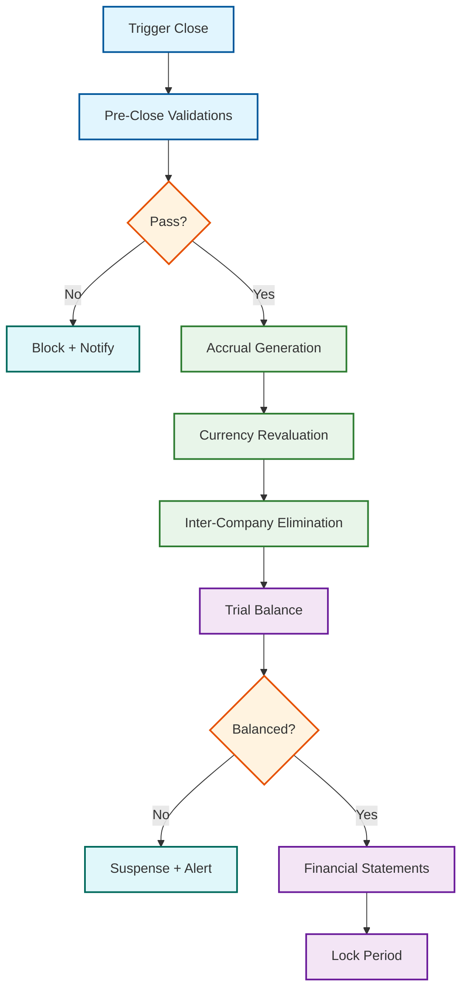
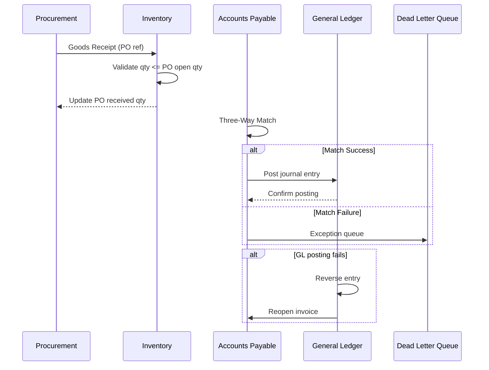
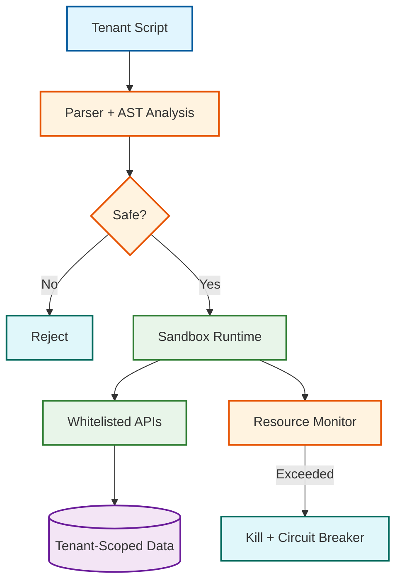

# Deep Dive & Bottlenecks

## 1. Month-End Close --- The ERP's Hardest Batch Problem

Financial close is the single most stressful batch operation in any ERP. During a 4--8 hour window, the system must process thousands of concurrent journal entries, execute inter-company eliminations across dozens of legal entities, revalue foreign-currency balances, generate accruals, and produce a trial balance consistent to the cent. It requires strict serializability---eventual consistency is not acceptable for regulatory reporting.

| Constraint | Typical Scale | Impact |
|-----------|--------------|--------|
| Journal entries per close | 50K--500K | Sustain 2,000+ entries/sec |
| Legal entities | 10--200 | Each runs its own sub-close before consolidation |
| Currency pairs | 30--80 | Every non-functional-currency balance needs revaluation |
| Inter-company transactions | 5K--50K | Must net to zero after elimination |
| Target window | 4--8 hours | CFO expects next-morning reporting readiness |

### Close Pipeline



### Parallelization and Idempotency

```Step-by-step plan in plain English
FUNCTION execute_month_end_close(period, entity_list):
    -- Phase 1: Entity-level parallelism (each entity closes independently)
    close_tasks = []
    FOR EACH entity IN entity_list:
        close_tasks.APPEND(ASYNC execute_entity_close(period, entity))
    entity_results = AWAIT_ALL(close_tasks)

    -- Fail fast on any entity failure
    FOR EACH result IN entity_results:
        IF result.status == FAILED:
            RAISE CloseFailure(result.entity, result.error)

    -- Phase 2: Bottom-up consolidation (parallel within each hierarchy level)
    FOR EACH level IN build_entity_hierarchy(entity_list).bottom_up():
        AWAIT_ALL([ASYNC consolidate(parent, parent.children, period) FOR parent IN level])

    -- Phase 3: Final validation
    trial_balance = compute_trial_balance(root_entity, period)
    ASSERT trial_balance.total_debits == trial_balance.total_credits

FUNCTION execute_entity_close(period, entity):
    checkpoint = load_checkpoint(entity, period)
    -- Resume from last successful stage (idempotent: each stage does DELETE + INSERT)
    IF checkpoint.stage < ACCRUALS:
        generate_accruals(entity, period)
        save_checkpoint(entity, period, ACCRUALS)
    IF checkpoint.stage < REVALUATION:
        revalue_currency_balances(entity, period)
        save_checkpoint(entity, period, REVALUATION)
    IF checkpoint.stage < TRIAL_BALANCE:
        compute_entity_trial_balance(entity, period)
        save_checkpoint(entity, period, TRIAL_BALANCE)
```

Each journal entry carries a **deterministic idempotency key** `HASH(entity_id, period, stage, source_account, currency)`. Restart safety is guaranteed by delete-then-insert within the stage scope. Account-range partitioning (1000--1999 Assets, 2000--2999 Liabilities, etc.) enables parallel trial balance aggregation across workers.

---

## 2. Tenant Data Isolation --- The Noisy Neighbor Problem

### Query-Level Isolation

In shared-schema multi-tenancy, every query must be scoped. A single missed `WHERE tenant_id = ?` leaks data. Defense-in-depth uses both database-enforced row-level security and application-layer predicate injection:

```Step-by-step plan in plain English
POLICY tenant_isolation ON all_tables:
    USING (tenant_id = current_session.tenant_id)
    WITH CHECK (tenant_id = current_session.tenant_id)

FUNCTION setup_connection(tenant_id):
    conn = pool.acquire()
    conn.execute("SET app.current_tenant = ?", tenant_id)
    RETURN conn
```

### Resource and Cache Isolation

| Resource | Isolation Mechanism | Enforcement Point |
|---------|---------------------|-------------------|
| DB connections | Per-tenant pools (large), shared with fair scheduling (small) | Connection proxy |
| CPU | cgroup-based quotas per tenant tier | Container orchestrator |
| I/O bandwidth | Priority classes; premium tenants get higher IOPS ceiling | Block storage |
| Concurrent queries | Max active queries per tenant (50 standard, 200 enterprise) | Admission controller |

Cache keys are namespaced `tenant:{id}:{key}`. Per-tenant memory quotas prevent any single tenant from dominating shared cache---LRU eviction targets the over-quota tenant first.

### Bloom Filter Tenant Routing

For partitioned tables, per-partition Bloom filters answer "does this partition contain data for tenant X?" in O(1), skipping irrelevant partitions entirely:

```Step-by-step plan in plain English
FUNCTION query_with_bloom_routing(tenant_id, query, partitions):
    relevant = [p FOR p IN partitions IF p.bloom_filter.MIGHT_CONTAIN(tenant_id)]
    RETURN execute_query(query, relevant)
```

---

## 3. Custom Field Performance --- EAV's Achilles' Heel

Enterprise customers add custom fields to any entity. The EAV pattern offers flexibility but degrades query performance---filtering on 3 custom fields requires 3 self-joins, each multiplying cost.

| Approach | Write Cost | Read (1 filter) | Read (3 filters) | Index Support |
|----------|-----------|-----------------|-------------------|---------------|
| Classic EAV | 1x | 8--12x | 25--40x | Poor |
| JSON column (no index) | 1.2x | 5--8x | 15--25x | None |
| JSON + GIN index | 1.5x | 1.5--2x | 2--4x | Equality |
| Hybrid wide-table | 2x | 1.1x | 1.3x | Full |
| Materialized view over EAV | 1x + refresh | 1.2x | 1.5x | Full |

### Tiered Storage Strategy

```Step-by-step plan in plain English
FUNCTION resolve_custom_field_storage(tenant_id, entity_type, field_def):
    freq = get_field_query_frequency(tenant_id, entity_type, field_def.name)
    IF freq.queries_per_day > 1000:
        schedule_column_promotion(entity_type, field_def)  -- async DDL
        RETURN TIER_1_PHYSICAL_COLUMN
    ELSE IF freq.queries_per_day > 10:
        RETURN TIER_2_JSON_INDEXED    -- GIN-indexed JSON column
    ELSE:
        RETURN TIER_3_EAV            -- classic flexibility
```

Indexing strategies: **sparse indexes** (only non-null rows), **partial indexes** (scoped to heavy-usage tenant_ids), **expression indexes** (`LOWER(custom_data->>'field')` for case-insensitive search). A nightly job analyzes query patterns and auto-promotes fields across tiers.

---

## 4. Cross-Module Transaction Consistency

### Procure-to-Pay Saga

The P2P flow spans Procurement, Inventory, Accounts Payable, and General Ledger. A saga with compensating transactions replaces distributed transactions:



### Three-Way Match Algorithm

```Step-by-step plan in plain English
FUNCTION three_way_match(po, goods_receipt, invoice):
    tolerances = get_tenant_tolerances()
    exceptions = []
    FOR EACH line IN invoice.lines:
        po_line = find_matching_po_line(po, line.item_id)
        gr_line = find_matching_gr_line(goods_receipt, line.item_id)
        IF gr_line IS NULL:
            exceptions.APPEND(MatchException("NO_GR", line))
            CONTINUE
        IF ABS(gr_line.qty - line.qty) / gr_line.qty > tolerances.qty_pct:
            exceptions.APPEND(MatchException("QTY_MISMATCH", line, gr_line))
        IF ABS(po_line.unit_price - line.unit_price) / po_line.unit_price > tolerances.price_pct:
            exceptions.APPEND(MatchException("PRICE_MISMATCH", line, po_line))
    IF exceptions.IS_EMPTY():
        RETURN MatchResult(MATCHED, auto_approve = TRUE)
    ELSE:
        RETURN MatchResult(FAILED, exceptions)
```

Failed cross-module events land in a **dead letter queue** with exponential backoff retry. After max retries, the event escalates to an exception dashboard and triggers compensating transactions upstream.

---

## 5. Extension Sandbox Security

### Sandbox Architecture



| Resource | Limit | Enforcement |
|---------|-------|-------------|
| CPU time | 500ms per invocation | Wall-clock timer; killed on breach |
| Memory | 64 MB heap | Allocator cap; OOM triggers termination |
| I/O ops | 100 reads, 20 writes | Counted at data access layer |
| Network | Blocked entirely | No outbound calls |
| Loop iterations | 10,000 max | Iteration counter injected at parse time |

The sandbox exposes a **whitelist API surface**---read-heavy by default, write operations require explicit permission grants in the extension manifest. All API calls are audit-logged. A **circuit breaker** trips after N resource-limit violations within a sliding window, disabling the extension until the tenant admin acknowledges and re-enables it.

---

## 6. Multi-Currency at Scale

| Aspect | Real-Time Revaluation | Batch Revaluation |
|--------|----------------------|-------------------|
| Trigger | Every transaction posting | Scheduled (daily/monthly) |
| Performance impact | 2--5ms per transaction | Concentrated batch window |
| Use case | Treasury, FX desks | Standard month-end close |

Most deployments use **batch revaluation** at month-end with real-time spot-rate conversion at transaction time for display only.

### Unrealized Gain/Loss and Triangulation

```Step-by-step plan in plain English
FUNCTION compute_unrealized_gain_loss(entity, period_end_date):
    rates = load_period_end_rates(period_end_date)
    entries = []
    FOR EACH balance IN query_open_balances(entity, period_end_date):
        IF balance.currency == entity.functional_currency: CONTINUE
        restated = balance.amount_original * rates.get_rate(balance.currency, entity.functional_currency)
        delta = restated - balance.amount_functional_currency
        IF ABS(delta) > ROUNDING_THRESHOLD:
            entries.APPEND(JournalEntry(
                amount = ABS(delta), reversing = TRUE,
                idempotency_key = HASH(entity.id, period_end_date, balance.account_id, balance.currency)
            ))
    RETURN entries

FUNCTION get_exchange_rate(source, target, rate_table):
    direct = rate_table.get(source, target)
    IF direct IS NOT NULL: RETURN direct
    -- Triangulate through USD or EUR
    FOR EACH base IN ["USD", "EUR"]:
        r1 = rate_table.get(source, base)
        r2 = rate_table.get(base, target)
        IF r1 IS NOT NULL AND r2 IS NOT NULL: RETURN r1 * r2
    RAISE NoExchangeRateAvailable(source, target)
```

### Jurisdiction-Specific Rounding

| Currency | Decimals | Rounding Rule | Smallest Unit |
|----------|---------|---------------|---------------|
| USD | 2 | Half-up | 0.01 |
| JPY | 0 | Half-up | 1 |
| BHD | 3 | Half-up | 0.001 |
| EUR | 2 | Half-even (banker's) | 0.01 |

Cumulative rounding adjustments are tracked and posted to a dedicated rounding-difference account at period end, keeping the trial balance in perfect equilibrium.

---

## 7. MRP Scheduling --- The Hidden Constraint Satisfaction Problem

Material Requirements Planning appears algorithmic but quickly becomes a constraint satisfaction problem when real-world factory constraints interact.

### Constraint Categories

| Category | Examples | Resolution Strategy |
|----------|----------|-------------------|
| Material availability | Components out of stock, long vendor lead times | Substitute components, expedite POs, split work orders |
| Capacity | Work center overloaded, labor shortage on shift | Overtime scheduling, work center rebalancing, outsourcing |
| Sequencing | Setup-dependent changeovers, batch chemistry constraints | Sequencing heuristics (shortest setup first), campaign batching |
| Regulatory | Lot traceability, shelf-life expiry, hazardous material limits | FEFO allocation, batch splitting, quarantine holds |
| Customer priority | Rush orders, contractual delivery commitments | Priority-based scheduling, capacity reservation |

### Finite Capacity Scheduling

```Step-by-step plan in plain English
FUNCTION schedule_work_orders(work_orders, work_centers, horizon):
    // Sort by priority: customer commitment > stock-out risk > cost efficiency
    sorted_orders = prioritize(work_orders)
    schedule = initialize_schedule(work_centers, horizon)

    FOR EACH wo IN sorted_orders:
        routing = load_routing(wo.product_id)
        // Backward schedule from need date
        target_end = wo.need_date
        FOR EACH step IN REVERSE(routing.steps):
            wc = work_centers[step.work_center_id]
            duration = step.setup_time + (step.run_time_per_unit * wo.quantity)
            slot = schedule.find_available_slot(wc.id, duration, before=target_end)
            IF slot IS NULL:
                // Capacity conflict — try alternatives
                alt_wc = find_alternate_work_center(step, work_centers)
                IF alt_wc IS NOT NULL:
                    slot = schedule.find_available_slot(alt_wc.id, duration, before=target_end)
                IF slot IS NULL:
                    wo.scheduling_exception = "CAPACITY_CONFLICT"
                    wo.earliest_possible = schedule.find_earliest_slot(wc.id, duration)
                    BREAK
            schedule.book_slot(slot, wo.id, step.id)
            target_end = slot.start  // next operation must finish before this one starts

    RETURN { scheduled: count_scheduled(work_orders),
             exceptions: collect_exceptions(work_orders) }
```

### BOM Explosion with Phantom Assemblies

```Step-by-step plan in plain English
FUNCTION explode_bom(product_id, required_qty, tenant_id):
    bom = load_active_bom(product_id, tenant_id)
    materials_needed = []

    FOR EACH line IN bom.lines:
        adjusted_qty = required_qty * line.quantity_per * (1 + line.scrap_pct / 100)

        IF line.supply_type == "phantom":
            // Phantom assemblies are not physically built — explode recursively
            sub_materials = explode_bom(line.component_product_id, adjusted_qty, tenant_id)
            materials_needed.EXTEND(sub_materials)
        ELSE:
            materials_needed.APPEND({
                product_id: line.component_product_id,
                qty_needed: adjusted_qty,
                supply_type: line.supply_type,
                lead_time: get_lead_time(line.component_product_id, line.supply_type)
            })

    RETURN materials_needed
```

---

## 8. Master Data Governance --- The Invisible Coupling Layer

Master data (chart of accounts, organizational hierarchy, business partners, product catalog) underpins every module. A change to a cost center name must propagate to every report that references it. Stale master data causes posting failures, reporting mismatches, and integration errors.

### Change Propagation Strategy

| Master Data Type | Change Frequency | Propagation | Impact of Stale Data |
|-----------------|-----------------|-------------|---------------------|
| Chart of Accounts | Rare (quarterly) | Synchronous within Finance, async to reports | Wrong account postings, misstated financials |
| Org Hierarchy | Occasional (monthly) | Async with cache invalidation | Incorrect access control, wrong cost allocation |
| Business Partners | Frequent (daily) | Event-driven, async to dependent modules | Wrong addresses on POs, payment to stale bank details |
| Product Master | Moderate (weekly) | Sync to Inventory, async to CRM/SCM | Wrong pricing, inventory mismatches |
| Exchange Rates | Daily | Broadcast invalidation, lazy reload | Incorrect FX conversion, misstated values |

### Duplicate Detection for Business Partners

```Step-by-step plan in plain English
FUNCTION detect_duplicate_partner(candidate, tenant_id):
    // Exact match on tax ID (strong signal)
    IF candidate.tax_id IS NOT NULL:
        exact = query_partners(tenant_id, tax_id=candidate.tax_id)
        IF exact IS NOT EMPTY: RETURN { match_type: "exact", confidence: 0.99, matches: exact }

    // Fuzzy match on name + address
    candidates = query_partners_fuzzy(tenant_id, name=candidate.name, limit=20)
    scored = []
    FOR EACH existing IN candidates:
        score = 0
        score += string_similarity(candidate.name, existing.name) * 0.4
        score += string_similarity(candidate.address_line1, existing.address_line1) * 0.2
        score += exact_match(candidate.city, existing.city) * 0.15
        score += exact_match(candidate.country_code, existing.country_code) * 0.1
        score += phone_similarity(candidate.phone, existing.phone) * 0.15
        IF score > 0.75:
            scored.APPEND({ partner: existing, confidence: score })

    IF scored IS NOT EMPTY:
        RETURN { match_type: "fuzzy", matches: sorted(scored, key="confidence", desc=TRUE) }
    RETURN { match_type: "none", matches: [] }
```

---

## 9. Report Generation at Scale --- The OLTP/OLAP Boundary

### The Reporting Slowest part of the process

Large tenants generate reports that scan millions of rows (trial balance across 500K journal entries, inventory valuation across 200 warehouses). Running these on the OLTP database degrades interactive performance.

| Report Type | Row Volume | Acceptable Latency | Query Pattern |
|-------------|-----------|-------------------|---------------|
| Operational (invoice list, PO status) | 100-10K rows | < 2 seconds | Indexed lookups with pagination |
| Financial (trial balance, P&L) | 10K-1M rows | < 10 seconds | Aggregation across accounting periods |
| Analytical (trend analysis, forecasting) | 1M-100M rows | < 30 seconds | Full scans with GROUP BY, window functions |
| Compliance (audit trail, SoD report) | 10M+ rows | < 5 minutes | Time-range scans with complex filters |

### CQRS Reporting Architecture

```Step-by-step plan in plain English
FUNCTION route_report_query(report_def, tenant_id):
    estimated_cost = estimate_query_cost(report_def, tenant_id)

    IF estimated_cost.row_count < 10_000 AND estimated_cost.join_count < 3:
        // Lightweight — run on primary or nearest read replica
        RETURN { target: "primary_or_replica", timeout: 5_SECONDS }

    ELSE IF report_def.data_freshness_tolerance > 60_SECONDS:
        // Analytical — route to OLAP replica with materialized aggregates
        RETURN { target: "olap_replica", timeout: 30_SECONDS }

    ELSE IF estimated_cost.row_count > 1_000_000:
        // Heavy — submit as async batch job
        RETURN { target: "batch_report_worker", timeout: ASYNC }

    ELSE:
        // Medium — run on dedicated reporting read replica
        RETURN { target: "reporting_replica", timeout: 15_SECONDS }

FUNCTION maintain_olap_aggregates(tenant_id):
    // Incrementally refresh materialized views on reporting replica
    last_refresh = get_last_refresh_timestamp(tenant_id)
    new_entries = query_journal_entries(tenant_id, since=last_refresh)

    FOR EACH entry IN new_entries:
        update_period_summary(tenant_id, entry.period_id, entry.account_id,
                              delta_debit=entry.debit_amount, delta_credit=entry.credit_amount)
        update_cost_center_rollup(tenant_id, entry.dimensions.cost_center,
                                   entry.period_id, delta=entry.base_amount)

    set_last_refresh_timestamp(tenant_id, now())
```

### Pre-Computed Financial Cubes

For dashboards displaying revenue by region, expense by department, or cash flow by entity, pre-computed cubes avoid repeated full-table scans:

| Cube | Dimensions | Measures | Refresh |
|------|-----------|----------|---------|
| Revenue | Period, Entity, Region, Product Line | Gross Revenue, Net Revenue, Discounts | Every 15 min |
| Expense | Period, Entity, Department, Cost Center | Budget, Actual, Variance | Every 15 min |
| Cash Flow | Period, Entity, Bank Account, Currency | Inflow, Outflow, Net | Every 5 min |
| Inventory | Warehouse, Product, Lot, Date | Qty On Hand, Qty Reserved, Valuation | Real-time |
| Headcount | Period, Entity, Department, Job Grade | Active, New Hires, Attrition | Daily |
