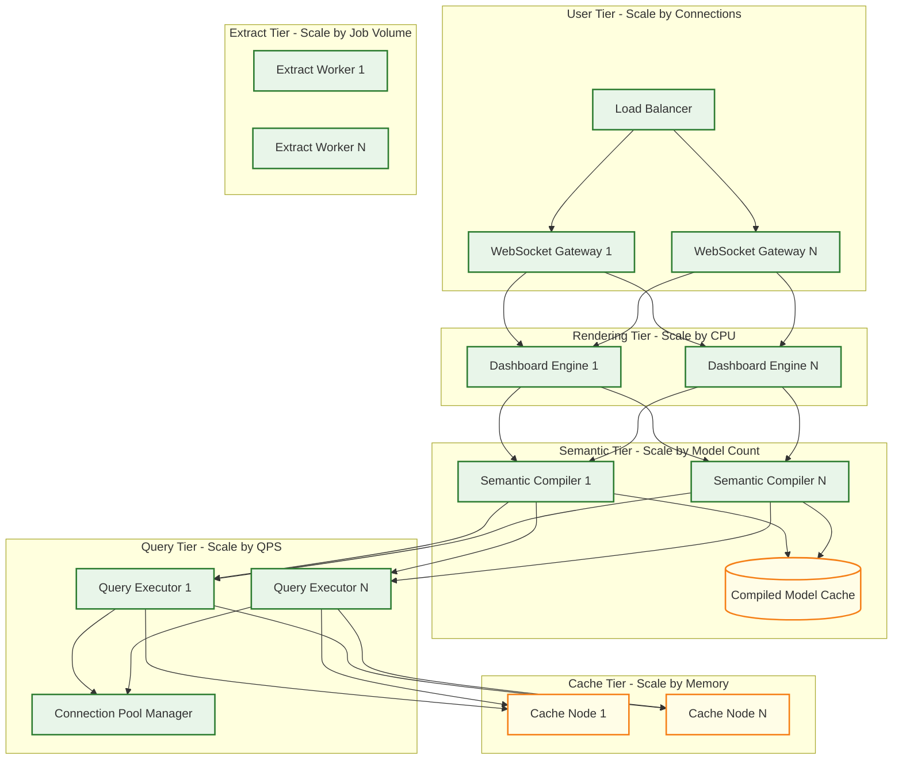
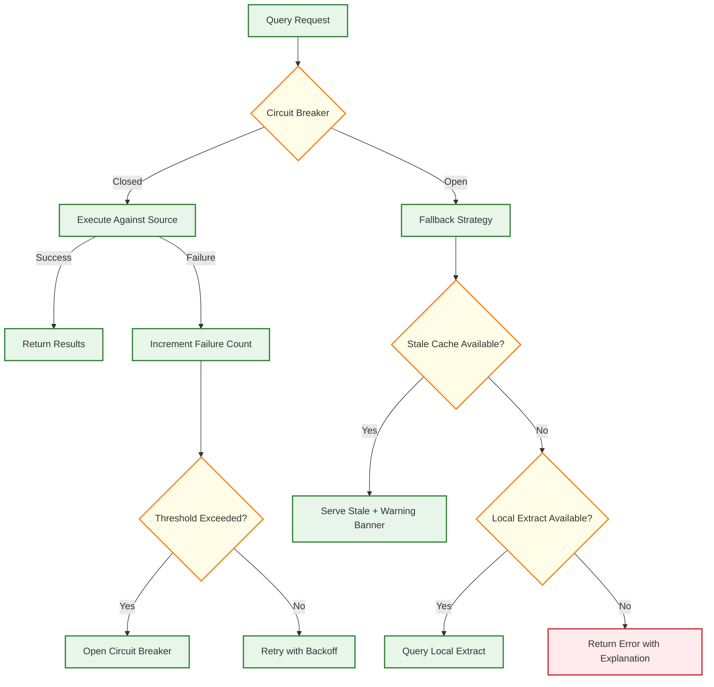
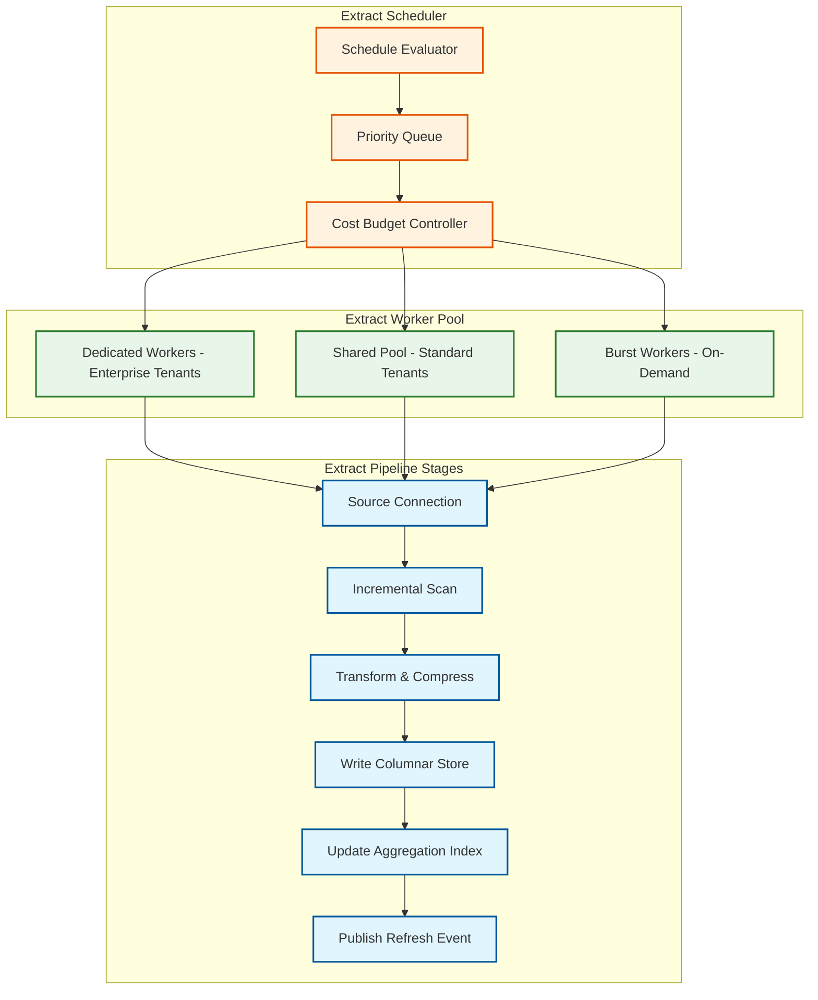

# Business Intelligence Platform --- Scalability & Reliability

## Scaling Dimensions

A BI platform must scale across four independent dimensions: **concurrent users** (dashboard viewers and explorers), **query throughput** (queries per second against diverse data sources), **data volume** (terabytes to petabytes of underlying data), and **tenant count** (thousands of organizations with isolated semantic models and permissions). Each dimension has different bottlenecks and scaling strategies.

---

## Horizontal Scaling Architecture



---

## Scaling Strategy by Component

### 1. Dashboard Rendering Tier

| Factor | Strategy |
|--------|----------|
| **Scaling trigger** | Concurrent session count or rendering latency p95 |
| **Scaling unit** | Stateless rendering pod; each handles ~500 concurrent sessions |
| **State management** | Session state stored in distributed cache; rendering pods are stateless and interchangeable |
| **Optimization** | CDN serves static dashboard shells; rendering tier only handles data binding and interaction events |
| **Slowest part of the process** | CPU-bound chart rendering for complex visualizations (maps, large scatter plots) |
| **Auto-scaling** | Scale based on WebSocket connection count and CPU utilization |

### 2. Semantic Layer Compiler

| Factor | Strategy |
|--------|----------|
| **Scaling trigger** | Compilation latency p95 or unique model count |
| **Scaling unit** | Compiler instance with local model cache; each handles ~1K compilations/sec |
| **State management** | Compiled models cached in distributed cache with model-version-based keys |
| **Optimization** | Incremental compilation: only recompile changed models; cache compiled DAGs |
| **Slowest part of the process** | Large models with hundreds of views and complex join graphs |
| **Sharding** | Shard by tenant to localize model cache hits |

### 3. Query Execution Tier

| Factor | Strategy |
|--------|----------|
| **Scaling trigger** | Query queue depth or connection pool utilization |
| **Scaling unit** | Query executor with managed connection pool; each handles ~200 concurrent queries |
| **State management** | Stateless; connection pools managed per data source with per-tenant limits |
| **Optimization** | Query result deduplication: identical queries from multiple users served from single execution |
| **Slowest part of the process** | Data source connection limits; warehouse query concurrency limits |
| **Backpressure** | Queue with priority (interactive > scheduled > background); reject low-priority queries under overload |

### 4. Cache Tier

| Factor | Strategy |
|--------|----------|
| **Scaling trigger** | Memory utilization or cache hit rate degradation |
| **Scaling unit** | Cache node with consistent hashing for key distribution |
| **Topology** | Distributed cache cluster with virtual nodes for even distribution |
| **Eviction** | LRU within TTL bounds; separate eviction policies per cache tier |
| **Replication** | Single replica for hot keys; no replication for cold data |
| **Sizing** | 100 TB+ total cache capacity across cluster |

### 5. Extract & Pre-Aggregation Tier

| Factor | Strategy |
|--------|----------|
| **Scaling trigger** | Extract job queue depth or schedule backlog |
| **Scaling unit** | Extract worker with dedicated compute; each processes one extract at a time |
| **Parallelism** | Large extracts partitioned by date range or ID range; processed by multiple workers |
| **Priority** | Critical extracts (dashboards with SLAs) get dedicated worker pools |
| **Scaling pattern** | Scale to zero during off-peak; burst to hundreds of workers during scheduled refresh windows |

---

## Query Federation Scaling

### Connection Pool Architecture

```
FUNCTION manage_connection_pool(data_source, tenant):
    // Per-tenant connection limits prevent one tenant from starving others
    tenant_limit = MIN(data_source.max_connections, tenant.connection_quota)
    current_count = pool.active_connections(data_source.id, tenant.id)

    IF current_count >= tenant_limit:
        // Queue the query with timeout
        position = query_queue.enqueue(query, priority = query.source_priority)
        IF position > MAX_QUEUE_DEPTH:
            RETURN ERROR("Query queue full; try again later")
        AWAIT query_queue.wait_for_slot(timeout = 30 seconds)

    connection = pool.acquire(data_source.id, tenant.id)
    TRY:
        result = connection.execute(query)
        RETURN result
    FINALLY:
        pool.release(connection)
        query_queue.signal_slot_available()
```

### Query Deduplication

When multiple users view the same dashboard with the same filters, the system generates identical queries. Rather than executing the same SQL N times, the query executor deduplicates:

```
FUNCTION deduplicated_execute(sql, data_source, rls_context):
    dedup_key = HASH(sql + data_source.id + rls_context)

    // Check if an identical query is already in-flight
    existing = in_flight_queries.get(dedup_key)
    IF existing != NULL:
        // Wait for the existing query to complete and share its result
        metrics.increment("query.deduplicated")
        RETURN AWAIT existing.result_future

    // Register this query as in-flight
    result_future = NEW Future()
    in_flight_queries.put(dedup_key, { result_future, started_at: NOW() })

    TRY:
        result = execute_sql(sql, data_source)
        result_future.complete(result)
        RETURN result
    CATCH error:
        result_future.fail(error)
        THROW error
    FINALLY:
        in_flight_queries.remove(dedup_key)
```

---

## Reliability Architecture

### Failure Modes and Recovery

| Failure | Impact | Detection | Recovery |
|---------|--------|-----------|----------|
| **Query executor crash** | In-flight queries lost | Health check failure; no heartbeat | Retry from dashboard engine; queries are idempotent |
| **Cache node failure** | Cache miss spike; increased source load | Consistent hash ring detects member departure | Redistribute keys to surviving nodes; absorb cache miss load |
| **Data source unreachable** | Queries fail for affected source | Connection timeout; health check probe failure | Serve stale cached results with warning; retry with exponential backoff |
| **Semantic model corruption** | Queries generate incorrect SQL | Compilation validation; integration test failure | Roll back to previous model version; alert model owners |
| **Extract failure** | Stale data in local store | Extract health monitor; staleness alarm | Retry extract; fall back to live connection mode |
| **Metadata DB failure** | Cannot load dashboards, permissions, models | DB health check; replication lag monitor | Failover to read replica; cached metadata serves reads |
| **WebSocket gateway crash** | Users lose real-time dashboard updates | Connection count drop; client reconnection spike | Clients auto-reconnect to healthy gateway; session state in distributed cache |

### Data Source Resilience



### Graceful Degradation Tiers

| Degradation Level | Condition | User Experience |
|-------------------|-----------|-----------------|
| **Normal** | All systems healthy | Full interactivity; fresh data |
| **Tier 1: Stale Data** | Data source slow or extract delayed | Dashboards render with cached data; "data as of X" warning |
| **Tier 2: Reduced Interactivity** | Query executor overloaded | Drill-down and ad-hoc exploration disabled; pre-cached dashboard views only |
| **Tier 3: Static Mode** | Query infrastructure down | Serve last-known dashboard snapshots (PNG/PDF); no interactivity |
| **Tier 4: Maintenance** | Platform-wide outage | Static status page; scheduled report backlog queued for delivery |

---

## Multi-Tenancy Scaling

### Tenant Isolation Model

```
Tenant Tiers:
┌─────────────────────────────────────────────────────────┐
│ TIER 1: Shared Infrastructure (SMB / Free)              │
│ - Shared query executors and cache                      │
│ - Per-tenant query quotas (100 QPS, 10 concurrent)      │
│ - Shared extract workers with fair scheduling            │
│ - Best-effort SLAs                                       │
├─────────────────────────────────────────────────────────┤
│ TIER 2: Enhanced Isolation (Mid-Market)                  │
│ - Dedicated query executor pool (sized per contract)     │
│ - Reserved cache partition                               │
│ - Priority extract scheduling                            │
│ - 99.9% availability SLA                                 │
├─────────────────────────────────────────────────────────┤
│ TIER 3: Dedicated Infrastructure (Enterprise)            │
│ - Dedicated compute cluster per tenant                   │
│ - Isolated network and storage                          │
│ - Custom scaling policies                                │
│ - 99.99% availability SLA with financial penalties       │
│ - Dedicated support and capacity planning                │
└─────────────────────────────────────────────────────────┘
```

### Noisy Neighbor Prevention

| Resource | Isolation Mechanism |
|----------|-------------------|
| Query concurrency | Per-tenant connection pool limits; per-tenant query queue with max depth |
| Cache space | Per-tenant cache quota; evict over-quota tenant entries first |
| Extract workers | Fair-share scheduling; weight by tier; preemption for higher-tier tenants |
| CPU | Per-tenant CPU time accounting; throttle compilations exceeding fair share |
| Network | Rate limiting at API gateway per tenant; bandwidth quotas for extract ingestion |

---

## Disaster Recovery

### RPO / RTO Targets

| Component | RPO | RTO | Strategy |
|-----------|-----|-----|----------|
| Metadata (dashboards, models, permissions) | 0 (zero data loss) | 15 minutes | Synchronous replication; multi-region standby; automated failover |
| Query result cache | N/A (rebuildable) | 30 minutes | Warm standby cache; cold start from re-execution |
| Extracts (columnar store) | 4 hours | 1 hour | Cross-region replication; re-extract from source if needed |
| Pre-aggregation tables | 4 hours | 2 hours | Rebuild from extracts; prioritize high-traffic aggregations |
| Audit logs | 0 | 1 hour | Append-only log with synchronous replication |

### Multi-Region Architecture

```
Primary Region                              Secondary Region
┌──────────────────────┐                    ┌──────────────────────┐
│ API Gateway           │                    │ API Gateway (standby) │
│ Dashboard Engine      │                    │ Dashboard Engine      │
│ Semantic Compiler     │                    │ Semantic Compiler     │
│ Query Executor        │                    │ Query Executor        │
│                       │                    │                       │
│ Metadata DB (primary) │──sync repl──────→  │ Metadata DB (replica) │
│ Cache Cluster         │                    │ Cache Cluster (warm)  │
│ Extract Store         │──async repl─────→  │ Extract Store         │
│ Audit Log Store       │──sync repl──────→  │ Audit Log Store       │
└──────────────────────┘                    └──────────────────────┘
```

**Failover procedure:**
1. Health monitor detects primary region unavailable
2. DNS failover routes traffic to secondary region (TTL: 60s)
3. Secondary metadata DB promoted to primary
4. Extract store serves from replicated data (may be up to 4h stale)
5. Cache cluster starts cold; gradually warms from query execution
6. Scheduled reports resume from last checkpoint

---

## Performance Optimization Summary

| Optimization | Impact | Implementation Complexity |
|-------------|--------|--------------------------|
| Multi-tier query caching | 80% cache hit rate; 10x latency reduction | Medium---consistent hashing, TTL management, invalidation events |
| Pre-aggregation auto-advisor | 5--50x faster queries for common patterns | High---usage analytics, storage budgeting, staleness management |
| Query deduplication | 20--40% query reduction during peak hours | Low---in-flight query registry with shared futures |
| Widget query merging | 30--50% fewer database round-trips per dashboard | Medium---query compatibility analysis, result splitting |
| Progressive dashboard rendering | 50% faster perceived load time | Medium---streaming results, client-side widget lifecycle management |
| Connection pool backpressure | Prevents data source overload; predictable degradation | Low---queue with priority and timeout |
| Compiled model caching | Sub-millisecond model resolution | Low---version-keyed cache entries |
| Stale-while-revalidate | Zero latency degradation during data refresh | Medium---background refresh, freshness tracking |

---

## Extract Pipeline Scaling

### Challenge

Extract refresh is the platform's most resource-intensive batch operation. During peak refresh windows (typically early morning when overnight warehouse loads complete), thousands of tenants trigger extract jobs simultaneously. Without careful scaling, the extract pipeline becomes the Slowest part of the process for data freshness across the entire platform.

### Extract Worker Architecture



### Extract Parallelism Strategies

| Strategy | When to Apply | Mechanism |
|----------|--------------|-----------|
| **Row-range partitioning** | Large tables (>100M rows) with numeric primary key | Divide key range into N chunks; each worker processes one chunk |
| **Date-range partitioning** | Time-series fact tables with incremental refresh | Each worker handles one date partition; only changed partitions extracted |
| **Source-level parallelism** | Tenant with many small data sources | Multiple workers process different sources concurrently |
| **Pipeline parallelism** | High-throughput extract streams | Overlap scan, transform, and write stages across different row batches |

### Extract Failure Recovery

```
FUNCTION recover_failed_extract(job):
    checkpoint = job.last_successful_checkpoint

    IF checkpoint EXISTS:
        // Resume from checkpoint --- avoid re-extracting completed partitions
        remaining_partitions = job.partitions.filter(p => p.offset > checkpoint.offset)
        FOR partition IN remaining_partitions:
            retry_extract_partition(partition, max_retries = 3)
    ELSE:
        // No checkpoint --- restart with exponential backoff
        backoff = MIN(job.attempt_count * 30 seconds, 10 minutes)
        schedule_retry(job, delay = backoff)

    IF job.consecutive_failures >= 3:
        // Fall back to full refresh if incremental state is corrupted
        job.strategy = FULL_REFRESH
        alert_data_team(job, reason = "Incremental extract failed 3x; falling back to full refresh")
```

---

## Connection Pool Sharding Architecture

### The Challenge

A BI platform connecting to 500K+ data sources must manage connection pools carefully. Each data source has its own connection limit, and the platform must prevent one tenant's heavy queries from exhausting connections needed by others.

### Hierarchical Pool Design

```
Connection Pool Hierarchy:
┌─────────────────────────────────────────────────────────────────┐
│ Global Pool Manager                                              │
│ - Tracks total connections across all pools                      │
│ - Enforces platform-wide connection budget                       │
│ - Redistributes idle connections between pools                   │
│                                                                  │
│ ┌──────────────────────────┬──────────────────────────┐          │
│ │ Source Pool: Warehouse-A │ Source Pool: Warehouse-B │ ...      │
│ │ max_connections: 200     │ max_connections: 100     │          │
│ │ active: 145              │ active: 72               │          │
│ │                          │                          │          │
│ │ ┌────────────┬────────┐ │ ┌────────────┬────────┐ │          │
│ │ │ Tenant-1   │ T-2    │ │ │ Tenant-1   │ T-3    │ │          │
│ │ │ quota: 50  │ q: 30  │ │ │ quota: 40  │ q: 20  │ │          │
│ │ │ active: 42 │ a: 18  │ │ │ active: 35 │ a: 12  │ │          │
│ │ └────────────┴────────┘ │ └────────────┴────────┘ │          │
│ └──────────────────────────┴──────────────────────────┘          │
└─────────────────────────────────────────────────────────────────┘
```

### Connection Lifecycle

| Phase | Action | Timeout |
|-------|--------|---------|
| **Acquire** | Request connection from tenant's partition within source pool | 5s (interactive), 30s (background) |
| **Validate** | Test connection liveness before use (ping or lightweight query) | 2s |
| **Execute** | Run the query against the data source | Per-query timeout (30s default, configurable) |
| **Release** | Return connection to pool; reset session state | Immediate |
| **Evict** | Close idle connections exceeding minimum pool size | After 5 min idle |
| **Refresh** | Close long-lived connections to prevent source-side session bloat | After 30 min total age |

---

## Interview Checklist: Scalability & Reliability

| Topic | Strong Answer Includes |
|-------|-----------------------|
| Horizontal scaling | Independent scaling per tier; stateless compute; sharded state |
| Cache failure | Graceful degradation to source queries; no data loss; automatic cache warm-up on recovery |
| Extract scaling | Partition-based parallelism; checkpoint recovery; priority scheduling |
| Connection management | Per-tenant quotas; per-source pools; backpressure queuing |
| Data source resilience | Circuit breaker pattern; stale cache fallback; extract fallback for live connections |
| Multi-region DR | Metadata sync replication; extract async replication; RPO/RTO targets per component |
| Noisy neighbor | Per-tenant resource quotas; fair-share scheduling; throttling at multiple layers |
| Cost management | Per-tenant cost tracking; query cost estimation; budget enforcement at compilation time |
