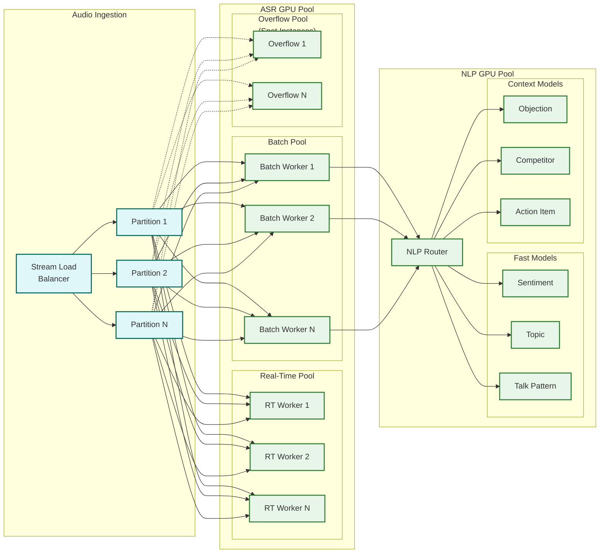

# AI-Native Revenue Intelligence Platform --- Scalability & Reliability

## 1. Scaling Strategy

### 1.1 Audio/Video Processing Pipeline Scaling

The audio processing pipeline is the platform's most demanding scaling challenge: 7M+ hours of audio per day processed through GPU-intensive ASR models with strict latency SLAs.

#### Horizontal Scaling Architecture



#### Scaling Dimensions

| Component | Scaling Trigger | Scale-Up Strategy | Scale-Down Strategy |
|-----------|----------------|-------------------|---------------------|
| Real-time ASR workers | Active live coaching sessions | Pre-scaled for expected peak (business hours); add capacity within 2 min | Reduce to baseline outside business hours |
| Batch ASR workers | Queue depth > 10 min audio backlog | Auto-scale GPU instances; activate spot/preemptible pool | Drain and terminate when queue is empty |
| NLP model workers | Inference queue depth per model | Scale individual model pods independently; hot models get more replicas | Cool models scaled to minimum (1--2 replicas) |
| LLM summarization | Summary queue depth | Scale LLM serving instances; batch multiple transcripts per inference | Maintain minimum warm pool for latency |
| Audio object storage | Storage volume growth (~100 TB/day) | Automatic with object storage; tiered lifecycle policies | Cold storage archival after 30 days |

#### GPU Cost Optimization

| Strategy | Implementation | Savings |
|----------|---------------|---------|
| Time-of-day scaling | Reduce ASR capacity by 70% outside North American/European business hours | 30--40% GPU cost reduction |
| Spot instance batch processing | Use preemptible instances for batch ASR with checkpoint/resume | 60--70% cost per batch GPU-hour |
| Model distillation | Distill large ASR model to smaller student model for common languages | 3--5× throughput per GPU |
| Mixed-precision inference | Run NLP models in FP16 or INT8 quantization | 2× throughput per GPU |
| Inference batching | Batch 32--64 segments per NLP inference call | 40--60% better GPU utilization |
| Result caching | Cache NLP results for identical or near-identical segments | 15--20% fewer inferences |

### 1.2 Revenue Graph Scaling

The revenue graph grows continuously as interactions accumulate. A large enterprise tenant may have 500K+ nodes and 5M+ edges after 2 years.

**Scaling approach**: Tenant-partitioned graph instances with tiered allocation:

| Tenant Tier | Graph Instance | Max Nodes | Query Latency Target |
|-------------|---------------|-----------|---------------------|
| Standard | Shared multi-tenant cluster | 100K | <2s for traversal queries |
| Premium | Dedicated partition on shared cluster | 500K | <1s |
| Enterprise | Dedicated graph instance | Unlimited | <500ms |

**Historical data management**: The graph does not grow unboundedly. Interactions older than 2 years are archived from the hot graph into a cold graph store. Queries spanning archival data execute against the cold store with relaxed latency targets (5--10s).

### 1.3 Search Index Scaling

Transcript search requires indexing 2B new segments daily across 5,000 tenants:

**Sharding strategy**: Per-tenant time-partitioned shards:
- Hot shard: last 3 months of transcripts (fast SSD storage, optimized for low-latency queries)
- Warm shard: 3 months to 2 years (standard storage, acceptable latency)
- Archive: 2+ years (compressed, query-on-demand with higher latency)

**Index management**:
- New segments indexed within 5 minutes of transcript availability
- Daily index optimization (segment merging, deleted document purging)
- Per-tenant index size monitoring with alerts at 80% capacity

### 1.4 Forecast Engine Scaling

Forecast generation is a periodic batch process but must complete within its time window:

| Forecast Type | Frequency | Time Budget | Scaling Approach |
|--------------|-----------|-------------|-----------------|
| Hourly refresh | Every hour | <30 min | Parallel per-tenant; tenants distributed across worker pool |
| On-demand recalculation | User-triggered | <5 min | Priority queue with dedicated compute |
| Quarterly model retraining | Weekly | <4 hours | Offline batch on dedicated GPU cluster |
| Monte Carlo simulation | Per forecast | <2 min | Vectorized computation; sample in parallel |

### 1.5 CRM Sync Scaling

CRM sync is constrained by external API rate limits rather than internal compute:

**Per-tenant sync orchestrator**:
1. Maintains a per-tenant rate limit budget (tracked in distributed cache)
2. Prioritizes writes: deal scores > activity logs > coaching notes
3. Batches low-priority writes into bulk API calls where supported
4. Monitors API error rates and backs off exponentially on rate limit responses
5. Falls back to queued delivery with eventual consistency guarantee

---

## 2. Fault Tolerance

### 2.1 Call Recording Durability

Call recordings are the most critical data asset---once a call happens, it cannot be re-recorded. The system must guarantee no recording loss even during infrastructure failures.

**Durability strategy**:
1. **Dual-write at capture**: Audio streams are written to two independent storage paths simultaneously (primary region + secondary region)
2. **Write-ahead confirmation**: The telephony hub does not release the audio buffer until at least one storage path confirms successful write
3. **Integrity verification**: Each audio chunk includes a checksum; storage layer verifies integrity on write and periodic scrubbing
4. **Retention enforcement**: Storage lifecycle policies are append-only (can transition hot → warm → cold but cannot delete before retention period)

### 2.2 Processing Pipeline Fault Tolerance

| Failure Type | Detection | Recovery | Data Impact |
|-------------|-----------|----------|-------------|
| ASR worker crash | Health check failure (10s interval) | Pod restart; audio reprocessed from object storage | None---audio persisted before processing |
| NLP model OOM | Container memory limit breach | Pod restart with increased memory; segment batch size reduced | Partial results lost; full re-analysis from transcript |
| LLM timeout | 60-second timeout per request | Retry with exponential backoff (max 3 retries); fallback to extractive summary | Delayed summary; deal score updates proceed without summary |
| Event stream partition failure | Consumer lag spike | Consumer rebalance to healthy partitions | Processing delay for affected partition; no data loss |
| Graph database node failure | Replication lag alert | Automatic failover to replica; read traffic rerouted | Read-after-write consistency may be violated for ~30s |
| Forecast model NaN output | Output validation check | Fallback to previous valid forecast; alert ML team | Stale forecast for affected segment until fix |

### 2.3 Circuit Breaker Patterns

Each external integration has a circuit breaker to prevent cascade failures:

| Integration | Circuit Breaker Threshold | Open State Behavior | Half-Open Probe |
|------------|--------------------------|--------------------|----|
| CRM API | 50% error rate in 1-minute window | Queue outbound writes; serve cached CRM data | 1 request every 30s |
| Telephony platform | 30% connection failure rate | Alert ops; attempt alternative audio capture path | 1 connection every 15s |
| LLM service | 5 consecutive timeouts | Use cached summaries; skip summarization for new calls | 1 request every 60s |
| Email connector | 40% error rate | Queue email processing; flag affected deals as "partial data" | 1 request every 30s |

### 2.4 Data Reconciliation

Given the distributed, eventually-consistent nature of the system, data can drift between stores. A daily reconciliation job verifies consistency:

| Check | Source of Truth | Verification |
|-------|----------------|-------------|
| All recorded calls have transcripts | Object storage manifest | Cross-reference with transcript store; re-queue missing transcripts |
| All transcripts have NLP annotations | Transcript store | Cross-reference with annotation store; re-queue unanalyzed transcripts |
| Deal scores reflect latest signals | Signal event log | Replay recent signals through scorer; compare with stored scores |
| CRM writeback completeness | Outbound sync log | Cross-reference with CRM read; re-queue failed writes |
| Graph consistency | Event log | Verify graph edges match interaction records; repair orphaned nodes |

---

## 3. Disaster Recovery

### 3.1 Architecture for DR

| Component | DR Strategy | RTO | RPO |
|-----------|------------|-----|-----|
| Audio recordings | Cross-region replication (active-active write) | 0 (already replicated) | 0 |
| Transcripts & annotations | Cross-region async replication | <15 min | <5 min |
| Revenue graph | Cross-region async replication with point-in-time recovery | <30 min | <15 min |
| Time-series (scores, forecasts) | Cross-region async replication | <15 min | <5 min |
| Search index | Rebuilt from transcript store in DR region | <2 hours | <1 hour (rebuild lag) |
| Event streams | Cross-region replication with offset synchronization | <5 min | <1 min |
| Model artifacts | Versioned in object storage, replicated cross-region | <30 min | 0 (immutable artifacts) |

### 3.2 Failover Procedure

1. **Detection**: Automated health monitoring detects region-level failure (>5 min of complete service unavailability)
2. **Decision**: On-call engineer confirms failover decision (automated failover for >15 min outage)
3. **DNS cutover**: API endpoints rerouted to DR region via DNS update (TTL: 60s)
4. **Stream consumer restart**: Event stream consumers in DR region activated; begin processing from last committed offset
5. **Reconciliation**: After failover, reconciliation job identifies any data gaps between regions
6. **Failback**: When primary region recovers, reverse replication catches up; DNS switched back during maintenance window

### 3.3 Regional Deployment for Data Residency

Some tenants require data to remain in specific geographic regions (EU, US, APAC). The platform supports region-pinned tenants:

| Region | Data Stored | Processing | Cross-Region Allowed |
|--------|------------|------------|---------------------|
| EU (Frankfurt) | Audio, transcripts, graph, scores | ASR, NLP, scoring | No---all processing in-region |
| US (Virginia) | Audio, transcripts, graph, scores | ASR, NLP, scoring | No for EU tenants; US tenants process here |
| APAC (Singapore) | Audio, transcripts, graph, scores | ASR, NLP, scoring | No for APAC tenants |
| Global model training | Anonymized, aggregated features only | Model training | Aggregated features from all regions |

---

## 4. Reliability Patterns

### 4.1 Graceful Degradation Hierarchy

When system capacity is constrained, features degrade in a defined priority order:

| Priority | Feature | Degradation Mode |
|----------|---------|-----------------|
| P0 (never degrade) | Call recording capture | None---recording must always succeed |
| P1 | Batch transcription | Extend SLA from 5 min to 30 min |
| P2 | Deal score updates | Defer to next batch cycle (hourly) |
| P3 | Real-time coaching overlays | Disable live coaching; mark calls for post-call analysis |
| P4 | LLM summarization | Skip summaries; provide annotation-based highlights instead |
| P5 | Win/loss analysis refresh | Defer to daily batch |
| P6 | AI roleplay service | Temporarily unavailable with user notification |

### 4.2 Idempotent Processing Guarantees

Every processing stage is designed for at-least-once delivery with idempotent handlers:

| Stage | Idempotency Key | Duplicate Detection |
|-------|----------------|---------------------|
| Audio ingestion | interaction_id + chunk_sequence | Object storage conditional write (if not exists) |
| Transcription | interaction_id + asr_model_version | Transcript exists check before processing |
| NLP analysis | transcript_id + model_version | Annotation exists check; upsert semantics |
| Deal scoring | opportunity_id + signal_set_hash | Score event deduplication by hash |
| CRM writeback | crm_object_id + field + value_hash | CRM API idempotency keys where supported |

### 4.3 Load Shedding

Under extreme load, the system sheds work to protect core functionality:

**Shedding order** (least to most impactful):
1. Reject new AI roleplay sessions
2. Defer win/loss analysis to off-peak
3. Rate-limit dashboard API calls (serve cached data)
4. Skip LLM summarization (annotations-only mode)
5. Extend NLP analysis SLA (queue depth management)
6. Disable real-time coaching overlays
7. (Never) Reject call recordings

### 4.4 Chaos Engineering

The platform runs periodic chaos experiments to validate fault tolerance:

| Experiment | Frequency | Validation Target |
|-----------|-----------|-------------------|
| Kill random ASR worker pods | Weekly | Audio reprocessing succeeds; no transcript loss |
| Inject CRM API latency (5× normal) | Bi-weekly | CRM sync degrades gracefully; no cascade to other services |
| Simulate event stream partition failure | Monthly | Consumers rebalance; processing recovers within 5 min |
| Simulate full region failure | Quarterly | DR failover completes within RTO; data loss within RPO |
| Inject NLP model errors (random 500s) | Weekly | Circuit breaker activates; other models continue; backfill succeeds |

---

## 5. Data Lifecycle Management

### Audio Storage Tiering

Audio recordings represent the largest storage cost. A tiered lifecycle policy optimizes costs while maintaining accessibility:

```
Step-by-step plan in plain English: Audio Storage Lifecycle

FUNCTION apply_lifecycle_policy(recording):
    age_days = days_since(recording.created_at)
    tenant_policy = get_tenant_retention_policy(recording.tenant_id)

    IF age_days <= 7:
        // Hot tier: original quality, fast access
        tier = "hot"
        storage_class = "standard_ssd"
        access_latency = "<100ms"

    ELSE IF age_days <= 90:
        // Warm tier: compressed, moderate access
        tier = "warm"
        IF recording.storage_class != "compressed":
            compress_audio(recording, codec="opus", bitrate="48kbps")
        storage_class = "standard_hdd"
        access_latency = "<1s"

    ELSE IF age_days <= tenant_policy.retention_days:
        // Cold tier: heavily compressed, slow access
        tier = "cold"
        IF recording.storage_class != "archive_compressed":
            compress_audio(recording, codec="opus", bitrate="24kbps")
        storage_class = "archive"
        access_latency = "<30s (retrieval required)"

    ELSE:
        // Expired: delete unless legal hold
        IF NOT has_legal_hold(recording):
            schedule_deletion(recording)

    update_storage_tier(recording, tier, storage_class)
```

### Cost Impact of Tiering

| Tier | % of Recordings | Storage Cost (per TB/month) | Total Monthly Cost |
|------|----------------|---------------------------|-------------------|
| Hot (0-7 days) | 2.3% | $80 | ~$190K |
| Warm (7-90 days) | 28.8% | $20 | ~$600K |
| Cold (90+ days) | 68.9% | $3 | ~$210K |
| **Total** | 100% | — | **~$1M** |
| **Without tiering** | 100% at hot | $80 | **~$8M** |

### Transcript and Annotation Lifecycle

| Age | Treatment | Rationale |
|-----|-----------|-----------|
| 0-6 months | Full text + embeddings + all annotations in hot search index | Active analysis and search |
| 6-24 months | Aggregate signals retained; raw text in warm search | Historical trend analysis; occasional deep dive |
| 24+ months | Anonymized aggregates only; raw text purged per policy | Compliance; model training on aggregate features |

---

## 6. Multi-Tenant Resource Isolation

### Compute Isolation

| Resource | Isolation Strategy | Trade-off |
|----------|--------------------|-----------|
| ASR GPU pool | Shared pool with per-tenant quotas; enterprise tenants get reserved capacity | Cost-efficient but requires careful quota management |
| NLP inference | Shared pool; per-tenant priority queuing | Noisy neighbor risk mitigated by per-tenant rate limits |
| Deal scoring | Per-tenant scoring workers; elastic scaling per tenant | Higher cost but prevents cross-tenant latency impact |
| Forecast engine | Batch scheduled with tenant round-robin | Fair scheduling; large tenants may experience longer waits |
| Search index | Per-tenant index partitions on shared cluster | Logical isolation; physical co-location for cost |

### Tenant-Aware Autoscaling

```
Step-by-step plan in plain English: Tenant-Aware ASR Pool Scaling

FUNCTION evaluate_asr_scaling():
    // Check global GPU utilization
    global_util = get_metric("asr.gpu.utilization")

    // Check per-tenant queue depth
    tenant_queues = get_per_tenant_queue_depths("asr_queue")

    // Scale for global demand
    IF global_util > 85%:
        scale_up_asr_pool(by=20%)

    // Check for noisy tenants
    avg_queue = mean(tenant_queues.values())
    FOR tenant_id, depth IN tenant_queues:
        IF depth > 10 * avg_queue AND tenant_id NOT IN dedicated_tenants:
            // This tenant is consuming disproportionate ASR capacity
            throttle_tenant_asr(tenant_id, max_concurrent=get_plan_limit(tenant_id))
            alert_tenant_admin(tenant_id, "ASR queue depth elevated; consider upgrading plan")

    // Pre-scale for business hours
    next_hour_forecast = predict_call_volume(lookahead_hours=1)
    IF next_hour_forecast > current_capacity * 0.8:
        scale_up_asr_pool(to=next_hour_forecast * 1.2)
```

---

## 7. Backup and Recovery Strategy

| Data | Backup Frequency | Method | Recovery Target |
|------|-----------------|--------|-----------------|
| Audio recordings | Continuous dual-write | Cross-region replication | RPO: 0 |
| Transcripts | Continuous replication | Async cross-region | RPO: <5 min |
| Revenue graph | Every 6 hours + continuous WAL | Point-in-time recovery | RPO: <15 min |
| Time-series scores | Continuous replication | Cross-region async | RPO: <5 min |
| Model artifacts | On publish | Versioned object storage | RPO: 0 (immutable) |
| Tenant configuration | On change | Versioned config store | RPO: 0 |
| Search index | Rebuilt from source | Not backed up directly | Rebuild time: <2 hours |

### Recovery Validation

After any recovery event, the system runs an automated validation suite:

1. **Audio integrity**: Verify checksum of recovered recordings matches originals
2. **Transcript completeness**: All recordings have corresponding transcripts (re-queue missing)
3. **Score consistency**: Deal scores match replayed signal log (detect any drift during recovery)
4. **Graph integrity**: Node and edge counts match expected from event log
5. **CRM sync state**: Compare CRM field values with platform scores; re-sync any drift

## AI Release Ladder

Every AI model or capability change in this system MUST follow this rollout sequence:

| Stage | Description | Gate Criteria |
|-------|-------------|---------------|
| 1. Offline Evaluation | Benchmark against historical ground truth | Meets baseline metrics |
| 2. Shadow Mode | Run in parallel with production, compare outputs | No regression on key metrics |
| 3. Canary (Blast-Radius Capped) | 1-5% traffic, human review of all outputs | Error rate < threshold |
| 4. Human-Reviewed Production | AI recommends, human approves all actions | Approval rate > 90% |
| 5. Limited Autonomous Production | AI acts within pre-approved boundaries | Continuous monitoring, no alerts |
| 6. Instant Rollback | One-click revert to previous model/rules | < 5 min rollback time |

**Note:** Model updates affecting core business recommendations (predictions, classifications, rankings) must reach Stage 4 (human-reviewed production) before any customer-impacting deployment. Stage 5 limited autonomy applies only to low-risk, well-bounded recommendation categories with established rollback procedures.
