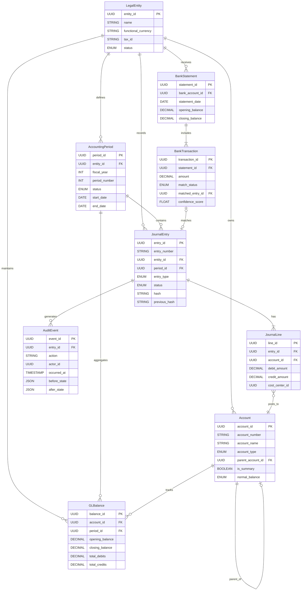
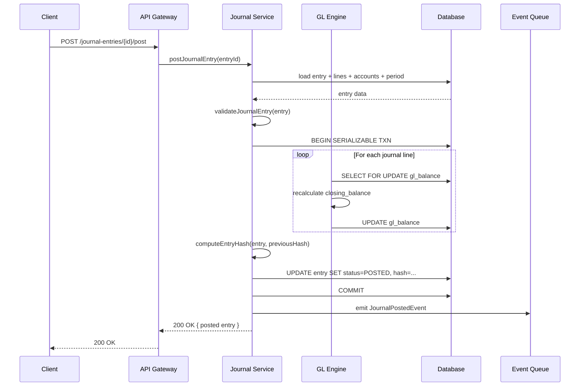
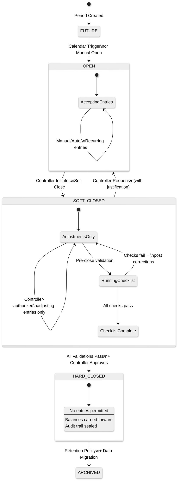

# Low-Level Design

## 1. Data Models

### Entity Relationship Diagram



### Key Entity Details

```
JournalEntry   { entry_id UUID PK, entry_number STRING (auto-sequential per period),
                 entity_id UUID FK, period_id UUID FK, entry_date DATE, effective_date DATE,
                 entry_type ENUM(MANUAL|AUTOMATED|RECURRING|REVERSING|CLOSING|ADJUSTMENT),
                 source_system STRING, description TEXT, currency_code STRING(ISO 4217),
                 exchange_rate DECIMAL(18,8), status ENUM(DRAFT|PENDING_APPROVAL|APPROVED|POSTED|REVERSED),
                 created_by UUID FK, approved_by UUID FK, posted_at TIMESTAMP,
                 hash STRING(SHA-256), previous_hash STRING, reversal_of UUID FK }
  INDEX: (entity_id, period_id, status), (entity_id, entry_number) UNIQUE, (hash) UNIQUE
  PARTITION: range by entity_id + period_id

JournalLine    { line_id UUID PK, entry_id UUID FK, line_number INT, account_id UUID FK,
                 department_id UUID FK, cost_center_id UUID FK, project_id UUID FK,
                 debit_amount DECIMAL(18,4), credit_amount DECIMAL(18,4),
                 source_debit DECIMAL(18,4), source_credit DECIMAL(18,4),
                 description TEXT, tax_code STRING, intercompany_entity_id UUID FK }
  INDEX: (entry_id, line_number) UNIQUE, (account_id, entry_id), (intercompany_entity_id) WHERE NOT NULL
  CHECK: (debit_amount >= 0 AND credit_amount >= 0), (debit_amount = 0 OR credit_amount = 0)

Account        { account_id UUID PK, account_number STRING (e.g., "1100.10.001"),
                 account_name STRING, account_type ENUM(ASSET|LIABILITY|EQUITY|REVENUE|EXPENSE),
                 account_subtype STRING, parent_account_id UUID FK (nullable),
                 level INT, is_summary BOOLEAN, is_active BOOLEAN, normal_balance ENUM(DEBIT|CREDIT),
                 currency_code STRING (nullable), entity_id UUID FK, tags JSONB }
  INDEX: (entity_id, account_number) UNIQUE, (entity_id, account_type, is_active), (parent_account_id)

GLBalance      { balance_id UUID PK, account_id UUID FK, entity_id UUID FK, period_id UUID FK,
                 currency_code STRING, opening_balance DECIMAL(18,4), total_debits DECIMAL(18,4),
                 total_credits DECIMAL(18,4), closing_balance DECIMAL(18,4), last_updated TIMESTAMP }
  INDEX: (account_id, period_id, entity_id, currency_code) UNIQUE, (entity_id, period_id)

BankStatement  { statement_id UUID PK, bank_account_id UUID FK, entity_id UUID FK,
                 statement_date DATE, opening_balance DECIMAL(18,4), closing_balance DECIMAL(18,4),
                 import_format ENUM(CSV|OFX|MT940|ISO20022), imported_at TIMESTAMP }
  INDEX: (bank_account_id, statement_date) UNIQUE

BankTransaction { transaction_id UUID PK, statement_id UUID FK, date DATE, value_date DATE,
                  description TEXT, amount DECIMAL(18,4), type ENUM(DEBIT|CREDIT), reference STRING,
                  match_status ENUM(UNMATCHED|AUTO_MATCHED|MANUAL_MATCHED|EXCEPTION),
                  matched_entry_id UUID FK, confidence_score FLOAT, matched_at TIMESTAMP }
  INDEX: (statement_id, match_status), (date, amount)

AccountingPeriod { period_id UUID PK, entity_id UUID FK, fiscal_year INT, period_number INT(1-13),
                   period_name STRING, start_date DATE, end_date DATE,
                   status ENUM(FUTURE|OPEN|SOFT_CLOSED|HARD_CLOSED|ARCHIVED), closed_by UUID FK }
  INDEX: (entity_id, fiscal_year, period_number) UNIQUE, (entity_id, status)
  TRANSITIONS: FUTURE->OPEN->SOFT_CLOSED->HARD_CLOSED->ARCHIVED; SOFT_CLOSED->OPEN (reopen)
```

---

## 2. API Design

### Journal Entry APIs

```
POST /api/v1/journal-entries
  Body: { entity_id, period_id, entry_date, entry_type, currency_code, exchange_rate,
          lines: [{ account_id, debit_amount, credit_amount, cost_center_id, ... }] }
  Response 201: { entry_id, entry_number, status: "DRAFT" }

GET  /api/v1/journal-entries/{id}     -- full entry with lines, hash chain info
POST /api/v1/journal-entries/{id}/approve   Body: { approver_id, comments }
POST /api/v1/journal-entries/{id}/post      -- updates GLBalance, computes hash, emits event
POST /api/v1/journal-entries/{id}/reverse   Body: { reversal_date, period_id, reason }
GET  /api/v1/trial-balance?entity_id=&period_id=&as_of_date=
```

### Reconciliation APIs

```
POST /api/v1/reconciliation/import-statement   Body: multipart { bank_account_id, file }
POST /api/v1/reconciliation/auto-match         Body: { statement_id }
POST /api/v1/reconciliation/manual-match       Body: { transaction_id, entry_id, notes }
GET  /api/v1/reconciliation/exceptions?statement_id=&date_range=
```

### Reporting & Period APIs

```
GET  /api/v1/reports/balance-sheet?entity_id=&as_of_date=&comparative_date=
GET  /api/v1/reports/income-statement?entity_id=&period_id=&from_date=&to_date=
GET  /api/v1/reports/cash-flow?entity_id=&period_id=&method=DIRECT|INDIRECT
POST /api/v1/periods/{id}/close    Body: { close_type: "SOFT"|"HARD" }
POST /api/v1/periods/{id}/reopen   Body: { reason }  -- only from SOFT_CLOSED
```

---

## 3. Core Algorithms

### Double-Entry Validation

```
FUNCTION validateJournalEntry(entry):
    errors = []
    totalDebits  = SUM(line.debit_amount FOR line IN entry.lines)
    totalCredits = SUM(line.credit_amount FOR line IN entry.lines)

    IF totalDebits != totalCredits:
        errors.APPEND("Debits must equal credits: " + totalDebits + " vs " + totalCredits)
    IF totalDebits == 0:
        errors.APPEND("Entry total cannot be zero")
    IF COUNT(line WHERE debit > 0) == 0 OR COUNT(line WHERE credit > 0) == 0:
        errors.APPEND("Must have at least one debit and one credit line")

    FOR EACH line IN entry.lines:
        account = lookupAccount(line.account_id)
        IF account.is_summary: errors.APPEND("Cannot post to summary account")
        IF NOT account.is_active: errors.APPEND("Account inactive: " + account.account_number)
        IF account.currency_code != NULL AND account.currency_code != entry.currency_code:
            errors.APPEND("Currency mismatch on " + account.account_number)
        IF account.entity_id != entry.entity_id AND line.intercompany_entity_id IS NULL:
            errors.APPEND("Cross-entity posting requires intercompany flag")

    period = lookupPeriod(entry.period_id)
    IF period.status NOT IN [OPEN, SOFT_CLOSED]: errors.APPEND("Period closed for posting")
    IF entry.entry_date < period.start_date OR entry.entry_date > period.end_date:
        errors.APPEND("Entry date outside period boundaries")

    IF entry.currency_code != entity.functional_currency AND (entry.exchange_rate IS NULL OR <= 0):
        errors.APPEND("Exchange rate required for foreign currency entries")

    IF errors NOT EMPTY: RAISE ValidationException(errors)
    RETURN VALID
```

### GL Posting Algorithm

```
FUNCTION postJournalEntry(entry):
    validateJournalEntry(entry)
    IF entry.status != APPROVED: RAISE StateError("Must be APPROVED before posting")

    idempotencyKey = "post:" + entry.entry_id
    IF NOT acquireIdempotencyLock(idempotencyKey, ttl=300s):
        RAISE ConflictError("Posting already in progress")

    BEGIN TRANSACTION (isolation=SERIALIZABLE)
    TRY:
        entry.entry_number = generateSequentialNumber(entry.entity_id, entry.period_id)

        FOR EACH line IN entry.lines:
            balance = getOrCreateBalance(line.account_id, entry.period_id, entry.entity_id)
            ACQUIRE ROW LOCK(balance.balance_id)    -- prevents concurrent balance corruption

            balance.total_debits  += line.debit_amount
            balance.total_credits += line.credit_amount
            account = lookupAccount(line.account_id)

            IF account.normal_balance == DEBIT:
                balance.closing_balance = balance.opening_balance + balance.total_debits - balance.total_credits
            ELSE:
                balance.closing_balance = balance.opening_balance + balance.total_credits - balance.total_debits

            balance.last_posted_entry_id = entry.entry_id
            balance.last_updated = NOW()
            SAVE(balance)

        -- Compute cryptographic hash for audit chain
        previousEntry = getLastPostedEntry(entry.entity_id)
        previousHash = previousEntry.hash IF previousEntry ELSE "GENESIS"
        entry.hash = computeEntryHash(entry, previousHash)
        entry.previous_hash = previousHash
        entry.status = POSTED
        entry.posted_at = NOW()
        SAVE(entry)
        COMMIT

    CATCH exception:
        ROLLBACK
        releaseIdempotencyLock(idempotencyKey)
        RAISE exception

    -- Post-commit async (outside transaction)
    emitEvent(JournalPostedEvent(entry))
    invalidateTrialBalanceCache(entry.entity_id, entry.period_id)
    releaseIdempotencyLock(idempotencyKey)
```

### Bank Reconciliation Auto-Match

```
FUNCTION autoMatchTransactions(statementId):
    statement = loadStatement(statementId)
    bankTxns = statement.transactions.FILTER(status == UNMATCHED)
    glEntries = loadUnreconciledGLEntries(statement.bank_account_id, statement.date_range + 7d)
    matches = []
    usedGL = SET()

    -- Phase 1: Exact match on reference + amount + date
    FOR EACH bt IN bankTxns:
        exact = glEntries.FIND(e -> e.reference == bt.reference AND e.amount == bt.amount
                               AND e.date == bt.date AND e.id NOT IN usedGL)
        IF exact: matches.APPEND(Match(bt, exact, 1.0, "EXACT")); usedGL.ADD(exact.id); CONTINUE

    -- Phase 2: Fuzzy weighted scoring
    FOR EACH bt IN bankTxns.FILTER(NOT matched):
        candidates = glEntries.FILTER(e -> ABS(e.amount - bt.amount) <= bt.amount * 0.01
                                       AND ABS(daysBetween(e.date, bt.date)) <= 5
                                       AND e.id NOT IN usedGL)
        bestScore, bestCandidate = 0, NULL
        FOR EACH c IN candidates:
            amtScore  = 1.0 - ABS(c.amount - bt.amount) / bt.amount     -- weight 35%
            dateScore = 1.0 - ABS(daysBetween(c.date, bt.date)) / 5     -- weight 25%
            descScore = levenshteinSimilarity(c.description, bt.description)  -- weight 25%
            refScore  = jaccardSimilarity(c.reference, bt.reference)     -- weight 15%
            total = amtScore*0.35 + dateScore*0.25 + descScore*0.25 + refScore*0.15
            IF total > bestScore: bestScore, bestCandidate = total, c

        IF bestScore > 0.85: matches.APPEND(Match(bt, bestCandidate, bestScore, "FUZZY"))
            usedGL.ADD(bestCandidate.id); CONTINUE

    -- Phase 3: One-to-many (single bank txn to multiple GL entries)
    FOR EACH bt IN bankTxns.FILTER(NOT matched):
        combo = findSubsetSum(glEntries.FILTER(NOT IN usedGL), bt.amount, tolerance=0.01)
        IF combo: matches.APPEND(MultiMatch(bt, combo, 0.80, "AGGREGATE"))
            FOR e IN combo: usedGL.ADD(e.id)

    RETURN ReconciliationResult(matches, unmatched=bankTxns.FILTER(NOT matched),
                                match_rate=LEN(matches)/LEN(bankTxns))
```

### Cryptographic Hash Chain for Audit Trail

```
FUNCTION computeEntryHash(entry, previousHash):
    payload = canonicalSerialize(
        entry.entry_id, entry.entry_number, entry.entity_id, entry.entry_date,
        sortedLines(entry.lines),  -- sort by line_number for determinism
        entry.posted_at, previousHash
    )
    RETURN SHA256(payload)

FUNCTION verifyAuditChain(entityId, fromPeriod, toPeriod):
    entries = loadPostedEntries(entityId, fromPeriod, toPeriod, ORDER BY posted_at)
    FOR i IN RANGE(1, LEN(entries)):
        expected = computeEntryHash(entries[i], entries[i-1].hash)
        IF expected != entries[i].hash:
            RETURN ChainResult(valid=FALSE, broken_at=entries[i].entry_id, reason="Hash mismatch")
        IF entries[i].previous_hash != entries[i-1].hash:
            RETURN ChainResult(valid=FALSE, broken_at=entries[i].entry_id, reason="Pointer broken")
    RETURN ChainResult(valid=TRUE, checked=LEN(entries))
```

### Multi-Currency Revaluation

```
FUNCTION runRevaluation(entityId, periodId, revaluationDate):
    entity = loadEntity(entityId)
    monetaryAccounts = getMonetaryAccounts(entityId)  -- AP, AR, bank, loans
    currentRates = fetchExchangeRates(revaluationDate)
    revaluationEntries = []

    FOR EACH account IN monetaryAccounts:
        FOR EACH balance IN getBalancesByForeignCurrency(account.account_id, periodId):
            IF balance.currency_code == entity.functional_currency: CONTINUE
            rate = currentRates.getRate(balance.currency_code, entity.functional_currency)
            IF rate IS NULL: logWarning("No rate for " + balance.currency_code); CONTINUE

            revaluedAmount = balance.source_balance * rate
            unrealizedGL = revaluedAmount - balance.closing_balance
            IF ABS(unrealizedGL) <= MATERIALITY_THRESHOLD: CONTINUE

            gainLossAccount = getUnrealizedGainLossAccount(entityId)
            IF unrealizedGL > 0:
                debitAcct, creditAcct = account.account_id, gainLossAccount
            ELSE:
                debitAcct, creditAcct = gainLossAccount, account.account_id

            entry = buildJournalEntry(entity_id=entityId, period_id=periodId,
                entry_type=ADJUSTMENT, source_system="revaluation-engine",
                lines=[Line(debitAcct, debit=ABS(unrealizedGL)), Line(creditAcct, credit=ABS(unrealizedGL))])
            entry.status = APPROVED
            postJournalEntry(entry)
            revaluationEntries.APPEND(entry)

    RETURN RevaluationResult(entries=LEN(revaluationEntries), total_gain_loss=SUM(unrealizedGL))
```

---

## 4. Journal Entry Posting Flow



---

## 5. Key Design Considerations

### Concurrency Control

| Resource | Lock Type | Scope | Rationale |
|----------|-----------|-------|-----------|
| GLBalance row | SELECT FOR UPDATE | Per account-period | Prevents lost updates from concurrent postings |
| Entry number | Advisory lock | Per entity+period | Gap-free sequential numbering |
| Period status | Optimistic (version col) | Single row | Infrequent transitions; retries acceptable |
| Hash chain | Serialized queue | Per entity | Strict ordering required for chain integrity |

### Period Close Validation

```
FUNCTION validatePeriodClose(periodId, closeType):
    -- 1. No unposted entries
    pending = countEntries(periodId, status IN [DRAFT, PENDING_APPROVAL, APPROVED])
    IF pending > 0: RAISE CloseError(pending + " entries not posted")

    -- 2. Trial balance must balance
    tb = computeTrialBalance(periodId)
    IF tb.total_debits != tb.total_credits: RAISE CloseError("Trial balance imbalanced")

    -- 3. Bank reconciliation complete (hard close only)
    IF closeType == HARD_CLOSE:
        unreconciled = countUnreconciledTransactions(periodId)
        IF unreconciled > 0: RAISE CloseError(unreconciled + " unreconciled transactions")

    -- 4. Intercompany balances net to zero
    FOR EACH pair IN getIntercompanyBalances(periodId):
        IF pair.net_balance != 0: RAISE CloseError("IC imbalance with " + pair.counterparty_id)

    -- 5. Carry forward: balance sheet accounts roll, income/expense close to retained earnings
    nextPeriod = getNextPeriod(periodId)
    IF nextPeriod:
        FOR b IN getBalances(periodId, types=[ASSET, LIABILITY, EQUITY]):
            getOrCreateBalance(b.account_id, nextPeriod).opening_balance = b.closing_balance
        netIncome = computeNetIncome(periodId)
        IF netIncome != 0:
            postClosingEntry(periodId, retainedEarningsAccount, netIncome)
```

### Interview Discussion Points

**Why hash chains over database audit logs?** Database logs can be tampered with by privileged administrators. A cryptographic hash chain ensures any modification to a posted entry breaks the chain and is immediately detectable -- required by SOX, IFRS, and GAAP compliance. Periodic checkpoint hashes reduce verification to O(n) since last checkpoint.

**Why separate source and functional currency amounts?** Storing both original transaction currency (`source_debit`/`source_credit`) and functional currency equivalents (`debit_amount`/`credit_amount`) preserves the audit trail while enabling period-end FX revaluation without losing original amounts. Required under IAS 21 / ASC 830.

**Why Period 13 (adjustment period)?** Auditors need to post year-end adjustments after monthly close without disturbing operational figures. Period 13 isolates audit adjustments and reclassifications while rolling them into annual statements.

---

## 6. Extended Data Models

### Revenue Recognition Entities

```
RevenueContract  { contract_id UUID PK, entity_id UUID FK, customer_id UUID FK,
                   contract_number STRING, effective_date DATE, termination_date DATE,
                   total_value DECIMAL(18,4), currency_code STRING,
                   status ENUM(DRAFT|ACTIVE|MODIFIED|COMPLETED|TERMINATED),
                   modification_count INT DEFAULT 0, created_at TIMESTAMP }
  INDEX: (entity_id, status), (customer_id, effective_date)

PerformanceObligation { obligation_id UUID PK, contract_id UUID FK,
                        description TEXT, obligation_type ENUM(POINT_IN_TIME|OVER_TIME|USAGE_BASED),
                        standalone_selling_price DECIMAL(18,4), allocated_price DECIMAL(18,4),
                        recognition_method ENUM(STRAIGHT_LINE|PERCENTAGE_COMPLETION|MILESTONE|OUTPUT_UNITS),
                        satisfaction_start DATE, satisfaction_end DATE,
                        percent_complete DECIMAL(5,2), status ENUM(UNSATISFIED|PARTIAL|SATISFIED) }
  INDEX: (contract_id, status)

RevenueScheduleLine { schedule_id UUID PK, obligation_id UUID FK, period_id UUID FK,
                      recognition_date DATE, amount DECIMAL(18,4),
                      cumulative_recognized DECIMAL(18,4), journal_entry_id UUID FK,
                      status ENUM(SCHEDULED|RECOGNIZED|REVERSED|DEFERRED) }
  INDEX: (obligation_id, period_id), (journal_entry_id)
```

### Intercompany Transaction Entities

```
IntercompanyTransaction { ic_txn_id UUID PK, initiating_entity_id UUID FK,
                          counterparty_entity_id UUID FK, transaction_type ENUM(SALE|SERVICE|LOAN|DIVIDEND|MGMT_FEE),
                          source_journal_id UUID FK, mirror_journal_id UUID FK,
                          amount DECIMAL(18,4), currency_code STRING,
                          match_status ENUM(UNMATCHED|MATCHED|PARTIAL|DISPUTED|ELIMINATED),
                          elimination_journal_id UUID FK, period_id UUID FK,
                          created_at TIMESTAMP }
  INDEX: (initiating_entity_id, counterparty_entity_id, period_id),
         (match_status, period_id)

IntercompanyBalance { ic_balance_id UUID PK, entity_id UUID FK, counterparty_id UUID FK,
                      period_id UUID FK, receivable_amount DECIMAL(18,4),
                      payable_amount DECIMAL(18,4), net_position DECIMAL(18,4),
                      currency_code STRING, last_reconciled_at TIMESTAMP,
                      discrepancy DECIMAL(18,4) }
  INDEX: (entity_id, counterparty_id, period_id) UNIQUE
```

### Budget and Forecast Entities

```
BudgetVersion    { version_id UUID PK, entity_id UUID FK, fiscal_year INT,
                   version_name STRING, version_type ENUM(ORIGINAL|REVISED|FORECAST|ROLLING),
                   status ENUM(DRAFT|SUBMITTED|APPROVED|LOCKED),
                   approved_by UUID FK, approved_at TIMESTAMP }
  INDEX: (entity_id, fiscal_year, version_type)

BudgetLine       { budget_line_id UUID PK, version_id UUID FK, account_id UUID FK,
                   period_id UUID FK, cost_center_id UUID FK,
                   budget_amount DECIMAL(18,4), notes TEXT }
  INDEX: (version_id, account_id, period_id) UNIQUE

BudgetVariance   { variance_id UUID PK, version_id UUID FK, account_id UUID FK,
                   period_id UUID FK, budget_amount DECIMAL(18,4),
                   actual_amount DECIMAL(18,4), variance_amount DECIMAL(18,4),
                   variance_pct DECIMAL(8,4), computed_at TIMESTAMP }
  INDEX: (version_id, period_id, ABS(variance_pct) DESC)
```

### Exchange Rate Entities

```
ExchangeRateSet  { rate_set_id UUID PK, effective_date DATE,
                   rate_type ENUM(SPOT|CLOSING|AVERAGE|BUDGET|HISTORICAL),
                   source STRING, imported_at TIMESTAMP }
  INDEX: (effective_date, rate_type) UNIQUE

ExchangeRate     { rate_id UUID PK, rate_set_id UUID FK,
                   from_currency STRING(3), to_currency STRING(3),
                   rate DECIMAL(18,8), inverse_rate DECIMAL(18,8) }
  INDEX: (rate_set_id, from_currency, to_currency) UNIQUE
```

---

## 7. Extended API Design

### Intercompany APIs

```
POST /api/v1/intercompany/transactions
  Body: { initiating_entity_id, counterparty_entity_id, transaction_type,
          amount, currency_code, description, reference }
  Response 201: { ic_txn_id, source_journal_id, mirror_journal_id }
  -- Atomically creates journal entries in both entities

GET  /api/v1/intercompany/balances?entity_id=&period_id=
  Response 200: [{ counterparty_id, receivable, payable, net, discrepancy }]

POST /api/v1/intercompany/reconcile
  Body: { entity_id, counterparty_entity_id, period_id }
  Response 200: { matched_count, unmatched_count, discrepancy_total }

POST /api/v1/intercompany/eliminate
  Body: { consolidation_group_id, period_id }
  Response 200: { elimination_entries_created, residual_balance }
```

### Revenue Recognition APIs

```
POST /api/v1/revenue/contracts
  Body: { entity_id, customer_id, contract_number, effective_date, termination_date,
          total_value, currency_code,
          obligations: [{ description, type, ssp, recognition_method, start, end }] }
  Response 201: { contract_id, obligations: [{ obligation_id, allocated_price }] }

POST /api/v1/revenue/recognize
  Body: { period_id, entity_id }  -- batch recognition for all active contracts
  Response 200: { contracts_processed, entries_created, total_recognized }

POST /api/v1/revenue/contracts/{id}/modify
  Body: { modification_type: "CUMULATIVE_CATCHUP"|"PROSPECTIVE"|"SEPARATE_CONTRACT",
          changes: { added_obligations, removed_obligations, price_changes } }
  Response 200: { adjustment_entry_id, new_allocations }

GET  /api/v1/revenue/waterfall?entity_id=&period_id=&contract_id=
  Response 200: { total_value, recognized_to_date, deferred, scheduled_future }
```

### Budget Management APIs

```
POST /api/v1/budgets/versions
  Body: { entity_id, fiscal_year, version_type, version_name }
  Response 201: { version_id, status: "DRAFT" }

POST /api/v1/budgets/versions/{id}/lines
  Body: { lines: [{ account_id, period_id, cost_center_id, amount }] }
  Response 201: { lines_created }

POST /api/v1/budgets/versions/{id}/approve
  Body: { approver_id }
  Response 200: { status: "APPROVED" }

GET  /api/v1/budgets/variance?version_id=&period_id=&threshold_pct=
  Response 200: [{ account, budget, actual, variance, variance_pct }]
```

### Consolidation APIs

```
POST /api/v1/consolidation/run
  Body: { parent_entity_id, period_id, include_entities: [] }
  Response 202: { consolidation_run_id, status: "IN_PROGRESS" }
  -- Async: triggers elimination, translation, minority interest

GET  /api/v1/consolidation/status/{run_id}
  Response 200: { status, steps_completed, steps_total, blocking_entities }

GET  /api/v1/consolidation/trial-balance?parent_entity_id=&period_id=
  Response 200: { accounts: [{ account, standalone_total, eliminations, consolidated }] }
```

---

## 8. Additional Core Algorithms

### Intercompany Elimination Algorithm

```
FUNCTION generateEliminationEntries(consolidationGroupId, periodId):
    entities = getEntitiesInGroup(consolidationGroupId)
    icAccounts = getIntercompanyAccounts(entities)
    eliminations = []

    -- Phase 1: Match reciprocal balances across entity pairs
    FOR EACH entityA IN entities:
        FOR EACH entityB IN entities WHERE entityB != entityA:
            receivable = getICBalance(entityA, entityB, periodId, "DUE_FROM")
            payable = getICBalance(entityB, entityA, periodId, "DUE_TO")

            IF receivable IS NULL OR payable IS NULL: CONTINUE
            matched = MIN(ABS(receivable.amount), ABS(payable.amount))
            discrepancy = ABS(receivable.amount) - ABS(payable.amount)

            IF ABS(discrepancy) > MATERIALITY_THRESHOLD:
                flagDiscrepancy(entityA, entityB, periodId, discrepancy)
                CONTINUE  -- cannot eliminate until resolved

            -- Generate elimination entry (scoped to consolidated view only)
            elimEntry = buildJournalEntry(
                entity_id = consolidationGroupId,
                period_id = periodId,
                entry_type = ELIMINATION,
                lines = [
                    Line(icReceivableAccount, credit = matched),  -- eliminate receivable
                    Line(icPayableAccount, debit = matched)       -- eliminate payable
                ])
            eliminations.APPEND(elimEntry)

    -- Phase 2: Eliminate intercompany revenue/expense
    FOR EACH (seller, buyer, revenue, cogs) IN getICRevenueExpensePairs(entities, periodId):
        elimEntry = buildJournalEntry(
            entity_id = consolidationGroupId, period_id = periodId,
            entry_type = ELIMINATION,
            lines = [
                Line(icRevenueAccount, debit = revenue),    -- eliminate seller revenue
                Line(icCOGSAccount, credit = cogs),         -- eliminate buyer COGS
                Line(icProfitAccount, debit = revenue - cogs)  -- eliminate unrealized profit
            ])
        eliminations.APPEND(elimEntry)

    -- Phase 3: Post all elimination entries
    FOR EACH entry IN eliminations:
        entry.status = APPROVED
        postJournalEntry(entry)

    RETURN EliminationResult(entries = LEN(eliminations),
        discrepancies = countDiscrepancies(entities, periodId))
```

### Trial Balance Computation with Hierarchy Rollup

```
FUNCTION computeTrialBalance(entityId, periodId, rollupLevel):
    -- Step 1: Fetch leaf-level balances
    leafBalances = SELECT account_id, SUM(total_debits) as dr, SUM(total_credits) as cr
        FROM gl_balance
        WHERE entity_id = entityId AND period_id = periodId
        GROUP BY account_id

    -- Step 2: Build account hierarchy map
    accounts = loadAccountHierarchy(entityId)
    hierarchyMap = buildParentChildMap(accounts)

    -- Step 3: Rollup to requested level
    IF rollupLevel IS NOT NULL:
        rolledUp = HashMap<account_id, (debit_total, credit_total)>()
        FOR EACH (accountId, dr, cr) IN leafBalances:
            ancestor = getAncestorAtLevel(hierarchyMap, accountId, rollupLevel)
            rolledUp[ancestor.account_id].debit_total += dr
            rolledUp[ancestor.account_id].credit_total += cr
        leafBalances = rolledUp

    -- Step 4: Validate fundamental equation
    totalDebits = SUM(b.dr FOR b IN leafBalances)
    totalCredits = SUM(b.cr FOR b IN leafBalances)
    IF totalDebits != totalCredits:
        RAISE TrialBalanceError("IMBALANCED", difference = totalDebits - totalCredits)

    -- Step 5: Verify accounting equation (Assets = Liabilities + Equity)
    assets = SUM(netBalance(b) FOR b IN leafBalances WHERE accountType(b) = ASSET)
    liabilities = SUM(netBalance(b) FOR b IN leafBalances WHERE accountType(b) = LIABILITY)
    equity = SUM(netBalance(b) FOR b IN leafBalances WHERE accountType(b) = EQUITY)
    revenue = SUM(netBalance(b) FOR b IN leafBalances WHERE accountType(b) = REVENUE)
    expenses = SUM(netBalance(b) FOR b IN leafBalances WHERE accountType(b) = EXPENSE)

    IF assets != liabilities + equity + revenue - expenses:
        RAISE TrialBalanceError("EQUATION_VIOLATION")

    RETURN TrialBalance(accounts = leafBalances, total_debits = totalDebits,
        total_credits = totalCredits, balanced = TRUE)
```

### Year-End Close Algorithm

```
FUNCTION executeYearEndClose(entityId, fiscalYear):
    -- Prerequisite: All 12 monthly periods must be HARD_CLOSED
    periods = getPeriodsForYear(entityId, fiscalYear)
    FOR EACH p IN periods WHERE p.period_number <= 12:
        IF p.status != HARD_CLOSED:
            RAISE CloseError("Period " + p.period_number + " not closed")

    -- Step 1: Open Period 13 (adjustment period) if not already open
    period13 = getOrCreatePeriod(entityId, fiscalYear, periodNumber=13,
        name="Year-End Adjustments")
    IF period13.status != OPEN:
        period13.status = OPEN; SAVE(period13)

    -- Step 2: Compute net income (Revenue - Expenses)
    revenueTotal = SUM(closing_balance FOR b IN getBalances(entityId, fiscalYear)
        WHERE accountType(b.account_id) = REVENUE)
    expenseTotal = SUM(closing_balance FOR b IN getBalances(entityId, fiscalYear)
        WHERE accountType(b.account_id) = EXPENSE)
    netIncome = revenueTotal - expenseTotal

    -- Step 3: Generate closing entries for each temporary account
    closingEntries = []
    FOR EACH account IN getAccounts(entityId, types=[REVENUE, EXPENSE]):
        balance = getClosingBalance(account.account_id, fiscalYear)
        IF balance == 0: CONTINUE

        IF account.account_type == REVENUE:
            -- Revenue accounts have credit balances; debit to close
            closingEntries.APPEND(Line(account.account_id, debit = ABS(balance)))
        ELSE:
            -- Expense accounts have debit balances; credit to close
            closingEntries.APPEND(Line(account.account_id, credit = ABS(balance)))

    -- Step 4: Post closing entry transferring net income to Retained Earnings
    retainedEarnings = getRetainedEarningsAccount(entityId)
    IF netIncome > 0:
        closingEntries.APPEND(Line(retainedEarnings, credit = netIncome))
    ELSE:
        closingEntries.APPEND(Line(retainedEarnings, debit = ABS(netIncome)))

    closingJE = buildJournalEntry(entity_id = entityId, period_id = period13.period_id,
        entry_type = CLOSING, source_system = "year-end-close",
        lines = closingEntries)
    closingJE.status = APPROVED
    postJournalEntry(closingJE)

    -- Step 5: Verify all temporary accounts are zero
    FOR EACH account IN getAccounts(entityId, types=[REVENUE, EXPENSE]):
        IF getClosingBalance(account.account_id, fiscalYear) != 0:
            RAISE CloseError("Account " + account.account_number + " not zeroed")

    -- Step 6: Carry forward balance sheet accounts to new fiscal year
    nextYear = fiscalYear + 1
    nextPeriod1 = getOrCreatePeriod(entityId, nextYear, periodNumber=1)
    FOR EACH account IN getAccounts(entityId, types=[ASSET, LIABILITY, EQUITY]):
        balance = getClosingBalance(account.account_id, fiscalYear)
        newBalance = getOrCreateBalance(account.account_id, nextPeriod1.period_id, entityId)
        newBalance.opening_balance = balance
        SAVE(newBalance)

    -- Step 7: Hard-close Period 13 and archive fiscal year
    period13.status = HARD_CLOSED; SAVE(period13)
    RETURN YearEndResult(net_income = netIncome, accounts_closed = LEN(closingEntries) - 1)
```

### Period Close State Machine



---

## 9. Dimensional Analysis Schema

### Flexible Tagging for Multi-Dimensional Reporting

```
DimensionDefinition { dimension_id UUID PK, entity_id UUID FK,
                      dimension_name STRING, dimension_code STRING,
                      is_mandatory BOOLEAN, is_hierarchical BOOLEAN }
  INDEX: (entity_id, dimension_code) UNIQUE
  EXAMPLES: "DEPARTMENT", "PROJECT", "REGION", "PRODUCT_LINE", "CHANNEL"

DimensionValue   { value_id UUID PK, dimension_id UUID FK,
                   value_code STRING, value_name STRING,
                   parent_value_id UUID FK, level INT, is_active BOOLEAN }
  INDEX: (dimension_id, value_code) UNIQUE, (parent_value_id)

JournalLineDimension { line_id UUID FK, dimension_id UUID FK, value_id UUID FK }
  INDEX: (line_id, dimension_id) UNIQUE
  -- Enables queries like: "Total marketing spend by region by product line"
```

### Dimensional Query Pattern

```
FUNCTION queryByDimensions(entityId, periodId, accountFilter, dimensions):
    -- Build dynamic aggregation across requested dimensions
    baseQuery = SELECT jl.account_id, SUM(jl.debit_amount) as dr, SUM(jl.credit_amount) as cr
        FROM journal_lines jl
        JOIN journal_entries je ON jl.entry_id = je.entry_id
        WHERE je.entity_id = entityId AND je.period_id = periodId
          AND je.status = POSTED

    IF accountFilter: baseQuery.WHERE(jl.account_id IN accountFilter)

    FOR EACH dim IN dimensions:
        baseQuery.JOIN(journal_line_dimensions jld ON jld.line_id = jl.line_id
            AND jld.dimension_id = dim.dimension_id)
        baseQuery.SELECT(jld.value_id AS dim.dimension_code)
        baseQuery.GROUP_BY(jld.value_id)

    RETURN baseQuery.EXECUTE()
```
