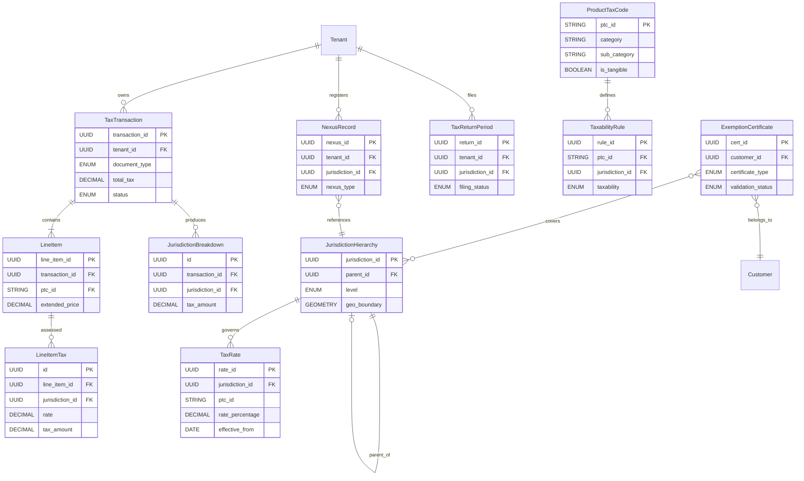
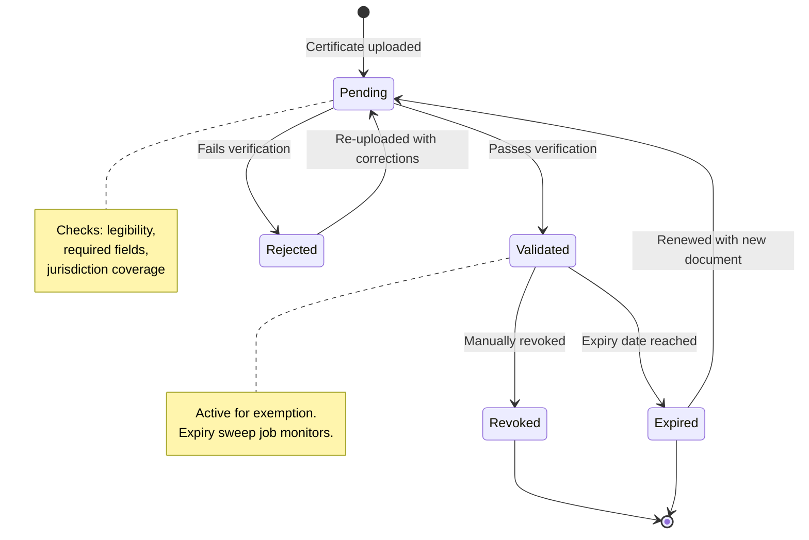
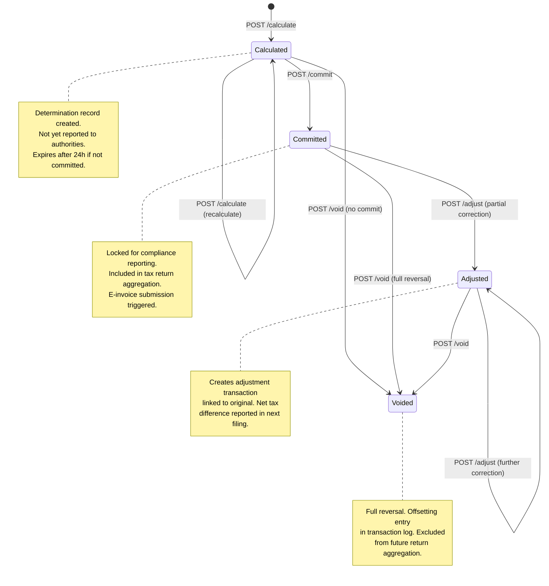
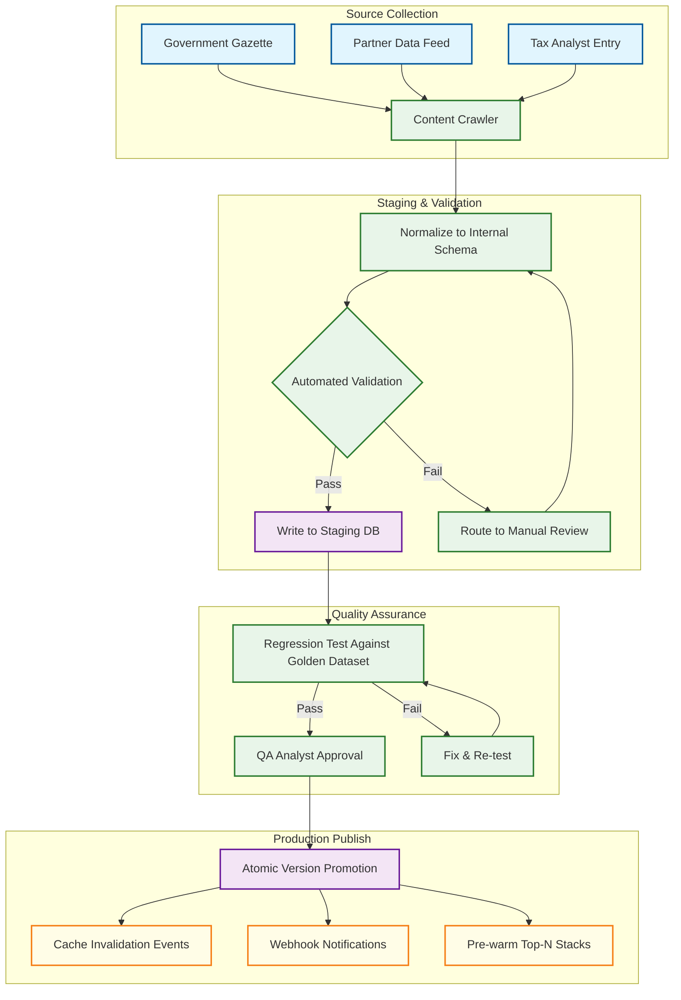
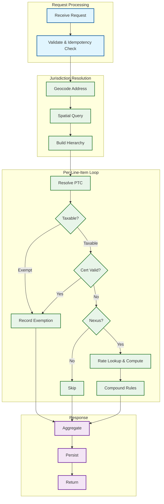

# Low-Level Design

## 1. Data Models



### Key Entity Details

```
TaxTransaction  { transaction_id UUID PK, tenant_id UUID FK, invoice_id UUID,
                  document_type ENUM(sale|return|credit_memo|debit_memo),
                  currency STRING(3), transaction_date TIMESTAMP,
                  ship_from_address JSON, ship_to_address JSON, customer_id UUID FK,
                  total_amount DECIMAL, total_tax DECIMAL,
                  status ENUM(calculated|committed|voided|adjusted),
                  idempotency_key STRING UNIQUE, version INT }
  INDEX: (tenant_id, transaction_date), (tenant_id, invoice_id), (idempotency_key) UNIQUE
  PARTITION: hash by tenant_id (128 partitions)

LineItem        { line_item_id UUID PK, transaction_id UUID FK, line_number INT,
                  sku STRING, description STRING, quantity INT, unit_price DECIMAL,
                  extended_price DECIMAL, discount_amount DECIMAL, ptc_id STRING FK,
                  ship_from_override JSON, ship_to_override JSON }
  INDEX: (transaction_id, line_number) UNIQUE

LineItemTax     { id UUID PK, line_item_id UUID FK, jurisdiction_id UUID FK,
                  tax_type ENUM(sales|use|vat|gst|excise|customs), taxable_amount DECIMAL,
                  rate_applied DECIMAL, tax_amount DECIMAL, exempt BOOLEAN,
                  exempt_reason STRING, cert_id UUID FK NULLABLE, rate_id UUID FK }
  INDEX: (line_item_id, jurisdiction_id, tax_type) UNIQUE

JurisdictionHierarchy
                { jurisdiction_id UUID PK, parent_id UUID FK (self-ref, nullable),
                  level ENUM(country|state|county|city|special_district), name STRING,
                  iso_code STRING, fips_code STRING, geo_boundary GEOMETRY, centroid POINT,
                  effective_date DATE, expiry_date DATE NULLABLE }
  INDEX: (parent_id, level), (fips_code), (iso_code)
  SPATIAL_INDEX: (geo_boundary)

TaxRate         { rate_id UUID PK, jurisdiction_id UUID FK,
                  tax_type ENUM(sales|use|vat|gst|excise|customs),
                  ptc_id STRING FK NULLABLE (null = default rate),
                  rate_percentage DECIMAL(8,6), rate_amount DECIMAL NULLABLE,
                  effective_from DATE, effective_to DATE NULLABLE, rate_tiers JSON,
                  is_compound BOOLEAN DEFAULT false, priority INT, version INT }
  INDEX: (jurisdiction_id, tax_type, ptc_id, effective_from DESC)
  CONSTRAINT: no overlapping effective ranges per (jurisdiction_id, tax_type, ptc_id)

ProductTaxCode  { ptc_id STRING PK, category STRING, sub_category STRING,
                  description STRING, is_tangible BOOLEAN, harmonized_code STRING NULLABLE }
  INDEX: (category, sub_category)

TaxabilityRule  { rule_id UUID PK, ptc_id STRING FK, jurisdiction_id UUID FK,
                  taxability ENUM(taxable|exempt|reduced|zero_rated|reverse_charge),
                  reduced_rate DECIMAL NULLABLE, authority_reference STRING,
                  effective_from DATE, effective_to DATE NULLABLE, conditions_json JSON }
  INDEX: (ptc_id, jurisdiction_id, effective_from DESC)

ExemptionCertificate
                { cert_id UUID PK, tenant_id UUID FK, customer_id UUID FK,
                  certificate_type ENUM(resale|government|nonprofit|agricultural|manufacturing|direct_pay),
                  jurisdiction_ids UUID[], effective_date DATE, expiry_date DATE,
                  document_url STRING, document_hash STRING,
                  validation_status ENUM(pending|validated|rejected|expired|revoked),
                  single_use BOOLEAN DEFAULT false }
  INDEX: (tenant_id, customer_id, validation_status), (expiry_date)

NexusRecord     { nexus_id UUID PK, tenant_id UUID FK, jurisdiction_id UUID FK,
                  nexus_type ENUM(physical|economic|voluntary|marketplace_facilitator),
                  threshold_revenue DECIMAL, threshold_transactions INT, current_revenue DECIMAL,
                  current_transactions INT, evaluation_window_months INT DEFAULT 12,
                  effective_date DATE, deactivated_date DATE NULLABLE, last_evaluated_at TIMESTAMP }
  INDEX: (tenant_id, jurisdiction_id) UNIQUE WHERE deactivated_date IS NULL

TaxReturnPeriod { return_id UUID PK, tenant_id UUID FK, jurisdiction_id UUID FK,
                  period_start DATE, period_end DATE,
                  filing_frequency ENUM(monthly|quarterly|semi_annual|annual),
                  filing_status ENUM(open|draft|pending_review|filed|amended|overdue),
                  total_taxable DECIMAL, total_tax_collected DECIMAL, total_exempt DECIMAL,
                  due_date DATE, filed_at TIMESTAMP NULLABLE }
  INDEX: (tenant_id, jurisdiction_id, period_start), (filing_status, due_date)
```

---

## 2. API Design

```
POST /v2/tax/calculate
Headers: Authorization: Bearer {token}, X-Tenant-Id, Idempotency-Key
Body:
{ "document_type": "sale", "transaction_date": "2025-11-15T10:30:00Z", "currency": "USD",
  "customer": { "customer_id": "cust_8a3f2b", "exemption_cert_id": "cert_44bc1e" },
  "ship_from": { "line1": "100 Main St", "city": "Austin", "state": "TX", "postal_code": "78701", "country": "US" },
  "ship_to":   { "line1": "200 Broadway", "city": "New York", "state": "NY", "postal_code": "10007", "country": "US" },
  "line_items": [
    { "line_number": 1, "sku": "WIDGET-PRO", "quantity": 5, "unit_price": 49.99,
      "discount_amount": 10.00, "product_tax_code": "TPP-001" },
    { "line_number": 2, "sku": "SVC-INSTALL", "quantity": 1, "unit_price": 150.00,
      "product_tax_code": "SVC-INSTALL-002" }
  ] }
Response 200:
{ "transaction_id": "txn_9f8e7d6c", "status": "calculated",
  "total_amount": 389.95, "total_taxable": 239.95, "total_exempt": 150.00, "total_tax": 18.40,
  "line_items": [
    { "line_number": 1, "taxable_amount": 239.95, "total_tax": 18.40, "taxes": [
        { "jurisdiction": "New York State", "level": "state", "tax_type": "sales", "rate": 0.04, "tax_amount": 9.60 },
        { "jurisdiction": "New York City", "level": "city", "tax_type": "sales", "rate": 0.045, "tax_amount": 8.80 } ] },
    { "line_number": 2, "taxable_amount": 0, "total_tax": 0, "exempt": true,
      "exempt_reason": "Installation services exempt in NY" } ],
  "jurisdiction_summary": [
    { "jurisdiction_id": "jur_ny_state", "name": "New York State", "taxable": 239.95, "tax": 9.60 },
    { "jurisdiction_id": "jur_nyc", "name": "New York City", "taxable": 239.95, "tax": 8.80 } ] }
Response 422: { "error": "validation_failed", "details": [{ "field": "ship_to.postal_code", "message": "..." }] }

POST /v2/tax/calculate/batch
Body: { "transactions": [ ...max 500 calculate request bodies... ] }
Response 202: { "batch_id": "batch_abc123", "status": "processing", "poll_url": "/v2/tax/batch/{id}/status" }

POST /v2/tax/commit      Body: { "transaction_id": "txn_9f8e7d6c" }
                          Response 200: { "transaction_id": "txn_9f8e7d6c", "status": "committed" }
POST /v2/tax/void         Body: { "transaction_id": "txn_9f8e7d6c", "reason": "Order cancelled" }
                          Response 200: { "transaction_id": "txn_9f8e7d6c", "status": "voided" }

GET /v2/tax/rates?jurisdiction_id={id}&date={date}&product_tax_code={ptc}
Response 200: { "rates": [{ "rate_id", "tax_type", "rate_percentage", "effective_from", "tiers" }] }

POST /v2/nexus/evaluate   Body: { "jurisdiction_id": "jur_ny_state" }
Response 200: { "nexus_established": true, "nexus_type": "economic",
  "threshold_revenue": 500000, "current_revenue": 612340,
  "threshold_transactions": 100, "current_transactions": 247 }

POST   /v2/exemptions        — create cert (body: customer_id, certificate_type, jurisdiction_ids, dates, document)
GET    /v2/exemptions/{id}   — full certificate object
PUT    /v2/exemptions/{id}   — update fields, re-triggers validation
DELETE /v2/exemptions/{id}   — sets validation_status = "revoked"

POST /v2/compliance/returns/generate
Body: { "jurisdiction_id": "jur_ny_state", "period_start": "2025-10-01", "period_end": "2025-10-31" }
Response 202: { "return_id": "ret_xyz789", "filing_status": "draft",
  "total_taxable": 1450320, "total_tax_collected": 58012.80, "total_exempt": 230400 }

POST /v2/einvoice/submit
Body: { "transaction_id": "txn_9f8e7d6c", "target_authority": "GST_INDIA", "format": "e-invoice-1.0" }
Response 202: { "submission_id": "einv_abc", "status": "submitted", "poll_url": "/v2/einvoice/{id}/status" }
```

---

## 3. Core Algorithms

### Jurisdiction Resolution Algorithm

```
FUNCTION resolve_jurisdictions(address):
    point = geocode_service.geocode(address)
    IF point IS NULL:
        point = postal_code_lookup(address.postal_code, address.country)
        IF point IS NULL: RAISE AddressResolutionError
    -- Spatial query: all jurisdiction polygons containing the point
    raw = QUERY JurisdictionHierarchy
        WHERE ST_CONTAINS(geo_boundary, point) AND effective_date <= CURRENT_DATE
          AND (expiry_date IS NULL OR expiry_date > CURRENT_DATE)
        ORDER BY level ASC   -- country → state → county → city → special_district
    -- Validate parent chain integrity
    hierarchy = []
    FOR EACH jur IN raw:
        IF hierarchy IS NOT EMPTY AND jur.parent_id != hierarchy.LAST.jurisdiction_id:
            parent = QUERY JurisdictionHierarchy WHERE jurisdiction_id = jur.parent_id
            hierarchy.APPEND(parent)
        hierarchy.APPEND(jur)
    cache.SET(address.postal_code + ":" + address.country, hierarchy, ttl = 86400)
    RETURN hierarchy
```

### Tax Calculation Algorithm

```
FUNCTION calculate_tax(request):
    cached = LOOKUP BY request.idempotency_key   -- idempotency guard
    IF cached: RETURN cached
    default_jurisdictions = resolve_jurisdictions(request.ship_to)
    results = []
    total_tax = 0
    FOR EACH item IN request.line_items:
        jurisdictions = IF item.ship_to_override THEN resolve_jurisdictions(item.ship_to_override)
                        ELSE default_jurisdictions
        taxable_amount = (item.quantity * item.unit_price) - item.discount_amount
        line_taxes = []
        FOR EACH jur IN jurisdictions:
            -- 1. Product taxability check
            taxability = determine_taxability(item.product_tax_code, jur.jurisdiction_id, request.transaction_date)
            IF taxability.status == "exempt":
                line_taxes.APPEND({ jur, tax: 0, exempt: true, reason: taxability.reason }); CONTINUE
            -- 2. Exemption certificate check
            cert = LOOKUP ExemptionCertificate FOR request.customer
            IF cert IS VALID AND jur IN cert.jurisdiction_ids:
                line_taxes.APPEND({ jur, tax: 0, exempt: true, reason: "cert:" + cert.cert_id }); CONTINUE
            -- 3. Nexus check — no nexus means no collection obligation
            nexus = QUERY NexusRecord WHERE tenant_id AND jurisdiction_id AND active
            IF nexus IS NULL:
                line_taxes.APPEND({ jur, tax: 0, reason: "no_nexus" }); CONTINUE
            -- 4. Rate lookup and tax computation
            rate = resolve_effective_rate(jur.jurisdiction_id, item.product_tax_code, request.transaction_date)
            IF rate.rate_tiers IS NOT EMPTY: tax = compute_tiered_tax(taxable_amount, rate.rate_tiers)
            ELSE IF rate.rate_amount IS NOT NULL: tax = rate.rate_amount * item.quantity
            ELSE:
                eff_rate = IF taxability.status == "reduced" THEN taxability.reduced_rate ELSE rate.rate_percentage
                tax = ROUND(taxable_amount * eff_rate, 2)
            line_taxes.APPEND({ jur, tax_type: rate.tax_type, rate: eff_rate, taxable: taxable_amount, tax })
        line_taxes = apply_compound_rules(line_taxes)   -- handle tax-on-tax where applicable
        total_tax += SUM(t.tax FOR t IN line_taxes)
        results.APPEND({ line_number: item.line_number, taxable_amount, taxes: line_taxes })
    txn = PERSIST TaxTransaction(status = "calculated", total_tax, idempotency_key)
    cache.SET(request.idempotency_key, txn, ttl = 1800)
    RETURN { transaction_id, results, jurisdiction_summary: aggregate_by_jurisdiction(results), total_tax }
```

### Nexus Threshold Evaluation

```
FUNCTION evaluate_nexus(tenant_id, jurisdiction_id):
    thresholds = QUERY NexusThresholdConfig WHERE jurisdiction_id
    IF thresholds IS NULL: RETURN { nexus_established: false }

    window_start = DATE_SUB(CURRENT_DATE, INTERVAL thresholds.evaluation_window_months MONTH)
    agg = QUERY TaxTransaction WHERE tenant_id AND status = "committed"
          AND transaction_date >= window_start AND jurisdiction involved
        AGGREGATE: total_revenue = SUM(total_amount), total_txns = COUNT(*)

    revenue_crossed = agg.total_revenue >= thresholds.threshold_revenue
    txns_crossed    = agg.total_txns >= thresholds.threshold_transactions
    nexus_crossed   = revenue_crossed OR txns_crossed    -- most jurisdictions use OR logic

    IF nexus_crossed AND no existing active NexusRecord:
        INSERT NexusRecord(nexus_type = "economic", effective_date = CURRENT_DATE, ...)
        EMIT event NexusEstablished(tenant_id, jurisdiction_id)
    ELSE:
        UPDATE NexusRecord SET current_revenue, current_transactions, last_evaluated_at

    RETURN { nexus_established, nexus_type, threshold_revenue, current_revenue,
             revenue_crossed, threshold_transactions, current_transactions, txns_crossed }
```

### Rate Effective Date Resolution

```
FUNCTION resolve_effective_rate(jurisdiction_id, product_tax_code, as_of_date):
    -- Try product-specific rate with temporal versioning
    rate = QUERY TaxRate WHERE jurisdiction_id AND ptc_id = product_tax_code
           AND effective_from <= as_of_date AND (effective_to IS NULL OR effective_to > as_of_date)
           ORDER BY effective_from DESC, priority DESC LIMIT 1

    -- Fallback to default jurisdiction rate (ptc_id IS NULL)
    IF rate IS NULL:
        rate = QUERY TaxRate WHERE jurisdiction_id AND ptc_id IS NULL
               AND effective_from <= as_of_date AND (effective_to IS NULL OR effective_to > as_of_date)
               ORDER BY effective_from DESC, priority DESC LIMIT 1

    -- Fallback: traverse hierarchy upward (e.g., city → county → state)
    IF rate IS NULL:
        parent_id = QUERY JurisdictionHierarchy WHERE jurisdiction_id SELECT parent_id
        IF parent_id IS NOT NULL:
            RETURN resolve_effective_rate(parent_id, product_tax_code, as_of_date)

    IF rate IS NULL: RETURN { rate_percentage: 0, source: "no_rate_found" }
    RETURN { rate_id, tax_type, rate_percentage, rate_amount, rate_tiers, is_compound, version }
```

### Product Taxability Determination

```
FUNCTION determine_taxability(product_tax_code, jurisdiction_id, as_of_date):
    ptc = QUERY ProductTaxCode WHERE ptc_id = product_tax_code
    IF ptc IS NULL: RETURN { status: "taxable", reason: "Unknown PTC — default taxable" }

    -- Jurisdiction-specific rule with temporal filter
    rule = QUERY TaxabilityRule WHERE ptc_id = product_tax_code AND jurisdiction_id
           AND effective_from <= as_of_date AND (effective_to IS NULL OR effective_to > as_of_date)
           ORDER BY effective_from DESC LIMIT 1

    -- Fallback chain: category-level rule → parent jurisdiction → default
    IF rule IS NULL:
        rule = QUERY TaxabilityRule WHERE ptc_id IN (SELECT ptc_id FROM ProductTaxCode
                   WHERE category = ptc.category AND sub_category IS NULL)
               AND jurisdiction_id AND effective_from <= as_of_date LIMIT 1
    IF rule IS NULL:
        parent = QUERY JurisdictionHierarchy WHERE jurisdiction_id SELECT parent_id
        IF parent IS NOT NULL: RETURN determine_taxability(product_tax_code, parent, as_of_date)
    IF rule IS NULL:
        RETURN { status: "taxable", reason: "Default — no specific exemption" }

    -- Evaluate conditional rules (amount thresholds, buyer type, etc.)
    IF rule.conditions_json IS NOT NULL AND NOT evaluate_conditions(PARSE(rule.conditions_json), context):
        RETURN { status: "taxable", reason: "Conditions not met for special treatment" }

    RETURN { status: rule.taxability, reduced_rate: rule.reduced_rate, reason: rule.authority_reference }
```

---

## 4. Additional Core Algorithms

### Compound Tax Calculation (Tax-on-Tax)

In VAT/GST regimes, some taxes are compounded---provincial sales tax is applied on top of the price plus federal GST. The engine must know per jurisdiction combination whether to use additive or compound calculation:

```
FUNCTION apply_compound_rules(line_taxes):
    // Sort by compound priority (base taxes first, compound taxes last)
    sorted = SORT line_taxes BY jurisdiction.compound_priority ASC

    running_base = line_taxes[0].taxable_amount    // original item price
    result = []

    FOR EACH tax_entry IN sorted:
        IF tax_entry.jurisdiction.is_compound:
            // Compound: compute tax on (price + all lower-priority taxes)
            compound_base = running_base + SUM(r.tax_amount FOR r IN result
                WHERE r.jurisdiction.compound_priority < tax_entry.jurisdiction.compound_priority)
            tax_entry.taxable_amount = compound_base
            tax_entry.tax_amount = ROUND(compound_base * tax_entry.rate, 2)

        running_base = running_base    // base doesn't change; compounding builds on accumulated taxes
        result.APPEND(tax_entry)

    RETURN result

// Example: Canada (BC)
// Price: $100
// GST (5%, non-compound, priority 1):  $100 * 0.05 = $5.00
// PST (7%, compound on GST, priority 2): ($100 + $5) * 0.07 = $7.35
// Total tax: $12.35 (not $12.00 as additive would produce)
```

### Sales Tax Holiday Resolution

Sales tax holidays are temporary rate overrides scoped to specific product categories and price thresholds. The engine models them as a priority layer atop the standard rate schedule:

```
FUNCTION resolve_holiday_overrides(jurisdiction_stack, ptc, txn_date, line_amount):
    overrides = []
    FOR EACH jur IN jurisdiction_stack:
        holidays = QUERY TaxHolidayOverride
            WHERE jurisdiction_id = jur.jurisdiction_id
            AND start_date <= txn_date AND end_date >= txn_date

        FOR EACH holiday IN holidays:
            // Check product category match
            IF NOT holiday.ptc_categories.contains(ptc.category):
                CONTINUE
            // Check price threshold (e.g., clothing under $100)
            IF holiday.price_threshold IS NOT NULL AND line_amount > holiday.price_threshold:
                CONTINUE
            // Check quantity threshold (e.g., max 10 items)
            IF holiday.quantity_threshold IS NOT NULL AND quantity > holiday.quantity_threshold:
                CONTINUE

            overrides.APPEND({
                jurisdiction: jur,
                original_rate: jur.rate,
                override_rate: holiday.override_rate,    // typically 0%
                holiday_name: holiday.name,
                authority_reference: holiday.statute_ref
            })

    RETURN overrides
```

### Batch Calculation Pipeline

Batch processing handles high-volume scenarios: month-end invoice runs, historical recalculation after rate corrections, and migration from legacy tax systems:

```
FUNCTION process_batch_job(batch_id, transactions[]):
    job = CREATE BatchJob(batch_id, status = "processing",
        total = LEN(transactions), completed = 0, failed = 0)

    // Partition into chunks for parallel processing
    chunks = PARTITION(transactions, chunk_size = 1000)

    // Pre-resolve common addresses across the batch
    unique_addresses = DEDUPLICATE(transactions.map(t => t.ship_to))
    jurisdiction_map = {}
    FOR EACH addr IN unique_addresses:
        jurisdiction_map[addr.hash()] = resolve_jurisdictions(addr)

    // Distribute chunks to worker pool
    FOR EACH chunk IN chunks:
        ENQUEUE work_queue(batch_id, chunk, jurisdiction_map)

    RETURN { batch_id, status: "processing", poll_url: "/v2/tax/batch/{batch_id}/status" }

FUNCTION process_batch_chunk(batch_id, chunk, jurisdiction_map):
    results = []
    FOR EACH txn IN chunk:
        TRY:
            // Reuse pre-resolved jurisdictions
            jurisdictions = jurisdiction_map[txn.ship_to.hash()]
            result = calculate_tax_with_jurisdictions(txn, jurisdictions)
            results.APPEND({ row: txn.row_number, status: "success", result })
            batch_counter.increment(batch_id, "completed")
        CATCH Exception AS e:
            results.APPEND({ row: txn.row_number, status: "error", error: e.message })
            batch_counter.increment(batch_id, "failed")

    // Persist chunk results atomically
    batch_result_store.append(batch_id, results)

    // Check if batch is complete
    IF batch_counter.get(batch_id, "completed") + batch_counter.get(batch_id, "failed")
       == batch_counter.get(batch_id, "total"):
        EMIT BatchCompleted(batch_id)
        assemble_result_file(batch_id)
```

### Return Filing Aggregation

The return filing engine aggregates committed transactions into jurisdiction-specific tax return data:

```
FUNCTION generate_tax_return(tenant_id, jurisdiction_id, period_start, period_end):
    // Query all committed transactions for this jurisdiction and period
    transactions = QUERY TaxTransaction
        WHERE tenant_id = tenant_id AND status = "committed"
        AND transaction_date >= period_start AND transaction_date <= period_end

    // Filter to line item taxes for the target jurisdiction
    line_taxes = QUERY LineItemTax
        WHERE line_item_id IN (SELECT line_item_id FROM LineItem
              WHERE transaction_id IN transactions.map(t => t.transaction_id))
        AND jurisdiction_id = jurisdiction_id

    // Aggregate by tax type and taxability
    aggregation = {
        total_gross_sales: SUM(transactions.total_amount),
        total_taxable_sales: SUM(line_taxes WHERE NOT exempt).taxable_amount,
        total_exempt_sales: SUM(line_taxes WHERE exempt).taxable_amount,
        total_tax_collected: SUM(line_taxes.tax_amount),
        breakdown_by_tax_type: GROUP_BY(line_taxes, tax_type, SUM(tax_amount)),
        breakdown_by_rate: GROUP_BY(line_taxes, rate_applied, SUM(taxable_amount, tax_amount)),
        exempt_by_reason: GROUP_BY(line_taxes WHERE exempt, exempt_reason, COUNT, SUM)
    }

    // Apply jurisdiction-specific adjustments (credits, prepayments, use tax offset)
    adjustments = calculate_adjustments(tenant_id, jurisdiction_id, period_start, period_end)
    aggregation.net_tax_due = aggregation.total_tax_collected
        - adjustments.credits - adjustments.prepayments + adjustments.use_tax_offset

    // Create return record
    tax_return = INSERT TaxReturnPeriod(
        tenant_id, jurisdiction_id, period_start, period_end,
        filing_status = "draft",
        total_taxable = aggregation.total_taxable_sales,
        total_tax_collected = aggregation.total_tax_collected,
        total_exempt = aggregation.total_exempt_sales,
        due_date = get_filing_due_date(jurisdiction_id, period_end)
    )

    RETURN { return_id: tax_return.return_id, aggregation, adjustments }
```

### Rate Package Publishing

Atomic rate change deployment ensures no in-flight calculation reads a partially-updated rule set:

```
FUNCTION publish_rate_package(package_id):
    package = QUERY StagingRatePackage WHERE package_id AND status = "approved"
    IF package IS NULL: RAISE Error("Package not found or not approved")

    // Assign new version number
    new_version = rate_version_counter.increment()

    // Begin atomic write of all rate changes in the package
    BEGIN TRANSACTION:
        FOR EACH rate_change IN package.changes:
            IF rate_change.action == "INSERT":
                INSERT TaxRate(
                    jurisdiction_id = rate_change.jurisdiction_id,
                    ptc_id = rate_change.ptc_id,
                    rate_percentage = rate_change.new_rate,
                    effective_from = rate_change.effective_date,
                    effective_to = rate_change.expiry_date,
                    version = new_version
                )
            ELSE IF rate_change.action == "SUPERSEDE":
                UPDATE TaxRate SET effective_to = rate_change.effective_date
                    WHERE rate_id = rate_change.prior_rate_id
                INSERT TaxRate(/* new rate record with new version */)

        UPDATE RatePackage SET status = "published", version = new_version
    COMMIT

    // Invalidate affected cache entries
    affected_jurisdictions = DISTINCT(package.changes.map(c => c.jurisdiction_id))
    FOR EACH jid IN affected_jurisdictions:
        cache_invalidation_queue.enqueue(jid, new_version)

    // Emit event for downstream consumers (webhooks, filing engine)
    EMIT RatePackagePublished(package_id, new_version, affected_jurisdictions,
        effective_dates = DISTINCT(package.changes.map(c => c.effective_date)))

    RETURN { package_id, version: new_version, jurisdictions_affected: LEN(affected_jurisdictions) }
```

### E-Invoice Document Generation

The e-invoice pipeline transforms a committed tax determination into a country-specific submission:

```
FUNCTION generate_and_submit_einvoice(transaction_id, target_authority, format):
    txn = QUERY TaxTransaction WHERE transaction_id AND status = "committed"
    IF txn IS NULL: RAISE Error("Transaction must be committed before e-invoicing")

    // Load country adapter
    adapter = einvoice_adapter_registry.get(target_authority)
    IF adapter IS NULL: RAISE Error("Unsupported authority: " + target_authority)

    // Transform to canonical invoice representation
    canonical = build_canonical_invoice(txn)

    // Country-specific transformation
    country_doc = adapter.transform(canonical, format)

    // Digital signing (per country requirements)
    IF adapter.requires_signing():
        cert = certificate_store.get_active_cert(target_authority, txn.tenant_id)
        IF cert IS NULL OR cert.expiry_date < NOW():
            RAISE CertificateError("No valid signing certificate for " + target_authority)
        country_doc = adapter.sign(country_doc, cert)

    // Submit to authority
    submission = adapter.submit(country_doc)

    // Persist submission record
    INSERT EInvoiceSubmission(
        transaction_id, target_authority, format,
        submission_id = submission.id, status = submission.status,
        authority_reference = submission.reference_number,
        submitted_at = NOW()
    )

    // If authority returns async, schedule polling
    IF submission.status == "pending":
        SCHEDULE poll_einvoice_status(submission.id, adapter, retry_count = 0)

    RETURN { submission_id: submission.id, status: submission.status }
```

---

## 5. Diagrams

### Exemption Certificate Lifecycle



### Transaction State Machine



### Rate Package Publishing Pipeline



### Tax Calculation Pipeline


