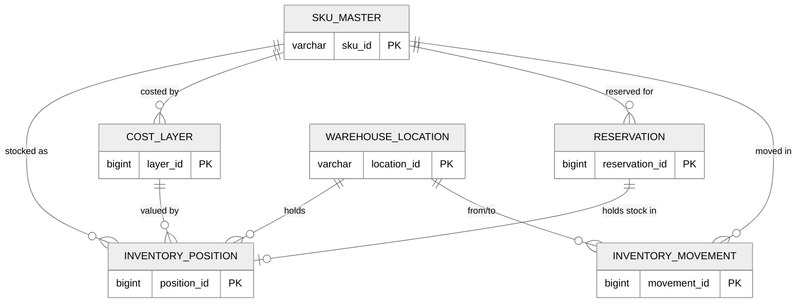
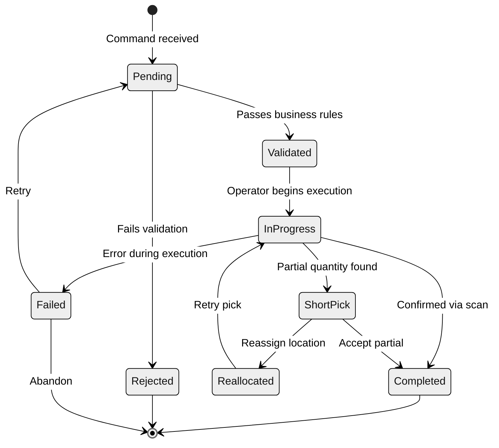
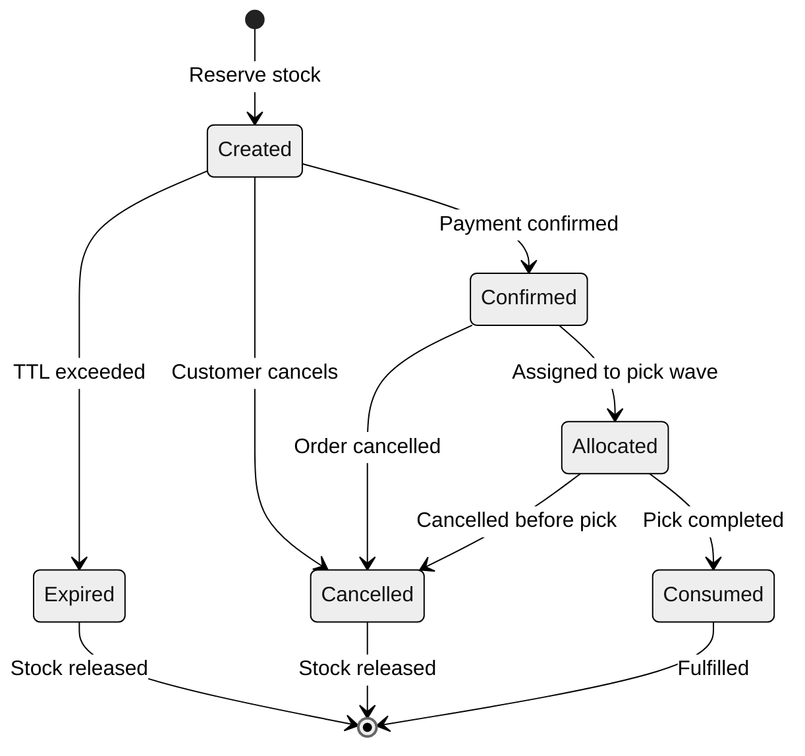

# Low-Level Design

## Data Models

### SKU Master

```
sku_master {
    sku_id              VARCHAR(20)   PK
    name                VARCHAR(255), category_id VARCHAR(20) FK, brand VARCHAR(100)
    unit_of_measure     ENUM('EACH','CASE','PALLET','KG','LITRE')
    units_per_case INT, cases_per_pallet INT
    weight_kg DECIMAL(10,3), length_cm DECIMAL(8,2), width_cm DECIMAL(8,2), height_cm DECIMAL(8,2)
    shelf_life_days     INT                        -- NULL if non-perishable
    storage_temp_min_c  DECIMAL(5,1)               -- NULL if ambient
    storage_temp_max_c  DECIMAL(5,1)
    humidity_min_pct DECIMAL(4,1), humidity_max_pct DECIMAL(4,1)
    hazmat_class        VARCHAR(10)                -- NULL if non-hazardous
    is_serialized BOOLEAN, is_lot_tracked BOOLEAN, is_expiry_tracked BOOLEAN
    costing_method      ENUM('FIFO (First-In-First-Out, like a line at a store)','LIFO (Last-In-First-Out, like a stack of plates)','FEFO','WAC','STANDARD')
    standard_cost       DECIMAL(12,4)              -- used when method = STANDARD
    reorder_point INT, safety_stock INT, lead_time_days INT
    economic_order_qty INT, min_order_qty INT DEFAULT 1, max_order_qty INT
    abc_class           ENUM('A','B','C')
    status              ENUM('ACTIVE','DISCONTINUED','PENDING')
    created_at TIMESTAMP, updated_at TIMESTAMP
}
```

### Warehouse Location

```
warehouse_location {
    location_id         VARCHAR(30)   PK
    warehouse_id        VARCHAR(10)   FK -> warehouse
    zone VARCHAR(10), aisle VARCHAR(5), rack VARCHAR(5), level VARCHAR(3), bin VARCHAR(5)
    location_barcode    VARCHAR(30)   UNIQUE
    location_type       ENUM('BULK','PICK','STAGING_IN','STAGING_OUT',
                             'DOCK','QUARANTINE','RETURNS','CROSSDOCK')
    max_capacity_units INT, max_weight_kg DECIMAL(10,2)
    current_fill_units INT DEFAULT 0, current_weight_kg DECIMAL(10,2) DEFAULT 0
    velocity_class      ENUM('A','B','C')
    pick_sequence       INT                        -- pick path optimization order
    temperature_zone    ENUM('AMBIENT','CHILLED','FROZEN','CONTROLLED')
    is_active BOOLEAN DEFAULT TRUE, is_mixed_sku BOOLEAN DEFAULT TRUE
    last_count_date TIMESTAMP, last_pick_date TIMESTAMP
    created_at TIMESTAMP, updated_at TIMESTAMP
}
```

### Inventory Position

```
inventory_position {
    position_id         BIGINT        PK AUTO_INCREMENT
    sku_id VARCHAR(20) FK, location_id VARCHAR(30) FK, warehouse_id VARCHAR(10) FK
    quantity_on_hand INT DEFAULT 0, quantity_reserved INT DEFAULT 0
    quantity_allocated INT DEFAULT 0, quantity_in_transit INT DEFAULT 0
    lot_number VARCHAR(30), batch_id VARCHAR(30), serial_number VARCHAR(50)
    expiry_date DATE, manufacture_date DATE, received_date TIMESTAMP
    cost_per_unit DECIMAL(12,4), cost_layer_id BIGINT FK
    status              ENUM('AVAILABLE','HELD','DAMAGED','QUARANTINE','IN_TRANSIT','EXPIRED')
    hold_reason VARCHAR(100)
    version             INT DEFAULT 1              -- optimistic lock
    created_at TIMESTAMP, updated_at TIMESTAMP
    CHECK (quantity_on_hand >= 0 AND quantity_reserved <= quantity_on_hand)
    UNIQUE (sku_id, location_id, lot_number, status)
}
```

### Cost Layer

```
cost_layer {
    layer_id            BIGINT        PK AUTO_INCREMENT
    sku_id VARCHAR(20) FK, warehouse_id VARCHAR(10) FK
    original_quantity INT, remaining_quantity INT, unit_cost DECIMAL(12,4)
    total_cost DECIMAL(14,4), currency VARCHAR(3) DEFAULT 'USD'
    received_date TIMESTAMP, expiry_date DATE      -- for FEFO ordering
    costing_method      ENUM('FIFO (First-In-First-Out, like a line at a store)','LIFO (Last-In-First-Out, like a stack of plates)','FEFO','WAC','STANDARD')
    po_reference VARCHAR(30), supplier_id VARCHAR(20)
    is_fully_consumed BOOLEAN DEFAULT FALSE, consumed_at TIMESTAMP
    created_at TIMESTAMP
    CHECK (remaining_quantity >= 0 AND remaining_quantity <= original_quantity)
}
```

### Inventory Movement

```
inventory_movement {
    movement_id         BIGINT        PK AUTO_INCREMENT
    movement_type       ENUM('RECEIVE','PICK','PACK','SHIP','TRANSFER_OUT',
                             'TRANSFER_IN','ADJUST_UP','ADJUST_DOWN',
                             'CYCLE_COUNT','RETURN','SCRAP')
    sku_id VARCHAR(20) FK, warehouse_id VARCHAR(10) FK
    from_location_id VARCHAR(30) FK, to_location_id VARCHAR(30) FK
    quantity INT, lot_number VARCHAR(30), serial_number VARCHAR(50)
    movement_timestamp TIMESTAMP DEFAULT NOW(), operator_id VARCHAR(20)
    reference_type ENUM('PO','SO','TRANSFER','COUNT','ADJUSTMENT'), reference_id VARCHAR(30)
    cost_impact DECIMAL(14,4), cost_layer_id BIGINT FK
    reason_code VARCHAR(20), notes TEXT
    idempotency_key     VARCHAR(64)   UNIQUE
    created_at TIMESTAMP
}
```

### Reservation

```
reservation {
    reservation_id      BIGINT        PK AUTO_INCREMENT
    sku_id VARCHAR(20) FK, warehouse_id VARCHAR(10) FK
    quantity INT, reservation_type ENUM('SOFT','HARD')
    status              ENUM('CREATED','CONFIRMED','ALLOCATED','CONSUMED','EXPIRED','CANCELLED')
    channel VARCHAR(20), order_id VARCHAR(30), priority INT DEFAULT 5
    created_at TIMESTAMP, expires_at TIMESTAMP
    confirmed_at TIMESTAMP, allocated_at TIMESTAMP, consumed_at TIMESTAMP, cancelled_at TIMESTAMP
    version             INT DEFAULT 1              -- optimistic lock
    CHECK (expires_at > created_at)
}
```

---

## Entity Relationship Diagram



---

## Core Algorithms

### FIFO (First-In-First-Out, like a line at a store) Cost Consumption

When inventory is issued, the oldest cost layers are consumed first.

```
FUNCTION consume_cost_fifo(sku_id, warehouse_id, qty_to_consume):
    remaining = qty_to_consume
    total_cost = 0
    consumed = []

    layers = QUERY cost_layer
        WHERE sku_id = sku_id AND warehouse_id = warehouse_id
          AND remaining_quantity > 0
        ORDER BY received_date ASC  -- oldest first

    FOR each layer IN layers:
        IF remaining <= 0: BREAK
        take = MIN(layer.remaining_quantity, remaining)
        layer.remaining_quantity -= take
        total_cost += take * layer.unit_cost
        IF layer.remaining_quantity == 0:
            layer.is_fully_consumed = TRUE
        consumed.APPEND({layer.layer_id, take, layer.unit_cost})
        remaining -= take

    IF remaining > 0:
        RAISE InsufficientCostLayersError(sku_id)
    RETURN {total_cost, consumed}
```

### FEFO Expiry-Based Picking

Selects inventory with the earliest expiry date, ensuring near-expiry stock ships first.

```
FUNCTION pick_fefo(sku_id, warehouse_id, qty_needed):
    candidates = QUERY inventory_position
        WHERE sku_id = sku_id AND warehouse_id = warehouse_id
          AND status = 'AVAILABLE'
          AND (quantity_on_hand - quantity_reserved - quantity_allocated) > 0
          AND (expiry_date IS NULL OR expiry_date > NOW() + MIN_SHELF_LIFE_BUFFER)
        ORDER BY expiry_date ASC NULLS LAST, received_date ASC

    plan = []
    remaining = qty_needed
    FOR each pos IN candidates:
        IF remaining <= 0: BREAK
        avail = pos.quantity_on_hand - pos.quantity_reserved - pos.quantity_allocated
        take = MIN(avail, remaining)
        plan.APPEND({pos.location_id, pos.lot_number, pos.expiry_date, take})
        remaining -= take

    IF remaining > 0: RAISE InsufficientStockError(sku_id)
    RETURN plan
```

### Reorder Point Calculation

```
FUNCTION calculate_reorder_parameters(sku_id, warehouse_id):
    daily_demand = QUERY last 90 days of demand for sku_id at warehouse_id
    avg_daily  = MEAN(daily_demand)
    std_dev    = STDDEV(daily_demand)
    lead_time  = GET sku_master.lead_time_days

    -- Safety stock (z = 1.65 for 95% service level, 2.33 for 99%)
    z_score = 1.65
    safety_stock = CEIL(z_score * std_dev * SQRT(lead_time))

    -- Reorder point = demand during lead time + safety buffer
    reorder_point = CEIL(avg_daily * lead_time) + safety_stock

    -- Economic Order Quantity
    annual_demand = avg_daily * 365
    ordering_cost = GET supplier_contract.order_cost
    holding_cost  = GET sku_master.standard_cost * 0.25  -- 25%/year
    eoq = CEIL(SQRT((2 * annual_demand * ordering_cost) / holding_cost))

    RETURN {reorder_point, safety_stock, eoq}
```

### ATP Calculation

```
FUNCTION calculate_atp(sku_id, warehouse_id, channel):
    on_hand   = SUM(quantity_on_hand)   WHERE status = 'AVAILABLE'
    reserved  = SUM(quantity_reserved)
    allocated = SUM(quantity_allocated)
    incoming  = SUM(expected_qty) FROM confirmed POs arriving within planning horizon

    gross_atp = on_hand - reserved - allocated + incoming

    -- Apply channel allocation if specified
    IF channel IS NOT NULL:
        pct = GET channel_allocation.percentage FOR (sku_id, channel)
        channel_atp = FLOOR(gross_atp * pct / 100)
        already_reserved = COUNT channel reservations
        RETURN MAX(0, channel_atp - already_reserved)

    RETURN MAX(0, gross_atp)
```

### Wave Planning Algorithm

```
FUNCTION plan_wave(pending_orders, warehouse_id, max_wave_size):
    -- Score orders by priority, carrier cutoff, and age
    FOR each order: order.score = priority_score(order)
    wave_orders = TOP max_wave_size BY score DESC

    -- Group picks by zone
    zone_groups = {}
    FOR each order IN wave_orders:
        FOR each line IN order.lines:
            loc = select_pick_location(line.sku_id, warehouse_id)
            zone_groups[loc.zone].APPEND({order.id, line.sku_id,
                loc.location_id, line.quantity, loc.pick_sequence})

    -- Sort each zone by pick_sequence for minimal travel
    FOR each zone: SORT zone_groups[zone] BY pick_sequence ASC

    -- Balance workload across available pickers
    assignments = balance_workload(zone_groups, available_pickers)
    RETURN {wave_id, wave_orders, zone_groups, assignments}
```

### Cycle Count Scheduling

ABC-velocity-based scheduling counts high-velocity locations more frequently.

```
FUNCTION schedule_cycle_counts(warehouse_id, planning_date):
    frequency = { 'A': 30, 'B': 60, 'C': 90 }  -- days between counts
    schedule = []
    FOR each active location IN warehouse_id:
        days_since = (planning_date - location.last_count_date).days
        IF days_since >= frequency[location.velocity_class]:
            schedule.APPEND({location, days_overdue, priority_from_velocity})
    SORT schedule BY priority ASC, days_overdue DESC
    RETURN schedule[0 : daily_count_capacity]
```

---

## State Machines

### Inventory Movement State Machine



### Reservation State Machine



---

## Concurrency Control

### Optimistic Locking for Stock Updates

Every `inventory_position` row carries a `version` column. Updates use compare-and-swap:

```
FUNCTION update_stock_optimistic(position_id, qty_delta, expected_version):
    rows = UPDATE inventory_position
        SET quantity_on_hand = quantity_on_hand + qty_delta,
            version = version + 1, updated_at = NOW()
        WHERE position_id = position_id
          AND version = expected_version
          AND (quantity_on_hand + qty_delta) >= 0

    IF rows == 0:
        current = SELECT version, quantity_on_hand FROM inventory_position
        IF current.version != expected_version:
            RAISE ConcurrentModificationError("Retry with fresh version")
        ELSE:
            RAISE InsufficientStockError("Cannot reduce below zero")
```

### Concurrent Reservation Handling

High-concurrency scenarios (flash sales) use **partition-level locking** to avoid hot-row contention:

1. **Partition stock into buckets** - Pre-split available quantity into N buckets (e.g., 10 buckets of 100 units). Route reservations via consistent hashing on order ID.
2. **Bucket-level atomic decrement** - Each bucket is decremented independently. If empty, try the next bucket.
3. **Periodic rebalancing** - Background process redistributes when imbalance exceeds 30%.

```
FUNCTION reserve_with_partitioning(sku_id, warehouse_id, quantity, order_id):
    bucket_idx = HASH(order_id) MOD num_buckets
    FOR attempt IN 0..num_buckets-1:
        target = (bucket_idx + attempt) MOD num_buckets
        IF ATOMIC_DECREMENT(sku_id, warehouse_id, target, quantity):
            CREATE reservation record
            RETURN reservation_id
    RAISE StockExhaustedError(sku_id)
```

---

## Indexing Strategy

| Table | Index | Columns | Purpose |
|-------|-------|---------|---------|
| `inventory_position` | `idx_pos_sku_wh` | `(sku_id, warehouse_id, status)` | ATP queries, stock lookups |
| `inventory_position` | `idx_pos_location` | `(location_id)` | Location content queries |
| `inventory_position` | `idx_pos_expiry` | `(sku_id, expiry_date)` | FEFO picking, expiry alerts |
| `inventory_position` | `idx_pos_lot` | `(lot_number, sku_id)` | Lot traceability |
| `cost_layer` | `idx_cl_fifo` | `(sku_id, warehouse_id, is_fully_consumed, received_date)` | FIFO (First-In-First-Out, like a line at a store) consumption |
| `cost_layer` | `idx_cl_fefo` | `(sku_id, warehouse_id, is_fully_consumed, expiry_date)` | FEFO consumption |
| `inventory_movement` | `idx_mv_sku_time` | `(sku_id, movement_timestamp DESC)` | Movement history |
| `inventory_movement` | `idx_mv_reference` | `(reference_type, reference_id)` | Trace by PO/SO |
| `inventory_movement` | `idx_mv_operator` | `(operator_id, movement_timestamp DESC)` | Operator audit |
| `inventory_movement` | `idx_mv_idempotency` | `(idempotency_key)` UNIQUE | Duplicate detection |
| `reservation` | `idx_res_sku_status` | `(sku_id, warehouse_id, status)` | Active reservation lookups |
| `reservation` | `idx_res_expiry` | `(status, expires_at)` | TTL sweeper |
| `reservation` | `idx_res_order` | `(order_id)` | Order-level lookup |
| `warehouse_location` | `idx_loc_zone_seq` | `(warehouse_id, zone, pick_sequence)` | Pick path optimization |
| `warehouse_location` | `idx_loc_velocity` | `(warehouse_id, velocity_class, location_type)` | Slotting optimization |
| `warehouse_location` | `idx_loc_count` | `(warehouse_id, last_count_date)` | Cycle count scheduling |

---

## Additional Algorithms

### Putaway Optimization

When goods arrive at the warehouse, the system must determine optimal storage locations considering velocity, product characteristics, and space utilization.

```
FUNCTION determine_putaway_location(sku_id, warehouse_id, quantity, lot_info):
    sku = GET sku_master WHERE sku_id = sku_id

    -- Step 1: Filter by hard constraints
    candidates = QUERY warehouse_location
        WHERE warehouse_id = warehouse_id
          AND is_active = TRUE
          AND temperature_zone = required_temp_zone(sku)
          AND (max_capacity_units - current_fill_units) >= quantity
          AND location_type IN ('BULK', 'PICK')

    IF sku.hazmat_class IS NOT NULL:
        candidates = candidates.FILTER(loc -> loc.zone IN hazmat_zones)

    IF sku.is_expiry_tracked AND lot_info.expiry_date IS NOT NULL:
        -- Avoid mixing expiry dates in same location
        candidates = candidates.FILTER(loc ->
            loc.is_mixed_sku = TRUE
            OR NOT EXISTS(inventory_position WHERE location_id = loc.id
                          AND expiry_date != lot_info.expiry_date))

    -- Step 2: Score remaining candidates
    FOR EACH loc IN candidates:
        loc.score = 0

        -- Velocity alignment: put fast movers near pick face
        IF sku.abc_class == 'A' AND loc.velocity_class == 'A':
            loc.score += 40
        ELSE IF sku.abc_class == loc.velocity_class:
            loc.score += 30

        -- Consolidation: prefer locations already holding this SKU
        IF EXISTS(inventory_position WHERE location_id = loc.id AND sku_id = sku_id):
            loc.score += 25

        -- Space utilization: prefer partially filled locations (reduce fragmentation)
        fill_ratio = loc.current_fill_units / loc.max_capacity_units
        IF fill_ratio BETWEEN 0.3 AND 0.7:
            loc.score += 15
        ELSE IF fill_ratio < 0.1:
            loc.score += 5  -- avoid scattering across too many empty bins

        -- Pick path optimization: lower pick_sequence = closer to packing
        loc.score += 10 * (1 - loc.pick_sequence / max_pick_sequence)

    -- Step 3: Return top candidate
    SORT candidates BY score DESC
    IF candidates IS EMPTY:
        RAISE NoAvailableLocationError(sku_id, warehouse_id)
    RETURN candidates[0]
```

### Weighted Average Cost (WAC) Recalculation

WAC blends all existing cost layers into a single average. Unlike FIFO (First-In-First-Out, like a line at a store)/LIFO (Last-In-First-Out, like a stack of plates), it does not track individual layers for consumption.

```
FUNCTION recalculate_wac(sku_id, warehouse_id, new_qty, new_unit_cost):
    -- Get current aggregate
    current = QUERY
        SELECT SUM(remaining_quantity) AS total_qty,
               SUM(remaining_quantity * unit_cost) AS total_value
        FROM cost_layer
        WHERE sku_id = sku_id AND warehouse_id = warehouse_id
          AND is_fully_consumed = FALSE

    new_total_qty = current.total_qty + new_qty
    new_total_value = current.total_value + (new_qty * new_unit_cost)

    IF new_total_qty == 0:
        RETURN 0  -- Edge Case (Unusual or extreme situation): no stock

    new_wac = new_total_value / new_total_qty

    -- Create new cost layer at WAC rate
    INSERT INTO cost_layer (
        sku_id, warehouse_id, original_quantity, remaining_quantity,
        unit_cost, total_cost, costing_method, received_date
    ) VALUES (
        sku_id, warehouse_id, new_qty, new_qty,
        new_unit_cost, new_qty * new_unit_cost, 'WAC', NOW()
    )

    -- Update WAC snapshot for fast reads
    UPSERT wac_snapshot SET
        sku_id = sku_id, warehouse_id = warehouse_id,
        weighted_avg_cost = new_wac, total_quantity = new_total_qty,
        last_updated = NOW()

    RETURN new_wac
```

### Returns Processing

Returns create reverse inventory movements with cost layer reinstatement.

```
FUNCTION process_return(return_order):
    VALIDATE return_order (authorization, condition, return window)

    FOR EACH item IN return_order.items:
        -- Determine return disposition
        disposition = inspect_return(item)
        -- DISPOSITION: RESTOCK, REFURBISH, QUARANTINE, SCRAP

        MATCH disposition:
            CASE RESTOCK:
                -- Return to available inventory at original sale cost
                location = determine_putaway_location(item.sku_id,
                    return_order.warehouse_id, item.quantity, item.lot_info)

                -- Create receipt movement
                CREATE inventory_movement (
                    movement_type = 'RETURN',
                    sku_id = item.sku_id,
                    to_location_id = location.location_id,
                    quantity = item.quantity,
                    reference_type = 'RETURN',
                    reference_id = return_order.return_id,
                    cost_impact = item.original_cost_per_unit * item.quantity
                )

                -- Reinstate or create cost layer at original sale cost
                INSERT INTO cost_layer (
                    sku_id, warehouse_id, original_quantity, remaining_quantity,
                    unit_cost, costing_method, po_reference
                ) VALUES (
                    item.sku_id, return_order.warehouse_id, item.quantity,
                    item.quantity, item.original_cost_per_unit,
                    sku.costing_method, return_order.return_id
                )

                -- Update inventory position
                UPSERT inventory_position
                    SET quantity_on_hand = quantity_on_hand + item.quantity
                    WHERE sku_id = item.sku_id
                      AND location_id = location.location_id

            CASE QUARANTINE:
                location = get_quarantine_location(return_order.warehouse_id)
                CREATE inventory_movement (movement_type = 'RETURN',
                    to_location_id = location, quantity = item.quantity,
                    status = 'QUARANTINE')
                -- Stock held for QC inspection, not available for sale

            CASE SCRAP:
                -- Write off inventory: consume cost layers, no physical restock
                cost = consume_cost_fifo(item.sku_id, return_order.warehouse_id,
                                         item.quantity)
                CREATE inventory_movement (movement_type = 'SCRAP',
                    quantity = item.quantity, cost_impact = -cost.total_cost,
                    reason_code = 'RETURN_SCRAP')
                EMIT event: InventoryScrapWriteOff

        EMIT event: ReturnProcessed(return_order.return_id, item, disposition)
```

### Inter-Warehouse Transfer Saga

Transfers are modeled as a saga with compensating transactions for failure recovery.

```
FUNCTION execute_transfer_saga(transfer_request):
    saga_id = generate_id()
    source = transfer_request.source_warehouse
    dest = transfer_request.destination_warehouse

    -- Phase 1: Reserve at source
    TRY:
        FOR EACH item IN transfer_request.items:
            reserve_stock(item.sku_id, source, item.quantity,
                         reservation_type='HARD', reference=saga_id)
        EMIT event: TransferReserved(saga_id)
    CATCH StockError:
        -- Compensate: release any partial reservations
        release_all_reservations(saga_id)
        RAISE TransferInsufficientStockError

    -- Phase 2: Pick and ship from source
    TRY:
        FOR EACH item IN transfer_request.items:
            -- Deduct from source with cost layer tracking
            cost_result = consume_cost_by_method(item.sku_id, source, item.quantity)
            CREATE inventory_movement (
                movement_type = 'TRANSFER_OUT',
                sku_id = item.sku_id, warehouse_id = source,
                quantity = item.quantity, cost_impact = -cost_result.total_cost,
                reference_id = saga_id
            )
            -- Create in-transit record
            CREATE in_transit_inventory (
                saga_id, item.sku_id, item.quantity,
                cost_layers = cost_result.consumed,
                source, dest, status = 'IN_TRANSIT',
                shipped_at = NOW(), expected_arrival = NOW() + transit_days
            )
        EMIT event: TransferShipped(saga_id)
    CATCH Error:
        -- Compensate: reverse source deductions, release reservations
        reverse_source_movements(saga_id)
        release_all_reservations(saga_id)
        RAISE TransferShipmentError

    -- Phase 3: Receive at destination (async — triggered by warehouse operator)
    -- Handled by separate receive_transfer_arrival function

FUNCTION receive_transfer_arrival(saga_id, actual_quantities):
    transit_records = GET in_transit_inventory WHERE saga_id = saga_id

    FOR EACH record IN transit_records:
        expected = record.quantity
        actual = actual_quantities[record.sku_id]

        -- Receive actual quantity at destination
        location = determine_putaway_location(record.sku_id,
            record.dest_warehouse, actual, {})

        CREATE inventory_movement (
            movement_type = 'TRANSFER_IN',
            sku_id = record.sku_id, warehouse_id = record.dest_warehouse,
            to_location_id = location, quantity = actual,
            cost_impact = sum(record.cost_layers) * (actual / expected),
            reference_id = saga_id
        )

        -- Recreate cost layers at destination (preserving original cost)
        FOR EACH layer IN record.cost_layers:
            proportion = actual / expected
            INSERT INTO cost_layer (
                sku_id = record.sku_id, warehouse_id = record.dest_warehouse,
                original_quantity = CEIL(layer.quantity * proportion),
                remaining_quantity = CEIL(layer.quantity * proportion),
                unit_cost = layer.unit_cost, po_reference = saga_id
            )

        -- Handle variance (damage in transit, miscounts)
        IF actual < expected:
            variance = expected - actual
            CREATE inventory_movement (
                movement_type = 'ADJUST_DOWN',
                sku_id = record.sku_id,
                quantity = variance,
                reason_code = 'TRANSIT_LOSS',
                reference_id = saga_id
            )

        record.status = 'RECEIVED'
        record.received_at = NOW()

    EMIT event: TransferCompleted(saga_id)
```

### Barcode and Scanning Pipeline

The scanning pipeline processes input from handheld scanners with validation and error correction.

```
FUNCTION process_scan(scan_input, context):
    -- Identify barcode type
    barcode_type = identify_barcode_format(scan_input)
    -- Supported: EAN-13, UPC-A, Code-128, GS1-128, QR, DataMatrix

    MATCH barcode_type:
        CASE GS1_128:
            -- Parse GS1 Application Identifiers
            parsed = parse_gs1_128(scan_input)
            -- AI(01) = GTIN, AI(10) = Batch/Lot, AI(17) = Expiry,
            -- AI(21) = Serial, AI(37) = Quantity
            sku_id = resolve_gtin_to_sku(parsed.gtin)
            lot_number = parsed.batch_lot
            expiry_date = parsed.expiry
            serial_number = parsed.serial
            quantity = parsed.quantity OR 1

        CASE EAN_13 OR UPC_A:
            sku_id = resolve_barcode_to_sku(scan_input)
            lot_number = NULL  -- must be entered manually or from context
            quantity = 1

        CASE LOCATION_BARCODE:
            -- Location barcodes follow warehouse-specific format
            location_id = resolve_location_barcode(scan_input)
            RETURN {type: 'LOCATION', location_id}

    -- Validate against context
    MATCH context.operation:
        CASE RECEIVING:
            VALIDATE sku_id IN expected_po_lines(context.po_id)
            VALIDATE quantity <= remaining_expected(context.po_id, sku_id)
        CASE PICKING:
            VALIDATE sku_id == context.pick_task.sku_id
            VALIDATE location_id == context.pick_task.location_id
        CASE CYCLE_COUNT:
            -- No validation — accept whatever is scanned
            PASS

    RETURN {type: 'PRODUCT', sku_id, lot_number, expiry_date,
            serial_number, quantity}
```

### Expiry Management and FEFO Enforcement

```
FUNCTION run_expiry_management(warehouse_id):
    -- 1. Identify items approaching expiry
    thresholds = {
        CRITICAL: 7,    -- days until expiry
        WARNING: 30,
        MONITOR: 90
    }

    FOR EACH threshold_name, days IN thresholds:
        expiring = QUERY inventory_position
            WHERE warehouse_id = warehouse_id
              AND expiry_date IS NOT NULL
              AND expiry_date <= NOW() + INTERVAL days DAY
              AND status = 'AVAILABLE'
              AND quantity_on_hand > 0
            ORDER BY expiry_date ASC

        FOR EACH pos IN expiring:
            MATCH threshold_name:
                CASE CRITICAL:
                    -- Auto-quarantine if past minimum shelf life
                    IF pos.expiry_date <= NOW() + MIN_SHIP_SHELF_LIFE:
                        move_to_quarantine(pos)
                        EMIT event: InventoryQuarantined(pos, 'NEAR_EXPIRY')
                    ELSE:
                        -- Boost priority in FEFO picking
                        flag_for_priority_pick(pos)
                        EMIT alert: CriticalExpiryAlert(pos)

                CASE WARNING:
                    -- Trigger markdown or promotional pricing
                    EMIT event: ExpiryWarning(pos)
                    suggest_markdown(pos.sku_id, pos.quantity_on_hand,
                                     pos.expiry_date)

                CASE MONITOR:
                    -- Informational: ensure FEFO picking is active
                    EMIT metric: expiry_monitoring_count(pos.sku_id)

    -- 2. Handle expired items
    expired = QUERY inventory_position
        WHERE warehouse_id = warehouse_id
          AND expiry_date IS NOT NULL
          AND expiry_date < NOW()
          AND status = 'AVAILABLE'

    FOR EACH pos IN expired:
        -- Force quarantine — cannot be sold
        move_to_quarantine(pos)
        CREATE inventory_movement (
            movement_type = 'ADJUST_DOWN',
            sku_id = pos.sku_id, location_id = pos.location_id,
            quantity = pos.quantity_on_hand,
            reason_code = 'EXPIRED',
            cost_impact = consume_cost_for_expiry(pos)
        )
        EMIT event: InventoryExpired(pos)
        EMIT alert: ExpiredInventoryAlert(pos)

FUNCTION move_to_quarantine(position):
    quarantine_loc = get_quarantine_location(position.warehouse_id)
    CREATE inventory_movement (
        movement_type = 'TRANSFER_OUT', from_location_id = position.location_id,
        to_location_id = quarantine_loc, sku_id = position.sku_id,
        quantity = position.quantity_on_hand
    )
    UPDATE inventory_position SET status = 'QUARANTINE',
        location_id = quarantine_loc WHERE position_id = position.position_id
```

### Lot Traceability Query

For regulatory recall scenarios, trace all inventory from a specific lot.

```
FUNCTION trace_lot(lot_number, sku_id):
    -- Forward trace: where did this lot go?
    forward = QUERY inventory_movement
        WHERE lot_number = lot_number AND sku_id = sku_id
        ORDER BY movement_timestamp ASC

    trace = {
        lot_number: lot_number,
        sku_id: sku_id,
        receipt: NULL,
        current_positions: [],
        shipped_orders: [],
        adjustments: [],
        transfers: []
    }

    FOR EACH movement IN forward:
        MATCH movement.movement_type:
            CASE 'RECEIVE':
                trace.receipt = {
                    date: movement.movement_timestamp,
                    po: movement.reference_id,
                    quantity: movement.quantity,
                    location: movement.to_location_id
                }
            CASE 'SHIP':
                trace.shipped_orders.APPEND({
                    order_id: movement.reference_id,
                    quantity: movement.quantity,
                    ship_date: movement.movement_timestamp
                })
            CASE 'TRANSFER_OUT' OR 'TRANSFER_IN':
                trace.transfers.APPEND(movement)
            CASE 'ADJUST_UP' OR 'ADJUST_DOWN' OR 'SCRAP':
                trace.adjustments.APPEND(movement)

    -- Current positions (still in warehouse)
    trace.current_positions = QUERY inventory_position
        WHERE lot_number = lot_number AND sku_id = sku_id
          AND quantity_on_hand > 0

    -- Downstream impact (affected customers for recall)
    trace.affected_customers = QUERY order_items
        JOIN orders ON order_items.order_id = orders.order_id
        WHERE lot_number = lot_number AND sku_id = sku_id
          AND orders.status = 'DELIVERED'

    RETURN trace
```
