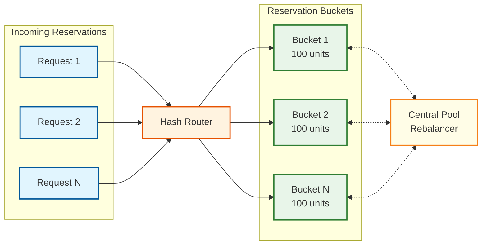

# Key Architectural Insights

## 1. Inventory Is an Event-Sourced Domain by Nature -- Every Unit Has a Provenance Chain

**Category:** System Modeling

**One-liner:** Inventory positions are derived state; the sequence of
movements (receive, transfer, pick, adjust) is the true source of truth.

**Why it matters:**

Most software systems store only current state -- when a user changes
their email, you overwrite the old one. Inventory is fundamentally
different. Every physical unit in a warehouse has a provenance: it was
received on a specific date, from a specific supplier, at a specific
per-unit cost, placed at a specific bin location. Every subsequent
touch -- a transfer to a different zone, a pick for an order, a cycle
count adjustment -- is a discrete event with business significance.
The current stock quantity at any location is merely a projection
derived from summing all inbound movements and subtracting all
outbound movements. Modeling inventory as mutable state (running
`UPDATE stock SET quantity = quantity - 1`) discards the causal chain
behind every change.

This is not an academic preference -- it is a regulatory and financial
requirement. SOX compliance demands a complete audit trail of inventory
changes with timestamps, actors, and authorization records. FDA
regulations (21 CFR Part 11) for pharmaceutical inventory require
electronic signatures on adjustments and full lot traceability. Even
outside regulated industries, any business carrying inventory needs to
answer point-in-time queries like "What was our total inventory
valuation on December 31?" or "How many units of SKU-4829 did we
receive from Supplier X in Q3?" These queries are trivial with an
event log and impossible with a mutable state table.

The architectural implication is that the movement event log is the
system of record. Every other data structure in the system -- stock
position tables, ATP caches, cost layer stacks, location heat maps --
is a read-model projection from that log. The event log enables
replay: if a cost layer calculation bug is discovered, fix the
projection logic and replay the event stream to produce corrected
valuations without touching the authoritative data.

```
EVENT LOG (source of truth)
  +---> Stock Position Projection (warehouse operations)
  +---> ATP Projection (e-commerce availability)
  +---> Cost Layer Projection (financial valuation)
  +---> Location Heat Map Projection (layout optimization)
```

The movement event log must be append-only, immutable, and durably
stored with replication. Corrections are modeled as new adjustment
movements referencing the original event, never as edits. This creates
a tamper-evident ledger satisfying auditors while enabling multiple
independent projections -- ATP for e-commerce, location view for
operations, cost view for finance -- each optimized for its queries.

The deeper lesson: recognize domains where history is intrinsic.
Inventory, financial transactions, healthcare records, and legal
documents all share this characteristic. When "why did this change?"
is as important as "what is the current value?", event sourcing is
the correct structural alignment between software and domain reality.

---

## 2. Reservation Is a Distributed Resource Allocation Problem -- Not a Database Lock

**Category:** Scalability

**One-liner:** Pre-partitioning inventory into reservation buckets
transforms a global lock Slowest part of the process into embarrassingly parallel
decrements.

**Why it matters:**

The naive approach to inventory reservation is straightforward: execute
a SELECT FOR UPDATE on the stock row, check if quantity_available > 0,
decrement, and release the lock. At 10 concurrent reservations per
second, the lock hold time (5-20ms) creates negligible contention. But
during a flash sale where 50,000 users simultaneously attempt to
reserve the same limited-edition product, this serialization point
caps throughput at approximately 1,000 TPS regardless of hardware.
The constraint is the serial nature of locking, not machine speed. No
amount of vertical scaling resolves a fundamentally serial Slowest part of the process.

The architectural insight is to reframe reservation as a distributed
resource allocation problem. Before the flash sale, pre-partition
10,000 available units into 100 buckets of 100 units each. Each bucket
is assigned to a stateless reservation worker. Incoming requests are
hash-routed (by session ID) to a specific bucket. Each worker
independently decrements its local counter without cross-bucket
coordination, transforming throughput from O(1) serial to O(N)
parallel. With 100 buckets, theoretical throughput reaches 100K TPS.



The trade-off is that the "available quantity" becomes eventually
consistent. When bucket #37 depletes, the global count is momentarily
inaccurate. This is acceptable for display -- showing "limited stock"
instead of an exact count. The critical Rule that never changes -- never over-selling
beyond total physical stock -- holds because each bucket's decrement
is strongly consistent within itself and the sum of all bucket
capacities equals total stock. Depleted buckets request rebalancing
from a central coordinator off the hot path.

This pattern generalizes to any hot counter with high concurrent
writes -- rate limiters, ticket sales, promotional code redemption.
The deeper lesson: when you identify a serialization Slowest part of the process,
decompose it into independent parallel operations. Reservation
bucketing is sharding applied to a single logical counter. Edge cases
require attention: bucket exhaustion (fallback routing when a
customer hits an empty bucket), rebalancing without new serialization
points, and TTL-based expiry returning units to the pool.

---

## 3. ATP Is a Materialized View Problem -- Not a Query Problem

**Category:** Performance

**One-liner:** Computing Available-to-Promise on every request by
querying raw inventory data is architecturally untenable at
e-commerce scale.

**Why it matters:**

Available-to-Promise (ATP) is the quantity that can be promised to a
customer. The formula is deceptively simple:

```
ATP = on_hand - reserved - allocated + in_transit
    + on_order_within_lead_time
```

For a single SKU at a single warehouse, this is a trivial multi-table
join taking ~10ms. At the scale of a large retailer -- 5M SKUs, 500
warehouses, 100K product page views per second -- executing that many
cross-table queries against the transactional database produces
latency far beyond the 50ms threshold for responsive product pages
and competes with the write workload, creating cascading degradation.

The solution is to treat ATP as a continuously maintained materialized
view. Every inventory event (receive, reserve, ship) triggers an async
update to a pre-computed ATP value in a distributed cache. The query
service reads from cache with single-digit millisecond latency. This
shifts computation from read-time (expensive, frequent) to write-time
(cheap, infrequent). With a typical read-to-write ratio of 1000:1,
this trade-off is enormously favorable.

A dedicated ATP Projector subscribes to the inventory event stream,
recalculates the affected SKU-warehouse ATP, and writes it to cache.
For network-level ATP, a second-level aggregator sums per-warehouse
values. Cache entries carry a version number to detect and discard
stale out-of-order updates. A periodic reconciliation job compares
cached values against the source-of-truth event log and corrects any
drift caused by missed events or processing failures.

The key design decision is staleness tolerance. ATP on product listing
pages can be 5-10 seconds stale -- the reservation service validates
against authoritative stock at checkout. This separation -- eventually
consistent for browsing, strongly consistent for commitment -- allows
the read and write paths to scale independently. The general principle
extends beyond inventory: any metric that is expensive to compute,
frequently read, and tolerant of bounded staleness is a candidate for
event-driven materialized views.

---

## 4. Cost Layers Are the Financial Backbone -- Getting Them Wrong Means Restating Earnings

**Category:** Data Structures

**One-liner:** Each purchase creates a cost layer, and the costing
method determines which layer is consumed first, directly impacting
COGS and company valuation.

**Why it matters:**

When a retailer purchases 1,000 units at $10 in January and 1,000 at
$12 in March, selling 500 units produces different COGS depending on
the method. Under FIFO (First-In-First-Out, like a line at a store), COGS = $5,000 (500 at $10). Under LIFO (Last-In-First-Out, like a stack of plates), COGS
= $6,000 (500 at $12). This $1,000 difference in a trivial example
scales to millions for large retailers and directly impacts gross
profit, tax liability, and stock price.
Getting the costing wrong is not just a data error -- it triggers
financial restatement, regulatory scrutiny, and loss of investor
confidence.

The data structure is a per-SKU ordered collection where each entry
contains receipt reference, receipt date, original quantity, remaining
quantity, and unit cost. FIFO (First-In-First-Out, like a line at a store) dequeues from the head (oldest first),
LIFO (Last-In-First-Out, like a stack of plates) from the tail (newest first), FEFO by earliest expiry date.
Weighted Average Cost (WAC) maintains a single blended cost
recalculated on each receipt:

```
new_wac = (existing_qty * existing_wac + received_qty * received_cost)
          / (existing_qty + received_qty)
```

The consumption operation must be atomic and handle partial layer
consumption correctly. Selling 1,500 units under FIFO (First-In-First-Out, like a line at a store) fully consumes
Layer 1 (1,000 at $10) and partially consumes Layer 2 (500 of 1,000
at $12). A crash between these updates corrupts cost data, requiring
transactional guarantees. Returns further complicate the model:
returned units must be added back to the correct cost layer or a new
layer at the original sale cost, depending on accounting policy.

```
FUNCTION consume_cost_layers(sku, quantity, method):
    IF method == FIFO (First-In-First-Out, like a line at a store):
        layers = GET layers ORDER BY receipt_date ASC
    ELSE IF method == LIFO (Last-In-First-Out, like a stack of plates):
        layers = GET layers ORDER BY receipt_date DESC
    ELSE IF method == FEFO:
        layers = GET layers ORDER BY expiry_date ASC

    total_cost = 0, remaining = quantity
    BEGIN TRANSACTION
        FOR layer IN layers:
            consumed = MIN(layer.remaining_qty, remaining)
            total_cost += consumed * layer.unit_cost
            layer.remaining_qty -= consumed
            remaining -= consumed
            IF remaining == 0: BREAK
        IF remaining > 0: RAISE InsufficientCostLayerError
    COMMIT TRANSACTION
    RETURN total_cost
```

Cost layers must be a first-class entity maintained in near-real-time
as a projection from the movement event stream. Computing on demand
turns month-end financial close into a multi-day batch job. Maintaining
cost layer state as a continuously updated projection enables real-time
valuation reports. The cost layer projector is among the most business-
critical components in the entire system.

For multi-tenant SaaS systems, different tenants may use different
costing methods, and some jurisdictions prohibit certain methods (LIFO (Last-In-First-Out, like a stack of plates)
is not permitted under IFRS). The system must support per-tenant,
per-SKU costing method configuration. Changing the costing method
mid-year requires a revaluation event that recalculates all cost
layers from the beginning of the fiscal period under the new method --
a rare but high-stakes operation the architecture must accommodate.

---

## 5. The Physical-Digital Gap Is the Fundamental Challenge -- Shrinkage Is a Feature, Not a Bug

**Category:** Domain Modeling

**One-liner:** System inventory will always diverge from physical
inventory; the architecture must embrace this gap rather than
pretending it does not exist.

**Why it matters:**

Every inventory system faces a fundamental tension: the digital record
says 100 units are in Bin A-14-3, but physical reality might be 97
because 1 was damaged during put-away and unreported, 1 was stolen,
and 1 was placed in the wrong bin. This divergence -- shrinkage -- is
not an Edge Case (Unusual or extreme situation). The National Retail Federation estimates annual
shrinkage at 1.4% of sales, exceeding $100 billion annually in the
US alone. A system assuming digital records perfectly reflect physical
reality produces phantom inventory (system says in stock, but it is
not there) leading to failed fulfillment and customer dissatisfaction.

The architectural response is cycle counting: continuous, statistical
sampling rather than periodic full-warehouse counts. The system must
support multiple counting strategies:

| Strategy | Description | When to Use |
|----------|-------------|-------------|
| ABC classification | Count frequency by value and velocity | Ongoing accuracy |
| Zone-based | Rotate through warehouse zones | Even location coverage |
| Triggered counting | Auto-schedule on anomaly detection | Reactive to discrepancies |
| Blind counting | Operator cannot see system quantity | Prevents confirmation bias |

A-items (top 20% by revenue impact) are counted weekly or monthly,
B-items quarterly, C-items annually. Triggered counting fires when a
picker reports an empty bin that the system shows stocked, or when
adjustment rates for a SKU exceed normal variance.

When a cycle count reveals variance, the system executes a structured
reconciliation. Variances within threshold (e.g., 2% or $50) auto-
adjust with a CYCLE_COUNT_ADJUSTMENT movement event, consuming the
appropriate cost layers. Variances exceeding threshold generate an
investigation task requiring supervisor verification, root cause
identification (shrinkage, receiving error, mis-pick, damage), and
explicit approval. Every adjustment feeds analytics: consistent
negative variances at a location may indicate systemic issues like
poor lighting, access control gaps, or receiving process failures.

The adjustment's financial impact is significant. A -5 unit adjustment
is a write-off that reduces inventory asset value and increases
shrinkage expense on the income statement. The cost layers of "lost"
units must be consumed per the configured costing method and posted to
the general ledger. This ties back to Insight #1 (event sourcing) and
Insight #4 (cost layers): the adjustment creates a movement event that
triggers cost layer consumption in the costing projection.

The broader lesson: any system modeling physical reality must include
a calibration mechanism. GPS has differential correction, sensor
networks have calibration routines, inventory has cycle counting.
Designing for this gap from the start -- safety buffers in ATP,
shrinkage provisions in financial projections, continuous counting
workflows -- produces a system robust to physical-world messiness.

---

## 6. Multi-Warehouse Fulfillment Is an Optimization Problem with Competing Objectives

**Category:** Algorithms

**One-liner:** Choosing which warehouse fulfills which order involves
minimizing shipping cost, maximizing freshness, balancing utilization,
and maintaining service levels -- simultaneously.

**Why it matters:**

When a customer orders a product available in multiple warehouses, the
naive approach -- pick the nearest -- optimizes a single dimension
while ignoring others. Fulfillment routing involves at least five
competing objectives: minimize shipping cost/time, maximize freshness
(oldest stock for FEFO/FIFO (First-In-First-Out, like a line at a store) rotation), balance utilization across the
network, prefer complete-order fulfillment (avoid split shipments),
and maintain safety stock levels (do not drain a warehouse below its
reorder point).

These objectives frequently conflict. The nearest warehouse might have
the newest stock, peak utilization, and below-threshold stock levels.
The routing engine weighs objectives according to configurable
business priorities using a scoring function:

```
FUNCTION score_warehouse(warehouse, order):
    dist_score   = normalize(1 / shipping_distance(warehouse, order.dest))
    fresh_score  = normalize(oldest_stock_age(warehouse, order.sku))
    util_score   = normalize(1 - warehouse.current_utilization)
    compl_score  = 1.0 IF can fulfill entire order ELSE 0.5
    health_score = normalize(warehouse.stock - warehouse.reorder_point)

    RETURN w1 * dist_score + w2 * fresh_score
         + w3 * util_score + w4 * compl_score
         + w5 * health_score
```

Weights vary by product category (perishables weight freshness), by
season (holidays weight utilization balancing), and by business context
(promotions weight cost minimization). This configurability is
essential because fulfillment priorities shift constantly.

The general case is NP-hard (a facility assignment variant). For
individual orders, the scoring function is fast. For batch
optimization -- routing thousands of orders simultaneously -- the
problem requires linear programming relaxations, greedy heuristics, or
constraint satisfaction solvers. The batch optimizer runs periodically,
producing a fulfillment plan. Tight-SLA orders bypass batch and route
immediately via the greedy scorer.

The fulfillment routing engine should be a pluggable strategy with a
clean interface: given an order and candidate warehouses, return a
ranked list of fulfillment options with scores. This allows swapping
strategies without modifying the core inventory system and enables A/B
testing -- route halves of traffic through different strategies,
measure shipping cost, speed, and split-shipment rate. Small routing
improvements compound across millions of orders.

If the selected warehouse cannot fulfill (stock discrepancy during
picking), the system must re-route within seconds. The scoring
function should pre-compute next-best alternatives at original routing
time rather than recomputing during failure recovery. This adds modest
memory overhead but provides critical resilience when physical reality
deviates from digital records -- which, as Insight #5 establishes, is
not a question of "if" but "when."

---

## 7. Channel Allocation Is a Zero-Sum Game That Requires Dynamic Rebalancing, Not Static Percentages

**Category:** Contention

**One-liner:** Statically allocating 70% of ATP to e-commerce and
30% to wholesale seems reasonable until a wholesale customer places
an unusually large order that exceeds their allocation while e-commerce
inventory sits idle -- revealing that fixed-percentage channel
allocation creates artificial stock-outs in one channel while
inventory is available in another.

**Why it matters:**

Multi-channel retailers face a resource allocation problem: the same
physical inventory serves e-commerce customers, wholesale buyers,
retail stores, and marketplace channels. The naive approach assigns
fixed percentages of ATP to each channel. This creates a paradox: the
allocation that looks optimal based on historical demand ratios
becomes suboptimal the moment actual demand deviates from historical
averages -- which is every day.

The core issue is that channel allocation is a zero-sum game. Every
unit allocated to e-commerce is one unit unavailable to wholesale.
Static allocation optimizes for the expected case but fails on
variance. During a B2B customer's quarterly reorder (large, infrequent
wholesale orders), the wholesale allocation may be insufficient while
the e-commerce allocation has a surplus. The customer is told "out of
stock" while the warehouse holds plenty of the product.

The production solution implements dynamic channel rebalancing with
configurable rules:

```
Dynamic channel allocation:
  Base allocation:
    ecommerce: 60%, wholesale: 25%, retail: 10%, buffer: 5%

  Rebalancing triggers (evaluated every 15 minutes):
    IF channel.used_pct > 90% AND other_channels.avg_used_pct < 50%:
      Borrow up to 20% from lowest-utilized channel
    IF channel.used_pct < 20% AND other_channels have pending demand:
      Release up to 30% of unused allocation to shared pool

  Hard constraints:
    No channel drops below 10% allocation (prevents complete starvation)
    Buffer pool (5%) available to any channel on first-come basis
    Wholesale orders > 500 units bypass allocation (checked against total ATP)
```

The buffer pool is architecturally significant: it absorbs demand
spikes without requiring rebalancing. For normal fluctuations, the
buffer handles the variance. For larger shifts, the rebalancing engine
adjusts allocations. The combination of static base allocation,
dynamic rebalancing, and a shared buffer creates a system that is
responsive to real-time demand while preventing any single channel
from monopolizing inventory.

The deeper lesson: any time a shared resource is partitioned among
competing consumers with variable demand, static allocation creates
artificial scarcity. The same pattern appears in database connection
pools (per-service allocation), API rate limits (per-tenant quotas),
and compute resources (per-team budgets). The solution is always the
same: a base allocation for predictability, dynamic rebalancing for
responsiveness, and a shared buffer for spike absorption.

---

## 8. Lot Traceability Is Not a Reporting Feature -- It Is a Real-Time Recall Execution System

**Category:** Compliance

**One-liner:** When the FDA issues a Class I recall affecting a specific
lot of a food or pharmaceutical product, the system must identify
within hours every warehouse location holding that lot, every order
that shipped containing that lot, and every customer who received it --
making lot traceability a time-critical operational system, not a
historical reporting convenience.

**Why it matters:**

Most inventory systems implement lot tracking as a data field on the
inventory record: lot_number is stored alongside quantity and location.
Querying "where is lot L-2024-0892?" returns the current positions.
This seems adequate until a recall event requires answering a cascade
of questions in hours, not days:

1. **Where is the lot now?** Which warehouse locations, in what
   quantities? (Requires current position query)
2. **Where has the lot been?** Full movement history from receipt
   through every transfer, pick, and adjustment. (Requires event log
   traversal)
3. **Who received it?** Which customer orders contained this lot, and
   have they been shipped? Delivered? (Requires forward trace through
   fulfillment chain)
4. **Can we stop shipments?** Are there pick tasks, packed orders, or
   shipments in transit that contain this lot? (Requires real-time
   status across fulfillment pipeline)
5. **What is the financial impact?** Total cost of recalled inventory
   for write-off provisioning. (Requires cost layer lookup)

Answering all five questions in under 2 hours requires pre-indexed
traceability, not ad-hoc queries. The movement event log must be
indexed by lot_number for rapid traversal. The fulfillment pipeline
must support lot-level hold — instantly blocking any in-progress pick,
pack, or ship operation involving the recalled lot.

The FDA's FSMA Section 204 (effective January 2026) requires certain
food products to maintain records enabling tracing within 24 hours.
The EU's General Food Law requires "one step forward, one step back"
traceability. Pharmaceutical serialization regulations (DSCSA in the
US, FMD in the EU) require unit-level traceability for individual
packages.

The architectural implication is that lot_number is not just a field
on the inventory position table -- it is a first-class entity that
participates in every movement, reservation, pick task, and shipment
record. The traceability query must be pre-computed as a materialized
view (lot → movements → orders → customers) that can be queried in
seconds, not minutes. The cost of maintaining this view on every
movement is small; the cost of a slow recall response (continued
distribution of recalled product, regulatory penalties, brand damage)
is enormous.

---

## 9. The Warehouse Is a Spatial Data Structure -- Pick Path Optimization Is a Graph Traversal Problem

**Category:** Algorithms

**One-liner:** The warehouse floor plan is an implicit graph where
nodes are pick locations and edges are travel paths between them,
and optimizing picker routes through this graph -- visiting all
required locations with minimal total travel -- is a variant of the
Traveling Salesman Problem that is solved approximately in practice
using Practical rule of thumb routing strategies.

**Why it matters:**

In a large warehouse with 50,000 pick locations and pickers handling
200+ picks per shift, travel time between locations accounts for
40-60% of the picker's total time. The remaining time is actual
picking (reaching, grabbing, scanning). Reducing travel time by even
10% across a 500-picker operation saves thousands of labor-hours per
month. The naive approach -- visiting locations in the order they
appear on the pick list -- results in backtracking and inefficient
traversal.

The warehouse layout creates a graph structure:

```
Warehouse graph model:
  Nodes: pick locations (bin addresses)
  Edges: walkable paths between locations
  Edge weights: distance in meters (or time in seconds)

Common Practical rule of thumb strategies:
  S-SHAPE: Traverse entire aisle before moving to next
    Pro: Simple, no computation needed
    Con: Picker walks full aisle even for 1 pick in it

  RETURN: Enter aisle, pick, return to main aisle
    Pro: Avoids unnecessary traversal of deep aisles
    Con: May backtrack for picks at far end

  MIDPOINT: Enter from nearest end, pick up to midpoint only
    Pro: Reduces unnecessary traversal of sparse aisles
    Con: May skip picks past midpoint (requires second pass)

  LARGEST GAP: Identify largest gap between consecutive picks
    in an aisle, split traversal at that gap
    Pro: Optimal for sparse pick sets
    Con: Computation cost per wave

  OPTIMAL: Solve TSP for exact minimum-distance route
    Pro: Provably shortest path
    Con: NP-hard; feasible only for < 20 locations per trip
```

The production system uses a hybrid: for waves with fewer than 15
pick locations, compute the optimal route via dynamic programming.
For larger waves, use the largest-gap Practical rule of thumb, which empirically
achieves within 5-10% of optimal for typical warehouse layouts. The
pick sequence number on each location is pre-computed based on the
warehouse layout graph and the chosen traversal strategy, enabling
the wave planner to generate sorted pick lists in milliseconds.

The graph model extends to multi-level warehouses (elevators and
mezzanines add vertical edges), automated storage/retrieval systems
(ASRS bots have different traversal costs than human pickers), and
zone-based picking (the graph is partitioned into zones, and each
picker's route is confined to their zone with a merge operation at
the consolidation point).

---

## 10. Inventory Valuation at Month-End Is a Snapshot Problem That Event Sourcing Solves Elegantly

**Category:** Consistency

**One-liner:** Financial regulations require inventory valuation as of a
specific instant (midnight on the last day of the period), but
inventory operations continue 24/7 -- event sourcing enables
point-in-time valuation by replaying events up to the target timestamp
without halting warehouse operations.

**Why it matters:**

Period-end inventory valuation is a regulatory requirement: the
balance sheet must report the total value of inventory assets as of a
specific date. The naive approach -- running a valuation query at
midnight on the last day of the month -- produces inaccurate results
because: (1) receipts and shipments may be in-flight at midnight with
unclear cutoff treatment, (2) the query itself takes time to execute,
during which new transactions modify the data, and (3) different time
zones may cause disagreement about when "midnight" is.

Without event sourcing, the only way to get a consistent valuation is
to freeze the database (stop all writes) while running the report.
This is operationally disastrous for a 24/7 warehouse. With event
sourcing, the valuation is computed by replaying all movement events
up to the cutoff timestamp and summing the resulting cost layers. The
event log is immutable; the replay produces the same result regardless
of when it runs. Operations continue uninterrupted because the
valuation reads from the historical event log, not from the live
write store.

The cutoff treatment for in-flight transactions follows a clear rule:
the event's timestamp determines its period. A receipt event with
timestamp 2024-12-31T23:59:58 is included in December's valuation.
A receipt event with timestamp 2025-01-01T00:00:02 is included in
January's. In-transit inventory (shipped from source but not received
at destination) is valued at the source's cost and included in the
sender's valuation until the transfer-in event is recorded.

The valuation replay can also be used for what-if analysis: "What
would our December valuation have been under LIFO (Last-In-First-Out, like a stack of plates) instead of FIFO (First-In-First-Out, like a line at a store)?"
Replay the same event sequence with a different costing method. This
is trivial with event sourcing and impossible with a mutable state
database.

---

## 11. Safety Stock Is Not a Buffer -- It Is Insurance Premium Calculated from Demand Uncertainty and Stockout Cost

**Category:** Cost Optimization

**One-liner:** Setting safety stock to "2 weeks of average demand" for
every SKU ignores the enormous variation in demand uncertainty and
stockout consequences across products -- a ₹10 commodity with stable
demand needs almost no safety buffer, while a ₹500 product with
volatile demand and high stockout cost justifies weeks of buffer.

**Why it matters:**

Safety stock exists to absorb demand variability and supply
uncertainty during the replenishment lead time. The textbook formula
uses a service-level z-score multiplied by demand standard deviation
and the square root of lead time: `SS = z * σ_d * √LT`. But this
formula assumes the target service level is the same for every SKU,
which is economically suboptimal.

The actual cost-optimal safety stock balances two competing costs:
holding cost (the expense of carrying extra inventory: capital,
warehousing, obsolescence risk) and stockout cost (lost sales, lost
customers, expedited shipping to fulfill from alternative sources).
For a high-margin product with loyal customers who will buy from a
competitor if out of stock, the stockout cost is high and justifies
higher safety stock. For a low-margin commodity with many substitutes,
the stockout cost is low and excess inventory destroys margin.

```
Cost-optimal safety stock:
  stockout_cost = lost_margin + expedite_cost + customer_loss_value
  holding_cost  = unit_cost * holding_rate * time_in_stock

  optimal_service_level = function of (stockout_cost / holding_cost)
  -- Higher ratio → higher service level → more safety stock

  Per-SKU service level targets:
    A-items (high revenue, high margin):  99% → z = 2.33
    B-items (moderate):                   95% → z = 1.65
    C-items (low revenue, low margin):    90% → z = 1.28
    New products (uncertain demand):      97% → z = 1.88
    End-of-life (declining demand):       85% → z = 1.04
```

The deeper lesson is that safety stock is an economic decision, not an
inventory decision. Setting it uniformly across SKUs wastes capital on
low-risk items while under-protecting high-risk items. The IMS must
support per-SKU (or per-SKU-category) service level targets, demand
uncertainty parameters, and cost assumptions, all feeding into a
dynamic safety stock calculation that adjusts as demand patterns and
costs change.

---

## 12. The Write Amplification Problem in Event-Sourced Inventory Makes Projection Strategy a Scaling Decision

**Category:** Scaling

**One-liner:** A single stock receipt event triggers updates across 5+
projections (ATP cache, stock snapshot, cost ledger, location heat
map, analytics aggregate), creating a 5x write amplification factor
that makes the projection architecture -- not the write path -- the
actual scalability Slowest part of the process for high-throughput inventory systems.

**Why it matters:**

Event sourcing's core value proposition -- multiple read models from
a single event stream -- has a hidden cost: every write to the event
log triggers N downstream projection updates, where N is the number
of materialized views. For an inventory system with 5 projections,
each inventory movement event (receipt, pick, adjust) generates 5
downstream writes. At 50,000 movement events per hour (a moderately
busy warehouse), the projection layer executes 250,000 writes per
hour. At scale (500 warehouses, 25M events/hour), projections must
handle 125M writes/hour.

This write amplification means the projection layer, not the event
store, is the true throughput Slowest part of the process. Each projection also has
different consistency and latency requirements:

| Projection | Write Cost | Latency Budget | Can Batch? |
|---|---|---|---|
| ATP Cache | Low (single key update) | < 1 second | No (real-time) |
| Stock Snapshot | Medium (multi-row update) | < 5 seconds | Yes (100ms batches) |
| Cost Ledger | High (multi-layer update) | < 30 seconds | Yes (1s batches) |
| Location Heat Map | Low (counter increment) | < 1 minute | Yes (10s batches) |
| Analytics | Medium (aggregation update) | < 5 minutes | Yes (60s batches) |

The optimization strategy exploits these different latency budgets.
ATP projection runs synchronously after event append (sub-second
freshness required for e-commerce). Cost ledger projection batches
events in 1-second micro-batches (financial reporting tolerates 30s
staleness). Analytics projection processes in 60-second windows
(dashboard users expect minute-level freshness, not second-level).

Batching reduces the effective write amplification: instead of 5
writes per event, the system executes 1 write per event (ATP) + 4
batched writes per batch interval. At 1000 events/second with 1s
batching, the real-time write load is 1000/s (ATP) + 4 batched
writes/s = 1004/s total, versus 5000/s without batching -- a 5x
reduction in write IOPS at the cost of bounded staleness for
non-critical projections.

---

## Cross-Cutting Themes

| Theme | Insights |
|---|---|
| Physical-digital alignment | 1 (event-sourced provenance), 5 (shrinkage), 8 (lot traceability) |
| Financial precision | 4 (cost layers), 10 (month-end valuation), 11 (safety stock optimization) |
| Scalability constraints | 2 (reservation partitioning), 3 (ATP materialization), 12 (write amplification) |
| Multi-facility complexity | 6 (fulfillment routing), 7 (channel allocation) |
| Regulatory compliance | 8 (lot traceability / recall), 10 (period-end valuation) |
| Algorithms in warehousing | 6 (multi-objective optimization), 9 (pick path / TSP) |
