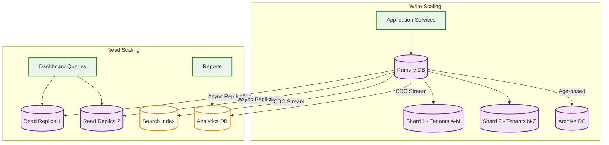
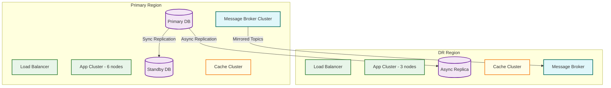
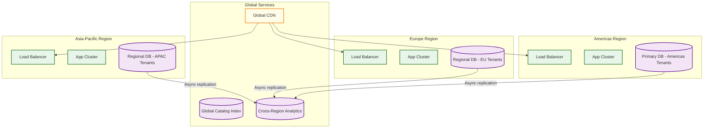
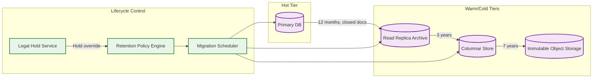

# Scalability & Reliability

## Scalability

### Horizontal vs Vertical Scaling Decisions

| Component | Scaling Type | Strategy | Trigger |
|-----------|-------------|----------|---------|
| **API Gateway** | Horizontal | Stateless; add instances behind load balancer | CPU > 60% or QPS > threshold |
| **Requisition Service** | Horizontal | Stateless; tenant-sharded routing | Request queue depth > 100 |
| **Approval Engine** | Horizontal | Stateless evaluation; state in DB | Approval task backlog > 1000 |
| **Matching Engine** | Horizontal | Embarrassingly parallel; partition by vendor | Invoice batch queue depth |
| **Auction Engine** | Vertical + Horizontal | Stateful WebSocket connections; session-affinity routing | Active auction count; concurrent bidders |
| **Budget Service** | Horizontal (with care) | Hot-path caching per instance; DB serialization point | Budget check latency p99 > 500ms |
| **Catalog Search** | Horizontal | Search engine cluster scaling; add shards/replicas | Query latency p95 > 300ms |
| **Relational DB** | Vertical (primary) + Horizontal (read replicas) | Primary for writes; read replicas for dashboards and analytics | Write latency > 50ms; read replica lag > 5s |
| **Event Bus** | Horizontal | Add partitions for high-volume topics | Consumer lag > 10K messages |

### Database Scaling Strategy

#### Write Path Optimization



- **Sharding strategy**: Shard by `tenant_id` using consistent hashing. Large tenants (> 1M POs/year) get dedicated shards. Smaller tenants are co-located.
- **Archive strategy**: POs older than 7 years (post-audit-retention period) are moved to cold archive storage. Archived data is queryable through a separate archive API with relaxed latency SLOs.
- **CDC (Change Data Capture)**: Database changes stream to search indexes and analytics databases via CDC, ensuring read-path stores are eventually consistent without application-level dual-writes.

#### Read Path Optimization

- **Read replicas**: 2--3 replicas per shard for dashboard queries, report generation, and catalog browsing
- **Materialized views**: Pre-computed views for common queries:
  - `my_pending_approvals` (per user)
  - `open_pos_by_vendor` (per vendor)
  - `budget_utilization_summary` (per cost center)
  - `matching_exception_dashboard` (per AP clerk)
- **Search index**: Full-text search engine for catalog items, vendor search, PO search by number/description
- **Analytics database**: Columnar store for spend analytics, pre-aggregated by vendor/category/time dimensions

### Caching Layers

| Layer | Content | TTL | Invalidation | Hit Rate |
|-------|---------|-----|-------------|----------|
| **L1 - In-process** | Tenant configuration, approval rules, tolerance rules | 5 min | Config-change event | > 99% |
| **L2 - Distributed cache** | Budget balances, vendor profiles, popular catalog items | 30s--5 min | Event-driven invalidation | > 90% |
| **L3 - Search cache** | Catalog search results, vendor search results | 10 min | Catalog update event | > 80% |
| **L4 - CDN** | Static assets, report PDFs, contract documents | 1 hour | Purge on update | > 95% |

### Hot Spot Mitigation

| Hot Spot | Cause | Mitigation |
|----------|-------|------------|
| **CFO approval queue** | CFO is in approval chain for all POs > $100K | Delegation rules: auto-delegate to VP of Finance for $100K--$500K; CFO only reviews > $500K |
| **Central budget cost center** | Shared services cost center used by many departments | Budget slice pre-allocation: distribute budget into per-department sub-allocations |
| **Month-end invoice batch** | Vendors dump all invoices on last day of month | Staggered processing: prioritize by vendor SLA and amount; rate-limit batch ingestion |
| **Catalog search for common items** | "Office supplies" searched by thousands daily | Cached trending items per tenant; pre-populated search suggestions |

---

## Reliability & Fault Tolerance

### Single Points of Failure (SPOF) Identification

| Component | SPOF Risk | Mitigation |
|-----------|-----------|------------|
| **Primary Database** | Loss of write capability for all services | Synchronous standby with automatic failover (< 30s RTO); WAL archiving to object storage |
| **Approval Engine** | All approvals blocked; procurement pipeline stalls | Multiple instances behind load balancer; approval state in DB, not in-memory |
| **Event Bus** | Cross-service communication fails; matching and analytics lag | Multi-broker cluster with replication factor 3; dead-letter queue for failed processing |
| **Budget Service** | Cannot validate budget; all requisitions blocked | Cached budget balances enable degraded-mode approvals with post-facto reconciliation |
| **Auction Engine** | Active auctions disrupted; bid integrity compromised | Session state persisted to DB every bid; recovery replays from last persisted state |
| **HSM (Sealed Bids)** | Cannot encrypt/decrypt sealed bids | HSM cluster with N+1 redundancy; backup keys in disaster recovery HSM |

### Redundancy Strategy



### Failover Mechanisms

| Scenario | Detection | Failover | Recovery Time |
|----------|-----------|----------|---------------|
| **Primary DB failure** | Health check failure × 3 consecutive | Promote synchronous standby to primary; update connection strings via service discovery | < 30 seconds |
| **Application node crash** | Load balancer health check | Remove from pool; other nodes absorb traffic; auto-scale replacement | < 10 seconds (detection) |
| **Cache cluster failure** | Connection error rate > 50% | Bypass cache; increase DB connection pool; DB absorbs read load | < 5 seconds (fallback) |
| **Event bus partition failure** | Consumer lag spike; producer timeout | Route to surviving partitions; rebalance consumers | < 60 seconds |
| **Full region failure** | Multi-signal: DNS health, region health API | DNS failover to DR region; promote async replica; accept potential data loss for last ~30s of transactions | < 15 minutes (manual trigger) |

### Circuit Breaker Patterns

```
CIRCUIT_BREAKERS:
    vendor_dispatch:
        description: "PO dispatch to vendor systems (cXML/EDI)"
        failure_threshold: 5 failures in 60 seconds
        open_duration: 120 seconds
        half_open_probes: 3
        fallback: Queue PO for retry; notify buyer

    external_screening:
        description: "Sanctions/compliance screening API"
        failure_threshold: 3 failures in 30 seconds
        open_duration: 300 seconds
        fallback: Mark vendor as "screening_pending"; allow
                  onboarding to continue with manual review flag

    budget_service:
        description: "Budget check operations"
        failure_threshold: 10 failures in 30 seconds
        open_duration: 60 seconds
        fallback: Use cached budget balance; flag transaction
                  for post-facto reconciliation

    catalog_search:
        description: "Catalog search engine"
        failure_threshold: 5 failures in 30 seconds
        open_duration: 60 seconds
        fallback: Return cached popular items; display
                  "search temporarily limited" message
```

### Retry Strategies

| Operation | Retry Strategy | Max Retries | Backoff | Idempotency |
|-----------|---------------|-------------|---------|-------------|
| PO dispatch to vendor | Exponential with jitter | 5 | 1s, 2s, 4s, 8s, 16s | PO number is idempotency key |
| Invoice matching | Fixed interval | 3 | 5 seconds | Match attempt ID |
| Budget encumbrance | Immediate retry | 2 | No backoff (lock contention) | Document ID + event type |
| Notification delivery | Exponential | 4 | 30s, 60s, 120s, 300s | Notification ID |
| Compliance screening | Exponential | 3 | 60s, 300s, 900s | Vendor ID + screening type |

### Graceful Degradation Tiers

| Tier | Condition | Degraded Behavior |
|------|-----------|-------------------|
| **Tier 1 - Healthy** | All systems nominal | Full functionality |
| **Tier 2 - Elevated** | Search engine degraded | Disable catalog search typeahead; serve cached results only; allow free-text requisitions |
| **Tier 3 - Partial** | Budget service degraded | Allow requisition creation with cached budget check; flag for reconciliation; disable hard budget blocks |
| **Tier 4 - Emergency** | Primary DB under stress | Read-only mode for dashboards; queue new requisitions for deferred processing; disable analytics queries |
| **Tier 5 - Critical** | Multiple service failures | Accept PO amendments and approvals via email gateway only; queue all operations for processing when services recover |

---

## Disaster Recovery

### Recovery Objectives

| Metric | Target | Justification |
|--------|--------|---------------|
| **RTO (Recovery Time Objective)** | 4 hours for full service; 30 minutes for core operations | Procurement is business-critical but not real-time; 4-hour recovery window acceptable for most enterprises |
| **RPO (Recovery Point Objective)** | 30 seconds for transactional data; 1 hour for analytics | Async replication to DR region every 30s; analytics can be rebuilt from event stream |

### Backup Strategy

| Data Type | Backup Method | Frequency | Retention | Storage |
|-----------|--------------|-----------|-----------|---------|
| **Database (full)** | Physical backup | Daily | 30 days | Object storage (cross-region) |
| **Database (incremental)** | WAL shipping | Continuous | 7 days of WAL | Object storage |
| **Event bus** | Topic snapshots | Every 6 hours | 90 days | Object storage |
| **Document store** | Snapshot | Daily | 1 year | Object storage |
| **Attachments** | Cross-region replication | Real-time | Lifecycle policy (7 years for financial docs) | Object storage |
| **Tenant configuration** | Git-based version control | On every change | Indefinite | Git repository |

### Multi-Region Considerations

- **Active-Passive**: Primary region handles all traffic; DR region maintains warm standby with async-replicated data
- **Why not Active-Active**: Procurement workflows require strong consistency for budget encumbrance and approval chain integrity. Split-brain scenarios between regions could lead to double-encumbrance or conflicting approval decisions. The complexity of distributed consensus across regions does not justify the marginal availability improvement for a B2B system.
- **Regional data residency**: Some tenants require data to remain within specific geographic boundaries (EU data in EU region). These tenants are assigned to region-specific database clusters with no cross-border replication.
- **DR testing**: Quarterly DR drills simulate region failure; validate RTO/RPO compliance; verify zero data loss in failover

### Geographic Distribution for Global Enterprises



| Consideration | Approach |
|---------------|----------|
| **Tenant-to-region assignment** | Tenants assigned to region based on primary business location; configurable for compliance requirements |
| **Cross-region vendor data** | Global vendor records replicated to all regions; vendor scoring is region-local (based on that region's transaction history) |
| **Cross-region spend analytics** | Aggregated asynchronously in global analytics store; eventual consistency acceptable for dashboards |
| **Cross-region approvals** | Approval chain execution is region-local; if approver is in a different region, notification routed cross-region but approval action executes in document's home region |
| **Catalog federation** | Each region maintains its own search index; cross-region catalog queries routed to origin region for punch-out catalogs |

---

## Data Lifecycle Management

### Document Archival Strategy

Procurement documents have regulatory retention requirements that vary by jurisdiction and document type. The system implements a tiered lifecycle:

```
DOCUMENT LIFECYCLE TIERS:

Tier 1 — Hot (0-12 months):
    Storage: Primary relational database + distributed cache
    Access: Full CRUD, sub-second queries
    Documents: Active POs, open requisitions, pending invoices, current budgets

Tier 2 — Warm (1-3 years):
    Storage: Read replica with compressed tablespaces
    Access: Read-only, < 2 second queries
    Documents: Closed POs, matched invoices, expired contracts, completed RFQs

Tier 3 — Cold (3-7 years):
    Storage: Columnar archive database with object storage for attachments
    Access: Read-only, < 30 second queries via archive API
    Documents: All financial records within regulatory retention window

Tier 4 — Frozen (7+ years):
    Storage: Immutable object storage with legal hold capability
    Access: On-demand restoration (minutes to hours)
    Documents: Records under litigation hold or extended regulatory retention
```

### Archival Migration Process



Key constraints for archival:
- **Referential integrity preservation**: When archiving a PO, all related GRNs, invoices, match records, and approval tasks must be archived together as a unit
- **Legal hold override**: Documents under litigation hold are exempt from archival transitions regardless of age
- **Audit trail co-location**: Audit log entries for a document travel with it across tiers, ensuring complete traceability at every tier

---

## Load Testing Strategy

### Test Scenarios

| Scenario | Description | Target Load | Success Criteria |
|----------|-------------|-------------|------------------|
| **Steady state** | Normal business-hours traffic across all services | 120 QPS | p99 < 1s for all APIs; 0% error rate |
| **Quarter-end surge** | 5-8x spike in requisitions, approvals, and matching | 600-960 QPS | p99 < 3s; < 0.1% error rate; no budget inconsistencies |
| **Year-end budget flush** | 8-10x spike concentrated in requisition creation and budget checking | 1200 QPS (budget checks) | Budget check p99 < 1s; zero over-encumbrance |
| **Invoice batch bomb** | Single large vendor submits 50K invoices in one batch file | 50K invoices / 30 min | Matching throughput > 28/sec; no queue overflow |
| **Reverse auction peak** | 500+ concurrent bidders in a single auction | 10K WebSocket connections | Bid acknowledgment p99 < 200ms; zero bid ordering errors |
| **Tenant onboarding storm** | 10 new large tenants onboarded simultaneously | Full catalog import + vendor migration | < 4 hours per tenant; no cross-tenant data leakage |

### Load Testing Anti-Patterns for Procurement

- **Do not use production budget data**: Over-encumbrance during load testing against production is a SOX finding. Always use isolated test budgets.
- **Do not skip approval chain validation**: Load tests that bypass approval routing miss the hottest code path. Test the full approval chain including rule evaluation.
- **Do not ignore fiscal period boundaries**: Load tests that run at month-end may interact with real period-close processes if not isolated.

---

## Chaos Engineering

### Fault Injection Experiments

| Experiment | Injection | Expected Behavior | Verification |
|------------|-----------|-------------------|--------------|
| **Budget service latency** | Add 5s latency to budget check calls | Requisitions use cached budget check; flag for reconciliation | Zero over-encumbrance after reconciliation |
| **Primary DB failover** | Kill primary database instance | Standby promotes within 30s; write traffic resumes | Zero lost POs or approval decisions; verify WAL continuity |
| **Event bus partition loss** | Drop 1 of 3 event bus partitions | Consumers rebalance to surviving partitions; events re-processed | No duplicate PO creations; no lost invoice match events |
| **Cache cluster eviction storm** | Flush all cache entries simultaneously | Services fall back to database reads; increased DB load | p99 < 5s during cache warm-up; no incorrect budget balances |
| **Matching engine crash** | Kill all matching engine instances | Invoices queue in event bus; no data loss | Full recovery when engines restart; all queued invoices processed |
| **HSM connectivity loss** | Block network to HSM cluster | Sealed bid operations fail gracefully; non-sealed operations continue | No bid decryption outside opening window; clear error messages |
| **DNS failover** | Simulate primary region DNS failure | Traffic routes to DR region within TTL window | Verify RPO < 30s data loss; verify RTO < 15 minutes |

### Steady-State Hypothesis

Before each experiment, define the steady state:
- Budget Rule that never changes holds: `allocated = soft_encumbered + hard_encumbered + actual_spent + available` for every budget period
- Approval chain integrity: every approved document has a complete, unbroken chain from first step to final approval
- Match accuracy: no invoice is matched to a PO line that has already been fully matched
- Audit continuity: hash chain in audit log is unbroken

---

## Connection Pool Management

| Service | Pool Size | Min Idle | Max Wait | Validation |
|---------|-----------|----------|----------|------------|
| **Requisition Service → Primary DB** | 20 per instance | 5 | 3s | Test-on-borrow with lightweight query |
| **Matching Engine → Primary DB** | 30 per instance | 10 | 5s | Test-on-borrow (matching holds row locks) |
| **Budget Service → Primary DB** | 15 per instance | 5 | 2s | Test-on-borrow (latency-sensitive) |
| **Catalog Service → Search Engine** | 25 per instance | 5 | 3s | Cluster health check |
| **All Services → Cache Cluster** | 50 per instance | 10 | 1s | PING on borrow |
| **Event Bus Consumers** | 3 consumers per partition | N/A | N/A | Consumer group health monitoring |

Pool sizing rationale: Budget Service uses smaller pools because each connection holds row-level locks during encumbrance operations---too many concurrent connections increase deadlock probability without improving throughput.

---

## Auto-Scaling Policies

| Component | Scale-Out Trigger | Scale-In Trigger | Min Instances | Max Instances | Cooldown |
|-----------|------------------|-----------------|---------------|---------------|----------|
| **API Gateway** | CPU > 60% for 3 min | CPU < 30% for 10 min | 3 | 20 | 60s |
| **Requisition Service** | Request queue > 100 for 2 min | Queue < 20 for 10 min | 3 | 15 | 90s |
| **Approval Engine** | Pending tasks > 1000 for 5 min | Pending < 200 for 15 min | 3 | 12 | 120s |
| **Matching Engine** | Invoice queue > 5000 for 2 min | Queue < 500 for 10 min | 3 | 30 | 60s |
| **Catalog Search** | Search p95 > 500ms for 3 min | p95 < 200ms for 10 min | 3 | 10 | 120s |
| **Budget Service** | Check latency p99 > 500ms | p99 < 200ms for 10 min | 3 | 8 | 90s |

**Pre-scheduled scaling**: In addition to reactive triggers, the system pre-scales 2x for the last 5 business days of each quarter and 3x for the last 5 business days of the fiscal year, based on historical calendar patterns.

---

## Capacity Planning Model

```
FUNCTION estimate_capacity(tenant_count, avg_users_per_tenant):
    total_users = tenant_count * avg_users_per_tenant
    dau = total_users * 0.20
    peak_multiplier = 5  // quarter-end spike

    // Compute requirements
    api_qps_avg = dau * 20 / 28800  // 20 operations per user per day in 8-hour window
    api_qps_peak = api_qps_avg * peak_multiplier

    app_nodes = CEIL(api_qps_peak / 1000)  // 1000 QPS per node
    read_replicas = CEIL(api_qps_peak * 0.8 / 5000)  // 80% reads, 5K QPS per replica
    cache_size_gb = total_users * 5 / 1024 / 1024  // 5 KB per user session/context

    RETURN {
        app_nodes: MAX(3, app_nodes),  // minimum 3 for HA
        db_primary: 1,
        db_standby: 1,
        read_replicas: MAX(2, read_replicas),
        cache_nodes: MAX(3, CEIL(cache_size_gb / 16)),  // 16 GB per cache node
        event_bus_brokers: MAX(3, CEIL(api_qps_peak / 10000)),
        search_nodes: MAX(3, CEIL(tenant_count / 500))
    }
```
