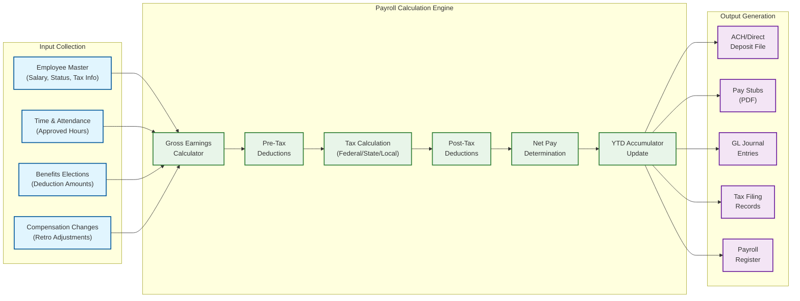
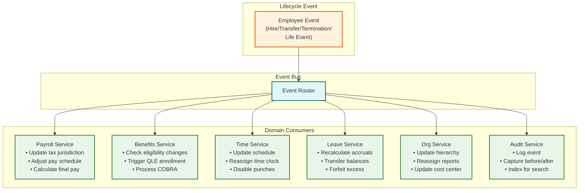
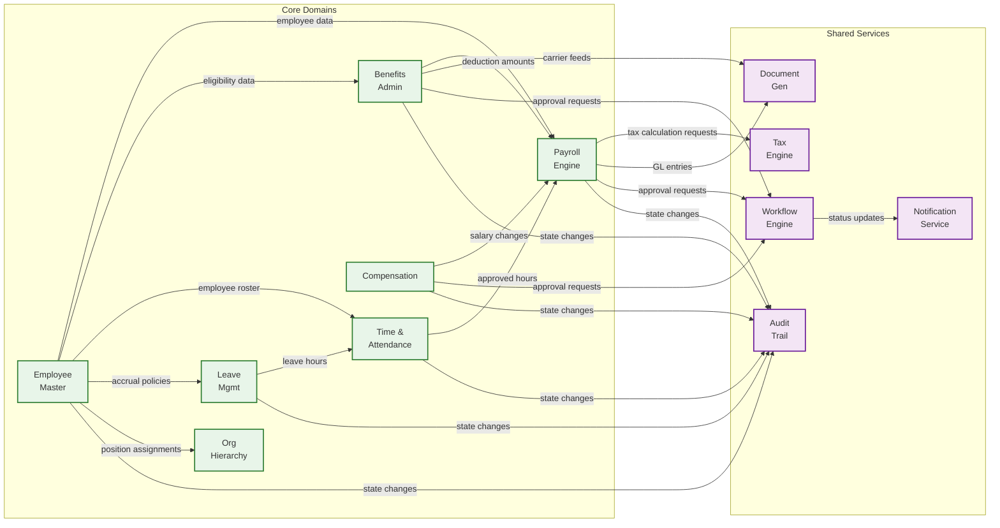
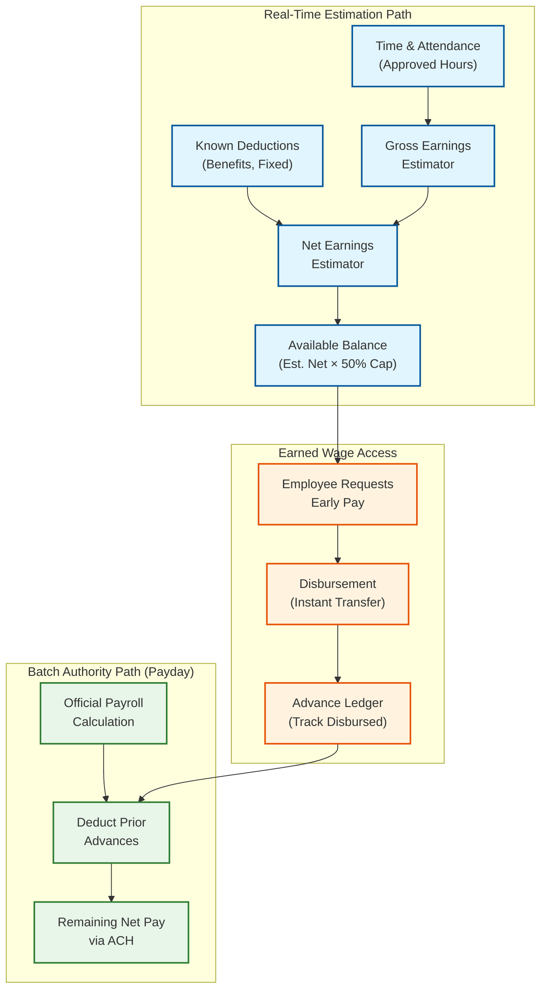

# High-Level Design

## Architecture Overview

The HCM platform follows a domain-partitioned service architecture where each functional area (payroll, benefits, time, leave, org management) operates as an independent bounded context with its own data store, while sharing a common employee master service as the system of record for workforce identity. An event bus connects domains, enabling asynchronous propagation of employee lifecycle events (hire, transfer, termination) without tight coupling. Payroll and compliance functions use a batch orchestration layer that coordinates parallel computation within strict time windows.

---

## System Architecture

```mermaid
flowchart TB
    subgraph Clients["Client Layer"]
        WEB["Employee Self-Service<br/>(Web SPA)"]
        MOB["Mobile App<br/>(iOS/Android)"]
        MGR["Manager Dashboard"]
        ADM["HR Admin Console"]
        CLK["Time Clocks<br/>(IoT Terminals)"]
    end

    subgraph Edge["Edge Layer"]
        CDN["CDN / Static Assets"]
        LB["Load Balancer"]
        GW["API Gateway<br/>• Authentication<br/>• Rate Limiting<br/>• Request Routing"]
    end

    subgraph CoreServices["Core HCM Services"]
        EMP["Employee Master<br/>Service"]
        PAY["Payroll Engine<br/>Service"]
        BEN["Benefits Admin<br/>Service"]
        TIM["Time & Attendance<br/>Service"]
        LEV["Leave Management<br/>Service"]
        ORG["Org Hierarchy<br/>Service"]
        CMP["Compensation<br/>Service"]
        TAL["Talent Management<br/>Service"]
        DOC["Document Generation<br/>Service"]
    end

    subgraph Compliance["Compliance & Rules Layer"]
        TAX["Tax Calculation<br/>Engine"]
        RUL["Regulatory Rules<br/>Engine"]
        AUD["Audit Trail<br/>Service"]
        WFL["Workflow Engine<br/>(Approvals)"]
    end

    subgraph EventLayer["Event Infrastructure"]
        EB["Event Bus<br/>(Employee Lifecycle Events)"]
        BQ["Batch Queue<br/>(Payroll Jobs)"]
        DLQ["Dead Letter Queue"]
    end

    subgraph DataLayer["Data Layer"]
        EMPDB[("Employee<br/>Master DB<br/>(Relational)")]
        PAYDB[("Payroll<br/>DB<br/>(Relational)")]
        TIMDB[("Time Series<br/>Store")]
        BENDB[("Benefits<br/>DB<br/>(Relational)")]
        DOCST[("Document<br/>Store<br/>(Object Storage)")]
        CACHE[("Distributed<br/>Cache")]
        SEARCH[("Search<br/>Index")]
        DWH[("Analytics<br/>Warehouse")]
    end

    subgraph External["External Integrations"]
        BANK["Banking / ACH<br/>Networks"]
        CARRIER["Benefits<br/>Carriers (EDI)"]
        TAXAG["Tax Agencies<br/>(Federal/State)"]
        BGCHK["Background<br/>Check APIs"]
        IDENT["Identity<br/>Verification"]
    end

    WEB & MOB & MGR & ADM --> CDN --> LB --> GW
    CLK --> TIM

    GW --> EMP & PAY & BEN & TIM & LEV & ORG & CMP & TAL & DOC

    EMP --> EMPDB & CACHE & SEARCH
    PAY --> PAYDB & TAX
    BEN --> BENDB
    TIM --> TIMDB
    LEV --> EMPDB
    ORG --> EMPDB & CACHE
    DOC --> DOCST

    EMP & PAY & BEN & TIM & LEV & CMP --> EB
    EB --> AUD
    PAY --> BQ
    BQ --> DLQ

    CoreServices --> RUL
    CoreServices --> WFL

    PAY --> BANK
    BEN --> CARRIER
    TAX --> TAXAG
    EMP --> BGCHK & IDENT

    EMPDB & PAYDB & BENDB & TIMDB --> DWH

    classDef client fill:#e1f5fe,stroke:#01579b,stroke-width:2px
    classDef edge fill:#fff3e0,stroke:#e65100,stroke-width:2px
    classDef service fill:#e8f5e9,stroke:#2e7d32,stroke-width:2px
    classDef compliance fill:#fce4ec,stroke:#b71c1c,stroke-width:2px
    classDef event fill:#e0f7fa,stroke:#00695c,stroke-width:2px
    classDef data fill:#f3e5f5,stroke:#6a1b9a,stroke-width:2px
    classDef external fill:#fffde7,stroke:#f57f17,stroke-width:2px

    class WEB,MOB,MGR,ADM,CLK client
    class CDN,LB,GW edge
    class EMP,PAY,BEN,TIM,LEV,ORG,CMP,TAL,DOC service
    class TAX,RUL,AUD,WFL compliance
    class EB,BQ,DLQ event
    class EMPDB,PAYDB,TIMDB,BENDB,DOCST,CACHE,SEARCH,DWH data
    class BANK,CARRIER,TAXAG,BGCHK,IDENT external
```

---

## Data Flow Diagrams

### Payroll Processing Flow

### Employee Lifecycle Event Propagation

---

## Key Architectural Decisions

### Decision 1: Employee Master as the Canonical Source

**Context:** Multiple domains (payroll, benefits, time, leave) need employee data but have different access patterns and update frequencies.

**Decision:** A dedicated Employee Master Service owns the canonical employee record. Other domains maintain materialized projections of the employee data they need, updated via domain events.

**Rationale:**
- Single source of truth prevents data divergence across domains
- Event-driven materialization allows each domain to shape data for its access patterns (payroll needs tax jurisdiction; time needs schedule and location)
- Decouples domain services from the employee master's schema evolution
- Enables independent scaling---the employee master handles profile reads while payroll handles batch computation

**Trade-off:** Eventual consistency between employee master updates and domain-specific projections. Mitigated by synchronous validation for critical fields (e.g., payroll verifies tax jurisdiction against employee master before each run).

### Decision 2: Batch-Oriented Payroll with Checkpoint Recovery

**Context:** Payroll processing for 150K employees involves millions of individual calculations that must complete within a 4-hour window before direct deposit cutoff.

**Decision:** Payroll runs as a batch-orchestrated job with employee-level parallelism, checkpoint-based recovery, and deterministic re-execution capability.

**Rationale:**
- Employee payroll calculations are embarrassingly parallel---each employee's gross-to-net is independent
- Checkpointing after each employee allows the run to resume from the point of failure rather than restarting
- Deterministic calculation (same inputs → same outputs) enables re-verification and audit
- Separating calculation from disbursement creates a review gate before funds are committed

**Trade-off:** Batch processing introduces latency---changes made after the payroll cutoff are deferred to the next period or handled as off-cycle. Real-time payroll (on-demand pay) requires a separate, streaming calculation path.

### Decision 3: Event-Driven Lifecycle Propagation

**Context:** An employee lifecycle event (hire, termination, transfer) must update 6+ domain services. Synchronous orchestration creates brittle coupling and long transaction chains.

**Decision:** Employee lifecycle events are published to an event bus. Each domain service subscribes to relevant events and updates its own state asynchronously.

**Rationale:**
- Decouples event producers (HR actions) from consumers (payroll, benefits, time)
- Each domain can process events at its own pace---benefits may need carrier API calls while time can update instantly
- Failed processing in one domain does not block others
- Event log provides a complete, ordered history of all lifecycle changes for audit

**Trade-off:** Eventual consistency means there is a window where domains are out of sync after an event. For example, after a termination, the time system may still accept punches for a few seconds until the event propagates. Mitigated by idempotent processing and compensating actions.

### Decision 4: Multi-Hierarchy as Separate Graph Structures

**Context:** Organizations need supervisory, legal entity, cost center, and matrix hierarchies that overlap but serve different purposes.

**Decision:** Each hierarchy type is stored as an independent directed acyclic graph (DAG) with its own version history. Employees are nodes in multiple graphs simultaneously.

**Rationale:**
- Different hierarchies change at different rates (legal entity rarely changes; supervisory changes frequently)
- Independent graphs allow hierarchy-specific optimizations (materialized path for cost center rollups, adjacency list for supervisory traversal)
- Effective dating per hierarchy enables scheduling reorganizations without affecting other hierarchies
- Avoids the complexity of a single universal hierarchy model

**Trade-off:** Cross-hierarchy queries (e.g., "all employees in Cost Center X reporting to Manager Y in Legal Entity Z") require joining multiple graph structures. Mitigated by pre-computed intersection indexes for common query patterns.

### Decision 5: Effective Dating as the Core Temporal Pattern

**Context:** HCM data is inherently temporal---compensation changes, position transfers, and policy updates are always tied to effective dates, often in the past (retroactive) or future (scheduled).

**Decision:** All mutable HCM entities use effective-dated records with `effective_start_date` and `effective_end_date` ranges rather than simple current-state snapshots.

**Rationale:**
- Enables point-in-time reconstruction for any date (required for retroactive payroll)
- Supports future-dated changes (e.g., a promotion effective next month) without overwriting current data
- Provides a complete history without relying solely on audit logs
- Aligns with the regulatory requirement to reproduce historical payroll calculations exactly

**Trade-off:** Queries become range-based (`WHERE effective_date <= target_date ORDER BY effective_date DESC LIMIT 1`) rather than simple lookups, increasing query complexity. Mitigated by caching current-effective records and using covering indexes on date ranges.

### Decision 6: Separate Read and Write Models (CQRS) for Analytics

**Context:** Operational HCM transactions (payroll runs, time punches, enrollment) require strong consistency, while analytics and reporting need cross-domain aggregation.

**Decision:** Operational services write to normalized domain databases. A change data capture pipeline feeds an analytics warehouse optimized for cross-domain queries, dashboards, and ad-hoc reporting.

**Rationale:**
- Payroll and benefits databases are optimized for transactional integrity, not analytical aggregation
- Analytics queries (turnover trends, compensation benchmarking, absence patterns) span multiple domains
- Separating read and write models allows independent scaling of OLTP and OLAP workloads
- Analytics warehouse can denormalize aggressively for query performance

**Trade-off:** Analytics data lags operational data by the CDC pipeline latency (typically 1-5 minutes). Mitigated by clearly communicating data freshness to report consumers and providing real-time dashboards for critical metrics via direct domain API queries.

### Decision 7: Immutable Payroll Records with Additive Corrections

**Context:** Payroll errors are discovered after pay runs are committed and funds disbursed. The system needs a correction mechanism that maintains audit trail integrity.

**Decision:** Committed pay results are immutable. All corrections are additive: new adjustment entries in subsequent pay runs reference the original, but never modify it.

**Rationale:**
- Immutability preserves the audit chain: auditors can trace from pay stub → committed run → GL entries → tax filings without any record having been changed after the fact
- Voiding a pay run creates a new reversing record (not a deletion), maintaining the complete history
- YTD accumulators are the sum of all committed results including corrections, ensuring they are always independently verifiable
- The accounting principle of never editing committed transactions is a regulatory expectation under SOX

**Trade-off:** Corrections are more complex than simple edits. An over-payment requires a negative adjustment in the next run, not a modification of the original. This creates more records and requires clear UX to help payroll administrators understand the correction chain.

---

## Service Interaction Map

---

## Technology Selection Rationale

| Component | Choice | Rationale |
|-----------|--------|-----------|
| **Employee Master DB** | Relational (row-store) with partitioning | Strong consistency, complex joins for hierarchy queries, effective-dated range queries |
| **Payroll DB** | Relational with DECIMAL precision | Financial accuracy requires exact decimal arithmetic; ACID for payroll transactions |
| **Time Series Store** | Time-optimized columnar store | High-ingestion rate for time punches; efficient range queries for pay-period aggregation |
| **Benefits DB** | Relational | Complex eligibility rules require referential integrity; plan-employee-dependent relationships |
| **Cache Layer** | Distributed in-memory cache | Sub-millisecond access for leave balances, org hierarchy lookups, and tax bracket tables |
| **Event Bus** | Durable message broker with ordering guarantees | Employee events must be processed in order per employee; durability prevents event loss |
| **Batch Orchestrator** | Distributed task scheduler with checkpoint support | Payroll parallelism with fault tolerance; checkpoint recovery for long-running batch jobs |
| **Search Index** | Full-text search engine | Employee directory search, org chart filtering, compliance report discovery |
| **Document Store** | Object storage | Pay stubs, tax forms, and carrier files need durable, versioned storage with access control |
| **Analytics Warehouse** | Columnar analytical database | Cross-domain aggregation, ad-hoc queries, and dashboard materialization |

---

## Component Responsibility Matrix

| Component | Owns | Reads From | Writes To | Scaling Profile |
|-----------|------|------------|-----------|-----------------|
| **Employee Master Service** | Employee records, person data, employment history | — | Event bus (lifecycle events), search index, cache | Steady read-heavy; spikes during bulk imports and M&A |
| **Payroll Engine** | Pay runs, pay results, earnings/deduction/tax lines, YTD accumulators | Employee master, time data, benefits elections, compensation, tax engine | Payroll DB, ACH files, GL journal, document store | Batch-intensive within 4-hour windows; idle between runs |
| **Benefits Admin Service** | Benefit plans, elections, dependent data, carrier feeds | Employee master (eligibility), payroll (deduction amounts) | Benefits DB, carrier EDI files, event bus | Steady low; 10-20x spike during open enrollment |
| **Time & Attendance Service** | Time entries, timecards, exceptions, schedules | Employee master (roster), leave service (leave hours) | Time series store, event bus | Sustained high during shift changes; predictable daily pattern |
| **Leave Management Service** | Leave balances, accruals, leave requests, FMLA cases | Employee master (tenure, FTE), time service (hours worked) | Leave balance DB, event bus | Nightly batch for accruals; interactive for requests |
| **Org Hierarchy Service** | Position definitions, hierarchy relationships, cost center mappings | Employee master (assignments) | Hierarchy graph store, cache | Read-heavy; rare large writes during reorganizations |
| **Compensation Service** | Salary records, bonus targets, equity grants, compensation bands | Employee master, org hierarchy (grade, position) | Compensation DB, event bus (feeds payroll) | Spikes during annual comp review cycles |
| **Tax Calculation Engine** | Tax rules, jurisdiction configurations, tax tables | — (stateless; reads rule cache) | — (returns computation results) | CPU-bound; scales horizontally with payroll workers |
| **Audit Trail Service** | Immutable audit records for all state changes | All services via event bus | Write-once audit store, compliance index | Write-heavy; proportional to total system activity |
| **Workflow Engine** | Approval routing rules, pending approvals, delegation chains | Org hierarchy (routing), employee master (delegates) | Workflow DB, notification service | Proportional to employee actions requiring approval |

---

## On-Demand Pay (Earned Wage Access) Architecture

On-demand pay allows employees to access a portion of earned-but-unpaid wages before the regular pay date. This requires a dual-path architecture: a real-time estimation path for daily wage access and the batch authority path for official payroll.

**Key architectural considerations:**

1. **Estimation vs. authority**: The real-time estimator uses simplified tax withholding (flat supplemental rate) and known fixed deductions. The batch payroll run is the authoritative calculation. Any difference between estimated and actual net pay is reconciled on payday.
2. **Advance cap**: Typically 50% of estimated net earnings to prevent over-disbursement. The cap accounts for variable deductions (garnishments, benefits changes) that the estimator cannot perfectly predict.
3. **Advance ledger**: Tracks all early disbursements as a deduction in the next payroll run. The payroll engine treats advances as a post-tax deduction that reduces the final ACH deposit.
4. **Risk boundary**: If an employee terminates between advance and payday, the advance becomes a receivable. The system must track outstanding advances and integrate with the final pay calculation.

---

## Cross-Domain Event Ordering Guarantees

Employee lifecycle events must be processed in order per employee across all consuming domains. The event bus provides this guarantee through employee-level partitioning:

| Guarantee | Mechanism | Scope |
|-----------|-----------|-------|
| **Per-employee ordering** | Events partitioned by employee_id; single consumer per partition | All events for one employee processed sequentially |
| **Cross-employee independence** | Events for different employees on different partitions process in parallel | No global ordering constraint across employees |
| **Idempotent processing** | Each event carries a unique event_id; consumers deduplicate on event_id | Safe at-least-once delivery; retry does not cause double-processing |
| **Causal ordering within a transaction** | Multi-field changes from a single HR action are published as a single event | Compensation change + job transfer in one action = one atomic event |
| **Dead letter handling** | Events that fail processing after 3 retries route to DLQ for manual review | Prevents one bad event from blocking subsequent events for the same employee |

The event schema includes a `causation_id` field linking related events (e.g., a termination event causes a COBRA eligibility event), enabling consumers to understand event chains without tight coupling to the producing domain.

---

## Interview Checklist

- Explain why the Employee Master is the single canonical source and how other domains maintain materialized projections via events
- Walk through the payroll data flow from input collection through gross-to-net calculation to ACH file generation
- Describe the event-driven lifecycle propagation model and articulate the eventual consistency trade-off between domains
- Justify the choice of batch-oriented payroll with checkpoint recovery over real-time calculation
- Explain the on-demand pay dual-path architecture: estimation vs. authority, and why both paths are necessary
- Discuss the multi-hierarchy design: why different hierarchies use different storage strategies (closure table vs. materialized path vs. adjacency list)
- Articulate the technology selection rationale: why relational for payroll (DECIMAL precision, ACID), why columnar for time series (ingestion rate), why CQRS for analytics
- Explain how the event bus provides per-employee ordering via employee_id partitioning while allowing cross-employee parallelism
- Discuss the Component Responsibility Matrix: which services own which data, and how ownership boundaries prevent cross-domain data coupling
- Describe the advance ledger model in on-demand pay: advances as financial transactions against future payroll obligations, not partial payroll runs
