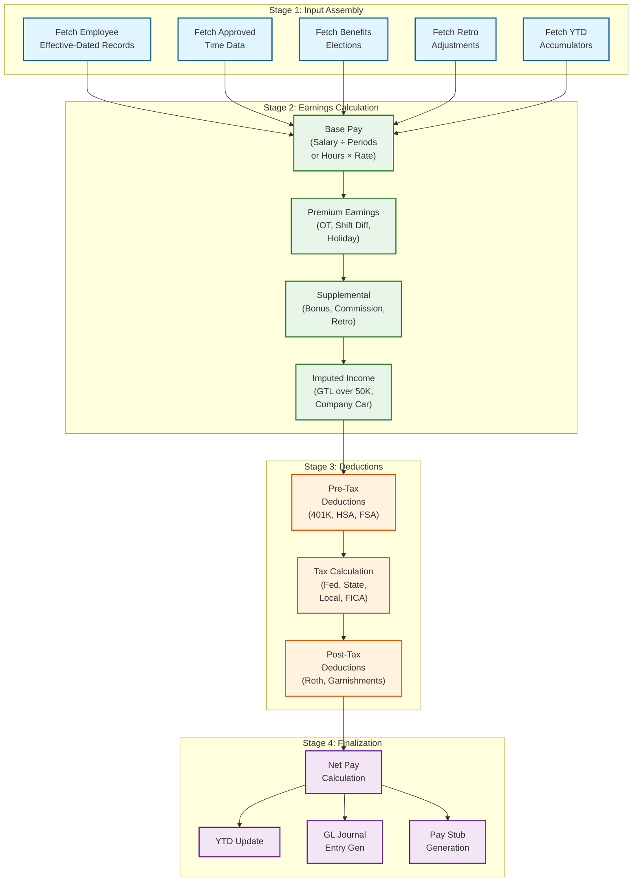
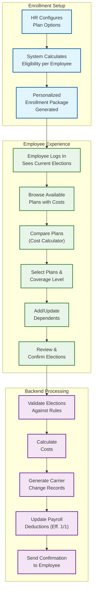

# Deep Dive and Bottlenecks

## Deep Dive 1: Payroll Calculation Engine Internals

### The Gross-to-Net Pipeline Challenge

The payroll engine is the most computationally intensive and legally consequential component of an HCM system. A single payroll run for 150,000 employees must complete within a 4-hour window before the ACH cutoff, and every dollar must be correct---overpayments are difficult to recover, underpayments violate labor law, and incorrect tax withholding creates liability.

### Calculation Pipeline Stages



### Slowest part of the process: Tax Calculation Complexity

Tax calculation is the primary Slowest part of the process in the pipeline. For a single US employee:

- **Federal income tax**: Progressive brackets, filing status, allowances, additional withholding
- **State income tax**: 43 states with income tax, each with unique brackets and rules
- **Local/city tax**: ~5,000 jurisdictions (NYC, Philadelphia, Ohio municipalities, etc.)
- **FICA**: Social Security (wage base cap at ~$170K), Medicare (no cap), Additional Medicare (>$200K)
- **State unemployment (SUI)**: Employer-side, variable rate per state
- **Workers' compensation**: Rate varies by job classification

A single employee working remotely may owe taxes in their state of residence, state of work, and reciprocal states. Multi-state employees multiply this further.

**Mitigation strategies:**

1. **Tax rule caching**: Load jurisdiction rules into memory at run start; rules rarely change mid-period
2. **Jurisdiction pre-grouping**: Sort employees by tax jurisdiction set, batch-calculate common jurisdictions
3. **Incremental tax via YTD method**: Instead of re-running the full annual calculation each period, use the annualized-YTD method (project annual income, compute annual tax, subtract YTD taxes already paid)
4. **Tax engine as a separate service**: Isolate the stateless tax calculation behind a service boundary so it can scale independently during peak payroll windows

### Slowest part of the process: Retroactive Adjustments

Retro adjustments are expensive because they require re-running the full calculation for each affected prior period. A mid-year salary change effective 6 months ago requires recalculating 12-13 prior pay periods.

**Mitigation:**
- Store complete input snapshots for each historical pay result (enables deterministic replay)
- Calculate retro differences off the critical path---accumulate as a separate earnings code rather than re-opening and modifying historical records
- Cap retro lookback window (e.g., 6 months maximum) to bound computation cost

---

## Deep Dive 2: Benefits Open Enrollment Processing

### The Enrollment Spike Pattern

Open enrollment creates a 3-week window where 60-80% of the workforce logs in to review and modify benefits elections. This is the highest-traffic, highest-stakes event in the HCM calendar.

### Enrollment Flow



### Slowest part of the process: Concurrent Plan Cost Calculations

When 50,000 employees simultaneously compare plans, each comparison requires:
- Eligibility verification against the employee's current state
- Cost calculation based on coverage tier, employee contribution schedule, and employer subsidy
- Dependent age-out validation (children aging out of coverage)
- HSA/FSA coordination rules (cannot have both in certain configurations)

**Mitigation strategies:**

1. **Pre-computed enrollment packages**: Before enrollment opens, batch-calculate each employee's eligible plans with costs for all coverage tiers. Store as a denormalized enrollment snapshot. Employees browse pre-computed data; only the final election submission hits the transactional path.
2. **Read-heavy caching**: Cache plan details and rate tables aggressively---they do not change during the enrollment window.
3. **Optimistic enrollment**: Accept elections immediately, validate asynchronously. If validation fails, notify the employee within 24 hours during the enrollment window when they can still correct.
4. **Staggered enrollment**: Open enrollment to different populations on staggered days (e.g., A-M last names in week 1, N-Z in week 2) to distribute load.

### Slowest part of the process: Carrier Feed Generation After Enrollment Close

After enrollment closes, the system must generate EDI 834 files for each carrier reflecting all changes. A carrier with 80,000 enrolled employees generates a file with 80,000 member records, which must be validated, transmitted, and acknowledged within 48 hours.

**Mitigation:**
- Generate delta files (changes only) rather than full-file replacements
- Validate carrier-specific business rules before transmission (each carrier has unique formatting requirements)
- Implement carrier acknowledgment parsing to detect and auto-resolve rejected records
- Maintain a reconciliation dashboard showing carrier-accepted vs. system-enrolled counts

---

## Deep Dive 3: Time Tracking Edge Cases

### Multi-Source Punch Reconciliation

Employees may clock in via a wall-mounted biometric terminal, clock out via mobile app, and have a manager entry to correct a missed punch. These three sources have different latency, reliability, and trust characteristics.

| Source | Latency | Trust Level | Edge Cases |
|--------|---------|-------------|------------|
| Biometric terminal | < 1s | High | Terminal offline, queue-and-forward |
| Mobile app with GPS | 2-5s | Medium | GPS spoofing, cellular dead zones |
| Web browser | < 1s | Medium | VPN masking location, shared workstations |
| Manager entry | Minutes-hours | High (audited) | Backdating, approval bypass |
| Schedule-auto | Batch | Low (assumed) | Employee was absent but not recorded |

### Slowest part of the process: Cross-Midnight and Cross-Timezone Shifts

An employee clocking in at 11:00 PM and out at 7:00 AM creates a shift that spans two calendar days and potentially two pay periods. Rules that apply:

- **Daily overtime threshold**: Does the 8-hour shift count against Day 1 or Day 2?
- **Weekly overtime accumulation**: Which week gets the hours?
- **Meal break compliance**: Was the required 30-minute break taken within the first 5 hours?
- **Shift differential**: Night shift premium may only apply to hours between 10 PM and 6 AM

**Resolution logic:**

```
FUNCTION resolve_cross_midnight_shift(clock_in, clock_out, pay_rules):
    shift_hours = hours_between(clock_in, clock_out) - deducted_break_time

    IF pay_rules.day_assignment == "SHIFT_START":
        // All hours count toward clock-in date
        assign_to_date = clock_in.date
    ELSE IF pay_rules.day_assignment == "SPLIT_AT_MIDNIGHT":
        // Hours before midnight → Day 1; hours after → Day 2
        day1_hours = hours_between(clock_in, midnight)
        day2_hours = hours_between(midnight, clock_out)
    ELSE IF pay_rules.day_assignment == "MAJORITY_RULE":
        // All hours go to the date where the majority were worked
        ...

    // Apply shift differential for qualifying hours
    FOR each hour_block IN shift:
        IF hour_block.time BETWEEN pay_rules.night_start AND pay_rules.night_end:
            hour_block.differential = pay_rules.night_differential_rate
```

### Slowest part of the process: Time Clock Offline Buffering

Physical time clocks at warehouses, factories, and retail locations may lose network connectivity. During an outage, the clock must:

1. Continue accepting punches and storing them locally
2. Queue punches for batch upload when connectivity resumes
3. Handle the case where the same employee punched at two different clocks (one online, one offline) creating duplicate or conflicting entries
4. Ensure that punches are processed in chronological order even if received out of order

**Mitigation:**
- Clocks maintain a local queue with sequence numbers
- Server-side deduplication using (employee_id, timestamp, entry_type) composite key with a 60-second tolerance window
- Out-of-order punch reordering based on timestamp, with conflict resolution rules (biometric > mobile > manual)

---

## Deep Dive 4: Organizational Hierarchy Traversal Performance

### The Reporting Chain Problem

Common operations that require hierarchy traversal:

1. **Manager approval routing**: Walk up the supervisory chain to find the next approver
2. **Compensation budgeting**: Aggregate all compensation under a VP across 5 levels of management
3. **Headcount reporting**: Count all employees under a cost center, including nested sub-cost-centers
4. **Org chart rendering**: Display a 3-level deep subtree from any node

For a 150,000-employee organization with 7-8 average hierarchy depth, naive recursive queries are prohibitively expensive.

### Materialized Path vs. Adjacency List vs. Nested Sets

| Approach | Insert/Move | Subtree Query | Full Path | Storage | Best For |
|----------|-------------|---------------|-----------|---------|----------|
| **Adjacency list** | O(1) | O(n) recursive | O(depth) recursive | Minimal | Frequent updates, shallow trees |
| **Materialized path** | O(1) but updates descendants | O(n) with LIKE prefix | O(1) parse path | Moderate | Read-heavy, infrequent reorgs |
| **Closure table** | O(depth) inserts | O(1) lookup | O(1) lookup | O(n²) worst case | Balanced read/write, DAGs |
| **Nested sets** | O(n) for rebalancing | O(1) range scan | O(depth) | Moderate | Static hierarchies, reporting |

**Chosen approach:** Closure table with caching for the supervisory hierarchy (changes frequently, needs both subtree and ancestor queries); materialized path for cost center hierarchy (changes rarely, primarily used for aggregation rollups).

### Slowest part of the process: Reorganization Cascade

When a VP's entire division (5,000 employees) moves to a new reporting line, the closure table requires updating 5,000 × average_depth = ~35,000 ancestor-descendant relationships. If the org hierarchy is also used for cost center mapping and approval routing, the cascade touches multiple derived structures.

**Mitigation:**
- Process reorgs as a scheduled effective-dated batch (not real-time)
- Use an event to invalidate cached hierarchy subtrees affected by the move
- Rebuild closure table incrementally: delete old ancestor relationships for the moved subtree, insert new ancestor relationships
- Version the hierarchy: old approval workflows continue using the previous version until they complete

---

## Deep Dive 5: Multi-Jurisdiction Leave Compliance

### The Leave Policy Combinatorial Explosion

A global organization must enforce leave policies that vary by:

- **Country**: Statutory minimums (EU: 20 days; Japan: 10-20 days graduated; US: no federal minimum)
- **State/Province**: California requires paid sick leave; New York has unique family leave
- **Municipality**: San Francisco, Seattle, and others have city-level sick leave ordinances
- **Collective bargaining agreement**: Union contracts may specify leave terms beyond statutory minimums
- **Employee tenure**: Many policies increase accrual rates at 3, 5, and 10-year milestones
- **Employment type**: Full-time, part-time (pro-rated), and temporary workers have different entitlements

The result is potentially thousands of unique policy combinations.

### Policy Resolution Engine

```
FUNCTION resolve_leave_policy(employee, leave_type, effective_date):
    // Gather all applicable policies in priority order
    policies = []

    // 1. Statutory (mandatory, cannot be reduced)
    statutory = get_statutory_policy(
        employee.legal_entity.country,
        employee.work_location.state,
        employee.work_location.city,
        leave_type
    )
    IF statutory IS NOT NULL:
        policies.add(statutory, priority=STATUTORY)

    // 2. Collective bargaining agreement (if unionized)
    IF employee.is_union_member:
        cba_policy = get_cba_policy(employee.union_id, leave_type)
        IF cba_policy IS NOT NULL:
            policies.add(cba_policy, priority=CBA)

    // 3. Company policy
    company_policy = get_company_policy(
        employee.legal_entity_id,
        employee.job_classification,
        employee.tenure_years(effective_date),
        leave_type
    )
    IF company_policy IS NOT NULL:
        policies.add(company_policy, priority=COMPANY)

    // Resolution: employee gets the MOST FAVORABLE of all applicable policies
    // (statutory is the floor; company/CBA can only improve upon it)
    resolved = merge_policies_most_favorable(policies)

    RETURN resolved
```

### Slowest part of the process: Intermittent FMLA Tracking

FMLA (Family and Medical Leave Act) allows employees to take leave intermittently (e.g., 2 hours every Tuesday for physical therapy). Tracking this requires:

- Rolling 12-month lookback to calculate the 12-week (480-hour) entitlement
- Converting partial-day absences into FMLA-hour deductions
- Distinguishing FMLA-qualifying absences from regular sick leave
- Employer notification requirements within 5 business days of designation
- Recertification tracking at 30-day intervals

This is among the most compliance-sensitive leave features because incorrect tracking exposes the organization to DOL investigations and private lawsuits.

**Mitigation:**
- Dedicated FMLA case management model (separate from general leave) with its own state machine
- Automated 12-month rolling window calculation that runs on every FMLA absence event
- Alert system for approaching entitlement exhaustion (at 75%, 90%, 100% of allocation)
- Audit-ready report generation showing every FMLA hour deducted with supporting documentation

---

## Deep Dive 6: YTD Accumulator Consistency Under Concurrent Access

### The Accumulator Problem

Year-to-date accumulators drive progressive tax calculations, annual deduction limits (401k cap at $23,500), and Social Security wage base caps ($168,600). An incorrect YTD value cascades into every subsequent payroll calculation for the affected employee for the rest of the year.

**Race condition scenario:** An employee has a regular biweekly pay run and a same-day off-cycle bonus payment. Both calculations read the same YTD snapshot and compute taxes independently. If both write back updated YTD values, one overwrites the other, creating drift.

**Mitigation strategies:**

1. **Serialized YTD updates per employee**: Use a per-employee lock (or optimistic concurrency with version counter) when updating YTD accumulators. Off-cycle runs that conflict with regular runs are queued to execute sequentially for the same employee.
2. **Pre-run YTD reconciliation**: Before every pay run, verify that each employee's running YTD equals the sum of all committed pay results for the current year. Flag any drift for investigation before proceeding.
3. **YTD as derived, not stored**: Rather than maintaining a mutable running total, compute YTD on-demand by summing all committed pay result lines for the year. Cache the computed value with a version tag. This is slower but eliminates drift by construction.
4. **Hybrid approach**: Maintain the running YTD for performance, but run a nightly reconciliation batch that recomputes YTD from committed pay results and flags discrepancies.

### Slowest part of the process: Annual Limit Enforcement at Year Boundary

At the start of a new calendar year, every employee's YTD accumulators reset. For a 150K-employee organization, this means:

- All 401k YTD amounts reset; the first payroll of the year can deduct the full per-period amount
- Social Security YTD wages reset; FICA withholding resumes for high earners who reached the cap
- FSA/HSA elections for the new plan year take effect, potentially changing deduction amounts
- Carry-forward leave balances must be calculated and excess forfeited per policy

The first payroll run of the year is typically the slowest because every employee triggers the year-boundary logic: new tax tables load, new annual limits apply, carry-forward calculations execute, and the cache of YTD values is empty (cold start).

**Mitigation:**
- Pre-warm YTD caches with zero-initialized records before the first run
- Load new-year tax rules into cache during the year-end processing window (before the first January run)
- Stagger carry-forward calculations as a separate batch before the first payroll run, not within it

---

## Performance Characteristics Summary

| Operation | p50 Latency | p99 Latency | Throughput | Notes |
|-----------|-------------|-------------|------------|-------|
| Single employee payroll calculation | 120ms | 350ms | — | Varies by jurisdiction count and retro depth |
| Tax engine call (per employee) | 35ms | 90ms | 3,000/sec per instance | Stateless; horizontally scalable |
| Full pay run (150K employees, 100 workers) | 2.5 hours | 3.5 hours | 625 employees/min | Includes input assembly, calculation, and checkpoint |
| Time punch ingestion | 15ms | 80ms | 2,000/sec | Edge-buffered; batch transmitted |
| Leave balance query | 5ms | 25ms | — | Cached; cache miss adds ~50ms |
| Benefits election submission | 200ms | 800ms | 500/sec | Synchronous persist + async validation |
| Org chart render (3 levels, 500 nodes) | 300ms | 1.2s | — | Closure table lookup + cache |
| Employee profile load (full) | 80ms | 250ms | — | Includes compensation, benefits, leave; cache-assisted |
| Carrier feed generation (80K records) | 15 min | 25 min | — | Batch; validated before transmission |
| ACH file generation (150K records) | 8 min | 15 min | — | Sequential write; hash-verified |

---

## Interview Tips

- **Explain the compiler analogy**: Payroll's gross-to-net pipeline maps to lexing (input assembly), parsing (earnings), semantic analysis (deduction ordering), code generation (tax calculation), and linking (finalization). This shows deep understanding of the sequential dependency structure.
- **Articulate the bi-temporal distinction**: Effective date (when did the business change happen?) vs. recorded date (when was it entered into the system?). A raise entered today but effective 3 months ago has different values on each axis, and retroactive payroll must use the effective timeline.
- **Highlight the batch-within-deadline constraint**: Payroll is not "eventually consistent"—it must complete within a hard window (ACH cutoff). This is the scheduling constraint that drives checkpoint recovery, worker pool sizing, and the 2-hour recovery buffer.
- **Connect hierarchy to query pattern**: Different hierarchies demand different storage strategies. Supervisory (closure table for ancestor queries), cost center (materialized path for aggregation), legal entity (adjacency list, rarely changes). One-size-fits-all is always wrong for org hierarchies.
- **Discuss the year-boundary cold start**: The first payroll run of the year is the slowest because every employee hits year-boundary logic. Pre-warming caches and staggering carry-forward calculations mitigates this.
- **Explain YTD accumulator drift**: Running totals can diverge from recalculated sums due to concurrent access. Nightly reconciliation catches drift before it compounds across pay periods.
- **Describe the off-cycle/regular run race condition**: When an off-cycle bonus and regular payroll run concurrently for the same employee, both read the same YTD snapshot. Serialized per-employee YTD updates prevent one write from overwriting the other.
- **Walk through the carrier feed as a distributed consistency problem**: HCM and carrier maintain independent enrollment state synchronized via periodic file exchange. Reconciliation is the convergence mechanism, not real-time APIs.
- **Discuss the year-boundary cold start**: The first payroll run of the year loads new tax tables, resets YTD accumulators, processes carry-forward leave, and encounters empty caches. Pre-warming and staggered batch scheduling mitigate the performance cliff.
- **Quantify the retro adjustment cost**: A 6-month retro for one employee requires recalculating 12-13 prior periods. For 100 employees with retro adjustments, that is 1,200+ recalculations added to the regular pay run workload.
- **Describe the garnishment priority engine**: Federal law mandates child support before tax levies before creditor garnishments, with disposable income tracking across each deduction. This ordering is not configurable—it is legally defined and must be enforced in the pipeline.
- **Explain why open enrollment load testing must use realistic data**: Synthetic load tests with uniform employee profiles miss the real Slowest part of the process—personalized eligibility evaluation with diverse employee characteristics (tenure, FTE, legal entity, dependents) creates non-uniform computation cost.
- **Articulate the immutability cascade**: When a pay run is committed, the immutability extends to pay results, GL journal entries, tax filing records, pay stubs, and carrier feed snapshots. No record downstream of a committed run may be modified—corrections are always forward-looking adjustments.
- **Discuss cross-midnight shift day assignment**: Three valid approaches exist (shift-start assignment, split-at-midnight, majority-rule), and the choice depends on jurisdiction-specific labor law. California requires split-at-midnight for daily overtime; other states allow shift-start. The pay rule engine must be configurable per jurisdiction.
- **Explain why multi-source time punch reconciliation needs trust-level weighting**: A biometric terminal punch is higher trust than a mobile GPS punch, which is higher trust than a web browser punch. When sources conflict, the higher-trust source wins. Manager overrides have the highest trust but require audit logging.
