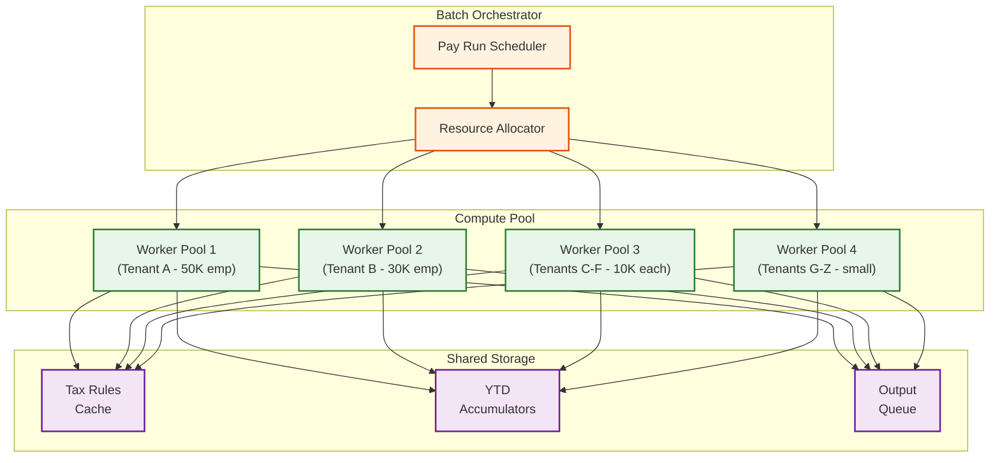
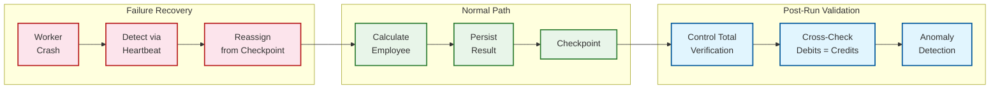
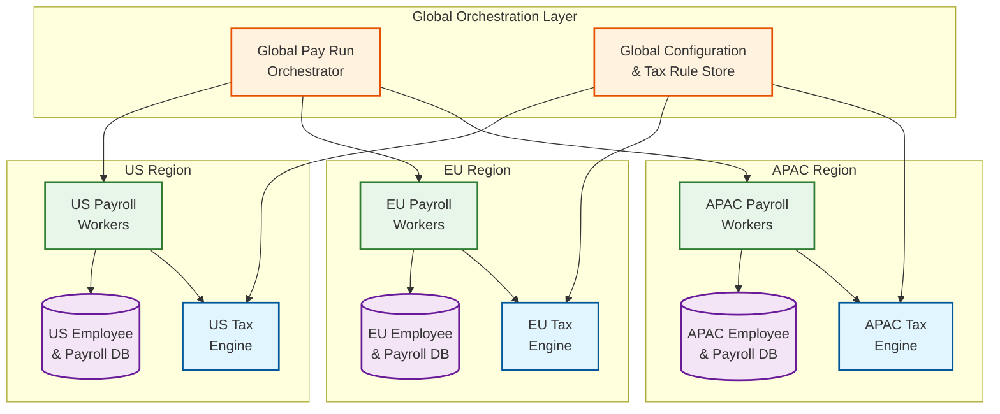

# Scalability and Reliability

## Scaling Strategies

### Multi-Tenant Payroll Processing at Scale

Payroll is the most resource-intensive batch workload in HCM. A platform serving 500 tenants with a combined 2 million employees must process payroll for multiple tenants concurrently, each with different pay schedules, tax jurisdictions, and calculation rules.

#### Tenant-Partitioned Parallel Execution



**Scaling approach:**
1. **Tenant-level isolation**: Each tenant's payroll runs in an isolated worker pool to prevent cross-tenant resource contention. Large tenants (>50K employees) get dedicated pools; smaller tenants are bin-packed onto shared pools.
2. **Employee-level parallelism within a tenant**: Individual employee calculations are embarrassingly parallel. A 50K-employee tenant can distribute across 100 workers, each processing 500 employees.
3. **Checkpoint-based recovery**: After each employee calculation completes, the result is persisted with a checkpoint. If a worker crashes, recovery resumes from the last checkpoint rather than restarting the entire run.
4. **Priority queuing**: Payroll runs are prioritized by urgency (final pay for terminations > regular payroll > off-cycle). Resource allocation reflects priority levels.

#### Scaling the Tax Calculation Service

Tax calculation is stateless and CPU-bound, making it ideal for horizontal scaling:

- **Pre-loaded rule sets**: At pay-run start, all applicable tax jurisdiction rules are loaded into a distributed cache. Workers read from cache, never touching the database during calculation.
- **Jurisdiction-aware routing**: Route employees to tax workers pre-loaded with their specific jurisdiction rules, reducing cache misses.
- **Auto-scaling based on pay-run queue depth**: When multiple tenants trigger payroll simultaneously (e.g., biweekly Friday for all US tenants), the tax service auto-scales based on pending calculation requests.

### Scaling Time Capture for Shift-Change Peaks

At 7:00 AM, 500 factory locations each have 200 workers clocking in within a 15-minute window---100,000 punches in 900 seconds (~111 punches/second sustained, with spikes to 500+/second).

**Scaling approach:**
1. **Edge buffering**: Time clock terminals maintain a local buffer and batch-transmit punches every 5-10 seconds, converting 500 individual requests into 50 batch requests.
2. **Ingestion tier separation**: A lightweight ingestion service accepts and acknowledges punches immediately (sub-2s SLA), writing to a durable queue. A separate processing service reads from the queue to apply pay rules, detect exceptions, and update timecards.
3. **Partition by location**: Time entry storage is partitioned by location and date, ensuring that concurrent writes from different locations do not contend for the same partition.
4. **Read replica for self-service**: Employee timecard views are served from read replicas, decoupled from the write path that handles incoming punches.

### Scaling Open Enrollment

Open enrollment creates a 3-week spike where self-service traffic increases 10-20x over steady state.

**Scaling approach:**
1. **Pre-computed enrollment packages**: Batch-generate personalized plan options, costs, and eligibility for every employee before enrollment opens. Serve from a read-optimized cache.
2. **Queue-based election processing**: Election submissions go to a durable queue rather than directly hitting the transactional database. Workers process elections at a sustainable rate, returning confirmation asynchronously.
3. **Horizontal web tier scaling**: Add capacity to the API gateway and employee self-service tier based on concurrent session count, with auto-scaling triggered at 70% capacity.
4. **Graceful degradation**: If enrollment load exceeds capacity, degrade non-critical features (plan comparison charts, historical cost trends) while keeping election submission always available.
5. **Connection draining**: When scaling down after the enrollment peak, use connection draining to allow in-flight election submissions to complete before removing instances.

### Scaling Lessons from Open Enrollment

Open enrollment reveals scaling patterns applicable to other HCM spikes:

- **Pre-compute what you can**: The enrollment package (eligible plans, costs, comparisons) is 95% static during the enrollment window. Computing it once and serving from cache reduces the write path to the final election only.
- **Queue writes, cache reads**: The read-to-write ratio during enrollment is approximately 50:1 (employees browse many plans before submitting one election). Optimizing the read path has 50x more impact than optimizing the write path.
- **Stagger when possible**: Opening enrollment for different populations on different days distributes the spike. A 3-week window with staggered starts converts a single 10x spike into three overlapping 4x spikes.

---

## Reliability Patterns

### Payroll Run Fault Tolerance

Payroll has zero tolerance for data loss but can tolerate brief delays within the processing window.



**Reliability mechanisms:**
1. **Idempotent calculations**: Each employee calculation is identified by (pay_run_id, employee_id). Re-executing produces the same result and overwrites, not duplicates.
2. **Control total verification**: Before committing a pay run, verify that:
   - Total gross = sum of all earnings lines
   - Total net = gross - total deductions - total taxes
   - Total debits = total credits in the GL journal
   - Employee count matches expected population
3. **Anomaly detection**: Flag employees whose net pay deviates by >20% from the previous period (catches data entry errors, missed terminations, incorrect retro calculations).
4. **Two-phase commit for disbursement**: Payroll calculation and ACH file generation are separate steps. The pay run enters "REVIEWED" status after calculation, requiring explicit "COMMIT" from an authorized payroll administrator before ACH files are generated.

### Benefits Election Durability

An employee's benefits election is a legal commitment. Losing an election after the employee has confirmed it creates compliance exposure.

**Reliability mechanisms:**
1. **Synchronous persistence**: Election submissions are persisted to the primary database with synchronous replication before returning confirmation to the employee.
2. **Election confirmation records**: A separate, immutable confirmation record is created for each election, serving as the legal record of the employee's choice.
3. **Carrier feed reconciliation**: After transmitting carrier feeds, the system ingests carrier acknowledgment files and reconciles every record. Discrepancies trigger alerts for manual review.

### Time Capture Resilience

Missing or duplicate time entries directly impact payroll accuracy.

**Reliability mechanisms:**
1. **At-least-once delivery with deduplication**: Time clocks deliver punches at-least-once. The server deduplicates based on (employee_id, entry_type, timestamp) within a 60-second window.
2. **Store-and-forward at the edge**: Time clocks have persistent local storage. Network outages do not cause punch loss; queued punches transmit when connectivity resumes.
3. **Missing punch detection**: At the end of each day, a reconciliation job identifies employees with incomplete punch pairs (clock-in without clock-out) and generates exceptions for manager resolution.
4. **Payroll lock protection**: Time entries cannot be modified after the timecard enters "SENT_TO_PAYROLL" status. Any post-lock corrections require a formal adjustment process that flows through the next pay period.

---

## Global Payroll Across Jurisdictions

### The Multi-Country Challenge

A global HCM serving employees in 40 countries must handle:

| Dimension | Variation |
|-----------|-----------|
| Pay frequency | Weekly (US hourly), monthly (Europe), semi-monthly (mixed) |
| Tax system | Progressive brackets (US, UK), flat tax (Russia), no income tax (UAE) |
| Social contributions | Social Security + Medicare (US), National Insurance (UK), CPF (Singapore), superannuation (Australia) |
| Statutory deductions | Mandatory pension (many EU), mandatory health insurance (Germany), union fees (Nordic) |
| Currency | Local currency payroll with cross-border transfers for expatriates |
| Year-end reporting | W-2 (US), P60 (UK), Lohnsteuerbescheinigung (Germany), Group Certificate (Australia) |
| Data residency | GDPR (EU), PDPA (Singapore), LGPD (Brazil) may require in-country data processing |

### Architecture for Global Payroll

```
APPROACH: Country Payroll Engines with Shared Core

Shared Core (all countries):
  - Employee master data management
  - Gross earnings calculation (base + premiums + retro)
  - General ledger posting format
  - Audit trail and workflow

Country-Specific Engine (per jurisdiction):
  - Tax withholding calculation
  - Statutory deduction rules
  - Government reporting formats
  - Compliance validation rules
  - Locale-specific pay stub format

Execution Model:
  - Each country engine runs as a pluggable module
  - Shared core invokes country engine via a standard interface:
    calculate_taxes(gross, ytd, employee_tax_profile) -> TaxResult
    calculate_statutory(gross, employee_profile) -> DeductionResult
    generate_filing(pay_period, employees) -> FilingDocument
```

**Scaling considerations for global payroll:**
1. **Time-zone-aware scheduling**: US payroll runs during US business hours; European payroll during EU hours. This naturally distributes batch load across the day.
2. **Data residency compliance**: For jurisdictions requiring in-country processing (EU under GDPR), deploy country-specific payroll workers in regional data centers. The shared employee master replicates to regional instances with field-level encryption for sensitive data.
3. **Currency handling**: All monetary calculations use the employee's local currency. Cross-border cost allocation uses exchange rates locked at the pay-period start date for consistency.

---

## Disaster Recovery

### Recovery Strategy by Component

| Component | RPO | RTO | Strategy |
|-----------|-----|-----|----------|
| Employee master database | 0 (zero data loss) | < 15 min | Synchronous replication to standby; automated failover |
| Payroll database | 0 | < 30 min | Synchronous replication; pay run can restart from checkpoint |
| Time capture ingestion | < 5 min | < 10 min | Multi-zone ingestion endpoints; edge buffering covers brief outages |
| Benefits database | 0 | < 30 min | Synchronous replication; critical during enrollment windows |
| Document store | < 1 hour | < 2 hours | Asynchronous replication; documents are regeneratable from source data |
| Analytics warehouse | < 4 hours | < 8 hours | Rebuilt from CDC pipeline; non-critical latency |

### Payroll Disaster Recovery Scenario

If the primary payroll engine fails mid-run:

1. Batch orchestrator detects missing heartbeats from failed workers within 30 seconds
2. Remaining uncalculated employees are redistributed to surviving workers or standby pool
3. Already-calculated employees (checkpointed) are not recalculated
4. If the entire primary region fails, the payroll run is restarted in the DR region from the last global checkpoint
5. The pay run completion target has a 2-hour buffer before the ACH cutoff, providing recovery time

### Data Backup and Retention

| Data Type | Retention | Backup Frequency | Notes |
|-----------|-----------|-------------------|-------|
| Employee master | 7 years post-termination | Continuous replication + daily snapshot | Labor law and tax audit requirements |
| Payroll results | 7 years | Daily snapshot; immutable after commit | IRS, state tax audit requirements |
| Time entries | 3 years | Daily snapshot | FLSA recordkeeping requirements |
| Benefits elections | 7 years | Daily snapshot | ERISA and ACA compliance |
| Tax filings | 7 years | Immutable after submission | IRS retention requirements |
| Audit trail | 10 years | Continuous replication | SOX and general compliance |
| Documents (pay stubs, W-2s) | 7 years | Object storage with versioning | Employee access and audit |

---

## Chaos Engineering

### Experiment Catalog

| Experiment | Injection | Expected Behavior | Validation |
|-----------|-----------|-------------------|------------|
| Kill payroll workers mid-run | Terminate 30% of worker pool during active payroll | Orchestrator detects missing heartbeats within 30s; uncalculated employees redistributed; checkpointed results preserved | Run completes within window; no duplicate pay results; control totals match |
| Simulate tax engine timeout | Inject 10s latency on tax calculation service | Circuit breaker trips after 3 failures; affected employees queued for retry; other employees continue processing | Pay run completes with retried employees; no incorrect tax calculations |
| Corrupt YTD accumulator cache | Inject stale YTD values for 100 random employees | Pre-calculation validation detects YTD mismatch; affected employees flagged for manual review; run pauses for those employees | Zero incorrect net pay amounts reach commit stage |
| Time clock fleet partition | Block network from 50% of time clocks for 30 minutes | Clocks buffer punches locally; punches transmit when connectivity resumes; server-side deduplication handles any overlaps | All punches eventually ingested; no data loss; ingestion latency spike visible in dashboard |
| Benefits DB failover | Force primary benefits database failover to standby | Read traffic routes to replica within 15s; write traffic resumes after standby promotion; enrollment submissions queued during transition | Zero lost elections; enrollment latency spike < 30s |
| Payroll DB disk saturation | Fill payroll database disk to 95% capacity | Write operations begin failing; orchestrator pauses new calculations; alerts fire for DBA intervention | No silent data corruption; pay run resumes after disk expansion |
| Event bus partition | Isolate event bus from 2 of 3 consumer groups | Affected consumers stop processing; events accumulate in bus with durability guarantees; consumers catch up on reconnection | All lifecycle events eventually processed in order; no duplicates |
| Carrier feed endpoint failure | Return 503 from carrier SFTP endpoints for 4 hours | Carrier feed delivery retries with exponential backoff; alert fires after 3rd failure; feeds queue for delivery when endpoint recovers | All feeds delivered within extended SLA; carrier records match system state |

### Annual Chaos Schedule

| Quarter | Focus Area | Scope |
|---------|-----------|-------|
| Q1 | Payroll engine resilience | Coincides with year-end processing and W-2 generation; validates under peak batch load |
| Q2 | Benefits platform | Manual step-by-step test before open enrollment; validates enrollment spike handling |
| Q3 | Time capture and edge resilience | Validates clock fleet partition recovery; tests offline buffering at scale |
| Q4 | Full disaster recovery drill | Cross-region failover; validates RPO/RTO targets with live traffic |

---

## Capacity Planning Summary

| Component | Current Capacity | Peak Demand | Headroom | Scale Trigger |
|-----------|-----------------|-------------|----------|---------------|
| Payroll workers | 120 workers | 80 workers at peak | 50% | > 70% utilization during pay run |
| Tax engine instances | 40 instances | 25 at peak | 60% | p95 latency > 100ms |
| Time ingestion tier | 2,000 punches/sec | 500 punches/sec peak | 4x | Sustained > 60% for 5 min |
| Benefits API tier | 500 req/sec | 200 req/sec steady; 400 during enrollment | 25-150% | Concurrent sessions > 80% capacity |
| Employee master cache | 10 GB | 6 GB hot data | 67% | Cache eviction rate > 5% |
| Leave balance cache | 2 GB | 1.2 GB | 67% | Cache miss rate > 10% |
| Event bus partitions | 24 partitions | 12 active consumers | 2x | Consumer lag > 1,000 messages |
| Analytics warehouse | 5 TB allocated | 2.5 TB used | 50% | > 80% storage utilization |

---

## Multi-Region Strategy for Global Payroll

### Active-Passive with Regional Processing

Global payroll requires processing employee data in the jurisdiction where the employee resides (GDPR, LGPD, and similar data residency laws). The architecture uses regional processing with centralized orchestration:



**Key design decisions:**

1. **Employee data stays in-region**: EU employee records never replicate to US or APAC data centers. The global orchestrator knows which region owns each pay group but never accesses individual employee records.
2. **Configuration replicates globally**: Tax rules, benefit plan configurations, and pay policies replicate from a central configuration store to all regions. Rules are read-only in regional workers.
3. **Aggregated results flow up**: Each regional pay run produces aggregated totals (total gross, total net, total employer cost by cost center) that flow to the global reporting layer. Individual pay results remain in-region.
4. **Time-zone-aware scheduling**: US payroll runs during US business hours; EU during EU hours; APAC during APAC hours. This naturally distributes batch compute load across 24 hours.

### DR Scenario: Payroll Engine Failure During Peak Processing

**Scenario**: Primary payroll processing region loses compute capacity mid-run, with 60% of employees calculated and 2 hours remaining before ACH cutoff.

| Time | Event | Action |
|------|-------|--------|
| T+0 | Worker pool health check fails; 80% of workers unresponsive | Orchestrator marks run as DEGRADED; remaining healthy workers continue |
| T+30s | Heartbeat timeout confirms failure; < 20% worker capacity | Orchestrator activates standby worker pool in secondary availability zone |
| T+2min | Standby workers online; checkpoint manifest loaded | Orchestrator redistributes uncalculated employees (40% remaining) to new pool |
| T+5min | New workers begin calculation; checkpoint ensures no re-processing of completed employees | Payroll ops alerted; ACH cutoff timer visible on dashboard |
| T+45min | Standby pool completes remaining 40% of employees | Post-run validation begins: control totals, anomaly detection, debit/credit balance |
| T+60min | Validation passes; run enters REVIEWED status | Payroll administrator approves commit; ACH file generation starts |
| T+75min | ACH file generated and transmitted to banking network | Run complete; 45 minutes before cutoff deadline |

**Key recovery properties:**
- Checkpointed employees are never recalculated (idempotency + checkpoint = exactly-once semantics)
- Control total verification catches any data corruption from the failure event
- The 2-hour buffer before ACH cutoff is sized specifically to accommodate this recovery scenario
- If the full region fails (not just compute), the global orchestrator can redirect to a DR region, but this requires accessing employee data replicated under the DR agreement (separate from steady-state data residency)

---

## Annual Scaling Calendar

HCM workloads are not uniformly distributed. The system experiences predictable annual peaks that require capacity pre-provisioning:

| Period | Event | Scaling Action |
|--------|-------|---------------|
| **January 1-15** | Year-end processing: W-2 generation, new year tax table loading, leave carry-forward | 3x batch compute; pre-warm YTD caches; stagger W-2 generation across tenants |
| **January 31** | W-2 filing deadline for all employees | Document storage burst; tax agency API capacity |
| **February-March** | ACA 1095-C generation and filing | Additional document generation workers; IRS FIRE system integration capacity |
| **April 15** | Quarterly 941 filing deadline | Tax filing batch capacity |
| **September-November** | Open enrollment season (varies by organization) | 10-20x self-service capacity; pre-computed enrollment packages |
| **December** | Year-end bonus runs; final payroll; holiday premium calculations | 2x payroll batch capacity; extended processing windows |
| **Biweekly Fridays** | Most common US pay date; 60% of payroll runs concentrate here | Baseline payroll capacity must handle this concentration |

### Self-Service Traffic Patterns

Employee self-service has a weekly and daily rhythm that informs auto-scaling configuration:

- **Monday 8-10 AM**: Highest traffic of the week (leave requests, timecard review from the weekend)
- **Payday**: Pay stub downloads spike 5x within 2 hours of pay stub availability
- **End of month**: Leave balance checks increase 3x as employees verify accruals
- **Sunday evening**: Lowest traffic; ideal for maintenance windows and batch processing

Auto-scaling triggers should be time-aware: pre-scale for Monday morning at 7 AM rather than waiting for load-based triggers to react at 8 AM when traffic is already spiking.

### Tenant Isolation During Peak Batch

When multiple tenants run payroll simultaneously (biweekly Friday), resource contention between tenants must be prevented:

- **Dedicated worker pools for large tenants**: Tenants with >50K employees get isolated compute; their payroll run cannot starve smaller tenants
- **Fair-share scheduling**: Shared worker pools use weighted fair-share allocation; a 10K-employee tenant gets proportionally more workers than a 500-employee tenant, but both make progress
- **Tax engine rate limiting per tenant**: Prevent a single large tenant from monopolizing the stateless tax engine; per-tenant request quotas ensure concurrent access

---

## Interview Checklist

- Explain how checkpoint-based recovery changes the payroll failure cost from O(total) to O(batch_since_checkpoint)
- Walk through the multi-region architecture for global payroll and explain why employee data stays in-region while configuration replicates globally
- Describe the capacity planning approach: how do you size the 2-hour buffer before ACH cutoff?
- Articulate the chaos engineering strategy and why payroll resilience testing must be done during non-critical pay periods
- Explain the annual scaling calendar and how predictable peaks (year-end, open enrollment) differ from unpredictable ones (mass terminations)
- Discuss how data residency requirements (GDPR, LGPD) constrain the DR architecture—employee data stays in-region, but aggregated totals can flow globally
- Articulate why the 2-hour buffer before ACH cutoff is an architectural design choice, not operational slack—it is the recovery budget sized for at least one full-pool failure
- Explain how time-zone-aware payroll scheduling naturally distributes global batch load across 24 hours without requiring a single massive compute window
