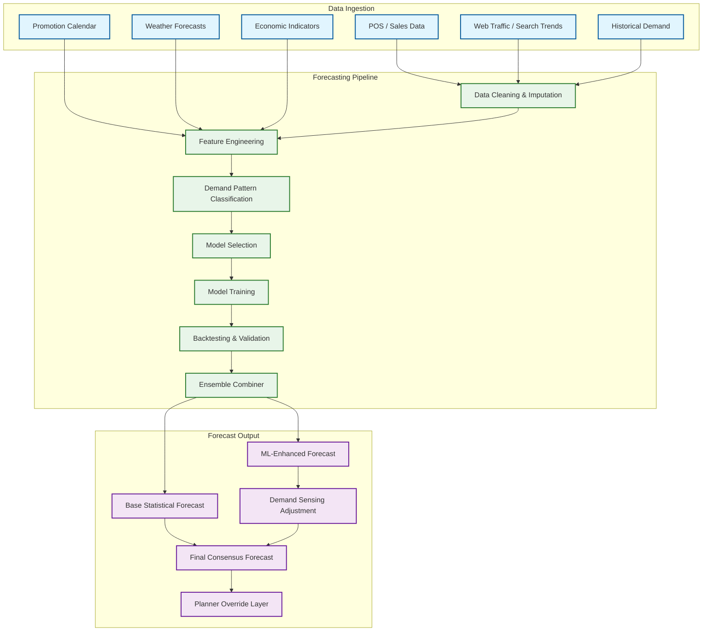
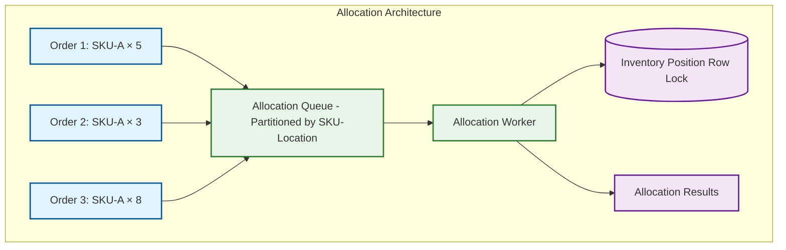
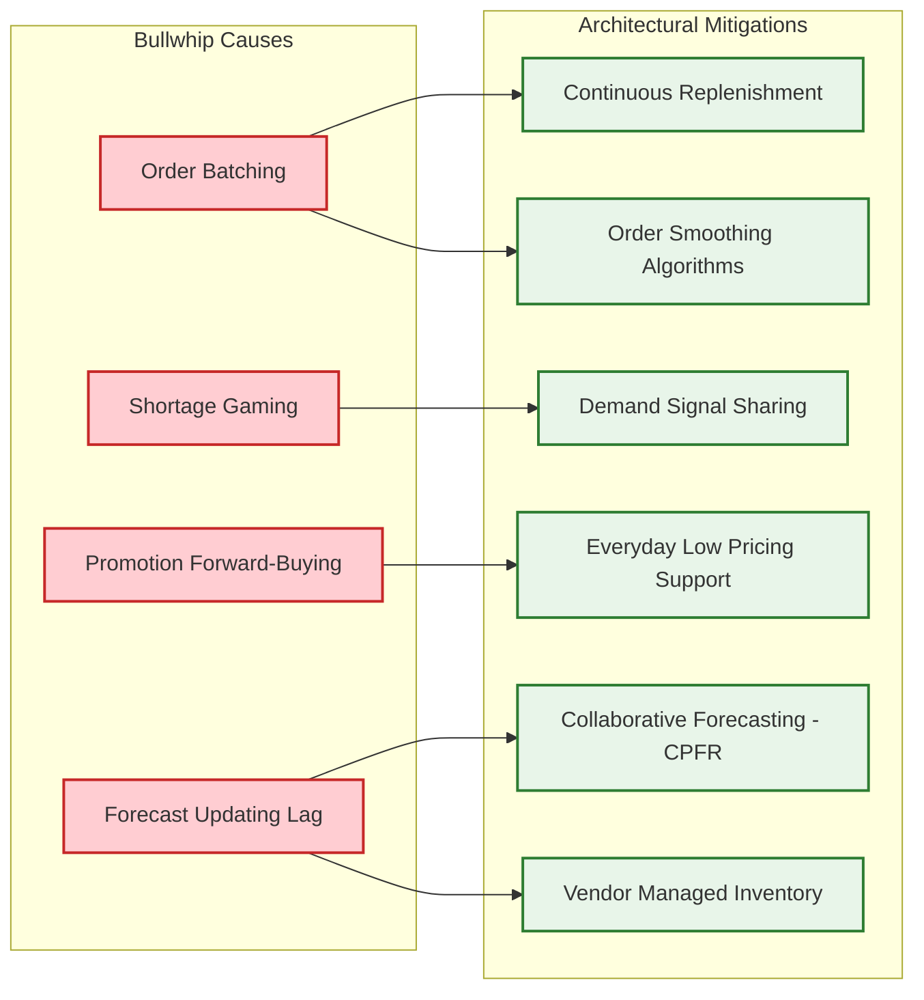
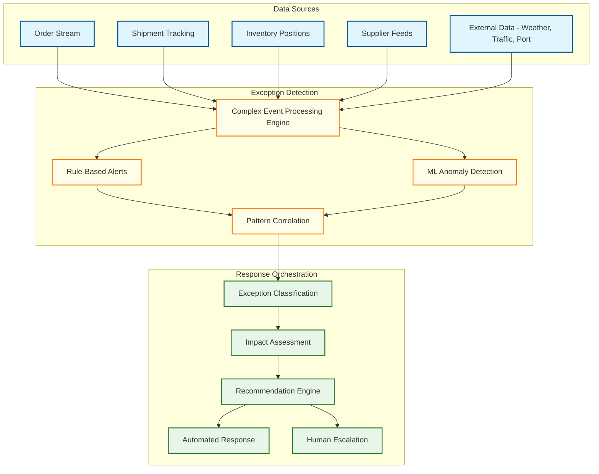
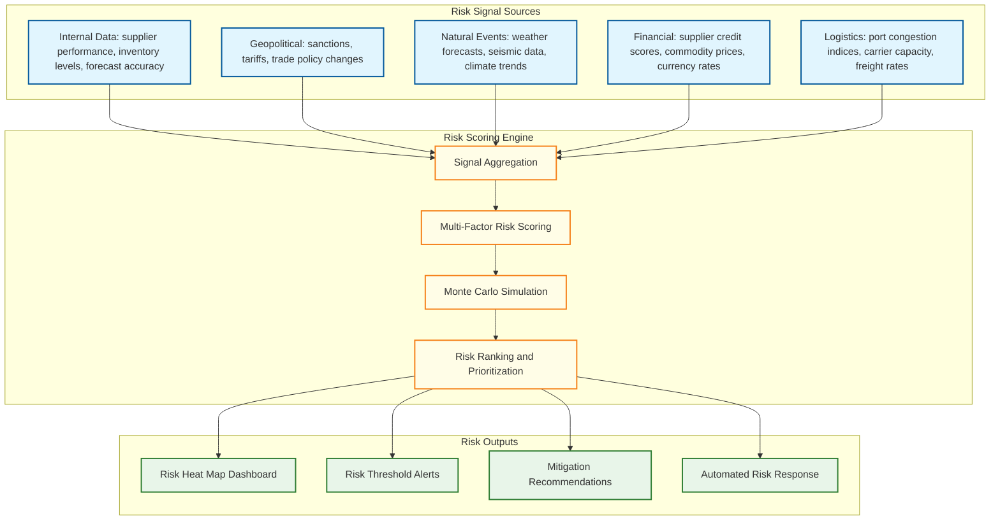

# Deep Dive & Bottlenecks

## Critical Component 1: Demand Forecasting Engine

### Why This Is Critical

Demand forecasting is the foundation of all supply chain planning. Every downstream decision---how much to produce, what to stock where, how many trucks to book, how many warehouse workers to schedule---cascades from the forecast. A 10% improvement in forecast accuracy translates to 15--25% reduction in inventory carrying costs and 30--50% reduction in stockouts. Conversely, a consistently biased or inaccurate forecast creates a cascading failure: over-forecasting leads to excess inventory, markdowns, and write-offs; under-forecasting leads to stockouts, lost sales, and expediting costs. The engineering challenge is not building a single model, but building a system that manages thousands of models (one per SKU-location), automatically selects the best approach for each demand pattern, detects when models degrade, and retrains without disrupting production inference.

### How It Works Internally



#### Demand Pattern Classification

The system first classifies each SKU-location's demand pattern to select appropriate models:

```
FUNCTION classify_demand_pattern(history):
    // ADI (Average Demand Interval) and CV² (Coefficient of Variation squared)
    non_zero_periods = COUNT(h FOR h IN history WHERE h > 0)
    total_periods = LENGTH(history)
    adi = total_periods / non_zero_periods  // avg periods between demands

    non_zero_values = FILTER(history, h -> h > 0)
    cv_squared = (STDDEV(non_zero_values) / MEAN(non_zero_values))^2

    // Syntetos-Boylan classification
    IF adi < 1.32 AND cv_squared < 0.49:
        pattern = "SMOOTH"          // Regular, predictable
    ELSE IF adi >= 1.32 AND cv_squared < 0.49:
        pattern = "INTERMITTENT"    // Sporadic but consistent size
    ELSE IF adi < 1.32 AND cv_squared >= 0.49:
        pattern = "ERRATIC"         // Regular timing, variable size
    ELSE:
        pattern = "LUMPY"           // Sporadic and variable

    // Additional checks
    IF detect_seasonality(history, min_strength=0.3):
        pattern += "_SEASONAL"
    IF detect_trend(history, significance=0.05):
        pattern += "_TRENDING"

    RETURN pattern
```

### Slowest part of the process: Model Training at Scale

**Problem**: With 500M SKU-location combinations across all tenants, training individual models is computationally prohibitive. Even at 1 second per model, a full retrain takes ~16 years of compute time.

**Solutions**:

1. **Tiered model strategy**: Train individual models only for A-items (top 20% by volume/revenue, ~100M combinations). Use clustering + representative models for B/C items. Use simple moving averages for long-tail items.

2. **Incremental training**: Retrain only models whose accuracy has degraded below threshold. Monitor forecast error weekly; retrain ~5% of models per cycle.

3. **Global-local model architecture**: Train a global DeepAR model on all SKU-location data (learns shared patterns), then fine-tune per SKU-location with local data. The global model captures cross-SKU signals (cannibalization, category trends) that per-SKU models miss.

4. **Parallel training infrastructure**: Partition SKU-locations across training workers by tenant and product category. Each worker trains independently. Target: complete full training cycle within 8-hour overnight window.

### Slowest part of the process: Demand Sensing Latency

**Problem**: Demand sensing must incorporate real-time signals (POS data, web traffic) and adjust the short-term forecast within minutes, not the weekly batch cycle. But the ML models are trained for weekly/monthly granularity.

**Solution**: Two-layer architecture:
- **Base forecast**: Statistical/ML models produce weekly forecasts (batch, overnight)
- **Sensing adjustment**: A lightweight model (gradient-boosted trees or linear regression) adjusts the near-term base forecast using real-time signals. The sensing model learns the relationship between real-time signals (today's POS deviation from yesterday, web search volume change) and forecast error. It outputs a multiplier: `adjusted_forecast = base_forecast × sensing_multiplier`.

---

## Critical Component 2: Inventory Allocation Under Contention

### Why This Is Critical

When multiple orders compete for limited inventory at the same location, the allocation service must ensure that no inventory is double-committed. In a high-volume system processing 2M+ orders per day, many orders arrive simultaneously for popular items. A naive implementation that reads available inventory, checks sufficiency, and then allocates will suffer from race conditions: two orders read "10 available," both allocate 8, and now 16 units are committed against 10 physical units.

### How It Works Internally



#### Serialization Strategy

```
FUNCTION allocate_inventory(tenant_id, sku_id, location_id, requested_qty, order_id):
    // Use SELECT FOR UPDATE with SKIP LOCKED for fairness under contention
    BEGIN TRANSACTION (SERIALIZABLE for this row)

    position = SELECT on_hand_qty, allocated_qty, safety_stock_qty
               FROM inventory_position
               WHERE tenant_id = tenant_id
               AND sku_id = sku_id
               AND location_id = location_id
               FOR UPDATE

    available = position.on_hand_qty - position.allocated_qty - position.safety_stock_qty

    IF available >= requested_qty:
        allocated = requested_qty
    ELSE IF available > 0 AND partial_allocation_allowed:
        allocated = available
    ELSE:
        ROLLBACK
        RETURN { status: "INSUFFICIENT", available: available }

    UPDATE inventory_position
    SET allocated_qty = allocated_qty + allocated,
        updated_at = NOW()
    WHERE tenant_id = tenant_id
    AND sku_id = sku_id
    AND location_id = location_id

    INSERT INTO allocation (order_id, sku_id, location_id, allocated_qty, timestamp)
    VALUES (order_id, sku_id, location_id, allocated, NOW())

    COMMIT

    // Async: invalidate ATP cache for this SKU-location
    INVALIDATE_CACHE(key: "atp:{tenant_id}:{sku_id}:{location_id}")

    RETURN { status: "ALLOCATED", allocated_qty: allocated }
```

### Slowest part of the process: Hot SKU Contention

**Problem**: Popular items (e.g., new product launch, viral item) create extreme contention on a single inventory row. Row-level locking serializes all allocation requests, creating a Slowest part of the process that limits throughput to ~500--1000 allocations/second per hot SKU.

**Solutions**:

1. **Inventory sharding by lot/bin**: Split a single SKU's inventory into multiple logical slots (by lot, bin, or virtual partition). Each slot has its own row, reducing contention. The allocation service picks a random available slot.

2. **Pre-allocated reservation pools**: During known high-demand events (promotions, launches), pre-allocate inventory into per-channel or per-region reservation pools. Each pool is an independent row with its own lock, parallelizing allocation.

3. **Optimistic concurrency with retry**: Use optimistic locking (version column) instead of `SELECT FOR UPDATE`. Allocation reads the current version, attempts an update with `WHERE version = read_version`, and retries on conflict. This eliminates lock wait time at the cost of retry overhead.

4. **Write-ahead allocation log**: Instead of updating the inventory row synchronously, append to an allocation log (high-throughput append-only). A background process drains the log and applies net allocations to the position table. This converts synchronous row updates to append-only writes, dramatically increasing throughput. The trade-over is that the inventory position is briefly stale (the log may have uncommitted allocations not yet reflected).

---

## Critical Component 3: Order Routing Optimization

### Why This Is Critical

Order routing determines which warehouse or fulfillment node fulfills each order. The routing decision directly impacts shipping cost (closer = cheaper), delivery speed (closer = faster), warehouse workload balance, and inventory distribution health. Poor routing can create situations where one warehouse is overwhelmed while another sits idle, or where inventory accumulates in locations far from demand.

### The Multi-Objective Problem

```
MINIMIZE:
    α × total_shipping_cost
    + β × total_transit_time
    + γ × workload_imbalance_penalty
    + δ × split_shipment_penalty

SUBJECT TO:
    - Inventory available at assigned location ≥ order quantity
    - Transit time ≤ promised delivery date - processing time
    - Warehouse daily capacity ≤ max throughput
    - Carrier capacity available for the lane
    - Hazmat/cold-chain items only from certified locations
```

### Slowest part of the process: Real-Time vs. Optimal Routing

**Problem**: The fully Best possible solution (considering all orders, all locations, all constraints simultaneously) is an NP-hard assignment problem. Computing the true optimum for a batch of 10,000 orders across 50 warehouses could take hours. But orders arrive continuously and customers expect immediate confirmation.

**Solution**: Three-tier routing architecture:

1. **Real-time tier (per-order, < 200ms)**: Scoring-based Practical rule of thumb. For each incoming order, score candidate locations using the weighted formula in the algorithm section. Select the highest-scoring location. Handles 95% of orders.

2. **Near-real-time tier (batch, every 15 minutes)**: Collect unrouted or sub-optimally routed orders. Run a constraint-satisfaction optimization that considers cross-order interactions (e.g., consolidating orders to the same destination from the same warehouse). Re-routes orders that improve by > threshold.

3. **Overnight tier (full optimization, 8-hour window)**: Run the full mixed-integer programming (MIP) solver on next-day orders. This produces the globally optimal assignment. Used for B2B orders with known delivery dates and pre-scheduled replenishment.

---

## Critical Component 4: Bullwhip Effect Mitigation

### Why This Is Critical

The bullwhip effect---where demand signal variability amplifies as it propagates upstream through the supply chain---is the most studied and most destructive phenomenon in supply chain management. A 5% demand fluctuation at the retail level can become a 40% fluctuation at the manufacturer level and an 80% fluctuation at the raw material supplier level. This amplification leads to excess inventory, production whiplash, capacity over-investment, and supplier relationship strain.

### Architectural Causes and Solutions



#### Order Smoothing Algorithm

```
FUNCTION smooth_replenishment_order(raw_order_qty, history, smoothing_params):
    // Prevent order amplification by smoothing replenishment signals

    // Exponentially weighted moving average of recent orders
    smoothed_demand = EWMA(history.recent_orders, alpha=smoothing_params.alpha)

    // Dampening factor: limit order deviation from smoothed demand
    max_deviation = smoothed_demand * smoothing_params.max_change_pct  // e.g., 20%

    IF raw_order_qty > smoothed_demand + max_deviation:
        dampened_qty = smoothed_demand + max_deviation
        LOG("Order dampened: raw={raw_order_qty}, dampened={dampened_qty}")
    ELSE IF raw_order_qty < smoothed_demand - max_deviation:
        dampened_qty = smoothed_demand - max_deviation
    ELSE:
        dampened_qty = raw_order_qty

    // Exception: do not dampen if stockout is imminent
    IF current_inventory < safety_stock * 1.5:
        dampened_qty = MAX(raw_order_qty, dampened_qty)

    RETURN ROUND_UP(dampened_qty)
```

### Information Sharing Architecture

The key architectural solution is **demand signal visibility**: sharing real-time POS data and inventory positions across the supply chain, rather than requiring each tier to infer demand from the orders it receives.

```
TIER 1 (Retailer):
    - Publishes: POS data (real-time), inventory positions (hourly), forecast (weekly)
    - Subscribes to: supplier lead times, capacity constraints

TIER 2 (Distributor):
    - Publishes: warehouse inventory (hourly), replenishment orders (daily)
    - Subscribes to: retailer POS data, retailer forecast, manufacturer capacity

TIER 3 (Manufacturer):
    - Publishes: production schedule (daily), capacity availability (weekly)
    - Subscribes to: distributor inventory, retailer POS data (aggregated)

SIGNAL FLOW:
    Retailer POS → [Event Stream] → Distributor planning system
                                   → Manufacturer demand sensing
    Each tier plans from END-CUSTOMER demand, not from the orders it receives.
```

---

## Critical Component 5: Supply Chain Control Tower

### Why This Is Critical

The control tower is the nerve center of supply chain operations. It aggregates data from all sources---orders, shipments, inventory, weather, traffic, port systems, supplier feeds---into a unified view that enables exception-based management. Without it, supply chain managers react to problems after they cause damage (stockouts, late deliveries, production stoppages). With it, they detect patterns hours or days before impact and can take preemptive action.

### Exception Detection Architecture



### Slowest part of the process: Event Correlation Across Domains

**Problem**: A port congestion event affects hundreds of inbound shipments, which affects inventory at dozens of locations, which affects thousands of customer orders. Correlating the root cause (port event) with the downstream impact (customer delivery risk) requires joining event streams across domains in real time.

**Solution**: **Event enrichment pipeline** with cascading correlation:

```
EVENT: PortCongestionDetected(port="Shanghai", delay_days=5)

STEP 1 - Identify affected shipments:
    affected_shipments = QUERY shipments
        WHERE origin_port = "Shanghai"
        AND status IN ("PLANNED", "IN_TRANSIT")
        AND eta BETWEEN NOW AND NOW + 14 days

STEP 2 - Compute new ETAs:
    FOR EACH shipment IN affected_shipments:
        new_eta = shipment.original_eta + delay_days
        shipment.revised_eta = new_eta

STEP 3 - Identify affected inventory:
    FOR EACH shipment IN affected_shipments:
        FOR EACH line IN shipment.lines:
            inventory_impact = {
                sku_id: line.sku_id,
                location_id: shipment.destination_location_id,
                expected_arrival: shipment.revised_eta,
                quantity_delayed: line.quantity
            }

STEP 4 - Identify at-risk orders:
    FOR EACH impact IN inventory_impacts:
        projected_stockout_date = compute_stockout_date(
            current_inventory[impact.sku_id][impact.location_id],
            demand_forecast[impact.sku_id][impact.location_id],
            impact.expected_arrival
        )
        IF projected_stockout_date < impact.expected_arrival:
            at_risk_orders = GET_ORDERS_NEEDING(impact.sku_id, impact.location_id,
                                                  after=projected_stockout_date)
            EMIT Exception(type: "STOCKOUT_RISK", orders: at_risk_orders,
                          root_cause: "PORT_CONGESTION", recommended_action: "AIR_FREIGHT_OR_REROUTE")

STEP 5 - Generate recommendations:
    recommendations = [
        { action: "EXPEDITE_VIA_AIR", cost: $X, time_saved: Y_days },
        { action: "SOURCE_FROM_ALTERNATE_SUPPLIER", cost: $X, lead_time: Z_days },
        { action: "REALLOCATE_FROM_OVERSTOCKED_LOCATION", cost: $X },
        { action: "PROACTIVE_CUSTOMER_NOTIFICATION", cost: $0 }
    ]
    RANK BY cost_effectiveness AND present_to_planner
```

---

## Critical Component 6: Supply Chain Risk Scoring and Resilience Engine

### Why This Is Critical

Post-pandemic supply chains prioritize resilience alongside efficiency. Traditional supply chain design optimizes for cost and speed---single-sourced from the cheapest supplier, just-in-time inventory to minimize carrying costs, longest-lead-time ocean freight to minimize transport cost. These cost-optimal configurations are fragile: a single supplier failure, port disruption, or demand shock can cascade through the network. The resilience engine continuously quantifies risk across the supply chain network and recommends (or automatically executes) risk mitigation actions---diversifying suppliers, pre-positioning safety stock, maintaining backup carriers---before disruptions occur.

### Risk Scoring Architecture



### Risk Score Computation

```
FUNCTION compute_supply_chain_risk_score(sku_id, location_id):
    // Multi-factor risk score: 0 (no risk) to 100 (critical)

    // Factor 1: Supplier concentration risk
    suppliers = GET_SUPPLIERS(sku_id)
    IF LENGTH(suppliers) == 1:
        supplier_risk = 80  // Single-sourced: high risk
    ELSE:
        top_supplier_share = MAX(s.volume_share FOR s IN suppliers)
        supplier_risk = top_supplier_share * 100  // e.g., 70% share → 70 risk

    // Factor 2: Geographic concentration risk
    supplier_countries = UNIQUE(s.country FOR s IN suppliers)
    IF LENGTH(supplier_countries) == 1:
        geo_risk = 60 + COUNTRY_RISK_SCORE(supplier_countries[0])
    ELSE:
        geo_risk = WEIGHTED_AVG(COUNTRY_RISK_SCORE(c) FOR c IN supplier_countries)

    // Factor 3: Inventory buffer risk
    days_of_supply = current_inventory[sku_id][location_id] / avg_daily_demand
    IF days_of_supply < 7:
        inventory_risk = 90
    ELSE IF days_of_supply < 14:
        inventory_risk = 60
    ELSE IF days_of_supply < 30:
        inventory_risk = 30
    ELSE:
        inventory_risk = 10

    // Factor 4: Lead time risk
    avg_lead_time = MEAN(s.lead_time_days FOR s IN suppliers)
    lead_time_variability = STDDEV(s.lead_time_days) / avg_lead_time
    lead_time_risk = MIN(100, lead_time_variability * 200 + (avg_lead_time / 90) * 50)

    // Factor 5: Historical disruption frequency
    disruptions_12m = COUNT_DISRUPTIONS(sku_id, location_id, months=12)
    disruption_risk = MIN(100, disruptions_12m * 20)

    // Weighted composite score
    risk_score = (
        supplier_risk * 0.25 +
        geo_risk * 0.20 +
        inventory_risk * 0.25 +
        lead_time_risk * 0.15 +
        disruption_risk * 0.15
    )

    RETURN {
        composite_score: ROUND(risk_score),
        factors: { supplier_risk, geo_risk, inventory_risk, lead_time_risk, disruption_risk },
        recommendations: GENERATE_MITIGATIONS(risk_score, factors)
    }
```

### Slowest part of the process: Real-Time Risk Re-Computation at Scale

**Problem**: With 2B SKU-location combinations, recomputing risk scores whenever a signal changes (supplier delay, inventory depletion, geopolitical event) is computationally expensive. Full re-computation takes hours.

**Solutions**:

1. **Event-driven incremental update**: Only recompute scores affected by the changed signal. A supplier delay event re-scores only SKU-locations sourced from that supplier. A geopolitical event re-scores only SKU-locations with suppliers in the affected region.

2. **Tiered computation frequency**: A-items (high revenue impact) re-scored hourly. B-items re-scored daily. C-items re-scored weekly. Critical events (supplier bankruptcy, port closure) trigger immediate re-scoring for all affected items regardless of tier.

3. **Pre-computed risk sensitivity**: For each SKU-location, pre-compute which risk factors would cause the score to cross alert thresholds. When a signal changes, check the sensitivity table before running full re-computation---skip items where the change cannot affect the score materially.

---

## Slowest part of the process Summary

| Component | Slowest part of the process | Root Cause | Mitigation | Trade-Off |
|-----------|-----------|------------|------------|-----------|
| **Demand Forecasting** | Training 500M models | Compute cost for individual per-SKU models | Tiered strategy: individual for A-items, clustered for B/C, simple for tail | Reduced accuracy for low-volume items |
| **Demand Sensing** | Latency gap between batch forecast and real-time demand | Weekly batch cycle too slow for daily demand shifts | Two-layer: batch base + real-time sensing multiplier | Increased system complexity |
| **Inventory Allocation** | Hot SKU contention | Row-level lock serialization on popular items | Inventory sharding, reservation pools, optimistic concurrency | Briefly stale ATP during high contention |
| **Order Routing** | NP-hard global optimization vs. real-time requirements | Full optimization infeasible at order-arrival rate | Three-tier: real-time Practical rule of thumb, periodic batch re-optimization, overnight full solve | Practical rule of thumb results 3--5% worse than optimal |
| **Bullwhip Effect** | Demand amplification across supply chain tiers | Information delay, order batching, forecast updating | Real-time demand signal sharing, order smoothing, VMI/CPFR | Requires trust and data sharing across organizations |
| **Control Tower** | Cross-domain event correlation | Events span orders, shipments, inventory, external signals | Cascading enrichment pipeline with materialized impact graphs | Latency in multi-hop correlation; risk of false alarms |
| **Risk Scoring** | Full re-computation at scale (2B combinations) | Signal changes affect only a subset of SKU-locations | Event-driven incremental updates, tiered computation frequency, pre-computed sensitivity tables | Risk of stale scores for low-tier items; sensitivity pre-computation adds complexity |
