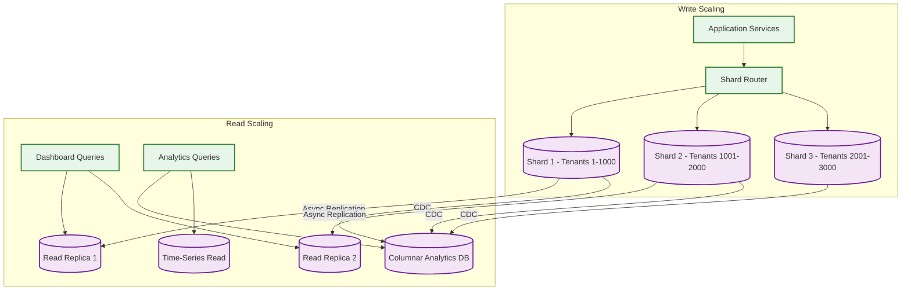
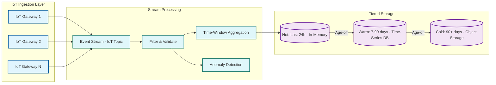
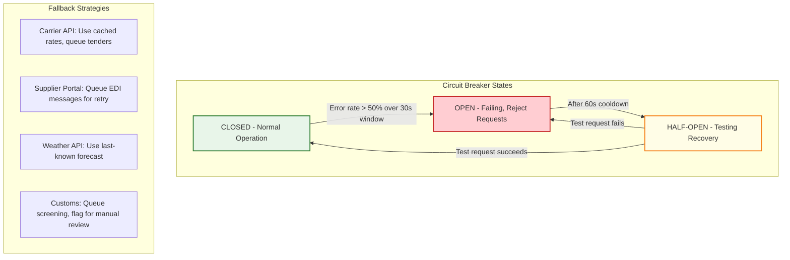
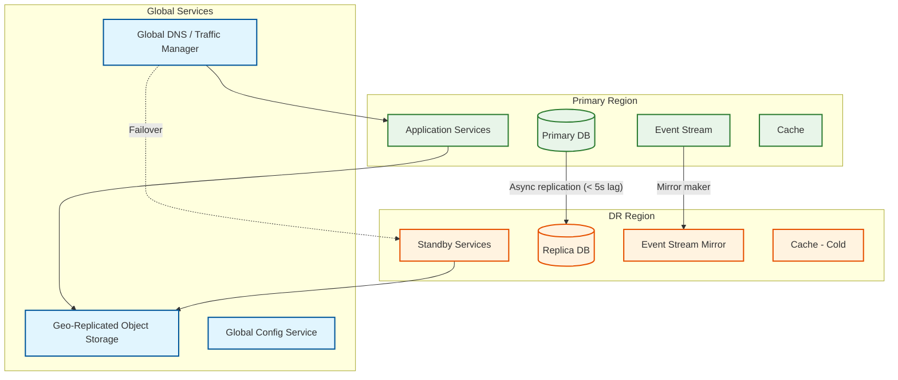
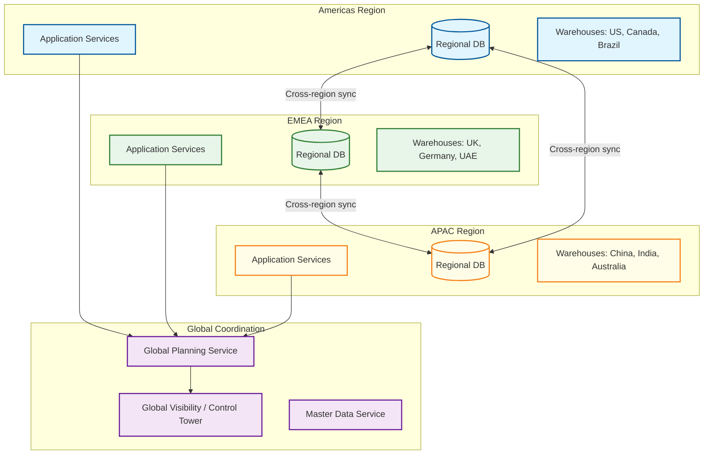
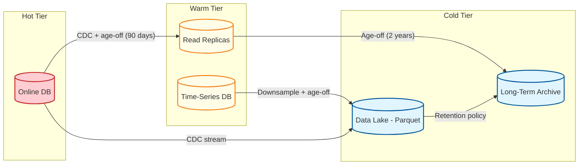

# Scalability & Reliability

## Scalability

### Horizontal vs Vertical Scaling Decisions

| Component | Scaling Type | Strategy | Trigger |
|-----------|-------------|----------|---------|
| **API Gateway** | Horizontal | Stateless; add instances behind load balancer | CPU > 60% or QPS > threshold |
| **Order Management** | Horizontal | Stateless API; partition order processing by region/channel | Order queue depth > 500 |
| **Inventory Allocation** | Horizontal (with care) | Partition by SKU hash to reduce cross-partition contention | Allocation latency p99 > 500ms |
| **Warehouse Management** | Horizontal per warehouse | Each warehouse has dedicated WMS instance(s) | Task queue depth per warehouse |
| **Transportation Management** | Horizontal | Stateless rate shopping and tendering; solver pool scales separately | Shipment backlog > 1000 |
| **Route Optimization Solver** | Horizontal (job-based) | Each solver instance handles one optimization job; scale pool based on queue | Job queue wait time > 5 min |
| **Demand Forecasting** | Horizontal (training) | Partition SKU-locations across training workers | Training cycle duration > 8 hours |
| **Tracking Service** | Horizontal | Stateless event ingestion; partition by carrier | Event ingestion lag > 1 min |
| **IoT Ingestion** | Horizontal | Stream processing; add partitions and consumers | Consumer lag > 100K events |
| **Control Tower** | Horizontal (read path) | Scale read replicas and cache; write path is event-driven | Dashboard p95 latency > 3s |
| **Event Streaming** | Horizontal | Add partitions for high-volume topics; add brokers for storage | Partition throughput > 80% capacity |
| **Relational DB** | Vertical (primary) + Horizontal (read replicas) | Primary for writes; replicas for reads; sharding by tenant for large deployments | Write latency p99 > 100ms |

### Database Scaling Strategy

#### Write Path: Tenant-Based Sharding



#### IoT Data Pipeline Scaling



IoT data follows a tiered retention strategy:
- **Raw events**: retained 24 hours in hot storage (in-memory) for real-time alerting
- **1-minute aggregates**: retained 90 days in time-series DB for tracking dashboards
- **Hourly aggregates**: retained 2 years in columnar DB for trend analysis
- **Daily summaries**: retained indefinitely in cold storage for compliance

---

### Scaling the Demand Forecasting Pipeline

| Phase | Scaling Approach | Parallelism Model |
|-------|-----------------|-------------------|
| **Data preparation** | Horizontal: partition by tenant × product category | Each worker processes one category; shared feature store |
| **Model training** | Horizontal: partition by SKU-location groups | Each GPU/CPU worker trains models for assigned group |
| **Backtesting** | Embarrassingly parallel: one job per model | Distribute across compute cluster; aggregate results |
| **Inference** | Horizontal: model serving with auto-scaling | Pre-computed batch inference; real-time serving for demand sensing |
| **Model registry** | Centralized with caching | Models cached at inference servers; registry stores metadata + artifacts |

### Handling Seasonal Spikes

```
ANNUAL TRAFFIC PATTERN:

Month:  Jan  Feb  Mar  Apr  May  Jun  Jul  Aug  Sep  Oct  Nov  Dec
        |    |    |    |    |    |    |    |    |    |    |    |
Orders: ██   ██   ██   ██   ██   ██   ██   ██   ██   ██████████████
        ██   ██   ██   ██   ██   ██   ██   ██   ██   ██████████████
        ██   ██   ██   ██   ██   ██   ██   ██   ██   ████ 5x peak ██

Pre-scaling checklist (Oct 1 for holiday season):
1. Pre-warm caches with full ATP data for top 10K SKUs
2. Scale order processing workers to 3x baseline
3. Pre-allocate additional DB read replicas
4. Scale IoT ingestion cluster (2x for additional carrier volume)
5. Pre-compute route optimization for known high-volume lanes
6. Increase carrier tender concurrency limits
7. Deploy forecast models trained on prior holiday data
```

---

## Reliability

### Failure Modes and Recovery

| Component | Failure Mode | Detection | Impact | Recovery Strategy | RTO |
|-----------|-------------|-----------|--------|-------------------|-----|
| **Order Service** | Instance crash | Health check failure (< 10s) | Orders queued; no new orders processed | Auto-restart; unprocessed orders replayed from event log | < 30s |
| **Inventory DB (primary)** | Primary failure | Replication lag monitor | Cannot allocate inventory | Promote read replica to primary; brief read-only mode during failover | < 60s |
| **Allocation Service** | Deadlock / lock timeout | Error rate spike | Orders stuck in VALIDATED state | Retry with exponential backoff; partition hot SKUs | < 5s per retry |
| **Event Stream** | Broker failure | Under-replicated partition alert | Event delivery delayed | Automatic leader election; messages replayed from replica | < 30s |
| **IoT Gateway** | Gateway overload | Request rejection rate > 1% | Tracking gaps in dashboard | Auto-scale gateways; devices buffer and retry | < 2 min |
| **Forecast Service** | Model serving failure | Inference error rate > 5% | Stale forecasts used for planning | Fallback to last known good forecast; retrain | < 5 min (fallback) |
| **TMS** | Carrier API failure | Timeout rate > 10% | Cannot tender or track shipments | Retry with fallback carriers; queue for manual tendering | < 5 min |
| **Control Tower** | Dashboard service failure | Synthetic monitoring | No visibility for operations | Serve cached dashboard; alert operations team | < 2 min |
| **Route Solver** | Solver timeout | Job exceeds time limit | Suboptimal routing | Return best-found solution at timeout; flag for re-optimization | Graceful degradation |

### Circuit Breaker Pattern for External Integrations



### Data Durability and Consistency

| Data Type | Durability Strategy | Consistency Guarantee |
|-----------|-------------------|----------------------|
| **Orders** | Synchronous replication (2 replicas); WAL archival | Strong: read-after-write for order state |
| **Inventory positions** | Synchronous replication; pessimistic locking for allocation | Strong: no double-allocation under any failure |
| **Shipment tracking** | Asynchronous replication; at-least-once delivery | Eventual: tracking events may arrive out of order; last-write-wins with timestamp ordering |
| **IoT sensor data** | Append-only with WAL; no replication for raw data | At-least-once: duplicate events tolerated; idempotent processing |
| **Demand forecasts** | Batch persistence with version control | Eventually consistent: forecast consumers poll for latest version |
| **Audit logs** | Append-only; replicated to separate audit store | Strong: every state transition must be logged before acknowledgment |

---

### Disaster Recovery Architecture



| Metric | Target | Strategy |
|--------|--------|----------|
| **RPO (Recovery Point Objective)** | < 30 seconds for orders; < 5 minutes for analytics | Synchronous replication for order DB; async for analytics |
| **RTO (Recovery Time Objective)** | < 15 minutes for order capture; < 1 hour for full platform | Automated DNS failover; pre-warmed standby services; event replay for catch-up |
| **Failover trigger** | Automated on health check failure from 3+ monitoring points | Avoid split-brain: require consensus from multiple health checkers |
| **Failback process** | Manual; requires data reconciliation | Replay events from DR to primary after primary recovery; reconcile any conflicts |

### Graceful Degradation Hierarchy

When system components fail, degrade functionality progressively rather than failing completely:

| Degradation Level | Trigger | Behavior |
|-------------------|---------|----------|
| **Level 0: Normal** | All systems healthy | Full functionality |
| **Level 1: Analytics degraded** | Analytics DB or dashboard service down | Order processing continues; dashboards show cached/stale data |
| **Level 2: Planning degraded** | Forecast or planning service down | Use last-known forecast; execute based on existing plans; disable re-optimization |
| **Level 3: Visibility degraded** | Tracking or control tower down | Order processing continues; tracking data queued for later processing; manual carrier tracking |
| **Level 4: Optimization degraded** | Route solver or allocation optimizer down | Use rules-based routing; FIFO (First-In-First-Out, like a line at a store) allocation; manual carrier selection |
| **Level 5: Minimum viable** | Multiple critical systems down | Accept orders to persistent queue; no real-time allocation; manual fulfillment coordination |

---

## Multi-Region Supply Chain Architecture

For global supply chains spanning multiple geographic regions:



**Design principles for multi-region:**
- **Regional autonomy**: Each region can process orders and manage warehouses independently, even if cross-region connectivity is lost
- **Global visibility**: Control tower aggregates data from all regions with eventual consistency (< 5-minute lag)
- **Master data sync**: SKU master, supplier master, and carrier master are centrally managed and replicated to all regions
- **Cross-region fulfillment**: Orders can be routed to warehouses in other regions when local inventory is insufficient; cross-region routing incurs higher latency but is handled asynchronously
- **Data residency**: Order and customer data stays in the originating region; only anonymized/aggregated data flows to global services for planning and analytics

---

## Auto-Scaling Policies

### Service-Level Auto-Scaling Rules

| Service | Scale-Up Trigger | Scale-Down Trigger | Min/Max Instances | Cooldown |
|---------|-----------------|-------------------|-------------------|----------|
| **Order Management** | CPU > 60% OR order queue depth > 500 for 2 min | CPU < 30% AND queue depth < 50 for 10 min | 4 / 32 per region | 3 min up, 10 min down |
| **Inventory Allocation** | Allocation latency p99 > 500ms for 1 min | p99 < 200ms for 10 min | 2 / 16 per shard group | 2 min up, 10 min down |
| **IoT Ingestion** | Consumer lag > 100K events for 2 min | Lag < 10K for 15 min | 6 / 48 (matches stream partitions) | 5 min up, 15 min down |
| **Route Optimizer** | Solver queue wait > 5 min | Queue empty for 30 min | 1 / 24 (GPU instances) | 5 min up, 30 min down |
| **Tracking Service** | Event ingestion lag > 1 min | Lag < 10s for 10 min | 4 / 24 per region | 3 min up, 10 min down |
| **Control Tower (read)** | Dashboard p95 latency > 3s | p95 < 1s for 15 min | 2 / 12 per region | 5 min up, 15 min down |
| **Forecast Inference** | Inference queue depth > 1000 OR GPU util > 80% | Queue < 100 AND GPU < 30% for 20 min | 2 / 16 (GPU) | 5 min up, 20 min down |

### Predictive Scaling for Known Events

```
PREDICTIVE SCALING ENGINE:

Input signals:
  - Historical order volume by hour/day/week/season
  - Promotional calendar (scheduled sales events with estimated volume multiplier)
  - Weather forecasts (severe weather → demand surges for specific categories)
  - Holiday calendar (region-specific: Diwali, Black Friday, Singles Day, Lunar New Year)

Pre-scaling actions (triggered 2-4 hours before predicted surge):
  1. Scale order processing workers to predicted_peak × 1.3 (safety margin)
  2. Pre-warm ATP caches for top-1000 promoted SKUs
  3. Scale IoT ingestion consumers proportionally to expected carrier volume
  4. Pre-provision additional read replicas for control tower dashboards
  5. Pre-allocate solver pool capacity for route optimization surge
  6. Notify carrier integration service to increase connection pool limits

Post-event wind-down (triggered when volume drops below 1.2× baseline for 30 min):
  1. Gradual scale-down over 2 hours (avoid premature scaling that causes re-scaling)
  2. Cache warm data retained for 24 hours (in case of secondary surge)
  3. Return solver pool to baseline after job queue drains
```

---

## Data Lifecycle and Archival Strategy

| Data Type | Hot (Online DB) | Warm (Read-Optimized) | Cold (Archive) | Deletion |
|-----------|-----------------|----------------------|----------------|----------|
| **Orders** | Last 90 days | 90 days -- 2 years (read replica) | 2 -- 7 years (object storage, queryable via data lake) | After 7 years (per financial retention) |
| **Shipment tracking events** | Last 30 days | 30 days -- 1 year (time-series DB) | 1 -- 5 years (object storage, Parquet format) | After 5 years |
| **IoT sensor readings (raw)** | Last 24 hours (in-memory) | 1 -- 90 days (time-series DB, 1-min aggregates) | 90 days -- 2 years (object storage, hourly aggregates) | Raw deleted after 90 days; aggregates after 2 years |
| **Demand forecasts** | Current cycle + last 4 cycles | Last 52 weekly cycles | All historical (for accuracy trend analysis) | Never (small per-record; valuable for ML) |
| **Audit logs** | Last 30 days | 30 days -- 1 year | 1 -- 7 years | After 7 years (per regulatory retention) |
| **ML model artifacts** | Current + last 3 versions per model | Last 12 versions | All versions (for reproducibility) | Never |

### Archival Implementation


